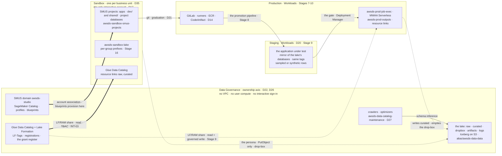
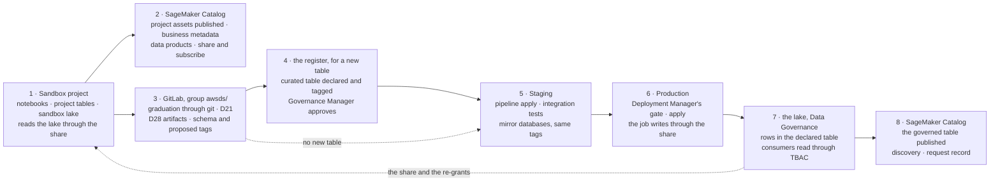

# Data governance — the model

The governance of data in this estate: what each account holds, the systems that describe and control
the lake (the Glue Data Catalog, Lake Formation, the SageMaker Catalog), the LF-Tag ontology, the
classification rules, the grant model, the two designed copy destinations (drop-box in, derived zone
out), and the cycle a data product follows from a Sandbox project to a governed table. The ontology and
the grant model were decided by the user on 2026-08-18 (Stage 5a decisions 1-3, recorded in
[`docs/log/log-stage-05a-data-foundation.md`](log/log-stage-05a-data-foundation.md)). The dimension the
plan called `zone` is `layer`, and `domain` is `businessunit`; stage text predating 2026-08-18 reads
accordingly.

The `security-zone` dimension was withdrawn by the user on 2026-08-19. The ontology has no encryption
dimension: encryption is per account (one data CMK per account, §Encryption), assigned to buckets by
Terraform, and no catalog attribute carries it. Text predating the revision reads `security-zone=zn-lab`
where §Encryption now answers.

*Read with [`docs/plan/stages/stage-05a-data-foundation.md`](plan/stages/stage-05a-data-foundation.md)
(the lake's build steps), [`docs/plan/stages/stage-06f-data-governance.md`](plan/stages/stage-06f-data-governance.md)
(the catalog's measurements and open decisions) and [`docs/plan/conventions.md`](plan/conventions.md)
(naming). The applied grants are registered in [`docs/AWS_STATE.md`](AWS_STATE.md) §"Lake Formation
grant register". §"The development cycle of a data product" rests on Stages 7-10, which are planned: a
sentence about a stage not yet built names that stage.*

## Accounts — where each thing lives

The account is the only hard boundary (`README.md` §Account segregation), and governance uses it on two
axes: the lake sits on the ownership axis, in one account that holds state and no compute (D22); the
places code runs sit on the lifecycle axis, Sandbox → Staging → Production (D17, D20). The SageMaker
Unified Studio domain sits with the lake, a registry and never a runtime (D26), and only the interactive
accounts are associated with it.

| Account | Holds, on the governance side | Reaches the lake | In the domain |
|---|---|---|---|
| Data Governance | the lake buckets (§Persistence), the lake's Glue Data Catalog, Lake Formation with the LF-Tags and the D13 registrations, the drop-box, the crawlers (D27), the domain and the SageMaker Catalog. No user compute, no interactive sign-in (D22) | owns it | hosts it; the portal's catalog calls run here as `awsds-data-studio-domain-execution` (measured 2026-09-13) |
| Sandbox | the projects' apps, the projects bucket `awsds-sandbox-smus-projects`, a Glue Data Catalog of its own holding each project's databases and the resource links to `raw` and `curated`, and the sandbox lake `awsds-sandbox-lake`, outside Lake Formation by design (Stage 16) | read, through the TBAC share and the local re-grants (§Grants), which name the persona role: no project role holds one yet, so no project reads the lake (Stage 6f 0.7). The one write is the persona's `PutObject` into the drop-box | associated; every project provisions here |
| Staging | a mirror of the lake's databases with the same LF-Tag keys and values, over sampled or synthetic rows local to it (Stage 9 4.1) | no share (D20) | never (D26, `DenyDataZoneEntirely`) |
| Production | the supply chain (D14), the job execution role, the orchestration (Stage 10), `awsds-prod-outputs`, a Glue Data Catalog of its own with resource links to the lake (Stage 9 1) | read and the governed write, the producer path (Stage 9 2); the drop-box pickup (D25) | never |

The Staging and Production rows describe Stage 9; neither data slice is built.

**The warehouse adds a store to two of those rows** (D40, 2026-09-19, neither built). **What the brief calls
a *base* is a Redshift `schema`** (`objectives.md`, 2026-09-20), so the Redshift `database` is only a class
container and every grain below is per schema. `Sandbox` gains `awsds-sandbox-warehouse` with one `sandbox`
database of themed schemas, outside Lake Formation like the sandbox lake beside it;
`Production` gains `awsds-prod-warehouse` with its the `governed` database, inside Lake Formation as a federated
catalog. `Data Governance` gains **nothing** — a Redshift Serverless workgroup needs subnets, that account has
no VPC by decision, and the same absence that sends INT-13 to its manual fallback sends the warehouse to the
two accounts that have VPCs. `Staging` gains nothing either: D20 keeps a deployment target off the lake, and
a warehouse it has no writer for would be a second mirror to maintain.

## Persistence — the buckets

Two bucket families, split by the account line. "Who may read" is expressed by a different mechanism on
each side: in the lake it is Lake Formation and the bucket policies; in the consumer accounts it is a
CMK's key policy (D31 — the project CMK since D19's 2026-08-26 revision, the account data CMK before it).
Both tables carry a delete column: in a governed store, who may remove data is as designed a fact as who
may write it.

### The lake — Data Governance account

All five live in the Data Governance account, encrypted SSE-KMS under that account's data CMK
(§Encryption), versioned, public access blocked, and undeletable while the `Data` OU SCP is attached
(`DenyLakeDeletionAndDeregistration`), so every name below is permanent. No object expires: the only
lifecycle rule is the module's 90-day expiry of noncurrent versions. At the object grain, delete exists
at two points, both in the table; one of them is still Stage 9's.

| Bucket | What it holds | Who writes | Who reads | Who deletes |
|---|---|---|---|---|
| `awsds-data-dropbox` | `raw`-layer files published by users for pipeline consumption | Interactive-OU personas, `PutObject` only (§Drop-box) | the crawler (schema); the Production job, Stage 9 | the Production job, Stage 9 — the pickup that empties the letterbox. The writer holds no delete, no read-back, no list |
| `awsds-data-raw` | untreated bases — copies of legacy-system data | the governed producer path only (Stage 9's write share; nothing writes today) | consumers via LF (both layers are readable — data engineers develop the raw→curated ETL) | nobody — no principal holds `s3:DeleteObject`; whether Stage 9's producer path needs one is that stage's to write |
| `awsds-data-curated` | transformed bases, built by ETL routines from `dropbox`+`raw` | the governed producer path only (Stage 9) | consumers via LF — the primary read surface | the maintenance role, on `warehouse/*` only (`CompactCuratedWarehouse`): Iceberg compaction rewrites data files and removes the superseded ones (D27) |
| `awsds-data-artifacts` | non-tabular artifacts that must live under the lake's governance. No designed writer is wired yet: the bucket exists from Stage 5a's four-bucket set, and its first writer is named by the pipeline stage that needs it (8/9 — Stage 9's *model* artifacts live in Production, not here). Since 2026-08-20 it holds a handful of Athena result/metadata objects under `athena-results/`, written by `InfrastructureAccess` in-account queries during the sample-row load — an incidental writer that disappears when 4e closes in-account Athena | — (none today) | — | — |
| `awsds-data-logs` | the Stage 11 CloudTrail data-event trails, delivered cross-account under `AWSLogs/<account>/` | CloudTrail (from Stage 11 on) | Stage 11's detection tooling | nobody today — a retention rule, if one ever arrives, is Stage 11's to write |

`raw` and `curated` are LF-registered locations — access only through Lake Formation (D13). `dropbox`,
`artifacts` and `logs` are not registered: plain IAM/bucket-policy control (D13's non-registered class).

### The derived zone — the SMUS project path

The lake's exit side, seen as persistence. Until 2026-08-26 it was `awsds-<env>-derived`, one designed
bucket per consumer account with three prefix families (`results/`, `derived/${aws:userid}/`,
`scratch/`), applied at Stage 5a pass 4 through the `consumer-data` module.
[D19's revision of that date](plan/decisions/D19-derived-zone.md) removed it: Stage 6 step 2.4's reading
found the Tooling blueprint already builds, per project, an enforced results location and a mounted
working folder, and the user kept the service's. The old zone's who-does-what table is D19's and the
module history's.

The derived zone is `awsds-<env>-smus-projects` — one bucket per Interactive member account (Stage 6,
`sagemaker-prereqs` v0.3.2), the tree inside it managed by SMUS as `<domain-id>/<project-id>/<scope>/`:

| Scope | What it holds | Who writes | Who reads | Who deletes |
|---|---|---|---|---|
| `<project>/dev/` | the project's system outputs — its enforced Athena workgroup writes query results to `dev/sys/athena/` (`EnforceWorkGroupConfiguration = true`, measured 2026-08-26), connectors beside it; the portal's file uploads under `dev/local-uploads/<epoch-ms>/`, each folder the location of the Glue table the upload created; `dev/data/catalogs/`, the `LocationUri` of a database created in the portal (both measured 2026-09-12) | the project role (Athena stages results with the querying session's credentials — always the project role in SMUS) | project members, through the project role; Athena through Lake Formation, because the scope is LF-registered (below); the laptop via a per-project S3 Access Grant (`docs/SMUS.md` §S3 item 1a) | nobody today — no lifecycle rule reaps a current object, and a deleted project keeps its prefix (measured; open question 25) |
| `<project>/shared/` | the project's working files — mounted as the shared folder in JupyterLab and Code Editor (the old `scratch/` role, at project grain) | the project role | idem | the project role (ordinary working-folder semantics, SMUS's) |

Where it stands against the removed zone's design differences:

- the CMK is the **project CMK**, `alias/awsds-<env>-project` — the §Encryption exception, and since the
  re-homing also D31's carrier: its policy names the datazone service principals, the domain execution
  role and the project roles — not the persona, not the approver (whose own `kms:Decrypt` deny is D31's
  surviving half);
- nothing expires — the one difference that is a gap rather than a design, and it is open question 25:
  the removed zone shed at 30 days so a copy was never permanent; this bucket holds the same class of
  data indefinitely, orphaned project prefixes included. The bucket is Terraform's, so a rule is addable
  without touching what SMUS manages;
- the write/containment grain is the project, not the person — Stage 5a decision 6's grain one level up;
  per-write attribution is Stage 11's data events;
- `<project>/dev/` is LF-registered and `shared/` is not (measured 2026-09-12). SMUS registers the
  `dev/` scope when it creates a project, with the project role as registration role and hybrid access
  off, and deregisters it when it deletes the project, leaving the prefix. The service grants over that
  scope, and over the databases and tables a project creates, to every IAM principal and Identity
  Center user of the account under a condition naming the project (`docs/SMUS.md` §S3 item 1b). Athena
  reads a table under `dev/` with credentials Lake Formation vends. A direct S3 call is decided by IAM,
  the managed policies' path shape (`*/dzd*/<project>/…`), the project CMK and S3 Access Grants over
  the project prefix.

Stage 11 inherits the bucket by name (Macie scan scope, data-event trail map — `./aws/dlp.py` `DP-4`
reads it): Stage 11 cannot discover a destination nothing points at, and an orphaned prefix is invisible
to any scope written from the live project list.

## Encryption — one data CMK per account

Every data bucket encrypts SSE-KMS under the data CMK of the account it lives in — decided 2026-08-19 by
the user, replacing the `security-zone` dimension. One alias pattern, `alias/awsds-<env>-data`: the
lake's five buckets under `alias/awsds-data-data` in Data Governance; `alias/awsds-sandbox-data` carries
the sandbox lake (Stage 16), and carried the derived zone until D19's 2026-08-26 revision removed it;
`alias/awsds-dev-data` is held empty for that account's next data bucket; Production's arrives with
Stage 9 (`alias/awsds-prod-data`, that stage's re-read). The `tfstate` keys (Stage 2), the PKI key (D36)
and each Interactive account's project CMK (`alias/awsds-<env>-project`, Stage 6 — the SMUS projects
bucket `awsds-<env>-smus-projects` and the blueprint-provisioned volumes sit under it since 2026-08-22;
its key policy carries the documented SMUS statement set and is
`terraform-modules/sagemaker-prereqs/kms.tf`'s) are separate objects: "the account's data CMK" is one
key per account for *data*, not a merger of every key in the account. A key that also served Terraform
state and every other job in the account could not express "who may read derived data" (D31). The
lake's own `logs` bucket *is* data and sits under the data key.

The binding is mechanical and per bucket: each bucket's default-encryption configuration points at the
account key (the `s3-bucket` module's `kms_key_arn`), so a bucket belongs to exactly one key and the key
boundary is a bucket boundary. No catalog attribute is involved anywhere in the chain.

What the single key costs (Stage 5a decision 3's deviation): INT-10's key grants — the Production job
role and the maintenance role need the drop-box's key — land on the account key, so at the KMS layer
those principals reach every lake bucket. The drop-box's isolation therefore rests on the S3 statements
and Lake Formation alone; the KMS layer separates accounts, not buckets. Revision trigger: the first
dataset whose blast radius argues for a key of its own — S3 Bucket Keys make re-keying a bucket-level
change, not a migration.

The consumer key is not the lake's key. Sharing the lake's key across the account line was declined
(2026-08-19) on a measurement: `AllowProductionPickupDecryptViaS3` on the lake key grants `kms:Decrypt`
to `awsds-prod-job-exec` with no bucket scoping — only `kms:ViaService=s3` and the role ARN — so a
consumer's derived zone under that key would put Production's job role over that account's materialised
`restricted` copies, with S3 as the only remaining barrier. It would also put a cross-account KMS
dependency under a local working bucket. Per-account keys close both.

D31 is what the per-account key delivers: the key policy in each consumer account says who may read the
copies — `DataScientistAccess` today, the project execution roles from Stage 6 — and it delegates
administration to the account root while withholding every cryptographic action, so no IAM policy in
the account can grant `Decrypt` behind it.

The rule's origin (withdrawn 2026-08-19, the user's revision): encryption entered the ontology on
2026-08-18 as the LF-Tag `security-zone` (one value, `zn-lab`), on the premise that the tag carried the
key. It never did: an LF-Tag attaches to catalog objects and gates TBAC grants; a CMK is assigned to a
bucket by Terraform; no AWS mechanism connects the two, and no TBAC expression ever used the tag. The
tag, its `zn-lab` value and the `ASSOCIATE` grant on it were removed, and the keys were renamed from
`awsds-<env>-zn-lab` to `awsds-<env>-data` — the same key objects, an alias rename, no re-encryption,
no cost change.

## Catalogs — the Glue Data Catalog, Lake Formation and the SageMaker Catalog

The systems that describe and control the lake, and the word "catalog" names two of them: the first
holds the objects, the second the permissions over them, the third the business view of them.

| | Glue Data Catalog | Lake Formation | SageMaker Catalog (DataZone V2) |
|---|---|---|---|
| Holds | databases, tables, schemas, S3 locations, resource links | grants on those objects, LF-Tags, registered locations, data cells filters | assets, listings, data products, glossaries, metadata forms, subscriptions, lineage nodes, domain units |
| Scope | one per account and Region | one per account and Region | the domain, across its associated accounts and Regions |
| In this estate | the lake's, in Data Governance; each consumer's own, holding resource links and, in Sandbox, the projects' databases | the register's TBAC shares from Data Governance; the conditioned grants SMUS writes in Sandbox | the domain `awsds-studio` in Data Governance; Sandbox the only associated account |
| Written by | Terraform, the crawlers (D27), the engines, the SMUS provisioning role and the project role | Terraform (the register), the SMUS service roles | the portal, as `awsds-data-studio-domain-execution` |
| Its question | what tabular data exists, and where | who may read which database, table, column and row | what the data means, who owns it, who asked for it and who approved |

A publish writes to the third column only (measured 2026-09-13). Access reaches the second column when a
subscription or a Share is fulfilled (INT-23, unexercised), and Lake Formation answers every query,
whichever column the request came through.

A data product, the lake and a warehouse are different things. A data product is a catalog object, a
set of assets under one listing, and stores nothing. The lake is where the governed tables live,
Iceberg on S3 in the lake's Glue Data Catalog. A Redshift warehouse is a store and an engine: it reads
the Glue Data Catalog through its auto-mounted `awsdatacatalog` database, read-only, and a namespace
registered to the catalog becomes a federated catalog governed by Lake Formation.

**A warehouse is built, since [D40](plan/decisions/D40-redshift-warehouse.md) (2026-09-19) — and the
`RedshiftServerless` blueprint is still excluded.** [`objectives.md`](plan/objectives.md) carries the
requirement since 2026-09-20 and its wording is what this section implements: Redshift is a **second possible
engine**, the lake stays the **warehouse of record**, *"the governance model does not fork"*, and *"the
controls do not change — Redshift is one more execution environment"*, not a new class of reader. Two rules
follow and they are requirements rather than readings: a **governed** Redshift database is read by whoever the
grant register already admits, **through Lake Formation**, and it is therefore never reached by a SageMaker
connection; the **per database × project** grant is the sandbox class's rule and *"the only new rule here"*. The distinction is the whole of that decision: what D26
and D12 refused was a warehouse **any project member could provision in one click**, sized by the service at
128 RPUs and capped by nothing. What exists instead is **one warehouse per account that has one**, written by
Terraform at the documented floor of 4 base RPUs with a usage limit in the same apply, reached by a SageMaker
project through a **connection** to an existing compute resource — the same shape Stage 16 used for the
sandbox lake. Two classes of database, on the two axes this file already separates:

| Class | Account | Written by | Under Lake Formation | Stage |
|---|---|---|---|---|
| **sandbox** — themed **schemas** in the `sandbox` database | `Sandbox` | SageMaker project roles, per **schema × project**, and one schema may be shared by several projects | **no, and the catalog is bypassed entirely** — `objectives.md` (2026-09-20) grants the project role directly and lets a member create tables freely in the schema, which carries a **1 TB `QUOTA`** and is owned by a role, never by a project. Like `awsds-sandbox-lake`, outside Lake Formation by design | [5b](plan/stages/stage-05b-redshift-serverless.md), [6h](plan/stages/stage-06h-redshift-connection.md) |
| **governed** — the `governed` database | `Production` | `awsds-prod-job-exec` alone | **yes** — the namespace registered as a **federated catalog** | [9](plan/stages/stage-09-deployment-targets.md) step 9 |

Three consequences this file has to carry rather than leave to a stage:

- **The two classes are governed by different systems, by requirement.** A governed schema is a Lake Formation
  resource; a sandbox schema is **outside the catalog altogether**, and what stands between two schemas there
  is a **role per schema**, granted to each admitted project, with the schema's **1 TB `QUOTA`** bounding how
  much may be written into it. Two projects sharing one schema is the normal case, not the exception. Reading a sandbox schema
  as if the register described it is the mistake to avoid: it does not, and `WH-13` is what says so.
- **A Redshift `GRANT` is a fourth permission system**, beside IAM, Lake Formation and S3 Access Grants. It
  carries no LF-Tag, it is not readable by `list-permissions` — only from `SVV_*` inside a database session —
  and nothing in a Terraform plan shows it. It gets its own register table in
  [`docs/AWS_STATE.md`](AWS_STATE.md) rather than a row beside the LF grants.
- **The governed class is the first governed store outside Data Governance**, which is D22's line. The
  federated-catalog registration is the compensation and the **grant register gains a second grantor account**.
- **A sandbox schema is D19's shape in a fourth store**: a project can write into it anything it can read,
  a governed copy included. The copy is not prevented; the destination is inside the perimeter, under the
  account's own data CMK, and Lesson 1 applies — a copy somewhere less governed is not a hole to be closed.

Stage 6f step 8 wrote the institutional pattern this half-implements, and
[`plan/institutional-delta.md`](plan/institutional-delta.md)'s warehouse row carries what is still missing:
one permission system over both storage engines, which is exactly what the the sandbox class does not have.

### Glue Data Catalog

The technical catalog: a regional, per-account metadata store with the hierarchy database → table
(schema, S3 location, format) → columns. Everything that queries the lake — Athena, Glue, EMR — reads
schemas from it; the lake's tables are Iceberg, which is catalog-native (table state lives in the
catalog plus metadata files, so no crawler ever points at one). A resource link is a local database
object pointing at a database in another account's catalog, the consumer side of every share here.

Its role in the plan: the single source of what tabular data exists, and the substrate every Lake
Formation permission attaches to. Databases in the lake's catalog: `raw`, `curated` and `dropbox` — the
letterbox's metadata home (§Drop-box); its bucket stays unregistered. Crawlers (under
`awsds-data-catalog-maintenance`, D27) infer schema only where it arrives from outside — the drop-box
and the raw zone. In Sandbox's catalog a project's databases are written by the SMUS provisioning role
and its tables by the project role (`docs/SMUS.md` §S3 item 1b). The business catalog is a storey on
top; this catalog remains the foundation.

### Lake Formation

What it provides, in the order this plan uses it:

1. **Registration** of S3 locations — turns "whoever holds `s3:GetObject` reads the files" into "the
   engine asks Lake Formation" (the mechanism behind D13);
2. **The permission layer** — grants at database/table/column grain (row filters arrive at Stage 11),
   in two attribute-based forms (§Access control);
3. **LF-Tags** — the attribute system below, with inheritance and tag-based grants (LF-TBAC);
4. **Cross-account sharing** through RAM — how Sandbox reaches the lake (INT-03; Development's share
   was revoked on 2026-09-06 at Stage 6b step 2.3), with the version-4 parameters `DL-5` defends
   (INT-11).

Its role: the enforcement point. Execution roles hold no S3 permission on registered prefixes, so every
tabular read goes through an LF-aware engine and meets the grants — what makes the fine-grained access
objective a control rather than a decoration (D13). A principal's effective permissions are the union of
every grant it holds, named-resource and LF-Tag alike, data filters included, and a request has to pass
both IAM and Lake Formation (`docs/REFERENCES.md`, Lesson 28).

### SageMaker Catalog

The business catalog, an Amazon DataZone V2 domain: `awsds-studio`, in Data Governance (D26). Its unit
of work is the project: a project owns what it publishes, its members approve who reads it, and every
project is provisioned into an associated account, Sandbox alone (`docs/SMUS.md`). What it offers, and
where each stands here:

| Feature | What it is | Here |
|---|---|---|
| Asset and listing | a catalog entry for a Glue table, a Redshift table or view, or a custom asset type; *publish* creates the listing other projects search | `house-price` published 2026-09-13; metadata only, no grant written |
| Business metadata | business names and descriptions, generated on request, glossary terms, metadata forms, a README per asset | a glossary or form for `classification`: Stage 6f 4.1-4.2; the generation: decision due 3 |
| Data product | a set of assets published and subscribed as one | `my-data-product`, 2026-09-13 |
| Subscription | a consumer project requests, the owner project approves, DataZone fulfils: a Lake Formation grant in the table's account for a managed asset (INT-23), an EventBridge event for an unmanaged one, whose owner grants | unexercised; Stage 6f step 2 |
| Direct Share | the owner gives an asset (S3, Glue, QuickSight) to chosen projects, users or groups; for S3, without a subscription request | decision due 5 |
| Lineage | OpenLineage nodes from instrumented engines and from publishing (§Data lineage) | two nodes measured 2026-09-13 |
| Domain units and authorization policies | who may create projects, glossaries and forms, and where; one unit per business data domain in the institutional pattern | Stage 6f step 9, `institutional-delta.md` |

What it does not do: grant by an LF-Tag. DataZone documents no LF-TBAC support for the Glue assets it
manages, and its grant is a named-resource grant (§Access control). Publishing wrote nothing to Lake
Formation (measured 2026-09-13), and whether a published asset shows its tags is Stage 6f 4.1. The
lake's entitlement stays in the register; the catalog carries discovery, ownership, the request record
and the projects' own assets (Stage 6f decision due 1).

## LF-Tags

An LF-Tag is a key-value pair Lake Formation uses to control data access by attribute: data is grouped
and protected through these labels instead of being permissioned per table or column.

An LF-Tag is assigned to databases, tables and columns. Assignments inherit downward — database → its
tables → their columns — unless overridden at the lower level. The Glue Data Catalog holds the objects;
Lake Formation holds the tags, the inheritance and the grant evaluation.

| Tag key | Description |
|---|---|
| `classification` | Information classification for **DLP** purposes |
| `layer` | Where in the data pipeline the dataset sits — its maturity degree |
| `businessunit` | The owning business unit — **reserved**, no values at N=1 |

A third key, `security-zone`, existed 2026-08-18/19 and was withdrawn — encryption is per account and
carries no catalog dimension (§Encryption).

Assigning LF-Tags to datasets is the Governance Manager's responsibility.

### `classification`

| Value | Meaning |
|---|---|
| `public` | public data — could be published without harm |
| `internal` | ordinary working data |
| `restricted` | leakage causes real damage |
| `personal` | contains identifiable-person data (LGPD scope) |

The default-grant rule: `public` and `internal` carry a read-only grant for all users by default. Every
other classification is denied by default — access exists only through an explicit, enumerated grant
(§Grants).

`classification` says how sensitive a thing is, not whether it is a thing people read; the default grant
therefore carries a `layer` gate as well (§`layer`, §Grants). The drop-box is the case that proved it:
it carries `classification=internal` for the fail-open reason below, and a grant written on
`classification` alone would have shared the letterbox (found 2026-08-19, at the apply).

Unclassified `raw` bases receive `classification=internal` by default: the `raw` database carries the
tag and new tables inherit it. This is the fail-open choice (2026-08-18, against the fail-closed
recommendation), so ETL development is not gated per dataset; its consequence is that an unclassified
arrival is readable by every user until someone reclassifies it, and the detective backstop (Macie)
only arrives at Stage 11.

`curated` carries no database default: tables there are classified explicitly at creation. An untagged
curated table matches no TBAC expression and is invisible to the default grants — fail-closed by
absence, the designed asymmetry between the two registered layers.

### `layer`

| Value | Meaning |
|---|---|
| `dropbox` | data supplied as unstructured user files |
| `raw` | untreated bases — legacy-system copies |
| `curated` | transformed bases, built by ETL from `dropbox`+`raw` |

`layer` states pipeline position and gates the default read at one point: the default consumer share is
gated on `layer ∈ {raw, curated}`, and `dropbox` is outside it. The consumers read `raw` and `curated`
— the raw-zone deviation argued in [`docs/plan/institutional-delta.md`](plan/institutional-delta.md) —
and never `dropbox`, a letterbox rather than a layer people read from (§Drop-box). Which catalog
database holds the drop-box crawler's inferred tables is fixed at Stage 5a pass 1.

### `businessunit`

Reserved. No values while N=1; when the second business unit arrives (D35, Stage 14), its values join
the ontology and carry per-unit segregation — settled 2026-08-17: no separate `unit` key, and decoupled
from encryption, which is per account (§Encryption).

## Access control — LF-TBAC and named-resource grants

LF-TBAC (Lake Formation Tag-Based Access Control) manages Data Lake permissions through the LF-Tags.
Permissions are granted by matching tags between the data and the principal's grant, instead of per
database, table or column:

1. **Tag the data** — a resource receives an LF-Tag (e.g. a table gets `classification=restricted`);
2. **Tag the grant** — a principal is granted permissions over a tag *expression*
   (e.g. "may `SELECT` where `classification=restricted`");
3. **Lake Formation matches them** at query time: expression satisfied → access; otherwise denied.

TBAC is the default method here. Named-resource grants (per table/column) stay available for the
exceptions hybrid access mode covers (Stage 5a step 6.3) — used, they are recorded like every grant.

Lake Formation's other attribute-based form, ABAC, puts the attribute on the caller's session instead of
on the data: a named-resource grant under a Cedar condition. SMUS writes it for every project
(`context.datazone.projectId == <project-id>`, [`docs/SMUS.md`](SMUS.md) §S3 1b). DataZone documents a
subscription fulfilment as a named-resource grant, with no LF-TBAC support for the Glue assets it
manages; whether a fulfilment carries a condition as well is Stage 6f verification i. Lake Formation
evaluates a principal's permissions as the union of its grants, named-resource and LF-Tag alike
(`docs/REFERENCES.md`), so a tag on a table neither gates nor blocks a named-resource grant. The forms
meet in one account's Lake Formation without reading each other: the register holds TBAC, and a
named-resource grant on a lake table is an exception under §Grants (Stage 6f decision due 1).

| | LF-TBAC, the register's form | Named-resource grants, the catalog's form |
|---|---|---|
| The attribute sits on | the data: an LF-Tag on a database, table or column | the caller's session, in the grants SMUS writes: `context.datazone.projectId` (measured 2026-09-12); a fulfilment's condition is Stage 6f verification i |
| The grant | `[principal, tag expression, permissions]`, standing, reaching every object that carries the tags | a named database, table or location, per project or per approved subscription |
| Written by | Terraform: `data-governance/data/` and the consumer slices | the SMUS provisioning role at project creation (measured); DataZone at fulfilment, through the manage-access role (documented, unexercised) |
| Governs here | the lake, `raw` and `curated` | a project's own databases and its `dev/` scope in Sandbox |
| The control | the tag and the expression | the project id on the session, which DataZone sets (which sessions carry it is unmeasured); for a subscription, the owner project's approval |
| Recorded in | the grant register, `AWS_STATE.md` | nowhere yet: `DL-14` reads the registrations, and `./aws/catalog.py` (Stage 6f 1.3) is to read the grants |

## Grants

A grant is the triple `[principal, tag expression, permission list]`.

The permission vocabulary (what the third element can contain):

| On | Permissions |
|---|---|
| tables | `SELECT`, `DESCRIBE`, `INSERT`, `DELETE`, `ALTER`, `DROP` |
| databases | `DESCRIBE`, `CREATE_TABLE`, `ALTER`, `DROP` |
| registered locations | `DATA_LOCATION_ACCESS` (create tables pointing into them) |

Any of them can carry the *grantable* option (permission to re-grant). Every cross-account grant carries
it (corrected 2026-08-19, at the apply that needed it). A cross-account grant lands on the account;
nothing inside that account can use the share until its own data lake administrator passes it on to a
local principal, and an administrator can only pass on what it received with the option — AWS states it
as an imperative (`docs/REFERENCES.md`). Without it the share applies cleanly, appears in RAM, shows up
in the consumer's catalog, and can never be granted to anybody. It is not a delegation of the share: a
resource shared with an account may be granted only to principals in that account, never onward to
another account or to an organization. Stage 9's two-step (account-level grant, local regrant to the
job role) is the shape of every share here; what remains particular to Production is the governed write
in its permission list.

The receiving account has a prerequisite of its own, which is not a grant and is easily mistaken for a
broken one (measured 2026-08-19, both consumers at once): an account with no data lake administrator
does not see a shared resource at all. Its RAM holds the share, `ACTIVE`; its `glue:GetDatabases` and
`list-lf-tags` return nothing. An empty consumer catalog therefore has two causes that look identical —
the share never arrived, or the account is not yet a Lake Formation account — and only the RAM side
separates them. Every consumer account carries its own `aws_lakeformation_data_lake_settings`: an
administrator, the `Parameters` map carried explicitly (INT-11 — the resource replaces the whole
structure), and the two `Create*DefaultPermissions` cleared before its first local catalog object
exists, because they act at creation time.

**The principals** (who the first element can be): the consumer accounts — `Sandbox Account 1`, the one
consumer today (`Development` left the list on 2026-09-06 when the account became the headless
`Staging`, which D20 keeps off the lake), plus one more per business unit at N>1 (INT-03's N+2) — for
the cross-account shares; inside accounts, the persona permission-set roles;
`awsds-data-catalog-maintenance` for catalog work; from Stage 6, the project execution roles; from
Stage 9, `awsds-prod-job-exec` (read + the governed write). LF-Tags never gate the read/write direction
— the verbs in the permission list do; the tags say what the data *is*.

**The grain.** Entitlement follows the toolset's own practice: grants go to roles and projects, assumed
by people and services — the unit the whole chain (IAM, Lake Formation, SMUS projects) is built around.
Per-user attribution is not a target of this design (Stage 5a decision 6, 2026-08-18): where a per-user
option exists — TIP on the SQL engines, `${aws:userid}` prefix scoping in the derived zone — it is
mapped and priced at Stage 5a pass 2 as exploration, adopted only if it earns its place (TIP's documented
cost: remote access stops working). The objective's "who may read what" is met at the grain of the
assumable role/project.

The surfaces that could express a per-person grant (verification viii, written at pass 2):

| Surface | What it can express per *person* | What it costs | Status |
|---|---|---|---|
| **LF row/column filters** (data cells filters) | Nothing by itself. A filter attaches to a principal, and the principal Lake Formation sees is the role — so a filter on a role shared by four people applies to all four. It becomes per-user only when the surface below carries a user identity into the engine | — | **available, wrong grain alone**; Stage 11 narrows *within* the restricted grants using it |
| **Trusted identity propagation (TIP)** | The real lever: carries the Identity Center user into Athena, Redshift, Glue and EMR (since 2025-09), so LF sees the human and a filter becomes per-user. Enabled per project profile — `enableTrustedIdentityPropagationPermissions` | **Remote access stops working** (documented). JupyterLab and Visual ETL resolve through the project role either way, so it buys the SQL path only — a two-grain design | **not adopted.** Stage 6 decision 2 records which yields; remote access favoured by default (open question 13) |
| **`${aws:userid}` prefix scoping** (derived zone, D19/9.2) | Per-user on the write side — a copy can be materialised only under its author's prefix; the read was left at the persona grain (applied pass 4c, following decision 6), so a colleague can read a colleague's copy. Containment of where a copy lands, not separation of who may read it | An IAM condition per statement — cheap, and already the derived zone's shape | **adopted on the write half only**, as containment rather than as entitlement — the per-user `s3:GetObject` scoping 9.2 offered was declined with the grain decision |

Read together: the only surface that makes Lake Formation see a person is TIP, it reaches one of the
two paths people use, and its price is an objective this project holds. The derived zone's
per-principal write prefixes are what remains genuinely per-user, and they govern the copy rather than
the source (Lesson 1).

**The default grants** — the standing expressions that implement the classification rule:

- `[each consumer account, layer ∈ {raw, curated}, DESCRIBE]` on databases — the container, metadata
  only;
- `[each consumer account, layer ∈ {raw, curated} AND classification ∈ {public, internal}, SELECT +
  DESCRIBE]` on tables — the rows, read-only, granted once per consumer;
- everything else (`restricted`, `personal`) travels only on explicit TBAC grants to enumerated
  principals, each recorded in the stage log and in the grant register.

Two expressions rather than one on `classification ∈ {public, internal}` alone (corrected 2026-08-19,
at the first apply against a catalog that carried tags):

- the `layer` gate keeps the drop-box out. The drop-box database carries `classification=internal` —
  decision 1's fail-open rule for user-supplied arrivals — so the classification-only expression matched
  it, and the letterbox whose contract is *write, never read back* would have been shared read-only to
  both consumers. The rows would still not have arrived (the drop-box bucket is unregistered, so a query
  falls back to plain IAM and no consumer holds `s3:Get` on it), but the metadata would have;
- the database grant must not carry the classification gate. `curated`'s database has no
  `classification` at all (fail-closed by absence), so an expression naming `classification` does not
  match it — and a database that does not match cannot be resource-linked, which is the whole consumer
  side. The classification gate belongs where the rows are.

The value lists in the applied grants are written literally, not read from the ontology: they are a
subset, and a new `layer` or `classification` value must not join a consumer share by inheritance.

Every applied triple is registered in [`docs/AWS_STATE.md`](AWS_STATE.md) §"Lake Formation grant
register" — one row per grant, written in the same sitting as the grant, the discipline `POLICIES.md`
keeps for policy statements. It carries the catalog's own operational grants from Stage 5a pass 1; the
governance manager's grants landed at pass 2, the first cross-account grants — the TBAC expressions
above — at pass 3, and each consumer account's own re-grants at pass 4.

## Drop-box

The ingestion letterbox: the only governed path for a file to enter the lake from the work accounts. The
writer (a scientist in Sandbox) may only `PutObject` into dated prefixes — no read-back, no list, no
delete. The crawler (maintenance role, D27) reads it to infer schema. The Production job (Stage 9) reads
and deletes — a letterbox nobody empties fills up.

Three principals, three statements, nobody holding two of the three — the asymmetry is what keeps the
drop-box from becoming a general-purpose exchange bucket (D18/D25). Own bucket `awsds-data-dropbox`,
under the account's data CMK (decision 3 — the KMS trade is §Encryption's). Re-uploading a corrected
file is an ordinary overwrite (`PutObject` covers it; versioning keeps the prior copy internally); the
writer's confirmation is the API response, since read-back does not exist.

The writer's permission is two-sided, because the write crosses the account line (Stage 5a pass 4c,
2026-08-19). The three statements above are the resource half; cross-account evaluation also requires
an allow in the writer's own identity policy, so `DataScientistAccess` carries the mirror — `PutObject`
on the dated prefix, plus `GenerateDataKey`/`Decrypt` on the lake's data key via S3 — in
`identity/sso/`. Each half is scoped by the other: the bucket policy names the persona roles, the
permission set names the one prefix and the one key. The identity half grants no read-back, no list, no
delete.

Measured 2026-08-20 (Stage 5a pass 4d), from a persona session with the tunnel up: `PutObject` into the
dated prefix succeeds, and `GetObject` on that same object, `ListObjectsV2` on the prefix and
`DeleteObject` on it are each denied — all three implicitly, because nothing grants them rather than
because a rule intervenes. The delete is the verb that carries the D18 argument: a writer that can
retract is a writer that can launder, so "put-only" is a claim about retraction as much as about
reading. Two consequences:

- The write needs a third allow, not two. The bucket policy, the identity policy and the lake CMK's key
  policy all fire on one call, because the drop-box is SSE-KMS and S3 calls `kms:GenerateDataKey` with
  the caller's credentials. This term is invisible on failure — it surfaces as a KMS error against the
  S3 call — and legible only in a successful `PutObject`'s `SSEKMSKeyId`.
- The letterbox has no collector yet. The writer cannot clean up after itself by design, and the pickup
  is Stage 9's `awsds-prod-job-exec`. Until that exists, anything written here stays — including the
  proof object, declared as `EXC-02` in `docs/AWS_STATE.md`. This is the drop-box working, not failing;
  the letterbox fills monotonically until Stage 9 lands, and the crawler that would at least catalogue
  the arrivals has no demander either (open question 19).

The catalog half of the asymmetry: the drop-box has a catalog database and a crawler, so it has metadata
that a grant can reach even though its bucket holds nothing a consumer may read. The controls that keep
the letterbox shut on that side are not interchangeable:

| | What it does | What it does not do |
|---|---|---|
| **the `layer` gate** in the default share (§Grants) | keeps `layer=dropbox` out of every consumer grant — the control | — |
| **the unregistered location** — `awsds-data-dropbox` is not registered with Lake Formation | a query falls back to plain IAM, and no consumer persona holds `s3:Get` on the bucket, so no row is ever vended | it does not hide the metadata: table names, schema and S3 paths travel with a catalog grant |
| **`classification=internal`** on the database | states the sensitivity of user-supplied arrivals, fail-open (§`classification`) | it is not a statement that the drop-box may be read, and reading it as one is what produced the near-miss |

The near-miss (2026-08-19): the default share was written on `classification` alone, and applied
literally it matched the drop-box database. Nothing would have leaked — the second row above holds —
but the metadata would have travelled.

## Derived zone

Query results are the copy the design manages rather than forbids — saving results is the job
(Lesson 1). The designed destination is the SMUS project path
([D19 revised](plan/decisions/D19-derived-zone.md), the user's decision, 2026-08-26) —
`awsds-<env>-smus-projects/<domain-id>/<project-id>/<scope>/`, one folder per project, the tree managed
by the service. Until that date it was `awsds-<env>-derived` with three prefix families; Stage 6 step
2.4's reading found the Tooling blueprint already provisions, per project, an enforced Athena workgroup
(results to `dev/sys/athena/`) and a mounted `shared/` folder — the same shape, one per project, by the
service's hand — and two designed destinations for the same class of data is what the enforced-location
argument forbids. The user kept the service's.

The six practices, as they stand on the new home (the re-reading is D19's revision):

- **the output location is not the user's choice** — per project: the project workgroup enforces its
  configuration, and the write scoping is the managed provisioning policy's path shape plus S3 Access
  Grants, both project-grained;
- **per-principal prefixes — withdrawn**: the path has no person grain; the containment grain is the
  project, and per-write attribution is Stage 11's CloudTrail data events;
- **lifecycle expiry — absent, open question 25**: no rule reaps a current object and a deleted project
  keeps its prefix (both measured 2026-08-26);
- **Macie scan scope + data events** (Stage 11) — the projects bucket, by name;
- **classification inherits** — the output of a query over `restricted` data is `restricted`: a written
  norm for people, not something AWS executes (§Data lineage);
- **the CMK is the read control (D31)** — the project CMK, whose policy names the service principals
  and project roles, with the approver set's explicit `kms:Decrypt` deny as the surviving approver-side
  half.

The perimeter contains the copy either way: wherever it lands inside the organization, it cannot leave
it.

## Data lineage

The AWS-native lineage feature arrives with Stage 6's domain: SageMaker Catalog (the DataZone layer)
provides data lineage — OpenLineage-compatible, capturing derivation events from instrumented engines
and drawing the table/column graph in the portal. Two limitations keep the rule above human:

1. **Lineage records the graph; it does not propagate classification.** It shows that a table derives
   from a restricted source — it does not tag, re-grant or deny the derivative. Auditing aid, not
   enforcement.
2. **Lineage is cooperative instrumentation, not passive observation.** Only event-emitting paths appear
   in the graph; a notebook writing a DataFrame with plain `boto3`/pandas emits nothing and is invisible
   to it.

Classification inheritance on derived data therefore remains: the 9.4 rule (people), the derived zone's
containment (design), and Macie (detection, days later) — in that order.

## The development cycle of a data product

SageMaker Unified Studio is the development tool, the SageMaker Catalog its governance surface, and the
pipeline the only way into a deployment target. The cycle below joins them. Stages 7-10 build the
pipeline half and Stage 6f measures the catalog half: a step is dated where it has run and named by its
stage where it has not.

### Development in the Sandbox

- **The project is the unit.** A data scientist works in a Unified Studio project provisioned into
  Sandbox: JupyterLab or Code Editor on the house image (`docs/SMUS.md`), the project bucket
  `awsds-sandbox-smus-projects/<domain-id>/<project-id>/`, an enforced Athena workgroup, and the project
  execution role every call runs as (`docs/ORGANIZATION.md` §"The families of IAM role").
- **Project data lives in Sandbox's own catalog.** A database created in the portal is a Glue database
  under `dev/data/catalogs/`, written by the provisioning role; an uploaded file becomes an external
  table over its upload folder; the `dev/` scope is LF-registered, and the project's location, databases
  and tables are granted to every IAM principal and Identity Center user of the account under a
  condition naming the project (measured 2026-09-12/13, `docs/SMUS.md` §S3 item 1b). These tables carry
  no LF-Tag, and the register does not name them.
- **The lake is read from here, never written.** The TBAC share reaches the account and the local
  re-grants make it readable (§Grants); they name the persona role today, and a project role holds none,
  so no project reads `raw` or `curated` yet (Stage 6f 0.7). The one write toward the lake is the
  drop-box's `PutObject` (§Drop-box).
- **The sandbox lake is the group's own store**: `awsds-sandbox-lake`, per-group prefixes, wired to a
  project as an S3 connection, outside Lake Formation by design; moving data between it and the lake is
  a deliberate act ([`docs/plan/runbooks/sandbox-lake.md`](plan/runbooks/sandbox-lake.md)).
- **Nothing promotes out of Sandbox.** Work graduates through git into a repository (D21); Stage 8 step
  2.4 makes `layers.py` refuse any pipeline profile that applies a `sandbox/` slice.

### Publishing and sharing inside the domain

- **Publish is a catalog act.** *Publish to Catalog* creates an asset and a listing; a data product
  groups assets under one listing. Neither touches Glue, Lake Formation or S3 (measured 2026-09-13).
- **Business metadata is the owner project's.** Business names and descriptions, glossary terms,
  metadata forms and the README are edited on the asset by the project that owns it; a glossary is owned
  by the project that creates it and visible to the domain (Stage 6f 4.2). Whether an asset shows its
  LF-Tags is Stage 6f 4.1; until then `classification` in the catalog is description for people, and
  the tag is the control (Lesson 5).
- **Access between projects is the catalog's own.** A consumer project subscribes, the owner project
  approves, and DataZone writes the grant for a managed asset (documented; INT-23, unexercised). For a
  project's own tables this is the designed mechanism, since the register does not reach them. The Governance Manager approves as a member of the owner
  project or through `GovernanceManagerAccess`'s domain ownership; which policy decides is Stage 6f 4.3.
- **The domain is the boundary.** Publish, subscribe and Share work inside one domain; Staging and
  Production are never associated (D26), so a deployment target neither publishes nor subscribes.

### Promotion — Sandbox → Staging → Production

- **The repository is the promotion vehicle** (D21, D28). The application follows the `app-etl` template
  in the GitLab group `awsds/` (Stages 7-8), and the deployable set is D28's artifact classes — the image,
  the workflow definition, a per-workflow execution role, the orchestration resource, its log group and,
  for ML, the model package group — carried by the repository, never by the portal.
- **The pipelines** (Stage 8): the `dev-env` pipeline releases the runtime image behind the Dev Env
  Steward's gate; the application pipeline tests, lints and builds the image on a release tag; the
  promotion pipeline applies the tag into Staging, runs the integration tests, tears Staging down,
  pauses at the Deployment Manager's manual gate with the test results and the Production plan in front
  of them, and applies into Production as `awsds-deploy-prod`.
- **A workflow is authored in a Sandbox project and rewritten into the repository** (Stage 10 steps
  2.1-2.2): the D28 lint refuses anything portal-scoped, and the definition is deployed to
  `awsds-prod-outputs/workflows/<app>/<tag>/` and run by MWAA Serverless as the per-workflow role.
- **Staging tests against a mirror.** Its databases carry the lake's names, definitions and LF-Tag keys
  and values over sampled or synthetic rows (Stage 9 4.1), and no share reaches it (D20). The integration
  test catches schema, permission and wiring errors against the same definitions; the cross-account
  share is exercised in Production alone.
- **Production writes the product into the lake.** The job execution role holds the read and the
  governed write through Stage 9's share, regranted locally (Stage 9 2.1-2.3); the table it writes is in
  the lake's catalog, so the authoritative product never lives in Production. Its local outputs, model
  artifacts among them, stay in Production (Stage 9 1.1).

### Assigning the LF-Tags

The rite below is designed and not yet exercised: Stage 9 writes the first governed table. It is
`curated`'s, where a data product lands. A `raw` table is catalogued by the raw crawler (D27) and
inherits `classification=internal` from its database, readable through the default share until the
Governance Manager reclassifies it (§`classification`).

A curated table exists before its first write. Production's write grant carries `DESCRIBE`, `SELECT`,
`INSERT`, `DELETE` and `ALTER` and no `CREATE_TABLE` (Stage 9 2.1), so the table and its tags are
declared in the register; a table without `classification` matches no expression and is invisible to
every consumer (§`classification`), so the tag is part of the product's delivery. Nothing in the portal
or the pipeline assigns one: publishing wrote nothing to Lake Formation (measured 2026-09-13), and a
per-workflow role holds the producer grants and nothing else (D28).

| Moment | Act | Whose hand | Recorded in |
|---|---|---|---|
| The product is designed, in Sandbox | the table's schema and its proposed classification, column overrides included, go into a merge request on the versioned schema source (Stage 9 decision 3) | Data Scientist | the merge request |
| Before the promotion that first writes the table | the table and its tags are declared in `data-governance/data/` (`aws_glue_catalog_table`, `aws_lakeformation_resource_lf_tags`) from that source, and Staging's mirror takes the same definition (Stage 9 4.1) | the Governance Manager approves the classification; the infrastructure user applies as `awsds-infra-data`, inside `DL-5`'s bracket, and as `awsds-infra-staging` | the producer README, a row per tag assignment, in the same sitting; the grant register when a grant changes |
| The promotion | the job writes the rows, and no grant changes | the pipeline, behind the Deployment Manager's gate | the pipeline run |
| After the first write | the table is published in the SageMaker Catalog with its business metadata (Stage 6f step 7, decision due 1) | the owner project Stage 6f 3.1 names, with the Governance Manager among its members | the catalog |
| Any later time | reclassification, a tag change in the register under the same approval. A table moved to `restricted` leaves the default share at the apply, with no grant edited | the Governance Manager approves; the infrastructure user applies | the producer README |

Who may open a merge request on the schema source is not decided; Stage 9 decision 3 recommends keeping
the source in the repository. The Governance Manager also holds `ASSOCIATE` on both tag keys (Stage 5a
pass 2) and can tag by hand, the path for the crawler's `raw` tables. On a table the register declares,
a hand change is outside the code: the slice's next plan is expected to show it as drift and an apply to
restore the declared value (unmeasured).

What changes in the infrastructure, per new curated table:

- **In the register**: its declaration and its tags.
- **In the consumer grants, nothing for a `public` or `internal` table**: the standing expressions on
  both sides of the share (§Grants) reach it the moment it carries the tag, which is what TBAC buys. A
  `restricted` or `personal` table, or a column tagged `restricted` as `sample_trades.counterparty` is,
  stays out of the default share and is read only through an explicit TBAC grant to enumerated
  principals, one register row each.
- **In Production, nothing** while Stage 9 2.1's write grant covers `curated`'s tables as a set; a grant
  naming tables would take a row per product.
- **In the catalog, no infrastructure** for publishing and business metadata. Under Stage 6f decision
  due 1 (d), an approved request for a lake table becomes a register change of the kinds above.

The Governance Manager's place in the cycle is the taxonomy and the tags (this section), the approval
of every tag and data grant in the register, and the approvals in the catalog (`docs/ORGANIZATION.md`
§"Governance Manager user"); no compute anywhere in it. The persona sees the catalog and never the rows.

---

*Stages: [stage-05a-data-foundation.md](plan/stages/stage-05a-data-foundation.md) ·
[stage-06f-data-governance.md](plan/stages/stage-06f-data-governance.md) · Grant register:
[AWS_STATE.md](AWS_STATE.md) · Plan core: [GENERAL_PLAN.md](GENERAL_PLAN.md)*
