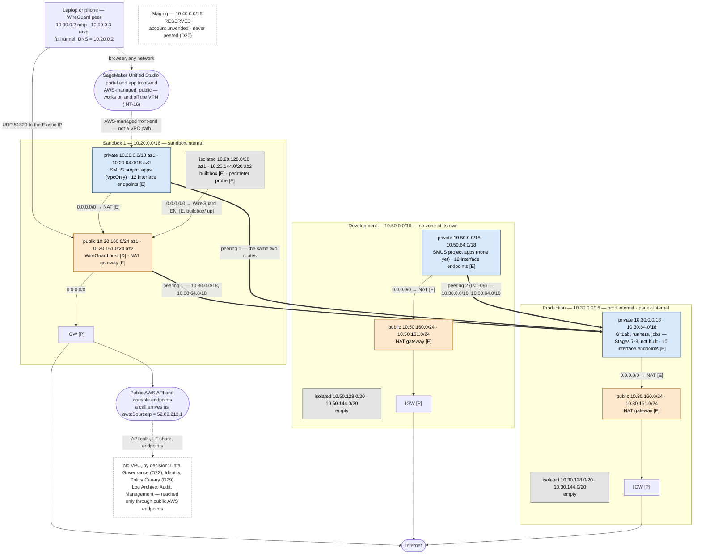
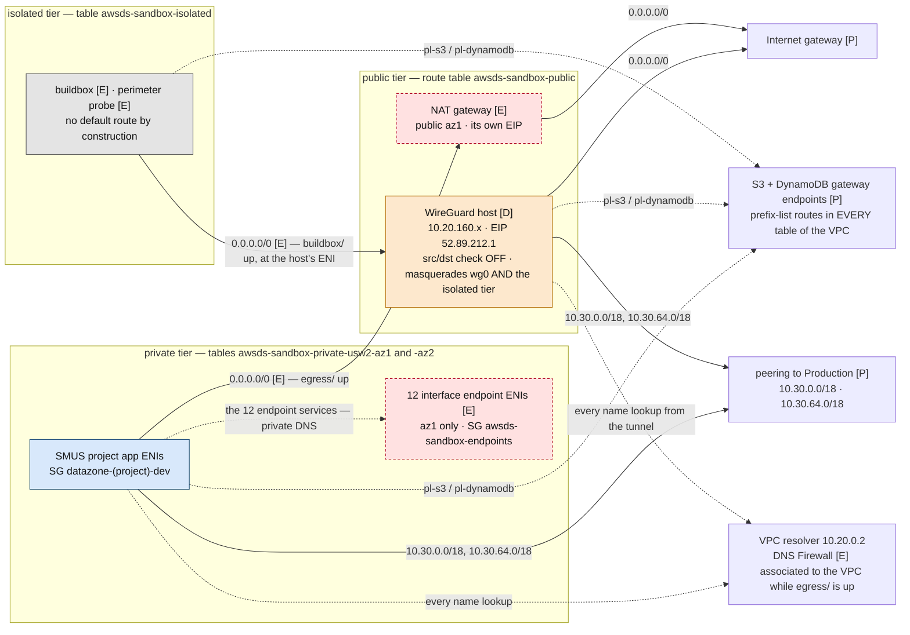
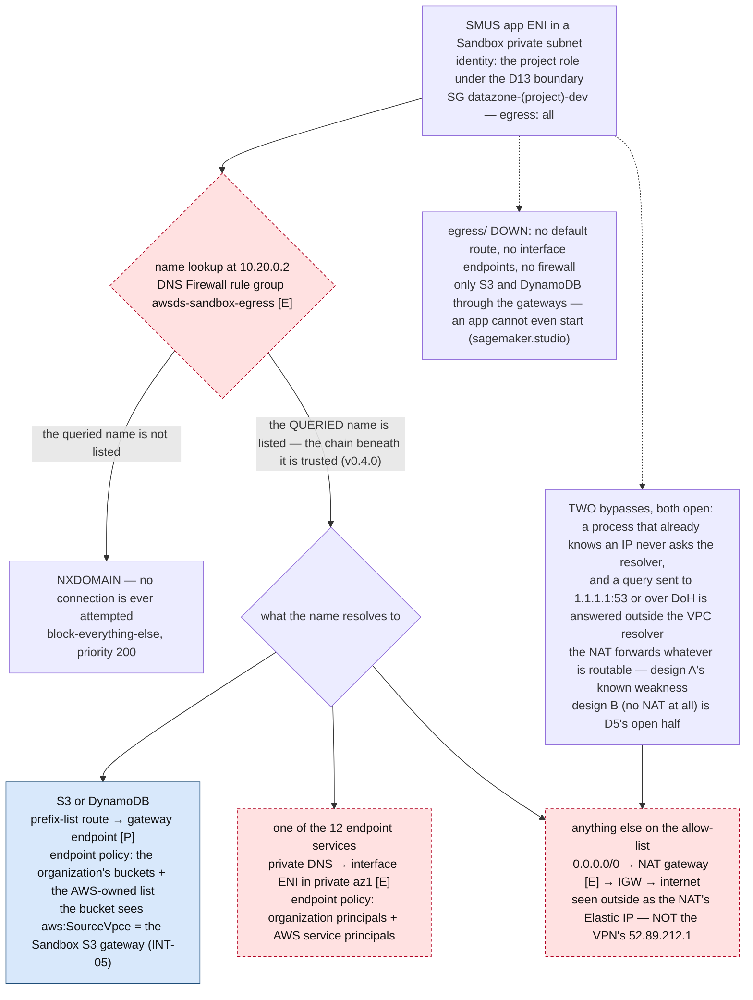
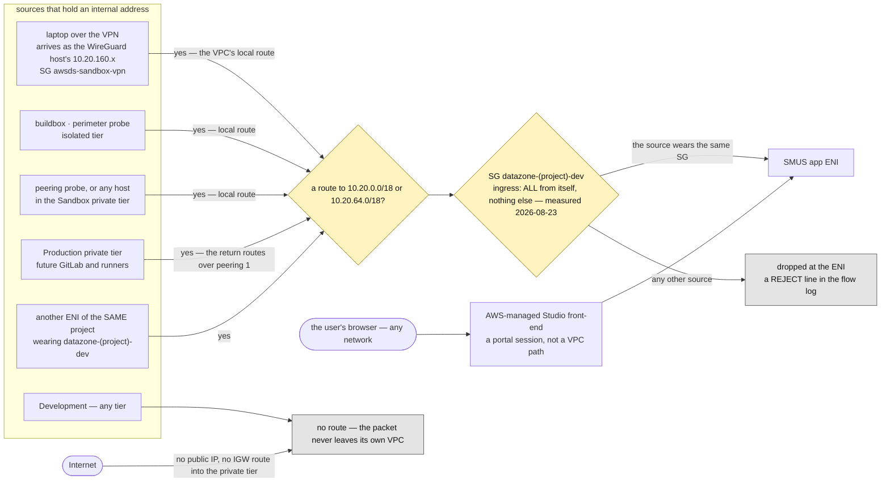
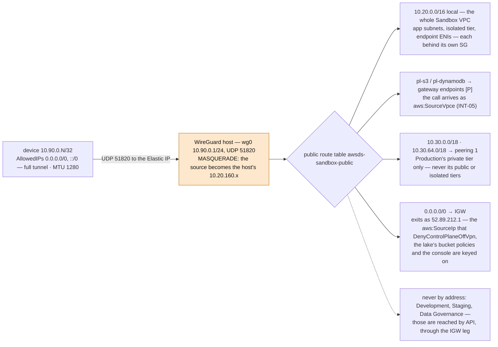
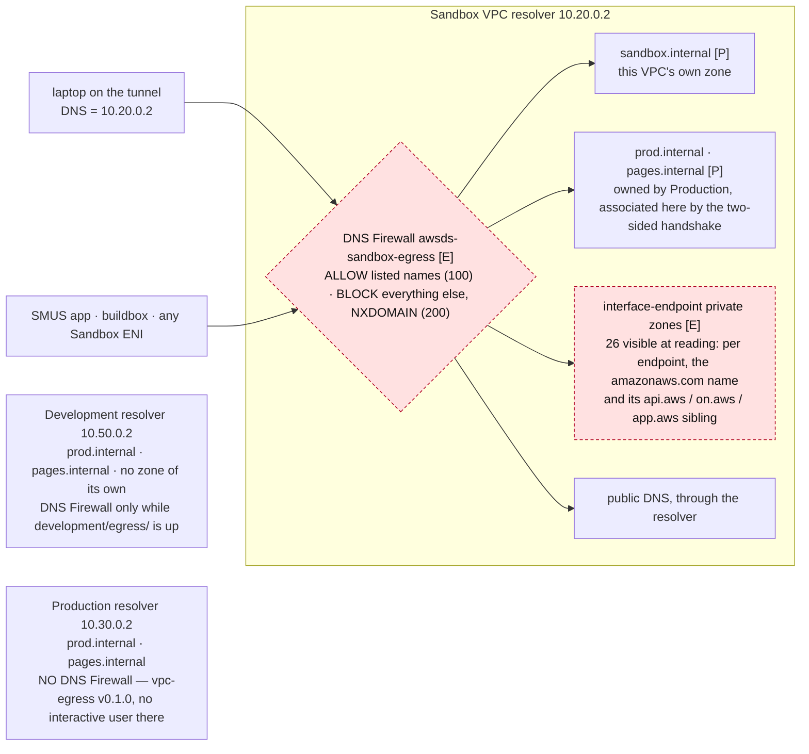

# NETWORK.md — the network topology, as built

| | |
|---|---|
| **What this is** | One picture of every network this project builds: the VPCs and their address plan, every element that holds an internal address, the route tables, the two egress paths (the NAT gateway of design A and the WireGuard host's second job), the VPN, the DNS layer with its firewall, and the security groups — and the two questions the picture exists to answer: **how a SageMaker app sees the internet**, and **what can reach a SageMaker app** |
| **What it is not** | A procedure. Starting the host, connecting a device, building an image, applying a slice: [`plan/runbooks/vpn.md`](plan/runbooks/vpn.md), [`plan/runbooks/buildbox.md`](plan/runbooks/buildbox.md), [`plan/runbooks/terraform-changes.md`](plan/runbooks/terraform-changes.md). The design argument is [`plan/architecture.md`](plan/architecture.md); the build steps are [`plan/stages/stage-03-networking.md`](plan/stages/stage-03-networking.md) and [`plan/stages/stage-04-vpn.md`](plan/stages/stage-04-vpn.md). **Nor is it the authority on whether a reading is *expected*** — that is [`AWS_STATE.md`](AWS_STATE.md)'s invariants and exceptions, and the slice tree is [`plan/conventions.md`](plan/conventions.md)'s |
| **Kept true, and how** | **Reviewed in the same sitting as any change to a network-bearing slice or module** — the rule is `CLAUDE.md`'s upkeep table, and §2.1 below is the list this file must keep naming. **`./scripts/check-network-doc.py` decides the mechanical half**: every allocated CIDR, every per-tier subnet **recomputed from the `vpc` module's own arithmetic**, and every slice that declares a network object or calls a network module has to appear here. Whether a sentence is still *true* is the reading, which no check makes — and the **measured** date in the row above is what a reader compares against `aws/output/` |
| **Where each fact comes from** | Two kinds, marked throughout. **As code** — read from [`../terraform-modules/vpc/`](../terraform-modules/vpc/main.tf), [`../terraform-modules/vpc-egress/`](../terraform-modules/vpc-egress/nat.tf), [`../terraform-modules/wireguard/`](../terraform-modules/wireguard/main.tf), [`../terraform-modules/sagemaker-prereqs/`](../terraform-modules/sagemaker-prereqs/blueprints.tf) and the `foundation/`, `egress/`, `vpn/`, `buildbox/`, `probes/` and `sagemaker/` slices under [`../terraform-live/`](../terraform-live/README.md); the address allocation from [`../scripts/tfhygiene/backend.py`](../scripts/tfhygiene/backend.py). **Measured** — read back from the accounts on **2026-08-23** with `./aws/networking.py`, `./aws/egress.py`, `./aws/vpn.py`, `./aws/studio.py` and direct read-only `describe-*` calls, as the infrastructure user. A measured value that is `[E]` or `[D]` describes **that session**, never the design |
| **Written** | 2026-08-23, Claude, at the user's request. Stable ids (`D26`, `INT-05`, `EXC-05`, `Lesson 28`) are the references; section numbers in other files are not |

---

## 0. Four rules for reading the picture

1. **Layers decide what exists right now.** `[P]` persistent — the VPC, subnets, route tables, gateway endpoints, the Elastic IP, the private zones, the security groups: always there. `[D]` dormant — the WireGuard host: stopped between sessions, same address. `[E]` ephemeral — the NAT gateway, the interface endpoints, the DNS Firewall, the private tier's default route, the buildbox and its route, the probes: **destroyed at the end of a session and rebuilt with new ids** (D11). A diagram below that shows an `[E]` element shows a *session*.
2. **Reach is an intersection** (Lesson 28): a packet needs a **route**, a **security group** that admits it at the far ENI, and — for an AWS service — an **endpoint policy** and an **IAM decision** that agree. No single file shows all four, which is why the two questions at the end are answered against all four.
3. **A VPC exists only in Sandbox 1, Development and Production — and in no other account until `Staging` is vended.** Data Governance (D22), Identity, Policy Canary (D29), Log Archive, Audit and Management hold **no VPC**: nothing in them has an internal address, and everything in them is reached through public AWS endpoints. The lake is therefore reached by **API** (Athena, Glue, Lake Formation, S3) and never by address.
4. **Two access paths, not one.** VPC-level reach exists into **Sandbox** and — across one peering — into **Production's private tier**. Everything else (Development, Data Governance, the console, the Unified Studio portal) is reached over public endpoints, exited through the WireGuard Elastic IP. The portal is the measured exception: it is reachable with the tunnel down (INT-16).

---

## 1. The address plan

**As code** — [`backend.py`](../scripts/tfhygiene/backend.py) `CIDRS`, `ZONE_IDS`, `WIREGUARD_PEER_CIDR`; the cut inside a VPC is [`vpc/main.tf`](../terraform-modules/vpc/main.tf). **Measured 2026-08-23**: every subnet below exists with exactly this CIDR, name and zone id (`./aws/networking.py` `NT-5` — no overlap).

| Account | VPC | private (apps, runners, GitLab) — `/18` per AZ | isolated (no route out) — `/20` per AZ | public (IGW) — `/24` per AZ |
|---|---|---|---|---|
| **Sandbox 1** | `10.20.0.0/16` | `10.20.0.0/18` az1 · `10.20.64.0/18` az2 | `10.20.128.0/20` az1 · `10.20.144.0/20` az2 | `10.20.160.0/24` az1 · `10.20.161.0/24` az2 |
| **Production** | `10.30.0.0/16` | `10.30.0.0/18` · `10.30.64.0/18` | `10.30.128.0/20` · `10.30.144.0/20` | `10.30.160.0/24` · `10.30.161.0/24` |
| **Staging** | `10.40.0.0/16` **reserved** | — account unvended; never peered to anything, by decision (D20) | | |
| **Development** | `10.50.0.0/16` | `10.50.0.0/18` · `10.50.64.0/18` | `10.50.128.0/20` · `10.50.144.0/20` | `10.50.160.0/24` · `10.50.161.0/24` |
| **WireGuard peers** | `10.90.0.0/24` | `.1` the host's `wg0` · `.2` `mbp` · `.3` `raspi` — **never seen inside AWS**: the host masquerades, and no route table anywhere names this range (`NT-4`) | | |

- **Sandboxes multiply** (D35): the next business unit takes the **lowest free `/16` in the supernet `10.16.0.0/13`** — unit 2 is `10.16.0.0/16`, authored by hand in `backend.py`, never computed.
- **The rest of each `/16` is free**: `.162.0`–`.255.255` is unallocated in every VPC, and the isolated tier is created **empty on purpose** (subnets are free, re-cutting is not).
- **Availability zones are anchored on zone IDs**, never on names or list position: `zone_ids = ["usw2-az1", "usw2-az2"]` in every account. **Index 0 — `usw2-az1` — is where every single-AZ resource lands**: the WireGuard host, the NAT gateway, all interface endpoints, the buildbox, the probes. Measured: `usw2-az1` is `us-west-2b` and `usw2-az2` is `us-west-2a` in every account that has a profile — the names are not in id order, which is the whole reason the code never uses them.
- **Reserved addresses, by AWS**: `.2` of each VPC is the **VPC resolver** — `10.20.0.2`, `10.30.0.2`, `10.50.0.2`. The tunnel's `DNS =` line points at the first.
- **Two route tables per VPC carry no subnet**: the VPC's main table (local route only, unnamed) and — the design's own — the isolated table, which has **no default route by construction**. That absence is what the perimeter probe measures and what the buildbox temporarily suspends.

---

## 2. Every element that holds an internal address

**The standing inventory (as code), then what was actually there on 2026-08-23 (measured).** Development and Production held **no ENI at all** at reading: their `egress/` slices were down and no host exists in either. Everything below is in **Sandbox 1** unless the row says otherwise.

| Element | Tier · AZ | Address | Layer · slice | What it wears |
|---|---|---|---|---|
| **WireGuard host** `awsds-sandbox-vpn` | public · az1 (`10.20.160.0/24`) | a `10.20.160.x` **that moves with every replacement** (the logs hold `.63`, `.238`, `.254`, `.90`; **`.87` at reading**) + the `[P]` Elastic IP **`52.89.212.1`**; `wg0` at `10.90.0.1/24` | `[D]` `sandbox/vpn/` (address and SG are `[P]` in `sandbox/foundation/`) | SG `awsds-sandbox-vpn`; **source/destination check OFF** since it became the isolated tier's NAT instance; IMDSv2; no key pair, no port 22 |
| **NAT gateway** `awsds-sandbox-nat` | public · az1 | a `10.20.160.x` (`.21` at reading) + its **own** Elastic IP, released with the slice (`35.166.251.16` at reading — never a rule) | `[E]` `sandbox/egress/` | no SG (a NAT gateway has none) |
| **12 interface endpoints** | private · **az1 only** (D9) | 12 ENIs in `10.20.0.0/18`, new on every `make up` | `[E]` `sandbox/egress/` | SG `awsds-sandbox-endpoints` — TCP/443 from `10.20.0.0/16` |
| **SMUS project app ENIs** — the SageMaker AI domain `Tooling` provisioned (`VpcOnly`) | private · **both AZs** are offered (`Subnets` = both private subnets; `AZs` = both zone ids); the running app's ENI was in az1 | one ENI per running app — `10.20.57.51` at reading, description *"ENI managed by SageMaker for Studio Domain"* | **created by the blueprint**, not by this repository (`[P]` domain, `[E]` apps) | SG **`datazone-<project id>-dev`** (blueprint-authored) + `security-group-for-outbound-nfs-<domain id>` (SageMaker-authored) — §9 |
| **Buildbox** `awsds-sandbox-buildbox` | isolated · az1 (`10.20.128.0/20`) | `10.20.134.183` at reading | `[E]` `sandbox/buildbox/` | SG `awsds-sandbox-buildbox` — **no ingress rule at all** |
| **Perimeter probe** `awsds-sandbox-probe-perimeter` | isolated · az1 | `10.20.135.117` at reading | `[E]` `sandbox/probes/` | SG `awsds-sandbox-probe-perimeter` — no ingress, egress all |
| **Peering probe** `awsds-sandbox-probe-peering` | private · az1 | `10.20.30.207` at reading | `[E]` `sandbox/probes/` | SG `awsds-sandbox-probe-peering` — egress to `10.20.0.0/16` and `10.30.0.0/16` only |
| **Gateway endpoints** S3 + DynamoDB | — (prefix-list routes, no ENI) | none — their **ids** are the INT-05 anchors, the only endpoint ids any policy may name | `[P]` `*/foundation/`, all three VPCs | endpoint policy: the organization's resources + the AWS-owned bucket list (§8) |
| **Development**, when its `egress/` is up | public az1 · private az1 | one NAT ENI + 12 interface-endpoint ENIs (the same list as Sandbox) | `[E]` `development/egress/` | `awsds-dev-endpoints` |
| **Production**, when its `egress/` is up | public az1 · private az1 | one NAT ENI + **10** interface-endpoint ENIs (the core eight + `sagemaker.api`, `sagemaker.runtime` — no `sagemaker.studio`, no `datazone`: nobody works there) | `[E]` `production/egress/` | `awsds-prod-endpoints` |
| **INT-09 probe** `awsds-dev-probe-int09` / **target probe** `awsds-prod-probe-target` (+ a second ENI in Production's isolated tier) | Development private az1 / Production private az1 + isolated az1 | `[E]` addresses — the target's are published as `probe.prod.internal` and `probe-isolated.prod.internal` while it exists | `[E]` `development/probes/`, `production/probes/` | `awsds-prod-probe`: TCP/443 from the two source VPC ranges, no egress rule |
| **Not built yet, addresses reserved by tier**: GitLab + Pages + internal ALB, runners, jobs, orchestration | Production **private** tier (Stages 7-10) | — | — | Stage 7's GitLab rule will admit the WireGuard **security group by id** across the peering — never the client range, which never arrives |

**Names, not addresses**: `sandbox.internal` (this VPC's zone), `prod.internal` and `pages.internal` (Production's, associated into Sandbox and Development), and the interface endpoints' private DNS names — §7.

### 2.1 Which slice puts each of those on the network

**This is not a copy of the slice tree** — that is [`plan/conventions.md`](plan/conventions.md)'s, and it says where files live. This says **what each slice puts on the wire**, which is a different fact and the one this document is answerable for: a slice that reaches this list without a row here is what `./scripts/check-network-doc.py` fails on.

| Slice | Layer | What it creates on the network |
|---|---|---|
| `sandbox/foundation/` · `development/foundation/` · `production/foundation/` | `[P]` | one `terraform-modules/vpc` each — the VPC, six subnets, the IGW, four route tables, the two gateway endpoints with their policies, the tier and endpoint security groups, the flow log. Plus, per account: the private zones, the peering **requesters** (Sandbox, Development) and the **accepter** with every route and zone association (Production) |
| `sandbox/foundation/` alone | `[P]` | the VPN anchors: the Elastic IP `52.89.212.1`, the security group `awsds-sandbox-vpn` (the estate's only world-open rule), the host-key secret |
| `sandbox/egress/` · `development/egress/` · `production/egress/` | `[E]` | one `terraform-modules/vpc-egress` each — the NAT gateway with its own Elastic IP, the private tier's `0.0.0.0/0`, the interface endpoints with their policy, and (Interactive only) the DNS Firewall rule group, its two domain lists and the query log |
| `sandbox/vpn/` | `[D]` | one `terraform-modules/wireguard` — the host, its `wg0`, its masquerade rules for the tunnel **and** for the isolated tier, its handshake log and alarm |
| `sandbox/buildbox/` | `[E]` | the build host, its egress-only security group, and **the isolated tier's only default route**, at the WireGuard host's ENI |
| `sandbox/probes/` · `development/probes/` · `production/probes/` | `[E]` | the throwaway hosts that measure what a `describe` cannot — the perimeter, both peerings, the flow-log pair — plus Production's second ENI and the two `probe*.prod.internal` records |
| `sandbox/sagemaker/` · `development/sagemaker/` | `[P]` | **no network object of its own** — it hands the blueprint the VPC id, the private subnets and their zone ids, which is what makes every project app land where §5 and §6 describe. Named here because the check cannot see that relationship and a reader must |

**Not network-bearing, and the absence is the design**: `*/bootstrap/`, `identity/sso/`, `identity/org-policies/`, `*/data/`, `data-governance/governance/` and `production/registry/` create nothing that holds an address — Data Governance and Identity have no VPC at all (D22, D29).

---

## 3. The estate — VPCs, peerings, the tunnel, and what has no VPC

**The two peerings are the only VPC-level paths between accounts, and both are subnet-scoped.** Measured 2026-08-23 (and identical to the code in [`production/foundation/peers.tf`](../terraform-live/production/foundation/peers.tf)): **22 routes**, all `active`, destinations always a **subnet**, never a whole VPC.

| Peering | Forward routes (in the requester) | Return routes (in Production, both private tables) |
|---|---|---|
| **Sandbox ↔ Production** | Sandbox **public** table and **both private** tables: `10.30.0.0/18`, `10.30.64.0/18` (6 routes) | `10.20.160.0/24`, `10.20.161.0/24` (the public tier — the tunnel's masqueraded source), `10.20.0.0/18`, `10.20.64.0/18` (the app tier) — 8 routes |
| **Development ↔ Production** (INT-09) | Development **both private** tables: `10.30.0.0/18`, `10.30.64.0/18` (4 routes) | `10.50.0.0/18`, `10.50.64.0/18` — 4 routes |

What the table says when read for *absences*: Production's **public and isolated** tiers are reachable from nobody (the peering probe proved it — `probe-isolated.prod.internal` resolves and never answers); Sandbox's **isolated** tier has no peering route in either direction; **Sandbox and Development are not peered** and never see each other by address (the exchange between them is S3 and git); **Staging** is in no route table (`NT-6`).

---

## 4. Inside the Sandbox VPC — the route tables are the truth

Sandbox is the fullest VPC (it carries the tunnel, the NAT, the apps, the buildbox). Development and Production are the same module minus the VPN host, the buildbox and — in Production — the DNS Firewall.

**The route tables, exactly — measured 2026-08-23 and equal to the code.** `pl-s3` and `pl-dynamodb` are the two AWS prefix lists; `[E]` rows exist only while the slice that writes them is up.

| Table | Routes |
|---|---|
| `awsds-sandbox-public` (both public subnets) | `10.20.0.0/16 local` · `0.0.0.0/0 → igw` · `pl-s3 → vpce-s3` · `pl-dynamodb → vpce-dynamodb` · `10.30.0.0/18 → pcx` · `10.30.64.0/18 → pcx` |
| `awsds-sandbox-private-usw2-az1`, `-az2` (one per AZ, so a one-NAT-per-AZ switch is a route change) | `10.20.0.0/16 local` · `pl-s3 → vpce-s3` · `pl-dynamodb → vpce-dynamodb` · `10.30.0.0/18 → pcx` · `10.30.64.0/18 → pcx` · **`[E]` `0.0.0.0/0 → nat`** (`egress/`, design A) |
| `awsds-sandbox-isolated` (both isolated subnets) | `10.20.0.0/16 local` · `pl-s3 → vpce-s3` · `pl-dynamodb → vpce-dynamodb` · **`[E]` `0.0.0.0/0 → eni` of the WireGuard host** (`buildbox/`; a blackhole while the host is stopped, never an error) |
| `awsds-dev-public` / `awsds-prod-public` | `local` · `0.0.0.0/0 → igw` · the two prefix-list routes |
| `awsds-dev-private-*` | `local` · prefix lists · `10.30.0.0/18 → pcx` · `10.30.64.0/18 → pcx` · `[E]` `0.0.0.0/0 → nat` |
| `awsds-prod-private-*` | `local` · prefix lists · the **six** return routes of §3 · `[E]` `0.0.0.0/0 → nat` |
| `awsds-dev-isolated` / `awsds-prod-isolated` | `local` · prefix lists — **nothing else, ever** |

**Two things the prefix-list rows decide, both measured in earlier stages:** a NAT does **not** bypass the S3 gateway endpoint (the prefix-list route is more specific than `0.0.0.0/0`, so in-region S3 traffic is judged by the gateway's allow-list even under design A); and traffic to S3 from the tunnel arrives at a bucket as **`aws:SourceVpce`**, not as the Elastic IP — the reason `DenyControlPlaneOffVpn` tests three conditions and the lake's bucket policies carry two branches.

---

## 5. How a SageMaker app sees the internet

The app is a container the `Tooling` blueprint's SageMaker AI domain runs in **`VpcOnly`** mode (`US-5`, measured `AppNetworkAccessType=VpcOnly`; the parameter is **non-editable** in both project profiles). `VpcOnly` means the app's ENI sits in a **Sandbox private subnet** and every packet it sends crosses the account's own route tables, security groups, endpoint policies and flow logs. Its identity is the project's `datazone_usr_role` under the D13 boundary — **not** a persona permission set, so `DenyControlPlaneOffVpn` is not what governs it.

**Read it as two states, because the slice that writes the default route also writes the filter:**

| | `sandbox/egress/` **down** (the state between sessions, D11) | `sandbox/egress/` **up** (a session — the state on 2026-08-23) |
|---|---|---|
| Default route from the private tier | **none** | `0.0.0.0/0 → NAT gateway`, both AZs, one NAT in az1 |
| DNS Firewall on the VPC | **none** (it is `[E]` with the slice) | `awsds-sandbox-egress`: **ALLOW** the listed names (priority 100), **BLOCK everything else with NXDOMAIN** (200) |
| AWS services | S3 and DynamoDB only, through the `[P]` gateways | the 12 endpoint services through interface ENIs (private DNS); S3/DynamoDB still through the gateways |
| Internet | **no path** — and no app can start, since `sagemaker.studio` has no endpoint | the allow-listed names, through the NAT; **the NAT's Elastic IP is the source the internet sees** |
| Cost | USD 0.00/h | ~USD 0.17/h (`EG-5`): 12 endpoints + the NAT |

**What the allow-list actually lets an app reach — measured 2026-08-23 (Stage 6 step 4.3), and it is not a list of names but of resolution chains.** DNS Firewall evaluates the **whole chain**: a listed name whose CNAME target is not also listed is blocked, and the log blames the queried name. The list in [`sandbox/egress/main.tf`](../terraform-live/sandbox/egress/main.tf) (Development's is the same minus `sandbox.internal`):

| Allowed | Why it works | Path |
|---|---|---|
| `amazonaws.com`, `*.amazonaws.com` | AWS's own namespace — every SDK call | interface endpoint where one exists, otherwise the NAT |
| `datazone.us-west-2.api.aws` | the Unified Studio control plane sits on the `aws` TLD, outside the wildcard above — measured BLOCKED 52 times before it was listed. **At reading, a private hosted zone for exactly this name, owned by the endpoint service, is visible from the VPC** — so once the firewall lets the query through, the `datazone` interface endpoint answers it | interface endpoint |
| `pypi.org`, `files.pythonhosted.org` | index **and** wheels. The download host is a CNAME into Fastly and had no path at all until `vpc-egress-v0.4.0`; `development/` still lists only the index, by choice rather than by mechanism | NAT |
| `conda.anaconda.org`, `repo.anaconda.com` | complete path | NAT |
| `us-west.pkg.julialang.org`, `storage.julialang.net`, `pkg.julialang.org`, `julialang-s3.julialang.org` | Julia's regional server, its storage host, the default server and the binaries host. **The `.net` hop of the first is no longer listed** — the chain is trusted, and listing a hop is what would make that hop resolvable on its own | NAT |
| `releases.astral.sh`, `astral.sh` | `uv`/`ruff` installer | NAT |
| `extensions.duckdb.org`, `blobs.duckdb.org` | fetched at first query, from inside the notebook process | NAT |
| `archive.ubuntu.com`, `security.ubuntu.com`, `public.ecr.aws`, `index`/`static.crates.io`, `static.rust-lang.org`, `github.com` | **the half that had no path under design A until 2026-08-23.** Each is a CNAME into Cloudflare, Global Accelerator or Fastly; each is now one ordinary entry | NAT |
| `sandbox.internal`, `prod.internal`, `pages.internal` (+ `*.`) | the private zones — **an unlisted internal name is blocked exactly like an internet one**, because the firewall sits in the same resolver | VPC / peering |
| **Still absent, and now by choice**: `sh.rustup.rs`, `install.julialang.org`, CRAN, `deb.debian.org` | listable as single names under v0.4.0. Out because nothing needs them — `rustup` arrives from apt, Julia from S3 by hand | — |

**Until 2026-08-23 the rule was that the firewall evaluated the WHOLE resolution chain**, so a listed name whose CNAME target was unlisted was blocked, and eight of nine external names worked only because their owner flattened the CDN behind an A record (`EXC-05`). `vpc-egress-v0.4.0` made **`firewall_domain_redirection_action`** an input — the module keeps the API's own `INSPECT_REDIRECTION_DOMAIN` as its default, and **both Interactive slices pass `TRUST_REDIRECTION_DOMAIN`** on the ALLOW rule, so in those two VPCs the firewall inspects the **queried** name and trusts the chain beneath it. The value sits beside the list it governs, in the slice, for the same reason the list moved there at `v0.3.0`: it is a statement about what one account may reach, not about the mechanism. **It does not open the CDN** — the trust is scoped to one query transaction, so `dualstack.j2.shared.global.fastly.net` asked for directly is an independent query, matches nothing, and is blocked. Twelve hop entries came off the Sandbox list and one off Development's the same day. `./aws/dns-allowlist.py` (`DN-1`–`DN-4`) re-resolves both lists with no AWS session; **`DN-2` now fails on a hop that is still listed**, and `DN-4` reports which names would break if the setting were reverted (measured 2026-08-23: eleven).

**Two consequences worth stating plainly.** First, the app's AWS calls do **not** present the VPN's Elastic IP: they arrive as `aws:SourceVpce` (through an interface endpoint) or as the NAT's address — so any control keyed on `aws:SourceIp = 52.89.212.1` (the persona sets' `DenyControlPlaneOffVpn`, the lake's bucket-policy branch) is about **humans on the tunnel**, not about apps; what reaches the app is the endpoint policies, the bucket policies' `aws:SourceVpce` branch and the D13 boundary. Second, **design A's exfiltration story is "inconvenient", not "no path"**, and there are **two** ways past it rather than one. A process that already holds an address never asks the resolver — the long-standing half. And a process that asks a resolver **other than the VPC's** is not inspected at all: DNS Firewall only sees what `10.20.0.2` is asked, while `awsds-<env>-<tier>-tier` permits all egress and the NACLs sit at the default allow (`terraform-modules/vpc/main.tf`, step 2.3), so `1.1.1.1:53` over the NAT and DoH on 443 are both open. Neither is closed by `v0.4.0`, and neither is closable at the DNS layer at all — an SNI/Host control is what would do it (AWS Network Firewall's stateful domain list, or an explicit proxy), and neither is built. Design B — no NAT, no default route, CodeArtifact and ECR pull-through as the only artifact path — is the strict alternative, and step 4.3's measurement is the input D5 is waiting for.

---

## 6. What can reach a SageMaker app

The mirror question, and the answer is decided at **two** gates in sequence: is there a **route** to the app's subnet, and does the app's **security group** admit the source. The security group is **not this repository's** — the `Tooling` CloudFormation stack authors `datazone-<project id>-dev` per project — so it was **read rather than assumed** (2026-08-23, project `ae2l1o2vln1fo0`, domain `d-xu8k9jvnhjuv`): **ingress ALL protocols from members of the same security group, and nothing else; egress ALL to `0.0.0.0/0`.** A second pair SageMaker adds for the domain's home-directory convention — `security-group-for-inbound-nfs-<domain id>` (TCP 988, 1018-1023, 2049 from the outbound group) and `security-group-for-outbound-nfs-<domain id>` — only references itself too, and **no EFS mount-target ENI exists** (the NFS requirement was withdrawn; `DL-10` measures EFS absence).

| Source | Route to the app tier | At the app's security group | Verdict |
|---|---|---|---|
| **The user's browser** — on or off the VPN | not a VPC path at all: the portal hands the browser to an **AWS-managed front-end** that proxies into the app | n/a | **the one designed ingress** — and it works with the tunnel **down** (INT-16, measured in the strong form: create, space, JupyterLab). The closing choice — fallback (i) on the domain execution role versus recorded acceptance — is the user's, pending |
| **The laptop over the VPN** (masqueraded to the host's `10.20.160.x`, SG `awsds-sandbox-vpn`) | **yes** — `10.20.0.0/16 local` in the public table | **dropped** — the source does not wear `datazone-<project>-dev` | routable, not admitted |
| **The WireGuard host itself**, the **buildbox**, the **perimeter probe** (isolated tier), the **peering probe** (private tier) | yes — local route | dropped, same reason | routable, not admitted |
| **The 12 interface-endpoint ENIs** | they never initiate a connection | — | no |
| **Production's private tier** — GitLab, runners, jobs, once built | **yes** — the return routes `10.20.0.0/18`, `10.20.64.0/18 → pcx` exist in both Production private tables (they exist so the app's *outbound* clone can be answered; routing is bidirectional by construction) | dropped | routable, not admitted — and a `REJECT` in Sandbox's flow log if ever tried |
| **Production's public or isolated tiers** | no route | — | no |
| **Development**, any tier | **no route** — Sandbox and Development are not peered | — | no |
| **Staging** | no VPC | — | no |
| **Data Governance** and the other platform accounts | no VPC; they reach nothing by address | — | no (the lake is reached *from* the app, by API) |
| **The internet** | the app ENI has no public address; the private tier has no IGW route; the NAT is outbound-only; **the only world-open port in the estate is UDP/51820 on the WireGuard host** (`VP-3`) | — | no |
| **Another ENI of the same project** — a second app, the same space's kernel | yes | **admitted** (self-reference, every port) | **yes — the one network-level path in**, and it is project-scoped |

**So the answer to "can anything on the intranet connect to the SageMaker instance" is: by route, yes from the whole Sandbox VPC and from Production's private tier; by security group, nothing but the project's own ENIs.** Two caveats carry the weight of that sentence. The rule is the **blueprint's**, read on one project: every new project gets its own `datazone-<id>-dev` group from the same template, and **no instrument in `aws/` reads security-group rules today** (`US-5` reads the domain's network mode and subnets) — a re-read per new project, or a check, is the gap. And the app's *control* connection is **outbound**: it reaches SageMaker through the `sagemaker.studio` interface endpoint (`studio.us-west-2.sagemaker.aws`, private DNS), which is what lets an app start at all under `VpcOnly` — the front-end never opens a connection *toward* the ENI.

---

## 7. The tunnel — what a packet from the laptop can and cannot reach

- **Full tunnel, by rule**: `AllowedIPs = 0.0.0.0/0, ::/0`. Every byte the device sends — ordinary browsing included — transits the host and leaves AWS as `52.89.212.1`; IPv6 is deliberately black-holed. A split tunnel is a lockout with the tunnel up, because `DenyControlPlaneOffVpn` can only match traffic that actually exits through the Elastic IP.
- **The path splits by destination**, and the lake's perimeter policy mirrors the split: S3 and DynamoDB leave through the `[P]` gateway endpoints (prefix-list routes beat the default) and arrive wearing the host's **private** address plus `aws:SourceVpce`; everything else exits through the IGW wearing the Elastic IP. Measured in CloudTrail on 2026-08-19/20, and the reason `DenyControlPlaneOffVpn` carries a third condition.
- **THE SPLIT IS THREE-WAY, NOT TWO, AND THE THIRD LEG WAS MEASURED 2026-08-23.** While `egress/` is up, the laptop resolves through the **VPC resolver** its own client config points at (`DNS = 10.20.0.2`) — so every service holding an **interface** endpoint answers with a **private** address and the call takes that endpoint, presenting **its** id. Measured with a negative control: `dig +short sts.us-west-2.amazonaws.com` → `10.20.12.229`, while `dig +short s3.us-west-2.amazonaws.com` → public addresses, the gateway doing no private DNS. The symptom was a persona explicitly denied `sts:GetCallerIdentity` **with the tunnel up and `curl checkip` reading the Elastic IP** — two true readings of two different paths. An interface endpoint id may never be listed in a policy (they are `[E]`, new on every `make up` — Lesson 3), so the deny's third condition became **`aws:SourceVpc`** on the home's VPC, which is `[P]` and subsumes the gateway ids it used to carry.
- **`10.90.0.0/24` exists nowhere inside AWS** (`NT-4`): a peer packet in Production reads as the host's `10.20.160.x`, which is why Stage 7's GitLab rule admits the **security group** and never the client range.
- **The host's second job**: since `wireguard-v0.4.0` it also masquerades the isolated tier (`vpc_nat_cidrs` = `10.20.128.0/20`, `10.20.144.0/20`), which is why its source/destination check is off and why its `[P]` security group admits those two ranges inbound. The capability is `[D]` with the host; the **reach** is the `[E]` route `buildbox/` writes — a stopped host turns that route into a blackhole, not an error.
- **`sandbox/egress/` is not part of the VPN path.** The NAT's route exists only in the private tables; the host's subnet routes `0.0.0.0/0` to the IGW. A tunnel-only session starts the host and nothing else (`vpn.md` §S5).
- **One consequence of the shared resolver**, by construction rather than measured: the device's `DNS = 10.20.0.2` enters the VPC resolver from the host's ENI, and the DNS Firewall rule group associates to the **VPC** — so **while `sandbox/egress/` is up, the laptop's own lookups are subject to the same allow-list** as the apps. A tunnel session that cannot resolve an ordinary site while `egress/` is up is this, not the tunnel.

---

## 8. Endpoints and their policies — the trusted-networks axis

| Endpoint | Where · layer | Policy (one document each, as code) | Who anchors on it |
|---|---|---|---|
| **S3 gateway** `awsds-<env>-s3-gateway` | every VPC · `[P]` · attached to **all** route tables of the VPC | `AllowWithinOrganization` (`s3:*` where `aws:ResourceOrgID` is ours) + `AllowAwsOwnedServiceBuckets` (`GetObject`/`ListBucket` on seven AWS-owned bucket families: AL2023 repos, CloudWatch agent, SSM ×2, ECR layers, SageMaker, JumpStart) | **the INT-05 anchor**: the lake's bucket policies and `DenyControlPlaneOffVpn` name its id — the only endpoint id any policy may name (Lesson 3). A `dnf` in the isolated tier works through it; an equally public bucket it does not name returns 403 (measured, Stage 3) |
| **DynamoDB gateway** | every VPC · `[P]` · all route tables | `AllowWithinOrganization` | same class; names `[P]` |
| **Interface endpoints** — Sandbox/Development: `sts logs kms ecr.api ecr.dkr athena glue lakeformation` + `sagemaker.api sagemaker.runtime sagemaker.studio datazone`; Production: the eight + `sagemaker.api sagemaker.runtime` | private subnet **az1 only** (D9) · `[E]` · private DNS on · SG `awsds-<env>-endpoints` | `AllowOrganizationPrincipals` (`aws:PrincipalOrgID`) + `AllowAWSServicePrincipals` (`aws:PrincipalIsAWSService`) — `aws:ResourceOrgID` deliberately absent: ECR pulls of public images and JumpStart artifacts are org-less resources | **nobody**: their ids are new on every `make up` (39/39 changed across the Stage 3 cycle). The condition a policy may carry is `aws:SourceVpc` |
| **Deliberately absent** — Athena Spark's `athena.sessions`/`dashboard`/`persistent-dashboard`; `ssm`/`ssmmessages`/`ec2messages`; `secretsmanager`; `q`; an S3 **interface** endpoint | — | — | Athena Spark runs its executors outside any VPC, so its endpoints would put a notebook outside every control here — denied by SCP instead (Stage 6 step 1.6). SSM needs no endpoint: the agent reaches the public API outbound (the VPN host through the IGW, the buildbox through the host). An S3 interface endpoint would lose to the gateway's prefix-list route anyway — verification (xix) of Stage 6 is still to measure which id a call from a project subnet presents |

AWS's own *required* list for `VpcOnly` has fifteen names; the slices carry what was **exercised** — twelve — and the create path closed end to end with that set on 2026-08-22 (project `ACTIVE`, JupyterLab working). `./aws/egress.py` `EG-1`–`EG-4` read the policies and the single-AZ shape back; `EG-5` is the burn meter.

---

## 9. Security groups — the second gate, every one of them

**As code** ([`vpc/main.tf`](../terraform-modules/vpc/main.tf), [`sandbox/foundation/vpn-anchors.tf`](../terraform-live/sandbox/foundation/vpn-anchors.tf), [`sandbox/buildbox/main.tf`](../terraform-live/sandbox/buildbox/main.tf), the `probes/` slices) **and measured 2026-08-23 — identical.** NACLs stay at AWS's default allow in every VPC, by decision: the control lives here.

| Group | VPC | Ingress | Egress | Notes |
|---|---|---|---|---|
| `default` | all three | **none** | **none** | emptied by the module; any rule appearing in it was placed by hand |
| `awsds-<env>-public-tier`, `-private-tier`, `-isolated-tier` | all three | none | all | baselines for later workloads — **attached to nothing today** |
| `awsds-<env>-endpoints` | all three | TCP/443 from the VPC CIDR | none | on every interface endpoint ENI |
| `awsds-sandbox-vpn` `[P]` | Sandbox | **UDP/51820 from `0.0.0.0/0`** — the estate's only world-open rule (`VP-3`) · ALL from `10.20.128.0/20`, `10.20.144.0/20` (the isolated tier, for the NAT-instance job) | all | no port 22, ever; Stage 7 admits this group **by id** from Production |
| `awsds-sandbox-buildbox` `[E]` | Sandbox | **none** — Session Manager needs none | all | the "reachable only over the VPN" requirement was withdrawn rather than faked (2026-08-21) |
| `awsds-sandbox-probe-perimeter` `[E]` | Sandbox | none | all — unrestricted **so the route is what is measured** | |
| `awsds-sandbox-probe-peering` / `awsds-dev-probe-int09` `[E]` | Sandbox / Development | none | to `10.30.0.0/16` (the whole peer range, so only the route varies) and to the own VPC (the resolver) | |
| `awsds-prod-probe` `[E]` | Production | TCP/443 from `10.20.0.0/16` and `10.50.0.0/16` | **none** (stateful replies need none) | on both of the target's ENIs |
| **`datazone-<project id>-dev`** — blueprint-authored | Sandbox (per project, per member account) | **ALL from itself** | all | the app's group — §6 |
| **`security-group-for-inbound-nfs-<domain>` / `-outbound-nfs-<domain>`** — SageMaker-authored | Sandbox (per domain) | inbound: TCP 988, 1018-1023, 2049 **from the outbound group** | outbound: the same ports **to the inbound group** | the domain's EFS convention; no mount target exists |

---

## 10. DNS — who resolves what, and where the filter sits

| Zone | Owner | Associated with | Measured 2026-08-23 |
|---|---|---|---|
| `sandbox.internal` | Sandbox 1 (`sandbox/foundation/zones.tf`) | the Sandbox VPC, at creation | visible from Sandbox; **NXDOMAIN everywhere else** — which is what makes `dig SOA sandbox.internal` the proof that the tunnel's DNS line is in use |
| `prod.internal`, `pages.internal` | Production (`production/foundation/zones.tf`) | Production at creation; **Sandbox and Development** by authorization-then-association (Stage 3 step 4.4, `NT-8`) | visible from all three VPCs. `probe.prod.internal` / `probe-isolated.prod.internal` exist only while `production/probes/` is up |
| `dev.internal`, `staging.internal` | **not created**, by decision | — | nothing in Development or Staging is addressed by a private name |
| the endpoints' private zones | `vpce.amazonaws.com` | the VPC that holds the endpoint — **cannot** be associated with another VPC | 26 in Sandbox (12 endpoints, two spellings each, plus `streaming-logs`); **none** in Development or Production at reading (their `egress/` down) |

**The filter is in the resolver, so it sees everything** — internet names, the private zones and the endpoint names alike; an unlisted internal name is blocked exactly like an unlisted internet one, which is why each Interactive list carries its reachable `*.internal` zones. The rule group associates to the **VPC id** (priority 101), not to a route table, so it also governs the buildbox, whose packets never touch the NAT: a build runs with `egress/` **down**, or every name it fetches is judged by this list. `public.ecr.aws` was unreachable even while listed until `v0.4.0` — it is a CNAME into `awsglobalaccelerator.com` (measured 2026-08-23). The block is logged against the **queried** name in `/awsds/<env>/dns-firewall` (`[E]`, 30 days) — read it during the session, it dies with the slice.

---

## 11. Observability — where a packet leaves a trace

| Instrument | Scope · layer | What it shows, and what it cannot |
|---|---|---|
| **VPC Flow Logs** `awsds-<env>-vpc-flow-logs` | every VPC · `[P]` · ALL traffic · 600 s aggregation · 30 days · CloudWatch Logs | every packet crossing an **ENI**: app egress, the peering (an `ACCEPT` on 443 and a `REJECT` on 8080 are what proved the probe), the tunnel's masqueraded traffic (source = the host's private address, never `10.90.0.x`). **Gateway-endpoint traffic crosses no ENI and leaves no line** — for S3 the field is CloudTrail's `vpcEndpointId` |
| **DNS Firewall query log** `/awsds/<env>/dns-firewall` | Sandbox, Development while `egress/` is up · `[E]` · 30 days | the rule action beside the queried name — a `BLOCK` here is "the firewall refused this name"; a hang with no line is "the NAT is down" |
| **Handshake log** `/awsds/sandbox/vpn` + alarm `awsds-sandbox-vpn-health` | the host · `[D]` | per-peer handshake age; a `peer=unknown` is a peer the roster does not know |
| **CloudTrail** | org-wide, Object-Locked | the S3-through-the-gateway split (`vpcEndpointId` + private address vs `52.89.212.1`), every `StartSession` on the host, every `GetSecretValue` of the host key |

---

## 12. What is deliberately not there, and what is still open

| Not built | Why, and the stable reference |
|---|---|
| A Staging VPC | the account is unvended (quota ticket); `10.40.0.0/16` is reserved and will **never** be peered (D20) |
| A Sandbox ↔ Development peering | the exchange between them is S3 and git (D21, D24 withdrawn) |
| Any VPC in Data Governance, Identity, Policy Canary, Log Archive, Audit, Management | D22, D29; the lake is consumed by API through the LF share (INT-11) |
| Design B — no NAT, no default route | D5 is settled at Stage 6 step 6.1 by measurement; step 4.3's finding (no artifact host resolves under A) is its input, not its verdict |
| A one-NAT-per-AZ layout, multi-AZ interface endpoints | D9: two AZs, single-AZ metered resources, cross-AZ accepted at lab scale |
| Network Firewall, Transit Gateway, Client VPN, IPv6, custom NACLs | the perimeter is the endpoint policies, the SCP/RCP pair and the security groups; WireGuard on one EC2 is D4 |
| Athena Spark endpoints, EFS, an S3 interface endpoint | §8; D24 withdrawn; the gateway wins the route |
| A DNS Firewall in Production | nobody works there — `production/egress/` runs `vpc-egress-v0.1.0` without one |

| Open | Owner |
|---|---|
| Whether a project subnet's S3 call presents the **gateway's** or an **interface** endpoint id in CloudTrail — verification (xix) | Stage 6 |
| The portal's off-VPN reach: fallback (i) — `DenyUserAccessFromUnauthorizedVPCs` on the domain execution role, keyed on the Elastic IP — versus recorded acceptance (INT-16) | the user |
| No instrument reads the blueprint-authored security groups; the self-reference rule was read on one project | a future check beside `US-5`, or a re-read per project |
| `./aws/networking.py` `NT-3`/`NT-4` read **FAIL** while `sandbox/buildbox/` is up: the isolated table's `0.0.0.0/0 → eni` "overlaps" `10.40.0.0/16` and `10.90.0.0/24`, exactly as any default route does — the checks predate the buildbox and flag its route while passing the NAT's; an instrument reading, not a network one (Lesson 30) | the instrument |

---

## 13. The state on 2026-08-23, when this file was measured — a session, not the design

- **Sandbox 1 was UP**: `egress/` applied (12 interface endpoints + the NAT, `EG-5` ~USD 0.17/h), the WireGuard host `running` (`t3.nano`, 8 GiB, `VP-1`–`VP-9` all pass), **and three `[E]` hosts at once** — the buildbox in the isolated tier **together with both probes**, although `buildbox.md` says the two slices must not coexist: with the buildbox's `0.0.0.0/0 → eni` in the isolated table, the perimeter probe's premise ("no default route") was false for as long as both stood. One **JupyterLab app `InService`** in the SageMaker AI domain, metered by the hour (`US-10`).
- **Development and Production were DOWN**: no ENI, no NAT (`deleted`), no interface endpoint, no instance; the `[P]` layer — VPC, subnets, route tables, gateways, peerings, zones — byte-for-byte what §1-§4 describe.
- **The tunnel was down on the laptop** while this was written, so the shared-resolver consequence in §7 is stated from the construction, not from a `dig`.

---

## 14. The instruments, and when to run each

| Script | Reads | Checks |
|---|---|---|
| `./aws/networking.py` | the `[P]` half, side by side per account: VPCs, subnets with zone ids, route tables, IGWs, gateway endpoint ids, peerings from both sides, the zones and their associations, flow logs, NACLs, SGs | `NT-1`–`NT-8`; run at every vend and either side of a `make down`/`make up` (the diff is the `[P]`-stability proof) |
| `./aws/egress.py` | the `[E]` half: interface endpoints, NATs, addresses, every endpoint policy, the service × account matrix, the endpoint service catalog | `EG-1`–`EG-5`; run at both ends of a session — `EG-5` is the forgotten-egress meter (D12 has no alert) |
| `./aws/vpn.py` | the host, the Elastic IP, the world-open rule, the log and alarm, which permission sets carry `DenyControlPlaneOffVpn`; `--on-host` (off by default, a write API) asks the running `wg0` which peers it holds | `VP-1`–`VP-9` |
| `./aws/dns-allowlist.py` | both Interactive allow-lists, re-resolved from the laptop — no AWS session | `DN-1`–`DN-4`; the `EXC-05` instrument, and the only thing that compares the two lists |
| `./aws/studio.py` | the domains, the blueprint-provisioned SageMaker AI domain's `VpcOnly` and subnets, running apps | `US-5`, `US-10` among others |
| `./scripts/buildbox.py status`, `make status` | the `[E]` hosts and the burn | — |
| **`./scripts/check-network-doc.py`** | **this file against the code** — no AWS session: every allocated CIDR, every per-tier subnet recomputed from the `vpc` module's own `cidrsubnet` calls, and every slice that declares a network object or calls a network module | in `make check` and in `pre-commit`, firing on any slice's `.tf`, the network modules, the allocation table or this file. It decides that the document still **names** what exists; that a sentence is still **true** is the reading |
