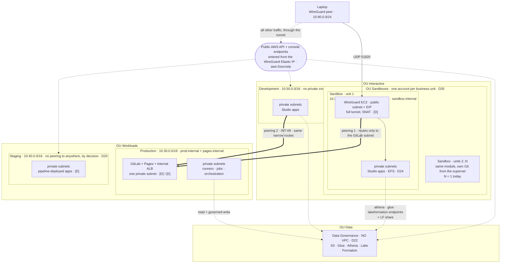
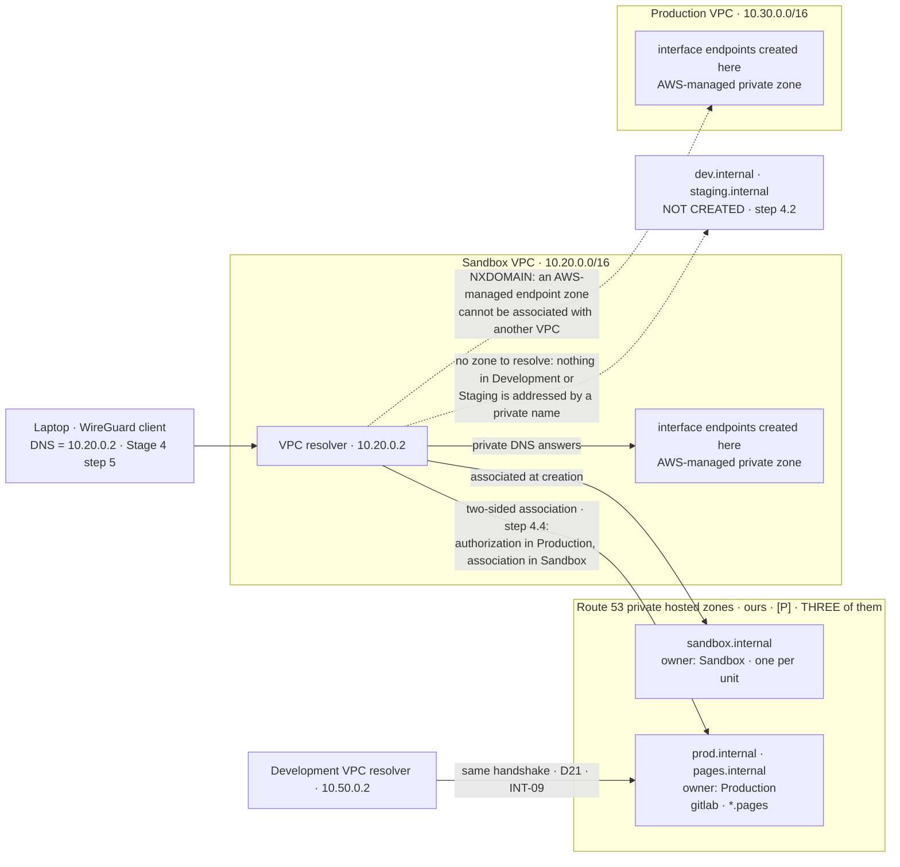

# Stage 3 — Networking

| | |
|---|---|
| **Status** | not started |
| **Prerequisites** | Stage 2. **Plus one answer from [1b step 6](stage-01b-identity-and-controls.md)**: whether the AZ name→ID mapping is the same in every account, which decides how step 1 anchors subnets. **`Staging` is unvended** — the quota-increase request sits in an open AWS support ticket (2026-08-15) — so its `foundation/` and `egress/` apply **at vend**, and the two proofs that name it (its VPC, its empty peering list) defer with it; nothing else in this stage waits on it |
| **Consumes** | [D5](../decisions/D05-sagemaker-egress.md), [D9](../decisions/D09-az-count.md), [D14](../decisions/D14-supply-chain-account.md), [D15](../decisions/D15-tls-internal.md), [D18](../decisions/D18-data-scientist-access.md), [D20](../decisions/D20-staging-account.md), [D21](../decisions/D21-development-account.md), [D22](../decisions/D22-data-governance-account.md), [D35](../decisions/D35-sandbox-cardinality.md) — **plus, for step 8's endpoint lists only**, [D7](../decisions/D07-orchestration.md), [D13](../decisions/D13-lake-formation-enforcement.md), [D24](../decisions/D24-shared-filesystem.md) |
| **Proves** | [INT-09](../integrations.md) (Development ↔ Production peering). **Supplies** what [INT-05](../integrations.md) later depends on: the `[P]` gateway endpoint IDs of step 3 |
| **Log** | `docs/log/log-stage-03-networking.md` — to be created by the user, with its row in [`docs/log/INDEX.md`](../../log/INDEX.md) |

*Read with [`docs/plan/conventions.md`](../conventions.md) (naming, layout, `[P]`/`[D]`/`[E]`, IAM rules).*

---

**Objective:** the private networks everything else sits in, and the perimeter's trusted-networks axis
(`docs/plan/architecture.md` §4.2) built with them.

## What this stage builds, and why every VPC at once

**N + 3 VPCs — one per Sandbox business unit (D35, N = 1 today), plus Development, Staging and
Production — from a single module, on the same day.** Three decisions pushed each of them forward into
this stage, and the argument is the same one three times: the VPC layer is free at rest, so deferring
buys nothing, and applying one module N + 3 times in one sitting is what proves the module.

- **Production (D14):** GitLab lives there and Stage 7 cannot start before its network exists.
- **Staging (D20):** its `egress/` is applied by the promotion pipeline rather than by a person.
- **Development (D21):** its `egress/` is part of an ordinary working session.

**Data Governance gets no VPC at all (D22).** Its data plane is serverless (S3, Glue, Athena, Lake
Formation), consumers reach it through their own endpoints, and an account whose SCP denies compute has
nothing to put in a subnet.

## What is already there — measured 2026-08-15, before the stage

**The stage does not start from zero: every vended account carries an Account Factory VPC** —
`172.31.0.0/16`, `IsDefault: false` (the true default VPC was deleted by the vend), three private
subnets, no IGW, a flow log at 90 days, **and an S3 gateway endpoint on the default full-access
policy** (Lesson 17: a service that sets itself up creates resources nobody chose). Data Governance has
one too, so D22's "no VPC at all" is today an intention rather than a state (Lesson 5); all six overlap
each other by construction. The record is [`docs/AWS_STATE.md`](../../AWS_STATE.md) §C; the measurement is
`./aws/networking.sh` (checks `NT-1`) and `./aws/egress.sh` (`EG-1`), written for this stage. **Step 0
decides their fate, and the Account Factory network configuration half of it must land before the
`Staging` vend** — otherwise the next account arrives with one more.

## Step numbers are identifiers, not an order

Four of these numbers are **stable addresses cited from other files** — `Stage 3 step 4` (private DNS) from
`docs/REFERENCES.md`, [Stage 7](stage-07-gitlab-runners-ecr.md) and [Stage 10](stage-10-orchestration-promotion.md);
`step 6` from D14; `step 8` from `docs/plan/architecture.md`, `docs/plan/cost-model.md` and `docs/plan/open-questions.md`;
`step 9` from `docs/plan/architecture.md`. They do not change. The sequence to work in is **three passes**, and the
split matters because two steps cannot run until *both* of their accounts exist:

| Pass | # | What | Slice · layer | Applied in |
|---|---|---|---|---|
| **1** | 0 | The Account Factory VPCs: delete-or-keep, and the Account Factory network configuration | — (by hand, not a slice) | every vended account; the configuration half in Management, **before the `Staging` vend** |
| **1** | 1 | VPC, the address plan, subnets in 2 AZs | `foundation/` `[P]` | every account that has a VPC, in any order — nothing here crosses a boundary |
| **1** | 2 | IGW, route tables, NACLs, baseline security groups | `foundation/` `[P]` | idem |
| **1** | 3 | S3 + DynamoDB **gateway** endpoints, and their exported IDs | `foundation/` `[P]` | idem |
| **1** | 4.1-4.3 | The **three** private hosted zones | `foundation/` `[P]` | Sandbox and Production only |
| **1** | 5 | VPC Flow Logs | `foundation/` `[P]` | every account that has a VPC |
| **2** | 4.4-4.5 | The four cross-account zone associations | `foundation/` `[P]` | cross-account — needs pass 1 done on **both** sides |
| **2** | 6 | The two peerings into Production | `foundation/` `[P]` | idem |
| **3** | 7 | NAT gateway, behind the D5 switch | `egress/` `[E]` | design A only. Pass 3 is the first `make up` |
| **3** | 8 | Interface endpoints, a list per account role | `egress/` `[E]` | every account that has a VPC, per session |
| **3** | 9 | Endpoint policies + the AWS-owned bucket allow-list | `egress/` `[E]` | idem |
| **3** | 10 | The egress path kept parameterised for Stage 6 | `egress/` `[E]` | idem |

**Pass 2 means `production/foundation/` is applied twice**, unless the whole tree is applied in one run with
provider aliases. Write its accepters and authorizations as a `for_each` over a map of peers, so the second
apply is additive rather than a rewrite of what pass 1 created.

---

## The topology

Three views of the same target, none of which exists yet. Layers are `docs/plan/conventions.md` §5.1.

*View 1 — what crosses an account boundary.* The two solid peerings are the only VPC-level paths between
accounts; everything else is reached over public AWS endpoints, exited through the WireGuard Elastic IP
(`docs/plan/architecture.md` §3, "How a human actually reaches each account").

*View 2 — inside one VPC.* The same `terraform-modules/vpc/` module produces this in every VPC-bearing
account; only the CIDR and the interface-endpoint list differ. Under **design B** the NAT node and both
`0.0.0.0/0` routes do not exist, and the gateway endpoint is the *only* path to the AWS-owned buckets of
step 9 — which is what makes that allow-list load-bearing rather than tidy.

*View 3 — who resolves what.* Neither view above shows it, and it is where step 4 is lost: **a name is
answered by the resolver of the VPC the query enters**, so the laptop's whole private namespace is whatever
the Sandbox VPC can resolve. Solid edges are zones this project owns and can associate; dotted edges are the
two things that return `NXDOMAIN`, one by AWS's design and one by ours.

---

## To execute

The network is split into two slices per account, because the free half and the metered half have different
lifecycles (`docs/plan/conventions.md` §5.1).

### 0. The Account Factory VPCs — by hand, before the slices

**0.1 — What exists**, measured 2026-08-15 (`docs/AWS_STATE.md` §C, `aws/output/networking.txt` §2/§5): one
VPC per vended account, `172.31.0.0/16`, three private subnets, no IGW, a 90-day flow log — and an **S3
gateway endpoint whose policy is the default full-access document**. That endpoint is the exact shape
step 9 exists to forbid: the moment anything computes in one of these VPCs, it is a private, unlogged
path to any bucket on the internet.

**0.2 — The decision: delete them, in every vended account** (recommended), or keep one with the reason
recorded in the log. They duplicate nothing this stage builds, their address range is outside the 1.2
plan, and in Data Governance the decision is forced — D22 says the account holds no VPC at all. Deleting
a VPC is free and loses nothing: they are empty.

**0.3 — They are CloudFormation StackSet artifacts** (`StackSet-AWSControlTowerBP-VPC-ACCOUNT-FACTORY-V1-*`),
so the supported half of the fix is the **Account Factory network configuration** on Management: set it
to create **no VPC**, which governs every future vend — `Staging` and every Stage 14 Sandbox — and is
why this half must land **before the `Staging` vend**. The existing six are then deleted by hand, per
account. **Verify at execution (verification vi)** whether the hand-deletion leaves the stack instance
reporting drift and whether anything ever reconciles it; record the answer either way.

**0.4 — Close the loop by re-running `./aws/networking.sh`**: the `NT-1` notes disappear with the VPCs,
and the `docs/AWS_STATE.md` §C row is updated in the same sitting — a row describing a state that no longer
exists is worse than no row.

### `foundation/` — layer `[P]`, free at rest, never destroyed

#### 1. The VPC and the address plan

**1.1 — The module.** `terraform-modules/vpc/`, applied by **every account that has a VPC**: Sandbox (one
per business unit, D35), Development, Staging, Production. Data Governance is not one of them (D22).

**1.2 — The address plan, settled here because D35 said this is where it is settled.** Ranges are
non-overlapping even between accounts that will never peer: Staging is deliberately unpeered (D20), but a
CIDR chosen to overlap cannot be revisited without rebuilding the VPC, and address space costs nothing.

| Range | Holder | Note |
|---|---|---|
| `10.16.0.0/13` | **Sandbox supernet** (`10.16`-`10.23`) | room for 8 business units; avoids `10.30`/`10.40`/`10.50` |
| `10.20.0.0/16` | Sandbox — **unit 1** | the literal Stage 4 and all three views above already use. The table need not be dense; keeping this value avoids editing four files for nothing |
| `10.30.0.0/16` | Production | |
| `10.40.0.0/16` | Staging | |
| `10.50.0.0/16` | Development | |
| `10.90.0.0/24` | WireGuard peers (Stage 4 step 4) | outside every VPC range, and never seen inside AWS — the instance SNATs |

**1.3 — The table is the artefact, not the literals.** `Sandbox` multiplies and the other three do not, so
the sandbox range is an *allocation* rather than a constant: record the table in the repository and have
[Stage 14](stage-14-sandbox-vending.md) read it to allocate the next unit. A literal per account written by
hand is Lesson 14 in address space, and doing this after the third business unit costs a VPC rebuild in an
account somebody is working in.

**1.4 — Subnets: three tiers × 2 AZs (D9).** Public, private, and an **isolated** tier with no route out.
The isolated tier is created empty on purpose — adding a fourth tier later means re-cutting the address
plan of every VPC, and subnets are free.

**1.5 — Subnets anchor on `zone_ids`, settled by 1b step 6 (2026-08-12).** Pass them per environment in
`.tfvars` (`usw2-az1`, …) and match through `data.aws_availability_zones`'s `zone_ids`; **never index by
list position.** The measurement found all six measured accounts identical, so position *would* work today
— it is rejected because `Staging` and every Stage 14 Sandbox get their own mapping at vend time, and the
failure is silent: both peerings carry constant traffic and cross-AZ is USD 0.01/GB each way, with no error
anywhere. Reasoning in `docs/plan/architecture.md` §4.1; the mapping itself is `./aws/AZs.sh`.

#### 2. Gateways, route tables, NACLs, security groups

**2.1 — One Internet Gateway per VPC**, with the public tier's `0.0.0.0/0` pointing at it. Free, `[P]`.

**2.2 — Route tables per tier.** The private tier's default route exists **only under design A** and is
inserted by `egress/` (steps 7 and 10), not here. The isolated tier never gets one — that is what makes it
isolated.

**2.3 — NACLs stay at the default allow, and the control lives in security groups.** Written down because
"NACLs" is otherwise a field nobody decided (Lesson 16): they are stateless, and a stateless deny is the
fastest way to break a path that nobody can then debug.

**2.4 — Baseline security groups**, referencing each other by ID rather than by CIDR:
- an **endpoint SG** allowing TCP/443 from the VPC CIDR — consumed by step 8. Under design B an endpoint
  whose SG does not admit 443 is not a slow path, it is no path;
- one per subnet tier, for the workloads later stages put there.

#### 3. S3 and DynamoDB gateway endpoints

**3.1 — They are free, which is why they are here and not in `egress/`.** Associate them with the route
tables of all three tiers: private and isolated need them to reach S3 at all, and the public tier uses them
for the WireGuard host's package fetches rather than paying the IGW path.

**3.2 — Export each account's gateway endpoint ID from this slice's outputs.** Stage 5 step 1 conditions
the Data Governance bucket policies on them (INT-05), and the consumer list must be read through
`terraform_remote_state` rather than pasted.

**3.3 — Being `[P]` is the whole point (Lesson 3).** The `[E]` interface endpoints of step 8 get new IDs on
every `make up` and, since D22, live in a different account from the policy that would name them. Nothing
may anchor on those. The gateway endpoint survives every `make down`; `aws:SourceVpc` is the alternative
anchor where a service has no gateway endpoint.

**3.4 — Their policy is step 9**, and for the S3 one it is the single most consequential policy in this stage.

#### 4. Private DNS

**4.1 — Two VPC attributes have to be on, or nothing below works** — including private DNS on the interface
endpoints of step 8. `enable_dns_support` **and** `enable_dns_hostnames`. `aws_vpc` defaults the second to
**false**; only the default VPC has both on.

**4.2 — Three zones, and deliberately not one per account.** `sandbox.internal` (one per business unit),
`prod.internal`, and `pages.internal` — the last built here rather than in Stage 7 because
`docs/plan/conventions.md` §6 places it in `production/foundation/`, and because its associations (4.4) are
cheaper to create alongside the others than to come back for. **Development and Staging get no zone:**
nothing in either is addressed by a private name, both are used through public AWS API endpoints, and at
USD 0.50/zone-month two unused zones are USD 1.00/month against a USD 50 ceiling. Three zones at N = 1 is
also exactly what `docs/plan/cost-model.md`'s floor already assumes.

**4.3 — These are the only zones this project owns before Stage 13 (D15).** No registered domain, no public
zone, no split-horizon.

**4.4 — The cross-account association is a two-sided handshake, and this is the step that makes "reach
GitLab by name over the VPN" work.** The laptop's resolver is the *Sandbox* VPC (Stage 4 step 5), so a query
for `gitlab.prod.internal` is answered there and returns `NXDOMAIN` unless Production's zone is associated
with the Sandbox VPC. Terraform splits it exactly as the CLI does — `aws_route53_vpc_association_authorization`
in the **zone owner**, `aws_route53_zone_association` in the **VPC owner**, behind a provider alias. **Four
associations:**

| Zone | Associated VPC | Why |
|---|---|---|
| `prod.internal` | Sandbox | the VPN path to GitLab |
| `prod.internal` | Development | D21: the `engineering` project clones from GitLab (INT-09) |
| `pages.internal` | Sandbox | Pages is read from the laptop (Stage 7 step 4) |
| `pages.internal` | Development | and from Studio in Development |

`sandbox.internal` is associated with its own VPC at creation and needs no handshake.

**4.5 — The ordering trap.** AWS *recommends* deleting the authorization once the association exists
(Terraform's destroy of `aws_route53_vpc_association_authorization` does the equivalent) — it is not
promised to vanish on its own, so verify the observed lifecycle at execution and record it. What is
certain either way: a re-created association after a VPC rebuild needs a **fresh** authorization, and a
pending authorization whose second half never ran is visible in `./aws/networking.sh` §7. Both zones are
`[P]`, which makes this a once-per-account operation — and is the argument for putting the association in
`foundation/` rather than anywhere `make down` can reach.

**4.6 — What none of this extends to, and it is the trap one layer down.** The private DNS of an
**interface** endpoint is served by an AWS-*managed* hosted zone that is invisible in the account and
cannot be associated with another VPC, so an endpoint created in Production answers inside Production only.
Hence the rule: **any AWS-service name that must resolve privately for the laptop needs its endpoint in the
Sandbox VPC**, or a zone of our own holding ALIAS records to the endpoint's DNS name. Not a problem today —
every endpoint the laptop needs is in Sandbox, and GitLab is reached through a zone that *is* ours — but it
is why the provisioned-MWAA fallback carries a DNS step (Stage 10 step 4).

#### 5. VPC Flow Logs

**5.1 — One per VPC, to CloudWatch Logs**, with an explicit short retention (7 days). Retention is what
accumulates; ingestion (~USD 0.50/GB) is billed only while traffic flows, so this is free at rest and a
small per-hour cost while the lab is up.

**5.2 — This is for debugging, not for detection.** GuardDuty (Stage 4 step 10) reads flow logs on its own
without anything being enabled here. What these buy is the ability to see *which* packet was dropped —
which, under design B, is the most likely thing to need seeing.

#### 6. The two VPC peerings

**6.1 — Sandbox ↔ Production.** Requester in `sandbox/foundation/`, accepter in `production/foundation/`
(provider alias, cross-account). This is also the path the VPN uses to reach GitLab (Stage 4).

**6.2 — Development ↔ Production (D21, INT-09), the same shape.** Studio in Development must clone from and
push to GitLab, so `development/foundation/` carries a second requester and `production/foundation/` a
second accepter. **Production accepts two peerings and nothing else.**

**6.3 — Routes are per subnet, not per VPC — and they go on the route tables of the subnets that
*originate* the traffic.** Peering is a path between an account where people experiment and the account
that runs production; it earns a narrow route table, not a convenient one.

| Route table | Destination | Why it is the one that matters |
|---|---|---|
| Sandbox **public** | the Production subnet holding GitLab | **the tunnel's route.** The WireGuard instance SNATs the laptop, so the packet reaching GitLab carries that instance's private IP — and the instance is in the public subnet. Omit this and the tunnel comes up while GitLab stays unreachable |
| Sandbox **private** | same | Studio apps |
| Development **private** | same | Studio apps cloning from GitLab (INT-09) |
| Production **private** (GitLab's) | the Sandbox and Development subnet CIDRs | the return path |

**6.4 — Security groups reference the peer's security group** (cross-account SG references work across a
same-region peering) or the peer subnet CIDR explicitly — never `0.0.0.0/0`, never the whole peer VPC.

**6.5 — The WireGuard client range (`10.90.0.0/24`) appears in no route table anywhere.** VPC peering does
no edge-to-edge routing and forwards only packets whose source and destination sit inside the two VPCs'
CIDRs. That is exactly why the NAT on the WireGuard instance is not optional (Stage 4 step 1).

**6.6 — There is no peering to Staging, and that is a decision rather than an omission (D20).** The two
peerings exist for one concrete reason: GitLab must be reachable at the VPC level. Nothing in Staging needs
that — the data scientists' read access there (D18) is data plane (S3, Athena, CloudWatch Logs), which
reaches public AWS endpoints through the tunnel. A third peering would buy route-table complexity and one
more hand-driven path into an account whose whole value is that nobody touches it by hand. Recorded here so
that the day something genuinely needs it, the question is reopened deliberately.

### `egress/` — layer `[E]`, destroyed at the end of every session

#### 7. NAT Gateway — design A only

**7.1 — A single NAT** in one public subnet, with a documented switch for one-per-AZ.

**7.2 — It is conditional, not assumed.** Under egress design B (`docs/plan/architecture.md` §4.3) the SageMaker
subnets get no default route at all and this resource does not exist.

**7.3 — ~USD 0.050/h plus 0.045/GB processed** — the largest single hourly item after the endpoint set.

#### 8. Interface VPC endpoints — a per-account list, not one list

**8.1 — The list is a module variable with a documented default per account role.** One list applied
everywhere was wrong in both directions: it paid for endpoints an account cannot use and left out the ones
its data plane needs.

**8.2 — The common core, in every account (8):** `sts`, `logs`, `kms`, `ecr.api`, `ecr.dkr`, and the
data-plane three — **`athena`**, **`glue`**, **`lakeformation`**. D13 routes every tabular read through an
LF-aware engine, so `athena` and `glue` are how a notebook reaches its own data at all; under design B,
with no NAT anywhere, their absence means the design cannot execute a single query. `lakeformation` is the
least certain of the three — in a plain Athena flow the credential vending happens service-side, while
`awswrangler` and Glue interactive sessions resolve it from the VPC — and is included at a cent an hour
rather than discovered at Stage 6.

**8.3 — Then, per account role:**

| Account | Adds | Notes |
|---|---|---|
| **Sandbox** | `sagemaker.api`, `sagemaker.runtime`, `sagemaker.studio`, `elasticfilesystem` | `sagemaker.studio` is required for JupyterLab/Code Editor apps in a VPC-only domain — they simply do not start without it |
| **Development** | `sagemaker.api`, `sagemaker.runtime`, `sagemaker.studio` | **No `elasticfilesystem`** — D24 gives Development neither its own EFS nor a path to Sandbox's, so this endpoint would be a cent an hour resolving nothing |
| **Staging** | `sagemaker.api`, `sagemaker.runtime` | No domain, so no `sagemaker.studio`. **Minus `lakeformation`** — Staging is deliberately not on the Data Governance share (D20, D22), and an endpoint for a share that does not exist is a control smell, not just a cost |
| **Production** | `sagemaker.api`, `sagemaker.runtime`, and under D7(B) `states` + `scheduler` | Holds the LF read **and governed write** share (D22), so `lakeformation` is load-bearing here rather than precautionary |

**8.4 — Under D5(B) the Interactive accounts add `codeartifact.api` and `codeartifact.repositories`** — the
package path when there is no NAT. They resolve a domain created by **Stage 7 step 5**, which
`docs/plan/conventions.md` §6 applies early (before Stage 6) precisely so this works when the comparison runs.

**8.5 — Per endpoint:** private DNS enabled (which needs 4.1), the endpoint SG from 2.4, and a **single AZ**
(D9) — two AZs doubles the largest hourly line item, and a resource in the other AZ still resolves and
reaches it.

**8.6 — Nothing may condition on these IDs** (Lesson 3, INT-05) — they are `[E]` and new on every `make up`.
Anchor on step 3's gateway endpoint or on `aws:SourceVpc`.

**8.7 — Candidates deliberately not created yet, with the trigger for each**, so that "it must be a missing
endpoint" is a checklist rather than a guess at 23:00:

| Candidate | Account | Trigger |
|---|---|---|
| `datazone` | Interactive | if VPC-only project apps call the domain for project context or connections. Unknown — **verify at Stage 6** and add it there |
| `ssm` + `ssmmessages` + `ec2messages` | Production | Session Manager reaches GitLab through the NAT, but Production's NAT is `[E]` and only up during builds. The trigger is the first time you need into the GitLab host outside a build window. +0.030/h |
| `secretsmanager` | Production | `gitlab-secrets.json` (Stage 7 step 1), same NAT caveat |
| `monitoring` | any | if the CloudWatch agent on a private-subnet host cannot push metrics |

#### 9. Endpoint policies — the trusted-networks axis

**9.1 — Every interface and gateway endpoint carries a policy restricting it to the organization**
(`aws:PrincipalOrgID` / `aws:ResourceOrgID`), which is the third axis of `docs/plan/architecture.md` §4.2 and is
free. Without it the S3 gateway endpoint is a private, unlogged, unmetered path to *any* bucket on the
internet, including someone's personal one — the exact failure mode the whole DLP objective is about.

**9.2 — Take the shapes from the `data-perimeter-policy-examples` repository** rather than writing them by
hand: the service carve-outs (`aws:ViaAWSService`, `aws:PrincipalIsAWSService`) are the part everyone forgets.

**9.3 — The carve-out that repository will not write for you, and that this project cannot do without.**
`aws:ResourceOrgID` denies AWS's own service-owned buckets, because they are not in your organization. The
S3 gateway endpoint policy therefore needs a second, explicitly enumerated `Allow`, scoped to `s3:GetObject`
(and `s3:ListBucket` where the client needs it), covering:
- the **Amazon Linux 2023 package repositories** (`al2023-repos-<region>-*`) — without them `dnf update` and
  every install on the WireGuard host, the GitLab host and any EC2 runner stops working. `CLAUDE.md` asks in
  as many words to keep "the possibility of software updates"; this is the line that honours it;
- **SageMaker's regional buckets** for built-in images, sample data and JumpStart artifacts;
- the **SSM agent and CloudWatch agent** distribution buckets.

**9.4 — `aws:ViaAWSService` does not rescue these.** A `dnf` process on an instance is not an AWS service
calling on your behalf; it is your own credential fetching an object.

**9.5 — Write the list as a module variable with a documented default, never inline.** It is the statement
most likely to be trimmed by somebody tidying up, and its failure mode is a package manager that hangs
rather than an `AccessDenied` anyone can read. Under design B the endpoint is the *only* route to those
buckets, so this is not optional in any sense.

#### 10. Keep the egress path parameterised

**10.1 — The default route is an input, not a literal.** An `egress_mode = "A" | "B"` switch selects
NAT-or-nothing, and the private tier's default route target comes from a variable.

**10.2 — So Stage 6 can insert a DNS Firewall or a proxy into the path, or remove the path entirely under
design B, without reshaping `foundation/`.** That comparison is the point of D5, and it must not require a
`[P]` change.

**10.3 — The switch is per account.** D5 governs the Interactive accounts; Staging and Production keep a NAT
for the minutes a promotion or a build runs.

---

## Deliverables

Each is written so its output differs between working and broken (Lesson 13). **The mechanical half of
every reading below is `./aws/networking.sh` and `./aws/egress.sh`** ([`aws/INDEX.md`](../../../aws/INDEX.md)),
written for this stage; the probes carry only what a describe call cannot. Two throwaway `t4g.nano`
probes — one in the Sandbox public subnet, one in the Production GitLab subnet — carry the reachability
proofs and are destroyed in the same sitting; at ~USD 0.004/h that is the cheapest honest evidence available
before Stage 4 exists.

- **The module applied N + 3 times:** four VPCs from one module, with the Sandbox range taken from the
  allocation table of 1.2 rather than from a literal. **N + 2 while `Staging` is unvended** — its apply
  joins at vend, and the one-module argument is unweakened by arriving a vend later.
- **The `[P]` anchor exists and survives:** `terraform output` in each `foundation/` returns the gateway
  endpoint ID, and it is **unchanged** after `make down` + `make up`, while the interface endpoint IDs are
  all **new** — the pair that shows which of the two INT-05 may name.
- **Private DNS resolves across the account boundary:** a temporary `probe.prod.internal` A record resolves
  from a Sandbox host **and** from a Development host, and returns `NXDOMAIN` from Staging. Delete the
  record afterwards.
- **The peerings are reachable in the intended direction only:** the Sandbox probe reaches the Production
  probe on the GitLab port; the same probe reaches **nothing** in a Production subnet outside the permitted
  one; `aws ec2 describe-vpc-peering-connections` in **Staging** returns empty, which is the proof that the
  missing peering is missing on purpose — **deferred until the vend**, since the account does not exist;
  until then `NT-3`/`NT-6` in `./aws/networking.sh` hold the near half: no measured account routes or peers
  toward `10.40.0.0/16`.
- **The perimeter allows what it must and denies what it must**, from a private-subnet probe with no NAT
  route: `aws s3 ls s3://<a bucket outside the organization>` is **denied** through the gateway endpoint,
  **and** `dnf makecache` **succeeds**. Either result alone proves nothing — the first passes with an
  allow-list that is too narrow, the second with one that is too wide.
- **Flow logs are visible** for a connection that was just made, and for one that was just dropped.
- **The lifecycle holds:** `make down` then `make up` restores `egress/` while every `foundation/` ID — VPC,
  subnets, gateway endpoint, hosted zones, peerings — is byte-identical before and after.

## Validation

1. Compare the `foundation/` resource IDs before and after a `make down`/`make up` cycle, by reading the
   plan output rather than by trusting the target list — and as a `diff` of two runs of
   `./aws/networking.sh`, one either side of the cycle: only the timestamp may change.
2. Confirm no route table in any account carries a **non-local** destination inside `10.40.0.0/16` — a
   vended Staging VPC's own `local` route is the one legitimate appearance, and the original wording
   ("no destination") would have failed against it. Mechanised as `./aws/networking.sh` `NT-3`, which
   excludes `local` routes for exactly that reason.
3. **Destroy both probes and delete the temporary DNS record** when the checks pass, and read
   `./aws/egress.sh` §6 (the burn meter) on the way out.

## Cost

This is where the metered bill starts, and `egress/` is the single biggest hourly cost of the lab. Per
account, single AZ, at USD 0.010/h per endpoint and USD 0.050/h for a NAT gateway with its public IPv4:

| Account | Design A (NAT) | Design B (no NAT) |
|---|---|---|
| Sandbox | 12 endpoints + NAT = **0.170/h** | 14 endpoints = **0.140/h** |
| Development | 11 + NAT = **0.160/h** | 13 = **0.130/h** |
| Staging | 9 + NAT = **0.140/h**, for the minutes a promotion runs | — (D5 governs the Interactive accounts) |
| Production | 10-12 + NAT = **0.150-0.170/h**, while runners or orchestration are up | — |

**Design B is cheaper by exactly USD 0.030/h** — the NAT and its address (0.050) less the two CodeArtifact
endpoints (0.020) — in every account and for every list. Three cents an hour settles nothing; D5's
comparison is decided by friction, not by this table. Keep each list minimal: every entry is a permanent
hourly charge for the whole session, and the per-account split exists so that trimming one account does not
silently trim another.

**On the floor, this stage adds ~USD 1.50/month** — three private hosted zones at USD 0.50 (step 4.2) — plus
cents of flow-log storage. Both are already inside `docs/plan/cost-model.md`'s floor. **The Sandbox row of the
hourly table is per business unit (D35)** and is the term that multiplies.

## Decisions due while executing

**Blocking questions for the user: none.** Each is decided during the stage and written into
`docs/log/log-stage-03-networking.md` rather than left to whoever is at the keyboard (Lesson 16).

1. **The Sandbox supernet and the allocation table** (1.2, 1.3) — confirm `10.16.0.0/13` and record where
   the table lives, since Stage 14 reads it.
2. ~~**Whether subnets anchor on `zone_ids` or on list position**~~ — **not a decision any more** (1.5):
   1b step 6 settled it as `zone_ids`. What is left is recording the ID per environment in `.tfvars`.
3. **The flow-log retention** (5.1) — a cost choice, not a compliance one.
4. **Which `egress_mode` is the default** (10.1). Recommended: **A**, so that an ordinary session works
   while B's package path is still being built; B is exercised deliberately at Stage 6, which is where D5
   says the comparison happens.
5. **The AWS-owned bucket allow-list** (9.3) — the enumerated ARNs, recorded as a list that is maintained
   rather than discovered.
6. **The Account Factory VPCs** (step 0) — delete-or-keep per vended account, recorded in the log, and
   the Account Factory network configuration change on Management **before the `Staging` vend**, so the
   next account arrives without one. Update `docs/AWS_STATE.md` §C in the same sitting (0.4).

## Verifications to answer while executing

Record every answer, including the ones that come out fine.

| # | Question | Step |
|---|---|---|
| i | Does the `sagemaker.studio` endpoint use the non-standard `aws.sagemaker.<region>.studio` service name rather than the `com.amazonaws.*` form? **Answered 2026-08-15, read-only** (`./aws/egress.sh` §7, the service catalog): **yes** — `aws.sagemaker.us-west-2.studio` is listed in exactly that form, and 8.4's two CodeArtifact services both exist in `us-west-2` | 8.3 |
| ii | Is `lakeformation` actually called from the VPC in the flows this project uses, or only service-side? If only service-side, it leaves the core list at Stage 6 | 8.2 |
| iii | Does the `dnf` path work through the gateway endpoint with **no NAT route at all**, i.e. is the allow-list of 9.3 complete? | 9.3 |
| iv | Does a second `apply` of `production/foundation/` add the accepters and authorizations without touching what pass 1 created? | pass 2 |
| v | Do the AZ mappings differ between accounts, and therefore is any peering traffic cross-AZ? | 1.5 |
| vi | Does hand-deleting an Account Factory VPC leave its `StackSet-AWSControlTowerBP-VPC-ACCOUNT-FACTORY-*` stack instance reporting drift, and does anything ever reconcile it? | 0.3 |
| vii | Does the Route 53 association authorization in fact persist after the association completes (AWS recommends deleting it; nothing promises auto-removal)? | 4.5 |

## Risks

- **Everything in `foundation/` is `[P]`.** A CIDR or subnet layout chosen here is changed by rebuilding the
  VPC — in an account somebody is working in, once Stage 6 exists.
- **Two failures here are silent rather than loud:** the zone association's ordering trap (4.5), where the
  authorization disappears once used; and the endpoint policy of step 9, which fails as a package manager
  hanging rather than as an `AccessDenied` anyone reads.
- **A forgotten `egress/` costs ~USD 4.08 per day** at 0.170/h, and since the budget alerts were skipped by
  decision (D12) nothing *alerts* until the end of the month (`docs/plan/cost-model.md`). The manual instrument
  that risk gets is `./aws/egress.sh` §6, the burn meter — run it at the end of every session; zero
  everywhere is D11 working.

---

*Stage index: [stages/INDEX.md](INDEX.md) · Plan core: [GENERAL_PLAN.md](../../GENERAL_PLAN.md)*
