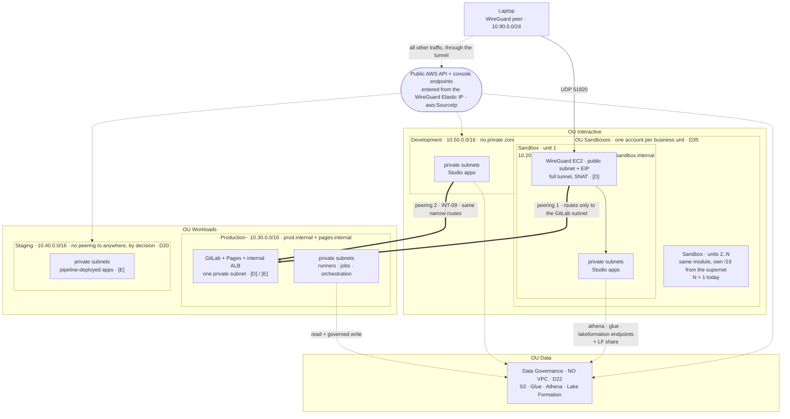
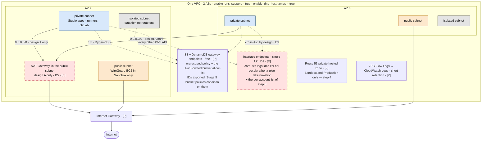
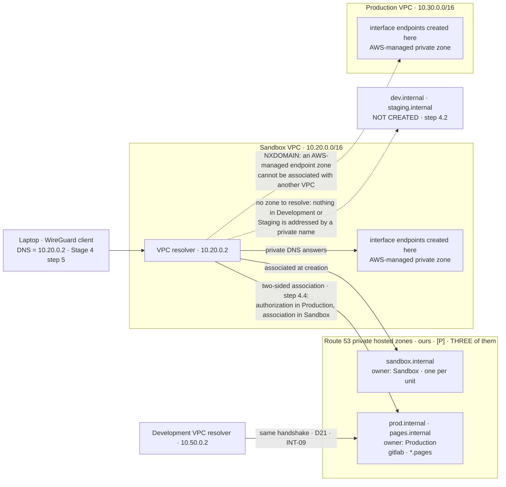

# Stage 3 — Networking

| | |
|---|---|
| **Status** | **ALL THREE PASSES APPLIED (2026-08-16)** — step 0: the stack instances deleted from Management, **nothing survived** (verification (vi)), Account Factory creates no VPC; steps 1-5: the four modules tagged `*-v0.1.0`, `foundation/` **applied in Sandbox (31), Development (30) and Production (32)**; steps 4.4-4.5 and 6: the four zone associations and the two peerings with their 22 subnet-level routes, **one ordered apply on the accepting side** (+1/+1/+32, verification (iv): additive, re-plan `No changes` everywhere); steps 7-10: `vpc-egress-v0.1.0` and the three `egress/` slices, **applied through `make up`** for 16/15/14 resources — **`./aws/egress.py` all checks passed, `./aws/networking.py` 0 FAILED, every `foundation/` re-plan `No changes`**. **The Validation's `make down`/`make up` cycle RAN 2026-08-16** and is answered: all three `foundation/` output sets **byte-identical** across the cycle, all three re-plans `No changes` (`-detailed-exitcode 0`), **39/39 `[E]` ids new**, the S3 and DynamoDB gateway endpoints unmoved, and the private tier's default route rebuilt onto the new NAT in every account. **The probes RAN 2026-08-16** as three `[E]` slices — the blockquote on Deliverables carries every reading, **verification (iii) among them: `dnf makecache` succeeded from a tier with no default route, and the allow-list denied an equally public bucket it does not name (200 / 403)**. **INT-09 was exercised for the first time.** **TORN DOWN 2026-08-16 — `make down` on all three accounts, 59 resources, USD 0.0000/h**, probe slices before `egress/` in each because `probes` ranks 60 and `down` walks the table in reverse; `foundation/` byte-identical for the third time and every re-plan `No changes`. **The stage is closed.** What remains belongs elsewhere: the `Staging` clause of the DNS Deliverable, which has no host to refuse until the vend, and verification (ii), which is Stage 6's by nature. **Stage 4's verification (i) is NOT pre-answered** — `dnf makecache` measured the metadata path, not a package download, and the CloudWatch agent comes from an allow-list entry `makecache` never touches. **The five execute-time decisions were settled with the user on 2026-08-16**, before the stage, each recorded at the step that owns it ("Decisions due while executing" is the index). **Revised 2026-08-16 into the action-checklist format**, with three corrections taken from the official documentation: **step 0's supported removal path is deleting the stack instances from the Account Factory StackSet on Management** — not a per-account hand-deletion, which is what the log's first entry still records; **AL2023 serves its mirror list from the repository bucket itself**, so the design-B caveat 9.3 carried is withdrawn; and **verification (vii) is answered by the Route 53 documentation** (the authorization persists until deleted; deleting it does not affect the association). **Amended 2026-08-17: `elasticfilesystem` left the Sandbox endpoint list (8.3)** — the NFS requirement was withdrawn and D24 with it; the slice as *applied and torn down* carried 12 interface endpoints, the next `make up` carries 11 |
| **Prerequisites** | Stage 2. The AZ name→ID question from 1b step 6 is settled — subnets anchor on `zone_ids` (1.5), the mapping is `./aws/AZs.py`. **`Staging` is unvended** — the quota-increase request sits in an open AWS support ticket (2026-08-15) — so its `foundation/` and `egress/` apply **at vend**, and the two proofs that name it (its VPC, its empty peering list) defer with it; nothing else in this stage waits on it |
| **Consumes** | [D5](../decisions/D05-sagemaker-egress.md), [D9](../decisions/D09-az-count.md), [D14](../decisions/D14-supply-chain-account.md), [D15](../decisions/D15-tls-internal.md), [D18](../decisions/D18-data-scientist-access.md), [D20](../decisions/D20-staging-account.md), [D21](../decisions/D21-development-account.md), [D22](../decisions/D22-data-governance-account.md), [D35](../decisions/D35-sandbox-cardinality.md) — **plus, for step 8's endpoint lists only**, [D7](../decisions/D07-orchestration.md), [D13](../decisions/D13-lake-formation-enforcement.md) |
| **Proves** | [INT-09](../integrations.md) (Development ↔ Production peering). **Supplies** what [INT-05](../integrations.md) later depends on: the `[P]` gateway endpoint IDs of step 3 |
| **Log** | [`docs/log/log-stage-03-networking.md`](../../log/log-stage-03-networking.md) — created 2026-08-16, **nine entries**: the five decisions settled before the stage, two corrected against the documentation, step 0, one per applied pass, the D11 `make down`/`make up` cycle, the probes, and the teardown. Its row is in [`docs/log/INDEX.md`](../../log/INDEX.md) |

*Read with [`docs/plan/conventions.md`](../conventions.md) (naming, layout, `[P]`/`[D]`/`[E]`, IAM rules).*

---

**Objective:** the private networks everything else sits in, and the perimeter's trusted-networks axis
(`docs/plan/architecture.md` §4.2) built with them.

## What this stage builds, and why every VPC at once

**N + 3 VPCs — one per Sandbox business unit (D35, N = 1 today), plus Development, Staging and
Production — from a single module, in one sitting.** The VPC layer is free at rest, so deferring buys
nothing, and applying one module N + 3 times is what proves the module. Three decisions pushed each
account forward into this stage:

- **Production (D14):** GitLab lives there and Stage 7 cannot start before its network exists.
- **Staging (D20):** its `egress/` is applied by the promotion pipeline rather than by a person.
- **Development (D21):** its `egress/` is part of an ordinary working session.

**Data Governance gets no VPC at all (D22):** its data plane is serverless, consumers bring their own
endpoints, and an account whose SCP denies compute has nothing to put in a subnet.

## What is already there — measured 2026-08-15, before the stage

**Every vended account carries an Account Factory VPC** — `172.31.0.0/16`, `IsDefault: false`, three
private subnets, no IGW, a 90-day flow log, and an **S3 gateway endpoint on the default full-access
policy** (Lesson 17), which is the exact shape step 9 exists to forbid. Data Governance has one too, so
D22 is today an intention rather than a state (Lesson 5); all of them overlap each other by construction.
The record is [`docs/AWS_STATE.md`](../../AWS_STATE.md) §C; the instruments are `./aws/networking.py`
(`NT-1`) and `./aws/egress.py` (`EG-1`). **Step 0 removes them, and its Account Factory configuration
half must land before the `Staging` vend** — otherwise the next account arrives with one more.

## Who executes each action

Every action below opens with one of three markers:

| Marker | Meaning |
|---|---|
| **[Claude]** | repository edits and read-only AWS calls — done without asking |
| **[Claude⚡]** | `terraform apply` or any AWS write — Claude runs it **only after the user authorizes that specific action in chat** (the `CLAUDE.md` standing rule), with the SSO user/account/permission set stated first |
| **[user]** | console acts (Management and every account with no CLI profile, Control Tower objects), git commits and tags, and every log entry |

## Step numbers are identifiers, not an order

Several of these numbers are **stable addresses cited from other files** — `step 4` (private DNS) from
`docs/REFERENCES.md`, [Stage 7](stage-07-gitlab-runners-ecr.md) and [Stage 10](stage-10-orchestration-promotion.md);
`step 6` from D14; `step 8` from `docs/plan/architecture.md`, `docs/plan/cost-model.md` and `docs/plan/open-questions.md`;
`step 9` from `docs/plan/architecture.md`; `1.1a` from the stage index. They do not change. The sequence to work in
is **three passes**, split because two steps cannot run until *both* of their accounts exist:

| Pass | # | What | Slice · layer | Applied in |
|---|---|---|---|---|
| **1** | 0 | The Account Factory VPCs: stack-instance removals + the Account Factory network configuration | — (by hand, not a slice) | **Management, both halves**; the configuration half **before the `Staging` vend** |
| **1** | 1 | VPC, the address plan, subnets in 2 AZs | `foundation/` `[P]` | every account that has a VPC, in any order — nothing here crosses a boundary |
| **1** | 2 | IGW, route tables, NACLs, baseline security groups | `foundation/` `[P]` | idem |
| **1** | 3 | S3 + DynamoDB **gateway** endpoints, and their exported IDs | `foundation/` `[P]` | idem |
| **1** | 4.1-4.3 | The **three** private hosted zones | `foundation/` `[P]` | Sandbox and Production only |
| **1** | 5 | VPC Flow Logs | `foundation/` `[P]` | every account that has a VPC |
| **2** | 4.4-4.5 | The four cross-account zone associations | `foundation/` `[P]` | cross-account — needs pass 1 done on **both** sides |
| **2** | 6 | The two peerings into Production | `foundation/` `[P]` | idem |
| **3** | 7 | NAT gateway, behind the D5 switch | `egress/` `[E]` | design A only. Pass 3 is the first `make up` |
| **3** | 8 | Interface endpoints, a list per account role | `egress/` `[E]` | every account that has a VPC, per session |
| **3** | 9 | Endpoint policies + the AWS-owned bucket allow-list | `egress/` `[E]` | idem |
| **3** | 10 | The egress path kept parameterised for Stage 6 | `egress/` `[E]` | idem |

**Pass 2 means `production/foundation/` is applied twice**, unless the whole tree is applied in one run with
provider aliases. Write its accepters and authorizations as a `for_each` over a map of peers, so the second
apply is additive rather than a rewrite of what pass 1 created.

---

## The topology

> **This section is the target as PLANNED at this stage, and it is kept for that.** What the network
> looks like **now** — measured, with every account's addresses, the two egress paths and the
> blueprint-provisioned pieces this stage could not foresee — is
> [`docs/NETWORK.md`](../../NETWORK.md), which is the file that gets updated when the network changes.
> When the two disagree, that one is current and this one is history.

Three views of the same target, none of which exists yet. Layers are `docs/plan/conventions.md` §5.1.

*View 1 — what crosses an account boundary.* The two solid peerings are the only VPC-level paths between
accounts; everything else is reached over public AWS endpoints, exited through the WireGuard Elastic IP
(`docs/plan/architecture.md` §3, "How a human actually reaches each account").

*View 2 — inside one VPC.* The same `terraform-modules/vpc/` module produces this in every VPC-bearing
account; only the CIDR and the interface-endpoint list differ. Under **design B** the NAT node and both
`0.0.0.0/0` routes do not exist, and the gateway endpoint is the *only* path to the AWS-owned buckets of
step 9 — which is what makes that allow-list load-bearing rather than tidy.

*View 3 — who resolves what.* Neither view above shows it, and it is where step 4 is lost: **a name is
answered by the resolver of the VPC the query enters**, so the laptop's whole private namespace is whatever
the Sandbox VPC can resolve. Solid edges are zones this project owns and can associate; dotted edges are the
two things that return `NXDOMAIN`, one by AWS's design and one by ours.

---

## To execute

The network is split into two slices per account, because the free half and the metered half have different
lifecycles (`docs/plan/conventions.md` §5.1).

### 0. The Account Factory VPCs — by hand, before the slices

**Action:** remove the vend-artifact VPCs from every vended account and stop Account Factory from creating
more. **Why:** each carries an S3 gateway endpoint on the default full-access policy — a private, unlogged
path to any bucket the moment anything computes there — their range is outside the 1.2 plan, and in Data
Governance D22 forces the removal. **Explanation:** settled 2026-08-16 (decision 6): remove all of them,
creation off. Corrected against the documentation on the same day: the VPCs are CloudFormation artifacts,
and the **supported removal is deleting their stack instances from the StackSet on Management** — cleanly,
through the same machinery that created them — not a per-account hand-deletion, which is what the log's
first entry still records as the intent. Both halves are Management console acts; only the configuration
half has a deadline (**before the `Staging` vend**).

> **RAN 2026-08-16, all four sub-steps.** 0.1 clean (one Account Factory VPC per vended account, zero
> ENIs in each, one `CREATE_COMPLETE` stack per account); 0.2 and 0.3 by the user from Management, the
> log has the field-by-field record; 0.4 closed the loop — **no VPC in any measured account**, every
> `NT-1`/`EG-1` note gone, `docs/AWS_STATE.md` §C rewritten. Verification (vi): **nothing survives** the
> stack-instance deletion, the flow-log log group included. What remains of step 0 is only the proof of
> the configuration half, at the `Staging` vend.

- **0.1 — [Claude] Re-measure what exists** before touching anything: run `./aws/networking.py` and
  `./aws/egress.py`, and confirm the `NT-1`/`EG-1` notes still describe one Account Factory VPC per vended
  account (`docs/AWS_STATE.md` §C) and nothing new.
- **0.2 — [user] Delete the stack instances** — signed in as `AWS Control Tower Admin` on **Management**
  through `AWSAdministratorAccess`: CloudFormation → StackSets → `AWSControlTowerBP-VPC-ACCOUNT-FACTORY-V1`
  → Actions → **Delete stacks from StackSet**, selecting every account instance, region `us-west-2`,
  **RetainStacks off** — so CloudFormation deletes the VPC, subnets, endpoint and flow log it created, in
  every account at once, with nothing left to drift. This is the removal path the Control Tower
  documentation itself names ("clean up the VPC resource… remove the stack instance"). The VPCs are empty
  (0.1), so no dependency blocks the delete. Record the answer to verification (vi): what, if anything,
  survives — the flow-log log group is the candidate — and whether `Policy Canary` had an instance too.
- **0.3 — [user] Turn VPC creation off in Account Factory** — same sitting, same identity: Control Tower →
  Account Factory → **Edit** in the Network configuration section, then **both** documented options: turn
  **off** the *Internet-accessible subnet* toggle, set *Maximum number of private subnets* to **0**, and
  **clear every checkbox** under *Regions for VPC creation*. Clear the CIDR field's default if the form
  rejects it ("the CIDR is not valid" is the documented error). This governs every future vend — `Staging`
  and every Stage 14 Sandbox — and is why this half lands **before the `Staging` vend**.
- **0.4 — [Claude] Close the loop**: re-run `./aws/networking.py` and `./aws/egress.py` — the `NT-1`/`EG-1`
  notes must disappear — and update `docs/AWS_STATE.md` §C in the same sitting; a row describing a state
  that no longer exists is worse than no row. **[user]** Record 0.2 and 0.3 in the stage log.

### `foundation/` — layer `[P]`, free at rest, never destroyed

> **RAN 2026-08-16 — pass 1 applied in Sandbox, Development and Production** (31, 30 and 32
> resources; **only-create plans, re-plan `No changes` everywhere**). Modules tagged `vpc-v0.1.0`,
> `iam-role-v0.1.0`, `kms-key-v0.1.0`, `s3-bucket-v0.1.0` on GitHub; the two-commit order (modules +
> tags pushed **before** the slices' commit) is what lets `terraform_validate` init the callers. The
> post-apply `./aws/networking.py` reads green except the **four `NT-8` rows — pass 2's own pending
> work** (4.4). Measuring pass 1 also exposed that `NT-3`/`NT-4` flagged the mandatory public
> `0.0.0.0/0 → igw` route as an "overlap"; the instrument now excludes exactly the internet-exit
> default route, which cannot deliver into an RFC1918 range.
>
> **RAN 2026-08-16, same day — pass 2 applied** (4.4-4.5, 6): the requesters in Sandbox and Development
> (+1 each), then **everything else in one ordered apply on the accepting side** (+32: 4 authorizations,
> 4 associations made *as* the VPC owners through provider aliases, 2 accepters, 22 subnet-level
> routes) — the one place "authorization before association" and "route only after the peering is
> ACTIVE" both point forward in a single apply. Verification (iv): **additive** — 0 changed, 0
> destroyed, re-plan `No changes` everywhere. **`./aws/networking.py` reads 0 FAILED**,
> `NT-6` counting two peerings and `NT-8` all five rows green; (vii)'s residual confirmed —
> `list-vpc-association-authorizations` shows exactly the four rows Terraform holds. What remains of
> the stage is **pass 3**: `egress/` `[E]`, the first `make up`.

#### 1. The VPC and the address plan

**Action:** write the `vpc` module (and the three modules moved in from Stage 2 step 7), extend the
generated-tfvars machinery with the address allocation, and apply `foundation/` in every VPC-bearing
account. **Why:** everything later in the project sits inside these VPCs, and every value chosen here is
`[P]` — changed only by rebuilding a VPC somebody is working in. **Explanation:** the address plan and its
home were settled 2026-08-16 (decision 1); subnets anchor on `zone_ids` (settled by 1b step 6).

- **1.1 — [Claude] Write `terraform-modules/vpc/`**, applied by **every account that has a VPC**: Sandbox
  (one per business unit, D35), Development, Staging, Production — never Data Governance (D22). Inputs
  arrive from the generated `terraform.auto.tfvars` (1.3): CIDR, `zone_ids`, the interface-endpoint list
  default (step 8), the 9.3 allow-list default.

- **1.1a — [Claude] Write `s3-bucket`, `iam-role` and `kms-key`** — Stage 2 step 7, moved here 2026-08-16
  because *a module written before a caller exists is a guessed interface* and **this stage is the caller**:
  `foundation/` is the first slice that instantiates any of them (the step 5 flow logs are the candidate
  consumers of `iam-role` and `kms-key`; a module nothing here instantiates waits for *its* caller).
  Requirements carried over verbatim: Bucket Keys on and public access blocked unconditionally; a
  **permissions boundary as a required argument**; rotation and a deletion window. Two things ride with the
  move:
  - **[user] Tag the modules** — consumed **by git tag, never by branch** (`docs/plan/conventions.md` §6), in this
    monorepo: `…/AWS-DataScience.git//terraform-modules/<name>?ref=<name>-vX.Y.Z`. The host is GitHub today
    and **GitLab from Stage 7** (D8): record which host the first callers pin and what moving it will cost —
    a `source` that changes host is every caller's `init` changing with it. Note `terraform init` will fetch
    over the user's own git credentials; a failure there is auth, not Terraform.
  - **[Claude] Have `foundation/` consume only what it instantiates** — the flow-log delivery role
    (`iam-role`'s first caller) and the `vpc` module itself. `kms-key` and `s3-bucket` are written and
    tagged now with **Stage 5 as their first caller** (its buckets and CMKs consume both); **a CMK on the
    flow-log log group was declined at build time (2026-08-16)** — ~USD 1/key-month per account for a
    debugging log, a line the cost table does not carry.

- **1.2 — [Claude] Record the address plan** — settled here because D35 said this is where it is settled.
  Ranges are non-overlapping even between accounts that will never peer (Staging is unpeered by D20, but an
  overlapping CIDR costs a VPC rebuild to revisit, and address space is free):

  | Range | Holder | Note |
  |---|---|---|
  | `10.16.0.0/13` | **Sandbox supernet** (`10.16`-`10.23`) | room for 8 business units; avoids `10.30`/`10.40`/`10.50` |
  | `10.20.0.0/16` | Sandbox — **unit 1** | the literal Stage 4 and all three views above already use |
  | `10.30.0.0/16` | Production | |
  | `10.40.0.0/16` | Staging | |
  | `10.50.0.0/16` | Development | |
  | `10.90.0.0/24` | WireGuard peers (Stage 4 step 4) | outside every VPC range, never seen inside AWS — the instance SNATs |

- **1.3 — [Claude] Extend `scripts/tfhygiene/backend.py` with the allocation table** — settled 2026-08-16:
  the allocation (CIDR per account folder, and each account's two `zone_ids`) lives **there**, reaching each
  slice through the generated `terraform.auto.tfvars` — no new file: that module is already "the one place
  that builds a slice's two generated files" (Stage 2 step 2.6), and a second table would be a second
  vocabulary for the same per-environment values. Extend `render_tfvars` to emit the extra variables for
  network slices, and `./scripts/gen-tfvars.py` follows. Three rules ride with it:
  - **Entries are authored, never computed.** The rule for whoever adds one — in the module docstring — is
    *the lowest free `/16` in the supernet*: unit 2 is `10.16.0.0/16`, because `10.20` is the fifth slot and
    the table need not be dense. A CIDR computed at vend time is a `[P]` value that can move on a rebuild.
  - **[Stage 14](stage-14-sandbox-vending.md) reads this table** — the reason it is tracked Python, not a
    generated file.
  - **The `sandbox` row is an allocation, not a final name** (open question 10; the per-unit token waits for
    N=2, and the duplicate-`/16` check is born with N=2 — at N=1 it has nothing to compare).

- **1.4 — [Claude] Cut three subnet tiers × 2 AZs (D9)**: public, private, and an **isolated** tier with no
  route out, created empty on purpose — adding a tier later means re-cutting every VPC's address plan, and
  subnets are free.

- **1.5 — [Claude] Anchor subnets on `zone_ids`** (`usw2-az1`, …) from the generated tfvars, matched through
  `data.aws_availability_zones` — **never index by list position**. All measured accounts agree today
  (INV-08), and position is rejected anyway: `Staging` and every Stage 14 Sandbox get their own mapping at
  vend, and the failure is silent — both peerings carry constant traffic at USD 0.01/GB each way cross-AZ,
  with no error anywhere. Reasoning: `docs/plan/architecture.md` §4.1; run `./aws/AZs.py` after every vend.

- **1.6 — [Claude] Register each new `foundation/` slice in `scripts/tfhygiene/layers.py`** in the same
  commit that creates it — layer `[P]`, rank already declared — or `./scripts/slices.py check` (inside
  `make check`) fails on a slice with no row.

- **[Claude⚡] Apply each `foundation/`** — profile `awsds-infra-sandbox-1`, `awsds-infra-dev`,
  `awsds-infra-prod` (and `awsds-infra-staging` at vend); `fmt`/`validate`/`plan` clean first, one
  authorization per account.

#### 2. Gateways, route tables, NACLs, security groups

**Action:** give each VPC its internet gateway, per-tier route tables and baseline security groups.
**Why:** the tier split is what the whole design routes along — and "NACLs" is otherwise a field nobody
decided (Lesson 16). **Explanation:** all free, all `[P]`, inside the same `vpc` module.

- **2.1 — [Claude] Create one Internet Gateway per VPC**, with the public tier's `0.0.0.0/0` pointing at it.
- **2.2 — [Claude] Create route tables per tier.** The private tier's default route exists **only under
  design A** and is inserted by `egress/` (steps 7 and 10), not here. The isolated tier never gets one —
  that is what makes it isolated.
- **2.3 — [Claude] Leave NACLs at the default allow** — the control lives in security groups. Written down
  so it is a decision, not an omission: NACLs are stateless, and a stateless deny is the fastest way to
  break a path nobody can then debug.
- **2.4 — [Claude] Create the baseline security groups**, referencing each other by ID rather than by CIDR:
  an **endpoint SG** allowing TCP/443 from the VPC CIDR (consumed by step 8 — under design B an endpoint
  whose SG does not admit 443 is not a slow path, it is no path), and one per subnet tier for later
  workloads.

#### 3. S3 and DynamoDB gateway endpoints

**Action:** create the two free gateway endpoints in every VPC and export their IDs. **Why:** they are the
only endpoint IDs any policy may name (Lesson 3, INT-05) — `[P]`, surviving every `make down`, unlike the
`[E]` interface endpoints whose IDs are new on every `make up` and which since D22 live in a different
account from the policy that would name them. **Explanation:** free because gateway endpoints are route
entries, not ENIs — which is why they are here and not in `egress/`.

- **3.1 — [Claude] Associate both endpoints with the route tables of all three tiers**: private and
  isolated need them to reach S3 at all, and the public tier uses them for the WireGuard host's package
  fetches rather than paying the IGW path.
- **3.2 — [Claude] Export each account's gateway endpoint ID from the slice's outputs.** Stage 5 step 1
  conditions the Data Governance bucket policies on them (INT-05), read through `terraform_remote_state`,
  never pasted.
- **3.3 — [Claude] Anchor nothing on interface-endpoint IDs** (Lesson 3): the `[E]` IDs of step 8 may be
  named by no policy anywhere; `aws:SourceVpc` is the alternative anchor where a service has no gateway
  endpoint.
- **3.4 — Their policy is step 9** — and for the S3 one it is the single most consequential policy in this
  stage.

#### 4. Private DNS

**Action:** create the three private hosted zones and the four cross-account associations that make
"reach GitLab by name over the VPN" work. **Why:** the laptop resolves through the *Sandbox* VPC (view 3),
so any name it must see either lives in a zone this project owns and associates, or returns `NXDOMAIN`.
**Explanation:** zones in pass 1, the two-sided association handshake in pass 2.

- **4.1 — [Claude] Turn both VPC DNS attributes on** in the `vpc` module — `enable_dns_support` **and**
  `enable_dns_hostnames`; `aws_vpc` defaults the second to **false**, and nothing below (endpoint private
  DNS included) works without both.
- **4.2 — [Claude] Create three zones, deliberately not one per account**: `sandbox.internal` (one per
  business unit), `prod.internal`, and `pages.internal` — the last built here rather than in Stage 7
  because `docs/plan/conventions.md` §6 places it in `production/foundation/` and its associations are cheaper made
  alongside the others. **Development and Staging get no zone**: nothing in either is addressed by a
  private name, and at USD 0.50/zone-month two unused zones are USD 1.00/month against a USD 50 ceiling.
- **4.3 — These are the only zones this project owns before Stage 13 (D15).** No registered domain, no
  public zone, no split-horizon.
- **4.4 — [Claude] Write the four cross-account associations as the two-sided handshake** Terraform splits
  exactly as the API does — `aws_route53_vpc_association_authorization` in the **zone owner** (Production),
  `aws_route53_zone_association` in the **VPC owner**, behind a provider alias:

  | Zone | Associated VPC | Why |
  |---|---|---|
  | `prod.internal` | Sandbox | the VPN path to GitLab |
  | `prod.internal` | Development | D21: the `engineering` project clones from GitLab (INT-09) |
  | `pages.internal` | Sandbox | Pages is read from the laptop (Stage 7 step 4) |
  | `pages.internal` | Development | and from Studio in Development |

  `sandbox.internal` is associated with its own VPC at creation and needs no handshake.
  **[Claude⚡]** The applies cross accounts — `awsds-infra-prod` for the authorizations,
  `awsds-infra-sandbox-1`/`awsds-infra-dev` for the associations.
- **4.5 — [Claude] Keep the authorization resources in state.** The documentation answers the old ordering
  question (verification (vii)): an authorization **persists until deleted** — deleting it afterwards is
  *recommended*, does **not** affect the association, and a re-created association after a VPC rebuild
  needs a **fresh** authorization. Keeping the resource in Terraform means a rebuild re-runs the handshake
  by itself; a §7 row in `./aws/networking.py` that has no matching association is the handshake whose
  second half has not run. Both zones are `[P]` — the association lives in `foundation/`, out of
  `make down`'s reach.
- **4.6 — Know what none of this extends to**: the private DNS of an **interface** endpoint is served by an
  AWS-*managed* zone, invisible in the account, that cannot be associated with another VPC — so an endpoint
  created in Production answers inside Production only. **Any AWS-service name the laptop must resolve
  privately needs its endpoint in the Sandbox VPC**, or an ALIAS record in a zone of ours. Not a problem
  today; it is why the provisioned-MWAA fallback carries a DNS step (Stage 10 step 4).

#### 5. VPC Flow Logs

**Action:** create one flow log per VPC, to CloudWatch Logs, retention 30 days. **Why:** under design B
the flow log is how a dropped packet is seen at all — this is for debugging, not detection. **Explanation:**
settled 2026-08-16 (decision 3): CloudWatch Logs rather than S3 (S3 halves the delivery price and costs
Logs Insights — the wrong trade for a debugging log), 30 days because it answers "what happened last week".

- **5.1 — [Claude] One flow log per VPC → CloudWatch Logs, retention 30 days**, in the same `foundation/`
  slice — ingestion (~USD 0.50/GB) bills only while traffic flows, so this is free at rest. The delivery
  role is 1.1a's `iam-role` module's first caller; the log group stays on **default encryption** — a CMK
  would put ~USD 1/key-month per account on the floor for a debugging log (declined at build, 2026-08-16).
- **5.2 — Detection needs nothing here**: GuardDuty (Stage 15 — Stage 4 step 10 until the 2026-08-18 split) reads flow logs on its own without
  anything being enabled.

#### 6. The two VPC peerings

**Action:** create the Sandbox↔Production and Development↔Production peerings, with per-subnet routes.
**Why:** GitLab must be reachable at the VPC level — from the VPN (Stage 4) and from Studio in Development
(INT-09) — and nothing else needs a VPC-level path. **Explanation:** pass 2; requester in each Interactive
account, accepter in `production/foundation/` behind a provider alias, as a `for_each` over a map of peers.

- **6.1 — [Claude] Write the Sandbox ↔ Production peering**: requester in `sandbox/foundation/`, accepter
  in `production/foundation/`.
- **6.2 — [Claude] Write the Development ↔ Production peering (D21, INT-09)**, the same shape.
  **Production accepts two peerings and nothing else.**
- **6.3 — [Claude] Add routes per subnet, never per VPC**, on the route tables of the subnets that
  *originate* the traffic — a peering between an experimentation account and production earns a narrow
  route table:

  | Route table | Destination | Why it is the one that matters |
  |---|---|---|
  | Sandbox **public** | the Production subnet holding GitLab | **the tunnel's route.** The WireGuard instance SNATs the laptop and lives in the public subnet; omit this and the tunnel comes up while GitLab stays unreachable |
  | Sandbox **private** | same | Studio apps |
  | Development **private** | same | Studio apps cloning from GitLab (INT-09) |
  | Production **private** (GitLab's) | the Sandbox and Development subnet CIDRs | the return path |

- **6.4 — [Claude] Reference the peer's security group in SG rules** (cross-account SG references work
  across a same-region peering) or the peer subnet CIDR explicitly — never `0.0.0.0/0`, never the whole
  peer VPC.
- **6.5 — Put `10.90.0.0/24` in no route table anywhere.** Peering does no edge-to-edge routing and only
  forwards packets whose source and destination sit inside the two VPCs' CIDRs — which is exactly why the
  NAT on the WireGuard instance is not optional (Stage 4 step 1). `./aws/networking.py` `NT-4` fails on any
  route touching the range.
- **6.6 — Create no peering to Staging — a decision, not an omission (D20).** Nothing there needs a
  VPC-level path: the data scientists' read access (D18) is data plane, reached over public AWS endpoints
  through the tunnel. Recorded so that the day something genuinely needs it, the question is reopened
  deliberately.
- **[Claude⚡] Apply pass 2** — the second `production/foundation/` apply must be additive (verification
  (iv)).

### `egress/` — layer `[E]`, destroyed at the end of every session

**One action before any of it: [Claude] register each new `egress/` slice in
`scripts/tfhygiene/layers.py`** — layer `[E]`, `usd_per_hour` copied from the measured `docs/PRICING.md`
row (Lesson 6) — in the same commit that creates the slice. These are the repository's first `[E]` rows:
from here `make up` / `make down` stop being no-ops, and `make status` starts reporting a real burn.

> **RAN 2026-08-16 — pass 3, steps 7-10 in Sandbox, Development and Production.** One module,
> `terraform-modules/vpc-egress` at `vpc-egress-v0.1.0`, called once per account; the slices read
> `foundation/`'s `[P]` facts through `terraform_remote_state`. Applied through **`make up ENV=<account>`**
> — the first exercise of the D11 machinery that is not a no-op — for **16 / 15 / 14** resources
> (endpoints 12 / 11 / 10, plus a NAT, its EIP and the two private-tier default routes).
>
> **What the applies proved.** `./aws/egress.py`: **all checks passed** — EG-1 on 39 endpoints (the 33
> interface ones and both gateway endpoints per account), EG-2 single-AZ and EG-3 private-DNS on all 33,
> EG-4 on all three S3 gateway policies. `./aws/networking.py`: **0 FAILED**, which is where the six new
> `0.0.0.0/0` routes first exercised the `nat-` half of pass 1's `internet_exit_default()` exclusion —
> without it NT-3 and NT-4 would have gone red on a route the design requires. Every `foundation/`
> re-plan reads **`No changes`**: routes into a `[P]` route table are owned by the `[E]` slice, so the
> two lifecycles do not touch. `make status`: `UP  16/15/14  →  USD 0.4800/h`.
>
> **Two instruments were wrong and were corrected in the same sitting** — the applies are what exposed
> them, and both had the shape Lesson 13 names. `EG-4` had no pattern for the **ECR layer-storage**
> family, so `prod-<region>-starport-layer-bucket` was in the live policy, unread by the check, and would
> have kept reporting `pass` the day somebody deleted it — the one family 9.3 calls the entry the step
> was missing. And `make status` counted a child module as **one** resource and counted data sources,
> reporting `2 resource(s)` for a slice holding 16; the burn was right, because it comes from the
> `layers.py` table rather than from that count, but the line that says what is *running* was off by an
> order of magnitude.
>
> **Not answered here, and neither needs the slice up:** (ii) is Stage 6's by nature, and (iii) needs the
> `dnf` probe of the Deliverables.

#### 7. NAT Gateway — design A only

**Action:** create a single NAT gateway behind the D5 switch. **Why:** design A's egress path — and the
largest single hourly item after the endpoint set. **Explanation:** conditional, not assumed; under design
B this resource does not exist.

- **7.1 — [Claude] One NAT** in one public subnet, with a documented switch for one-per-AZ.
- **7.2 — Keep it conditional** on `egress_mode` (step 10): under design B the SageMaker subnets get no
  default route at all.
- **7.3 — Cost: ~USD 0.050/h plus 0.045/GB processed** (with its public IPv4).

#### 8. Interface VPC endpoints — a per-account list, not one list

**Action:** create each account's interface endpoints from a per-role list. **Why:** one list applied
everywhere was wrong in both directions — paying for endpoints an account cannot use, and missing the ones
its data plane needs (under design B, a missing `athena`/`glue` means no query executes at all, D13).
**Explanation:** the list is a module variable with a documented default per account role; every entry is
~USD 0.010/h for the whole session.

- **8.1 — [Claude] Write the list as a module variable** with a documented default per account role.
- **8.2 — The common core, in every account (8)**: `sts`, `logs`, `kms`, `ecr.api`, `ecr.dkr`, and the
  data-plane three — **`athena`**, **`glue`**, **`lakeformation`**. The last is the least certain (in a
  plain Athena flow the credential vending is service-side) and is included at a cent an hour rather than
  discovered at Stage 6 — verification (ii) decides whether it stays.
- **8.3 — Then, per account role:**

  | Account | Adds | Notes |
  |---|---|---|
  | **Sandbox** | `sagemaker.api`, `sagemaker.runtime`, `sagemaker.studio` | `sagemaker.studio` is required for JupyterLab/Code Editor apps in a VPC-only domain — they do not start without it. `elasticfilesystem` sat here until 2026-08-17, when the NFS requirement was withdrawn (D24 with it) |
  | **Development** | `sagemaker.api`, `sagemaker.runtime`, `sagemaker.studio` | Same list as Sandbox |
  | **Staging** | `sagemaker.api`, `sagemaker.runtime` | No domain, so no `sagemaker.studio`. **Minus `lakeformation`** — Staging is deliberately not on the Data Governance share (D20, D22), and an endpoint for a share that does not exist is a control smell |
  | **Production** | `sagemaker.api`, `sagemaker.runtime`, and under D7(B) `states` + `scheduler` | Holds the LF read **and governed write** share (D22), so `lakeformation` is load-bearing here |

- **8.4 — Under D5(B) the Interactive accounts add `codeartifact.api` and `codeartifact.repositories`** —
  the package path when there is no NAT, resolving a domain created by **Stage 7 step 5.a** — written
  there, applied in **Stage 6's pass 0**, precisely so this works when the comparison runs. *(Reworded
  2026-08-21: this used to read "applied early, before Stage 6", which was a claim about a thing that had
  not been done — the whole clause is Stage 6's Status row.)*
- **8.5 — [Claude] Per endpoint**: private DNS enabled (needs 4.1), the endpoint SG from 2.4, and a
  **single AZ** (D9) — two AZs doubles the largest hourly line item, and a resource in the other AZ still
  resolves and reaches it.
- **8.6 — Condition nothing on these IDs** (Lesson 3, INT-05) — they are `[E]` and new on every `make up`.
  Anchor on step 3's gateway endpoint or on `aws:SourceVpc`.
- **8.7 — Candidates deliberately not created yet, with the trigger for each** — so "it must be a missing
  endpoint" is a checklist rather than a guess at 23:00:

  | Candidate | Account | Trigger |
  |---|---|---|
  | `datazone` | Interactive | if VPC-only project apps call the domain for project context. **Verify at Stage 6** and add it there |
  | `ssm` + `ssmmessages` + `ec2messages` | Production | the first time you need into the GitLab host outside a build window (its NAT is `[E]`). +0.030/h |
  | `secretsmanager` | Production | `gitlab-secrets.json` (Stage 7 step 1), same NAT caveat |
  | `monitoring` | any | if the CloudWatch agent on a private-subnet host cannot push metrics |

- **[Claude⚡] Apply `egress/` through `make up ENV=<env>`** — the first real exercise of the Stage 2
  lifecycle machinery.

#### 9. Endpoint policies — the trusted-networks axis

**Action:** put an organization-scoped policy on every endpoint, and the AWS-owned-bucket allow-list on
the S3 gateway one. **Why:** without it the S3 gateway endpoint is a private, unlogged, unmetered path to
*any* bucket on the internet — the exact failure mode the DLP objective is about. **Explanation:** free,
and the failure mode of getting the allow-list wrong is a package manager that hangs rather than an
`AccessDenied` anyone reads.

- **9.1 — [Claude] Restrict every interface and gateway endpoint to the organization**
  (`aws:PrincipalOrgID` / `aws:ResourceOrgID`) — the third axis of `docs/plan/architecture.md` §4.2.
- **9.2 — [Claude] Take the shapes from the `data-perimeter-policy-examples` repository** rather than
  writing them by hand: the service carve-outs (`aws:ViaAWSService`, `aws:PrincipalIsAWSService`) are the
  part everyone forgets.
- **9.3 — [Claude] Add the AWS-owned-bucket allow-list to the S3 gateway policy** — the carve-out that
  repository will not write for you: `aws:ResourceOrgID` denies AWS's own service-owned buckets. A second,
  enumerated `Allow`, scoped to `s3:GetObject` (plus `s3:ListBucket` where the client needs it). Settled
  2026-08-16 (decision 5): **five families, written now as the module variable's documented default.**

  **The correction that outranks the decision: a NAT does not bypass an endpoint policy.** A gateway
  endpoint puts a route to the S3 **prefix list** in the route table and the more specific route wins — so
  while the endpoint is associated, in-region S3 traffic is judged by its policy, `0.0.0.0/0`
  notwithstanding. **This list is load-bearing from [Stage 4](stage-04-vpn.md)** — the first EC2 instance
  in the project installs WireGuard from `dnf` in its user data.

  | Family | Shape | Who needs it, and where it surfaces |
  |---|---|---|
  | AL2023 repositories | `al2023-repos-<region>-*` (the deployed bucket carries a suffix: `al2023-repos-<region>-de612dc2`) | every EC2 instance. **Stage 4** — a host that boots and never finishes its user data |
  | CloudWatch agent | `amazoncloudwatch-agent-<region>` | **Stage 4 step 7**, the handshake log behind the health alarm (also installable from the AL2023 repos, which the first family already covers — the entry stays as the documented download path) |
  | SSM agent / Session Manager | `amazon-ssm-<region>` (agent updates) **and** `aws-ssm-<region>` (SSM document modules) — the documentation's minimum for VPC-endpoint operation | **Stage 7** — and it is the *only* way into the GitLab host, since port 22 does not exist (Stage 4 step 3) |
  | **ECR layer storage** — `prod-<region>-starport-layer-bucket`, `s3:GetObject` | the entry this step was missing | **every `docker pull`**, Stages 6-8: `ecr.api`/`ecr.dkr` (8.2) authorise the pull, the **layers** come from S3 — so it fails *after* a successful login, pointing at S3 rather than at ECR |
  | SageMaker regional buckets | JumpStart, sample files | **Stage 6** |

  **A claim this step carried was falsified by the documentation and is withdrawn (2026-08-16, this
  revision):** AL2023 does **not** resolve its mirror list from a generic public endpoint — the default
  `mirrorlist=` URL points into the **same regional repository bucket** (the S3 dualstack hostname of
  `al2023-repos-<region>-de612dc2`), and AWS's own no-internet-access guidance is exactly this
  gateway-endpoint policy. So the package path works under **both** designs through this list; what would
  break it is a repo file referencing `cdn.amazonlinux.com`, which requires internet. The design-B input
  this step used to send to Stage 6 dissolves; what verification (iii) confirms at execution is the
  behaviour **and** that the AMI's repo files use the default mirrorlist. The log's first entry records the
  withdrawn claim — this paragraph is the correction.

  **Still not settled by any of this:** the bucket names above are documentation, **not measured**
  (Lesson 23) — each is confirmed at execution by verification (iii).

- **9.4 — `aws:ViaAWSService` does not rescue these.** A `dnf` process on an instance is not an AWS
  service calling on your behalf; it is your own credential fetching an object.
- **9.5 — [Claude] Write the list as a module variable with a documented default, never inline.** It is
  the statement most likely to be trimmed by somebody tidying up, and it is not optional under either
  design — for in-region S3 there is no second route (9.3's correction).

#### 10. Keep the egress path parameterised

**Action:** make the default route an input, not a literal. **Why:** Stage 6 must be able to insert a DNS
Firewall or a proxy, or remove the path entirely under design B, without reshaping `foundation/` — that
comparison is the point of D5. **Explanation:** settled 2026-08-16 (decision 4): the default is `A`.

- **10.1 — [Claude] Write an `egress_mode = "A" | "B"` switch** selecting NAT-or-nothing; the private
  tier's default route target comes from a variable. **Default `A`** — under B there is no default route
  at all and B's package path (CodeArtifact, with Julia and R still uncovered — open question 5) is not
  built until Stages 6-7. Choosing A as the default is not choosing A as the outcome: D5's comparison
  happens at Stage 6, deliberately.
- **10.2 — Stage 6 changes the path without touching `[P]`** — that is what the switch buys.
- **10.3 — The switch is per account.** D5 governs the Interactive accounts; Staging and Production keep a
  NAT for the minutes a promotion or a build runs.

---

## Deliverables

> **RAN 2026-08-16 — every one answered except the `Staging` clause, which has no host to
> refuse until the vend.** Built as three `[E]` slices rather than as a script, because the
> expensive failure for a probe is an instance nobody turned off: `sandbox/probes` (perimeter +
> peering), `production/probes` (the target), `development/probes` (INT-09). **No IAM principal
> was created** — the two endpoint-policy statements under test carry no principal condition,
> so anonymous requests are judged by exactly the statement being measured.
>
> **Perimeter:** premise measured first (no route to the internet, `curl` exit 28), then
> `dnf makecache` **SUCCEEDED** from the isolated tier, then the pair — the allow-listed
> repository bucket **200**, an equally public Amazon Linux 2 bucket that the policy does not
> name **403 AccessDenied**. **Peering:** from Sandbox and again from Development, against one
> target host — permitted address **HTTP 200**, the *same host's* second interface in an
> unrouted tier **silent**, the permitted address on an unadmitted port **silent**. **Flow
> logs:** ACCEPT for the connection made, REJECT for the one dropped at the ENI, and **zero**
> records naming the unrouted address — an absence that means something only because the
> REJECT proves the instrument records. **DNS:** `probe.prod.internal` resolved from a Sandbox
> host **and** from a Development host. **INT-09 exercised for the first time** — the
> Deliverables' peering is Sandbox↔Production, which says nothing about it.
>
> **Two instrument defects, both found by running it.** The perimeter pair first used buckets
> that DO NOT EXIST and returned 404/404, which by its own criterion reads as "the perimeter is
> open": S3 answers `NoSuchBucket` **before** it evaluates authorization, so a nonexistent
> bucket cannot measure a policy — **Lesson 21, and the nonexistence chosen to keep the
> bucket's own policy out of the comparison had removed the policy under test with it.** And
> `user_data` changes do **not** replace an instance by default, so a corrected instrument
> would have left the old reading running; `user_data_replace_on_change` is now set on all
> three. Also measured, and not a finding about anything here:
> `Server.InsufficientInstanceCapacity` for `t4g.nano` in one AZ, which is why the source
> slices carry a `zone_index` and the target does not — a secondary ENI cannot cross an AZ.

Each is written so its output differs between working and broken (Lesson 13). **The mechanical half of
every reading below is `./aws/networking.py` and `./aws/egress.py`** ([`aws/INDEX.md`](../../../aws/INDEX.md));
the probes carry only what a describe call cannot. Two throwaway `t4g.nano` probes — one in the Sandbox
public subnet, one in the Production GitLab subnet — carry the reachability proofs and are destroyed in
the same sitting (**[Claude⚡]**, ~USD 0.004/h): the cheapest honest evidence available before Stage 4.

- **The module applied N + 3 times:** the VPCs from one module, the Sandbox range taken from the
  allocation table rather than from a literal. **N + 2 while `Staging` is unvended** — its apply joins at
  vend, and the one-module argument is unweakened by arriving a vend later.
- **The `[P]` anchor exists and survives:** `terraform output` in each `foundation/` returns the gateway
  endpoint ID, **unchanged** after `make down` + `make up`, while the interface endpoint IDs are all
  **new** — the pair that shows which of the two INT-05 may name.
- **Private DNS resolves across the account boundary:** a temporary `probe.prod.internal` A record
  resolves from a Sandbox host **and** from a Development host, and returns `NXDOMAIN` from Staging.
  Delete the record afterwards.
- **The peerings are reachable in the intended direction only:** the Sandbox probe reaches the Production
  probe on the GitLab port; the same probe reaches **nothing** in a Production subnet outside the
  permitted one; `aws ec2 describe-vpc-peering-connections` in **Staging** returns empty — **deferred
  until the vend**; until then `NT-3`/`NT-6` hold the near half: no measured account routes or peers
  toward `10.40.0.0/16`.
- **The perimeter allows what it must and denies what it must**, from a private-subnet probe with no NAT
  route: `aws s3 ls s3://<a bucket outside the organization>` is **denied** through the gateway endpoint,
  **and** `dnf makecache` **succeeds**. Either result alone proves nothing — the first passes with an
  allow-list too narrow, the second with one too wide.
- **Flow logs are visible** for a connection that was just made, and for one that was just dropped.
- **The lifecycle holds:** `make down` then `make up` restores `egress/` while every `foundation/` ID —
  VPC, subnets, gateway endpoint, hosted zones, peerings — is byte-identical before and after.

## Validation

> **RAN 2026-08-16 — items 1 and 2 answered; item 3 waits on the probes.** Item 1 was taken byte-exact
> rather than as prose: `terraform output -json` of each `foundation/` captured to a file **before** the
> destroy and `diff`ed against the same command after the rebuild — IDENTICAL in all three — plus
> `plan -detailed-exitcode` returning 0 (`No changes`) in all three, and a before/after table of every
> `[E]` id: **39 of 39 new**, none surviving. The `./aws/networking.py` half of item 1 was **not** taken
> as written, and the reason is worth carrying: `aws/output/` is regenerated **in place**, so the
> pre-cycle report was overwritten by the post-cycle run. **A validation that prescribes a before/after
> diff of a regenerated-in-place report has to copy the "before" aside first** — the captured
> `terraform output` JSON is what saved this one, and it is the stricter reading anyway (byte equality of
> the anchor set, against a text diff whose timestamp line is expected to move). Item 2: `NT-3` inside
> `./aws/networking.py` **0 FAILED** post-cycle, as did `./aws/egress.py`.

1. Compare the `foundation/` resource IDs before and after a `make down`/`make up` cycle, by reading the
   plan output rather than by trusting the target list — and as a `diff` of two runs of
   `./aws/networking.py`, one either side of the cycle: only the timestamp may change.
2. Confirm no route table in any account carries a **non-local** destination inside `10.40.0.0/16` — a
   vended Staging VPC's own `local` route is the one legitimate appearance. Mechanised as
   `./aws/networking.py` `NT-3`, which excludes `local` routes for exactly that reason.
3. **Destroy both probes and delete the temporary DNS record** when the checks pass, and read
   `./aws/egress.py` §6 (the burn meter) on the way out.

## Cost

This is where the metered bill starts, and `egress/` is the single biggest hourly cost of the lab. Per
account, single AZ, at USD 0.010/h per endpoint and USD 0.050/h for a NAT gateway with its public IPv4:

| Account | Design A (NAT) | Design B (no NAT) |
|---|---|---|
| Sandbox | 11 endpoints + NAT = **0.160/h** | 13 endpoints = **0.130/h** — **plus `datazone`, which design B must re-add** (no NAT, no other path), so **14 = 0.140/h** in practice |
| Development | 11 + NAT = **0.160/h** | 13 = **0.130/h**, same `datazone` rider = **14 = 0.140/h** |
| Staging | 9 + NAT = **0.140/h**, for the minutes a promotion runs | — (D5 governs the Interactive accounts) |
| Production | 10-12 + NAT = **0.150-0.170/h**, while runners or orchestration are up | — |

**Design B is cheaper by exactly USD 0.030/h** — the NAT and its address (0.050) less the two CodeArtifact
endpoints (0.020) — in every account and for every list. Three cents an hour settles nothing; D5's
comparison is decided by friction, not by this table. Keep each list minimal: every entry is a permanent
hourly charge for the whole session.

**On the floor, this stage adds ~USD 1.50/month** — three private hosted zones at USD 0.50 (step 4.2) —
plus cents of flow-log storage. Both are already inside `docs/plan/cost-model.md`'s floor. **The Sandbox
row of the hourly table is per business unit (D35)** and is the term that multiplies.

## Decisions due while executing

**Blocking questions for the user: none. All five were settled with the user on 2026-08-16, before the
stage** — brought forward because two of them (5 and 6) have consequences outside this stage. **The
reasoning stays at the step that owns it**; these rows are the index, and the user's log records the
sitting.

1. **The Sandbox supernet and the allocation table** (1.2, 1.3). **Settled: `10.16.0.0/13`, unit 1 at
   `10.20.0.0/16`, the allocation in `scripts/tfhygiene/backend.py`**, reaching each slice through the
   generated `terraform.auto.tfvars` — no new file, one vocabulary. Entries authored, lowest free `/16`,
   duplicate check born with N=2.
2. ~~**Whether subnets anchor on `zone_ids` or on list position**~~ — **not a decision any more** (1.5):
   1b step 6 settled it as `zone_ids`.
3. **The flow-log retention** (5.1). **Settled: CloudWatch Logs, 30 days** — the axis was the destination,
   and S3 was declined for costing Logs Insights on a debugging log.
4. **Which `egress_mode` is the default** (10.1). **Settled: `A`.** The switch stays per account and the
   D5 comparison is unaffected.
5. **The AWS-owned bucket allow-list** (9.3). **Settled: five families as the variable's documented
   default** — AL2023, CloudWatch agent, SSM agent, **ECR layer storage** (the entry the step was missing)
   and SageMaker. **And the step gained a correction that outranks the decision**: a NAT does not bypass
   an endpoint policy, so the list is load-bearing from **Stage 4**, not Stage 6.
6. **The Account Factory VPCs** (step 0). **Settled: remove all of them, and turn creation off in Account
   Factory** — the configuration half before the `Staging` vend. **Corrected 2026-08-16 against the
   documentation, after the log entry that recorded it:** the removal mechanism is the **StackSet
   stack-instance deletion from Management** (0.2), not the per-account hand-deletion the log's entry
   describes — the decision itself is unchanged, and both halves are now one Management sitting.
   **Executed 2026-08-16** — step 0's RAN record above.

## Verifications to answer while executing

Record every answer, including the ones that come out fine.

| # | Question | Step |
|---|---|---|
| i | Does the `sagemaker.studio` endpoint use the non-standard `aws.sagemaker.<region>.studio` service name rather than the `com.amazonaws.*` form? **Answered 2026-08-15, read-only** (`./aws/egress.py` §7, the service catalog): **yes** — listed in exactly that form, and 8.4's two CodeArtifact services both exist in `us-west-2`. **Confirmed again 2026-08-16 in the applied resource**, not only in the catalog: the Sandbox and Development endpoints exist and are `available` under that service name | 8.3 |
| ii | Is `lakeformation` actually called from the VPC in the flows this project uses, or only service-side? If only service-side, it leaves the core list at Stage 6 | 8.2 |
| iii | Does the `dnf` path work through the gateway endpoint with **no NAT route at all** — is the 9.3 allow-list complete, and do the AMI's repo files use the default S3 mirrorlist (9.3's correction) rather than `cdn.amazonlinux.com`? | 9.3 |
| iv | Does a second `apply` of `production/foundation/` add the accepters and authorizations without touching what pass 1 created? **Answered 2026-08-16: yes** — the pass-2 apply reads `32 added, 0 changed, 0 destroyed`, and a re-plan of all three slices afterwards reads `No changes` | pass 2 |
| v | Do the AZ mappings differ between accounts, and therefore is any peering traffic cross-AZ? **Half-answered by construction (2026-08-16):** the name→zone mappings do differ (that is why D9 anchors subnets on `zone_id`), but every VPC pins the same pair (`usw2-az1`/`usw2-az2`), so a **same-AZ path exists at both ends of both peerings**. Whether traffic *stays* same-AZ is a placement question — it lands with GitLab's single subnet (Stage 7), where the client route can be narrowed to GitLab's `/18` | 1.5 |
| vi | Does deleting the stack instances from `AWSControlTowerBP-VPC-ACCOUNT-FACTORY-V1` (RetainStacks off) remove everything the vend created? **Answered 2026-08-16: yes, completely** — every stack reads `DELETE_COMPLETE` from its own account (`Policy Canary` included), no VPC remains anywhere, and the flow-log **log group went too**, consistent with the template reading (the stack owns it, no `DeletionPolicy: Retain`). Nothing survived | 0.2 |
| vii | ~~Does the Route 53 association authorization persist after the association completes?~~ **Answered by the documentation (2026-08-16):** it persists until deleted; deleting it is recommended, does not affect the association, and a re-association needs a fresh authorization. **Residual confirmed at execution (same day):** `list-vpc-association-authorizations` on both zones shows exactly the four rows Terraform holds — two VPCs per zone, nothing else | 4.5 |

## Risks

- **Everything in `foundation/` is `[P]`.** A CIDR or subnet layout chosen here is changed by rebuilding
  the VPC — in an account somebody is working in, once Stage 6 exists.
- **The step 9 failure mode is silent**: an endpoint policy fails as a package manager hanging rather
  than as an `AccessDenied` anyone reads.
- **A forgotten `egress/` costs ~USD 3.84 per day** at 0.160/h (4.08 at 0.170 while `datazone` sat on the Sandbox list, 2026-08-21 to 08-25), and since the budget alerts were skipped
  by decision (D12) nothing *alerts* until the end of the month. The manual instrument that risk gets is
  `./aws/egress.py` §6, the burn meter — run it at the end of every session; zero everywhere is D11
  working.

---

*Stage index: [stages/INDEX.md](INDEX.md) · Plan core: [GENERAL_PLAN.md](../../GENERAL_PLAN.md)*
