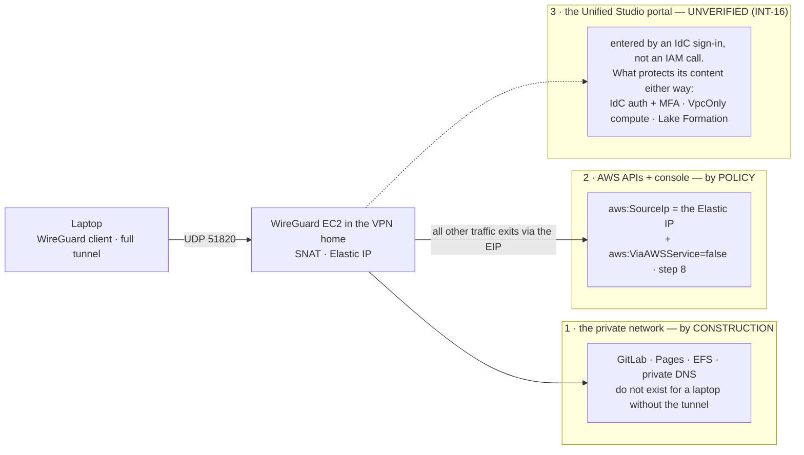

# Stage 4 — VPN access

| | |
|---|---|
| **Status** | not started — **revised 2026-08-16 into the pass/verification format**, with two corrections against earlier stages folded in: the peer CIDR is *consumed from* Stage 3's allocation table rather than chosen here, and step 8 is written against the `identity/sso/` slice Stage 2 actually built (a shared deny fragment reaching the six persona sets, not three sets named by hand) |
| **Prerequisites** | Stage 3 — specifically its `sandbox/foundation/` (the public subnet, the S3 gateway endpoint **and the 9.3 allow-list**, which this stage is the first to exercise: the WireGuard host installs its packages through it) and the Sandbox↔Production peering (step 6 of Stage 3). D4 is decided: self-managed WireGuard |
| **Consumes** | [D4](../decisions/D04-vpn-wireguard.md), [D6](../decisions/D06-dlp-approach.md), [D11](../decisions/D11-lab-lifecycle.md), [D16](../decisions/D16-break-glass.md), [D26](../decisions/D26-unified-studio.md), [D35](../decisions/D35-sandbox-cardinality.md) |
| **Proves** | [INT-16](../integrations.md) — **provisionally**: the API/console half is answered here in full; the portal half is re-read at Stage 6 step 1, because the Unified Studio domain does not exist before that (see the deliverables) |

*Read with [`docs/plan/conventions.md`](../conventions.md) (naming, layout, `[P]`/`[D]`/`[E]`, IAM rules).*

**Forward constraint from D35 — read this before writing "the Sandbox account" anywhere below.** `Sandbox` is
one account **per business unit**, and **the VPN lives on exactly that multiplied side**: the tunnel's landing
account, the client resolver target, the routes and the Sandbox↔Production peering that reaches GitLab all
become per-unit as N grows. (Development is singular, so its own peering is fixed and is not part of the
problem.) **The topology is not decided here and should not be** — a designated hub account, a Transit Gateway
in a shared network account, or per-unit VPN endpoints are all live, and the choice depends on N and on
whether units may reach each other at all ([Stage 14](stage-14-sandbox-vending.md) carries it as its central
open question). What this stage owes Stage 14 is only this: **name the VPN home as a role an account plays,
not as "the Sandbox account"** — one module variable, so that changing the topology later is a substitution
instead of a rewrite. Concretely: the `wireguard` module and the `vpn/` slice take a *VPN-home* account as
input; today that role is played by `Sandbox Account 1`, and every literal below reads accordingly.

---

**Objective:** the only human path into the private network — and the policy that extends "only" to the
AWS control plane.

## What this stage builds, and in which accounts

Three slices in two accounts, plus one org-wide enablement done by hand:

| Where | What | Layer |
|---|---|---|
| `sandbox/foundation/` (amended) | the Elastic IP and the WireGuard security group, both exported | `[P]` |
| `sandbox/vpn/` (new) + `terraform-modules/wireguard/` (new) | the `t4g.nano` instance, user data, peer config, handshake log, alarm | `[D]` — stopped between sessions, never destroyed |
| `identity/sso/` (amended) | the `aws:SourceIp` deny on the persona permission sets (step 8) | `[P]` |
| Management + Audit, by hand | GuardDuty delegated administration and org-wide enablement (step 10) | — (no slice, no profile — see step 10) |

**This is the repository's first `[D]` slice**, so the Stage 2 machinery meets its first real customer:
`sandbox/vpn/` gets a row in `scripts/tfhygiene/layers.py` in the same sitting it is created (the table is
authored and `./scripts/slices.py check` fails on a slice with no row), and `make down ENV=sandbox` must
*stop* the instance — the first time that code path does anything at all.

## The three roles the VPN plays — the frame every deliverable is read against

One tunnel, three different guarantees, each held by a different mechanism. INT-16 can only lose the third:

A negative INT-16 is therefore not an argument against the VPN — roles 1 and 2 stand untouched — it is an
instruction to restate the objective's sentence with precision ("through the VPN" holds for the private
network and the control plane, not for the portal), which is exactly fallback (ii) of that row.

## Step numbers are identifiers, not an order

Several of these numbers are **stable addresses cited from other files** — `step 1` (the NAT correction)
from Stage 3 step 6.5; `step 3` (no port 22) and `step 7` (the CloudWatch agent) from Stage 3's 9.3
allow-list table; `step 4` from Stage 3's address plan; `step 5` (full tunnel) from
`docs/plan/architecture.md` §3 and Stage 3 view 3; `step 8` from `docs/GLOSSARY.md`, `docs/plan/architecture.md` and INT-16;
`step 10` from `docs/plan/cost-model.md`, Stage 1b step 8, Stage 11 and `docs/plan/institutional-delta.md`. They do not
change. The sequence to work in is **four passes**:

| Pass | # | What | Slice · layer | Applied as |
|---|---|---|---|---|
| **1** | 2 | Elastic IP + the WireGuard SG, both exported | `sandbox/foundation/` `[P]` | `awsds-infra-sandbox-1` |
| **1** | 1, 3, 4, 7 | the `wireguard` module and the `vpn/` slice: instance, NAT, SG contents, peers, handshake log, alarm | `terraform-modules/wireguard/` + `sandbox/vpn/` `[D]` | idem |
| **2** | 5, 6 | the client config on the laptop; the route/SG audit | laptop, by hand; readings | — |
| **3** | 8, 9 | the control-plane deny; the client instructions | `identity/sso/` `[P]`; `README.md` | `awsds-infra-identity` |
| **4** | 10 | GuardDuty org-wide | by hand: Management, then Audit | `AWS Control Tower Admin`, console/CloudShell |

Pass 3 runs only after pass 2 has proven the tunnel: the deny pins every persona to an IP that must
demonstrably exist and route first. Pass 4 is independent of the other three and can run any time after
pass 1 — it sits last only because the thing it detects (an exposed host) arrives in pass 1.

---

## To execute

### 1. The WireGuard host — `terraform-modules/wireguard/` and `sandbox/vpn/`, layer `[D]`

**1.1 — The module.** `t4g.nano` (ARM, Amazon Linux 2023, AMI resolved through the SSM public parameter —
`docs/plan/architecture.md` §4.1) in a **public subnet** of the VPN home's VPC, WireGuard installed and configured by
user data, IP forwarding and NAT (masquerade) enabled. Inputs: the VPN-home network (VPC, public subnet,
the `[P]` EIP allocation and SG from step 2 — read through `terraform_remote_state`, never pasted), the
peer list (step 4), and the peer CIDR from the generated tfvars (Stage 3 decision 1). Instance Name tag:
**`awsds-<env>-vpn`** — a contract with `./aws/vpn.py`, which finds the host by it.

**1.2 — NAT is not optional** — a correction to an earlier version, which mixed a NAT model with a routed
one: VPC peering does no edge-to-edge routing and only forwards packets whose source and destination sit
inside the two VPCs' CIDRs, so the WireGuard client range can never cross the peering to Production. Every
packet the instance forwards must carry its own private IP — which also means **security groups admit the
WireGuard instance's SG** (referencing a peer VPC's security group works across a same-region peering),
**never the client CIDR**. This rule reaches into Stage 5 (the EFS mount targets) and Stage 7 (GitLab): a
rule written against `10.90.0.0/24` is a rule that never matches, and the symptom is a mount that hangs.

**1.3 — Layer `[D]`: the instance is stopped between sessions, not destroyed** (~USD 0.65/month of EBS),
which keeps the host key and the peer configuration stable. Two mechanical consequences in this sitting:
the `("sandbox", "vpn")` row lands in `scripts/tfhygiene/layers.py` (rank after `egress`, so `down` stops
the instance *after* the `[E]` slices are gone and `up` starts it first), and `make down ENV=sandbox`
followed by `make up` becomes the lifecycle deliverable below.

**1.4 — The first boot is also Stage 3's verification (iii) running for real.** The user data installs
WireGuard with `dnf` through the **S3 gateway endpoint** — there is no NAT in the public subnet's path to
in-region S3, and the gateway's more-specific route wins regardless of the IGW (Stage 3, 9.3's
correction). If the 9.3 allow-list is wrong, the failure is **a host that boots and never finishes its
user data** — a hang, not an `AccessDenied`. Check `cloud-init` output through SSM before debugging
WireGuard itself, and record the answer in Stage 3's verification table as well as here.

### 2. The `[P]` anchors — an amendment to `sandbox/foundation/`

**2.1 — The Elastic IP is allocated in `foundation/`, not in `vpn/`**, so the endpoint address survives
even a rebuild of the instance and client configs never have to be regenerated (D4, conventions §5.1
rule 5). ~USD 3.65/month — the price of not editing every client config on every rebuild. **This is the
IP step 8 pins the whole control plane to**, which is exactly why it lives in the slice `make down` cannot
reach. Export the allocation ID *and the public IP* from the slice's outputs — `identity/sso/` reads the
second one.

**2.2 — The WireGuard security group lives in `foundation/` too** (it is free, and Stage 5's EFS rule and
Stage 7's GitLab rule reference it cross-slice and cross-account — an SG that survives every lifecycle is
the only kind worth referencing). Its ID is exported alongside the EIP.

### 3. The security group's contents

UDP/51820 inbound from `0.0.0.0/0`, and **nothing else world-open**: from this stage on,
`./aws/networking.py` §9's SG listing is expected to show exactly one world-open rule in the whole
organization. SSH access only through **SSM Session Manager**, never port 22 — the host sits in a public
subnet with a public IP, so its agent reaches the SSM endpoints without any interface endpoint existing
(verification (iii)). Egress open: the instance is the NAT for every tunnel client.

### 4. The peers

**4.1 — Peer public keys arrive through a git-ignored `.tfvars`** (keys are generated on the client and
the private key never leaves the laptop). One peer per person and per device, named, so revoking a device
is deleting one entry.

**4.2 — The peer network CIDR is `10.90.0.0/24`, and it is *consumed* here, not chosen here** — settled in
Stage 3 (decision 1, 2026-08-16): the value sits in the allocation table in `scripts/tfhygiene/backend.py`
and reaches the slice through the generated `terraform.auto.tfvars`, like every other address literal. Its
constraints, recorded where the number lives: it avoids all four VPC ranges *and* is unlikely to collide
with a home or café LAN — a collision there produces a tunnel that comes up and routes nothing, diagnosed
by nobody at 23:00. With NAT on the instance (1.2) nothing inside AWS ever sees this range, so its only
job is to not collide with the laptop's own network.

### 5. The client configuration — full tunnel, not split

**5.1 — The client routes `0.0.0.0/0` through WireGuard**, so AWS API and console traffic exits through
the instance's Elastic IP and step 8's `aws:SourceIp` condition can match it. A split tunnel routing only
the two VPC CIDRs would leave every API call on the laptop's own connection — and step 8 would then deny
the user everything, tunnel up or not. This is the correction that step 8 forced, and the two steps stand
or fall together.

**5.2 — `DNS` in the client config points at the VPC resolver** — `.2` of the VPN home's VPC CIDR
(`10.20.0.2` today) — so private hosted zones and interface-endpoint names resolve on the laptop
(Stage 3, view 3). Reaching GitLab in Production works through the Stage 3 peering, NATed by 1.2.

**5.3 — The cost of full tunnel:** ordinary browsing also transits the instance and bills as EC2 data
transfer out (~USD 0.09/GB). Connect for lab sessions, not as an always-on VPN.

### 6. No return routes for the peer network — an audit, not a build

Nothing anywhere carries a route for `10.90.0.0/24` — with NAT on the instance (1.2) the VPCs only ever
see the instance's private IP, and across the peering such a route would be dropped anyway (edge-to-edge,
again). What is actually needed already exists from Stage 3: Production's route back to the **Sandbox VPC
CIDR** through the peering (Stage 3, 6.3), and — from Stage 5 and Stage 7 — security groups on EFS and
GitLab that admit the WireGuard instance's SG. The mechanical half of this audit is
`./aws/networking.py` `NT-4`, which fails on any route touching the client range.

### 7. Observability on the one exposed host

CloudWatch agent shipping the WireGuard handshake log to a log group named **`/awsds/<env>/vpn`**, short
retention (30 days, matching Stage 3's flow-log decision), and one alarm — **`awsds-<env>-vpn-health`** —
on the instance's status checks. The agent fetches its package from the `amazoncloudwatch-agent-<region>`
bucket, which is the second family in Stage 3's 9.3 allow-list; a wrong entry there surfaces here as an
agent that never installs. ~USD 0.10/month for the alarm, cents for the log.

### 8. The other half of the objective: restrict the AWS control plane to the VPN

`CLAUDE.md` says "all user access to the cloud infrastructure will be performed through a VPN", and a
tunnel to the VPC only delivers the data plane — the console and the AWS APIs remain reachable from any
network in the world with a valid SSO session. This step closes that, in `terraform-live/identity/sso/`.

**8.1 — The statement.** A deny with `NotIpAddress` on the WireGuard Elastic IP **combined with
`aws:ViaAWSService: false`**, Sid **`DenyControlPlaneOffVpn`** (a contract with `./aws/vpn.py`, which
reads the sets back and reports which carry it). The second condition is not optional: services calling on
the user's behalf (Athena reaching S3 is this plan's first casualty) do not carry the user's source IP,
and a bare `aws:SourceIp` deny breaks them. The EIP value is read from `sandbox/foundation/`'s outputs —
never pasted — and under D35 it is a **list** (one EIP per VPN home as units multiply), written as a list
from day one for INT-05's reason.

**8.2 — Where it lands: a second shared fragment, consumed by the six persona sets.** Stage 2 built
`identity/sso/` with exactly the structure this step needs — a deny fragment written once and composed
into the six persona sets (`DataScientistAccess`, `DataScientistStagingAccess`,
`DataScientistProdAccess`, `DeploymentManagerAccess`, `GovernanceManagerAccess`, `DevEnvStewardAccess`)
and **not** into the imported `InfrastructureAccess`. This statement goes into a fragment of its own
(`policies-shared.tf`'s neighbour, not `shared_denies` itself — the existing fragment is unconditional
denies and this one is conditioned on an IP that can change), so it reaches all six in one diff.
**An earlier version of this step named three sets and left three uncovered by omission — Lesson 14 in
permission sets.** Covering the six at once is safe for the operator, who works as `InfrastructureAccess`
and is untouched by this apply.

**8.3 — `InfrastructureAccess` gains the statement only once the deny demonstrably works** — a separate,
deliberate diff after the deliverable pair below has been recorded. Getting this wrong on the six persona
sets costs a data-scientist session; getting it wrong on `InfrastructureAccess` costs every Terraform
apply in the organization, with break-glass (D16) as the only way back. Note what the statement pins:
access to a single Elastic IP — which is precisely why that IP lives in `[P]` (step 2).

**8.4 — What the deny is pinned to changed with D26, and the old answer is still written in several
places.** The classic Studio path was `sagemaker:CreatePresignedDomainUrl`; there are no classic domains
any more, so keep the deny on it as a belt-and-braces measure (it costs nothing and the `Workloads` OU SCP
denies the same action anyway) but understand that it now protects nothing that exists. The surface that
actually matters is the **Unified Studio portal**, which is reached by signing in to Identity Center and
opening the domain URL — not by minting a presigned URL with an IAM call. **Whether a permission-set
`aws:SourceIp` deny covers that sign-in at all is unverified and is INT-16.** Until that row is settled,
this step delivers VPN-only access to the AWS APIs and the console, and *not* demonstrably to the portal —
which is the data scientist's primary working surface. Do not write it up as though it does. This
restriction is what step 5's full tunnel exists for.

### 9. The client instructions

Write the client setup in `README.md`: generating a key pair, the config template (full tunnel, the DNS
line, the endpoint = the Elastic IP), how to verify the tunnel (a private name resolving, `aws sts
get-caller-identity` succeeding), and how to regenerate the config after a rebuild — which, because of
step 2, is "you do not": the endpoint address is `[P]`.

### 10. Enable GuardDuty org-wide — by hand, from Management and Audit

It lands in this stage and not in the landing zone because **this stage builds the first internet-facing
resource in the project**: an EC2 instance with a public Elastic IP and an open UDP port. Until now there
was nothing exposed and nothing to detect; from here there is, and the thing GuardDuty is best at is
exactly this host's failure mode — an instance's role credentials used from outside AWS, outbound traffic
to a known-bad destination, crypto-mining patterns.

**10.1 — The delegation is made *in this step*, not in Stage 1b.** 1b step 8 examined it and deferred it
here deliberately, because for GuardDuty **delegating is enabling**: designating the administrator turns
the service on in that account (`docs/AWS_STATE.md` §C carries the reminder). Two acts, two accounts,
neither of which holds a CLI profile — both are `AWS Control Tower Admin`, console or CloudShell,
recorded by the user in the stage log:

| Where | Act | Note |
|---|---|---|
| **Management** | `guardduty enable-organization-admin-account` naming **Audit** | in **`us-west-2`** — the Region control does not exempt GuardDuty (open question 16's closure), so any other Region is denied |
| **Audit** | org configuration: auto-enable for **all** accounts, existing and future | existing members need the explicit add; a future vend (Staging, every Stage 14 Sandbox) must arrive covered — verify, don't assume (verification (v)) |

**10.2 — It needs no per-account configuration:** GuardDuty reads CloudTrail management events, VPC Flow
Logs and DNS query logs on its own, without you enabling any of them. Route findings to an SNS topic in
Audit (an EventBridge rule on GuardDuty findings → SNS → e-mail; console-built in Audit, `ManagedBy`
n/a — no Terraform reaches that account by design).

**10.3 — Leave S3 Protection and Malware Protection off** — they are billed separately and are decided in
Stage 11 step 4 against a real bill. `./aws/vpn.py` reads the feature flags back so a drift shows up.

**10.4 — The SCP interaction, settled here because it is free here and costly later:**
`awsds-org-scp-baseline` denies `guardduty:UpdateDetector` on the organization root, Audit included, so
anything that changes **Audit's own detector** is denied — org-wide administration through
`UpdateOrganizationConfiguration`/`UpdateMemberDetectors` is not. Enabling the base service does not need
the denied call, so nothing blocks here; Stage 11 step 4 does. **If this step ends up creating a named
GuardDuty administration role in Audit, record its exact ARN** — that is the carve-out Stage 11 would
otherwise have to improvise, and a carve-out written against a role that already exists is the one shape
this plan trusts (D27).

**10.5 — Close the paperwork in the same sitting:** restate `INV-09` in `docs/AWS_STATE.md` (the
trusted-access list grows to nine principals, `guardduty` delegated to Audit — §C already predicts it),
and re-run `./aws/org-trusted-access-services.py` so the snapshot shows it.

**Cost:** free for the first 30 days per account, then driven by log volume (`docs/plan/cost-model.md`).
Note what that free window is *not*: it starts when the service is enabled, in every account at once, so
it is a discount on this stage and the next, not a measurement instrument to be spent deliberately.

---

## Deliverables

Each is written so its output differs between working and broken (Lesson 13). **The mechanical half is
`./aws/vpn.py`** ([`aws/INDEX.md`](../../../aws/INDEX.md)), written for this stage: the instance, the EIP,
the one world-open SG rule, the handshake log and alarm, which permission sets carry
`DenyControlPlaneOffVpn`, and the GuardDuty state per account. The behavioural proofs below are the
stage's own — no describe call substitutes for them (Lesson 20).

Connecting from the laptop gives private access to a test resource in the **VPN home and Production**
VPCs — the only two the tunnel reaches at the VPC level. The laptop has **no route into the Development or
Staging VPCs, by design**, and that is not a gap: both are used entirely through AWS API endpoints, which
the full tunnel already sends out through the WireGuard Elastic IP (`docs/plan/architecture.md` §3). For Development
that means the **Unified Studio portal** (D26) — a public endpoint, reached from the tunnel's IP; `VpcOnly`
governs how the *app containers* reach the network, not how the browser reaches the UI.

- **The tunnel pair:** a private resource in the VPN home VPC and one in Production (the Stage 3 probe
  shape) are reachable with the tunnel up and unreachable with it down.
- **The control-plane pair — the proof step 8 exists for:** an AWS API call with the tunnel down is denied
  for a data-scientist session, **and the same call with the tunnel up succeeds**. Run it per persona set
  the fragment reaches, not once.
- **The on-behalf carve-out holds:** with the tunnel up, an Athena query (or any service-on-behalf flow)
  still works — the `aws:ViaAWSService` half doing its job.
- **The lifecycle holds:** `make down` then `make up` stops and starts the instance, the EIP and its
  association survive, and the client configuration is untouched — the `[D]`/`[P]` split doing its job.
- **INT-16, the recordable half:** with the tunnel down, does an **Identity Center sign-in (the AWS access
  portal)** still complete? Record the observed behaviour either way. **The portal half of the row stays
  provisional until Stage 6 step 1** — the Unified Studio domain does not exist yet, so "does the portal
  open with the tunnel down" is asked there, at the first moment the surface exists, and the verdict is
  written against the three-roles framing above so a negative answer is recorded as what it is (fallback
  (ii) of INT-16), not as a failure of the stage.

An earlier version of this deliverable said "Studio in Development opens with the tunnel up and refuses to
open with it down", via `CreatePresignedDomainUrl`. D26 removed the classic domains that sentence
described.

## Validation

1. Re-run `./aws/networking.py` — `NT-4` (no route to the client range) still passes, and §9 shows exactly
   one world-open SG rule, UDP/51820, in the whole measured estate.
2. Run `./aws/vpn.py` — all `VP-*` checks pass; diff two runs either side of the `make down`/`make up`
   cycle: only the timestamp and the instance state may change.
3. Read the denial wording of the control-plane pair, not the exit code: the deny must name the
   permission-set policy, and the tunnel-up half must return data (a standing rule since 1c).

## Cost

| Item | Cost | Layer |
|---|---|---|
| Elastic IP | ~USD 3.65/month | `[P]` — already in the cost-model floor |
| WireGuard EBS (8 GB) | ~USD 0.65/month | `[D]` idle cost |
| `t4g.nano` while up | ~USD 0.004/h | `[D]` |
| Full-tunnel data transfer out | ~USD 0.09/GB | usage — connect for lab sessions |
| Handshake log + alarm | ~USD 0.10-0.30/month | `[P]` |
| GuardDuty | 0 for 30 days, then ~USD 3-5/month | the floor's low→high band (`docs/plan/cost-model.md`) |

## Decisions due while executing

Each is decided during the stage and written into `docs/log/log-stage-04-vpn.md` rather than left to
whoever is at the keyboard (Lesson 16).

1. **Where the step-8 statement lands** (8.2) — recommended: a second shared fragment consumed by the six
   persona sets in one diff, `InfrastructureAccess` in a separate later diff (8.3). The alternative —
   per-set statements — is Lesson 14 with six copies.
2. **What "unhealthy" means for the alarm** (step 7) — recommended: the EC2 status-check alarm, with the
   handshake log kept for diagnosis rather than alarmed on (a handshake-age alarm fires every time the
   operator simply disconnects).
3. **Findings routing** (10.2) — recommended: EventBridge → SNS → e-mail, in Audit, console-built. Record
   the topic name and who subscribes; note D12 skipped budget alerts, so this is the project's first
   automatic notification of anything.

## Verifications to answer while executing

Record every answer, including the ones that come out fine.

| # | Question | Step |
|---|---|---|
| i | Does the host finish its user data through the S3 gateway endpoint alone — i.e. is Stage 3's 9.3 allow-list complete for AL2023 and the CloudWatch agent? (Also answers Stage 3 verification (iii)) | 1.4, 7 |
| ii | Does the EIP association survive a stop/start, making "re-associated on start" unnecessary code? | 2.1 |
| iii | Does SSM Session Manager reach the host with no `ssm*` interface endpoints anywhere in the account (public subnet, public IP)? | 3 |
| iv | Does every service-on-behalf flow survive the deny with the tunnel up — Athena first, then the console's own backend calls (the console makes some calls server-side; record any that break) | 8 |
| v | Does GuardDuty's auto-enable actually cover **existing** members (they need an explicit add) and **Management itself**, and does a later vend arrive covered? | 10.1 |
| vi | With the tunnel down, does an IdC sign-in complete at all (the access portal is not a permission-set operation — expected: yes, it completes; record it as INT-16 context) | 8, deliverables |

## Risks

- **Step 8 is the one step in this stage that can lock a person out.** The rollout order (six persona sets
  first, `InfrastructureAccess` only after the recorded pair) is the control; break-glass (D16) is the way
  out if it goes wrong anyway.
- **Everything hangs off one Elastic IP.** The instance is a single point of failure (D4 accepts this for
  a lab), and the deny of step 8 turns "the VPN host is down" into "no persona can call any AWS API".
  `InfrastructureAccess` remaining outside the deny until 8.3 — and being the profile that can start the
  instance — is what keeps that failure recoverable without break-glass. After 8.3, recovery is
  break-glass or the console from the EIP; rehearse the first before applying the second.
- **The 9.3 allow-list failure mode is a hang, not an error** (1.4): budget the first boot accordingly.
- **The GuardDuty free window starts now, in every account at once** — the measured bill only appears in
  month two; do not read month one as the steady state (Lesson 6).

---

*Stage index: [stages/INDEX.md](INDEX.md) · Plan core: [GENERAL_PLAN.md](../../GENERAL_PLAN.md)*
