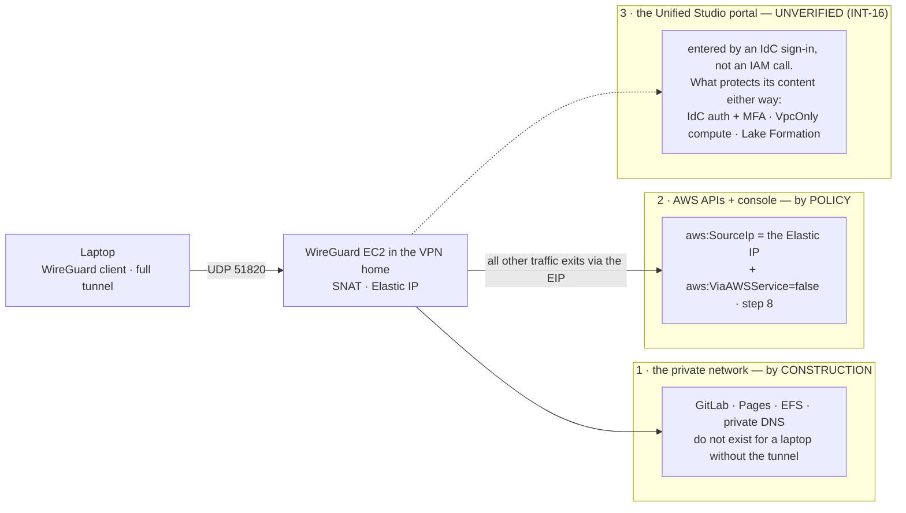

# Stage 4 — VPN access

| | |
|---|---|
| **Status** | not started — **revised 2026-08-16 into the action-checklist format** (executor markers, action-first steps), with corrections against the documentation and the repository: the `vpn/` row ranks **between `foundation` and `egress`** in `scripts/tfhygiene/layers.py` — the earlier "after `egress`" inverted both consequences it claimed — and `scripts/slices.py`'s `dormant()` hook is a stub that **aborts** the moment a `[D]` row exists, so 1.3 owes it its body; step 7's handshake log is **generated on the host** — WireGuard writes no log file; verification (ii) is **answered by the EC2 documentation** (an Elastic IP stays associated across stop/start); 10.2's "existing members need the explicit add" was stale — auto-enable **`ALL` covers existing accounts and the delegated administrator itself**; 5.1's full tunnel gains **`::/0`**, closing an IPv6 bypass that would read as a lockout. `wireguard-tools`, `amazon-cloudwatch-agent` and `iptables-nft` were **measured present** in the AL2023 core repository for `us-west-2` (read from the repo bucket itself, 2026-08-16 — Lesson 23's residual, the no-NAT path itself, stays verification (i)) |
| **Prerequisites** | Stage 3 — specifically `sandbox/foundation/` (the public subnet, the S3 gateway endpoint **and the 9.3 allow-list**, which this stage is the first to exercise) and the Sandbox↔Production peering (Stage 3 step 6). **Stage 3 is DONE (2026-08-16)** — all three passes applied and measured, so nothing below waits on it any longer. Two of its readings reach into this stage: the 9.3 allow-list is proven for the AL2023 **metadata** path (`dnf makecache` succeeded from a tier with no default route, and a bucket the policy does not name was denied 200/403), but **not for a package download and not for the CloudWatch agent's own bucket** — which is exactly what verification (i) below still asks. The Sandbox↔Production peering is exercised and reachable in the intended direction only. **The network is torn down** (`make down`, USD 0.0000/h) and step 1 does not need it back: everything the host consumes is `[P]` in `sandbox/foundation/` — the public subnet, the IGW and the S3 gateway endpoint — which is why `vpn/` ranks **before** `egress` rather than after, and why verification (iii) can ask whether Session Manager reaches the host with no interface endpoint in the account at all. D4 is decided: self-managed WireGuard |
| **Consumes** | [D4](../decisions/D04-vpn-wireguard.md), [D6](../decisions/D06-dlp-approach.md), [D11](../decisions/D11-lab-lifecycle.md), [D16](../decisions/D16-break-glass.md), [D26](../decisions/D26-unified-studio.md), [D35](../decisions/D35-sandbox-cardinality.md) |
| **Proves** | [INT-16](../integrations.md) — **provisionally**: the API/console half is answered here in full; the portal half is re-read at Stage 6 step 1, because the Unified Studio domain does not exist before that (see the deliverables) |

*Read with [`docs/plan/conventions.md`](../conventions.md) (naming, layout, `[P]`/`[D]`/`[E]`, IAM rules).*

**Forward constraint from D35 — read before writing "the Sandbox account" anywhere below.** `Sandbox` is
one account per business unit, and the VPN lives on exactly that multiplied side: the tunnel's landing
account, the resolver target, the routes and the peering to GitLab all become per-unit as N grows. The
topology — a hub account, a Transit Gateway, or per-unit endpoints — is deliberately **not** decided here
([Stage 14](stage-14-sandbox-vending.md) owns it, with N in hand). What this stage owes Stage 14: **the
VPN home is a role an account plays, not "the Sandbox account"** — one module variable, so a topology
change is a substitution, not a rewrite. Today `Sandbox Account 1` plays the role, and every literal below
reads accordingly.

---

**Objective:** the only human path into the private network — and the policy that extends "only" to the
AWS control plane.

## What this stage builds, and in which accounts

Three slices in two accounts, plus one org-wide enablement done by hand:

| Where | What | Layer |
|---|---|---|
| `sandbox/foundation/` (amended) | the Elastic IP and the WireGuard security group, both exported | `[P]` |
| `sandbox/vpn/` (new) + `terraform-modules/wireguard/` (new) | the `t4g.nano` instance, user data, peer config, handshake log, alarm | `[D]` — stopped between sessions, never destroyed |
| `identity/sso/` (amended) | the `aws:SourceIp` deny on the persona permission sets (step 8) | `[P]` |
| Management + Audit, by hand | GuardDuty delegated administration and org-wide enablement (step 10) | — (no slice, no profile) |

**This is the repository's first `[D]` slice**, so the Stage 2 machinery meets its first real customer —
and it arrives owing two debts, both paid in 1.3: the row in `scripts/tfhygiene/layers.py`, and the body
of `scripts/slices.py`'s `dormant()` hook, today a stub that aborts on any declared `[D]` row.

## The three roles the VPN plays — the frame every deliverable is read against

One tunnel, three different guarantees, each held by a different mechanism. INT-16 can only lose the third:

A negative INT-16 is not an argument against the VPN — roles 1 and 2 stand — it is an instruction to
restate the objective with precision ("through the VPN" holds for the private network and the control
plane, not the portal), which is exactly fallback (ii) of that row.

## Who executes each action

Every action below opens with one of three markers:

| Marker | Meaning |
|---|---|
| **[Claude]** | repository edits and read-only AWS calls — done without asking |
| **[Claude⚡]** | `terraform apply` or any AWS write — Claude runs it **only after the user authorizes that specific action in chat** (the `CLAUDE.md` standing rule), with the SSO user/account/permission set stated first |
| **[user]** | console/CloudShell acts (Management and Audit hold no profile), everything on the laptop (keys, client config, the tunnel pairs), git commits, and every log entry |

## Step numbers are identifiers, not an order

Several numbers are **stable addresses cited from other files** — `step 1` (the NAT correction) from
Stage 3 step 6.5; `step 3` (no port 22) and `step 7` (the CloudWatch agent) from Stage 3's 9.3 table;
`step 4` from Stage 3's address plan; `step 5` (full tunnel) from `docs/plan/architecture.md` §3 and Stage 3
view 3; `step 8` from `docs/GLOSSARY.md`, `docs/plan/architecture.md` and INT-16; `step 10` from
`docs/plan/cost-model.md`, Stage 1b step 8 and Stage 11 — and `./aws/vpn.py` reads its contracts against
1.1, 2.1, 3, 7, 8.1-8.3 and 10.3 by number. They do not change. The sequence to work in is **four passes**:

| Pass | # | What | Slice · layer | Applied as |
|---|---|---|---|---|
| **1** | 2 | Elastic IP + the WireGuard SG, both exported | `sandbox/foundation/` `[P]` | `awsds-infra-sandbox-1` |
| **1** | 1, 3, 4, 7 | the `wireguard` module and the `vpn/` slice: instance, NAT, SG contents, peers, handshake log, alarm | `terraform-modules/wireguard/` + `sandbox/vpn/` `[D]` | idem |
| **2** | 5, 6 | the client config on the laptop; the route/SG audit | laptop, by hand; readings | — |
| **3** | 8, 9 | the control-plane deny; the client instructions | `identity/sso/` `[P]`; `README.md` | `awsds-infra-identity` |
| **4** | 10 | GuardDuty org-wide | by hand: Management, then Audit | `AWS Control Tower Admin`, console/CloudShell |

Pass 3 runs only after pass 2 has proven the tunnel: the deny pins every persona to an IP that must
demonstrably exist and route first. Pass 4 is independent and can run any time after pass 1 — it sits
last only because the thing it detects (an exposed host) arrives in pass 1.

---

## To execute

### 1. The WireGuard host — `terraform-modules/wireguard/` and `sandbox/vpn/`, layer `[D]`

**Action:** write the `wireguard` module and the repository's first `[D]` slice, wire the slice into the
D11 machinery, and apply. **Why:** the tunnel endpoint is the only human path into the private network
(D4), and the first `[D]` slice is where `make up`/`make down` stop being no-ops. **Explanation:** the
instance is stopped between sessions, never destroyed (~USD 0.65/month of EBS), so the host key and peer
configuration stay stable; everything that must survive an instance rebuild lives in `[P]` (step 2).

- **1.1 — [Claude] Write `terraform-modules/wireguard/`**: a `t4g.nano` (D4) on the AL2023 ARM AMI,
  resolved through the SSM public parameter `/aws/service/ami-amazon-linux-latest/al2023-ami-kernel-default-arm64`
  (`docs/plan/architecture.md` §4.1), in a **public subnet** of the VPN home's VPC. Set
  `http_tokens = "required"` (IMDSv2 — `./aws/vpn.py` `VP-4` fails otherwise: a world-reachable NAT host
  holding a role credential is the textbook IMDSv1 target) and attach an instance profile carrying
  `AmazonSSMManagedInstanceCore` — Session Manager is the only shell path (step 3). Instance Name tag
  **`awsds-<env>-vpn`** — a contract with `./aws/vpn.py`. Inputs, none pasted: the VPC, subnet, `[P]` EIP
  allocation and SG from step 2 through `terraform_remote_state`; the peer list (step 4) from a
  git-ignored `.tfvars`; the peer CIDR from the generated `terraform.auto.tfvars` (Stage 3 decision 1).
- **1.2 — [Claude] Configure NAT in the user data — not optional**: `dnf install wireguard-tools iptables-nft`
  (both measured in the AL2023 core repo, 2026-08-16), IP forwarding on, masquerade on the primary
  interface. VPC peering does no edge-to-edge routing and forwards only packets whose source and
  destination sit inside the two VPCs' CIDRs, so the client range can never cross to Production: every
  forwarded packet must carry the instance's own IP. The consequence reaches Stage 5 (EFS mount targets)
  and Stage 7 (GitLab): **security groups admit the WireGuard instance's SG** (cross-account SG references
  work across a same-region peering), **never the client CIDR** — a rule against `10.90.0.0/24` never
  matches, and the symptom is a mount that hangs.
- **1.3 — [Claude] Register the slice in the D11 machinery, in the same commit that creates it** — three
  edits, the first two corrections to this step's earlier wording. **TWO OF THE THREE ARE ALREADY IN
  (2026-08-16): the `"vpn": 40` rank and the `dormant()` body.** The `("sandbox", "vpn")` ROW is
  deliberately NOT — it was added, `./scripts/slices.py check` failed on it exactly as it should
  ("a stale row makes the table stop being evidence"), and it was withdrawn to land with the slice as
  this step says. The rank went in early because the ORDER is what was got wrong once and is worth
  fixing before anything consumes it:
  - Add `"vpn"` to `RANKS` in `scripts/tfhygiene/layers.py` at a rank **between `foundation` (20) and
    `egress` (50)**, plus the `("sandbox", "vpn")` row — layer `[D]`, `usd_per_hour` copied from the
    measured `docs/PRICING.md` t4g.nano row (Lesson 6). The earlier "rank after `egress`" inverted both
    consequences it claimed: `up` ascends rank and `down` descends it, so a rank *below* `egress` is what
    starts the VPN **before** the `[E]` slices exist and stops it **after** they are gone — the order that
    matters once 8.3 lands, because from then on every API call must exit through the EIP, so the tunnel
    is the first thing up and the last thing down.
  - Write the body of `dormant()` in `scripts/slices.py` — today a stub that **aborts** the moment a `[D]`
    row is declared: stop/start the instances by the `awsds-<env>-vpn` Name tag, never destroy, and print
    what was (and was not) done (Lesson 13).
  - `./scripts/slices.py check` (inside `make check`) fails on a slice with no row — nothing to add, just
    the reason the row lands in the same commit.
- **1.4 — [Claude⚡] Apply `sandbox/vpn/`** — profile `awsds-infra-sandbox-1`, `fmt`/`validate`/`plan`
  clean first. **The first boot is Stage 3's verification (iii) running for real**: the user data installs
  its packages through the S3 **gateway endpoint** — no NAT is in the public subnet's path to in-region S3,
  the gateway's more-specific route wins regardless of the IGW — so a wrong 9.3 allow-list fails as **a
  host that boots and never finishes its user data: a hang, not an `AccessDenied`**. Read `cloud-init`
  output through SSM before debugging WireGuard itself; record the answer in both stages' verification
  tables. **[user]** Record the apply in the stage log.

### 2. The `[P]` anchors — an amendment to `sandbox/foundation/`

**Action:** allocate the Elastic IP and create the WireGuard security group in `foundation/`, both
exported. **Why:** both are named from outside this stage — step 8's deny and Stage 5's bucket policy
name the EIP (INT-05), Stage 5's EFS rule and Stage 7's GitLab rule name the SG — so both must survive
every `make down` and every instance rebuild (conventions §5.1 rule 5). **Explanation:** applied before
step 1, which consumes them as inputs; this is what makes a rebuild invisible to every client config.

- **2.1 — [Claude] Allocate the Elastic IP in `foundation/`, never in `vpn/`** — the endpoint address
  survives an instance rebuild, so client configs are written once (D4). ~USD 3.65/month, measured.
  **This is the IP step 8 pins the whole control plane to** — exactly why it lives in the slice
  `make down` cannot reach. Export the **allocation ID and the public IP**; `identity/sso/` reads the
  second (8.1).
- **2.2 — [Claude] Create the WireGuard security group in `foundation/`** — free, and referenced
  cross-slice and cross-account from Stages 5 and 7 (1.2's rule): an SG that survives every lifecycle is
  the only kind worth referencing. Export its ID. Its contents are step 3.
- **2.3 — [Claude⚡] Apply `sandbox/foundation/`** — profile `awsds-infra-sandbox-1`. **[user]** Record in
  the stage log.

### 3. The security group's contents

**Action:** open exactly one port to the world. **Why:** from this stage on `./aws/networking.py` §9 must
show exactly **one** world-open rule in the whole measured estate — the shape `VP-3` enforces.
**Explanation:** no port 22, ever: the host sits on a public subnet with a public IP, so its preinstalled
SSM agent reaches the SSM endpoints outbound with no interface endpoint anywhere (verification (iii)),
and Session Manager is the shell.

- **3.1 — [Claude] Write the rules in the step 2 SG**: inbound **UDP/51820 from `0.0.0.0/0`** and nothing
  else; egress open — the instance is the NAT for every tunnel client.

### 4. The peers

**Action:** provision the peer list as named data, one entry per person per device. **Why:** revoking a
device must be deleting one entry — D4 accepted "no Identity Center integration" at exactly this price.
**Explanation:** keys are generated on the client; the private key never leaves the laptop.

- **4.1 — [user] Generate a key pair per device** (`wg genkey | tee private.key | wg pubkey`) and hand
  over the **public** keys only. **[Claude]** Write them into a git-ignored `.tfvars`, one named entry
  per person and device.
- **4.2 — Consume the peer CIDR, `10.90.0.0/24` — it is not chosen here** (Stage 3 decision 1,
  2026-08-16): it sits in the allocation table in `scripts/tfhygiene/backend.py` and reaches the slice
  through the generated `terraform.auto.tfvars`, like every other address literal. With NAT (1.2) nothing
  inside AWS ever sees the range; its one job is not colliding with a home or café LAN — that collision
  is a tunnel that comes up and routes nothing, diagnosed by nobody at 23:00.

### 5. The client configuration — full tunnel, not split

**Action:** write the laptop's WireGuard config to route *everything* through the tunnel. **Why:** step
8's `aws:SourceIp` condition can only match traffic that exits through the instance's EIP — a split
tunnel routing only the VPC CIDRs would leave every API call on the laptop's own connection, and step 8
would then deny the user everything, tunnel up or not. The two steps stand or fall together.
**Explanation:** laptop acts, pass 2; the template itself is step 9's deliverable.

- **5.1 — [user] Set `AllowedIPs = 0.0.0.0/0, ::/0` — both families.** The `::/0` is a correction of this
  revision: on a dual-stack network, AWS traffic over IPv6 carries an IPv6 source address, fails step 8's
  `NotIpAddress`, and reads as a lockout *with the tunnel up*; routing `::/0` into the IPv4-only tunnel
  closes the bypass. `Endpoint = <the step 2 EIP>:51820`, `PersistentKeepalive = 25`.
- **5.2 — [user] Point `DNS` at the VPC resolver** — `.2` of the VPN home's VPC CIDR (`10.20.0.2` today) —
  so private hosted zones and interface-endpoint names resolve on the laptop (Stage 3, view 3). GitLab in
  Production resolves through the associated zone and routes through the Stage 3 peering, NATed by 1.2.
- **5.3 — Know the cost of full tunnel**: ordinary browsing also transits the instance and bills as data
  transfer out (~USD 0.09/GB). Connect for lab sessions, not as an always-on VPN.

### 6. No return routes for the peer network — an audit, not a build

**Action:** verify that nothing anywhere routes `10.90.0.0/24`. **Why:** with NAT (1.2) the VPCs only
ever see the instance's private IP — a route for the client range is dead configuration, and across the
peering it would be dropped anyway (edge-to-edge, again). **Explanation:** what the tunnel needs already
exists from Stage 3: Production's route back to the **Sandbox VPC CIDR** (Stage 3, 6.3), and — from
Stages 5 and 7 — SG rules admitting the instance's SG.

- **6.1 — [Claude] Run `./aws/networking.py`** — `NT-4` fails on any route touching the client range, and
  §9 must show the step 3 rule as the only world-open one.

### 7. Observability on the one exposed host

**Action:** ship a handshake log and alarm on the host's health. **Why:** the one internet-facing host
must not fail silently, and the handshake log is the diagnostic for "tunnel up, nothing routes".
**Explanation:** ~USD 0.10/month for the alarm, cents for the log; retention 30 days, matching Stage 3's
flow-log decision.

- **7.1 — [Claude] Generate the handshake log in the user data** — a correction of this revision:
  WireGuard's kernel module writes **no log file**, so there is nothing to tail until the host creates
  it. A systemd timer appends `wg show all latest-handshakes` to a local file, once a minute; the agent
  tails that file.
- **7.2 — [Claude] Install the CloudWatch agent from the AL2023 repo** (`dnf install
  amazon-cloudwatch-agent` — measured present, so the same 9.3 family as 1.2; the
  `amazoncloudwatch-agent-<region>` bucket stays in the Stage 3 table as the documented alternative
  path), shipping the file to log group **`/awsds/<env>/vpn`**, retention 30 days.
- **7.3 — [Claude] Create one alarm, `awsds-<env>-vpn-health`**, on the instance status checks —
  decision 2 below recommends exactly this shape, because a handshake-age alarm fires every time the
  operator simply disconnects.

### 8. The other half of the objective: restrict the AWS control plane to the VPN

**Action:** add a conditioned deny to the six persona permission sets, so the AWS APIs and the console
answer only from the tunnel's EIP. **Why:** `docs/plan/objectives.md` says all user access goes through
the VPN, and the tunnel alone delivers only the data plane — the control plane remains reachable from any
network in the world with a valid SSO session until this lands. **Explanation:** in
`terraform-live/identity/sso/`, pass 3, only after pass 2 has proven the tunnel: the deny pins every
persona to an IP that must demonstrably exist and route first.

- **8.1 — [Claude] Write the statement**, Sid **`DenyControlPlaneOffVpn`** (a contract with
  `./aws/vpn.py`): `Deny` on `*` with `NotIpAddress` on the WireGuard EIP **list** — a list from day one,
  one EIP per VPN home as D35 multiplies units (INT-05's reason) — **and `BoolIfExists
  aws:ViaAWSService: false`**, the shape from the `data-perimeter-policy-examples` repository (Stage 3,
  9.2). What the second condition is for, precisely: **forward access sessions preserve the caller's
  source IP** (the documentation's own note on the deny-by-IP example), so an FAS flow like Athena→S3
  would survive the bare condition — the carve-out defends the on-behalf calls that are *not* FAS, and
  verification (iv) records which those turn out to be. Read the EIP from `sandbox/foundation/`'s
  outputs, **never pasted**: a `terraform_remote_state` data source with
  `config.profile = "awsds-infra-sandbox-1"` — the repository's first cross-account remote-state read,
  workable because one SSO login covers both profiles.
- **8.2 — [Claude] Land it as a second shared fragment** beside `shared_denies` in `policies-shared.tf` —
  separate, because the existing fragment is unconditional denies and this one is conditioned on an IP
  that can change — composed into the **six persona sets'** `source_policy_documents`
  (`DataScientistAccess`, `DataScientistStagingAccess`, `DataScientistProdAccess`,
  `DeploymentManagerAccess`, `GovernanceManagerAccess`, `DevEnvStewardAccess`) and **not** into
  `InfrastructureAccess`. One diff reaches all six; an earlier version named three sets and left three
  uncovered by omission — Lesson 14 in permission sets. Watch the quota: a permission set's inline policy
  holds at most **10,240 non-whitespace bytes**, and the overflow fails at **provisioning**, not in
  `plan` (verification (vii)).
- **8.3 — [Claude⚡] Apply `identity/sso/`** — profile `awsds-infra-identity` — **six sets only.
  `InfrastructureAccess` gains the statement in a separate, deliberate diff, only after the deliverable
  pair below is recorded.** Getting this wrong on the six costs a data-scientist session; on
  `InfrastructureAccess` it costs every Terraform apply in the organization, with break-glass (D16) as
  the only way back — and note what the statement pins: a single Elastic IP, which is exactly why that IP
  is `[P]` (step 2). **[user]** Record both applies, and what the pair showed, in the stage log.
- **8.4 — Know what the deny is pinned to since D26.** The classic-Studio deny on
  `sagemaker:CreatePresignedDomainUrl` now protects nothing that exists — keep it as belt-and-braces (it
  is free, and the `Workloads` SCP denies the action anyway). The surface that matters is the **Unified
  Studio portal**, entered by an IdC sign-in, not an IAM call — **whether a permission-set `aws:SourceIp`
  deny gates that sign-in at all is INT-16, unverified**. Until that row settles, this step delivers
  VPN-only APIs and console, *not* demonstrably the portal. Do not write it up as more; step 5's full
  tunnel is what this restriction exists for.

### 9. The client instructions

**Action:** document the client setup where the next person will look. **Why:** the client config is the
one artifact of this stage that lives outside AWS and outside Terraform — undocumented, it gets
reinvented wrong (Lesson 16's spirit). **Explanation:** `README.md`, written once the pairs have run.

- **9.1 — [Claude] Write the client section in `README.md`**: key generation (4.1), the config template
  (full tunnel with **both** families, the DNS line, `Endpoint` = the Elastic IP), how to verify the
  tunnel (a private name resolving; `aws sts get-caller-identity` succeeding), and what a rebuild changes
  — nothing, because of step 2: the endpoint address is `[P]`.

### 10. Enable GuardDuty org-wide — by hand, from Management and Audit

**Action:** delegate GuardDuty administration to Audit and auto-enable it for the whole organization.
**Why:** this stage builds the project's first internet-facing resource — an instance with a public EIP
and an open UDP port — and this host's failure modes (role credentials used from outside AWS, outbound to
known-bad destinations, mining patterns) are exactly what GuardDuty detects. Until now there was nothing
exposed and nothing to detect (`docs/GENERAL_PLAN.md` principle 9). **Explanation:** two acts in the two
accounts that hold no CLI profile, both as `AWS Control Tower Admin`, console or CloudShell; **delegating
IS enabling** — designating the administrator turns the service on in Audit, which is why 1b step 8
deferred the delegation to this stage. No per-account configuration follows: GuardDuty reads CloudTrail
management events, flow logs and DNS logs on its own.

- **10.1 — [user] Delegate from Management** — `AWS Control Tower Admin` → `AWSAdministratorAccess`, in
  **`us-west-2`** (the Region ceiling does not exempt GuardDuty — open question 16's closure):
  `aws guardduty enable-organization-admin-account --admin-account-id <Audit>` in CloudShell, or the
  console equivalent, naming **Audit**.
- **10.2 — [user] Set the org configuration in Audit** — same identity, GuardDuty console → Accounts →
  auto-enable **`ALL`**. A correction of this revision: the documentation says `ALL` covers **existing**
  accounts, suspended or removed ones, **and the delegated administrator itself** — the "existing members
  need the explicit add" this step used to carry was the pre-`ALL` reading. Allow up to 24 h to
  propagate. What stays for verification (v): whether **Management** arrives covered, and that every
  later vend (`Staging`, each Stage 14 Sandbox) does.
- **10.3 — [user] Leave S3 Protection and Malware Protection off** — billed separately, decided in
  Stage 11 step 4 against a real bill. `./aws/vpn.py` `VP-8` reads both flags back so a drift shows.
- **10.4 — [user] Route findings** — in Audit, console-built (`ManagedBy` n/a — no Terraform reaches that
  account by design): an EventBridge rule on GuardDuty findings → SNS → e-mail. Decision 3 below; record
  the topic name and who subscribes — D12 skipped budget alerts, so this is the project's first automatic
  notification of anything.
- **10.5 — Read the SCP interaction, settled here because it is free here and costly later**:
  `awsds-org-scp-baseline` denies `guardduty:UpdateDetector` on the organization root, Audit included —
  org-wide administration through `UpdateOrganizationConfiguration`/`UpdateMemberDetectors` is not
  denied, and enabling the base service needs neither, so nothing blocks in this step; Stage 11 step 4
  does. **If this step ends up creating a named GuardDuty administration role in Audit, record its exact
  ARN** — that is the carve-out Stage 11 would otherwise improvise, and a carve-out written against a
  role that already exists is the one shape this plan trusts (D27).
- **10.6 — [Claude] Close the paperwork in the same sitting**: restate `INV-09` in `docs/AWS_STATE.md`
  (nine trusted-access principals, `guardduty` delegated to Audit — §C already predicts it) and re-run
  `./aws/org-trusted-access-services.py`. **[user]** Record 10.1-10.4 in the stage log.

**Cost:** free for the first 30 days per account, then ~USD 3-5/month (`docs/PRICING.md`, measured). The
window starts now, in every account at once — a discount on this stage and the next, not a measurement
instrument to be spent deliberately (Lesson 6).

---

## Deliverables

Each is written so its output differs between working and broken (Lesson 13). **The mechanical half is
`./aws/vpn.py`** ([`aws/INDEX.md`](../../../aws/INDEX.md)): the instance, the EIP, the one world-open
rule, the log and alarm, which sets carry `DenyControlPlaneOffVpn`, the GuardDuty state per account. The
behavioural proofs below are the stage's own — no describe call substitutes (Lesson 20), and they are
**[user]** acts from the laptop, tunnel up and down.

Connecting from the laptop gives private access to the **VPN home and Production** VPCs — the only two
the tunnel reaches at the VPC level. The laptop has **no route into Development or Staging, by design**:
both are used entirely through AWS API endpoints, which the full tunnel already exits through the EIP
(`docs/plan/architecture.md` §3). For Development that means the **Unified Studio portal** (D26) — a public
endpoint, reached from the tunnel's IP; `VpcOnly` governs the *app containers*, not the browser.

- **The tunnel pair:** a private resource in the VPN home VPC and one in Production (the Stage 3 probe
  shape, **[Claude⚡]**, destroyed in the same sitting) are reachable with the tunnel up and unreachable
  with it down.
- **The control-plane pair — the proof step 8 exists for:** an AWS API call with the tunnel down is
  denied for a data-scientist session, **and the same call with the tunnel up succeeds**. Run it per
  persona set the fragment reaches, not once.
- **The on-behalf carve-out holds:** with the tunnel up, an Athena query (or any service-on-behalf flow)
  still works.
- **The lifecycle holds:** `make down` then `make up` stops and starts the instance, the EIP and its
  association survive, the client configuration is untouched — the `[D]`/`[P]` split doing its job.
- **INT-16, the recordable half:** with the tunnel down, does an **Identity Center sign-in (the access
  portal)** still complete? Record the behaviour either way. **The portal half stays provisional until
  Stage 6 step 1** — the Unified Studio domain does not exist yet, so "does the portal open with the
  tunnel down" is asked there, and the verdict is written against the three-roles framing above: a
  negative answer is fallback (ii) of INT-16, not a failure of this stage.

## Validation

1. Re-run `./aws/networking.py` — `NT-4` still passes, and §9 shows exactly one world-open SG rule,
   UDP/51820, in the whole measured estate.
2. Run `./aws/vpn.py` — all `VP-*` checks pass; diff two runs either side of the `make down`/`make up`
   cycle: only the timestamp and the instance state may change.
3. Read the denial wording of the control-plane pair, not the exit code: the deny must name the
   permission-set policy, and the tunnel-up half must return data (a standing rule since 1c).

## Cost

Measured rows in `docs/PRICING.md` (Lesson 6):

| Item | Cost | Layer |
|---|---|---|
| Elastic IP | ~USD 3.65/month | `[P]` — already in the cost-model floor |
| WireGuard EBS (8 GB) | ~USD 0.65/month | `[D]` idle cost |
| `t4g.nano` while up | ~USD 0.0042/h | `[D]` |
| Full-tunnel data transfer out | ~USD 0.09/GB | usage — connect for lab sessions |
| Handshake log + alarm | ~USD 0.10-0.30/month | `[P]` |
| GuardDuty | 0 for 30 days, then ~USD 3-5/month | the floor's low→high band (`docs/plan/cost-model.md`) |

## Decisions due while executing

Each is decided during the stage and written into `docs/log/log-stage-04-vpn.md` rather than left to
whoever is at the keyboard (Lesson 16).

1. **Where the step-8 statement lands** (8.2) — recommended: a second shared fragment consumed by the six
   persona sets in one diff, `InfrastructureAccess` in a separate later diff (8.3). The alternative —
   per-set statements — is Lesson 14 with six copies.
2. **What "unhealthy" means for the alarm** (7.3) — recommended: the EC2 status-check alarm, with the
   handshake log kept for diagnosis rather than alarmed on.
3. **Findings routing** (10.4) — recommended: EventBridge → SNS → e-mail, in Audit, console-built. Record
   the topic name and who subscribes.

## Verifications to answer while executing

Record every answer, including the ones that come out fine.

| # | Question | Step |
|---|---|---|
| i | Does the host finish its user data through the S3 gateway endpoint alone — is Stage 3's 9.3 allow-list complete for AL2023 and the CloudWatch agent? (Also answers Stage 3 verification (iii)) | 1.4, 7 |
| ii | ~~Does the EIP association survive a stop/start?~~ **Answered by the EC2 documentation (2026-08-16):** the Elastic IP belongs to the network interface, which **persists across stop/start** — the address stays associated (and bills while stopped), so "re-associate on start" is unnecessary code. Residual: the `make down`/`make up` diff of `./aws/vpn.py` (`VP-2`) confirms it on this instance | 2.1 |
| iii | Does SSM Session Manager reach the host with no `ssm*` interface endpoints anywhere in the account (public subnet, public IP)? | 3 |
| iv | Does every service-on-behalf flow survive the deny with the tunnel up? FAS flows are documented to carry the caller's IP, so the interesting rows are the **non-FAS** ones — the console's own backend calls above all; record any that break | 8 |
| v | Does auto-enable `ALL` reach **Management itself**, and does a later vend arrive covered? (Existing members are documented as covered — that half is no longer in question) | 10.2 |
| vi | With the tunnel down, does an IdC sign-in complete at all (the access portal is not a permission-set operation — expected: yes; record it as INT-16 context) | 8, deliverables |
| vii | Do all six composed inline policies stay under the **10,240 non-whitespace-byte** permission-set quota? The overflow fails at provisioning, not in `plan` | 8.2 |

## Risks

- **Step 8 is the one step in this stage that can lock a person out.** The rollout order — six persona
  sets first, `InfrastructureAccess` only after the recorded pair — is the control; break-glass (D16) is
  the way out if it goes wrong anyway.
- **Everything hangs off one Elastic IP.** The instance is a single point of failure (D4 accepts this for
  a lab), and step 8 turns "the VPN host is down" into "no persona can call any AWS API".
  `InfrastructureAccess` staying outside the deny until 8.3 — and being the profile that can start the
  instance — keeps that failure recoverable without break-glass. After 8.3, recovery is break-glass or
  the console from the EIP; rehearse the first before applying the second.
- **The 9.3 failure mode is a hang, not an error** (1.4): budget the first boot accordingly.
- **The GuardDuty free window starts now, in every account at once** — the measured bill appears in month
  two; do not read month one as the steady state (Lesson 6).

---

*Stage index: [stages/INDEX.md](INDEX.md) · Plan core: [GENERAL_PLAN.md](../../GENERAL_PLAN.md)*
