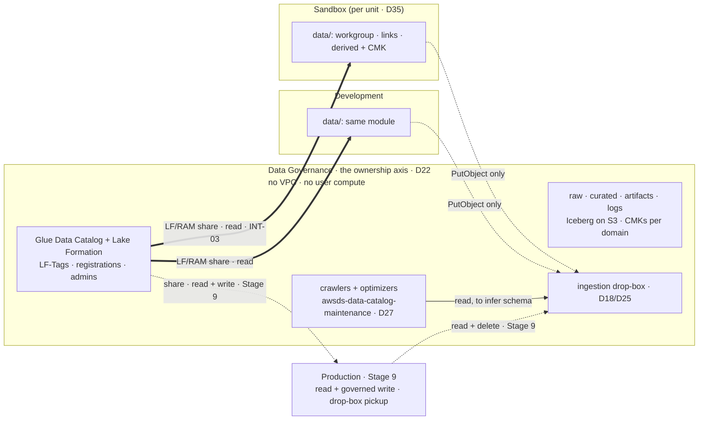

# Stage 5 — Data foundation

| | |
|---|---|
| **Status** | **PASSES 0-4 DONE except pass 4's behavioural half (2026-08-18/19)** — pass 4a/4b applied 2026-08-19: `terraform-modules/consumer-data/` v0.1.0 and the two consumer slices, `1 added` + `15 added` per account in Recipe D's two steps, both re-planning `No changes`, `./aws/datalake.py` **0 FAILED**. What remains of the stage is **4c** (the persona grants in `identity/sso/`), **4d** (every behavioural proof, all needing the tunnel), **4e** (4.3's SCP amendment, last) and **pass 6** (Security Hub). Earlier: **PASSES 0-3 DONE (2026-08-18/19)** — the governed lake exists, its grants are made and it is shared: pass 1 `58 to add` applied in two steps, pass 2 `9 added` (the governance manager's own grants), pass 3 `4 added` (the two cross-account shares, four RAM shares `ACTIVE` and held, zero invitations, INT-11 closed). **Passes 4 and 6 remain** — the consumer side, which now opens with a data lake administrator per account (7.3), and Security Hub. Each pass row below carries its own result. **Originally revised 2026-08-16 into the pass/verification format**, with five corrections against earlier stages folded in: the `CROSS_ACCOUNT_VERSION` defence moved to the step whose apply actually touches `DataLakeSettings` (5.4, not 7), the EFS mount rule rewritten against the WireGuard instance's SG (Stage 4's NAT means the peer CIDR never reaches AWS), step 3's role-protection re-read as already delivered by Stage 2's shared deny fragment, step 9 split into what can land now versus what waits for the blueprint-provisioned roles (INT-15), and step 13's delegation mechanics written for the two accounts that hold no CLI profile. **Revised again 2026-08-17 after the data-governance review** (AWS guidance read against the plan; links in `docs/REFERENCES.md`): the LF-Tag ontology carries a **`zone` dimension** from day one and the consumer grants are **LF-TBAC expressions scoped by classification** (`restricted`/`personal` by explicit grant only — Stage 11 then narrows *within* restricted instead of beginning enforcement); the sample table gains a restricted column so the share deliverable proves the scoping; the grant *method* joined decision 5 and the LF-TBAC cross-account prerequisite joined 7.1; the results-zone ceiling on decision 6's grain is stated at step 8; **the raw share to Sandbox is kept deliberately** (data engineers develop the raw→curated ETL there — `docs/plan/institutional-delta.md` row added); and the missing quality gate is declared (3.8). **Revised once more later the same day (2026-08-17): the user withdrew the NFS requirement from `objectives.md`, and [D24](../decisions/D24-shared-filesystem.md) is withdrawn with it** — pass 5 (steps 10-12, the `sandbox/nfs/` slice), question vii and the EFS cost row removed; no other step consumed the filesystem |
| **Prerequisites** | Stage 3 — the `[P]` gateway-endpoint IDs its `foundation/` slices export (INT-05) and the `data-perimeter` shapes of its step 9. **Stage 4, for one named input**: the WireGuard Elastic IP (a branch of step 1's bucket-policy condition); every laptop-side proof below also rides the tunnel. Stage 1d step 11 (org-wide RAM sharing; the LF cross-account version read `4`) |
| **Consumes** | [D6](../decisions/D06-dlp-approach.md), [D13](../decisions/D13-lake-formation-enforcement.md), [D18](../decisions/D18-data-scientist-access.md), [D19](../decisions/D19-derived-zone.md), [D22](../decisions/D22-data-governance-account.md), [D25](../decisions/D25-drop-box-consumer.md), [D26](../decisions/D26-unified-studio.md), [D27](../decisions/D27-catalog-maintenance.md), [D31](../decisions/D31-approver-read.md), [D35](../decisions/D35-sandbox-cardinality.md) |
| **Proves** | [INT-03](../integrations.md) (the two read shares; the write share waits for Stage 9), [INT-05](../integrations.md), [INT-11](../integrations.md) (its whole remaining half: the version defence and the first grant against the RCP), [INT-10](../integrations.md) **in part** — the writer and maintenance statements are exercised here; the Production pickup half is Stage 9's |

*Read with [`docs/plan/conventions.md`](../conventions.md) (naming, layout, `[P]`/`[D]`/`[E]`, IAM rules).*

**Forward constraint from D35 — the consumer side of this stage is per business unit.** `Sandbox`
multiplies (N is 1 today), so "the Sandbox consumer slice", "the Sandbox share" and every
`aws:SourceVpce` entry below are *allocations*: the share list is **N + 2** in general (INT-03), the
bucket-policy endpoint list is a map keyed by consumer, and `sandbox/data/` is what
[Stage 14](stage-14-sandbox-vending.md)'s `sandbox-unit` module composes. Write every list as a map from
day one; a literal written for unit 1 is a rewrite at unit 2.

---

**Objective:** where data lives and how it is catalogued — the substrate every later storey (the domain,
the portal, the pipelines) sits on.

## What this stage builds, and in which accounts

**Scope change (D22):** the governed lake — buckets, catalog, Lake Formation, classification — is built in
the **Data Governance account**, not in Sandbox. What the environment accounts get is their *consumer*
side. The lake is written once; the consumer slice is applied per Interactive account, which is how the
sharing shape gets proven before Stage 9 repeats it for Production.

| Where | What | Layer |
|---|---|---|
| `data-governance/data/` (new) | KMS CMKs, the four lake buckets + drop-box, Glue catalog, crawlers + the maintenance role, Iceberg, Lake Formation (settings, registrations, LF-Tags), the cross-account shares | `[P]` |
| `sandbox/data/`, `development/data/` (**applied 2026-08-19**, one module: `consumer-data` v0.1.0) | the account's own `DataLakeSettings`, Athena workgroup, LF resource links + the local re-grants, the derived-zone bucket with its three prefix families, the D31 CMK (`alias/awsds-<env>-zn-lab`) | `[P]` |
| Management + Audit, by hand | Security Hub delegated administration and org-wide enablement (step 13) | — (no slice, no profile) |

**The drop-box asymmetry is the design** (D18, D25, D27): three principals, three statements, and nobody
holds two of the three — the data scientist writes and cannot read back; the maintenance role reads and
cannot delete; the Production job role reads and deletes. That is what keeps the drop-box from becoming
the general-purpose exchange bucket D18 refuses to build.

## Step numbers are identifiers, not an order

Four of these numbers are **stable addresses cited from other files** — `step 1` from
`docs/plan/cost-model.md` (the KMS row) and Stage 3 step 3.2; `step 2` from Stage 11 step 1; `step 7` from
Stage 1d step 11 (three citations); `step 13` from `docs/plan/cost-model.md` and Stage 1b step 8. They do not
change. The sequence to work in is **six passes**:

| Pass | # | What | Slice · layer | Applied as |
|---|---|---|---|---|
| **0** | 2, 5.4-pre | the classification scheme; the INT-11 before-reading | on paper; a CLI read | — |
| **1** | 1, 3, 4, 5 | the lake: keys, buckets, policies, drop-box; catalog, role, crawlers; Iceberg; Lake Formation — **authored 2026-08-18, `58 to add`; applied in TWO steps, 5.2's callout** | `data-governance/data/` `[P]` | `awsds-infra-data` |
| **2** | 6 | D13 made real — grants, the grain decision, the sso/ reading — **DONE 2026-08-19: `9 added`, re-plan `No changes`; the sso/ reading, the grain map and the register rows all landed. The behavioural half (can the persona actually tag?) needs a GM session and the tunnel** - **scheduled 2026-08-19 as [Stage 6](stage-06-unified-studio.md)'s verification (xiii)**, beside (xii), because both need the same sign-in | idem, plus a reading of `identity/sso/` | idem |
| **3** | 7 | the two cross-account shares, and the INT-11 after-reading — **DONE 2026-08-19: `4 added`, re-plan `No changes`; four `LakeFormation-V4-*` shares `ACTIVE` and held by both consumers, zero invitations, `DL-5` bracket holds. Two findings changed what was applied — the grant option is mandatory, and the default expression needed a `layer` gate to keep the drop-box out** | `data-governance/data/` (`shares.tf`) + RAM | idem |
| **4** | 8, 9 | the consumer side: workgroups, links, derived zone + CMK; the pandas proofs — **opening with a `DataLakeSettings` per consumer account (7.3's finding)**. It also carries the behavioural debts pass 1 left, and the 4.3 amendment, listed below. **4a/4b DONE 2026-08-19** — one module (`consumer-data` v0.1.0) applied twice, Recipe D per account, `DL-5`/`DL-6` extended per account in the same sitting (the debt pass 3 wrote down), four re-grants per account verified by `list-permissions`, and verification (v) closed. **`scratch` left this row: it is a PREFIX in the derived bucket, not a bucket** — D13's own wording, §8 below. **4c/4d/4e remain** | `sandbox/data/`, `development/data/` `[P]` | `awsds-infra-sandbox-1`, `awsds-infra-dev` |
| **6** | 13 | Security Hub org-wide | by hand: Management, then Audit | `AWS Control Tower Admin`, console/CloudShell |

Pass 6 sits last so its first standards report covers a lake that exists — and keeps its number:
pass 5 was the EFS pass, removed 2026-08-17 with the NFS requirement. Pass 4 cannot precede pass 3 (a resource link to a share that does not exist
resolves nothing), and pass 3 cannot precede pass 1's step 5 (there is nothing to share).

**What pass 4 owes beyond its own two steps — written down 2026-08-19 because pass 1 applied resources
whose *behaviour* it never exercised, and an act with no owning pass is an act that does not happen
(Lesson 5's shape, applied to the plan itself).** Four debts, in this order:

**4a and 4b are DONE (2026-08-19).** The four debts below are what "pass 4" still means, and they are
now joined by **4c — the persona grants in `identity/sso/`**, which was deliberately sequenced *after*
the slices rather than with them: the permission set is one document provisioned into many accounts, so
before these slices existed the derived-bucket and workgroup ARNs could only have been wildcards; now
they are read from the two slices' state and enumerated exactly. Until 4c lands the persona holds Lake
Formation permission and neither `athena:StartQueryExecution` nor `s3:PutObject`, so **nothing can be
queried yet** and every debt below that needs a session waits on it.

1. **The crawler pair (3.3, verification (iii))** — the phase-4 positive half. `awsds-data-catalog-maintenance`
   and both crawlers exist since pass 1 and **neither has ever run**, so the D27 carve-out is still a
   carve-out that matches nothing as far as any measurement goes (Lesson 22's list). The negative half —
   `StartCrawler` from a persona session — needs the tunnel, like every persona proof here;
2. **the drop-box asymmetry halves that exist** (the writer's `PutObject`, its denied `GetObject`, the
   crawler's read) — the Production pickup stays Stage 9's;
3. **the sample-row decision, which 4.3 turns into a one-way door** — see 4.1's callout: `sample_trades`
   was created **empty** by Terraform, and the only way to put rows in it from inside this account is
   Athena, which is exactly what the next item closes;
4. **4.3's `athena:StartQueryExecution` amendment to `DenyUserCompute`, LAST**, through battery phase 4b.
   It binds every principal in Data Governance, `InfrastructureAccess` included. **It does not constrain
   pass 4's consumer queries** — those run in Sandbox and Development, under the `Interactive` OU — so the
   only thing it has to follow is any Athena-borne write *in this account*, i.e. item 3.

---

## To execute

### `data-governance/data/` — layer `[P]`; the KMS CMKs it uses live in the same account

#### 1. Keys, buckets, the perimeter policy, the drop-box

**1.1 — KMS CMKs per data domain** (aliases `alias/awsds-data-<domain>`), with **S3 Bucket Keys** on every
bucket (`docs/plan/cost-model.md` — a data environment issues a KMS request per object operation without them).
How many domains exist is decision 2 below; the KMS floor row in `docs/plan/cost-model.md` already says this is a
floor, not a count.

**1.2 — The four buckets** — `awsds-data-raw`, `awsds-data-curated`, `awsds-data-artifacts`,
`awsds-data-logs` — from the Stage 3 `s3-bucket` module: versioning, SSE-KMS with the domain CMK,
lifecycle rules, `prevent_destroy`, public access blocked.

> **Every bucket created in this account is undeletable while the `Data` OU SCP is attached, and that
> includes the ones created by mistake.** `DenyLakeDeletionAndDeregistration` denies `s3:DeleteBucket`
> unconditionally — no principal carve-out, `InfrastructureAccess` included, which is the property that
> makes it a control rather than a convention. It was written for the lake buckets and it reaches all of
> them, so a `terraform destroy` of *anything* here stops at the first bucket, with an `AccessDenied`
> naming the OU policy. **The amendment procedure, when a bucket genuinely has to go:** detach
> `awsds-org-scp-ou-data` from the `Data` OU, delete, re-attach, and re-run phase 4 of
> [`docs/plan/runbooks/scp-battery.md`](../runbooks/scp-battery.md) — the re-attach is not done until the
> probes have run again, because a policy detached "for a minute" is how a ceiling goes missing for a
> month. Two consequences to plan around rather than discover: name buckets as if they were permanent,
> because here they are; and **this is why 1c left the `s3:DeleteBucket` half untested** — exercising it
> means creating a bucket that then cannot be deleted.

**1.3 — The bucket policy: one deny, three legitimate branches.** The resource-side half of the
trusted-networks axis (`docs/plan/architecture.md` §4.2), complementing Stage 3's endpoint policies. Take the shape
from `data-perimeter-policy-examples`; the three branches, each of which exists because a class of caller
would otherwise be locked out with an `AccessDenied` that names none of this:

| Branch | Who it admits | Why |
|---|---|---|
| `aws:SourceVpce ∈ [per-consumer list]` | Sandbox (per unit, D35), Development, Production callers inside their VPCs | **the gateway-endpoint IDs from each consumer's `foundation/` outputs — never the `[E]` interface endpoints** (Lesson 3, INT-05): those get new IDs on every `make up` and, since D22, live in a different account from this policy, so nothing could ever repair it. `aws:SourceVpc` is the equally valid alternative anchor. Record the chosen anchor in the module's variable description |
| `aws:SourceIp = [the WireGuard EIPs]` | the laptop over the tunnel (D18) | a list, per D35 |
| `aws:PrincipalArn = the maintenance role` (or `aws:PrincipalAccount` = this account, looser and easier to get right) | **this account's own catalog-maintenance role (D27)** | a Glue crawler, optimizer or statistics run executes in the Glue service with no VPC attachment — no `aws:SourceVpce`, no WireGuard IP. A condition written for "every reader is remote" denies the one reader that is local; this is the collision D27 created after this step was first written, and it is why `AccessDenied` on a crawler is a network-policy bug rather than an IAM one |

**And the whole deny carries the `aws:ViaAWSService` carve-out**, or it blocks Athena and Lake Formation
vended access — the exact path D13 forces all tabular reads through; a bare `aws:SourceVpce` deny makes
step 6 unusable. While in the policy, add an **`s3:signatureAge` cap**: it bounds the lifetime of any
presigned URL, the preventive counterpart of the detection Stage 11 sets up.

**1.4 — The ingestion drop-box (D18, D25, D27).** `s3:PutObject` granted by bucket policy to the
Interactive-OU roles, dated prefix, no read, no list, no delete. **Three statements, three principals**
(the asymmetry diagram above):

1. the **writer** statement — Interactive-OU roles, `PutObject` only, dated prefixes;
2. the **reader-deleter** statement — the **Production job execution role**: `GetObject`, `ListBucket` on
   the dated prefixes and `DeleteObject`, because a letterbox nobody empties fills up (D25, INT-10). The
   role does not exist yet — write the statement against **`awsds-prod-job-exec`**, the exact name
   Stage 9 step 3 contracts (its `deploytargets.py` reads both sides), and record that the pickup half
   of INT-10 stays unexercised until then;
3. the **reader** statement — the maintenance role (D27): `GetObject`/`ListBucket` on the same prefixes,
   so the drop-box crawler can read what the writer wrote in order to infer its schema.

Principals 2 and 3 also need a grant on the **drop-box KMS key** — the half that is forgotten until the
`AccessDenied` arrives, and the error text will point at S3, not at KMS. **Which container the drop-box is
— its own bucket with its own CMK, or a prefix of `raw` — is decision 3 below, and the key is the
argument**: a prefix shares `raw`'s CMK, so "a grant on the drop-box key" would reach the whole raw
domain.

**1.5 — Deliberately not created here: an `athena-results` bucket.** Step 8 gives every consuming account
its own results bucket, local to it and behind its own enforced workgroup configuration (D19). A results
bucket in this account would be a place for query output to accumulate *inside* the governed account,
owned by nobody, and outside the per-principal prefix scheme the derived zone is built on.

#### 2. The classification scheme — before the LF-Tags

**Define the data classification scheme before defining LF-Tags.** LF-Tags are the mechanism; the
classification is the decision — which levels exist (e.g. public / internal / restricted / personal), who
owns the assignment, and what each level permits. Writing the tags first produces a taxonomy shaped by
whatever the first table happened to contain, and Stage 11's Macie findings then have nothing to map onto.
This is the smallest piece of real data governance in the plan and it costs nothing but thought — which is
why it is pass 0, on paper, before any apply. The owner is the **governance manager** (step 7.4).

**The ontology's one copy lives in [`docs/GOVERNANCE.md`](../../GOVERNANCE.md) since 2026-08-18
(decisions 1-3): keys `classification`, `layer` (formerly `zone`, gaining a `dropbox` value),
`security-zone` (new — the CMK carrier) and `businessunit` (formerly `domain`, reserved). Text below
predating the rename reads `zone` accordingly.** **The ontology carries two dimensions from day one — `classification` and `zone` (`raw`/`curated`; added
2026-08-17)** — orthogonal by design: `zone` says where in the pipeline a table sits, `classification` says
what its content demands, and every grant below is an *expression* over both (step 6.1). Sandbox and
Development read **both zones** — a deliberate deviation from the raw-zone guidance, decided 2026-08-17 and
recorded in `docs/plan/institutional-delta.md` ("Raw-zone access"): Sandbox is also where data engineers
first develop the raw→curated ETL routines, so raw access there is the job. What keeps the deviation
governed is the other dimension, which is classification-scoped regardless of zone. Two further rulings
that live here: **per-business-unit segregation at N>1 is the `domain` dimension's job** (decision 2 —
added to the ontology as a third tag key when a second domain exists; no separate `unit` dimension, settled
2026-08-17); and **the default the `raw` database carries is part of decision 1** — a new table inherits
its database's tags, so raw's default classification decides what an *unclassified* arrival is: fail-open
(`internal`, readable until someone says otherwise) or fail-closed (`restricted`, invisible until
classified). Choose it on paper, not at the first crawl.

#### 3. The catalog, the maintenance role, the crawlers

**3.1 — Glue Data Catalog databases** `raw` and `curated`.

**3.2 — The maintenance role's name is fixed, and it is a contract rather than a preference:
`awsds-data-catalog-maintenance`.** The `Data` OU SCP attached in
[Stage 1c step 7.6](stage-01c-preventive-policies.md) denies `glue:StartCrawler`, `StartCrawlerSchedule`
and the column-statistics runs to every principal *except* that exact ARN in this account. Create the role
under any other name and the crawlers never run — a fail-closed failure that surfaces at the first crawl
with an `AccessDenied` naming the OU policy, not the role. Trust policy: `glue.amazonaws.com` and nothing
else — the role is not assumable interactively (D27). `./aws/datalake.py` checks both the name and the
trust.

**3.3 — Exercise the carve-out's positive half immediately** — the first thing after the role and the raw
crawler exist, before anything is wired to trigger it
([`docs/plan/runbooks/scp-battery.md`](../runbooks/scp-battery.md), phase 4): 1c could only prove that a
principal outside the carve-out is denied, because the role did not exist yet. A carve-out that silently
matches nothing is a job that will not run, and it does not announce itself (Lesson 22's list carries this
as one of its three known-unverifiable-until-now statements).

**3.4 — The carve-out's guard, restated so nobody "fixes" it:** the SCP statement carries
`BoolIfExists: aws:PrincipalIsAWSService=false` beside the ARN test (amended 2026-08-13) — a run
*initiated by Glue itself* presents no principal ARN the carve-out could match, and without the guard it
would land on the deny side of a test it was never meant to take. Nothing measured this — the schedule
that would provoke it is the one this step refuses to create — which is exactly why it is written rather
than left to be discovered.

**3.5 — The role's own protection is already delivered, and this step verifies it by reading rather than
builds it.** An SCP exemption keyed on a principal ARN belongs to whoever can *become* that principal:
anyone holding `iam:UpdateAssumeRolePolicy` on `awsds-data-catalog-maintenance` can add themselves to its
trust policy and inherit the exemption without ever appearing in the SCP. **Stage 2's shared deny fragment
(`identity/sso/`, Sid `DenyIamPrincipalMutation`) already denies that action — and all IAM principal
mutation — to every persona set**, which is the stronger form of what this step used to ask for. Verify
the Sid is present (a reading, Lesson 22), and add a **resource policy on the role** only if this account
ever gains a second administrator. The same reasoning applies to `iam:PassRole` for anything that could
run *as* the role — scoped where it is granted, per the conventions.

**3.6 — Crawlers where schema arrives from outside, and only there (D27):** one over the raw zone, one
over the ingestion drop-box. **No crawler ever points at an Iceberg table** — Iceberg is catalog-native,
and a crawler would at best duplicate what the catalog already knows. **Never on a standing schedule**: a
crawler run bills per DPU-hour with a 10-minute minimum, so cron-always would out-cost the storage it
catalogs. The trigger is **event-driven or on-demand**: EventBridge on drop-box object creation, or a run
before a D25 pickup. **How the event actually starts the crawler is verification (iv)** — the `Data` OU
denies `lambda:CreateFunction`, so the EventBridge→Lambda idiom is not buildable here; the candidate shape
is S3 → EventBridge → a Glue workflow/trigger, whose run is initiated by Glue itself and therefore lands
on the service-guard side of 3.4. If no compute-free path works, on-demand-before-pickup is the fallback
and costs only ordering.

**3.7 — Lake Formation blueprints are unusable in this account, and that is by construction:** a blueprint
workflow creates and runs Glue jobs, which `DenyUserCompute` denies. If an ingestion path ever wants one,
it runs from an environment account and writes across the boundary — the same shape D25 already uses for
the drop-box pickup. Reading this as "the SCP is in the way" is the error to avoid: the SCP is the
statement that nothing runs here, and a blueprint is compute.

**3.8 — The ingestion path has no data-quality gate, and that is declared rather than implied
(2026-08-17):** nothing between the drop-box and `curated` checks schema drift, nulls, duplicates or
freshness — the crawler infers schema, and that is the whole check. Structural, not an oversight to fix
here: Glue Data Quality runs as Glue jobs, which `DenyUserCompute` denies in this account by design (3.7's
own logic), so a quality gate belongs to the pipeline side — Stage 8's `app-etl` pipeline (its 2.2)
carries the hook. The institutional answer is in `docs/plan/institutional-delta.md` ("Data quality").

#### 4. Iceberg tables, and their maintenance owner

**4.1 — Iceberg tables on S3, in the catalog.** A sample table in `curated` is the stage's working piece —
the deliverables query it from both consumers. Give it **at least one column tagged
`classification=restricted`** beside ordinary ones (2026-08-17): the share deliverable must prove
entitlement *scoped by the scheme* — the restricted column absent from a default consumer read — not merely
that the share works.

**APPLIED 2026-08-18 as `curated.sample_trades` — six columns, `counterparty` the restricted one, created
through the Glue API's Iceberg path so no Athena DDL was needed in this account. It therefore has NO
ROWS, and that is a scheduling fact rather than a detail (written down 2026-08-19):**

- **verification (x) still works** — it reads the *column list*, and the three states are distinguishable:
  `counterparty` absent (the scoped grant holding), present (the scope leaking), or the table not
  resolving at all (a broken share). Lesson 13 is satisfied without a single row;
- **row-level evidence is not available and cannot be manufactured cheaply.** A `SELECT` over an empty
  table returns nothing whether a filter removed the rows or there were none — which is exactly the
  shape Stage 11's data-cells filters need to prove (its verification (iii)). So **pass 4 takes a
  decision here**: load sample rows through Athena in this account *before* 4.3's amendment closes that
  door, or accept that row-level evidence waits for **Stage 9's producer path** — the governed
  cross-account write, which is the designed way data enters `curated` at all.
  **Recommended: the second.** Loading rows by hand means using the one write path the design does not
  have (D22 makes Production the lake's only producer), and it buys evidence nothing needs until
  Stage 11, by which time Stage 9 has run. The cost of that choice is named rather than discovered:
  **Stage 11's filter proof inherits a dependency on Stage 9 having written real rows**, and Stage 11's
  prerequisites row says so.

**4.2 — Table maintenance gets an owner on day one**: scheduled `OPTIMIZE` (compaction) and `VACUUM`
(snapshot expiry) through Athena, or Glue's automatic compaction (the table-optimizer path, whose runs the
D27 carve-out already names) — an Iceberg table nobody compacts degrades quietly and pays storage for
every dead snapshot. Which path was decision 4 below — **decided 2026-08-18: Glue's automatic
compaction**. **Amazon S3 Tables** — managed Iceberg with automatic
maintenance — is the AWS-native alternative, deliberately not used here: D13's registered/unregistered
prefix split leans on general-purpose buckets. Recorded in `docs/plan/institutional-delta.md`.

**4.3 — The Athena branch is why `athena:StartQueryExecution` is not in `DenyUserCompute`, and that
absence has a cost worth naming here rather than in an audit:** a principal in this account can read any
table the catalog exposes and write the result to S3, and the perimeter only stops that write when the
destination is outside the organization. The `Data` OU SCP therefore makes "nothing *runs* here" true and
leaves "nothing *reads everything* here" to detection ([Stage 11](stage-11-dlp.md)); it is recorded in
[`POLICIES.md`](../../../terraform-live/identity/org-policies/POLICIES.md) as a stated non-coverage.
**Maintenance IS Glue's automatic compaction (decision 4, taken 2026-08-18), so the hole closes**: add
`athena:StartQueryExecution` to the statement — an SCP amendment, run through phase 4b of the battery,
never straight to the OU. **Sequence it late in the stage, and mind one dependency:** the amendment binds
every principal in this account, `InfrastructureAccess` included, so if 4.1's sample table is created or
loaded *through Athena in this account*, that must happen first — after the amendment, writes into the
lake arrive only through the designed producer paths (the drop-box, and Stage 9's governed write).

#### 5. Lake Formation — the permission model, made real

**5.1 — Register the S3 locations** (the raw and curated prefixes) and apply the LF-Tags from step 2 —
both dimensions: `zone` on the two databases, `classification` per table and column.

**5.2 — Kill the IAM-fallback defaults, or every grant below is decoration.** A fresh account answers
every catalog request through the `IAMAllowedPrincipals` virtual group and creates new databases with
"use only IAM access control" on — Lake Formation is then a bookkeeping layer over plain IAM, and D13 is
Lesson 5 with a console page. Concretely: turn off the two default-IAM settings in
`aws_lakeformation_data_lake_settings` (`create_database_default_permissions` /
`create_table_default_permissions` empty), and revoke `IAMAllowedPrincipals` from the two databases and
every table. **INT-03 flags this as version-dependent behaviour** — do it before the first share, not
after, so the share is granted into a model that is actually enforcing.

> **THE PLAN CANNOT PROVE THIS HALF, SO THE APPLY IS TWO STEPS — measured 2026-08-18 while authoring
> pass 1, in the pinned provider (`aws ~> 6.60`).** Both default-permission blocks are **Computed**, so
> omitting them plans as `after_unknown: true` — Terraform states no intention about them; and an
> explicitly empty list is **not expressible**: `create_database_default_permissions = []` is refused
> ("did you mean to define a block?"), while a `{}` block declares *one* entry with computed fields,
> which is not zero. Omission is the only available form, and whether it **clears** or merely **leaves
> alone** is a provider property the plan does not state. The difference is invisible afterwards and
> expensive — a database created while the defaults still stand is born deferring to IAM, and clearing
> them later does not reach it. **So it is measured rather than assumed:**
> 1. apply `aws_lakeformation_data_lake_settings` **alone** (`-target`), before any database exists;
> 2. read the account — `./aws/datalake.py` (`DL-5` for the parameters, `DL-6` for the defaults);
> 3. if `IAM_ALLOWED_PRINCIPALS` is still there, do 5.2's **other half — revoke — and re-read**, *before*
>    the second apply;
> 4. then apply the rest, which is where the first database is created.
>
> `-target` is the documented "the operator knows an order the graph does not" escape, and this is that
> case: the graph orders the two correctly — every database `depends_on` the settings — but a graph
> cannot pause to be read (Lesson 13: a step whose success and failure look alike is not a step).

**5.3 — Declare the data lake administrators deliberately** — decision 5 below; the recommended answer is
the `InfrastructureAccess` role alone, with the governance manager holding LF *grants* (step 7.4) rather
than admin: an admin can grant everything, and an approver who can already grant everything is not
exercising a control (Lesson 9's trap, one mechanism over).

**5.4 — The same resource is the INT-11 hazard, and this is where the defence lives — not step 7.**
`aws_lakeformation_data_lake_settings` replaces the whole `DataLakeSettings` structure rather than
patching it (1d step 11.2's trap, in Terraform). The account's parameters already read
**`CROSS_ACCOUNT_VERSION = 4`, `SET_CONTEXT = TRUE`** — values nobody set and nobody else is defending —
and a resource that names `admins` and omits `parameters` **resets both on the first apply**, after which
every grant appears to succeed and no share ever arrives, with nothing anywhere reporting an error. So:

- read the parameters **before** the first apply of this slice
  (`aws lakeformation get-data-lake-settings --profile awsds-infra-data --query 'DataLakeSettings.Parameters'`),
- carry them in the resource **explicitly** — `parameters = { CROSS_ACCOUNT_VERSION = "4", SET_CONTEXT = "TRUE" }`,
  both keys, written from the read rather than from memory (1d's instruction),
- read them **again after** the apply — verifying a setting only before the thing that overwrites it runs
  is Lesson 13's shape (step 7 repeats this read after the shares, so the value is bracketed by three
  readings in total). `./aws/datalake.py` `DL-5` is this reading, mechanised.

#### 6. Implement D13 — make Lake Formation enforceable — which D22 makes structural

**6.1 — The grant model.** In the old layout this required carefully *excluding* the registered prefixes
from roles that lived next to them; now the environment accounts do not even contain the lake buckets. The
SageMaker execution roles and the `DataScientistAccess` permission set hold **no S3 permission of any kind
on Data Governance buckets** (except the drop-box `PutObject`) — tabular access goes through Athena, Glue
interactive sessions or EMR runtime roles, which ask Lake Formation across the account boundary. This is
the step that decides whether the fine-grained access control objective in `CLAUDE.md` is a control or a
decoration.

**And the grants themselves are LF-TBAC expressions over the step 2 dimensions, not named-resource lists
(2026-08-17; the method is decision 5's second half):** the consumer grant is
`zone ∈ {raw, curated} AND classification ∈ {public, internal}` — `restricted` and `personal` travel
**only on explicit grants** to enumerated principals, recorded in the log **and in the grant register**
(`docs/AWS_STATE.md`). *(Decided form, 2026-08-18 — `GOVERNANCE.md`: the default expression is
`classification ∈ {public, internal}` alone, read-only; `layer` does not gate the default read.
**SUPERSEDED at the apply, 2026-08-19 — see 7.2: the `layer` gate came back, because without it the
expression matched the drop-box.** The 2026-08-17 sentence two lines above, `zone ∈ {raw, curated} AND
classification ∈ {public, internal}`, was right all along; the simplification is what lost it.)* This is what makes the scheme a
control during Stages 6-10 rather than paper until Stage 11 (Lesson 5): the cell/row filters Stage 11 adds
then narrow *within* the restricted grants instead of beginning enforcement. Named-resource grants stay
available for the exceptions hybrid mode covers (6.3).

**6.2 — Verify the permission-set half by reading, not by trusting the intention:** the six persona sets
in `identity/sso/` were written narrow in Stage 2 — confirm none carries an S3 grant that reaches this
account's buckets. (The execution-role half cannot be verified yet: those roles are blueprint-provisioned
at Stage 6, which is INT-15's whole subject.)

**READ 2026-08-19, and it comes back clean in the strongest form available: every single `s3:` mention
across the four policy files is inside a `Deny`.** There is no `s3:Get*` **Allow** anywhere in the six
sets — not scoped, not wildcarded, not on another account's buckets. The four are
`DenyTerraformStateAccess` (`s3:*` on `awsds-*-tfstate`, the wildcard read in the closing direction),
`DenyMakingStorageOrImagesPublic`, the data scientists' `DenyEveryWrite` (`s3:Delete*`/`Put*`/`Restore*`)
and the two approvers' `DenyReadingTheRows`/its deployment-manager twin (`s3:Get*` whole). **So D13's
premise holds by *absence* rather than by exclusion** — 6.1's "no S3 permission of any kind on Data
Governance buckets" needed no carve-out written anywhere, because there was never a grant to carve out
of, which is what D22's account split bought. The drop-box `PutObject` exception 6.1 names is granted by
**bucket policy** to the Interactive-OU roles, not by a permission set — so it does not appear here, and
that is correct rather than missing.

**6.3 — Exceptions go through Lake Formation hybrid access mode**, recorded, rather than by quietly
widening a role.

**6.4 — What the objective's *grain* is has been open since 2026-08-13, and it is decided here rather than
assumed** (decision 6; `docs/plan/open-questions.md` item 13). **Decision 6 landed 2026-08-18: the target
reframed — entitlement to roles/projects per the toolset's practice, per-user as mapped exploration (the
decision row carries it; the paragraph below stays as the reasoning that framed the question).** `CLAUDE.md` asks to "restrict who can read
which database, table, column and row" — a statement about a **person** — while Unified Studio notebooks
do not support trusted identity propagation: in an Identity Center domain they fall back to *compatibility
permission mode*, so the principal Lake Formation actually sees is the project/compute role, not the
human. Grant accordingly and say which it is: either per-user filtering exists on the SQL path and not on
the notebook path — a two-grain design that has to be stated, not discovered — or the grain is the
**project**, and the objective is met at that grain with the difference written down. A row filter that
silently applies to a role shared by four people is Lesson 5 with a `WHERE` clause.

#### 7. The cross-account shares (D22, INT-03, INT-11)

**7.1 — Prerequisites, both already true and one still fragile:** Stage 1d step 11 enabled org-wide RAM
sharing (measured, `INV-09`) and the cross-account version reads 4 — but 5.4 is what keeps the second one
true through this stage's applies. Without them the grant appears to succeed on this side and the resource
never appears on the consumer side — the least diagnosable failure in the whole plan, because nothing
errors. **A third prerequisite arrives with the grant method (2026-08-17): cross-account LF-TBAC requires
additions to the Data Catalog resource policy** — the documented cross-account prerequisites page
(`docs/REFERENCES.md`), and a miss fails exactly like the other two: the TBAC share appears to succeed
where a named-resource share would have worked. Read the policy before the first grant; the addition is
written in this slice, beside the grants it enables.

**RESOLVED 2026-08-19, and the third prerequisite turned out to be CONDITIONAL — no policy was written.**
Two AWS pages differ in emphasis: the LF-TBAC considerations page states the requirement flatly (which is
what the paragraph above recorded), while the Prerequisites page scopes it — the `glue:ShareResource`
statement is required of an account **already** sharing through an AWS Glue Data Catalog resource policy
(the version 1/2 path), and "is not required if your account has made no cross-account grants using the
AWS Glue Data Catalog resource policy". **Measured in Data Governance: `glue:GetResourcePolicy` →
`EntityNotFoundException`.** The condition does not hold, so no `aws_glue_resource_policy` exists in this
slice and nothing is set to `EnableHybrid` — a policy added "to be safe" would be a real permission
surface and a hybrid-mode interaction adopted for a case that does not apply. **The reading was
falsifiable and the falsifier did not fire**: had the flat statement been the operative one, the grant
would have applied cleanly and no RAM share would have appeared. Four appeared, `ACTIVE`, held on both
sides (7.3).

**7.2 — Grant the read share to the Sandbox and Development accounts** through Lake Formation/RAM, **as
the classification-scoped LF-TBAC expressions of 6.1** — both zones, `public`/`internal`; the explicit
`restricted` grants are separate, enumerated acts. The resource links land on the consumer side in step 8. **The Production share, including the governed
write, waits for Stage 9** — no consumer exists for it yet. Grant to **accounts** or to the **OU** — the
version supports OU grants, and which to use is part of decision 5; per-account is the INT-11 fallback
either way.

**APPLIED 2026-08-19 as four grants — two consumer accounts × two resource types — and TWO THINGS ABOUT
THE FORM ABOVE WERE WRONG, both found at the apply rather than argued into place:**

- **every cross-account grant carries the grant option; it is not Production's special case.** A
  cross-account grant lands on the **account**, and nothing inside it can use the share until that
  account's own data lake administrator passes it on — an administrator can only pass on what it
  received with the option, and AWS states it as an imperative. Omitting it fails mutely and *late*: the
  apply succeeds, the RAM share appears, the resource shows in the consumer's catalog, and every later
  grant to a person fails, one pass away, in another account. It is **not** a delegation of the share —
  a resource shared *with* an account may be granted only to principals *in* that account. `GOVERNANCE.md`
  §Grants is corrected;
- **the expression needed a `layer` gate, or the share included the drop-box.** The decided form
  (`classification ∈ {public, internal}` alone) matched the drop-box database, which carries
  `classification=internal` for decision 1's fail-open reason — the letterbox whose entire contract is
  *write, never read back*. No row would have travelled (the drop-box bucket is unregistered, so a query
  falls back to plain IAM and no consumer holds `s3:Get` on it) but the metadata would have. **The
  applied form is two grants, deliberately not the same expression**: `DESCRIBE` on databases matching
  `layer ∈ {raw, curated}`, and `SELECT`+`DESCRIBE` on tables matching that **AND**
  `classification ∈ {public, internal}`. The database grant may not carry the classification gate —
  `curated`'s database has no classification by design, and a database that does not match cannot be
  resource-linked, which is the whole of step 8.

Verified against the API rather than the code: four rows, both accounts, grant option on every one, the
`AND` present on the table rows.

**7.3 — Three readings around the first grant, because two different things can silently fail:**

- the parameters read of 5.4, repeated **after** the first share is created (the third bracket);
- **the first grant is also the RCP's first contact with `sts:SetContext`** (1d 11.2): version 4 vends
  cross-account credentials through exactly the action `awsds-org-rcp-perimeter` names. In-org consumers
  populate `aws:PrincipalOrgID`, so the expected answer is "no effect" — but that is the same reasoning
  that failed for `AssumeRoleWithSAML` and locked every SSO user out of the member accounts (Lesson 24).
  **Run the
  consumer-side read with a *fresh* session** (the four-hour CLI cache serves stale successes), and if the
  share fails, the RCP is the first suspect — and no `sts:` action is touched in that document without
  re-reading `CT.STS.PV.1`'s exclusion note;
- `ram get-resource-share-invitations` from each consumer: **a pending invitation is the org-sharing path
  not working** — the share "arrived" through the fallback tax INT-11 describes, and it will reappear at
  every rebuild.

**READ 2026-08-19, all three, and the third turned up something the plan did not have:**

- **the parameters bracket holds** — `CROSS_ACCOUNT_VERSION=4`, `SET_CONTEXT=TRUE` after the shares
  exist, the third of the three readings verification (i) asks for;
- **the shares travelled**: four `LakeFormation-V4-*` resource shares owned by Data Governance, all
  `ACTIVE`, and each consumer's own RAM holds its two. **Zero invitations anywhere** — the org-sharing
  path is doing the work and INT-11's fallback tax is not being paid;
- **and the consumer catalogs are EMPTY, which is correct rather than the silent failure it resembles.**
  `glue:GetDatabases` and `list-lf-tags` return nothing in either account because **neither has a data
  lake administrator** (`DataLakeAdmins: []`), and AWS requires at least one before a shared resource is
  visible there at all. This is the discriminator the instrument lacked: an empty consumer catalog means
  *the share has not been received into Lake Formation yet*, while a share the consumer's RAM does not
  hold is the real INT-11 failure. **`./aws/datalake.py` now reads the consumer side's held shares and
  admin counts, and `DL-7` reports the two branches separately** — the same-verdict-for-opposite-causes
  defect being Lesson 13's family.

**So step 8 owes each consumer account a `DataLakeSettings` of its own**, before any resource link can
resolve — and it owes it with both hazards this stage already met on the producer side: the `Parameters`
map that a settings apply replaces wholesale (INT-11), and the `Create*DefaultPermissions` that must be
cleared **before** the first local database exists (Lesson 27, and no plan will state it).

**`sts:SetContext` is only half-tested by the above.** The metadata path travelled with the RCP in place,
which is the good sign; but version 4 vends *data* credentials through that action, and no data has been
read yet. Verification (ii) closes at pass 4's first query, not here.

**1d 11.4's two items land here too:** the `AWSLakeFormationCrossAccountManager` managed policy on the
grantor principal, and — only if the org path fails — `ram:AcceptResourceShareInvitation` on the
consumer-side roles. **Neither was needed (2026-08-19):** the grantor is `InfrastructureAccess`, which is
`AdministratorAccess`, so the managed policy is a subset of what it already holds — attaching it would be
decoration; and the org path left no invitation to accept.

**7.4 — The catalog gains a second storey in Stage 6 (D26):** SageMaker Catalog — the DataZone layer of
the unified domain — sits on top of this Glue/LF substrate. Publishing an asset and approving a
subscription happen in the portal, and for managed assets the *fulfilment* of an approval is a Lake
Formation grant that DataZone writes. Nothing in this stage is replaced by that: the LF-Tags, the
registrations and the shares built here are what the portal's approvals resolve to — which is why this
stage still comes first. **Whose approvals: the governance manager's.** That persona also owns the
classification scheme from step 2 and the LF-Tag assignments — deliberately the same person, because a
taxonomy owned by someone who does not answer for the grants is decoration.

### `sandbox/data/` and `development/data/` — the consumer side, layer `[P]`, one module for both

#### 8. Workgroup, resource links, the derived zone's prefixes

**First, and it is a prerequisite rather than a step (established 2026-08-19 at 7.3): each consumer
account needs its own data lake administrator before anything below resolves.** AWS requires at least one
in the receiving account for a shared resource to be visible there at all, and both accounts currently
read `DataLakeAdmins: []` — their RAM holds the shares while their catalogs are empty. So each
`sandbox/data/` and `development/data/` opens with an `aws_lakeformation_data_lake_settings` of its own,
carrying the **same two hazards** the producer side met: `Parameters` is replaced wholesale by that
resource (INT-11 — read the account's current map first and carry it), and the two
`Create*DefaultPermissions` act **at creation time**, so they must be cleared before the first local
database, which here is the first resource link. **The plan will not state either** — Lesson 27, and
Recipe D in the terraform-changes runbook is the procedure.

**And the instrument did not cover this, which is why it was extended in the same sitting — DONE
2026-08-19.** `DL-6` was scoped to Data Governance alone (`DATA_PROFILE`) and was therefore reporting
`pass` while **both** consumers sat in exactly the state it exists to fail. Both checks are now per
account. `DL-5` was extended with it, for a reason nobody had stated: the before-reading found **both
consumer accounts already carrying `CROSS_ACCOUNT_VERSION=4` / `SET_CONTEXT=TRUE`**, so INT-11's reset is
symmetric and was never a producer-only hazard. In a consumer `DL-6` deliberately carries no
*databases exist* guard — the reading is only actionable before the first link. The reading is per account and per catalog object: the two defaults `[]`, and no
database carrying an `IAMAllowedPrincipals` grant. **`DL-7` already reads the consumer side correctly**
(rebuilt at pass 3): held shares and admin count, reported as separate branches.

**APPLIED 2026-08-19 as `terraform-modules/consumer-data/` v0.1.0, one module called by two slices** —
`sandbox/data/` and `development/data/`, both `[P]`, both at rank `data`. What follows describes what it
builds.

Then, per account: the **Athena workgroup** (`awsds-<env>-athena`) — result location local to the account,
per-query scan limit (**10 GiB applied**, ≈ USD 0.05 at Athena's USD 5/TB), and
**`EnforceWorkGroupConfiguration = true`** (the setting the console calls
"override client-side settings"; without it the result location is whatever the client asks for, which
makes step 9 a suggestion rather than a boundary, D19); the LF **resource links** to the shared databases;
and the **prefix families** of step 9. Point the enforced result location **into the derived-zone bucket
of step 9**, so query output lands under the lifecycle, the CMK and the Macie scope designed for it rather
than in a second, undesigned copy zone.

**`scratch` IS ONE OF THOSE PREFIXES AND NOT A BUCKET — settled 2026-08-19, at the authoring, by reading
the origin.** This file, `architecture.md` and `conventions.md` §6 all said "scratch + derived-zone
*buckets*" and all credited **D19**, which never mentions `scratch`. The origin is **D13**: *"non-registered
prefixes (scratch, artifacts, model outputs) keep ordinary IAM access"* — `scratch` names the CLASS of
everything Lake Formation does not govern, and every line on the IAM side of the plan says *prefixes*
too. A second bucket would have needed either a third CMK the cost model does not carry or a key shared
for no reason. Applied shape: one bucket, three families — `results/` (the workgroup's enforced output,
per-persona because an enforced workgroup has exactly one), `derived/${aws:userid}/` (per principal),
`scratch/`. What makes them real is the `s3:PutObject` scoping on the permission set, which is **4c**.

**An enforced workgroup has one result location, and that is a ceiling on the whole design (2026-08-17;
Stage 9's status row measured the same limit for Production):** every holder of the persona set can read
the results zone, so a materialised result is visible within the persona whatever the SQL path filtered.
**The system's real grain is `min(SQL grain, derived-zone grain)`** — decision 6 consumes this sentence,
and a per-user answer there requires 9.2's per-user read scoping to mean anything.

**Prove each share here with the pandas pair, before Stage 6 builds anything on top:** the table reads
through Athena over the link, and pointing pandas at the same table's S3 path fails. Run it in both
accounts.

#### 9. The derived zone (D19, D31) — built deliberately, in each Interactive account

**9.1 — Why it exists:** D13 makes the *entitlement* real; it does nothing about what happens after the
read, and what happens after the read is that people store results — which is the job, not an abuse of it.
So the local prefixes get designed rather than left over.

**9.2 — What lands now, in this slice:**

- the derived bucket (`awsds-<env>-derived`), prefixes **per principal** (`…/derived/${aws:userid}/`), so
  one person's materialised result is not a way around another person's grants;
- a **lifecycle expiry** (30 days is a reasonable start), so the shadow lake does not silently become
  permanent;
- **its own KMS CMK** — D31, and the only default-deny practice on the list: separate from the account's
  general-purpose key, because a key that also had to serve state and logs cannot express "who may read
  derived data" without breaking everything else that uses it. The key policy grants `kms:Decrypt` to
  `DataScientistAccess` and to nobody else today; the `DeploymentManagerAccess` set of D31 is deliberately
  absent, as is any future broad read persona.
  **The alias is `alias/awsds-<env>-zn-lab`, not `-derived` — amended 2026-08-19, by the user** (decision
  2's row): encryption granularity is the `security-zone` dimension's job in every account, and a query
  result over a `zn-lab` table is still `zn-lab` data. One CMK per (zone × account). **And the applied
  policy delegates *administration* to the account root while withholding every cryptographic action** —
  the module's default `kms:*` root statement would have let any IAM policy in the account grant
  `Decrypt`, which is the state D31 was created by;
- `s3:PutObject` scoped to exactly these prefixes on the **permission sets**, never `*` — and, **if
  decision 6 lands on the per-user grain, `s3:GetObject` scoped by the same `${aws:userid}` prefix**
  (2026-08-17): without it a colleague reads the materialised result and the per-user LF filter is undone
  one hop later — Lesson 5 with an S3 prefix. The CMK below stays persona-level either way (one key cannot
  express per-user), a residual written here rather than discovered;
- the prefixes recorded as **in scope for Macie and CloudTrail data events** in Stage 11, because this is
  where sensitive data will actually accumulate — *outside* the account Macie primarily watches, which is
  exactly why the scope has to be written down.

**9.3 — What waits for Stage 6, named so it is not read as missing:** the grants to the **project
execution roles** — both the key-policy `Decrypt` and the scoped `PutObject`. Those roles are
blueprint-provisioned (D26) and do not exist yet; whether they can be constrained at all is INT-15. Write
the key policy with an explicit extension point and a comment naming Stage 6 step 2, so the addition is a
diff and not a redesign.

**9.4 — State the classification rule alongside:** the output of a query over `restricted` data is
`restricted`. Nothing enforces that automatically at this scale — it is policy, and
`docs/plan/institutional-delta.md` records that a catalog with lineage is what enforces it in an institution.

**Cost:** one CMK per Interactive account, ~USD 1 each (`docs/plan/cost-model.md`). **The zero-cost variant if
that ever matters:** S3 sets the KMS encryption context to the object ARN, so the account's existing key
can carry a `kms:EncryptionContext:aws:s3:arn` condition scoped to the derived prefix instead of a second
key — subtler, more fragile, recorded here as the fallback rather than the default.

### `sandbox/nfs/` — removed (2026-08-17)

*Steps 10-12 built the shared EFS here: filesystem + mount targets, the laptop mount over the
tunnel, persistence as the design. The NFS requirement was withdrawn from `docs/plan/objectives.md`
on 2026-08-17 and [D24](../decisions/D24-shared-filesystem.md) with it — no filesystem is built, in
any account. File exchange between users, SageMaker and S3 is what the graduation path already is:
S3 and git. The step numbers stay retired so earlier references cannot collide; `./aws/datalake.py`
`DL-10` now measures the* ***absence*** *of any EFS in the VPN home — except the home filesystem a
Studio domain creates for itself and retains (conventions §5.1 rule 2; exemption added 2026-08-18,
keyed on the `ManagedByAmazonSageMakerResource` tag), which the check names rather than fails.*

### Not part of the data foundation, but this is the stage it belongs to

#### 13. Enable Security Hub org-wide — by hand, from Management and Audit

This stage is the trigger because Security Hub's value is its *standards* — automated checks against the
AWS Foundational Security Best Practices — and before this stage there were barely any resources to check.
Turning it on here means its first report is about a lake, a catalog and a set of buckets that will still
exist next month, rather than about scaffolding (principle 9, as amended).

**13.1 — The same two-account, no-profile mechanics as GuardDuty** (Stage 15 step 1): designate **Audit**
from **Management** (delegating *is* enabling — 1b step 8's finding), then from Audit set the org
configuration: auto-enable for existing and future accounts, the **AWS Foundational Security Best
Practices** standard and no others. Both acts in **`us-west-2`** — the Region control does not exempt
Security Hub — both as `AWS Control Tower Admin`, console or CloudShell, recorded in the log.

**13.2 — Ingest what already flows — which, since the 2026-08-18 split, is nothing yet:** GuardDuty is
Stage 15 now, so at this stage's runtime there are no GuardDuty findings to ingest; the integration needs
no wiring and simply starts producing when Stage 15 turns the producer on. Record the absence at this
step so a later empty-findings reading is met as expected rather than diagnosed.

**13.3 — Triage the first report deliberately:** a benchmark run against a freshly built environment
produces its largest finding count ever, and the useful act is deciding which controls to disable as
not-applicable rather than carrying a permanently red dashboard. A dashboard nobody believes is worth less
than no dashboard. Record the disabled-control list in the log.

**13.4 — Close the paperwork:** restate `INV-09` (ten principals now; `securityhub` delegated to Audit)
and re-run `./aws/org-trusted-access-services.py`.

**Cost:** per check and per finding above the free tier (`docs/plan/cost-model.md`). Note the compounding this
stage inherits: Security Hub's checks run as **AWS Config rules**, so they add rule evaluations on top of
the configuration items Control Tower already records — the measured ~USD 0.5/month Config row is the one
to re-read at Stage 12.

---

## Deliverables

Each is written so its output differs between working and broken (Lesson 13). **The mechanical half is
`./aws/datalake.py`** ([`aws/INDEX.md`](../../../aws/INDEX.md)), written for this stage: buckets and their
policies, the maintenance role and its trust, crawlers (no schedule, no Iceberg target), the LF settings
**with the parameters read `DL-5` mechanises**, shares and pending invitations, resource links, workgroup
enforcement, the derived zone, the absence of any EFS beyond a Studio domain's own home, and the Security Hub state. The behavioural proofs are the stage's
own:

- **The share pair, in both consumers:** a sample Iceberg table written in Data Governance queries through
  Athena from Sandbox **and** Development over the LF share — and **pointing pandas at its S3 path fails
  from either account**, which is the only convincing evidence that D13 holds, now with the account
  boundary underneath it. **The METADATA half landed 2026-08-19** (pass 4b): the resource links resolve and
  `glue:GetTables` through the `curated` link returns `sample_trades` from both accounts. **Both halves of
  the pair above are still owed** — they need a persona session, hence 4c then 4d.
- **The classification pair (2026-08-17):** a default consumer session reads the sample table and the
  `restricted` column is **absent from the column list**; after the explicit restricted grant, present.
  **The absent half is ANSWERED 2026-08-19, and one layer earlier than this bullet assumed**: read as each
  consumer's own `InfrastructureAccess`, the column list is five long against the lake's six — the share's
  `classification` gate filters `counterparty` at the **account** boundary, before any persona exists, and
  the consumer's own administrator cannot see it either. The negative control (six columns in Data
  Governance) came from the same reading. The persona half and the explicit-grant half remain.
  Read the column list, never an error code — the negative half must differ from a broken share
  (Lesson 13). **"Absent from the result" left this line 2026-08-19**: the table was applied empty
  (4.1), so the result set is empty in every state and says nothing.
- **The carve-out pair:** Athena works *with* the bucket policy attached (the `aws:ViaAWSService` half),
  and the same read from a caller that satisfies no branch is denied.
- **The workgroup boundary:** a query whose client asks for a result location outside the derived prefix
  fails — D19's enforced configuration holding.
- **The maintenance pair:** the raw crawler runs as `awsds-data-catalog-maintenance` (the phase-4 positive
  half), and the same `StartCrawler` from any persona session is denied naming the OU policy.
- **The drop-box asymmetry, the halves that exist:** an Interactive-OU session `PutObject`s into the dated
  prefix and is denied the matching `GetObject`; the crawler reads it. (The Production read-and-delete
  half is Stage 9's.)
- **The parameters bracket:** three readings of `DataLakeSettings.Parameters` — before pass 1, after 5.4's
  apply, after the first share — all reading `CROSS_ACCOUNT_VERSION=4, SET_CONTEXT=TRUE`.
- **The lifecycle:** `make down`/`make up` leaves every `[P]` ID in the three
  new slices byte-identical (`./aws/datalake.py` diffed across the cycle).

## Validation

1. Diff two runs of `./aws/datalake.py` either side of the lifecycle cycle — only the timestamp may
   change.
2. Every deny in the deliverables is read by its **wording** (the policy it names), never its exit code.
3. Re-run `./aws/org-policies.py` after any SCP amendment this stage causes (4.3's Athena decision) — and
   that amendment goes through battery phase 4b, never straight to the OU.

## Cost

| Item | Cost | Note |
|---|---|---|
| KMS CMKs (1 `zn-lab` + 2 derived) | ~USD 1/key-month, ~USD 3/month total | floor row (`docs/plan/cost-model.md`); count settled 2026-08-18 by decisions 2/3 — the drop-box shares `zn-lab` |
| Lake + derived + scratch storage | ~USD 1/month at lab scale | S3 row of the floor |
| Crawler runs | USD 0.44/DPU-h, 10-min minimum (`docs/PRICING.md` §5) | event-driven/on-demand only — 3.6 |
| Iceberg auto-compaction runs | USD 0.44/DPU-h (`docs/PRICING.md` §5, measured) | decision 4 — the optimizer runs D27's carve-out names; config free at rest |
| Athena | USD 5/TB scanned | the workgroup scan limit is the guard |
| Security Hub | ~USD 1-2/month + Config-rule evaluations | floor row; enabled at 13 |
| Glue catalog storage/requests | negligible at lab scale | `docs/PRICING.md` §5 |

## Decisions due while executing

**Blocking questions for the user: none.** Each is decided during the stage and written into
`docs/log/log-stage-05-data-foundation.md` (Lesson 16). Recommendations are stated so the keyboard is not
the decision-maker.

1. **The classification scheme** (step 2) — **DECIDED 2026-08-18, by the user; the one copy is
   [`docs/GOVERNANCE.md`](../../GOVERNANCE.md)**: values `public / internal / restricted / personal`,
   owner the governance manager; the default consumer grant reaches `public`+`internal` read-only, all
   else by explicit enumerated grant. **The `raw` database default is `internal` — fail-open, chosen
   against the fail-closed recommendation** so ETL development is not gated per dataset; the consequence
   is named in `GOVERNANCE.md` (an unclassified arrival is readable until reclassified; Macie is the
   Stage 11 backstop). `curated` carries no database default — an untagged table there matches no TBAC
   expression, fail-closed by absence. **The ontology was renamed with the decision**: `zone` →
   **`layer`** (gaining a `dropbox` value), `domain` → **`businessunit`**, plus the new
   **`security-zone`** key (decision 2's carrier).
2. **How many data domains, therefore how many CMKs** (1.1) — **DECIDED 2026-08-18, by the user,
   reframed: CMK granularity is the `security-zone` dimension's job**
   ([`docs/GOVERNANCE.md`](../../GOVERNANCE.md)), decoupled from business segregation. One zone today —
   `zn-lab`, the default for every lake bucket **including the drop-box** — so **one lake CMK**,
   `alias/awsds-data-zn-lab`; a second zone is a new value plus a new key, and Bucket Keys keep re-keying
   a bucket-level change. Business segregation stays the renamed **`businessunit`** dimension's job at
   N>1 (settled 2026-08-17: no separate `unit` key). **AMENDED 2026-08-19, by the user, at pass 4: the
   dimension does not stop at the lake's account line.** A query result over a `zn-lab` table is still
   `zn-lab` data, so the consumer accounts' derived-zone CMKs are inside the zone rather than outside it,
   and are named for it — `alias/awsds-sandbox-zn-lab`, `alias/awsds-dev-zn-lab`. **One CMK per (zone ×
   account)**: sharing the *lake's* key across the boundary was declined because
   `AllowProductionPickupDecryptViaS3` carries no bucket scoping. `GOVERNANCE.md` §`security-zone` holds
   the amended scope; the KMS count is unchanged, only the naming.
3. **The drop-box container** (1.4) — **DECIDED 2026-08-18, by the user: own bucket
   (`awsds-data-dropbox`), sharing the `zn-lab` CMK** — a deviation from the own-CMK recommendation that
   follows from decision 2's one-zone model. The cost, named: INT-10's key grants (the Production job
   role, the maintenance role) land on the **zone** key, reaching every bucket in the zone at the KMS
   layer — the drop-box's isolation rests on the S3 statements and LF alone (`GOVERNANCE.md`
   §`security-zone`). Revision trigger: the first dataset whose blast radius argues for its own zone.
4. **The Iceberg maintenance path** (4.2) — **DECIDED 2026-08-18, by the user, before pass 1: Glue
   automatic compaction** under the maintenance role (no scheduler needed in a no-compute account) — the
   table-optimizer runs the D27 carve-out already names. Athena scheduled `OPTIMIZE`/`VACUUM` declined
   with it. **The consequence is accepted with the choice:** 4.3's `athena:StartQueryExecution` amendment
   to `DenyUserCompute` is owed in this stage, through battery phase 4b, sequenced per 4.3. Recorded in
   the stage log; propagated to `POLICIES.md`, Stage 1c and `institutional-delta.md` the same day.
5. **The data lake administrators, account-vs-OU grants, and the grant method** (5.3, 6.1, 7.2 — the
   method added 2026-08-17) — **DECIDED 2026-08-18, by the user, the recommendation adopted whole**:
   admins = **`InfrastructureAccess` only** — the governance manager is never an admin (an approver who
   can already grant everything exercises no control, Lesson 9/D31) and receives **specific grants**
   instead, each in the register; grants to **the two named accounts** (the OU grant buys nothing at N=1,
   revisited at Stage 14; per-account is INT-11's fallback shape anyway); **LF-TBAC as the default
   method** — `GOVERNANCE.md`'s expressions, with **7.1's resource-policy prerequisite read before the
   first grant**, named-resource reserved for recorded hybrid-mode exceptions (6.3). Named revision
   trigger: Stage 6, when the DataZone fulfilment principal joins the permission plane (D26).
6. **The grain** (6.4, open question 13) — **DECIDED 2026-08-18, by the user, by reframing the
   target: entitlement follows the toolset's own practice — grants to roles/projects, assumed by people
   and services — and per-user attribution is an exploration, not a requirement.** The objective's "who
   can read which database, table, column and row" is met at the grain of the assumable role/project,
   the difference written down (`docs/GOVERNANCE.md` §"The grain") — the outcome 6.4 pre-contemplated,
   chosen rather than discovered. What survives into pass 2: verification (viii) runs as a **mapping** of
   what the tools can express — per-user LF filters on the SQL path, TIP against its remote-access cost
   (open question 13), 9.2's `${aws:userid}` `GetObject` scoping — and the written map is the
   deliverable. Step 8's ceiling stands as recorded fact, no longer as debt: the results zone is
   per-persona, `min(SQL grain, derived-zone grain)`, and the per-user `GetObject` scoping is an option
   on the map, not an obligation.

## Verifications to answer while executing

Record every answer, including the ones that come out fine.

| # | Question | Step |
|---|---|---|
| i | Do the three parameter readings bracket the applies unchanged — before, after 5.4, after the first share? — **ANSWERED 2026-08-19, yes, all three: `CROSS_ACCOUNT_VERSION=4` / `SET_CONTEXT=TRUE` before pass 1, after the settings apply, and after the four shares exist** | 5.4, 7.3 |
| ii | Does the first cross-account grant arrive on the consumer side with a **fresh** session — i.e. does the RCP's `sts:SetContext` statement leave version-4 vending untouched? — **HALF ANSWERED 2026-08-19: the METADATA half travelled** (four shares `ACTIVE`, held by both consumers, no invitation). **The vending half is untested** — version 4 vends *data* credentials through `sts:SetContext` and nothing has read a row yet, so this closes at pass 4's first query, not here | 7.3 |
| iii | Does the maintenance role start the raw crawler (the phase-4 positive half), and is the same call denied for a persona session? — **still open, and now with an owner: pass 4's debt list.** The role and both crawlers exist since pass 1 and **neither crawler has ever run**, so the D27 carve-out remains unmeasured in the positive direction | 3.3 |
| iv | Which compute-free trigger shape starts the drop-box crawler on object creation — and does its run land on the service-guard side of the carve-out? | 3.6 |
| v | Do the resource links appear with **no** pending RAM invitation anywhere — the org-sharing path working end to end? — **ANSWERED IN FULL 2026-08-19 (pass 4b)**: `DL-7` reads *4 share(s) out, 4 resource link(s) on the consumer side, no pending invitation*. The links resolve — `glue:GetTables` through the `curated` link returns `sample_trades` from both accounts — and no invitation ever existed anywhere | 7.3, 8 |
| vi | Does `DenyIamPrincipalMutation` in fact cover `iam:UpdateAssumeRolePolicy` for all six persona sets (a reading of `identity/sso/`, Lesson 22)? | 3.5 |
| vii | *(removed 2026-08-17 — the NFS requirement was withdrawn; there is no EFS to mount)* | — |
| viii | Can a per-user LF filter be expressed and observed on the SQL path at all (the grain's raw material)? — **ANSWERED 2026-08-19 by the written map** (`docs/GOVERNANCE.md` §"The grain"): *expressed* yes, but only through **TIP**, which reaches the SQL path and not JupyterLab and whose documented price is remote access — so it is reachable and **not adopted**. An LF filter on its own attaches to the role, never the person. `${aws:userid}` prefixes stay the genuinely per-user control, over **copies**. *Observed* is not claimed: nothing was run | 6.4 |
| ix | Does Security Hub's auto-enable cover existing members and later vends, and which FSBP controls were disabled as not-applicable in the first triage? | 13 |
| x | Does the default consumer grant exclude the `restricted` column (the classification-scoped TBAC holding), and does the explicit grant admit it? — **answered by the COLUMN LIST, not by rows**: `sample_trades` was applied empty (4.1), so a row count discriminates nothing and the column list discriminates all three states. **THE EXCLUSION HALF IS ANSWERED 2026-08-19, and one layer earlier than this row assumed**: read as each account's own `InfrastructureAccess`, `sample_trades` carries six columns in Data Governance and **five** through the link in both consumers — `counterparty` never crossed the account line, because an account may pass on only what it received and `classification=restricted` was never in the received expression. The negative control is in the same reading. What is still owed is the **persona** session (4d) and the explicit-grant half | 6.1, 7.2 |

## Risks

- **The one silent, cross-stage failure lives at 5.4/7.3:** a reset `CROSS_ACCOUNT_VERSION` breaks every
  share days later with no error anywhere. The three-reading bracket is the control; `DL-5` keeps it
  checked from now on.
- **Everything in this stage is `[P]`, and in Data Governance it is `[P]` twice over** — the OU SCP makes
  buckets undeletable (1.2's callout), so a naming mistake is permanent in a way it is nowhere else.
  Slow down exactly where it feels most routine.
- **Two contracts are spelled, not enforced:** the maintenance role's exact name (3.2) and the drop-box
  statement principals (1.4). A typo in either fails closed, later, with an error naming a policy rather
  than the typo.
- **The grain decision (6.4) can invalidate a `CLAUDE.md` objective if it is discovered instead of
  decided** — which is why it is a decision row and a verification row, not a hope.

---

*Stage index: [stages/INDEX.md](INDEX.md) · Plan core: [GENERAL_PLAN.md](../../GENERAL_PLAN.md)*
