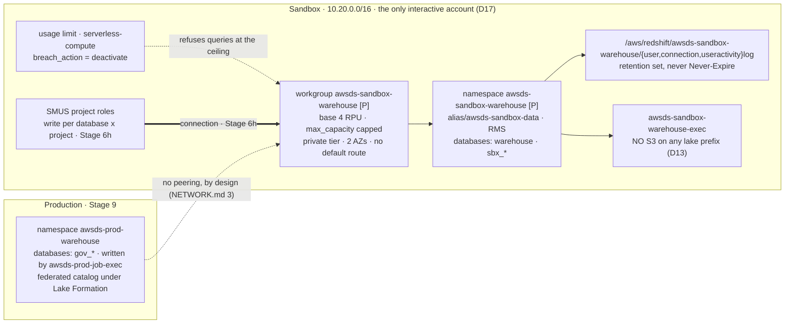

# Stage 5b — Redshift Serverless: the warehouse beside the lake

| | |
|---|---|
| **Status** | not started. Written 2026-09-19 from the vendor documentation and one priced reading. **Step 0.0 is done (2026-09-20): the requirement is in [`objectives.md`](../objectives.md)** — Redshift Serverless is a **second possible engine**, the Glue/Iceberg lake stays the warehouse of record, the two classes of database are named with their writers, and the estate is **one Redshift environment from a data scientist's point of view, with where its databases live an implementation matter**. That last clause is what makes [D40](../decisions/D40-redshift-warehouse.md)'s two-account split admissible rather than a deviation. **The read side was answered the same day**: the controls do not change — Redshift is *one more execution environment*, not a new class of reader, so a governed database is read by whoever the grant register already admits, through Lake Formation. That narrows `INT-24` to the mechanisms **Lake Formation governs** — two of them, not one (0.0's second table; the first draft excluded one of the two wrongly) — and it puts a **known collision** on step 3.1's deny, which Stage 9 9.5a resolves. **Nothing is measured**: every number below is either a Price List reading (dated) or a documentation claim, and the stage's own passes are what turn the second kind into the first. Its central choice is settled in advance by **[D40](../decisions/D40-redshift-warehouse.md)** — a warehouse built by hand at **4 base RPUs**, two classes of database on two accounts, and the `RedshiftServerless` blueprint still disabled. **This stage builds the Sandbox warehouse only.** The governed class has no content until [Stage 9](stage-09-deployment-targets.md), so `production/warehouse/` is *specified* here (§7) and *applied* there — the rule that an act with no owning pass does not happen (Lesson 5), applied to a namespace nobody would write to for four stages |
| **Prerequisites** | **Stage 5a** — the lake exists, `sandbox/data/` holds this account's `DataLakeSettings` and the account data CMK `alias/awsds-sandbox-data`, which is the namespace's encryption key (`docs/GOVERNANCE.md` §Encryption). **Stage 3** — `sandbox/foundation/`'s VPC, whose **private** tier is where the workgroup lands: two subnets in two AZs, which is what pass 0's first reading is about. **6c** — no default route in that tier, and no NAT anywhere (D38), so nothing here reaches the internet. Nothing waits on a vend or a quota increase this stage knows of; 0.4 is where that is checked rather than assumed |
| **Consumes** | [D9](../decisions/D09-az-count.md), [D11](../decisions/D11-lab-lifecycle.md), [D12](../decisions/D12-budget-ceiling.md), [D13](../decisions/D13-lake-formation-enforcement.md), [D17](../decisions/D17-interactive-vs-runtime.md), [D22](../decisions/D22-data-governance-account.md), [D31](../decisions/D31-approver-read.md), [D35](../decisions/D35-sandbox-cardinality.md), [D38](../decisions/D38-single-egress-hub.md), [D40](../decisions/D40-redshift-warehouse.md) |
| **Proves** | — (no `INT-nn` row: every object this stage builds lives in one account). The cross-account row the warehouse eventually needs is **INT-24**, and it belongs to [Stage 9](stage-09-deployment-targets.md) |

*Read with [`docs/plan/conventions.md`](../conventions.md) (naming, layout, `[P]`/`[D]`/`[E]`, IAM rules),
[`docs/GOVERNANCE.md`](../../GOVERNANCE.md) — the warehouse is a fourth store and the file's §Catalogs
paragraph about it is rewritten by this stage — and
[`docs/plan/decisions/D40-redshift-warehouse.md`](../decisions/D40-redshift-warehouse.md), which settles
what is being built and what is not. The documentation rows are the 2026-09-19 entries in
[`docs/REFERENCES.md`](../../REFERENCES.md).*

---

**Objective:** one Redshift Serverless warehouse in `Sandbox`, at the documented capacity floor, with its
cost ceiling and its audit trail applied in the same act that creates it — and the **access model for both
classes of database written down before either class has a member.**

## Why the cost guards are part of the build

Every other store in this estate is free or nearly free at rest. This one is not the same shape: at
**USD 0.36/RPU-hour**, four RPUs bill **USD 1.44 for every hour a query runs**, which makes the warehouse
the most expensive object per unit of time in the estate — 277× the WireGuard host's hourly rate. It bills
nothing while no query runs, and D40 names the three documented ways that stops being true (an open
transaction, a connection pool's keep-alive, a cancelled query).

So the usual split — build at stage N, observe at Stage 12 — does not apply. A budget notification arrives
after the money is spent, and **D12's budget notifies nobody** (its own open defect, re-opened by
[6e](stage-06e-claude-code-bedrock.md) 8.3). The guard that works is the one the service enforces itself: a
**usage limit** whose `breach_action` is `deactivate`. It lands in pass 1, with the workgroup, in the same
apply.

## What this stage builds, and in which accounts

| Where | What | Layer |
|---|---|---|
| `sandbox/warehouse/` (new, rank 53) | the namespace `awsds-sandbox-warehouse` under `alias/awsds-sandbox-data`, its Secrets-Manager-managed admin credential, its three audit log groups **pre-created with a retention period**, the namespace IAM role `awsds-sandbox-warehouse-exec`, the workgroup at `base_capacity = 4` in the private tier, its security group, the `serverless-compute` usage limit, and the `ComputeCapacity` alarm | `[P]` |
| `identity/sso/` (amended) | what a persona may and may not do to the warehouse: the `redshift-serverless:Get*`/`List*` read side, and **no** `UpdateWorkgroup`, **no** `DeleteUsageLimit` | `[P]` |
| `identity/org-policies/` (amended) | `DenyRedshiftProvisionedClusters` on the organization root, and `DenyRedshiftCostGuardTampering` — the two statements decision 3 settles | `[P]` |
| `scripts/` | `backend.py`/`layers.py` rows for `warehouse` at rank **53** (`[P]`, outside every `make up`/`down` path) | — |
| `aws/warehouse.py` (new) | the instrument, `WH-1`..`WH-8` | — |
| `production/warehouse/` | **specified here (§7), applied at [Stage 9](stage-09-deployment-targets.md)** | `[P]` |

**Contracts this stage fixes, so that a rename fails in a check rather than in Stage 6h or 9:** the
namespace and workgroup **`awsds-sandbox-warehouse`** (the same name on two object types — Redshift allows
it, and the **audit log group path is derived from the namespace name**, so a namespace rename moves three
log groups), the namespace role **`awsds-sandbox-warehouse-exec`**, the first database **`warehouse`**, and
the two database-name prefixes **`sbx_`** and **`gov_`** that make a database's class readable in a `GRANT`
and in `SVV_REDSHIFT_DATABASES`.



## Step numbers are identifiers, not an order

Two of these numbers are cited from other files: **step 2** from
[Stage 6h](stage-06h-redshift-connection.md) (the grant grain it instantiates) and **step 7** from
[Stage 9](stage-09-deployment-targets.md) (the Production specification it applies). The sequence to work
in is the passes below:

| Pass | # | What | Slice · layer | Applied as |
|---|---|---|---|---|
| **0** | 0 | the requirement written into `objectives.md` by the user (0.0), then the readings: the AZ count, the price re-read, the SCP reach, the quotas — **and the one that can stop the stage** (0.1) | readings, no build | the user; `awsds-infra-sandbox-1` |
| **1** | 1, 3 | the warehouse and its guards in one apply; then the policy statements | `sandbox/warehouse/` `[P]`, then `identity/org-policies/` | `awsds-infra-sandbox-1`, then `awsds-infra-identity` |
| **2** | 2, 4 | the access model written and its negatives read back — no database exists yet, so this pass is code and readings | `identity/sso/` `[P]` + readings | `awsds-infra-identity` |
| **3** | 5, 6 | the cost guards exercised and the audit trail confirmed to carry something | sessions and readings | `awsds-infra-sandbox-1` |

Pass 1 is one apply and not two: a workgroup that exists for even one plan cycle without its usage limit is
a workgroup with no ceiling, and the window is exactly when a mistake is most likely. **Pass 0 can end the
stage** — 0.1's answer decides whether the estate's two-AZ plumbing is enough.

---

## To execute

### 0. Preflight — the requirement in writing, then the readings the design rests on

- **0.0 — Done 2026-09-20: the requirement is in [`objectives.md`](../objectives.md).** It was **a revision,
  not only an addition**: that file already named a warehouse — *"Use AWS Glue Data Catalog with data stored
  on S3 buckets, using ICEBERG format, as Data Warehouse"* — and a Redshift warehouse beside that sentence is
  either a second engine or a replacement for it, two readings that write the same in a bullet and produce
  different estates. **Claude drafted the revision at the user's request** (2026-09-20), which is a departure
  from [Stage 16](stage-16-sandbox-lake.md) step 0.1's shape and from the rule that the brief is the user's
  own words: a paraphrase written by the implementer becomes the specification (Lesson 57). It is recorded
  here and in [`history.md`](../history.md) for that reason, and the user's own sentences from the chat — the
  two classes, their writers, the per-database × project grain, the minimum capacity — are transcribed rather
  than restated.

  | What it settled | What follows |
  |---|---|
  | **Redshift is a second possible engine; the Glue/Iceberg lake stays the warehouse of record** | D13, D22 and the producer path **extend** rather than re-open, which is what [D40](../decisions/D40-redshift-warehouse.md) assumed and is no longer assuming |
  | **A query engine is a choice per workload, not per estate** — Athena stays the default | the warehouse needs a demander per workload, and a `gov_*` database with no query that Athena served badly is the revision trigger D40 already carries |
  | **The governance model does not fork**: a governed Redshift database is governed by Lake Formation like a lake table | the federated-catalog registration at [Stage 9](stage-09-deployment-targets.md) 9.5 is a *requirement*, not a compensation Claude chose |
  | **One Redshift environment from a data scientist's point of view, and where its databases live is an implementation matter** | the two-account split is **admissible** rather than a deviation — the sentence that makes D40's hardest choice legal. What it also imposes: the portal must present one thing, so 6h's connection naming and any second connection are a user-facing question, not just a wiring one |
  | **A governed database is never written from the sandbox** | stated as a requirement, so the absence of a Sandbox writer on `gov_*` is a control with a line behind it rather than a consequence of the account split |

  **The read side was answered in the same sitting** (the user, 2026-09-20): *the controls stay the same, it is
  just one more execution environment.* So there is no new class of reader and no second governance model, and
  three things this plan had left as options stop being options:

  | Consequence | What it replaces |
  |---|---|
  | **`INT-24` is narrowed to the mechanisms Lake Formation governs** — and **two** qualify, not one: a federated catalog read by Athena, or a Lake Formation-**managed datashare** (LF enforces database, table, column and row permissions on it, and tags may be used). Only shape (iii), a cross-account connection, is out: it makes a Redshift `GRANT` the control over governed data | **corrected 2026-09-20, hours after the first draft**, which had excluded the datashare on the assumption that data sharing is always Redshift's own permission system. It is not. The exclusion that survives rests on two independent grounds — the fork, and `sqlworkbench:*` on `*`, which `check-iam-wildcards.py` refuses |
  | **A governed database gets no project connection.** The SMUS Redshift connection of [6h](stage-06h-redshift-connection.md) is a **sandbox-class** mechanism; its three layers, the `AmazonDataZoneProject` tag included, never apply to `gov_*` | the temptation to reuse 6h's wiring in Production "because it already works" — which would put a Redshift `GRANT` in the path of governed data beside a Lake Formation grant, two systems answering one question |
  | **The engine is subject to the controls, not the reverse.** D13 binds the namespace role exactly as it binds a Glue job's role (1.5, 9.2); the persona still gets no `GetCredentials` (2.3) | the reading that a new engine deserves a new grant shape |

  **What the answer does not do** is make the sandbox class governed. `sbx_*` remains outside Lake Formation
  by design, on the sandbox lake's argument (Stage 16) — the per database × project grant is, in the user's
  words, *"the only new rule here"*, and it applies there and nowhere else.

**Action:** answer, from the API and the Price List rather than from this file, the four things the design
rests on. **Why:** every number in this stage is a documentation claim today, and a stage written on
documentation is a stage whose first apply is its first measurement (Lesson 54 — `validate`, `render` and
`run` are three verdicts). **Explanation:** all four are read-only.

- **0.1 — [Claude] How many subnets and Availability Zones a workgroup needs, and whether this estate has
  them.** The two sources disagree, and the disagreement is load-bearing:

  | Source | Says | Read |
  |---|---|---|
  | AWS, *Considerations when using Amazon Redshift Serverless* | *"Two subnets (without EVR) – You must have at least two subnets, and they must span across two Availability Zones"*; three only **with** Enhanced VPC Routing | 2026-09-19 |
  | The Terraform provider's `aws_redshiftserverless_workgroup` page | `subnet_ids` *"When set, must contain at least three subnets spanning three Availability Zones"* | 2026-09-19 |
  | The provider's **code** | `subnet_ids` is a plain `TypeSet`, `Optional`, `Computed` — **no client-side validator at all** | 2026-09-19, `internal/service/redshiftserverless/workgroup.go` |

  So the provider page is prose that validates nothing, and the service is the only authority. **This
  estate has two AZs by decision** (D9: two AZs of free subnet plumbing, one AZ for metered endpoints) and
  the `vpc` module builds exactly six subnets, 3 tiers × 2 AZs (`docs/NETWORK.md` §1). The design is
  therefore **two private subnets, `enhanced_vpc_routing = false`**, and the reading that settles it is the
  apply itself. **The fallback, if the service refuses two:** a third AZ's subnet trio is *free* — subnets,
  route tables and their associations cost nothing — but it is a change to the `vpc` module, to
  `docs/NETWORK.md` §1's address table and to `check-network-doc.py`'s arithmetic, in **five** VPCs or in
  one with a flag. Decide which before applying, not after the error (decision 1).
  > **`subnet_ids` is `Optional` *and* `Computed`**, which means omitting it plans as unknown and lets the
  > service choose — and the service would choose the default VPC, which no account here has. Always set
  > it. Lesson 27's shape: the plan is silent about the value the provider owns.
- **0.2 — [Claude] Re-read the price** from the Price List bulk API, the same door `docs/PRICING.md` §0
  documents, and compare with the row this stage was written against:
  ```bash
  curl -s 'https://pricing.us-east-1.amazonaws.com/offers/v1.0/aws/AmazonRedshift/current/us-west-2/index.json' \
    | jq -r '.products | to_entries[] | select(.value.productFamily=="Serverless" and (.value.attributes.term|not)) | .key'
  ```
  then the `terms.OnDemand` entry for that SKU. **Expected: `0.36` USD per `RPU-Hr`**, offer file published
  `2026-09-11`. A different number is not a blocker; it is a `docs/PRICING.md` edit and a re-read of D40's
  ceiling arithmetic before pass 1 (Lesson 6 — prices are measured, and Lesson 7 — a rejected-on-cost
  option goes stale in the direction that flatters the rejection).
- **0.3 — [Claude] Read what the existing policy set already does to Redshift, before writing a statement.**
  `redshift-serverless:` appears in **no** SCP today: `DenyUserCompute` in
  `awsds-org-scp-ou-data.json` names EC2, SageMaker, Glue, Athena, Lambda and ECS and **not** Redshift, and
  the `Interactive` OU's four statements are about notebooks, Athena Spark and Bedrock. So a workgroup in
  **Data Governance** is not refused by policy today — only by the absence of a VPC in that account
  (D22, D26's INT-13 note). Record that as the reason the Data Governance shape was closed by
  *architecture* rather than by *control*, which is what decision 3 then fixes.
  `terraform-live/identity/org-policies/POLICIES.md` is where the reading goes.
- **0.4 — [Claude] Read the account's Redshift Serverless quotas** —
  `aws service-quotas list-service-quotas --service-code redshift-serverless` — and record the three that
  matter: namespaces per account, workgroups per account, and **base capacity**. A quota this stage cannot
  raise by itself is a blocking input and belongs in the Status row, not in a mid-pass surprise (Lesson 19).

### 1. `sandbox/warehouse/` — the warehouse and its ceiling, layer `[P]`, a single apply

**Action:** the namespace, the workgroup, the usage limit, the alarm and the log groups, created together.
**Why:** the namespace holds the data and the workgroup holds the compute, and they are separable objects
with separate lifecycles — but the *ceiling* is not separable from the compute (see the pass table).
**Explanation:** `[P]` because a workgroup serving no query bills nothing, so there is nothing for
`make down` to save and a namespace holds state that a teardown would destroy (§5.1 rule 2 — no state lives
only inside an `[E]` resource).

- **1.1 — [Claude] Write the namespace** `awsds-sandbox-warehouse`:
  - `kms_key_id` = **`alias/awsds-sandbox-data`**'s ARN, read from `sandbox/data/`'s remote state, never
    pasted. One data CMK per account (`docs/GOVERNANCE.md` §Encryption) — the warehouse is a data store in
    Sandbox, so it takes Sandbox's data key, exactly as `awsds-sandbox-lake` does.
  - `manage_admin_password = true` and `admin_password_secret_kms_key_id` = the same key. **Never
    `admin_user_password`**: that would put a password in the state file and in a plan's output. The
    resource then exports `admin_password_secret_arn`, which is what a connection consumes at
    [Stage 6h](stage-06h-redshift-connection.md). Redshift manages the rotation.
  - `admin_username` — a name, not a person (the identity seam: nothing whose count grows with headcount is
    in Terraform). `db_name = "warehouse"`, because **the namespace is born with a database whether one is
    wanted or not** — the default is `dev` — and a database nobody named is a database nobody revoked
    `PUBLIC` on (1.6).
  - `log_exports = ["userlog", "connectionlog", "useractivitylog"]` — the Stage 11 feed, switched on at
    creation rather than added later, since a log that starts late has a silent gap.
  - `iam_roles` = \[the 1.5 role\], `default_iam_role_arn` = the same.
- **1.2 — [Claude] Pre-create the three log groups**, with a retention period, **before** the namespace can
  create them. AWS: a log group *"with the specified name doesn't exist… Amazon Redshift Serverless creates
  a new log group… \[which\] uses the default log-retention period of **Never Expire**"*, and *"A log group
  with the specified name exists. Redshift exports log data using the existing log group."* So the
  documented fix is to own the group first. The names are derived, not chosen:
  `/aws/redshift/awsds-sandbox-warehouse/userlog`, `…/connectionlog`, `…/useractivitylog`.
  **This estate already carries one never-expiring group as a dated exception** (`AWS_STATE.md` `EXC-10`,
  the SMUS apps), and the whole point of doing it here is not to acquire a second. Retention: **30 days**
  in Sandbox (decision 4).
- **1.3 — [Claude] Write the workgroup** `awsds-sandbox-warehouse`:
  - `base_capacity = 4`. **`max_capacity`** set to the ceiling decision 2 picks — the documented pair
    *"**Max capacity** and **Max RPU-hours** … are the controls to limit the maximum RPUs … Amazon Redshift
    Serverless **always honors and enforces these settings**, regardless of the price-performance target"*.
  - `price_performance_target` set **explicitly**, because the default is `Balanced` and AWS *"do not
    recommend using this feature for 4 Base RPU"* — a default that contradicts its own page for the only
    capacity here (decision 2).
  - `subnet_ids` = the **two private** subnets of `sandbox/foundation/`, read from remote state and anchored
    on AZ `zone_id` (the standing rule); `enhanced_vpc_routing = false` (0.1); `publicly_accessible = false`.
  - `security_group_ids` = 1.4's group.
  - `config_parameter`: `require_ssl = true`, `enable_user_activity_logging = true` (without it
    `useractivitylog` carries no SQL text, which is the half Stage 11 wants), `max_query_execution_time` set
    — the per-query ceiling, valid `0`–`86399`, the counterpart of the Athena scan limit
    ([Stage 9](stage-09-deployment-targets.md) 1.2 sets that one). `search_path` left alone.
- **1.4 — [Claude] Write the security group** `awsds-sandbox-warehouse`: ingress `5439/tcp` from the
  **project app ENIs' security group** and from nothing else — not a CIDR, and **not** the whole private
  tier. Egress: nothing. A workgroup in a tier with no default route and no NAT has no internet either way
  (D38), so the group is about which *in-VPC* client may open a connection.
  **This is a network fact**, so `docs/NETWORK.md` §2, §2.1 and §9 are edited in the same sitting and
  `./scripts/check-network-doc.py` is run (the mechanical half).
- **1.5 — [Claude] Write the namespace role `awsds-sandbox-warehouse-exec`**, trust
  `redshift.amazonaws.com` and `redshift-serverless.amazonaws.com` only. Permissions: **empty on the lake**.
  This role is what `COPY`, `UNLOAD` and the auto-mounted `awsdatacatalog` database run as, which makes it
  precisely the principal [D13](../decisions/D13-lake-formation-enforcement.md) is about: **no `s3:*` on any
  of the five lake buckets, and no `lakeformation:GetDataAccess` until something grants it**. What it may
  hold is decision 5's question, and the recommendation there is *nothing in this stage* — a role with no
  policy is a role whose first grant is a deliberate act.
- **1.6 — [Claude] Write the first-database hygiene as code where it can be, and as a step where it cannot.**
  Redshift creates `warehouse`'s `public` schema with `USAGE` and `CREATE` granted to the group `PUBLIC`,
  so **every database user can create objects there** until it is revoked. There is no Terraform resource
  for a `REVOKE`; it is SQL, and it runs once, from the admin credential, at 1.8. Write the statement into
  the slice's README beside the resources rather than leaving it to memory (Lesson 5 — an intention is not a
  control; and 61 — a procedure that depends on a file it did not create runs only for its author).
- **1.7 — [Claude] Write the machinery rows**: `backend.py` and `layers.py` gain `warehouse` at rank **53**
  — free (52 `bedrock`, 55 `buildbox`), `[P]`, and outside every `make up`/`make down` path. The rank
  records the dependency it has: above `data` (45), because the CMK is read from there, and above
  `foundation` (20) for the subnets. `production/warehouse/` shares the rank when Stage 9 writes it.
- **1.8 — [Claude⚡] Apply as `awsds-infra-sandbox-1`**, then, in the same sitting:
  - re-plan → **`No changes`**;
  - read the workgroup back — `base_capacity`, `max_capacity`, `publicly_accessible`, the two subnets and
    their AZs, `enhanced_vpc_routing`, the four config parameters (`WH-1`, `WH-2`);
  - read the usage limit back with its `breach_action` (`WH-3`);
  - confirm the three log groups carry **a retention period and not `Never Expire`** (`WH-4`);
  - confirm `admin_password_secret_arn` exists and that **no password appears anywhere in the state**
    (`WH-5` — the `grep` is part of the check, not a matter of trust);
  - run the 1.6 `REVOKE` from the admin credential and record it;
  - and **measure the first bill this stage can produce**: nothing. `./aws/warehouse.py` prints the hourly
    burn as **0.00 while no query runs**, which is the claim D40 rests on and the one thing pass 3 exercises.

### 2. The access model — the classes of database, and the grain of a grant

**Action:** write down, before either class has a member, what makes a database governed or sandbox and how
a project gets write on one. **Why:** the class is not a property AWS knows about. Redshift has databases,
schemas, users, groups, roles and `GRANT`; it has no notion of *governed*. So the class is a convention
this file defines and an instrument reads, or it is nothing (Lesson 5). **Explanation:** the requirement is
*"access granted per database × project"*, and that grain exists in **two** systems at once — which is
Lesson 28's intersection in a third permission layer.

- **2.1 — [Claude] Fix the class convention**: a database's class is its **name prefix**, `gov_` or `sbx_`,
  plus the account it is in. The prefix is chosen because it is the one attribute a `GRANT` statement, a
  `SVV_REDSHIFT_DATABASES` row and a human reading a connection string can all see. Two consequences to
  accept out loud:
  - **the prefix is a selector the moment a rule is written over it** (Lesson 29), so a database created
    with the wrong prefix inherits the wrong rule and nothing refuses the `CREATE DATABASE`;
  - the class is therefore **checked, not enforced**: `WH-6` fails on any database whose name carries
    neither prefix, and on any `gov_` database in Sandbox or `sbx_` database in Production.
- **2.2 — [Claude] Write the two-layer grain, because one layer does not reach.** A SageMaker project gets
  write on one sandbox database through **both** of these, and neither is sufficient:

  | Layer | What it admits | Where it is written | Grain |
  |---|---|---|---|
  | The **workgroup tag** | *which project may use this warehouse at all* — AWS: the admin adds `AmazonDataZoneProject={{projectID}}` *"to the Amazon Redshift cluster or workgroup **and its namespace**"* | `sandbox/warehouse/` (Terraform), one tag per admitted project | per **workgroup** |
  | The **Redshift `GRANT`** | *which database, schema and table the project's database user may read or write* | SQL, run at [Stage 6h](stage-06h-redshift-connection.md) per database × project | per **database** |

  So the requirement's grain is the second layer, and the first is a gate in front of it.
  **Two things about the tag have to be said now:**
  - AWS offers a wide form — `for-use-with-all-datazone-projects=true`, *"to allow all Amazon SageMaker
    Unified Studio projects in this account to access it"*. **It is refused here**, and `WH-7` fails if it
    appears on either object: it is the same shape as an empty deny-list permitting everything, and it turns
    "per project" into "per account" with one tag.
  - The tag is on **two objects**, workgroup *and* namespace, which is Lesson 14's shape — a value that must
    appear in N places by hand will be missing from one. Both are in the same Terraform resource file, from
    one `locals` map keyed by project id, so the two can only differ by an edit that fails the plan.
- **2.3 — [Claude] Write the persona side into `identity/sso/`, and write the *absences* as the design.**
  `DataScientistAccess` gets the read side — `redshift-serverless:GetWorkgroup`, `GetNamespace`,
  `ListWorkgroups`, `ListNamespaces`, `ListTagsForResource` — scoped to this account's workgroup ARN, and
  **`redshift-data:` nothing yet** (the query path is the project's connection, not the persona's;
  [Stage 6h](stage-06h-redshift-connection.md) decides whether a persona ever queries directly).
  It gets **no** `UpdateWorkgroup`, **no** `CreateWorkgroup`, **no** `DeleteUsageLimit`, **no**
  `UpdateUsageLimit`, **no** `CreateNamespace` and **no** `redshift-serverless:GetCredentials`. The last one
  is the load-bearing absence: `GetCredentials` mints a database session, so a persona holding it reaches
  the warehouse with no connection, no tag and no project — around both layers of 2.2 at once.
- **2.4 — [Claude] Re-state D13 against the new principal, and read it rather than assert it.** Three
  readings, all read-only: `awsds-sandbox-warehouse-exec`'s attached and inline policies (expected: none
  touching a lake bucket); whether the namespace's `awsdatacatalog` database is mounted and what it lists
  (expected: nothing, because Lake Formation has granted this role nothing); and the documented direction of
  that mount — *"Queries against the `awsdatacatalog` database can only be read-only"* — so the warehouse
  cannot become a second producer into the lake. Record all three, including the ones that come out fine.

### 3. The policy statements — what the organization refuses

**Action:** two statements, settled by decision 3, applied through Recipe A after the battery.
**Why:** everything above is a property of *this* warehouse. A second one, created by hand in a console in
any account, would have none of it — no base-capacity floor, no usage limit, no tag discipline.
**Explanation:** the shape follows `DenyGuardDutyTampering` (a named principal may change the control and
nobody else) and `DenyProvisionedMwaa` ([Stage 10](stage-10-orchestration-promotion.md) step 4 — the
always-on variant of a serverless service is refused outright).

- **3.1 — [Claude] `DenyRedshiftProvisionedClusters`**, organization root: deny `redshift:CreateCluster`,
  `redshift:RestoreFromClusterSnapshot` and `redshift:RestoreTableFromClusterSnapshot`. A provisioned
  cluster is the always-on shape D12 rules out — the same argument that refused always-on GitLab and
  provisioned MWAA — and nothing in `objectives.md` asks for one. **This is the cheap half**: a capability
  nobody has asked for is cheaper to refuse than to fence ([Stage 9](stage-09-deployment-targets.md) 3.7's
  wording, reused).
  > **It has one known collision, found 2026-09-20, and it is in a stage four files away.** A Lake Formation
  > **federated catalog** with *"Access this catalog from Iceberg compatible engines"* enabled makes **AWS Glue
  > create a managed Amazon Redshift cluster** — AWS's own words — which is the path
  > [Stage 9](stage-09-deployment-targets.md) 9.7 may use to let a Sandbox project read a governed table. So
  > this deny is either what breaks that path or what that path breaks, and the collision is the same shape as
  > Stage 15 decision 1's (`DenyGuardDutyTampering` against Audit's own detector). **Nothing here changes**:
  > the deny is still the right default, and Stage 9 9.5a owns the resolution with a reading behind it — its
  > recommendation is the mechanism that needs no cluster. Written here so the deny is not attached in
  > ignorance of what it will refuse (Lesson 34 — a deferred obligation recorded only at the deferring end is a
  > promise the receiving stage never gets).
- **3.2 — [Claude] `DenyRedshiftCostGuardTampering`**: deny `redshift-serverless:DeleteUsageLimit`,
  `UpdateUsageLimit` and `UpdateWorkgroup` except for `InfrastructureAccess`'s reserved-SSO role and the
  account's Terraform principal. **What this cannot do, and the plan must not pretend otherwise:** there is
  **no IAM condition key for `baseCapacity`**, so the policy cannot say *"never above 4"*. The ceiling is
  the workgroup's own `max_capacity` plus the usage limit, and the policy's job is only to stop those two
  being edited away. Lesson 18 applies in full — the statement does not constrain the identity that authors
  it, and what watches that identity is CloudTrail.
- **3.3 — [Claude] Run the battery before attaching** (`./aws/probes/scp-battery.py`, the runbook is
  [`scp-battery.md`](../runbooks/scp-battery.md)): both statements get `probes.py` entries, exercised as
  `awsds-policy-canary` where a call without a deny would act. `redshift:CreateCluster` in the canary is the
  clean case — it is refused before it creates anything only if the deny is real, so the probe needs a
  negative control (Lesson 26: an "already exists" error proves nothing on its own).
- **3.4 — [Claude⚡] Apply as `awsds-infra-identity`**, then update
  `terraform-live/identity/org-policies/POLICIES.md` with one row per new `Sid` **in the same sitting**, and
  run `./scripts/check-index.py` for the mechanical half. Every new statement is *attached* and not yet
  *exercised* outside the canary; say so in the row rather than letting a later stage discover it
  (Lesson 20).

### 4. What no control covers, written down as a residual

**Action:** one short list, in this file and in `docs/AWS_STATE.md`, of what a person with the right role
can still do. **Why:** an unstated residual becomes a finding somebody reports as a gap in Stage 11.
**Explanation:** each line names the thing that would close it, so the list is a backlog rather than a
shrug.

- **A base capacity above 4 is not preventable, only visible.** No condition key exists; the
  `ComputeCapacity` alarm (6.2) is the detection, and the ratchet means the capacity does not come back down
  on its own.
- **A second namespace in another account is refused by nothing** until 3.1/3.2 exist, and after them only
  the *guard tampering* is refused — `CreateWorkgroup` itself is not (it would deny Stage 9's own apply).
  `WH-8` enumerates namespaces and workgroups in every profiled account, so a new one is a diff.
- **A database user's password, once issued, is a credential this estate does not rotate.** That is
  [Stage 6h](stage-06h-redshift-connection.md)'s decision, not this stage's, and it is named here so the two
  are read together.
- **`useractivitylog` carries SQL text**, which means it carries data values in literals. It is a DLP feed
  and a DLP exposure at the same time; the retention period (decision 4) is the only thing bounding it until
  [Stage 11](stage-11-dlp.md) 5.1 decides where the export goes.

### 5. Prove the ceiling before trusting it

**Action:** make the usage limit fire, once, deliberately, on a warehouse holding nothing.
**Why:** `breach_action = deactivate` is a documented behaviour with no measurement behind it anywhere in
this repository, and a control whose failure mode is *"queries keep running and the bill keeps growing"* is
the wrong one to discover in production (Lesson 5, and Lesson 22's inverse — this one *can* be attempted).
**Explanation:** it costs a known amount: a temporary limit low enough to breach, a trivial query loop, and
the limit restored in the same sitting.

- **5.1 — [Claude⚡ then user] Set a throwaway `daily` limit at the smallest amount the API accepts**, on
  the same workgroup, `breach_action = deactivate`. Then run queries until it breaches.
  **Read three things:** what the client sees when the limit is reached (the wording, never the exit code —
  the standing rule since 1c); what `UsageLimitConsumed`/`UsageLimitAvailable` report in CloudWatch; and
  **whether the workgroup is still unusable after the period rolls over**, which is the question the
  documentation does not answer and the one that matters if this ever fires by accident.
- **5.2 — [Claude⚡] Delete the throwaway limit and confirm the real one is intact**, re-plan `No changes`.
  A test limit left behind is a second ceiling nobody reads.
- **5.3 — [user] Record the measured cost of pass 3** in the log, in USD, against the 1.44/hour prediction.
  This is the stage's only real spend and the first number that turns D40's arithmetic into a measurement.

### 6. The audit trail, and the alarm on the ratchet

**Action:** confirm the three log groups receive events, and put an alarm on the one metric that reveals the
irreversible thing. **Why:** a log switched on at 1.1 that carries nothing is a control that reads as
working (Lesson 13 — a verification that returns empty on both success and failure is not a verification).
**Explanation:** the alarm goes to the Stage 1b SNS pattern, the same chain every other alarm here uses.

- **6.1 — [Claude] After pass 3's queries, read all three groups**: `connectionlog` has the session,
  `useractivitylog` has the SQL text (which is what `enable_user_activity_logging` bought), `userlog` has the
  user changes. Name which of the three was **empty** and why — the queries ran as one user and created
  none, so `userlog` being empty is the correct state and not a defect.
- **6.2 — [Claude] Write the `ComputeCapacity` alarm**: `AWS/Redshift-Serverless`, dimension `Workgroup`,
  threshold **> 4**, in `sandbox/warehouse/`. The metric is *"Average number of compute units allocated
  during the past 30 minutes"*, so the alarm is the only notice that the ratchet has moved — and since the
  warehouse does not return to 4 on its own, the alarm's job is to say *a manual `UpdateWorkgroup` is now
  owed*, not *this will pass*.
- **6.3 — [Claude] Add the row to `docs/PRICING.md`** (done in advance: §5's Redshift rows, read
  2026-09-19) and the line to [`docs/plan/cost-model.md`](../cost-model.md): the warehouse is **0.00/hour at
  rest and 1.44/query-hour**, which is a shape neither of that file's two columns has carried before.
- **6.4 — [Claude] Bring the documents to the estate, in this sitting**: `docs/GOVERNANCE.md` (§Catalogs'
  *"No warehouse is built here"* is now false, and the warehouse is a fourth store in §Persistence),
  `docs/SMUS.md` (the `RedshiftServerless` row's trigger names D40), `docs/NETWORK.md` (1.4),
  `docs/AWS_STATE.md` (§4's residuals, and the log-group retention as the thing that keeps `EXC-10` at one),
  `terraform-live/README.md`, `docs/plan/conventions.md` §6's tree, and `CLAUDE.md`'s Claude LOG.

### 7. `production/warehouse/` — specified here, applied at Stage 9

**Action:** write the Production namespace's shape now, while the Sandbox one is fresh, and hand it to
[Stage 9](stage-09-deployment-targets.md) rather than building it. **Why:** the two namespaces differ in
four ways and are identical in everything else, so the difference is worth stating in one place — and
building a namespace four stages before anything writes to it is the act with no owning pass that Lesson 5
refuses. **Explanation:** Stage 9 already owns the writer (`awsds-prod-job-exec`), the account's LF settings
and the deploy credential, so the governed class costs it one slice rather than a design.

| | Sandbox (this stage) | Production (Stage 9) |
|---|---|---|
| Slice | `sandbox/warehouse/` | `production/warehouse/`, same rank 53 |
| VPC | Sandbox's private tier, 2 AZs | **`VPC-Workloads`**' private tier — the two subnets in two AZs 6c built, the estate's one D9 exception, already there for MWAA Serverless |
| Databases | `sbx_*` | `gov_*` |
| Written by | SMUS project roles, per database × project | **`awsds-prod-job-exec` alone** — no project, no connection, no tag |
| Read from Sandbox | directly, same VPC | **not over the network**: Sandbox↔`VPC-Workloads` has no peering, and its absence is the control (`docs/NETWORK.md` §3) |
| Under Lake Formation | no | **yes** — the namespace registered to the Glue Data Catalog as a **federated catalog** (`aws_glue_catalog`'s `federated_catalog` block), which is how a governed schema gets the same permission layer as the lake |
| Encryption | `alias/awsds-sandbox-data` | `alias/awsds-prod-data`, created by Stage 9 1.1 |

- **7.1 — [Claude] Write the specification into [Stage 9](stage-09-deployment-targets.md)** as its own step
  and its own pass, not as a sentence in this file: a deferred obligation recorded only at the deferring end
  is a promise the receiving stage never gets (Lesson 34 — and this plan has already paid for it once, on
  the lake's registration role).
- **7.2 — [Claude] Open `INT-24`** in [`integrations.md`](../integrations.md) for the one thing that is
  genuinely cross-account: a Sandbox project reading a `gov_` table that lives in Production. The fallback
  and the mechanism go in the row; the proof is Stage 9's.

---

## Deliverables

Each is written so its output differs between working and broken (Lesson 13). **The mechanical half is
`./aws/warehouse.py`** ([`aws/INDEX.md`](../../../aws/INDEX.md)), written before pass 1 so it can report the
absences as expected readings:

| ID | What it reads |
|---|---|
| `WH-1` | the workgroup: `base_capacity = 4`, `max_capacity` at the decided ceiling, `publicly_accessible` false, `enhanced_vpc_routing` false, the subnets and their AZ `zone_id`s |
| `WH-2` | the four config parameters — `require_ssl`, `enable_user_activity_logging`, `max_query_execution_time`, and the price-performance target |
| `WH-3` | a `serverless-compute` usage limit exists on the workgroup, with `breach_action = deactivate` — **and no second, looser one beside it** |
| `WH-4` | all three log groups exist with a retention period that is not `Never Expire` |
| `WH-5` | `admin_password_secret_arn` is set, `manage_admin_password` is true, and no password string appears in the slice's state |
| `WH-6` | every database carries a class prefix, and no class is in the wrong account |
| `WH-7` | the project tags on **both** workgroup and namespace match the authored map — and `for-use-with-all-datazone-projects` appears on neither |
| `WH-8` | the namespaces and workgroups in every profiled account, so a hand-made one is a diff |

The behavioural proofs are the stage's own (Lesson 20):

- **The ceiling refuses** (5.1): a breached usage limit stops queries, with its wording recorded, and the
  post-period behaviour read.
- **Nothing at rest** (1.8, 5.3): the burn is 0.00 with no query running, and pass 3's measured spend is
  written against the 1.44/hour prediction.
- **D13 holds against the new principal** (2.4): the namespace role reaches no lake prefix, and
  `awsdatacatalog` lists nothing.
- **The audit trail carries something** (6.1), with the empty group named and explained.

## Validation

1. `./aws/warehouse.py` — all `WH-*` pass; diff two runs across the stage (only timestamps may change).
2. `./aws/datalake.py` — `DL-5` green after the sitting, `DL-6` unchanged: this stage touches no
   `DataLakeSettings`, and the reading proves it rather than assuming it.
3. `./scripts/check-network-doc.py` after 1.4, and `./scripts/check-index.py` after 3.4.
4. `make check` clean, the `warehouse` rank included.
5. Read every denial by its wording, never its exit code (standing rule since 1c).

## Cost

Measured (`docs/PRICING.md` §5, Price List offer file published 2026-09-11, read 2026-09-19), `us-west-2`:

| Item | Cost | Layer |
|---|---|---|
| Redshift Serverless compute, `base_capacity = 4` | **0.00/h at rest · 1.44 USD/h while a query runs** (0.36/RPU-h; 60-second minimum charge, per-second thereafter) | `[P]` |
| Redshift Managed Storage | 0.024 USD/GB-month — cents at this scale | `[P]` |
| The namespace, workgroup, usage limit, security group, log groups, alarm | free at rest | `[P]` |
| The admin credential in Secrets Manager | ~0.40 USD/secret-month + requests | `[P]` |
| The three CloudWatch log groups | ingestion + storage, cents at 30-day retention | `[P]` |
| Pass 3's deliberate breach | measured at 5.3, predicted well under 1 USD | one-off |

**What the stage does not add:** no KMS key (the account data CMK already exists and is already billed), no
interface endpoint, nothing metered by the hour while idle. `./aws/egress.py` §6 at session end should read
unchanged.

## Decisions due while executing

**Blocking inputs from the user: two** — step **0.0**, the requirement in `objectives.md`, before anything
here is built; and decision 1, but only if 0.1's apply refuses two subnets. Each decision is written into
`docs/log/log-stage-05b-redshift-serverless.md` with a recommendation stated (Lesson 16).

1. **If the service demands three AZs** (0.1): **(a)** add a third AZ's three subnets to the `vpc` module
   for every VPC, **(b)** add them behind a flag for Sandbox alone, or **(c)** abandon the Sandbox warehouse
   and put both classes in Production, reached only through the Data page. Recommended: **(b)** — subnets are
   free, the change is arithmetic in one module, and doing it in five VPCs to serve one is the kind of
   uniformity that costs a re-measurement of `docs/NETWORK.md` for no gain. **(c)** is on the list because it
   is the honest fallback if the module change turns out to fight `check-network-doc.py`.
2. **`max_capacity` and the price-performance target** (1.3). Recommended: `max_capacity = 8` — one step up
   from the floor, so a query that needs more than 4 RPUs completes instead of failing, and the worst hourly
   rate is bounded at **2.88 USD/h** rather than at whatever the service chooses — and the target set to
   **Optimizes for cost**, because AWS does not recommend AI-driven scaling at 4 base RPUs and the default
   is `Balanced`.
3. **The two SCP statements** (step 3). Recommended: **both**, and in the order written — 3.1 first, because
   it refuses a capability nobody asked for and can be probed cleanly; 3.2 second, because it constrains an
   object that must exist first.
4. **Log retention** (1.2). Recommended: **30 days** in Sandbox. `useractivitylog` carries SQL text, so
   longer retention is a growing store of data values in a log group nobody has scoped yet, and Stage 11
   step 5.1 is where the export and the real period are decided together with the proxy's access log.
5. **What `awsds-sandbox-warehouse-exec` may reach** (1.5). Recommended: **nothing, in this stage**.
   `COPY` from `awsds-sandbox-lake` is the plausible first ask and it has no demander yet; a role with no
   policy makes the first grant a deliberate act with a named requester, which is how the drop-box's
   statements were eventually got right.
6. **Whether `Data Governance` is reconsidered.** D40 closed it on architecture. Recommended: **no, and
   record why in 0.3's reading** — the account has no VPC by decision, and the reason INT-13 already falls
   to its manual fallback is the same reason a workgroup cannot live there.

## Verifications to answer while executing

Record every answer, including the ones that come out fine.

| # | Question | Step |
|---|---|---|
| i | Does the service accept **two** subnets in two AZs, or does it demand three — and which of the two documentation sources was right? | 0.1, 1.8 |
| ii | Is the RPU-hour price still 0.36 in `us-west-2`, and what is the offer file's publication date? | 0.2 |
| iii | Does the workgroup read back at `base_capacity = 4` with `max_capacity` and the target as decided — and does the price-performance target report the value set rather than `Balanced`? | 1.8 |
| iv | Do all three log groups carry a retention period, so this estate still has exactly **one** never-expiring group (`EXC-10`)? | 1.8 |
| v | Is the admin credential only in Secrets Manager — absent from the state file, the plan output and every `terraform output`? | 1.8 |
| vi | Does the usage limit actually refuse queries at `deactivate`, what does the client see, and **is the workgroup usable again after the period rolls over**? | 5.1 |
| vii | What did pass 3 cost, against the 1.44 USD/query-hour prediction? | 5.3 |
| viii | Does the namespace role reach any lake prefix, and does `awsdatacatalog` list anything for it? | 2.4 |
| ix | Which of the three log groups was empty after pass 3, and is its emptiness the correct state? | 6.1 |
| x | Does a workgroup with no query running bill **0.00**, read from Cost Explorer a day later rather than from this file? | 1.8, 5.3 |
| xi | What do the account's Redshift Serverless quotas allow — namespaces, workgroups, base capacity — and is any of them a blocking input for Stage 9's second namespace? | 0.4 |
| xii | Do both SCP statements deny in the canary and permit the infrastructure principal, with the wording recorded? | 3.3 |

## Risks

- **The ratchet is irreversible and silent.** *"Amazon Redshift won't scale your data warehouse back down to
  4 RPUs."* A single expensive query moves the floor for good, and the bill reports a higher rate with no
  event saying why. The `ComputeCapacity` alarm is the notice; the remedy is a manual `UpdateWorkgroup`,
  which *"might cancel some of the queries running on your workgroup"*. Nothing here prevents it.
- **Three documented ways an idle warehouse bills** (D40): an unclosed transaction burns RPUs for up to six
  hours before `SESSION TIMEOUT` ends it — **8.64 USD** at 4 RPUs from one forgotten `BEGIN`; a connection
  pool's `SELECT 1` is a billed query; a cancelled query bills for the time it ran. The usage limit is what
  bounds all three, which is why it is applied with the workgroup and not after.
- **The provider documentation and the service documentation disagree about subnets**, and the provider
  validates nothing, so the error arrives at apply time in an account with real state. 0.1 names the fallback
  before the apply rather than after (Lesson 41 — a vendor "required" travels without its premise; Lesson 30
  — a tool's failure is not a property of the world).
- **A namespace is not a boundary between its databases.** The cross-database page says read-only in one
  bullet and writable-with-permissions in the next, so if the two classes ever share a namespace the only
  thing between them is a `GRANT`. Two accounts is what keeps that from being true; a future "just one
  namespace, it's cheaper" edit reverses a control, not a cost (Lesson 41's shape, on one page).
- **The class is a naming convention, not a control.** `sbx_`/`gov_` is checked by `WH-6` and enforced by
  nobody: `CREATE DATABASE gov_x` in Sandbox succeeds. The account boundary is the real control and the
  prefix is documentation — read as a selector, it inherits Lesson 29's whole failure mode.
- **Online patching can make the endpoint briefly unavailable.** AWS: the update is applied *"within 14 days
  of release during idle periods… If no 15-minute idle period occurs within 14 days, your Serverless
  endpoint may experience brief unavailability."* In this lab idle periods are the normal state, so the risk
  is close to zero — it is recorded because the failure presents as a connection error nobody would
  attribute to a patch.
- **`useractivitylog` is both the DLP feed and a DLP exposure**, holding SQL text and therefore literal data
  values in a log group whose export is undecided until Stage 11.
- **No IAM condition key limits base capacity**, so the guard against an expensive warehouse is the
  workgroup's own two fields plus a policy that stops them being edited — and the identity that writes that
  policy is outside it (Lesson 18).

---

*Stage index: [stages/INDEX.md](INDEX.md) · Plan core: [GENERAL_PLAN.md](../../GENERAL_PLAN.md)*
