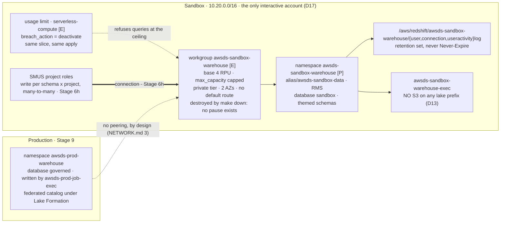

# Stage 5b — Redshift Serverless: the warehouse beside the lake

| | |
|---|---|
| **Status** | **passes 0-3 applied 2026-09-20** ([log](../../log/log-stage-05b-redshift-serverless.md)); what is left is three readings that need something Claude's session did not have — a console for the free trial (0.3a / verification xiii), a space for the endpoint door (1.10 / verification xv), and a later re-read of the audit groups (6.1, see below). `./aws/warehouse.py` reads **11 pass, 1 note**. **Nine sentences in this file were wrong and are corrected in place, each marked `[corrected 2026-09-20]`** — the stage had only ever been *written*, and `validate`, `render` and `run` are three verdicts (Lesson 54). Originally written 2026-09-19 from the vendor documentation and one priced reading. **The slice is a pair since 2026-09-20**: `sandbox/warehouse/` `[P]` holds the **namespace** — the data, the users, the roles and the `GRANT`s — and `sandbox/warehouse-compute/` `[E]` holds the **workgroup and its usage limit** and nothing else, so `make down ENV=sandbox` removes the compute object entirely. **Redshift Serverless has no pause**, only create and delete, so *powered off* means *does not exist*, which is also the strongest guarantee available: none of D40's three ways an idle warehouse bills anyway has anything to arrive at. RMS storage still bills while down, and that is the price of keeping the data. **Step 0.0 is done (2026-09-20): the requirement is in [`objectives.md`](../objectives.md)** — Redshift Serverless is a **second possible engine**, the Glue/Iceberg lake stays the warehouse of record, the two classes of database are named with their writers, and the estate is **one Redshift environment from a data scientist's point of view, with where its databases live an implementation matter**. That last clause is what makes [D40](../decisions/D40-redshift-warehouse.md)'s two-account split admissible rather than a deviation. **The read side was answered the same day**: the controls do not change — Redshift is *one more execution environment*, not a new class of reader, so a governed database is read by whoever the grant register already admits, through Lake Formation. That narrows `INT-24` to the mechanisms **Lake Formation governs** — two of them, not one (0.0's second table; the first draft excluded one of the two wrongly) — and it puts a **known collision** on step 3.1's deny, which Stage 9 9.5a resolves. **Nothing is measured**: every number below is either a Price List reading (dated) or a documentation claim, and the stage's own passes are what turn the second kind into the first. Its central choice is settled in advance by **[D40](../decisions/D40-redshift-warehouse.md)** — a warehouse built by hand at **4 base RPUs**, two classes of database on two accounts, and the `RedshiftServerless` blueprint still disabled. **This stage builds the Sandbox warehouse only.** The governed class has no content until [Stage 9](stage-09-deployment-targets.md), so `production/warehouse/` is *specified* here (§7) and *applied* there — the rule that an act with no owning pass does not happen (Lesson 5), applied to a namespace nobody would write to for four stages |
| **Prerequisites** | **Stage 5a** — the lake exists, `sandbox/data/` holds this account's `DataLakeSettings` and the account data CMK `alias/awsds-sandbox-data`, which is the namespace's encryption key (`docs/GOVERNANCE.md` §Encryption). **Stage 3** — `sandbox/foundation/`'s VPC, whose **private** tier is where the workgroup lands: two subnets in two AZs, which is what pass 0's first reading is about. **6c** — no default route in that tier, and no NAT anywhere (D38), so nothing here reaches the internet. Nothing waits on a vend or a quota increase this stage knows of; 0.4 is where that is checked rather than assumed |
| **Consumes** | [D9](../decisions/D09-az-count.md), [D11](../decisions/D11-lab-lifecycle.md), [D12](../decisions/D12-budget-ceiling.md), [D13](../decisions/D13-lake-formation-enforcement.md), [D17](../decisions/D17-interactive-vs-runtime.md), [D22](../decisions/D22-data-governance-account.md), [D31](../decisions/D31-approver-read.md), [D35](../decisions/D35-sandbox-cardinality.md), [D38](../decisions/D38-single-egress-hub.md), [D40](../decisions/D40-redshift-warehouse.md) |
| **Proves** | — (no `INT-nn` row: every object this stage builds lives in one account). The cross-account row the warehouse eventually needs is **INT-24**, and it belongs to [Stage 9](stage-09-deployment-targets.md) |

*Read with [`docs/plan/conventions.md`](../conventions.md) (naming, layout, `[P]`/`[D]`/`[E]`, IAM rules),
[`docs/GOVERNANCE.md`](../../GOVERNANCE.md) — the warehouse is a fourth store and the file's §Catalogs
paragraph about it is rewritten by this stage — and
[`docs/plan/decisions/D40-redshift-warehouse.md`](../decisions/D40-redshift-warehouse.md), which settles
what is being built and what is not. The documentation rows are the 2026-09-19 entries in
[`docs/REFERENCES.md`](../../REFERENCES.md).*

---

**Objective:** one Redshift Serverless warehouse in `Sandbox`, at the documented capacity floor, with its
cost ceiling and its audit trail applied in the same act that creates it — and the **access model for both
classes of database written down before either class has a member.**

## The compute is `[E]` because there is no pause, and the data is `[P]` because nothing else holds it

Every other store in this estate is `[P]` in one piece. This one splits, and the split is what makes *"turn
the compute off and be sure nothing bills"* answerable rather than a matter of trust:

| | `sandbox/warehouse/` `[P]` | `sandbox/warehouse-compute/` `[E]` |
|---|---|---|
| Holds | the **namespace** — every database, schema, table, database user, role and `GRANT`, the RMS data, the admin secret, the audit log groups, the namespace IAM role, the security group, the alarms | the **workgroup** and its usage limit, nothing else |
| Bills at rest | **RMS storage only** (0.024 USD/GB-month) — plus the secret and the log groups, cents | **nothing, because it does not exist** |
| `make down ENV=sandbox` | never touches it | destroys it |

**The workgroup is `[E]` rather than `[D]` because Redshift Serverless has no pause.** A provisioned cluster
can be paused and resumed; a serverless workgroup has **`create-workgroup` and `delete-workgroup` and nothing
in between** — no stop, no suspend, no zero-capacity setting. So *"powered off"* here means *"does not exist"*,
which is the definition of `[E]` (§5.1), and it is also the strongest possible guarantee: an object that does
not exist cannot receive a query, so none of D40's three ways an idle warehouse bills anyway — an open
transaction, a connection pool's keep-alive, a cancelled query — has anything to arrive at.

**The namespace is `[P]` because it holds state no plan re-creates.** Layer 3 of
[6h](stage-06h-redshift-connection.md) is SQL: the schemas, the database users, the roles and the `GRANT`s live
in the namespace and Terraform never wrote them. Destroying the namespace would destroy them along with the
data, which is §5.1 rule 2 — no state lives only inside an `[E]` resource — and the reason `delete-namespace`
offers a final snapshot while `delete-workgroup` takes nothing but a name.

**Two guards, one hard and one soft.** The usage limit bounds the compute *while it exists*; `make down`
removes the compute. The first is why the limit lands in the same apply as the workgroup — they are in the
same slice for that reason, and a plan that adds one without the other is not applied.

> **One reading decides whether this split is free, and it is step 1.9.** The workgroup's endpoint host is
> derived from its name, the account and the Region, so re-creating it under the same name **should** restore
> the same address — and [6h](stage-06h-redshift-connection.md)'s SMUS connection stores that address as a
> field. If the host does **not** survive a delete and re-create, then every `make down` silently breaks every
> connection and the layer has to change: the workgroup becomes something kept up and the cost guard becomes
> the usage limit alone. **This estate has been bitten by exactly this shape before** — the Elastic IP whose
> *allocation id* did not survive a transfer while its address did (`lessons.md`, the platform list) — so the
> host is read back rather than assumed, before 6h depends on it.

## Why the cost guards are part of the build

Every other store in this estate is free or nearly free at rest. This one is not the same shape: at
**USD 0.36/RPU-hour**, four RPUs bill **USD 1.44 for every hour a query runs**, which makes the warehouse
the most expensive object per unit of time in the estate — 277× the WireGuard host's hourly rate. It bills
nothing while no query runs, and D40 names the three documented ways that stops being true (an open
transaction, a connection pool's keep-alive, a cancelled query).

So the usual split — build at stage N, observe at Stage 12 — does not apply. A budget notification arrives
after the money is spent, and **D12's budget notifies nobody** (its own open defect, re-opened by
[6e](stage-06e-claude-code-bedrock.md) 8.3). The guard that works is the one the service enforces itself: a
**usage limit** whose `breach_action` is `deactivate`. It lands in pass 1, with the workgroup, in the same
apply.

## What this stage builds, and in which accounts

| Where | What | Layer |
|---|---|---|
| `sandbox/warehouse/` (new, rank 53) | **the data half**: the namespace `awsds-sandbox-warehouse` under `alias/awsds-sandbox-data`, its Secrets-Manager-managed admin credential, its three audit log groups **pre-created with a retention period**, the namespace IAM role `awsds-sandbox-warehouse-exec`, the workgroup's security group, and the `ComputeCapacity`/`DataStorage` alarms | `[P]` |
| `sandbox/warehouse-compute/` (new, rank 54) | **the compute half, and nothing else**: the workgroup at `base_capacity = 4` in the private tier, and its `serverless-compute` usage limit. Destroyed by `make down ENV=sandbox`, created by `make up` | `[E]` |
| `terraform-modules/vpc-egress` (amended) + `sandbox/egress/` | a fourth optional endpoint group, **`redshift`** — the module admits only `bedrock`, `emr` and `mwaa` today, so this is a module change under Recipe B and a tag bump (1.10) | `[E]` |
| `identity/sso/` (amended) | what a persona may and may not do to the warehouse: the `redshift-serverless:Get*`/`List*` read side, and **no** `UpdateWorkgroup`, **no** `DeleteUsageLimit` | `[P]` |
| `identity/org-policies/` (amended) | `DenyRedshiftProvisionedClusters` on the organization root, and `DenyRedshiftCostGuardTampering` — the two statements decision 3 settles | `[P]` |
| `scripts/` | `backend.py`/`layers.py` rows for `warehouse` at rank **53** (`[P]`, outside every `make up`/`down` path) | — |
| `aws/warehouse.py` (new) | the instrument, `WH-1`..`WH-8`; `WH-13`/`WH-14` read the schema quotas, which needs a database session and so arrives with [6h](stage-06h-redshift-connection.md)'s first schema | — |
| `production/warehouse/` | **specified here (§7), applied at [Stage 9](stage-09-deployment-targets.md)** | `[P]` |

**Contracts this stage fixes, so that a rename fails in a check rather than in Stage 6h or 9:** the
namespace and workgroup **`awsds-sandbox-warehouse`** (the same name on two object types — Redshift allows
it, and the **audit log group path is derived from the namespace name**, so a namespace rename moves three
log groups), the namespace role **`awsds-sandbox-warehouse-exec`**, the namespace's inert first database
**`warehouse`**, and the class container **`sandbox`** — the database every themed schema lives in
([6h](stage-06h-redshift-connection.md) 1.1). **There is no name prefix on anything**: the class is the account
plus the database name, because a schema's name is thematic by requirement and carries no authorization
information at all.



## Step numbers are identifiers, not an order

Two of these numbers are cited from other files: **step 2** from
[Stage 6h](stage-06h-redshift-connection.md) (the grant grain it instantiates) and **step 7** from
[Stage 9](stage-09-deployment-targets.md) (the Production specification it applies). The sequence to work
in is the passes below:

| Pass | # | What | Slice · layer | Applied as |
|---|---|---|---|---|
| **0** | 0 | the requirement written into `objectives.md` by the user (0.0), then the readings: the AZ count, the price re-read, the SCP reach, the quotas — **and the one that can stop the stage** (0.1) | readings, no build | the user; `awsds-infra-sandbox-1` |
| **1** | 1, 3 | the namespace, then the compute with its ceiling in one apply, then 1.9's destroy-and-rebuild reading; then the policy statements | `sandbox/warehouse/` `[P]` + `sandbox/warehouse-compute/` `[E]`, then `identity/org-policies/` | `awsds-infra-sandbox-1`, then `awsds-infra-identity` |
| **2** | 2, 4 | the access model written and its negatives read back — no database exists yet, so this pass is code and readings | `identity/sso/` `[P]` + readings | `awsds-infra-identity` |
| **3** | 5, 6 | the cost guards exercised and the audit trail confirmed to carry something | sessions and readings | `awsds-infra-sandbox-1` |

Pass 1 is one apply and not two: a workgroup that exists for even one plan cycle without its usage limit is
a workgroup with no ceiling, and the window is exactly when a mistake is most likely. **Pass 0 can end the
stage** — 0.1's answer decides whether the estate's two-AZ plumbing is enough.

---

## To execute

### 0. Preflight — the requirement in writing, then the readings the design rests on

- **0.0 — Done 2026-09-20: the requirement is in [`objectives.md`](../objectives.md).** It was **a revision,
  not only an addition**: that file already named a warehouse — *"Use AWS Glue Data Catalog with data stored
  on S3 buckets, using ICEBERG format, as Data Warehouse"* — and a Redshift warehouse beside that sentence is
  either a second engine or a replacement for it, two readings that write the same in a bullet and produce
  different estates. **Claude drafted the revision at the user's request** (2026-09-20), which is a departure
  from [Stage 16](stage-16-sandbox-lake.md) step 0.1's shape and from the rule that the brief is the user's
  own words: a paraphrase written by the implementer becomes the specification (Lesson 57). It is recorded
  here and in [`history.md`](../history.md) for that reason, and the user's own sentences from the chat — the
  two classes, their writers, the per-database × project grain, the minimum capacity — are transcribed rather
  than restated.

  | What it settled | What follows |
  |---|---|
  | **Redshift is a second possible engine; the Glue/Iceberg lake stays the warehouse of record** | D13, D22 and the producer path **extend** rather than re-open, which is what [D40](../decisions/D40-redshift-warehouse.md) assumed and is no longer assuming |
  | **A query engine is a choice per workload, not per estate** — Athena stays the default | the warehouse needs a demander per workload, and a governed schema with no query that Athena served badly is the revision trigger D40 already carries |
  | **The governance model does not fork**: a governed Redshift database is governed by Lake Formation like a lake table | the federated-catalog registration at [Stage 9](stage-09-deployment-targets.md) 9.5 is a *requirement*, not a compensation Claude chose |
  | **One Redshift environment from a data scientist's point of view, and where its databases live is an implementation matter** | the two-account split is **admissible** rather than a deviation — the sentence that makes D40's hardest choice legal. What it also imposes: the portal must present one thing, so 6h's connection naming and any second connection are a user-facing question, not just a wiring one |
  | **A governed database is never written from the sandbox** | stated as a requirement, so the absence of a Sandbox writer on a governed schema is a control with a line behind it rather than a consequence of the account split |

  **The read side was answered in the same sitting** (the user, 2026-09-20): *the controls stay the same, it is
  just one more execution environment.* So there is no new class of reader and no second governance model, and
  three things this plan had left as options stop being options:

  | Consequence | What it replaces |
  |---|---|
  | **`INT-24` is narrowed to the mechanisms Lake Formation governs** — and **two** qualify, not one: a federated catalog read by Athena, or a Lake Formation-**managed datashare** (LF enforces database, table, column and row permissions on it, and tags may be used). Only shape (iii), a cross-account connection, is out: it makes a Redshift `GRANT` the control over governed data | **corrected 2026-09-20, hours after the first draft**, which had excluded the datashare on the assumption that data sharing is always Redshift's own permission system. It is not. The exclusion that survives rests on two independent grounds — the fork, and `sqlworkbench:*` on `*`, which `check-iam-wildcards.py` refuses |
  | **A governed database gets no project connection.** The SMUS Redshift connection of [6h](stage-06h-redshift-connection.md) is a **sandbox-class** mechanism; its three layers, the `AmazonDataZoneProject` tag included, never apply to a governed schema | the temptation to reuse 6h's wiring in Production "because it already works" — which would put a Redshift `GRANT` in the path of governed data beside a Lake Formation grant, two systems answering one question |
  | **The engine is subject to the controls, not the reverse.** D13 binds the namespace role exactly as it binds a Glue job's role (1.5, 9.2); the persona still gets no `GetCredentials` (2.3) | the reading that a new engine deserves a new grant shape |

  **What the answer does not do** is make the sandbox class governed. The sandbox class stays outside Lake Formation
  by design, on the sandbox lake's argument (Stage 16) — the per database × project grant is, in the user's
  words, *"the only new rule here"*, and it applies there and nowhere else.

**Action:** answer, from the API and the Price List rather than from this file, the four things the design
rests on. **Why:** every number in this stage is a documentation claim today, and a stage written on
documentation is a stage whose first apply is its first measurement (Lesson 54 — `validate`, `render` and
`run` are three verdicts). **Explanation:** all four are read-only.

- **0.1 — [Claude] How many subnets and Availability Zones a workgroup needs, and whether this estate has
  them.** The two sources disagree, and the disagreement is load-bearing:

  | Source | Says | Read |
  |---|---|---|
  | AWS, *Considerations when using Amazon Redshift Serverless* | *"Two subnets (without EVR) – You must have at least two subnets, and they must span across two Availability Zones"*; three only **with** Enhanced VPC Routing | 2026-09-19 |
  | The Terraform provider's `aws_redshiftserverless_workgroup` page | `subnet_ids` *"When set, must contain at least three subnets spanning three Availability Zones"* | 2026-09-19 |
  | The provider's **code** | `subnet_ids` is a plain `TypeSet`, `Optional`, `Computed` — **no client-side validator at all** | 2026-09-19, `internal/service/redshiftserverless/workgroup.go` |

  So the provider page is prose that validates nothing, and the service is the only authority. **This
  estate has two AZs by decision** (D9: two AZs of free subnet plumbing, one AZ for metered endpoints) and
  the `vpc` module builds exactly six subnets, 3 tiers × 2 AZs (`docs/NETWORK.md` §1). The design is
  therefore **two private subnets, `enhanced_vpc_routing = false`**, and the reading that settles it is the
  apply itself. **The fallback, if the service refuses two:** a third AZ's subnet trio is *free* — subnets,
  route tables and their associations cost nothing — but it is a change to the `vpc` module, to
  `docs/NETWORK.md` §1's address table and to `check-network-doc.py`'s arithmetic, in **five** VPCs or in
  one with a flag. Decide which before applying, not after the error (decision 1).
  > **`subnet_ids` is `Optional` *and* `Computed`**, which means omitting it plans as unknown and lets the
  > service choose — and the service would choose the default VPC, which no account here has. Always set
  > it. Lesson 27's shape: the plan is silent about the value the provider owns.
- **0.2 — [Claude] Re-read the price** from the Price List bulk API, the same door `docs/PRICING.md` §0
  documents, and compare with the row this stage was written against:
  ```bash
  curl -s 'https://pricing.us-east-1.amazonaws.com/offers/v1.0/aws/AmazonRedshift/current/us-west-2/index.json' \
    | jq -r '.products | to_entries[] | select(.value.productFamily=="Serverless" and (.value.attributes.term|not)) | .key'
  ```
  then the `terms.OnDemand` entry for that SKU. **Expected: `0.36` USD per `RPU-Hr`**, offer file published
  `2026-09-11`. A different number is not a blocker; it is a `docs/PRICING.md` edit and a re-read of D40's
  ceiling arithmetic before pass 1 (Lesson 6 — prices are measured, and Lesson 7 — a rejected-on-cost
  option goes stale in the direction that flatters the rejection).
- **0.3 — [Claude] Read what the existing policy set already does to Redshift, before writing a statement.**
  `redshift-serverless:` appears in **no** SCP today: `DenyUserCompute` in
  `awsds-org-scp-ou-data.json` names EC2, SageMaker, Glue, Athena, Lambda and ECS and **not** Redshift, and
  the `Interactive` OU's four statements are about notebooks, Athena Spark and Bedrock. So a workgroup in
  **Data Governance** is not refused by policy today — only by the absence of a VPC in that account
  (D22, D26's INT-13 note). Record that as the reason the Data Governance shape was closed by
  *architecture* rather than by *control*, which is what decision 3 then fixes.
  `terraform-live/identity/org-policies/POLICIES.md` is where the reading goes.
- **0.3a — [Claude] Read whether the free trial is available in this account, and understand what it does to
  every cost reading in this stage.** AWS offers *"$300 credit, which can be used within 90 days of sign-up
  toward your compute and usage"*, and *"You are eligible for the free trial if your account has not used
  Redshift Serverless yet"* — **per account, not per organization**.
  **Three consequences, and the third is the one that can invalidate this stage's own evidence:**
  - **Two accounts mean two windows and two credits**, opened four stages apart: Sandbox's at pass 1 here,
    Production's at [Stage 9](stage-09-deployment-targets.md) pass 6. **That is an accidental win of building
    the governed namespace late** — the plan already does not create it early, so its window is not spent while
    nothing writes to it. Do not create either namespace to "see it work".
  - **When the clock starts is not settled by the page.** It says *"within 90 days of sign-up"*, and its
    eligibility sentence points at first use of the service rather than at account creation — but *sign-up* is
    not defined there, so **read the credit balance in the Redshift console before and after pass 1's apply**
    and record which event moved it. Paraphrasing "sign-up" as "the first workgroup" without that reading is a
    claim, not a fact (Lesson 38), and the window is not recoverable once spent.
  - **Free-trial usage does not appear in the billing console.** AWS: *"billing details for free trial usage
    does not appear in the billing console. You can only view usage in the billing console after the free trial
    ends."* So **verification (vii) and (x) read 0.00 whether the design is right or wrong** while the trial is
    active — Lesson 13's exact shape. During the trial the instruments are the **`SYS_SERVERLESS_USAGE` system
    view** and the console's **credit balance**, which the same page names, and `./aws/warehouse.py`'s burn line
    says which of the two it read. Write the trial's status beside every cost number this stage records, or the
    numbers are unattributable later.
- **0.4 — [Claude] Read the account's Redshift Serverless quotas** —
  `aws service-quotas list-service-quotas --service-code redshift-serverless` — and record the three that
  matter: namespaces per account, workgroups per account, and **base capacity**. A quota this stage cannot
  raise by itself is a blocking input and belongs in the Status row, not in a mid-pass surprise (Lesson 19).

### 1. `sandbox/warehouse/` — the warehouse and its ceiling, layer `[P]`, a single apply

**Action:** the namespace, the workgroup, the usage limit, the alarm and the log groups, created together.
**Why:** the namespace holds the data and the workgroup holds the compute, and they are separable objects
with separate lifecycles — but the *ceiling* is not separable from the compute (see the pass table).
**Explanation:** `[P]` because a workgroup serving no query bills nothing, so there is nothing for
`make down` to save and a namespace holds state that a teardown would destroy (§5.1 rule 2 — no state lives
only inside an `[E]` resource).

- **1.1 — [Claude] Write the namespace** `awsds-sandbox-warehouse`:
  - `kms_key_id` = **`alias/awsds-sandbox-data`**'s ARN, read from `sandbox/data/`'s remote state, never
    pasted. One data CMK per account (`docs/GOVERNANCE.md` §Encryption) — the warehouse is a data store in
    Sandbox, so it takes Sandbox's data key, exactly as `awsds-sandbox-lake` does.
  - `manage_admin_password = true`, and **`admin_password_secret_kms_key_id` is NOT set**
    *[corrected 2026-09-20]*. This step asked for the account data CMK on the secret too, and the
    apply refused it: `ConflictException: Unable to create namespace credential secret: The KMS key
    used to encrypt the secret is not accessible`. The cause is **D31 working as designed** — the
    data key's policy grants the account root the administrative actions and none of the
    cryptographic ones, so *"delegation to IAM is impossible for the operations that read data"*, and
    a caller passing `AdminPasswordSecretKmsKeyId` needs `kms:Decrypt` and `GenerateDataKey`.
    Granting those on the **data** key so that a **credential** could be created would widen the read
    control D31 exists to hold. And the CMK bought nothing: AWS says a customer managed key on the
    secret is for reading it **from another account**, which nothing here does. So the secret rides
    `aws/secretsmanager`. **Never `admin_user_password`**: that would put a password in the state file
    and in a plan's output. The resource exports `admin_password_secret_arn`, which is what
    [Stage 6h](stage-06h-redshift-connection.md) consumes — and **that secret will stop rotating**,
    because rotation fails permanently if it lands while the `[E]` workgroup is down (`EXC-13`).
  - `admin_username` — a name, not a person (the identity seam: nothing whose count grows with headcount is
    in Terraform). `db_name = "warehouse"`, because **the namespace is born with a database whether one is
    wanted or not** — the default is `dev` — and a database nobody named is a database nobody revoked
    `PUBLIC` on (1.6). *[corrected 2026-09-20]* **Naming it does not replace `dev`, it adds a database
    beside it**: the namespace carries `warehouse` *and* `dev`, both with `USAGE, CREATE` to `PUBLIC`
    on their `public` schema, so 1.6's `REVOKE` is owed **twice** and `WH-6` has to know about two
    inert databases rather than one.
  - `log_exports = ["userlog", "connectionlog", "useractivitylog"]` — the Stage 11 feed, switched on at
    creation rather than added later, since a log that starts late has a silent gap.
  - `iam_roles` = \[the 1.5 role\], `default_iam_role_arn` = the same.
- **1.2 — [Claude] Pre-create the three log groups**, with a retention period, **before** the namespace can
  create them. AWS: a log group *"with the specified name doesn't exist… Amazon Redshift Serverless creates
  a new log group… \[which\] uses the default log-retention period of **Never Expire**"*, and *"A log group
  with the specified name exists. Redshift exports log data using the existing log group."* So the
  documented fix is to own the group first. The names are derived, not chosen:
  `/aws/redshift/awsds-sandbox-warehouse/userlog`, `…/connectionlog`, `…/useractivitylog`.
  **This estate already carries one never-expiring group as a dated exception** (`AWS_STATE.md` `EXC-10`,
  the SMUS apps), and the whole point of doing it here is not to acquire a second. Retention: **30 days**
  in Sandbox (decision 4).
- **1.3 — [Claude] Write the workgroup** `awsds-sandbox-warehouse`:
  - `base_capacity = 4`. **`max_capacity`** set to the ceiling decision 2 picks — the documented pair
    *"**Max capacity** and **Max RPU-hours** … are the controls to limit the maximum RPUs … Amazon Redshift
    Serverless **always honors and enforces these settings**, regardless of the price-performance target"*.
  - `price_performance_target { enabled = false }` *[corrected 2026-09-20]*. The premise was right and
    the conclusion was not: the target **is enabled by default** and set to `Balanced`, its `level` takes
    `1, 25, 50, 75, 100` (`LOW_COST` … `HIGH_PERFORMANCE`), and AWS *"do not recommend using this feature
    for 4 Base RPU"*. So *Optimizes for cost* **is** the feature, and the intent — do not let the service
    scale on its own judgement at the capacity floor — is to switch it **off** (decision 2). Read back:
    `pricePerformanceTarget: {"status": "DISABLED"}`, with **no `level` key at all**.
  - `subnet_ids` = the **two private** subnets of `sandbox/foundation/`, read from remote state and anchored
    on AZ `zone_id` (the standing rule); `enhanced_vpc_routing = false` (0.1); `publicly_accessible = false`.
  - `security_group_ids` = 1.4's group.
  - `config_parameter`: `require_ssl = true`, `enable_user_activity_logging = true` (without it
    `useractivitylog` carries no SQL text, which is the half Stage 11 wants), `max_query_execution_time`
    set to **1800** — the per-query ceiling, valid `1`–`86399`, and `86,399` is also what a query with no
    limit gets, so leaving it unset is a 24-hour runaway at 1.44 USD/h.
    > ***[corrected 2026-09-20] `search_path` cannot be "left alone", and nor can five others.***
    > `config_parameter` is a **set the provider owns whole**: a workgroup created with three parameters
    > reads back with **nine**, because the service fills `auto_mv`, `datestyle`,
    > `enable_case_sensitive_identifier`, `query_group`, `search_path` and `use_fips_ssl` — and the
    > provider then plans to **remove** the six it was not told about, forever, `1 to change` on every
    > plan. All six are declared at their read-back values, which also discloses what a query runs
    > under. **`auto_mv` is `true`**, so Redshift builds and refreshes materialized views on its own
    > judgement, on a 1.44 USD/hour meter — compute nobody asked for, left at the default and named so
    > turning it off is a decision somebody can find. `search_path` is `"$user, public"`, and `public` is
    > the schema 1.6 revokes `CREATE` on, so an unqualified `CREATE TABLE` fails rather than landing
    > somewhere nobody expects.
- **1.4 — [Claude] Write the security group** `awsds-sandbox-warehouse`: ingress `5439/tcp` from the
  **project app ENIs' security group** and from nothing else — not a CIDR, and **not** the whole private
  tier. Egress: nothing. A workgroup in a tier with no default route and no NAT has no internet either way
  (D38), so the group is about which *in-VPC* client may open a connection.
  **This is a network fact**, so `docs/NETWORK.md` §2, §2.1 and §9 are edited in the same sitting and
  `./scripts/check-network-doc.py` is run (the mechanical half).
- **1.5 — [Claude] Write the namespace role `awsds-sandbox-warehouse-exec`**, trust
  `redshift.amazonaws.com` and `redshift-serverless.amazonaws.com` only. Permissions: **empty on the lake**.
  This role is what `COPY`, `UNLOAD` and the auto-mounted `awsdatacatalog` database run as, which makes it
  precisely the principal [D13](../decisions/D13-lake-formation-enforcement.md) is about: **no `s3:*` on any
  of the five lake buckets, and no `lakeformation:GetDataAccess` until something grants it**. What it may
  hold is decision 5's question, and the recommendation there is *nothing in this stage* — a role with no
  policy is a role whose first grant is a deliberate act.
- **1.6 — [Claude] Write the first-database hygiene as code where it can be, and as a step where it cannot.**
  Redshift creates `warehouse`'s `public` schema with `USAGE` and `CREATE` granted to the group `PUBLIC`,
  so **every database user can create objects there** until it is revoked. There is no Terraform resource
  for a `REVOKE`; it is SQL, and it runs once, from the admin credential, at 1.8. Write the statement into
  the slice's README beside the resources rather than leaving it to memory (Lesson 5 — an intention is not a
  control; and 61 — a procedure that depends on a file it did not create runs only for its author).
- **1.7 — [Claude] Write the machinery rows for both slices**: `backend.py` and `layers.py` gain
  **`warehouse` at rank 53, `[P]`** and **`warehouse-compute` at rank 54, `[E]`** — both free (52 `bedrock`,
  55 `buildbox`). The ranks record real dependencies: `warehouse` above `data` (45), because the CMK is read
  from there, and above `foundation` (20) for the subnets; `warehouse-compute` above `warehouse`, because a
  workgroup needs its namespace. **`up` ascends rank and `down` descends it**, so the compute is raised after
  the namespace exists and torn down before anything under it — the same reasoning that put `vpn` below
  `egress`. `production/warehouse/` and `production/warehouse-compute/` share the two ranks when
  [Stage 9](stage-09-deployment-targets.md) writes them.
- **1.7a — [Claude] Wire it into `make up` / `make down ENV=sandbox`**, and say what a spoke session now costs.
  `make status` gains the workgroup's existence and its **0.00/h while no query runs**; `make up` creates it;
  `make down` destroys it. **What `make down` does not remove is the RMS storage**, which is the irreducible
  price of keeping the data between sessions — the same trade the GitLab EBS volume makes under `[D]`, and it
  should be stated in the same place: `docs/plan/cost-model.md`'s floor, not only here.
- **1.8 — [Claude⚡] Apply as `awsds-infra-sandbox-1`**, then, in the same sitting:
  - re-plan → **`No changes`**;
  - read the workgroup back — `base_capacity`, `max_capacity`, `publicly_accessible`, the two subnets and
    their AZs, `enhanced_vpc_routing`, the four config parameters (`WH-1`, `WH-2`);
  - read the usage limit back with its `breach_action` (`WH-3`);
  - confirm the three log groups carry **a retention period and not `Never Expire`** (`WH-4`);
  - confirm `admin_password_secret_arn` exists and that **no password appears anywhere in the state**
    (`WH-5` — the `grep` is part of the check, not a matter of trust);
  - run the 1.6 `REVOKE` from the admin credential and record it;
  - and **measure the first bill this stage can produce**: nothing. `./aws/warehouse.py` prints the hourly
    burn as **0.00 while no query runs**, which is the claim D40 rests on and the one thing pass 3 exercises.

- **1.9 — [Claude⚡] Destroy the compute slice and re-create it, once, before anything depends on it.** This is
  the reading the layer split rests on, and it is cheap now and expensive later.
  **Read, in order:** the endpoint **host** before and after (`get-workgroup`'s `endpoint.address`); the
  workgroup's **id** before and after, because an id that changes is a fact anything pinning it must not; the
  **time** each direction took, which §5.1 rule 6 requires and which decides whether `[E]` is comfortable or
  merely correct; and then, from a session, that **every object in the namespace survived** — the databases,
  the schemas, the users, the roles and the `GRANT`s.
  | What must survive | Why it matters |
  |---|---|
  | the endpoint **host** | [6h](stage-06h-redshift-connection.md)'s SMUS connection stores it as a field; if it moves, every `make down` breaks every connection |
  | every database, schema, table, user, role and `GRANT` | they are the namespace's, and Terraform never wrote them — if any is lost, the namespace is not `[P]` and this design is wrong |
  | the admin secret and the three log groups | they are `[P]` in the other slice, so their survival is a check on the split rather than on Redshift |
  **If the host does not survive**, stop and take decision 8 before 6h is planned: the workgroup stops being
  `[E]` and the cost guard falls back to the usage limit alone.

- **1.10 — [Claude] Add the endpoint family, because the plan did not have one** (the user, 2026-09-20, before
  anything was built). `terraform-modules/vpc-egress` admits exactly three optional groups —
  `["bedrock", "emr", "mwaa"]`, enforced by a variable precondition so an unknown name is a plan error — and
  **`redshift` is not one of them**. Without it, every Redshift *API* call from a space leaves through the proxy
  as a public request: the same *wrong door* [6e](stage-06e-claude-code-bedrock.md) found for `bedrock-runtime`,
  which the compute plane's `.amazonaws.com` entry admits and the image's `NO_PROXY` did not cover.
  **Which endpoints, and which of the three that look needed actually are:**

  | Service token | Needed? | Why |
  |---|---|---|
  | **`redshift-serverless`** | **yes, and it is the one a first list misses** | `GetCredentials` is layer 2 of [6h](stage-06h-redshift-connection.md) and the whole IAM-credentials auth path; `GetWorkgroup` and `ListTagsForResource` ride with it. This design's API is `redshift-serverless`, never `redshift` |
  | **`redshift-data`** | **only if the Data API is the path** | 6h 0.3 and 2.2 leave that conditional. A plain JDBC/psycopg connection over 5439 does not touch `redshift-data` at all, so this entry is decided by 6h's credential answer rather than added on spec |
  | `redshift` | **probably not — a reading** | the *provisioned-cluster* control plane. Nothing here calls it, but AWS's own SMUS access-role sample lists `redshift:GetClusterCredentials`/`DescribeClusters` beside the serverless pair, so whether the portal's machinery calls it anyway is read from CloudTrail at 6h 3.5 rather than guessed. **Absent by default**: an endpoint bought on suspicion is 0.010/h for the whole session |
  | *the 5439 data path* | **no endpoint at all** | the workgroup's own address resolves to **its ENIs in this VPC** (1.3's subnets), so what admits a space is the **security group** (1.4), not PrivateLink. An interface endpoint here would be a second, unused door |

  > **It looks like a DNS collision and it is not.** The API's private name is
  > `redshift-serverless.<region>.amazonaws.com`, while the workgroup's own host is
  > `<workgroup>.<account>.<region>.redshift-serverless.amazonaws.com` — the region sits **before** the service
  > token in one and after it in the other, so they are different subtrees and private DNS on the endpoint does
  > not shadow the workgroup's address. Written down because this estate has been bitten by a private zone
  > answering for a whole subtree (Lessons 40-43, and 6c's client-plane repair), and the shape here is close
  > enough to deserve the sentence rather than the assumption.
  **Two rules the add has to respect.** The module takes **short service tokens** and builds the region prefix
  itself, so no `.tf` file carries `com.amazonaws.<region>.…` — `check-tf-conventions.py` refuses a region
  literal (D1). And admitting a fourth group is a **module change**: the precondition's list is edited, the
  module is tagged, and the callers move by tag (Recipe B), never by branch.
  **Cost:** ~USD 0.010/h per endpoint for the length of the session (`docs/PRICING.md` §8), single-AZ under D9
  — so `GROUPS=redshift` is 0.010/h with one endpoint and 0.020/h with two, against the estate's 0.410/h fixed
  rate. `make up ENV=sandbox GROUPS=redshift` is what turns it on, and **no optional endpoint exists unless a
  group is named** — the default that makes this safe to add.

### 2. The access model — the classes of database, and the grain of a grant

**Action:** write down, before either class has a member, what makes a database governed or sandbox and how
a project gets write on one. **Why:** the class is not a property AWS knows about. Redshift has databases,
schemas, users, groups, roles and `GRANT`; it has no notion of *governed*. So the class is a convention
this file defines and an instrument reads, or it is nothing (Lesson 5). **Explanation:** the requirement is
*"access granted per database × project"*, and that grain exists in **two** systems at once — which is
Lesson 28's intersection in a third permission layer.

- **2.1 — [Claude] Fix the class convention, and note that Redshift's two words do not map onto the brief's
  one.** `objectives.md` (2026-09-20) settles that *"in Redshift, a schema is a database"* in the sense the brief
  uses the word. So:
  - **a Redshift `database` is the class container**, one per class per account: **`sandbox`** in Sandbox,
    **`governed`** in Production. The class is the **account plus the database name** — no prefix on anything.
  - **a Redshift `schema` is what the brief calls a base.** Its name is *"chosen when the schema is created,
    after the theme of the data it will hold"*, with *"no necessary relation to any SageMaker project"*, so a
    schema name is **not an authorization fact** and no check can read the class or the tenant off it.
  - **a sandbox schema may be shared by several projects**, so the relation is many-to-many and lives in
    `sandbox/warehouse/`'s map plus the `GRANT ROLE` statements, nowhere else
    ([6h](stage-06h-redshift-connection.md) 1.5).
  - **the sandbox class bypasses the catalog**: no catalog object, no LF-Tag, no Lake Formation grant — as
    `awsds-sandbox-lake` has none (Stage 16), and for the same reason, a project's working data being the
    project's. The governed class is the opposite, and Lake Formation governs it through the federated
    registration ([Stage 9](stage-09-deployment-targets.md) 9.5).
  **What that costs the checks:** `WH-6` cannot classify by name. It reads instead that each account holds
  **exactly one** class database under its expected name, that **no sandbox database exists in Production**, and
  that every schema in the sandbox database appears in the authored map — the three things readable when the name
  says nothing. Lesson 29 read backwards: an attribute deliberately carrying no meaning cannot become a selector,
  which is a property to rely on rather than to regret.
- **2.2 — [Claude] Write the two-layer grain, because one layer does not reach.** A SageMaker project gets
  write on one sandbox **schema** through **both** of these, and neither is sufficient:

  | Layer | What it admits | Where it is written | Grain |
  |---|---|---|---|
  | The **workgroup tag** | *which project may use this warehouse at all* — AWS: the admin adds `AmazonDataZoneProject={{projectID}}` *"to the Amazon Redshift cluster or workgroup **and its namespace**"* | `sandbox/warehouse/` (Terraform), one tag per admitted project | per **workgroup** |
  | The **Redshift `GRANT`** | *which schema and table the project's database user may read or write* — held by a role per schema, granted to each admitted project | SQL, run at [Stage 6h](stage-06h-redshift-connection.md) per schema × project | per **schema**, many-to-many |

  So the requirement's grain is the second layer, and the first is a gate in front of it.
  ***[corrected 2026-09-20] the first layer does not have the grain this table gives it.*** The row above
  says *"one tag per admitted project"* and that is **not expressible**: AWS's instruction is to add
  *"1 of the following tags"*, and `AmazonDataZoneProject` is a **tag key**, so it holds one value — on the
  workgroup and on the namespace alike. **Layer 1 admits exactly one project.** The requirement's grain
  survives in layers 2 and 3, which are per project role and per schema × project; what does not survive is
  the assumption that the gate in front of them can be per project too.
  `sandbox/warehouse/`'s `projects` variable refuses a second entry at plan time, because the alternative is
  a silent overwrite that breaks the first project's connection with nothing in the plan output to say which
  project lost access. **How a second project is admitted is [6h](stage-06h-redshift-connection.md)
  decision 8**, new on 2026-09-20 and not taken while no second project exists.

  **Two things about the tag have to be said now:**
  - AWS offers a wide form — `for-use-with-all-datazone-projects=true`, *"to allow all Amazon SageMaker
    Unified Studio projects in this account to access it"*. **It is refused here**, and `WH-7` fails if it
    appears on either object: it is the same shape as an empty deny-list permitting everything, and it turns
    "per project" into "per account" with one tag. *It is also the only mechanism AWS gives for more than one
    project*, which is what makes 6h decision 8 a real choice rather than a formality.
  - The tag is on **two objects**, workgroup *and* namespace, which is Lesson 14's shape — a value that must
    appear in N places by hand will be missing from one. Both are in the same Terraform resource file, from
    one `locals` map keyed by project id, so the two can only differ by an edit that fails the plan.
- **2.3 — [Claude] Write the persona side into `identity/sso/`, and write the *absences* as the design.**
  `DataScientistAccess` gets the read side — `redshift-serverless:GetWorkgroup`, `GetNamespace`,
  `ListWorkgroups`, `ListNamespaces`, `ListTagsForResource` — scoped to this account's workgroup ARN, and
  **`redshift-data:` nothing yet** (the query path is the project's connection, not the persona's;
  [Stage 6h](stage-06h-redshift-connection.md) decides whether a persona ever queries directly).
  It gets **no** `UpdateWorkgroup`, **no** `CreateWorkgroup`, **no** `DeleteUsageLimit`, **no**
  `UpdateUsageLimit`, **no** `CreateNamespace` and **no** `redshift-serverless:GetCredentials`. The last one
  is the load-bearing absence: `GetCredentials` mints a database session, so a persona holding it reaches
  the warehouse with no connection, no tag and no project — around both layers of 2.2 at once.
- **2.4 — [Claude] Re-state D13 against the new principal, and read it rather than assert it.** Three
  readings, all read-only: `awsds-sandbox-warehouse-exec`'s attached and inline policies (expected: none
  touching a lake bucket); whether the namespace's `awsdatacatalog` database is mounted and what it lists
  (expected: nothing, because Lake Formation has granted this role nothing); and the documented direction of
  that mount — *"Queries against the `awsdatacatalog` database can only be read-only"* — so the warehouse
  cannot become a second producer into the lake. Record all three, including the ones that come out fine.

### 3. The policy statements — what the organization refuses

**Action:** two statements, settled by decision 3, applied through Recipe A after the battery.
**Why:** everything above is a property of *this* warehouse. A second one, created by hand in a console in
any account, would have none of it — no base-capacity floor, no usage limit, no tag discipline.
**Explanation:** the shape follows `DenyGuardDutyTampering` (a named principal may change the control and
nobody else) and `DenyProvisionedMwaa` ([Stage 10](stage-10-orchestration-promotion.md) step 4 — the
always-on variant of a serverless service is refused outright).

- **3.1 — [Claude] `DenyRedshiftProvisionedClusters`**, organization root: deny `redshift:CreateCluster`,
  `redshift:RestoreFromClusterSnapshot` and `redshift:RestoreTableFromClusterSnapshot`. A provisioned
  cluster is the always-on shape D12 rules out — the same argument that refused always-on GitLab and
  provisioned MWAA — and nothing in `objectives.md` asks for one. **This is the cheap half**: a capability
  nobody has asked for is cheaper to refuse than to fence ([Stage 9](stage-09-deployment-targets.md) 3.7's
  wording, reused).
  > **It has one known collision, found 2026-09-20, and it is in a stage four files away.** A Lake Formation
  > **federated catalog** with *"Access this catalog from Iceberg compatible engines"* enabled makes **AWS Glue
  > create a managed Amazon Redshift cluster** — AWS's own words — which is the path
  > [Stage 9](stage-09-deployment-targets.md) 9.7 may use to let a Sandbox project read a governed table. So
  > this deny is either what breaks that path or what that path breaks, and the collision is the same shape as
  > Stage 15 decision 1's (`DenyGuardDutyTampering` against Audit's own detector). **Nothing here changes**:
  > the deny is still the right default, and Stage 9 9.5a owns the resolution with a reading behind it — its
  > recommendation is the mechanism that needs no cluster. Written here so the deny is not attached in
  > ignorance of what it will refuse (Lesson 34 — a deferred obligation recorded only at the deferring end is a
  > promise the receiving stage never gets).
- **3.2 — [Claude] `DenyRedshiftCostGuardTampering`**: deny `redshift-serverless:DeleteUsageLimit`,
  `UpdateUsageLimit` and `UpdateWorkgroup` except for `InfrastructureAccess`'s reserved-SSO role and the
  account's Terraform principal. **What this cannot do, and the plan must not pretend otherwise:** there is
  **no IAM condition key for `baseCapacity`**, so the policy cannot say *"never above 4"*. The ceiling is
  the workgroup's own `max_capacity` plus the usage limit, and the policy's job is only to stop those two
  being edited away. Lesson 18 applies in full — the statement does not constrain the identity that authors
  it, and what watches that identity is CloudTrail.
- **3.3 — [Claude] Run the battery before attaching** (`./aws/probes/scp-battery.py`, the runbook is
  [`scp-battery.md`](../runbooks/scp-battery.md)): both statements get `probes.py` entries, exercised as
  `awsds-policy-canary` where a call without a deny would act. `redshift:CreateCluster` in the canary is the
  clean case — it is refused before it creates anything only if the deny is real, so the probe needs a
  negative control (Lesson 26: an "already exists" error proves nothing on its own).
- **3.4 — [Claude⚡] Apply as `awsds-infra-identity`**, then update
  `terraform-live/identity/org-policies/POLICIES.md` with one row per new `Sid` **in the same sitting**, and
  run `./scripts/check-index.py` for the mechanical half. Every new statement is *attached* and not yet
  *exercised* outside the canary; say so in the row rather than letting a later stage discover it
  (Lesson 20).

### 4. What no control covers, written down as a residual

**Action:** one short list, in this file and in `docs/AWS_STATE.md`, of what a person with the right role
can still do. **Why:** an unstated residual becomes a finding somebody reports as a gap in Stage 11.
**Explanation:** each line names the thing that would close it, so the list is a backlog rather than a
shrug.

- **A base capacity above 4 is not preventable, only visible.** No condition key exists; the
  `ComputeCapacity` alarm (6.2) is the detection, and the ratchet means the capacity does not come back down
  on its own.
- **A second namespace in another account is refused by nothing** until 3.1/3.2 exist, and after them only
  the *guard tampering* is refused — `CreateWorkgroup` itself is not (it would deny Stage 9's own apply).
  `WH-8` enumerates namespaces and workgroups in every profiled account, so a new one is a diff.
- **A database user's password, once issued, is a credential this estate does not rotate.** That is
  [Stage 6h](stage-06h-redshift-connection.md)'s decision, not this stage's, and it is named here so the two
  are read together.
- **`useractivitylog` carries SQL text**, which means it carries data values in literals. It is a DLP feed
  and a DLP exposure at the same time; the retention period (decision 4) is the only thing bounding it until
  [Stage 11](stage-11-dlp.md) 5.1 decides where the export goes.

### 5. Prove the ceiling before trusting it

**Action:** make the usage limit fire, once, deliberately, on a warehouse holding nothing.
**Why:** `breach_action = deactivate` is a documented behaviour with no measurement behind it anywhere in
this repository, and a control whose failure mode is *"queries keep running and the bill keeps growing"* is
the wrong one to discover in production (Lesson 5, and Lesson 22's inverse — this one *can* be attempted).
**Explanation:** it costs a known amount: a temporary limit low enough to breach, a trivial query loop, and
the limit restored in the same sitting.

- **5.1 — Done 2026-09-20, and the shape had to change twice** *[corrected]*. A **throwaway limit beside the
  real one is impossible**: `ValidationException: Only one DISABLE usage limit allowed per feature`. So the
  test lowered the **real** limit to 1 RPU-hour instead, breached it, and restored 40. A second limit with
  `breach_action = log` **is** permitted — created at 9,999 RPU-hours, caught by `WH-3` as *"2 limits — the
  loosest one wins"*, deleted — which is the hole that check exists for and is now measured rather than
  assumed. **What the breach looks like is in the log**; the four readings that matter to a future operator:
  the client sees `ERROR: Query reached usage limit` and nothing else; `get-workgroup` still reads
  `status: AVAILABLE`; **leader-node queries keep answering** while anything needing the compute is refused,
  so *"connect and `select 1`"* passes on a deactivated warehouse; and **recovery is immediate on raising the
  amount**, with no wait for the period. The original instruction, for the record:
  **Read three things:** what the client sees when the limit is reached (the wording, never the exit code —
  the standing rule since 1c); what `UsageLimitConsumed`/`UsageLimitAvailable` report in CloudWatch; and
  **whether the workgroup is still unusable after the period rolls over**, which is the question the
  documentation does not answer and the one that matters if this ever fires by accident.
- **5.2 — [Claude⚡] Delete the throwaway limit and confirm the real one is intact**, re-plan `No changes`.
  A test limit left behind is a second ceiling nobody reads.
- **5.3 — [user] Record the measured cost of pass 3** in the log, in USD, against the 1.44/hour prediction.
  This is the stage's only real spend and the first number that turns D40's arithmetic into a measurement.

### 6. The audit trail, and the alarm on the ratchet

**Action:** confirm the three log groups receive events, and put an alarm on the one metric that reveals the
irreversible thing. **Why:** a log switched on at 1.1 that carries nothing is a control that reads as
working (Lesson 13 — a verification that returns empty on both success and failure is not a verification).
**Explanation:** the alarm goes to the Stage 1b SNS pattern, the same chain every other alarm here uses.

- **6.1 — Read 2026-09-20, and the answer is *not yet*** *[corrected]*. All three groups exist.
  **`userlog` is empty and that is the correct state** — no user was created through a session. The other two
  carry **1,176 events**, and **every one is `user=rdsdb`**, the service's internal user: not one `dbadmin`
  session, and not one statement of this stage's SQL, including a query written to be searched for.
  **That is not yet evidence that the Data API is unlogged.** The group's `lastIngestionTime` was
  **06:15:52Z** and nothing was ingested in the 53 minutes after it while queries ran throughout, so the
  export is batched on an interval nobody here has measured, or has stalled. The instrument works — 1,176
  events prove it — but it has not been given the chance to show the presence, which is the condition
  Lesson 62 puts on reading an absence. **Owed: a re-read of both groups in a later sitting.** Until then
  [Stage 11](stage-11-dlp.md) must not assume the Data API path is in the feed, and
  [6h](stage-06h-redshift-connection.md) 3.6 is unanswered. The original instruction:
- **6.2 — [Claude] Write the `ComputeCapacity` alarm**: `AWS/Redshift-Serverless`, dimension `Workgroup`,
  threshold **> 4**, in `sandbox/warehouse/`. The metric is *"Average number of compute units allocated
  during the past 30 minutes"*, so the alarm is the only notice that the ratchet has moved — and since the
  warehouse does not return to 4 on its own, the alarm's job is to say *a manual `UpdateWorkgroup` is now
  owed*, not *this will pass*.
- **6.3 — [Claude] Add the row to `docs/PRICING.md`** (done in advance: §5's Redshift rows, read
  2026-09-19) and the line to [`docs/plan/cost-model.md`](../cost-model.md): the warehouse is **0.00/hour at
  rest and 1.44/query-hour**, which is a shape neither of that file's two columns has carried before.
- **6.4 — [Claude] Bring the documents to the estate, in this sitting**: `docs/GOVERNANCE.md` (§Catalogs'
  *"No warehouse is built here"* is now false, and the warehouse is a fourth store in §Persistence),
  `docs/SMUS.md` (the `RedshiftServerless` row's trigger names D40), `docs/NETWORK.md` (1.4),
  `docs/AWS_STATE.md` (§4's residuals, and the log-group retention as the thing that keeps `EXC-10` at one),
  `terraform-live/README.md`, `docs/plan/conventions.md` §6's tree, and `CLAUDE.md`'s Claude LOG.

### 7. `production/warehouse/` — specified here, applied at Stage 9

**Action:** write the Production namespace's shape now, while the Sandbox one is fresh, and hand it to
[Stage 9](stage-09-deployment-targets.md) rather than building it. **Why:** the two namespaces differ in
four ways and are identical in everything else, so the difference is worth stating in one place — and
building a namespace four stages before anything writes to it is the act with no owning pass that Lesson 5
refuses. **Explanation:** Stage 9 already owns the writer (`awsds-prod-job-exec`), the account's LF settings
and the deploy credential, so the governed class costs it one slice rather than a design.

| | Sandbox (this stage) | Production (Stage 9) |
|---|---|---|
| Slices | `sandbox/warehouse/` `[P]` + `sandbox/warehouse-compute/` `[E]` | `production/warehouse/` `[P]` + `production/warehouse-compute/` `[E]`, same ranks 53 and 54 |
| VPC | Sandbox's private tier, 2 AZs | **`VPC-Workloads`**' private tier — the two subnets in two AZs 6c built, the estate's one D9 exception, already there for MWAA Serverless |
| The class container | the database `sandbox`, holding themed schemas | the database `governed` |
| Written by | SMUS project roles, per database × project | **`awsds-prod-job-exec` alone** — no project, no connection, no tag |
| Read from Sandbox | directly, same VPC | **not over the network**: Sandbox↔`VPC-Workloads` has no peering, and its absence is the control (`docs/NETWORK.md` §3) |
| Under Lake Formation | no | **yes** — the namespace registered to the Glue Data Catalog as a **federated catalog** (`aws_glue_catalog`'s `federated_catalog` block), which is how a governed schema gets the same permission layer as the lake |
| Encryption | `alias/awsds-sandbox-data` | `alias/awsds-prod-data`, created by Stage 9 1.1 |

- **7.1 — [Claude] Write the specification into [Stage 9](stage-09-deployment-targets.md)** as its own step
  and its own pass, not as a sentence in this file: a deferred obligation recorded only at the deferring end
  is a promise the receiving stage never gets (Lesson 34 — and this plan has already paid for it once, on
  the lake's registration role).
- **7.2 — [Claude] Open `INT-24`** in [`integrations.md`](../integrations.md) for the one thing that is
  genuinely cross-account: a Sandbox project reading a governed table that lives in Production. The fallback
  and the mechanism go in the row; the proof is Stage 9's.

---

## Deliverables

Each is written so its output differs between working and broken (Lesson 13). **The mechanical half is
`./aws/warehouse.py`** ([`aws/INDEX.md`](../../../aws/INDEX.md)), written before pass 1 so it can report the
absences as expected readings:

| ID | What it reads |
|---|---|
| `WH-1` | the workgroup: `base_capacity = 4`, `max_capacity` at the decided ceiling, `publicly_accessible` false, `enhanced_vpc_routing` false, the subnets and their AZ `zone_id`s |
| `WH-2` | the four config parameters — `require_ssl`, `enable_user_activity_logging`, `max_query_execution_time`, and the price-performance target |
| `WH-3` | a `serverless-compute` usage limit exists on the workgroup, with `breach_action = deactivate` — **and no second, looser one beside it** |
| `WH-4` | all three log groups exist with a retention period that is not `Never Expire` |
| `WH-5` | `admin_password_secret_arn` is set, `manage_admin_password` is true, and no password string appears in the slice's state |
| `WH-6` | each account holds exactly one class database under its expected name, no sandbox database exists in Production, and every schema in the sandbox database appears in the authored map — the classification a thematic schema name cannot provide |
| `WH-7` | the project tags on **both** workgroup and namespace match the authored map — and `for-use-with-all-datazone-projects` appears on neither |
| `WH-8` | the namespaces and workgroups in every profiled account, so a hand-made one is a diff |
| `WH-13` | ***[corrected 2026-09-20] it cannot be read, and the check is a note that says so.*** `SVV_SCHEMA_QUOTA_STATE` **and** `STV_SCHEMA_QUOTA_STATE` answer `permission denied for relation` to the namespace admin, who is a superuser, and no other catalog view carries a schema's quota (`svv_redshift_schemas.schema_option` is empty for a schema that has one). So a quota is **authored and proven by breach, never read back** — and the breach was exercised: 2458 MB against a 2048 MB quota, refused **at commit**, with the usage exceeding the quota *inside* the transaction. The floor is also undocumented: *"Schema quota must be between 2048 and 524288000 MB"*. What survives of this check's intent lives in the runbook's `CREATE SCHEMA`, and the owner half moved to `WH-12` |
| `WH-14` | `STL_SCHEMA_QUOTA_VIOLATIONS`, reported rather than failed: a violation is the control working, and a *rising* count is the signal that a quota is too low for real work rather than too high |

The behavioural proofs are the stage's own (Lesson 20):

- **The ceiling refuses** (5.1): a breached usage limit stops queries, with its wording recorded, and the
  post-period behaviour read.
- **Nothing at rest** (1.8, 5.3): the burn is 0.00 with no query running, and pass 3's measured spend is
  written against the 1.44/hour prediction.
- **D13 holds against the new principal** (2.4): the namespace role reaches no lake prefix, and
  `awsdatacatalog` lists nothing.
- **The audit trail carries something** (6.1), with the empty group named and explained.

## Validation

1. `./aws/warehouse.py` — all `WH-*` pass; diff two runs across the stage (only timestamps may change).
2. `./aws/datalake.py` — `DL-5` green after the sitting, `DL-6` unchanged: this stage touches no
   `DataLakeSettings`, and the reading proves it rather than assuming it.
3. `./scripts/check-network-doc.py` after 1.4, and `./scripts/check-index.py` after 3.4.
4. `make check` clean, both the `warehouse` and `warehouse-compute` ranks included.
5. `make down ENV=sandbox` then `make status`: **no workgroup exists**, and the reported burn for this stage is
   0.00 — the mechanical form of the guarantee the split exists to give. Then `make up` and re-read the endpoint
   host (1.9).
6. Read every denial by its wording, never its exit code (standing rule since 1c).

## Cost

Measured (`docs/PRICING.md` §5, Price List offer file published 2026-09-11, read 2026-09-19), `us-west-2`:

| Item | Cost | Layer |
|---|---|---|
| Redshift Serverless compute, `base_capacity = 4` | **0.00/h while no query runs · 1.44 USD/h while one does** (0.36/RPU-h; 60-second minimum charge, per-second thereafter) — and **0.00 with the slice destroyed, because the object does not exist** | `[E]` |
| Redshift Managed Storage, **which `make down` does not remove** | 0.024 USD/GB-month; a schema filled to its 1 TB quota is **24.58 USD/month whether the compute exists or not** — the irreducible price of keeping the data | `[P]` |
| Manual snapshots, if any are ever taken | 0.023 USD/GB-month (`Redshift:PaidUniqueSnapshots:Serverless`, read 2026-09-20). **None are taken here**; recovery points under 24 hours are free, and `delete-namespace`'s final snapshot is the only place this meter could start | — |
| The free trial, while it lasts | **USD 300 of credit over 90 days per account** (0.3a) — which makes every cost figure in this stage unattributable unless the trial's status is recorded beside it |  — |
| The namespace, workgroup, usage limit, security group, log groups, alarm | free at rest | `[P]` |
| The admin credential in Secrets Manager | ~0.40 USD/secret-month + requests | `[P]` |
| The three CloudWatch log groups | ingestion + storage, cents at 30-day retention | `[P]` |
| Pass 3's deliberate breach | measured at 5.3, predicted well under 1 USD | one-off |

**What the stage does not add:** no KMS key (the account data CMK already exists and is already billed), no
interface endpoint, nothing metered by the hour while idle. `./aws/egress.py` §6 at session end should read
unchanged.

## Decisions due while executing

**Blocking inputs from the user: two** — step **0.0**, the requirement in `objectives.md`, before anything
here is built; and decision 1, but only if 0.1's apply refuses two subnets. Each decision is written into
`docs/log/log-stage-05b-redshift-serverless.md` with a recommendation stated (Lesson 16).

1. **~~If the service demands three AZs~~ (0.1) — does not arise.** The apply accepted **two** subnets in two
   AZs with `enhanced_vpc_routing = false`, so AWS's considerations page was right and the Terraform
   provider's page (*"at least three subnets spanning three Availability Zones"*, validated by nothing) was
   wrong. No `vpc` module change, no `docs/NETWORK.md` arithmetic, no third AZ. The options as they stood: **(a)** add a third AZ's three subnets to the `vpc` module
   for every VPC, **(b)** add them behind a flag for Sandbox alone, or **(c)** abandon the Sandbox warehouse
   and put both classes in Production, reached only through the Data page. Recommended: **(b)** — subnets are
   free, the change is arithmetic in one module, and doing it in five VPCs to serve one is the kind of
   uniformity that costs a re-measurement of `docs/NETWORK.md` for no gain. **(c)** is on the list because it
   is the honest fallback if the module change turns out to fight `check-network-doc.py`.
2. **`max_capacity` and the price-performance target** (1.3). **Taken 2026-09-20, with its second half
   corrected**: `max_capacity = 8` — one step up from the floor, so a query that needs more than 4 RPUs
   completes instead of failing, and the worst hourly rate is bounded at **2.88 USD/h** rather than at
   whatever the service chooses. The target is **`enabled = false`** and not *Optimizes for cost*: that
   phrase names a **level of the feature**, and the feature is the thing AWS does not recommend at 4 base
   RPUs. The recommendation's premise held — the default is `Balanced` **and enabled** — so writing the
   field explicitly was necessary rather than tidy.
3. **The two SCP statements** (step 3). Recommended: **both**, and in the order written — 3.1 first, because
   it refuses a capability nobody asked for and can be probed cleanly; 3.2 second, because it constrains an
   object that must exist first.
4. **Log retention** (1.2). Recommended: **30 days** in Sandbox. `useractivitylog` carries SQL text, so
   longer retention is a growing store of data values in a log group nobody has scoped yet, and Stage 11
   step 5.1 is where the export and the real period are decided together with the proxy's access log.
5. **What `awsds-sandbox-warehouse-exec` may reach** (1.5). Recommended: **nothing, in this stage**.
   `COPY` from `awsds-sandbox-lake` is the plausible first ask and it has no demander yet; a role with no
   policy makes the first grant a deliberate act with a named requester, which is how the drop-box's
   statements were eventually got right.
8. **~~What to do if the endpoint host does not survive a re-create~~ (1.9) — does not arise.** The host is
   byte-identical across a destroy and re-create under the same name. **The `workgroupId` is not**, and that
   moved two pieces of code rather than a layer: layer 2's IAM policy and 3.2's SCP both scope to the
   account-and-Region ARN pattern instead of this workgroup's ARN, because the ARN carries the id. The
   fallback as it stood: **keep the workgroup up and fall back to the usage limit as the only guard**, with
   the layer demoted from `[E]` to `[P]` and §5.1 rule 7 cited — a layer assignment is a cost judgement and may
   change. The alternative, having `make up` rewrite the SMUS connection's `host` on every session, puts a
   generated value into an object the portal owns and would make a data scientist's saved connection wrong
   without telling them.
9. **When to spend the free trial** (0.3a). Recommended: **do not manage it, but do not waste it** — build
   Sandbox's namespace when this stage runs, leave Production's until
   [Stage 9](stage-09-deployment-targets.md) actually writes to it, and record the credit balance at both. A
   90-day window is short next to this plan's pace, so treating it as a budget to optimise would distort the
   build order; treating it as free measurement while it lasts is what it is good for.
6. **Whether `Data Governance` is reconsidered.** D40 closed it on architecture. Recommended: **no, and
   record why in 0.3's reading** — the account has no VPC by decision, and the reason INT-13 already falls
   to its manual fallback is the same reason a workgroup cannot live there.

## Verifications to answer while executing

Record every answer, including the ones that come out fine.

| # | Question | Step |
|---|---|---|
| i | **Answered 2026-09-20: two, and AWS's own page was right.** The provider's page says three and validates nothing | 0.1, 1.8 |
| ii | **Answered: 0.36, offer file `2026-09-11T12:45:05Z`** — unchanged | 0.2 |
| iii | **Answered: base 4, max 8, and `pricePerformanceTarget: {"status": "DISABLED"}` with no `level` key** | 1.8 |
| iv | **Answered: all three at 30 days.** The estate still has exactly one never-expiring group | 1.8 |
| v | **Answered: yes.** `admin_user_password` appears in the state four times as an attribute name whose value is `null`; the strings `"password"` and `adminUserPassword` appear zero times | 1.8 |
| vi | **Answered: it refuses, `ERROR: Query reached usage limit`, and recovery does not wait for the period at all** — raising the amount restores service immediately. `status` stays `AVAILABLE` and leader-node queries keep working | 5.1 |
| vii | **Answered: 4,743 RPU-seconds = 0.4743 USD** for the whole sitting, from `ComputeSeconds` — 20 minutes of wall-clock query time at 4 RPUs. **Read it late**: the same metric said 405 an hour earlier, because it publishes per half-hour interval and 3,842 of the 4,743 landed in one of them, so a figure taken right after an expensive query under-reads by a factor of ten. **The trial's status is unknown**, so the figure does not come from the bill either way | 0.3a, 5.3 |
| xiii | Is the free trial available in this account, **which event starts its 90 days**, and did pass 1's apply move the credit balance? | 0.3a |
| xiv | **Answered: the host survives, the `workgroupId` does not, and everything in the namespace survives.** Destroy 28 s, re-create 114 s. Two ENIs linger `available` for under two minutes | 1.9 |
| xv | With `GROUPS=redshift` up, does a `redshift-serverless` call from a space leave through the **endpoint** and not through the proxy — read from the proxy's access log being silent on it, the way 6e read `bedrock-runtime`? And does the workgroup's own 5439 address still resolve to its VPC ENIs with the endpoint's private DNS enabled? | 1.10 |
| viii | **Answered: no policy at all, and `awsdatacatalog` lists zero schemas and zero tables** — and it cannot even be connected to | 2.4 |
| ix | **Answered: `userlog`, and its emptiness is correct.** The other two carry 1,176 events, all the service's own — see 6.1's open half | 6.1 |
| x | Does a workgroup with no query running bill **0.00** — read from Cost Explorer a day later, or from `SYS_SERVERLESS_USAGE` if the trial is active (0.3a)? And with the compute slice **destroyed**, is the remaining charge RMS storage alone? | 1.8, 1.9, 5.3 |
| xi | **Answered: 25 namespaces, 25 workgroups, 3,200 RPU; no base-capacity quota exists. None is blocking** — Stage 9's namespace is in another account with its own 25 | 0.4 |
| xii | **Answered: both deny, with a negative control before the attach, and the carve-out admits `InfrastructureAccess`** — `UpdateUsageLimit` succeeded as the infrastructure principal and is denied to the canary. `UpdateWorkgroup` **validates before it authorizes**, so it is attached and not exercised | 3.3 |

## Risks

- **The ratchet is irreversible and silent.** *"Amazon Redshift won't scale your data warehouse back down to
  4 RPUs."* A single expensive query moves the floor for good, and the bill reports a higher rate with no
  event saying why. The `ComputeCapacity` alarm is the notice; the remedy is a manual `UpdateWorkgroup`,
  which *"might cancel some of the queries running on your workgroup"*. Nothing here prevents it.
- **Three documented ways an idle warehouse bills** (D40): an unclosed transaction burns RPUs for up to six
  hours before `SESSION TIMEOUT` ends it — **8.64 USD** at 4 RPUs from one forgotten `BEGIN`; a connection
  pool's `SELECT 1` is a billed query; a cancelled query bills for the time it ran. The usage limit is what
  bounds all three, which is why it is applied with the workgroup and not after.
- **The provider documentation and the service documentation disagree about subnets**, and the provider
  validates nothing, so the error arrives at apply time in an account with real state. 0.1 names the fallback
  before the apply rather than after (Lesson 41 — a vendor "required" travels without its premise; Lesson 30
  — a tool's failure is not a property of the world).
- **A namespace is not a boundary between its databases.** The cross-database page says read-only in one
  bullet and writable-with-permissions in the next, so if the two classes ever share a namespace the only
  thing between them is a `GRANT`. Two accounts is what keeps that from being true; a future "just one
  namespace, it's cheaper" edit reverses a control, not a cost (Lesson 41's shape, on one page).
- **The class is a convention, not a control, and since 2026-09-20 it is not even a name.** A schema's name is
  thematic by requirement, so nothing about a schema says which class it is or which projects use it: that lives
  only in `sandbox/warehouse/`'s map and in the `GRANT ROLE` statements, and a schema whose theme has outlived
  its projects looks exactly like one in use. **The account boundary is the real control**; `WH-6` and `WH-12`
  are the only things that can see a drift, and neither can be inferred from an object's name.
- **Online patching can make the endpoint briefly unavailable.** AWS: the update is applied *"within 14 days
  of release during idle periods… If no 15-minute idle period occurs within 14 days, your Serverless
  endpoint may experience brief unavailability."* In this lab idle periods are the normal state, so the risk
  is close to zero — it is recorded because the failure presents as a connection error nobody would
  attribute to a patch.
- **`useractivitylog` is both the DLP feed and a DLP exposure**, holding SQL text and therefore literal data
  values in a log group whose export is undecided until Stage 11.
- **The `[E]` compute rests on one unmeasured property**: that the endpoint host survives a delete and
  re-create under the same name. 1.9 reads it before anything depends on it, and decision 8 is the fallback —
  but if the reading is taken late, the symptom is a data scientist's saved connection failing after a routine
  `make down`, with nothing in the connection to show why.
- **`make down` does not stop the storage bill.** The guarantee is about *compute*: RMS keeps billing while the
  data exists, and a schema filled to its 1 TB quota is 24.58 USD/month with no workgroup in the account at all.
  Anyone reading *"pay nothing while idle"* as covering this store will be wrong by half the D12 ceiling.
- **No IAM condition key limits base capacity**, so the guard against an expensive warehouse is the
  workgroup's own two fields plus a policy that stops them being edited — and the identity that writes that
  policy is outside it (Lesson 18).

---

*Stage index: [stages/INDEX.md](INDEX.md) · Plan core: [GENERAL_PLAN.md](../../GENERAL_PLAN.md)*
