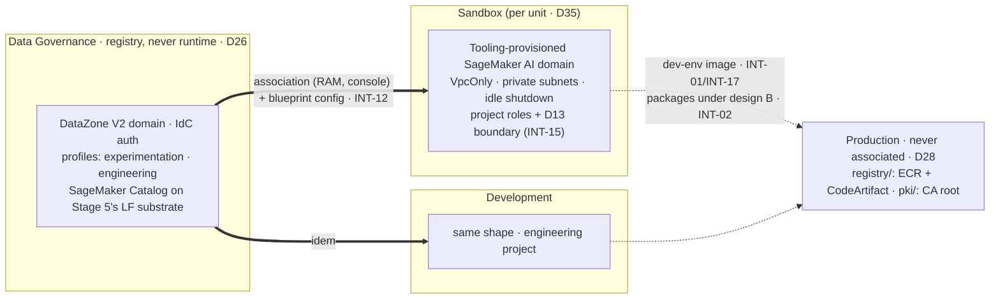

# Stage 6 — SageMaker Unified Studio

| | |
|---|---|
| **Status** | not started — **revised 2026-08-16 into the pass/verification format, against the official documentation and the `aws-ia` module re-read the same day.** Corrections folded in: the **Proves** row loses INT-09 and INT-13 (both need GitLab, which is Stage 7 — the old row contradicted the old body) and gains INT-02's consumer half; the two `sagemaker/` prerequisite slices, until now only *named* by `docs/plan/conventions.md` §6, get an owning step (2.1); steps 4-5 become amendments to Stage 3's parameterised `egress/` (its step 10) rather than fresh builds; the teardown debt is paid (the `layers.py` rows and the body Stage 2 step 8.6 left owing in `scripts/down-studio-apps.py`); and six doc facts replace beliefs — **`VpcOnly` is the default** (the control is a non-editable parameter, not a switch to find), the blueprint names (there is no "ML experience"; the per-project SageMaker AI domain comes from **Tooling**), disabling Athena **Spark** without killing Athena SQL is an SCP on `athena:StartSession`, idle shutdown is a Tooling-blueprint parameter with an admin-enforceable ceiling, the account association has **no public API**, and the required-endpoint list gained `datazone`. **Revised 2026-08-17: the user withdrew the NFS requirement from `objectives.md` (D24 withdrawn) — step 7 is removed, and pass 5 is steps 8-9.** **Revised again 2026-08-19, after re-reading the network-isolation page and the 2026-04 Athena Spark PrivateLink release ahead of decision 3** (sources in `docs/REFERENCES.md`): 1.6 rewritten — the three controls re-characterised (the Tooling flag is **non-retroactive** as well as blunt; the doc's third control is *grant*-shaped on blueprint-authored policies, so 2.1's boundary is a **deviation to record**), a fourth free network-layer lever named, and the announcement's scope written down so the question is not re-opened by its title; 1.7 gains the **third** condition the earlier reading missed (`aws:userid` `*:user-*` — the on-behalf carve-out is already in AWS's shape); 4.2 gains the **full** required-endpoint table and the `us-east-1`-only Q endpoint that design B cannot reach; **decision 1 reopened** on an endpoint-count cost the compute comparison never saw. **Three of the five execute-time decisions are CLOSED pre-stage (2026-08-19, the log's first two entries): 3 (Athena Spark off by SCP, at 1.6), 4 (`DataLake` alone — the re-read found `LakehouseCatalog` RMS-backed) and 5 (the blueprint allow-list in three categories, `docs/SMUS.md`)**; decision 1 is reopened — **its number corrected and an FGAC counter-axis added later the same day: settled in-stage by two readings (decision 1's own row)** — decision 2 (TIP) waits for execution. **A sixth execute-time decision ADDED 2026-08-19 (chat discussion with the user): the derived zone's per-project prefix shape — project-first against family-first; recommendation family-first, settled at 2.6 and only after INT-15's measurement (its row below)** |
| **Prerequisites** | Stage 3 (the per-role endpoint lists and the `egress_mode` switch of its step 10), Stage 4 (the tunnel; INT-16's portal half deliberately open), Stage 5 (the lake, the two shares proven by the pandas pair, **decision 6 — the grain — already taken**, and the 9.3 extension point in the consumer data-key policy). **Stage 5 pass 4 is a hard predecessor and was not one until 2026-08-19**: each member account needs its own `DataLakeSettings` — a data lake administrator, or the share stays invisible there, and the create-defaults cleared *before* any blueprint creates a catalog object in that account (1.4's callout). **SATISFIED 2026-08-19 for both member accounts** — pass 4a/4b applied the settings under Recipe D and `DL-6` reads clear in Sandbox and Development, so verification (xv) below now has a *measured* precondition rather than an assumed one. **4c was DELIVERED 2026-08-19** — the seven persona statements are applied in `identity/sso/` (the Athena run family on the two workgroup ARNs, the derived zone's three prefix families, the drop-box write's identity half and the lake-key KMS pair). **4d AND 4e are DELIVERED (2026-08-20)** — every behavioural proof ran, the pandas pair included, and 4.3's `athena:StartQueryExecution` amendment is applied into `DenyUserCompute`, which **1.6 below rides on and may now assume**. So the "two shares proven by the pandas pair" clause above **is true**, measured, and this stage may read it as satisfied — *the sentence this replaces said the opposite and was correct until that date.* **Stage 5 is closed entirely**, pass 6 included (Security Hub CSPM, 2026-08-20); the only thing still open there is its step 13.3 triage, which touches nothing this stage consumes. **Pulled forward and applied before this stage:** `production/registry/` (Stage 7 step 5 — under design B it is how packages arrive) and `production/pki/` (D36 — the `dev-env` image must be *built* with the CA root in it, INT-19) |
| **Consumes** | [D5](../decisions/D05-sagemaker-egress.md), [D12](../decisions/D12-budget-ceiling.md), [D13](../decisions/D13-lake-formation-enforcement.md), [D14](../decisions/D14-supply-chain-account.md), [D21](../decisions/D21-development-account.md), [D26](../decisions/D26-unified-studio.md), [D28](../decisions/D28-workflow-contract.md), [D35](../decisions/D35-sandbox-cardinality.md), [D36](../decisions/D36-internal-pki.md) |
| **Proves** | [INT-01](../integrations.md), [INT-02](../integrations.md) (the consumer half; the domain policy is Stage 7 step 5's, applied early), [INT-12](../integrations.md), [INT-15](../integrations.md), [INT-16](../integrations.md) (the portal half, provisional since Stage 4), [INT-17](../integrations.md). **Deferred to Stage 7 with the surface that needs it:** INT-09 (the `git clone` inside the `engineering` project) and INT-13 (CodeConnections) — GitLab does not exist before Stage 7 step 1 |

*Read with [`docs/plan/conventions.md`](../conventions.md) (naming, layout, `[P]`/`[D]`/`[E]`, IAM rules).*

**Forward constraint from D35:** the associated set is **N + 1** accounts (every unit's Sandbox plus
Development), each with its own blueprint configuration against the same single domain — write the
association and blueprint lists as maps keyed by consumer, never literals for unit 1. AWS's
**account pools** (`datazone create-account-pool`, CLI-only) are the native mechanism for account-agnostic
profiles; note it for [Stage 14](stage-14-sandbox-vending.md) and do not adopt it at N=1.

**Who does what, stated once:** **Claude** writes every slice, module and policy fragment, runs
`terraform fmt`/`validate`/`plan` and the read-only `aws/` scripts (`./aws/studio.py` is this stage's), and
drafts every console step with **every required field named** (Lesson 16). **The user** runs every
`terraform apply`, the step 0 probes (they write), the console association flow, the portal sign-ins, and
the docker build/push of 5.0. Steps below are tagged only where the split is not obvious from this rule.

---

**Objective:** the data scientist's working environment — one SageMaker unified domain (DataZone V2) with
projects (D26), hardened to the data perimeter, plus the D5 egress comparison it exists to host.

## What this stage builds, and in which accounts

**The sentence most easily misread, first:** the domain lives in **Data Governance**, and *no compute runs
there*. A domain is a registry — projects, profiles, blueprint configurations, the catalog. Blueprints
provision the working environments into whichever account the project profile names: **Sandbox** for
`experimentation`, **Development** for `engineering`. The D21 boundary comes out stronger: it stops being
"which URL did the person open" and becomes a property of the project.

| Where | What | Layer |
|---|---|---|
| `sandbox/sagemaker/`, `development/sagemaker/` (new, one module) | the blueprint **prerequisites**: provisioning + manage-access roles, the D13 permissions boundary, the VPC/subnet parameters, the KMS key | `[P]` |
| `data-governance/governance/` (new) | the DataZone V2 domain, its IAM roles, the two project profiles | `[P]` |
| `identity/sso/` (amended) | the step 3 deny fragment on the six persona sets | `[P]` |
| `data-governance/data/` (amended) | `writer_role_patterns` extended to the blueprint-provisioned project execution roles, if a notebook writes to the drop-box (2.1) | `[P]` |
| `sandbox/data/`, `development/data/` (amended through a `consumer-data` tag) | the consumer data-key policy's second `Decrypt` principal (`alias/awsds-<env>-data`, D31) — a widened module input under Recipe B, never a slice edit (2.6) | `[P]` |
| `sandbox/egress/`, `development/egress/` (amended) | design A: DNS Firewall + allowlist; design B: `egress_mode=B` + the CodeArtifact endpoints; the `datazone` endpoint under both | `[E]` |
| Domain portal + member-account consoles, by hand | the account associations — **no public API (read 2026-08-16)**: a RAM share the domain initiates | — |
| `scripts/` | `layers.py` rows for the three new slices; the body of `down-studio-apps.py` | — |

The four product mechanics behind these steps (Athena Spark's non-VPC default, the notebook identity
grain, `StartSession`, per-hour spaces) are `docs/plan/open-questions.md` items 12-15 — re-read against the
2026-08-16 documentation pass; each is answered at the step that owns it below.

## Step numbers are identifiers, not an order

Two numbers are **stable addresses cited from other files** — `step 1` (INT-16's portal half) from Stage 4
and `docs/plan/integrations.md`; `step 2` (the project-role grants) from Stage 5 step 9.3. They do not
change. The sequence to work in is **six passes**:

| Pass | # | What | Slice · layer | Applied as / by |
|---|---|---|---|---|
| **0** | 0 | the two preflights: the `CreateDomain` carve-out probe (both directions), the no-SageMaker plan reading | probes + a `plan` reading | probes: **user**; readings: Claude |
| **1** | 2.1-2.3 | the prerequisite slices: roles, boundary, KMS, params; the `layers.py` rows | `*/sagemaker/` `[P]` | `awsds-infra-sandbox-1`, `awsds-infra-dev` |
| **1** | 3 | the deny fragment: jobs off VPC, instance ceiling, `StartSession` scope | `identity/sso/` `[P]` | `awsds-infra-identity` |
| **1** | 5.0 | the hand-built `base`/`dev-env` images into the Production ECR | laptop, by hand | **user** (docker + push) |
| **2** | 1 | the domain, the associations, the blueprint configurations, the two profiles; the Athena Spark disable; INT-16's portal reading | `data-governance/governance/` `[P]` + console | `awsds-infra-data`; console halves: **user** |
| **3** | 2.4-2.7 | one throwaway project per profile: INT-15 (boundary), INT-17 (image) | portal + readings | provision: **user**; readings: `./aws/studio.py` |
| **4** | 4, 5, 6 | egress design A, egress design B, the comparison — closes D5 | `egress/` `[E]` | the two Interactive infra profiles |
| **5** | 8, 9 | idle shutdown + the teardown hook; observability | profiles, `scripts/` | mixed |

Pass 2 cannot precede pass 1: the blueprint configuration in a member account names the provisioning role
and VPC parameters the `sagemaker/` slice creates. Pass 3 needs pass 2's profiles and pass 1's image (5.0).
Pass 4 needs pass 3: a design B measured without a working custom image is missing three of its four
ecosystems, and the comparison would be decided by a defect (INT-17).

---

## To execute

### 0. Preflight — prove the SCP lets this account through, before Terraform meets it

*Why: `DenyDataZoneDomainOutsideDataOu` (1c, organization root) was never exercised in either direction —
DataZone validates `--domain-execution-role` before authorization, so 1c's probe never reached the SCP. Its
condition is `ForAllValues:StringNotLike` on `aws:PrincipalOrgPaths`, and a `ForAllValues:` operator over a
key that does not populate evaluates **true** — if DataZone requests carry no org path, the deny catches
everyone, Data Governance included, and step 1 dies mid-apply in the account where a half-built domain is
hardest to unpick. One call now versus an evening later.*

**0.1 — Probe the positive half** — **user**, in **Data Governance** (`awsds-infra-data`), with a role
DataZone will accept (a throwaway role trusting `datazone.amazonaws.com`, or the module's own execution
role applied first): call `datazone create-domain` with `--domain-version V2`. Three distinguishable
outcomes:

| What comes back | What it means |
|---|---|
| the domain is created | the carve-out matches. **Delete it** (`datazone delete-domain`) so step 1 creates it properly, and carry on |
| `AccessDenied … explicit deny in a service control policy` | `aws:PrincipalOrgPaths` does not populate for DataZone. **Stop** — go to 0.3 |
| any DataZone validation error (`Cross-account pass role…`, trust failures) | the probe never reached authorization — the 1c outcome, and not evidence. Fix the role and retry (Lesson 21) |

**0.2 — Probe the negative half in the same sitting** — **user**, from any account outside the `Data` OU
(e.g. `awsds-infra-dev`): the same call must return the explicit-deny wording. Without it, 0.1's success is
equally consistent with the statement never firing anywhere — which would mean INT-12's forbidden
one-domain-per-account fallback is already open by accident. Read the wording, never the exit code.

**0.3 — Re-key the statement only if 0.1 denied**: fall back to `aws:PrincipalAccount` against the
enumerated Data Governance account. A root-document amendment runs **phases 1-3 of
[`docs/plan/runbooks/scp-battery.md`](../runbooks/scp-battery.md)** on the canary — never an edit made here.

**0.4 — Read the plan for the second premise: nothing SageMaker-shaped lands in the registry account** —
Claude. `sagemaker:Create*` is denied in Data Governance by `awsds-org-scp-ou-data` (1c step 7.6, measured),
which is free exactly because no blueprint is enabled there. A `terraform plan` of
`data-governance/governance/` showing any `aws_sagemaker_*`/`awscc_sagemaker_*` resource is the signal to
stop — **the correction is re-checking "no blueprint enabled in the domain account", never weakening the OU
document.** `./aws/studio.py` `US-2` keeps this read after the fact.

### 1. The unified domain — the registry, its associations, its profiles (D26, INT-12, INT-16)

*Why: everything else in this stage hangs off the domain — and every fact below was re-read on 2026-08-16,
because three of the old step's beliefs (blueprint names, VpcOnly as something to enable, association via
Terraform) were wrong in ways that would have surfaced mid-apply.*

**1.1 — Verify the Region coupling before creating anything** — Claude reads, user confirms: the domain
and IdC must share a Region for this project. *(Multi-Region became possible 2026-04, but only with an
external IdP connected to IdC — this project uses the native directory — and trusted identity propagation
does not cross Regions.)* Both are `us-west-2` if Stage 1 went as planned; neither can move afterwards.

**1.2 — Write `data-governance/governance/`** — Claude; apply: **user** as `awsds-infra-data`. The
official module is **`aws-ia/sagemaker-unified-studio/aws`** (v0.2.0, 2026-07-02; providers `aws ≥ 6.51.0`,
`awscc ≥ 1.89.0`, plus `random ≥ 3.8.1` and `time ≥ 0.13.1`): the domain is `aws_datazone_domain` with
`domain_version = "V2"` and IdC sign-on, plus the domain execution/service/query roles.
**Consume the module selectively, and this is verification (ii):** its root assumes a single account — it
*requires* `vpc_id`/`subnet_ids` and enables the Tooling blueprint in the domain account, which is exactly
what this design forbids (D22: no VPC there; 0.4's premise). Take the domain + IAM half (and its
`project-profile` submodule); the blueprint half lands in the *member* accounts (1.4). If the module cannot
be split that way, write the few resources directly — the resource types are known and small.

**1.3 — Associate Sandbox and Development, in the console** — **user**, from the domain's admin portal:
*Request association* to each account, then *Accept* in the member account. **There is no public
associate-account API (read 2026-08-16)** — DataZone creates the RAM share on your behalf
(`AWSRAMPermissionDataZoneDefault`), and invitations expire in **7 days**; Stage 1d's org-wide RAM sharing
is what should make acceptance frictionless — record whether an invitation still appears (the INT-11
shape). **Staging and Production are never associated** (D28). Record every field the console asks for
(Lesson 16). Answered as verification (iv) either way.

**1.4 — Enable the blueprints in each associated account, and only there** — Claude writes, **user**
applies as that account's profile: `aws_datazone_environment_blueprint_configuration` (the same resource
the module uses) per member account, naming the provisioning role, the manage-access role and the
`regional_parameters` (`VpcId`, `Subnets`, `AZs`) **from the `sagemaker/` slice outputs of 2.1 — read
through `terraform_remote_state`, never pasted**. Enabled set and no others — **decision 5's category 1
(2026-08-19; [`docs/SMUS.md`](../../SMUS.md) carries the full table)**: **Tooling** (mandatory — it is
what provisions each project's SageMaker AI domain, roles and security groups), **`LakeHouseDatabase`**
(API name **`DataLake`** — decision 4: the Glue/Athena form; **not** `LakehouseCatalog`, which the
2026-08-19 re-read found RMS-backed), **EMRServerless** (decision 1's current recommendation — that
decision is reopened on the endpoint count, and this entry follows its outcome), and
**AmazonBedrockGenerativeAI** (per-use, token-billed — **its `PRICING.md` row is owed before this
apply**, and its runtime endpoints join 4.2's measurement). **Never `RedshiftServerless`, and now
`LakehouseCatalog` beside it** (both provision on Redshift-managed storage — D26/D12). Category 2 —
`Workflows` OnDemand, `MLExperiments` — enters only by its named trigger; category 3 — `EMRonEC2`,
`PartnerApps`, `Quicksight` — only by amending decision 5.
**The console recommends ≥ 3 subnets in 3 AZs; D9 built 2 — verification (iii)**, answered before anything
is layered on the answer.

> **`DataLake` LANDS ON A LAKE FORMATION SURFACE STAGE 5 ALREADY OWNS, AND THE TWO MEET IN ONE
> RESOURCE — written down 2026-08-19, from what Stage 5 passes 1 and 3 measured.** Decision 4 is what
> makes this precise rather than general: the enabled blueprint is the **Glue/Athena** form, whose whole
> output is per-project Glue databases and Lake Formation permissions in the member account — so it does
> not merely *touch* Stage 5's surface, it writes on it. (`LakehouseCatalog` is disabled and provisions
> on Redshift-managed storage, so none of this reaches it.) Two collisions to settle before this step
> runs, both in the *member* accounts:
>
> - **ordering.** The blueprint provisions catalog objects (databases, and the environment's own Glue
>   resources) in the account it targets. Lake Formation's `Create*DefaultPermissions` act at
>   **creation time**, so an object created while an account still carries the `ALL`-to-
>   `IAM_ALLOWED_PRINCIPALS` default is born deferring to plain IAM, permanently and invisibly. Stage 5
>   **pass 4** is what clears those defaults in Sandbox and Development — so pass 4 is a hard predecessor
>   of this step, not merely of the lake read. Confirm by reading, not by ordering alone (`DL-6` applied
>   to each member account);
> - **`DataLakeAdmins` is a shared surface, and the resource that writes it replaces the whole
>   structure.** `aws_lakeformation_data_lake_settings` overwrites `admins`, `parameters` and both
>   default blocks together (INT-11's failure mode — the reason `DL-5` exists). Stage 5 pass 4 writes
>   that resource in `sandbox/data/` and `development/data/`. **If this stage's manage-access role has to
>   be a data lake administrator for subscription fulfilment to work, it must be added to the *one*
>   settings resource those slices already have** — which since pass 4a lives in
>   `terraform-modules/consumer-data/` (`admins = [var.data_lake_admin_role_arn]`, a single string). The
>   change is therefore a module edit widening that input to a list, a new module tag (Recipe B) and a
>   re-apply of every consumer slice — never a second `aws_lakeformation_data_lake_settings` and never by
>   hand, or the next apply of either one silently removes the other's principal. **Whether it must is verification (xiv)**: the
>   blueprint configuration names a manage-access role, and what Lake Formation requires of that role is
>   read at 1.4 rather than assumed here.

**1.5 — Create the two project profiles, from the domain account** (only domain admins there can —
documented): **`experimentation`** provisioning into Sandbox, **`engineering`** into Development. Their
names are a contract with `./aws/studio.py` (`US-4`). In each profile's Tooling parameters, set and mark
**non-Editable** (the *Editable* flag is what makes a value a control instead of a default, Lesson 5):
`sagemakerDomainNetworkType = VpcOnly` (**the default — the parameter exists so nobody can flip it to
`PublicInternetOnly`**), the step 8 idle-shutdown set, and `maxEbsVolumeSize`. Decide
`enableTrustedIdentityPropagationPermissions` here — decision 2, the mechanism behind Stage 5's grain
decision, with a documented cost: **remote access does not work with TIP enabled**.

**1.6 — Disable Athena Spark without disabling Athena SQL** — decision 3. The documented "disable" is
three controls (**re-read 2026-08-19**), and only one is preventive, **retroactive** *and* precise: a deny
on **`athena:StartSession` + `athena:UpdateSession`** (the Spark-session surface; SQL uses
`StartQueryExecution`, which D13 depends on). **AWS ships the statement itself** — `Sid`
`DenyAthenaSparkStartSession`, `Resource` `arn:aws:athena:*:*:workgroup/*`, scopable by Region, account or
workgroup.

> **TWO THINGS MEASURED ELSEWHERE THAT THIS STEP INHERITS (2026-08-20, Stage 5 pass 4e, which denied
> `athena:StartQueryExecution` in two other OUs and probed it).** They are recorded here because the
> cheapest place to learn them is not the sitting that needs them.
>
> 1. **Athena's refusal names no policy.** A denied `StartQueryExecution` answers with a bare
>    *"You are not authorized to perform: … on the resource"* — no `explicit deny in a service control
>    policy`, no policy id. The battery's classifier reads wording, so it files that as `DENY-NOT-SCP`,
>    an IAM deny, and there is no phrasing that would correct it. **Expect the same from
>    `StartSession`**, and plan this step's probe as a **contrast pair** — the same call from an account
>    the deny does not reach — rather than as a wording match. Pass 4e's three `probes.py` entries are
>    the working example.
> 2. **Athena authorizes before it validates, for `StartQueryExecution` at least.** A call naming a
>    non-existent workgroup reached authorization and passed it where the deny was absent, so
>    Lesson 21's fork resolves the useful way and a nonexistent-workgroup probe is sound here.
>    **Per-action, not per-service** — it says nothing about `StartSession`, which this step must
>    measure for itself.
>
> **And one thing to verify rather than assume, before writing the statement:** the CLI's Athena
> operation list for the version installed on 2026-08-20 has `start-session`, `terminate-session`,
> `get-session`, `list-sessions` and `start-calculation-execution` — and **no `update-session`**. The
> action pair above came from AWS's own sample statement, which is the better authority for a policy,
> so this is not a correction; it is the check 7.6a's practice asks for — **confirm
> `athena:UpdateSession` against the machine-readable action list before shipping it**, because an
> action that does not exist denies nothing while looking like it does (Lesson 5). While there, decide
> in writing whether `StartCalculationExecution` belongs: denying `StartSession` should choke it by
> dependency, and "should" is the word that makes it worth one sentence either way.

The other two are worse than the 2026-08-16 reading recorded:

- **The Tooling blueprint's Athena flag** removes Athena SQL with it — the D13 path — **and applies to new
  projects only**, so it is blunt *and* not retroactive. Two reasons to leave it on, where the plan had one.
- **The doc's third control is "remove Amazon Athena Spark permissions from individual project IAM
  policies"** — a *grant*-shaped edit on **blueprint-authored** policies, which is Lesson 11's trap and
  INT-15's reconciliation risk in one sentence. **2.1's permissions boundary is not that control**: it is a
  deny-shaped ceiling delivered by a slice this repository owns. **Decided 2026-08-19, by the user: the
  boundary gets NO Athena Spark clause.** An OU SCP reaches every IAM principal in the member accounts,
  project roles included — the sole exemption is service-linked roles, and no SLR opens a Spark session — so
  the clause would deny nothing the SCP does not already deny, and **Lesson 20 turns that from redundancy
  into cost**: where two policies deny one call, only one is ever proven, and the other reads as coverage
  while being merely attached. The boundary stays for the job it exists for — D13's `s3:*` exclusion on the
  registered prefixes. **Revision trigger: the first principal in these accounts that an OU SCP does not
  reach.** Record the divergence from the documentation in `POLICIES.md` with that reasoning, or a future
  reader diffing plan against doc reads it as carelessness.

Land the deny in `awsds-org-scp-ou-interactive` through **battery phase 4b** (an SCP amendment, never a
direct edit; no carve-out needed — nobody legitimately runs Athena Spark), and record in `POLICIES.md` in
the same sitting. **The negative probe is the one that matters**: `athena:StartQueryExecution` must still
succeed in the same account, or the amendment took D13 with it.

**Not pulled forward — decided 2026-08-19, by the user.** Landing this in Stage 5's phase-4b sitting beside
4.3's `athena:StartQueryExecution` amendment was considered and declined: it buys one sitting instead of
two, at the price of inheriting 4.3's scheduling constraint, and there is no surface to protect until this
stage builds one. **The amendment and its probes run here**, at 1.6, when the next stage opens.

**A fourth lever exists at the network layer, and it costs less than nothing:** Athena Spark's three session
endpoints (`athena.sessions`, `athena.dashboard`, `athena.persistent-dashboard`) sit in the **optional**
endpoint table, so not creating them leaves Spark Connect no private path under design B — three endpoint
fees not paid. **Weakened, not removed, by the 2026-04 PrivateLink release**: before it there was no private
path at all, so Spark was dead by construction; now not having one is *our choice*, and a choice has to be
written down to survive — **and it is, since 2026-08-19**: a commented exclusion beside `extra_services` in
both Interactive `egress/` slices, plus 4.1's instruction to keep the Spark session domains off the DNS
Firewall allow-list.

**There is no intersection with Athena SQL, and it is worth stating because the names invite the opposite
reading.** The SQL path rides `com.amazonaws.<region>.athena` — the **API** endpoint, which the
network-isolation page lists as **required** and which this design creates. The three above are the Spark
session surfaces and nothing else: Spark Connect (the gRPC submission channel), the Live UI (running-task
monitoring) and the Persistent UI (the History Server). Declining them costs `StartQueryExecution` nothing,
just as the SCP above costs it nothing. **One shared edge, and it is the only one:** `GetSessionEndpoint`
and `GetResourceDashboard` — the calls that *mint* session URLs — travel over that same required `athena`
API endpoint, which is also the only Athena endpoint that accepts a VPC endpoint policy. So if an endpoint
policy is ever written there, it is the one place the two paths meet, and it must not catch the SQL
actions.

**Why the 2026-04 announcement does not reopen this** (read 2026-08-19; sources in `docs/REFERENCES.md`):
PrivateLink moved the **client → session** path — Spark Connect gRPC, Live UI, History Server — and not
where the session runs. There is **no `NetworkConfiguration` anywhere in the Athena Spark API** (no subnets,
no security group), and the SMUS network-isolation page, current after the release, still points at EMR or
Glue for VPC connectivity. The executor stays outside our VPC, therefore outside the endpoint policies, the
flow logs and every `aws:SourceVpce` condition the perimeter is built from — which is the whole reason this
step exists. Two details from the release's own page argue *for* the deny: **VPC endpoint policies are not
supported** on the three session endpoints (the documented workaround is to police
`GetSessionEndpoint`/`GetResourceDashboard` on the Athena **API** endpoint instead — an indirection, in
allow shape), and a **session URL minted inside the VPC is reachable from the public internet by design**
(plans, schema and stage detail, persisted in the History Server). Keep this paragraph: an announcement
titled *"now supports AWS PrivateLink"* is exactly what makes someone re-open a settled question.

**The revision trigger, worded so that a press release cannot fire it** (adopted 2026-08-19, by the user):
**Athena Spark gaining an equivalent of `NetworkConfiguration` — executors in our subnets, under our
security group.** *Not* "Athena Spark supports VPC", which the 2026-04 headline already says and which is
about the control path. Carry this wording into `POLICIES.md` with the statement: the distinction between
where a session is *reached from* and where it *runs* is the whole finding, and it is the half a hurried
re-reading drops first.

**1.7 — Read INT-16's portal half, at the first moment the surface exists** — **user**, browser: does the
portal open with the tunnel down? Record the observed behaviour either way, against Stage 4's three-roles
frame — a negative is fallback (ii) of INT-16 restated, not a stage failure. **Fallback (i) gained a
documented candidate (2026-08-16):** AWS's network-isolation page ships a deny for the **domain execution
role** conditioned on the caller's network (`Sid` `DenyUserAccessFromUnauthorizedVPCs`) — re-keyed on
`aws:SourceIp` = the WireGuard EIP list, it is the first mechanism that reaches the portal's own session.
**Corrected 2026-08-19: the doc's shape carries *three* conditions, not two** — `StringNotEquals
aws:SourceVpc`, `BoolIfExists aws:ViaAWSService=false`, and the one the earlier reading missed,
`StringLike aws:userid = *:user-*`, which is what confines the deny to **portal users** and spares the
catalog service running on the same role. **The on-behalf carve-out is therefore already in AWS's shape,
and its mechanism is the `userid` form rather than `ViaAWSService` alone** — evaluate it here, and prove
that pair (Stage 4's) before adopting.

### 2. The project roles — prerequisites, the D13 boundary, INT-15

*Why: D13 is only real if the execution role's S3 reach can be constrained, and D26 moved role authorship
to a blueprint (Lesson 11). This step builds the one mechanism least likely to be overwritten — a
permissions boundary delivered from a slice this repository owns — and then measures whether it survives.*

**2.1 — Write the `sagemaker/` prerequisite module and its two slices** — Claude: `sandbox/sagemaker/` and
`development/sagemaker/`, one module. Contents: the blueprint **provisioning role** and **manage-access
role** (CloudFormation trust, per the associated-accounts doc), the account's **KMS key** for project
resources, the exported **VPC/subnet/SG parameters** 1.4 consumes, and the **D13 boundary policy** —
name contract `awsds-<env>-project-boundary` (`./aws/studio.py` `US-8`): no `s3:*` on Lake
Formation-registered prefixes (D13), the step 3 conditions mirrored, and the drop-box `PutObject` on the
dated prefix **plus `kms:GenerateDataKey`/`kms:Decrypt` on the lake's data key under `kms:ViaService=s3`**
allowed (D18) — the identity half's full shape, mirroring `WriteIngestionDropBox` + `UseLakeDataKeyViaS3`
(Stage 5 pass 4c; the two-sided rule is `docs/GOVERNANCE.md` §Drop-box and INT-10). **And the resource side
does not admit these roles yet**: `writer_role_patterns` in `data-governance/data/locals.tf` matches only
`AWSReservedSSO_DataScientistAccess_*`, and its comment defers the project execution roles to this stage —
so if a notebook is to write to the drop-box, this stage amends that list and re-applies
`data-governance/data/` (in the build table above). The slice declares **prerequisites only — never a project environment**: DataZone owns those, and a
Terraform resource for them would fight the blueprint (conventions §6).

**2.2 — Add the machinery rows in the same sitting** — Claude: `RANKS` entries and `SLICES` rows in
`scripts/tfhygiene/layers.py` for `sagemaker` and `governance` (all `[P]`, rank after `foundation`) —
a slice with no row fails `make check`, and a name with no rank raises at import.

**2.3 — Apply both slices** — **user**, as `awsds-infra-sandbox-1` and `awsds-infra-dev`.

**2.4 — Provision one throwaway project per profile** — **user**, in the portal, after pass 2. This is the
measurement instrument for INT-15 and INT-17 — two questions, one project, before anything is
built on top.

**2.5 — Read back what the blueprint attached, and whether the boundary holds** — Claude:
`./aws/studio.py` §6 lists every `datazone`-named role and its boundary (`US-8`). If the blueprint-created
roles arrive **without** the boundary, attach it through the slice (or IAM) and **re-run the script after
the next blueprint reconciliation — the diff is INT-15's survival half.** If nothing holds, follow INT-15's
fallback chain in order, and record the outcome as an incomplete control rather than widening D13.

**Also settled here — open question 20:** whether `datazone:Get*` in `GovernanceManagerAccess` reaches
`GetEnvironmentCredentials`, and whether vending hands back a principal `DenyReadingTheRows` never touches.
`./aws/studio.py` cannot answer it — the read-back sees roles and boundaries, not what a session can
*obtain*. The attempt is the **user's**, in the governance-manager sign-in verifications (xii) and (xiii)
already need, against 2.4's throwaway project; it lands in this step because 2.4's project is the instrument
and 2.5 is where its readings are recorded. **If the call is denied, that is the answer.** If it vends, the
next reading is what the vended principal reads *with* the D13 boundary in place — the same diff this step
already runs, pointed at a different role.

**2.6 — Extend Stage 5's extension point to the real role names** — Claude writes, **user** applies: the
consumer data-key policy `Decrypt` — a second element in `AllowDataScientistUseViaS3`'s `Principal`, which
means widening `consumer-data`'s `data_scientist_role_arn` to a list, cutting a module tag (Recipe B) and
re-applying `sandbox/data/` + `development/data/` — and the scoped `PutObject`, which has **no** extension
point in that module (the derived bucket policy carries only `DenyStalePresignedUrls`) and is therefore
written into the blueprint-provisioned project role's own policy here (INT-15) — the prefix shape
those statements will name is decision 6 below. Both are what Stage 5
step 9.3 left with a comment naming this step: a tagged module bump, not a redesign.

**2.7 — Record the INT-15 answer either way** — in the log and in `docs/plan/integrations.md`: what a
blueprint-provisioned role carries, and whether an imposed boundary survived.

### 3. What a notebook can create — the deny fragment (open questions 12/14)

*Why: a VPC-only domain constrains Studio itself, not the training/processing jobs a notebook launches
through the API with their own network config. Without this step the whole VPC design is one API call away
from being bypassed — and one `ml.p4` parameter away from USD 30/hour.*

**3.1 — Write a new shared fragment in `identity/sso/`** — Claude; apply: **user** as
`awsds-infra-identity`. Two Sids, contracts with `./aws/studio.py` (`US-9`), reaching the **six persona
sets in one diff** (the Stage 4 step 8.2 shape — Lesson 14):

- **`DenySageMakerJobsOffVpc`** — deny job/app creation when `sagemaker:VpcSubnets` /
  `sagemaker:VpcSecurityGroupIds` are null; require `sagemaker:NetworkIsolation`,
  `sagemaker:InterContainerTrafficEncryption`, `sagemaker:VolumeKmsKey` where the workload class carries
  them.
- **`DenySageMakerInstanceCeiling`** — `sagemaker:InstanceTypes` allow-list (the key covers `CreateApp`,
  `CreateSpace`, `UpdateSpace`, `CreateTrainingJob` — read 2026-08-16), the only control that stops an
  oversized instance inside its first hour.

**Mirror both statements in 2.1's boundary** — the persona set governs humans, the boundary governs the
project roles the blueprint writes.

**3.2 — Scope the remote-IDE channel instead of denying it** (open question 14): adopt AWS's documented
SMUS policy — `sagemaker:StartSession` on `space/*` conditioned on
`aws:ResourceTag/AmazonDataZoneProject = ${aws:PrincipalTag/AmazonDataZoneProject}` and
`aws:ResourceTag/AmazonDataZoneUser = ${aws:PrincipalTag/datazone:userId}` — a user attaches only to their
own space. Record the residual for Stage 11's threat model: remote sessions authenticate with **IAM
credentials even in IdC domains and persist up to 12 h after portal logout**, and the kill-switch, if ever
needed, is the `sagemaker:RemoteAccess` condition key on `CreateSpace`/`UpdateSpace`.

**3.3 — Prove the deny pair** — **user**, from a data-scientist session: a job submitted with no VPC
config fails naming the policy; the same job inside the VPC with an allowed instance type runs. Read the
wording, not the exit code.

### 4. Egress design A — allowlist on the NAT path (D5, `docs/plan/architecture.md` §4.3)

*Why: half of the comparison D5 exists to settle. Stage 3 already built the NAT behind `egress_mode=A`;
what this step adds is the control that makes it "limited internet" instead of internet.*

**4.1 — Add the Route 53 Resolver DNS Firewall to the two Interactive `egress/` slices** — Claude writes,
**user** applies: a rule group with an explicit domain allowlist — PyPI, conda, CRAN, the Julia package
server, crates.io, the distro mirrors, `gitlab.prod.internal` — default-deny with the block action logged.
Priced and measured (`docs/PRICING.md` §7): USD 0.0005/name-month + USD 0.60/1M queries — cents.

**One name is to be kept OFF this list on purpose, and the note is the point** (decision 3, 2026-08-19):
Athena Spark's session hosting domains. Default-deny already excludes them, so nothing is *added* here —
what is added is the **instruction not to add them** when someone debugging a blocked lookup works down the
list. Read the actual names at the time rather than trusting a name written here months earlier; the
reasoning, and the SQL path that must not be caught with them, is in 1.6 and in both `egress/` slices.

**4.2 — Add the `datazone` interface endpoint to both Interactive lists** (Stage 3 step 8.7's candidate,
now **required** by the network-isolation doc), and measure — not copy — the rest of AWS's required list:
add only what verification (viii)'s flow-log reading shows exercised. Every entry is +USD 0.010/h per AZ per
account, and AWS's list covers features this design does not enable. **The full required list was re-read
2026-08-19** (the earlier four-name summary was a sample, not the list) **and its one copy is
[`docs/SMUS.md`](../../SMUS.md) §VpcOnly** — fifteen service names, `datazone-fips` included; this step
reads it there rather than carrying a second table that drifts.

**The three Athena Spark session endpoints stay uncreated, and that is now written where someone would go
to add one** — a commented exclusion beside `extra_services` in `sandbox/egress/main.tf` and
`development/egress/main.tf` (decision 3, 2026-08-19). Comment-only, so it changes no plan; Lesson 5 is the
reason it exists at all.

**One required entry cannot be created from `us-west-2` at all:** the doc pairs `q` with
`com.amazonaws.`**`us-east-1`**`.codewhisperer` and states that domains in other Regions use *that*
endpoint — but an interface endpoint is regional, so under design B the Amazon Q surface has no private
path from our VPC. It is a portal convenience rather than a data path (D1 keeps everything else in
`us-west-2`); **record what actually breaks in 4.3 instead of assuming either way**.

**4.3 — Run a working session and record what breaks** — **user**: the design A half of step 6's evidence.

### 5. Egress design B — no NAT at all (D5, INT-02)

**5.0 — Build and push the first `base`/`dev-env` images by hand** — **user**, laptop, pass 1. The one
place in the plan where an artifact reaches an account without a pipeline: acceptable exactly once, at
bootstrap, replaced by Stage 8's pipeline building the same `Dockerfile`s. Requirements the image must
already carry: the **CA root** (INT-19 — read the certificate from `production/pki/` outputs, never the
key), the **SMUS BYOI specification** (base on `jupyterlab/default`, health check on 8888) and the
**activity-monitor extension** — without it step 8's idle shutdown cannot see activity (SageMaker
Distribution v2+ behaviour, read 2026-08-16). `docker login` to the Production ECR through the tunnel, tag
immutably, push as `awsds-prod-ecr-dev-env`. **Record the digest in the log** so the Stage 8 changeover is
visible.

**5.1 — Make the image selectable in the throwaway project — INT-17, before the comparison starts.** The
attachment point (read 2026-08-16) is the **Tooling-provisioned SageMaker AI domain** in the member
account: image + image version + app image config, then the domain's `CustomImages` — the
`sandbox/dev-env/` and `development/dev-env/` slices of conventions §6, applied here for the first time.
Two things only execution can answer — verification (vi): whether the update **survives a blueprint
reconciliation** (INT-15's question, one resource over), and whether the image pulls **cross-account from
the Production ECR at all** — same-Region is documented as required and cross-account is documented only
for RStudio, so expect INT-01's fallback (an ECR replication rule into each Interactive account, not a
pipeline) to be the real path. Record the working mechanism — Stage 8 step 1 is written against it.
Machinery, same sitting: `RANKS["dev-env"]` and the two `[P]` rows in `scripts/tfhygiene/layers.py` —
a slice with no row fails `make check` (added 2026-08-16, by the Stage 8 revision: this step applies the
slices first, so the rows are its to add).

**5.2 — Flip the switch: `egress_mode=B` in the two Interactive accounts** — **user** applies: no NAT
route at all; the CodeArtifact endpoints from Stage 3 step 8.4; packages from CodeArtifact (cross-account
from Production — **INT-02's consumer half proven here**), images per 5.1. Julia, R and Rust arrive
pre-installed in the dev-env image (`docs/plan/architecture.md` §4.3) — confirm Cargo against CodeArtifact
(open question 5).

**5.3 — Answer the two questions Stage 3 deferred here** — Claude reads, user provokes: whether the AL2023
mirror-list path matters under B at all (no EC2 lives in the Interactive private subnets; record where the
answer lands), and whether `lakeformation` is ever called from the VPC in these flows or leaves Stage 3's
core endpoint list (its verification (ii)). Both from the flow logs of a working session.

### 6. The comparison, and the verdict that closes D5

**6.1 — Measure both designs on the same working session**: hourly cost (from `./aws/egress.py` §6 plus
the app-hours), what breaks in a normal session, how long the "I need package X right now" loop takes
under each (design B's loop includes the Stage 8 gate once it exists), and what a deliberate exfiltration
attempt achieves (DNS-name filtering is bypassable by raw IP under A; B has no path to misuse).

**6.2 — Write the verdict into `docs/plan/architecture.md` §4.3 and close D5** — **mark the rebuild-loop
number provisional**: it is measured against a hand-built image here and re-measured against the Stage 8
pipeline. The choice is made here; the number behind it is confirmed there.

### 7. Removed (2026-08-17) — the shared-filesystem answer

*This step verified whether SMUS could attach D24's EFS at all — the documentation said no, and
three fallbacks were queued. The question dissolved before it was asked: the NFS requirement was
withdrawn from `docs/plan/objectives.md` and [D24](../decisions/D24-shared-filesystem.md) with it.
File exchange is S3 and git — the paths SMUS project storage already documents. The step number
stays retired.*

### 8. Idle shutdown and the teardown machinery (D11, open question 15)

*Why: "as many spaces as they like" is billed by the hour, and D11 is a property of the design, not of the
user's habits. Two halves: the product's own idle shutdown, and this repository's `make down`.*

**8.1 — Enforce idle shutdown through the Tooling parameters, non-Editable** (with 1.5):
`lifecycleManagement` on, `idleTimeoutInMinutes` (60 is a reasonable start), **`maxIdleTimeoutInMinutes` as
the admin ceiling** the user cannot raise. The detection half rides on 5.0's activity-monitor requirement.
`./aws/studio.py` `US-7` reads it back per domain.

**8.2 — Write the body of `scripts/down-studio-apps.py`** — Claude — paying Stage 2 step 8.6's debt: for
the env's discovered SageMaker AI domains, `ListApps` → `DeleteApp` (and the enclosing spaces), through the
account's own profile. The stub already fails loudly the moment a domain exists, so this lands **before**
the first `make down` after pass 3.

**8.3 — State the layers, and what `make down` touches:** the DataZone domain, the profiles, the
`sagemaker/` prerequisites and the per-project SageMaker AI domains are **`[P]`** (metadata-priced or free
at rest; destroying them would orphan home storage and churn every ID); **only running apps are `[E]`**,
deleted by 8.2 through SageMaker, never through DataZone, which owns no compute. Project home directories
are **scratch by policy** — notebooks live in git, data in S3. State this
to users explicitly.

**8.4 — Prove the lifecycle** — **user**: `make down ENV=sandbox` deletes the running apps and touches
nothing `[P]`; `make up` restores the session; `./aws/studio.py` diffed across the cycle shows only
timestamps and app rows changed.

### 9. Observability

**9.1 — Create the log groups deliberately** — Claude writes, **user** applies: `/awsds/<env>/studio` at
30-day retention (matching Stage 3's flow-log decision) and confirm app/space logs land in named groups
rather than default ones that never expire; a metric on running-app count per account is the cheap
instrument for the step 8 risk.

---

## Deliverables

Each is written so its output differs between working and broken (Lesson 13). **The mechanical half is
`./aws/studio.py`** ([`aws/INDEX.md`](../../../aws/INDEX.md)), written for this stage: the one V2 domain in
the one right account, no domain anywhere else, the blueprint set inside decision 5's category-1
allow-list (`docs/SMUS.md`; Redshift-backed blueprints get their own failure message), the two profiles,
VpcOnly + idle shutdown per runtime domain, the boundary on every project role, the deny Sids in all six
persona sets, images, apps. The behavioural proofs are the stage's own (Lesson 20):

- **The working session:** sign in through the VPN, open the portal, work in `experimentation` (compute in
  Sandbox) and `engineering` (compute in Development), install a package, and read the Stage 5 lake table
  through Athena over the LF share — surfaced as a subscribed asset in SageMaker Catalog.
- **The egress pair, under each design:** a non-allowlisted site is unreachable under A (and the block is
  logged); no site at all is reachable under B — while the package path and the lake read still work.
  Plus the written comparison, rebuild-loop marked provisional.
- **The deny pair (step 3):** the off-VPC job and the oversized instance both fail naming the policy; the
  compliant job runs.
- **The lifecycle:** `make down`/`make up` with only apps changing (8.4).
- **Two negative deliverables, recorded as results:** nothing was provisioned into Data Governance by any
  blueprint (`US-2`), and INT-15's answer, whichever way it went.
- **INT-16's portal half recorded** (1.7), closing the row Stage 4 left provisional.

## Validation

1. Run `./aws/studio.py` — all `US-*` pass; diff two runs either side of the lifecycle cycle.
2. Re-run `./aws/org-policies.py` and the battery phase the amendments used (0.3's phases 1-3 if the
   re-key happened; 1.6's phase 4b) — never a direct edit; review `POLICIES.md` in the same sitting.
3. Run `./aws/egress.py` at both ends of every comparison session — §6 zero everywhere afterwards.
4. Read every deny by its wording, never its exit code (standing rule since 1c).

## Cost

| Item | Cost | Note |
|---|---|---|
| DataZone V2 domain at rest | ~USD 0.50/month | metadata rates, `docs/PRICING.md` §5 — already a floor row |
| JupyterLab / Code Editor app | ~USD 0.050/h per running app (`ml.t3.medium`) | the step 8 controls exist for this line |
| EMR Serverless (decision 1's candidate runtime — reopened, settled in-stage) | USD 0.0526/vCPU-h + 0.0058/GB-h (x86, measured) | replaces Athena Spark's 0.35/DPU-h default; **a started interactive application keeps one kernel worker (~USD 0.30/h) with no session running** — decision 1's own row carries the corrected reading |
| DNS Firewall (design A) | ~USD 0.03/month + USD 0.60/1M queries | measured 2026-08-16, `docs/PRICING.md` §7 |
| `datazone` endpoint (+ any 4.2 additions) | +USD 0.010/h each, per account | the Stage 3 hourly table moves accordingly |
| dev-env images in ECR | ~USD 0.10/GB-month | inside the existing ECR floor row |

## Decisions due while executing

**Blocking questions for the user: none.** Each is decided during the stage — or, for 3-5, was settled
ahead of it (Status row) — and written into `docs/log/log-stage-06-unified-studio.md` (Lesson 16).
Recommendations stated so the keyboard is not the decision-maker.

1. **The notebook Spark runtime replacing Athena Spark** (1.4, open question 12) — EMR Serverless or Glue
   interactive sessions, both VPC-capable. Recommended: **EMR Serverless** — per-vCPU/GB metering with an
   ARM option (measured, `docs/PRICING.md` §5) against Glue's 1-DPU minimum; Glue stays available through
   the core endpoints either way. Record what the replacement costs against the free default it displaces.
   **Reopened 2026-08-19 by a cost the compute comparison never saw:** the optional endpoint table asks for
   **four** endpoints for EMR Serverless (`emr-serverless`, `emr-serverless-services.livy`,
   `emr-serverless-services.sessions`, `emr-serverless.dashboard`) against **one** for Glue interactive
   sessions (`glue.sessions` — `glue` is already required). Design A may not need all four (4.2's rule is
   measure, not copy).
   **Corrected later the same day — the reopening stands, its number does not** (sources: the 2026-08-19
   Spark-runtime block in `docs/REFERENCES.md`): the first reading priced **two AZs**, AWS's HA
   recommendation and exactly what Stage 3 step 8.5 (D9) declined — under the applied single-AZ rule the
   delta is three endpoints × USD 0.010/h × two Interactive accounts ≈ **USD 0.06/h**; and it is not
   24×7 — the endpoints are `[E]` in `egress/`, so the line exists only while the slices are up, and the
   always-on case is a teardown-discipline failure (Stage 4's host left `running`), named as the real risk
   under D12's silent budget rather than as a rate. **Idle cost also cuts back the other way:** a
   **started** EMR-S interactive application keeps one pre-initialized kernel worker of **4 vCPU/16 GB**
   (≈USD 0.30/h x86) even with no pre-initialized capacity configured — bounded by `autoStop` at 30 min
   idle, but the **60-min kernel idle timeout is not configurable** — against Glue's session default of
   **5 DPU ≈ USD 2.20/h** while open.
   **And the axis neither weighing saw — FGAC:** the notebook's **Spark Connect** path documents FGAC
   *and* TIP as unsupported on **all three engines** (Glue, EMR-S, EMR on EC2 — full-table access), while
   EMR-S as a project **compute connection** is the only engine whose SMUS page documents a
   **`project.spark.fineGrained`** permission mode (LF fine-grained, EMR ≥ 7.2.0; Glue's `fineGrained` is
   documented for Visual ETL flows, not the notebook). If Stage 5's `restricted`-column scoping is to hold
   on the notebook Spark path at all, EMR-S is the only documented route — and choosing Glue means writing
   down that column scoping lives on the Athena SQL path alone. **Settle in-stage, with two readings in
   hand rather than one number:** (i) which of the four endpoints a working session actually exercises
   (4.2's flow logs); (ii) whether a `fineGrained` EMR-S connection is actually usable from an IdC-domain
   notebook. **The outcome propagates:** decision 5's category 1 lists `EMRServerless` as following this
   decision — landing on Glue removes it from `US-3`'s allow-list, `docs/SMUS.md` and the 1.4 map in one
   commit, and needs no blueprint at all (a Glue connection in the project).
2. **`enableTrustedIdentityPropagationPermissions`** (1.5, the grain — Stage 5 decision 6's mechanism) —
   recommended: **follow the grain Stage 5 chose**. If per-user on the SQL path, enable it and accept the
   documented cost — **remote access does not work with TIP enabled** — recording which objective yielded;
   if project-grain, leave it off and keep remote access.
3. **The Athena Spark disable set** (1.6) — recommended: the `athena:StartSession`/`UpdateSession` SCP via
   battery phase 4b **plus** the boundary mirror; leave the Tooling Athena flag on (it would remove Athena
   SQL, the D13 path). **Re-read 2026-08-19 against the AWS page and the 2026-04 Athena Spark PrivateLink
   release — unchanged, and better supported than when it was written**: AWS ships the statement verbatim;
   the Tooling flag turns out to be non-retroactive as well as blunt; the doc's third control is
   grant-shaped on blueprint-authored policies; a fourth, free, network-layer lever exists under design B;
   and PrivateLink moved the client path while the executor stays outside the VPC. All of it is in 1.6.
   **Three-quarters DECIDED 2026-08-19, by the user, once the re-read had closed the questions evidence
   could close** (the Tooling flag stays on and the SCP is the mechanism were no longer choices; the
   `Resource` stays at AWS's `arn:aws:athena:*:*:workgroup/*` wildcard, since narrowing to `us-west-2`
   would *permit* Spark elsewhere):
   - **Timing — not pulled forward.** The amendment and its probes run at 1.6, when this stage opens, not
     in Stage 5's phase-4b sitting (1.6 carries the trade).
   - **The boundary gets no Athena Spark clause** — Lesson 20 over defence in depth; the revision trigger
     is the first principal an OU SCP does not reach (1.6).
   - **The revision trigger for the deny itself** is executors in our subnets, never a PrivateLink
     headline (1.6).
   - **The endpoint abstention is WRITTEN, not tacit** — the recommendation adopted: a commented exclusion
     beside `extra_services` in `sandbox/egress/main.tf` and `development/egress/main.tf`, and 4.1's
     instruction to keep the Spark session domains off the DNS Firewall allow-list. Lesson 5, at the cost
     of two comment blocks that change no plan.

   **DECIDED IN FULL 2026-08-19.** What is left is execution at 1.6, and the clarification that settled the
   last item is worth keeping: the three session endpoints are Spark-only surfaces (Spark Connect, Live UI,
   History Server) while Athena **SQL** rides the required `athena` API endpoint — same name family, two
   products, no intersection. The negative probe at 1.6 is what keeps that true.
4. **Which Lakehouse blueprint(s) the catalog/SQL surface needs** (1.4) — `LakehouseCatalog`,
   `LakeHouseDatabase` (`DataLake`), or both. The original recommendation — start with `LakehouseCatalog`
   alone — **had the two inverted, which the 2026-08-19 re-read of the *Supported blueprints* page
   caught**: `LakehouseCatalog` *"provisions a new catalog in the SageMaker Lakehouse backed by Amazon
   Redshift Managed Storage"*, while the Glue/Athena form — per-project Glue databases, Lake Formation
   permissions, an Athena workgroup, the shape that lands on Stage 5's substrate — is
   **`LakeHouseDatabase`/`DataLake`** (Lesson 16: the name said one thing, the field list another; D26's
   "Lakehouse Catalog in its Glue/Athena form" carried the same misreading).
   **DECIDED 2026-08-19, by the user: `DataLake` alone; `LakehouseCatalog` is disabled** (decision 5
   category 3 — the Redshift family, beside `RedshiftServerless`, whose D12 argument reaches it).
5. **The blueprints deliberately left off** (1.4) — **DECIDED 2026-08-19, by the user, as three
   categories rather than a deny-list, every blueprint owned** ([`docs/SMUS.md`](../../SMUS.md) is the
   reference table; the mechanism: `US-3`'s allow-list holds category 1, and a category-2 blueprint joins
   it in the same commit that enables it, Lesson 14):
   - **Category 1, enabled by default**: `Tooling`, `LakeHouseDatabase` (`DataLake`), `EMRServerless`
     (following decision 1's outcome), `AmazonBedrockGenerativeAI` — all per-use; Bedrock's `PRICING.md`
     row owed before the 1.4 apply (Lesson 6).
   - **Category 2, on demand — authorized, named trigger, then commit + apply**: `Workflows` OnDemand
     (trigger: **D28's last-rung fallback** — INT-14's chain falling through at Stage 10; then `[E]`,
     torn down between uses. The *serverless* Workflows surface is separate — Stage 10 verification (i));
     `MLExperiments` (trigger: experiment tracking concretely needed; the MLflow tracking-server price
     measured first — it is a standing resource).
   - **Category 3, disabled — enabling amends this decision, price measured first**: `EMRonEC2`,
     `PartnerApps`, `Quicksight` (owned for the first time — until this decision they were off by
     omission), and `LakehouseCatalog` (decision 4). `RedshiftServerless` stays a **never**: enabling it
     reopens D26/D12, not this decision.
6. **The derived zone's per-project prefix shape — project-first or family-first** (2.6, the scoped
   `PutObject` written into the project role's own policy; discussed with the user 2026-08-19 and
   recorded here so the trade is on the table when the blueprint's real behaviour is). **What is
   already committed and is NOT this decision:** the projects land in the SAME `awsds-<env>-derived`
   bucket (Stage 5 step 9.3's extension point — the key policy `Decrypt` widened to a list under
   Recipe B, 2.6's first half), and the CMK stays one data key per account — a key can express neither
   per-user nor per-project, so separation between projects, where wanted, is the prefix plus the role
   policy, never the key. The two shapes:
   - **Project-first** (`<project>/results/`, `<project>/derived/`, `<project>/scratch/`) — a top-level
     namespace per project. Its cost: it breaks the three-family contract that every consumer of the
     layout already declares — the persona statements in `identity/sso/` (`…/results/*` and its
     siblings stay true only under family-first), the contract comment in `consumer-data/buckets.tf`,
     `docs/GOVERNANCE.md` (§"Derived zone" and the Persistence table), and Stage 11's pre-declared
     Macie/data-event scope — all rewritten in the same sitting, or the copies drift.
   - **Family-first** (`results/<project>/`, `derived/<project>/…`, `scratch/<project>/`) — extends
     *inside* each family: every existing statement stays true — the persona keeps reading `derived/*`,
     which is Stage 5's grain decision applied one level up (the human persona reads across projects;
     the project ROLES are the ones scoped) — Stage 11's scope is unchanged, and each project arrives
     as a narrowing written into its own role policy. **Recommended.**

   Two facts make family-first cheaper at the project grain than it was at the person grain: each
   project brings its OWN Athena workgroup (the `DataLake` blueprint), so the one-workgroup-one-location
   ceiling that made `results/` per-persona dissolves — `results/<project>/` is nothing more than each
   project workgroup's enforced output location; and per-project scoping is cheap where per-user was
   expensive — the persona is one document serving N humans, but each project role is its own policy,
   so scoping it to `derived/<project>/…` is writing one ARN, exactly the role-and-project grain
   Stage 5's decision 6 chose. **Do not fix the layout before 2.6's measurement:** SMUS provisions
   project storage paths of its own, and what a blueprint-authored role will carry is INT-15's
   question — writing the prefixes earlier is guessing at an interface, the mistake
   `policies-data-scientists.tf`'s own header names.

## Verifications to answer while executing

Record every answer, including the ones that come out fine.

| # | Question | Step |
|---|---|---|
| i | Does the `CreateDomain` carve-out admit Data Governance **and** deny an Interactive account, by wording? | 0.1, 0.2 |
| ii | Can the `aws-ia` module be consumed with no VPC in the domain account — or is the domain written directly? | 1.2 |
| iii | Does the blueprint configuration accept D9's two AZs, or does the ≥3-subnet recommendation bind? | 1.4 |
| iv | Is there any API/Terraform path for the account association, or console-only as documented? | 1.3 |
| v | Does the D13 boundary survive a blueprint reconciliation (INT-15) — diff of two `./aws/studio.py` runs? | 2.5 |
| vi | Which call makes the dev-env image selectable, does it survive reconciliation, and does the cross-account pull work at all (INT-01/INT-17)? | 5.1 |
| vii | Does the portal open with the tunnel down (INT-16's portal half) — and does the domain-execution-role deny candidate hold with the on-behalf carve-out intact? | 1.7 |
| viii | Does a VPC-only space start on our endpoint set, and which entries of AWS's required list (the one copy: `docs/SMUS.md` §VpcOnly — the earlier four-name summary was a sample, not the list) do the flow logs show exercised? | 4.2 |
| ix | Under design B: does anything miss the AL2023 mirror path, and does `lakeformation` leave Stage 3's core list (its verification (ii))? | 5.3 |
| x | Does idle shutdown actually fire on the hand-built image (the activity monitor working)? | 5.0, 8.1 |
| xi | Does `down-studio-apps.py` delete every running app, and does the lifecycle diff hold? | 8.2, 8.4 |
| xii | Does the governance manager's `lakeformation:CreateLFTag` make it an **"LF-Tag creator"** — and therefore able to **grant data** it is itself denied from reading (`DenyReadingTheRows`)? **Open question 18**, raised at Stage 5 pass 3: AWS gives `Grant with LF-Tag expressions` implicitly to "the data lake administrator and the LF-Tag creator", and never says whether a creator is *a principal able to create tags* or *the creator of the tag in question* — these tags were created by the infrastructure user, through Terraform. **Settled by attempting the grant in a real governance-manager session, never by more reading** — the pages that would answer it are the ones already read | 1, 2 |
| xiii | **Can the persona in fact tag a dataset?** — Stage 5 pass 2's owed behavioural proof, listed here because it needs the same session as (xii): a governance-manager sign-in **with the tunnel up** (the set carries `DenyControlPlaneOffVpn`). It is a claim about the **pair** — the IAM statement and the Lake Formation `ASSOCIATE` grant — and neither slice answers it alone (Lesson 28) | 1, 2 |
| xiv | **Does the blueprint's manage-access role have to be a Lake Formation data lake administrator in each member account** — and if it does, is it added to the **one** settings resource those slices already have — which since pass 4a lives in `terraform-modules/consumer-data/` (`admins = [var.data_lake_admin_role_arn]`), so the change is a module edit widening that input to a list, a new module tag (Recipe B) and a re-apply of every consumer slice, never a second `aws_lakeformation_data_lake_settings` and never by hand? That resource replaces `admins`, `parameters` and both default blocks wholesale (INT-11), so two writers of it in one account is a principal that disappears on the next apply of the other | 1.4 |
| xv | **Does a database or table the blueprint creates in a member account come out with no `IAMAllowedPrincipals` grant** — i.e. did Stage 5 pass 4's default-clearing land *before* this stage created anything? The reading is per catalog object, at creation, and there is no second chance: the defaults act at creation time and clearing them later does not reach what already exists (Lesson 27). **The precondition is measured, not assumed, since 2026-08-19**: `DL-6` reads clear in both member accounts and the check now reports per account, so a regression here is the blueprint's doing rather than an open question about the settings | 1.4, 3 |
| xvi | **When the portal fulfils an approved subscription, what shape is the Lake Formation grant it writes** — named-resource or an LF-Tag expression? If DataZone ever writes expressions, Lesson 29 applies to a grantor this repository does not author: an expression on `classification` alone reaches `layer=dropbox`, and the near-miss Stage 5 caught by reading its own plan would arrive from a service instead | 1, 7.4 (Stage 5) |
| xvii | **Does `datazone:Get*` in `GovernanceManagerAccess` reach `GetEnvironmentCredentials`** — and does vending hand back a principal `DenyReadingTheRows` never touches? **Open question 20.** The statement below it denies the sibling vending API, `lakeformation:GetDataAccess`, **by name**, on the argument that the set administers the mechanism and must not use it; `Get*` admits the other one by wildcard, beside `datazone:CreateProjectMembership` in the same statement. `./aws/studio.py` cannot answer it — the read-back sees roles and boundaries, not what a session can **obtain**. **Attempted in the governance-manager session (xii) and (xiii) already need**, tunnel up, against 2.4's throwaway project. If it vends, the second reading is what the vended principal reads *with* the D13 boundary in place | 2.4, 2.5 |

## Risks

- **The module's single-account shape (verification ii)** is the likeliest early surprise: budget for
  writing the domain resources directly rather than fighting the module.
- **The association is console-only with a 7-day invitation window** — a rebuild has a by-hand step in its
  middle; it is recorded, not hidden, and it is once per account, not per session.
- **The 3-AZ recommendation (verification iii)** could force a third private subnet per Interactive VPC —
  address space exists (Stage 3's plan), so the cost is an amendment, not a rebuild; do not re-cut D9
  pre-emptively.
- **TIP versus remote access (decision 2)** reaches two `CLAUDE.md` objectives at once; whichever yields is
  recorded as a scope statement, not discovered by a user with a broken IDE.
- **Cross-account BYOI is undocumented for this path** — expect INT-01's replication fallback, and cost the
  comparison accordingly: a design B without the custom image is not design B.
- **Every running app is an hourly bill nobody watches** (D12 skipped the alerts): the controls are step 8,
  `./aws/egress.py` §6 at session end, and `US-10`.

---

*Stage index: [stages/INDEX.md](INDEX.md) · Plan core: [GENERAL_PLAN.md](../../GENERAL_PLAN.md)*
