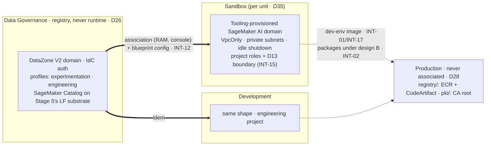

# Stage 6 — SageMaker Unified Studio

| | |
|---|---|
| **Status** | not started — **revised 2026-08-16 into the pass/verification format, against the official documentation and the `aws-ia` module re-read the same day.** Corrections folded in: the **Proves** row loses INT-09 and INT-13 (both need GitLab, which is Stage 7 — the old row contradicted the old body) and gains INT-02's consumer half; the two `sagemaker/` prerequisite slices, until now only *named* by `docs/plan/conventions.md` §6, get an owning step (2.1); steps 4-5 become amendments to Stage 3's parameterised `egress/` (its step 10) rather than fresh builds; the teardown debt is paid (the `layers.py` rows and the body Stage 2 step 8.6 left owing in `scripts/down-studio-apps.py`); and six doc facts replace beliefs — **`VpcOnly` is the default** (the control is a non-editable parameter, not a switch to find), the blueprint names (there is no "ML experience"; the per-project SageMaker AI domain comes from **Tooling**), disabling Athena **Spark** without killing Athena SQL is an SCP on `athena:StartSession`, idle shutdown is a Tooling-blueprint parameter with an admin-enforceable ceiling, the account association has **no public API**, and the required-endpoint list gained `datazone` |
| **Prerequisites** | Stage 3 (the per-role endpoint lists and the `egress_mode` switch of its step 10), Stage 4 (the tunnel; INT-16's portal half deliberately open), Stage 5 (the lake, the two shares proven by the pandas pair, **decision 6 — the grain — already taken**, and the 9.3 extension point in the derived-zone key policy). **Pulled forward and applied before this stage:** `production/registry/` (Stage 7 step 5 — under design B it is how packages arrive) and `production/pki/` (D36 — the `dev-env` image must be *built* with the CA root in it, INT-19) |
| **Consumes** | [D5](../decisions/D05-sagemaker-egress.md), [D12](../decisions/D12-budget-ceiling.md), [D13](../decisions/D13-lake-formation-enforcement.md), [D14](../decisions/D14-supply-chain-account.md), [D21](../decisions/D21-development-account.md), [D24](../decisions/D24-shared-filesystem.md), [D26](../decisions/D26-unified-studio.md), [D28](../decisions/D28-workflow-contract.md), [D35](../decisions/D35-sandbox-cardinality.md), [D36](../decisions/D36-internal-pki.md) |
| **Proves** | [INT-01](../integrations.md), [INT-02](../integrations.md) (the consumer half; the domain policy is Stage 7 step 5's, applied early), [INT-12](../integrations.md), [INT-15](../integrations.md), [INT-16](../integrations.md) (the portal half, provisional since Stage 4), [INT-17](../integrations.md). **Deferred to Stage 7 with the surface that needs it:** INT-09 (the `git clone` inside the `engineering` project) and INT-13 (CodeConnections) — GitLab does not exist before Stage 7 step 1 |

*Read with [`docs/plan/conventions.md`](../conventions.md) (naming, layout, `[P]`/`[D]`/`[E]`, IAM rules).*

**Forward constraint from D35:** the associated set is **N + 1** accounts (every unit's Sandbox plus
Development), each with its own blueprint configuration against the same single domain — write the
association and blueprint lists as maps keyed by consumer, never literals for unit 1. AWS's
**account pools** (`datazone create-account-pool`, CLI-only) are the native mechanism for account-agnostic
profiles; note it for [Stage 14](stage-14-sandbox-vending.md) and do not adopt it at N=1.

**Who does what, stated once:** **Claude** writes every slice, module and policy fragment, runs
`terraform fmt`/`validate`/`plan` and the read-only `aws/` scripts (`./aws/studio.py` is this stage's), and
drafts every console step with **every required field named** (Lesson 16). **The user** runs every
`terraform apply`, the step 0 probes (they write), the console association flow, the portal sign-ins, and
the docker build/push of 5.0. Steps below are tagged only where the split is not obvious from this rule.

---

**Objective:** the data scientist's working environment — one SageMaker unified domain (DataZone V2) with
projects (D26), hardened to the data perimeter, plus the D5 egress comparison it exists to host.

## What this stage builds, and in which accounts

**The sentence most easily misread, first:** the domain lives in **Data Governance**, and *no compute runs
there*. A domain is a registry — projects, profiles, blueprint configurations, the catalog. Blueprints
provision the working environments into whichever account the project profile names: **Sandbox** for
`experimentation`, **Development** for `engineering`. The D21 boundary comes out stronger: it stops being
"which URL did the person open" and becomes a property of the project.

| Where | What | Layer |
|---|---|---|
| `sandbox/sagemaker/`, `development/sagemaker/` (new, one module) | the blueprint **prerequisites**: provisioning + manage-access roles, the D13 permissions boundary, the VPC/subnet parameters, the KMS key | `[P]` |
| `data-governance/governance/` (new) | the DataZone V2 domain, its IAM roles, the two project profiles | `[P]` |
| `identity/sso/` (amended) | the step 3 deny fragment on the six persona sets | `[P]` |
| `sandbox/egress/`, `development/egress/` (amended) | design A: DNS Firewall + allowlist; design B: `egress_mode=B` + the CodeArtifact endpoints; the `datazone` endpoint under both | `[E]` |
| Domain portal + member-account consoles, by hand | the account associations — **no public API (read 2026-08-16)**: a RAM share the domain initiates | — |
| `scripts/` | `layers.py` rows for the three new slices; the body of `down-studio-apps.py` | — |

The four product mechanics behind these steps (Athena Spark's non-VPC default, the notebook identity
grain, `StartSession`, per-hour spaces) are `docs/plan/open-questions.md` items 12-15 — re-read against the
2026-08-16 documentation pass; each is answered at the step that owns it below.

## Step numbers are identifiers, not an order

Two numbers are **stable addresses cited from other files** — `step 1` (INT-16's portal half) from Stage 4
and `docs/plan/integrations.md`; `step 2` (the project-role grants) from Stage 5 step 9.3. They do not
change. The sequence to work in is **six passes**:

| Pass | # | What | Slice · layer | Applied as / by |
|---|---|---|---|---|
| **0** | 0 | the two preflights: the `CreateDomain` carve-out probe (both directions), the no-SageMaker plan reading | probes + a `plan` reading | probes: **user**; readings: Claude |
| **1** | 2.1-2.3 | the prerequisite slices: roles, boundary, KMS, params; the `layers.py` rows | `*/sagemaker/` `[P]` | `awsds-infra-sandbox-1`, `awsds-infra-dev` |
| **1** | 3 | the deny fragment: jobs off VPC, instance ceiling, `StartSession` scope | `identity/sso/` `[P]` | `awsds-infra-identity` |
| **1** | 5.0 | the hand-built `base`/`dev-env` images into the Production ECR | laptop, by hand | **user** (docker + push) |
| **2** | 1 | the domain, the associations, the blueprint configurations, the two profiles; the Athena Spark disable; INT-16's portal reading | `data-governance/governance/` `[P]` + console | `awsds-infra-data`; console halves: **user** |
| **3** | 2.4-2.7 | one throwaway project per profile: INT-15 (boundary), INT-17 (image), the step 7 reading | portal + readings | provision: **user**; readings: `./aws/studio.py` |
| **4** | 4, 5, 6 | egress design A, egress design B, the comparison — closes D5 | `egress/` `[E]` | the two Interactive infra profiles |
| **5** | 7, 8, 9 | the filesystem answer; idle shutdown + the teardown hook; observability | `nfs/`, profiles, `scripts/` | mixed |

Pass 2 cannot precede pass 1: the blueprint configuration in a member account names the provisioning role
and VPC parameters the `sagemaker/` slice creates. Pass 3 needs pass 2's profiles and pass 1's image (5.0).
Pass 4 needs pass 3: a design B measured without a working custom image is missing three of its four
ecosystems, and the comparison would be decided by a defect (INT-17).

---

## To execute

### 0. Preflight — prove the SCP lets this account through, before Terraform meets it

*Why: `DenyDataZoneDomainOutsideDataOu` (1c, organization root) was never exercised in either direction —
DataZone validates `--domain-execution-role` before authorization, so 1c's probe never reached the SCP. Its
condition is `ForAllValues:StringNotLike` on `aws:PrincipalOrgPaths`, and a `ForAllValues:` operator over a
key that does not populate evaluates **true** — if DataZone requests carry no org path, the deny catches
everyone, Data Governance included, and step 1 dies mid-apply in the account where a half-built domain is
hardest to unpick. One call now versus an evening later.*

**0.1 — Probe the positive half** — **user**, in **Data Governance** (`awsds-infra-data`), with a role
DataZone will accept (a throwaway role trusting `datazone.amazonaws.com`, or the module's own execution
role applied first): call `datazone create-domain` with `--domain-version V2`. Three distinguishable
outcomes:

| What comes back | What it means |
|---|---|
| the domain is created | the carve-out matches. **Delete it** (`datazone delete-domain`) so step 1 creates it properly, and carry on |
| `AccessDenied … explicit deny in a service control policy` | `aws:PrincipalOrgPaths` does not populate for DataZone. **Stop** — go to 0.3 |
| any DataZone validation error (`Cross-account pass role…`, trust failures) | the probe never reached authorization — the 1c outcome, and not evidence. Fix the role and retry (Lesson 21) |

**0.2 — Probe the negative half in the same sitting** — **user**, from any account outside the `Data` OU
(e.g. `awsds-infra-dev`): the same call must return the explicit-deny wording. Without it, 0.1's success is
equally consistent with the statement never firing anywhere — which would mean INT-12's forbidden
one-domain-per-account fallback is already open by accident. Read the wording, never the exit code.

**0.3 — Re-key the statement only if 0.1 denied**: fall back to `aws:PrincipalAccount` against the
enumerated Data Governance account. A root-document amendment runs **phases 1-3 of
[`docs/plan/runbooks/scp-battery.md`](../runbooks/scp-battery.md)** on the canary — never an edit made here.

**0.4 — Read the plan for the second premise: nothing SageMaker-shaped lands in the registry account** —
Claude. `sagemaker:Create*` is denied in Data Governance by `awsds-org-scp-ou-data` (1c step 7.6, measured),
which is free exactly because no blueprint is enabled there. A `terraform plan` of
`data-governance/governance/` showing any `aws_sagemaker_*`/`awscc_sagemaker_*` resource is the signal to
stop — **the correction is re-checking "no blueprint enabled in the domain account", never weakening the OU
document.** `./aws/studio.py` `US-2` keeps this read after the fact.

### 1. The unified domain — the registry, its associations, its profiles (D26, INT-12, INT-16)

*Why: everything else in this stage hangs off the domain — and every fact below was re-read on 2026-08-16,
because three of the old step's beliefs (blueprint names, VpcOnly as something to enable, association via
Terraform) were wrong in ways that would have surfaced mid-apply.*

**1.1 — Verify the Region coupling before creating anything** — Claude reads, user confirms: the domain
and IdC must share a Region for this project. *(Multi-Region became possible 2026-04, but only with an
external IdP connected to IdC — this project uses the native directory — and trusted identity propagation
does not cross Regions.)* Both are `us-west-2` if Stage 1 went as planned; neither can move afterwards.

**1.2 — Write `data-governance/governance/`** — Claude; apply: **user** as `awsds-infra-data`. The
official module is **`aws-ia/sagemaker-unified-studio/aws`** (v0.2.0, 2026-07-02; providers `aws ≥ 6.51.0`,
`awscc ≥ 1.89.0`, plus `random ≥ 3.8.1` and `time ≥ 0.13.1`): the domain is `aws_datazone_domain` with
`domain_version = "V2"` and IdC sign-on, plus the domain execution/service/query roles.
**Consume the module selectively, and this is verification (ii):** its root assumes a single account — it
*requires* `vpc_id`/`subnet_ids` and enables the Tooling blueprint in the domain account, which is exactly
what this design forbids (D22: no VPC there; 0.4's premise). Take the domain + IAM half (and its
`project-profile` submodule); the blueprint half lands in the *member* accounts (1.4). If the module cannot
be split that way, write the few resources directly — the resource types are known and small.

**1.3 — Associate Sandbox and Development, in the console** — **user**, from the domain's admin portal:
*Request association* to each account, then *Accept* in the member account. **There is no public
associate-account API (read 2026-08-16)** — DataZone creates the RAM share on your behalf
(`AWSRAMPermissionDataZoneDefault`), and invitations expire in **7 days**; Stage 1d's org-wide RAM sharing
is what should make acceptance frictionless — record whether an invitation still appears (the INT-11
shape). **Staging and Production are never associated** (D28). Record every field the console asks for
(Lesson 16). Answered as verification (iv) either way.

**1.4 — Enable the blueprints in each associated account, and only there** — Claude writes, **user**
applies as that account's profile: `aws_datazone_environment_blueprint_configuration` (the same resource
the module uses) per member account, naming the provisioning role, the manage-access role and the
`regional_parameters` (`VpcId`, `Subnets`, `AZs`) **from the `sagemaker/` slice outputs of 2.1 — read
through `terraform_remote_state`, never pasted**. Enabled set and no others: **Tooling** (mandatory — it is
what provisions each project's SageMaker AI domain, roles and security groups), **LakehouseCatalog**
(and/or `LakeHouseDatabase`, API name `DataLake` — decision 4), and **EMRServerless** (decision 1, the
VPC-capable Spark runtime). **Never `RedshiftServerless`** (D26/D12). `AmazonBedrockGenerativeAI`,
`Workflows` and `MLExperiments` stay off (decision 5 — Workflows is Stage 10's surface, D7/D28).
**The console recommends ≥ 3 subnets in 3 AZs; D9 built 2 — verification (iii)**, answered before anything
is layered on the answer.

**1.5 — Create the two project profiles, from the domain account** (only domain admins there can —
documented): **`experimentation`** provisioning into Sandbox, **`engineering`** into Development. Their
names are a contract with `./aws/studio.py` (`US-4`). In each profile's Tooling parameters, set and mark
**non-Editable** (the *Editable* flag is what makes a value a control instead of a default, Lesson 5):
`sagemakerDomainNetworkType = VpcOnly` (**the default — the parameter exists so nobody can flip it to
`PublicInternetOnly`**), the step 8 idle-shutdown set, and `maxEbsVolumeSize`. Decide
`enableTrustedIdentityPropagationPermissions` here — decision 2, the mechanism behind Stage 5's grain
decision, with a documented cost: **remote access does not work with TIP enabled**.

**1.6 — Disable Athena Spark without disabling Athena SQL** — decision 3. The documented "disable" is
three controls, and only one is preventive *and* precise: a deny on **`athena:StartSession` +
`athena:UpdateSession`** (the Spark-session surface; SQL uses `StartQueryExecution`, which D13 depends on).
The Tooling blueprint's Athena flag is the blunt one — it removes SQL too — so it stays on. Land the deny
in `awsds-org-scp-ou-interactive` through **battery phase 4b** (an SCP amendment, never a direct edit;
no carve-out needed — nobody legitimately runs Athena Spark), and mirror it in 2.1's boundary. Record in
`POLICIES.md` in the same sitting.

**1.7 — Read INT-16's portal half, at the first moment the surface exists** — **user**, browser: does the
portal open with the tunnel down? Record the observed behaviour either way, against Stage 4's three-roles
frame — a negative is fallback (ii) of INT-16 restated, not a stage failure. **Fallback (i) gained a
documented candidate (2026-08-16):** AWS's network-isolation page ships a deny for the **domain execution
role** conditioned on the caller's network (`aws:SourceVpc` + `aws:ViaAWSService=false` in the doc's shape)
— re-keyed on `aws:SourceIp` = the WireGuard EIP list, it is the first mechanism that reaches the portal's
own session. Evaluate it here; adopt it only with the on-behalf carve-out proven (Stage 4's pair).

### 2. The project roles — prerequisites, the D13 boundary, INT-15

*Why: D13 is only real if the execution role's S3 reach can be constrained, and D26 moved role authorship
to a blueprint (Lesson 11). This step builds the one mechanism least likely to be overwritten — a
permissions boundary delivered from a slice this repository owns — and then measures whether it survives.*

**2.1 — Write the `sagemaker/` prerequisite module and its two slices** — Claude: `sandbox/sagemaker/` and
`development/sagemaker/`, one module. Contents: the blueprint **provisioning role** and **manage-access
role** (CloudFormation trust, per the associated-accounts doc), the account's **KMS key** for project
resources, the exported **VPC/subnet/SG parameters** 1.4 consumes, and the **D13 boundary policy** —
name contract `awsds-<env>-project-boundary` (`./aws/studio.py` `US-8`): no `s3:*` on Lake
Formation-registered prefixes (D13), the step 3 conditions mirrored, and the drop-box `PutObject` allowed
(D18). The slice declares **prerequisites only — never a project environment**: DataZone owns those, and a
Terraform resource for them would fight the blueprint (conventions §6).

**2.2 — Add the machinery rows in the same sitting** — Claude: `RANKS` entries and `SLICES` rows in
`scripts/tfhygiene/layers.py` for `sagemaker` and `governance` (all `[P]`, rank after `foundation`) —
a slice with no row fails `make check`, and a name with no rank raises at import.

**2.3 — Apply both slices** — **user**, as `awsds-infra-sandbox-1` and `awsds-infra-dev`.

**2.4 — Provision one throwaway project per profile** — **user**, in the portal, after pass 2. This is the
measurement instrument for INT-15, INT-17 and step 7 — three questions, one project, before anything is
built on top.

**2.5 — Read back what the blueprint attached, and whether the boundary holds** — Claude:
`./aws/studio.py` §6 lists every `datazone`-named role and its boundary (`US-8`). If the blueprint-created
roles arrive **without** the boundary, attach it through the slice (or IAM) and **re-run the script after
the next blueprint reconciliation — the diff is INT-15's survival half.** If nothing holds, follow INT-15's
fallback chain in order, and record the outcome as an incomplete control rather than widening D13.

**2.6 — Extend Stage 5's extension point to the real role names** — Claude writes, **user** applies: the
derived-zone key policy `Decrypt` and the scoped `PutObject` that Stage 5 step 9.3 left with a comment
naming this step. A diff, not a redesign — that was the point of the extension point.

**2.7 — Record the INT-15 answer either way** — in the log and in `docs/plan/integrations.md`: what a
blueprint-provisioned role carries, and whether an imposed boundary survived.

### 3. What a notebook can create — the deny fragment (open questions 12/14)

*Why: a VPC-only domain constrains Studio itself, not the training/processing jobs a notebook launches
through the API with their own network config. Without this step the whole VPC design is one API call away
from being bypassed — and one `ml.p4` parameter away from USD 30/hour.*

**3.1 — Write a new shared fragment in `identity/sso/`** — Claude; apply: **user** as
`awsds-infra-identity`. Two Sids, contracts with `./aws/studio.py` (`US-9`), reaching the **six persona
sets in one diff** (the Stage 4 step 8.2 shape — Lesson 14):

- **`DenySageMakerJobsOffVpc`** — deny job/app creation when `sagemaker:VpcSubnets` /
  `sagemaker:VpcSecurityGroupIds` are null; require `sagemaker:NetworkIsolation`,
  `sagemaker:InterContainerTrafficEncryption`, `sagemaker:VolumeKmsKey` where the workload class carries
  them.
- **`DenySageMakerInstanceCeiling`** — `sagemaker:InstanceTypes` allow-list (the key covers `CreateApp`,
  `CreateSpace`, `UpdateSpace`, `CreateTrainingJob` — read 2026-08-16), the only control that stops an
  oversized instance inside its first hour.

**Mirror both statements in 2.1's boundary** — the persona set governs humans, the boundary governs the
project roles the blueprint writes.

**3.2 — Scope the remote-IDE channel instead of denying it** (open question 14): adopt AWS's documented
SMUS policy — `sagemaker:StartSession` on `space/*` conditioned on
`aws:ResourceTag/AmazonDataZoneProject = ${aws:PrincipalTag/AmazonDataZoneProject}` and
`aws:ResourceTag/AmazonDataZoneUser = ${aws:PrincipalTag/datazone:userId}` — a user attaches only to their
own space. Record the residual for Stage 11's threat model: remote sessions authenticate with **IAM
credentials even in IdC domains and persist up to 12 h after portal logout**, and the kill-switch, if ever
needed, is the `sagemaker:RemoteAccess` condition key on `CreateSpace`/`UpdateSpace`.

**3.3 — Prove the deny pair** — **user**, from a data-scientist session: a job submitted with no VPC
config fails naming the policy; the same job inside the VPC with an allowed instance type runs. Read the
wording, not the exit code.

### 4. Egress design A — allowlist on the NAT path (D5, `docs/plan/architecture.md` §4.3)

*Why: half of the comparison D5 exists to settle. Stage 3 already built the NAT behind `egress_mode=A`;
what this step adds is the control that makes it "limited internet" instead of internet.*

**4.1 — Add the Route 53 Resolver DNS Firewall to the two Interactive `egress/` slices** — Claude writes,
**user** applies: a rule group with an explicit domain allowlist — PyPI, conda, CRAN, the Julia package
server, crates.io, the distro mirrors, `gitlab.prod.internal` — default-deny with the block action logged.
Priced and measured (`docs/PRICING.md` §7): USD 0.0005/name-month + USD 0.60/1M queries — cents.

**4.2 — Add the `datazone` interface endpoint to both Interactive lists** (Stage 3 step 8.7's candidate,
now **required** by the network-isolation doc), and measure — not copy — the rest of AWS's required list
(`ec2`, `secretsmanager`, `ssm`/`ssmmessages`, `q`): add only what verification (viii)'s flow-log reading
shows exercised. Every entry is +USD 0.010/h per account, and AWS's list covers features this design does
not enable.

**4.3 — Run a working session and record what breaks** — **user**: the design A half of step 6's evidence.

### 5. Egress design B — no NAT at all (D5, INT-02)

**5.0 — Build and push the first `base`/`dev-env` images by hand** — **user**, laptop, pass 1. The one
place in the plan where an artifact reaches an account without a pipeline: acceptable exactly once, at
bootstrap, replaced by Stage 8's pipeline building the same `Dockerfile`s. Requirements the image must
already carry: the **CA root** (INT-19 — read the certificate from `production/pki/` outputs, never the
key), the **SMUS BYOI specification** (base on `jupyterlab/default`, health check on 8888) and the
**activity-monitor extension** — without it step 8's idle shutdown cannot see activity (SageMaker
Distribution v2+ behaviour, read 2026-08-16). `docker login` to the Production ECR through the tunnel, tag
immutably, push as `awsds-prod-ecr-dev-env`. **Record the digest in the log** so the Stage 8 changeover is
visible.

**5.1 — Make the image selectable in the throwaway project — INT-17, before the comparison starts.** The
attachment point (read 2026-08-16) is the **Tooling-provisioned SageMaker AI domain** in the member
account: image + image version + app image config, then the domain's `CustomImages` — the
`sandbox/dev-env/` and `development/dev-env/` slices of conventions §6, applied here for the first time.
Two things only execution can answer — verification (vi): whether the update **survives a blueprint
reconciliation** (INT-15's question, one resource over), and whether the image pulls **cross-account from
the Production ECR at all** — same-Region is documented as required and cross-account is documented only
for RStudio, so expect INT-01's fallback (an ECR replication rule into each Interactive account, not a
pipeline) to be the real path. Record the working mechanism — Stage 8 step 1 is written against it.
Machinery, same sitting: `RANKS["dev-env"]` and the two `[P]` rows in `scripts/tfhygiene/layers.py` —
a slice with no row fails `make check` (added 2026-08-16, by the Stage 8 revision: this step applies the
slices first, so the rows are its to add).

**5.2 — Flip the switch: `egress_mode=B` in the two Interactive accounts** — **user** applies: no NAT
route at all; the CodeArtifact endpoints from Stage 3 step 8.4; packages from CodeArtifact (cross-account
from Production — **INT-02's consumer half proven here**), images per 5.1. Julia, R and Rust arrive
pre-installed in the dev-env image (`docs/plan/architecture.md` §4.3) — confirm Cargo against CodeArtifact
(open question 5).

**5.3 — Answer the two questions Stage 3 deferred here** — Claude reads, user provokes: whether the AL2023
mirror-list path matters under B at all (no EC2 lives in the Interactive private subnets; record where the
answer lands), and whether `lakeformation` is ever called from the VPC in these flows or leaves Stage 3's
core endpoint list (its verification (ii)). Both from the flow logs of a working session.

### 6. The comparison, and the verdict that closes D5

**6.1 — Measure both designs on the same working session**: hourly cost (from `./aws/egress.py` §6 plus
the app-hours), what breaks in a normal session, how long the "I need package X right now" loop takes
under each (design B's loop includes the Stage 8 gate once it exists), and what a deliberate exfiltration
attempt achieves (DNS-name filtering is bypassable by raw IP under A; B has no path to misuse).

**6.2 — Write the verdict into `docs/plan/architecture.md` §4.3 and close D5** — **mark the rebuild-loop
number provisional**: it is measured against a hand-built image here and re-measured against the Stage 8
pipeline. The choice is made here; the number behind it is confirmed there.

### 7. The shared-filesystem answer (D24) — a reading first, a build only if it survives

*Why: D24 and the NFS objective were written against classic Studio's `DefaultUserSettings` EFS attach.
**SMUS documents no custom-filesystem attach at all** (read 2026-08-16: project storage is S3 shared
locations, git, and per-space EBS) — so this step is a verification with fallbacks, not a build with a
parameter.*

**7.1 — Verify against the deployed blueprint, not the docs alone** — Claude reads the throwaway project's
domain and the Tooling parameter list for any custom-FS surface; **user** tries the documented SageMaker AI
platform mechanism only if one appears. Editing the blueprint's domain out-of-band (`update-domain` with
`CustomFileSystemConfigs`) is an undocumented mutation of a managed resource — treat it as fallback, not
path.

**7.2 — Fall back in order, recording which held:** (i) mount the Stage 5 EFS from inside the app with the
mount helper, if the container has the SG path — the interface becomes a documented command; (ii) restrict
the NFS objective to its stated use — exchanging files between *users*, SageMaker and S3 — noting the
laptop mount over the tunnel (Stage 5 step 11) already delivers two of the three; (iii) accept S3 as the
exchange path from project compute and record the reduction in `docs/plan/institutional-delta.md`, beside
the existing Development row.

### 8. Idle shutdown and the teardown machinery (D11, open question 15)

*Why: "as many spaces as they like" is billed by the hour, and D11 is a property of the design, not of the
user's habits. Two halves: the product's own idle shutdown, and this repository's `make down`.*

**8.1 — Enforce idle shutdown through the Tooling parameters, non-Editable** (with 1.5):
`lifecycleManagement` on, `idleTimeoutInMinutes` (60 is a reasonable start), **`maxIdleTimeoutInMinutes` as
the admin ceiling** the user cannot raise. The detection half rides on 5.0's activity-monitor requirement.
`./aws/studio.py` `US-7` reads it back per domain.

**8.2 — Write the body of `scripts/down-studio-apps.py`** — Claude — paying Stage 2 step 8.6's debt: for
the env's discovered SageMaker AI domains, `ListApps` → `DeleteApp` (and the enclosing spaces), through the
account's own profile. The stub already fails loudly the moment a domain exists, so this lands **before**
the first `make down` after pass 3.

**8.3 — State the layers, and what `make down` touches:** the DataZone domain, the profiles, the
`sagemaker/` prerequisites and the per-project SageMaker AI domains are **`[P]`** (metadata-priced or free
at rest; destroying them would orphan home storage and churn every ID); **only running apps are `[E]`**,
deleted by 8.2 through SageMaker, never through DataZone, which owns no compute. Project home directories
are **scratch by policy** — notebooks live in git, data in S3, shared files on the Stage 5 EFS. State this
to users explicitly.

**8.4 — Prove the lifecycle** — **user**: `make down ENV=sandbox` deletes the running apps and touches
nothing `[P]`; `make up` restores the session; `./aws/studio.py` diffed across the cycle shows only
timestamps and app rows changed.

### 9. Observability

**9.1 — Create the log groups deliberately** — Claude writes, **user** applies: `/awsds/<env>/studio` at
30-day retention (matching Stage 3's flow-log decision) and confirm app/space logs land in named groups
rather than default ones that never expire; a metric on running-app count per account is the cheap
instrument for the step 8 risk.

---

## Deliverables

Each is written so its output differs between working and broken (Lesson 13). **The mechanical half is
`./aws/studio.py`** ([`aws/INDEX.md`](../../../aws/INDEX.md)), written for this stage: the one V2 domain in
the one right account, no domain anywhere else, the blueprint set with Redshift absent, the two profiles,
VpcOnly + idle shutdown per runtime domain, the boundary on every project role, the deny Sids in all six
persona sets, images, apps, EFS access points. The behavioural proofs are the stage's own (Lesson 20):

- **The working session:** sign in through the VPN, open the portal, work in `experimentation` (compute in
  Sandbox) and `engineering` (compute in Development), install a package, read the Stage 5 lake table
  through Athena over the LF share — surfaced as a subscribed asset in SageMaker Catalog — and exchange a
  file per step 7's outcome.
- **The egress pair, under each design:** a non-allowlisted site is unreachable under A (and the block is
  logged); no site at all is reachable under B — while the package path and the lake read still work.
  Plus the written comparison, rebuild-loop marked provisional.
- **The deny pair (step 3):** the off-VPC job and the oversized instance both fail naming the policy; the
  compliant job runs.
- **The lifecycle:** `make down`/`make up` with only apps changing (8.4).
- **Two negative deliverables, recorded as results:** nothing was provisioned into Data Governance by any
  blueprint (`US-2`), and INT-15's answer, whichever way it went.
- **INT-16's portal half recorded** (1.7), closing the row Stage 4 left provisional.

## Validation

1. Run `./aws/studio.py` — all `US-*` pass; diff two runs either side of the lifecycle cycle.
2. Re-run `./aws/org-policies.py` and the battery phase the amendments used (0.3's phases 1-3 if the
   re-key happened; 1.6's phase 4b) — never a direct edit; review `POLICIES.md` in the same sitting.
3. Run `./aws/egress.py` at both ends of every comparison session — §6 zero everywhere afterwards.
4. Read every deny by its wording, never its exit code (standing rule since 1c).

## Cost

| Item | Cost | Note |
|---|---|---|
| DataZone V2 domain at rest | ~USD 0.50/month | metadata rates, `docs/PRICING.md` §5 — already a floor row |
| JupyterLab / Code Editor app | ~USD 0.050/h per running app (`ml.t3.medium`) | the step 8 controls exist for this line |
| EMR Serverless (decision 1's runtime) | USD 0.0526/vCPU-h + 0.0058/GB-h (x86, measured) | replaces Athena Spark's 0.35/DPU-h default; billed only while a session runs |
| DNS Firewall (design A) | ~USD 0.03/month + USD 0.60/1M queries | measured 2026-08-16, `docs/PRICING.md` §7 |
| `datazone` endpoint (+ any 4.2 additions) | +USD 0.010/h each, per account | the Stage 3 hourly table moves accordingly |
| dev-env images in ECR | ~USD 0.10/GB-month | inside the existing ECR floor row |

## Decisions due while executing

**Blocking questions for the user: none.** Each is decided during the stage and written into
`docs/log/log-stage-06-unified-studio.md` (Lesson 16). Recommendations stated so the keyboard is not the
decision-maker.

1. **The notebook Spark runtime replacing Athena Spark** (1.4, open question 12) — EMR Serverless or Glue
   interactive sessions, both VPC-capable. Recommended: **EMR Serverless** — per-vCPU/GB metering with an
   ARM option (measured, `docs/PRICING.md` §5) against Glue's 1-DPU minimum; Glue stays available through
   the core endpoints either way. Record what the replacement costs against the free default it displaces.
2. **`enableTrustedIdentityPropagationPermissions`** (1.5, the grain — Stage 5 decision 6's mechanism) —
   recommended: **follow the grain Stage 5 chose**. If per-user on the SQL path, enable it and accept the
   documented cost — **remote access does not work with TIP enabled** — recording which objective yielded;
   if project-grain, leave it off and keep remote access.
3. **The Athena Spark disable set** (1.6) — recommended: the `athena:StartSession`/`UpdateSession` SCP via
   battery phase 4b **plus** the boundary mirror; leave the Tooling Athena flag on (it would remove Athena
   SQL, the D13 path).
4. **Which Lakehouse blueprint(s) the catalog/SQL surface needs** (1.4) — `LakehouseCatalog`,
   `LakeHouseDatabase` (`DataLake`), or both. Recommended: start with **LakehouseCatalog** alone and add
   the other only when a concrete surface asks for it — never `RedshiftServerless`.
5. **The blueprints deliberately left off** (1.4) — recommended: `Workflows` waits for Stage 10 (D7/D28:
   one surface), `AmazonBedrockGenerativeAI` and `MLExperiments` wait until the AI-models objective is
   exercised, priced first (Lesson 6; token- and on-demand-billed).

## Verifications to answer while executing

Record every answer, including the ones that come out fine.

| # | Question | Step |
|---|---|---|
| i | Does the `CreateDomain` carve-out admit Data Governance **and** deny an Interactive account, by wording? | 0.1, 0.2 |
| ii | Can the `aws-ia` module be consumed with no VPC in the domain account — or is the domain written directly? | 1.2 |
| iii | Does the blueprint configuration accept D9's two AZs, or does the ≥3-subnet recommendation bind? | 1.4 |
| iv | Is there any API/Terraform path for the account association, or console-only as documented? | 1.3 |
| v | Does the D13 boundary survive a blueprint reconciliation (INT-15) — diff of two `./aws/studio.py` runs? | 2.5 |
| vi | Which call makes the dev-env image selectable, does it survive reconciliation, and does the cross-account pull work at all (INT-01/INT-17)? | 5.1 |
| vii | Does the portal open with the tunnel down (INT-16's portal half) — and does the domain-execution-role deny candidate hold with the on-behalf carve-out intact? | 1.7 |
| viii | Does a VPC-only space start on our endpoint set, and which of AWS's required list (`ec2`, `secretsmanager`, `ssm*`, `q`) do the flow logs show exercised? | 4.2 |
| ix | Under design B: does anything miss the AL2023 mirror path, and does `lakeformation` leave Stage 3's core list (its verification (ii))? | 5.3 |
| x | Does idle shutdown actually fire on the hand-built image (the activity monitor working)? | 5.0, 8.1 |
| xi | Does `down-studio-apps.py` delete every running app, and does the lifecycle diff hold? | 8.2, 8.4 |

## Risks

- **The module's single-account shape (verification ii)** is the likeliest early surprise: budget for
  writing the domain resources directly rather than fighting the module.
- **The association is console-only with a 7-day invitation window** — a rebuild has a by-hand step in its
  middle; it is recorded, not hidden, and it is once per account, not per session.
- **The 3-AZ recommendation (verification iii)** could force a third private subnet per Interactive VPC —
  address space exists (Stage 3's plan), so the cost is an amendment, not a rebuild; do not re-cut D9
  pre-emptively.
- **TIP versus remote access (decision 2)** reaches two `CLAUDE.md` objectives at once; whichever yields is
  recorded as a scope statement, not discovered by a user with a broken IDE.
- **Cross-account BYOI is undocumented for this path** — expect INT-01's replication fallback, and cost the
  comparison accordingly: a design B without the custom image is not design B.
- **Every running app is an hourly bill nobody watches** (D12 skipped the alerts): the controls are step 8,
  `./aws/egress.py` §6 at session end, and `US-10`.

---

*Stage index: [stages/INDEX.md](INDEX.md) · Plan core: [GENERAL_PLAN.md](../../GENERAL_PLAN.md)*
