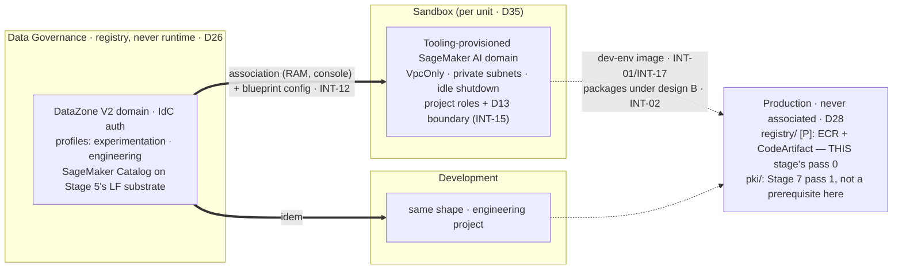

# Stage 6 — SageMaker Unified Studio

| | |
|---|---|
| **Status** | **PASSES 0 THROUGH 2 EXECUTED 2026-08-21, across three sittings — the registry, the blueprint prerequisites, the step 3 deny fragment, 1.6's SCP amendment, the domain, the two associations, the blueprint configurations (11 per member after the same-day ToolingLite re-cut) and the TWO PROJECT PROFILES are applied** — **and pass 1 CLOSED a day later, on 2026-08-22, when step 5.0 built and pushed `default-v0.1.0`** into both repositories from one buildbox session, the same day `grants.tf` was applied. **So passes 0-2 span two dates and four sittings**, and nothing in them is owed. Detail: §"What ran on 2026-08-21" below, which is the only place the results are written. **The stage is NOT closed** — passes 3-5 are open, **0.1a AND 1.6's probes BOTH RAN the same day and both came out clean** — verification (i) is answered in both directions and the battery reads 25/0/7. **Both items that clause used to name closed on 2026-08-22**: step 5.0's push ran in one buildbox session (`default-v0.1.0` read back live in **both** `awsds-prod-ecr-base` and `awsds-prod-ecr-dev-env`), and step 1.7's console contrast closed INT-16's attribution. **What is left owed is passes 3-5 plus 5.1 — less most of pass 4, which ran out of order on 2026-08-22/23**: 4.1 is applied in Sandbox and revised twice (`vpc-egress-v0.3.0` — the module default is now EMPTY and each Interactive slice declares its own measured list), and **4.3 RAN**, delivering the finding the whole design turns on: DNS Firewall evaluates the whole resolution chain, so an allow-list carries indexes and no CDN-backed artifact host, and **pip downloads, cargo, rustup, CRAN, apt and ECR Public have no path under design A**. What pass 4 still owes is 4.2's measurement half, **4.2's amendment of 2026-08-24 — the `datazone` entry entered on a misread, its private zone breaks the portal on-VPN, and its removal is recommended and pending the user (the step body carries it; Lessons 40-42)** — and 4.3's friction reading — the association's gate is fully consumed (2b/2c/2d), the create path is measured end to end (the owed table's project-retry row, 2026-08-22) and the off-VPN reading is DONE in its strong form (the owed table's off-VPN row) — plus two residues that are not steps: **the fallback-(i)-versus-recorded-acceptance choice INT-16 now feeds, deferred by the user to another session** (stated, never presumed), and the off-VPN probe project's teardown, owed-to-confirm (running apps meter hourly). — **Earlier: RE-CUT 2026-08-21 (second sitting that day), after the pull-forward clause was audited and found to have never been executed.** The audit is the finding: `git log -S` puts the clause in one docs-only commit of 2026-08-16, and `git log --diff-filter=ADR` over `terraform-live/production/pki*` and `…/registry*` is empty across every ref — the two slices were never added, never removed, never attempted, and no file anywhere records a reason, because there was no event to record. **What changed here:** `production/registry/` is re-cut to the half this stage actually consumes (Stage 7 step **5.a**) and becomes **this stage's pass 0**, with a row in the build table, a row in the pass table and a sentence in the ordering paragraph — the three places an executor reads, none of which had ever mentioned it; `production/pki/` **leaves this stage entirely** for Stage 7 pass 1, D36 §3 amended, D36 dropped from the Consumes row, and step 5.0's image loses the CA root and keeps the empty layer that will take it at Stage 7 step 2.6; the pull-through cache and the per-application ECR repositories stay Stage 7's (5.b). **Also recorded, because a previous sitting pre-declared the trigger:** this is the **third** occurrence of *prose describing state, written from the intention rather than from a reading* — after the `CLAUDE.md` VPN bullet (Stage 4's log) and this file's own "step 0 is now runnable" (2026-08-21, first sitting) — and the first of the three that survived five days and two reviews. **Earlier: REVISED 2026-08-20 against Stage 5 as CLOSED, and against the live organization** (multi-agent sweep: 23 candidate defects, 9 survived adversarial verification, 14 refuted; the refutations are in that sitting's log entry so they are not re-raised). What changed: **the pass table filed 1.6 under `data-governance/governance/`/`awsds-infra-data`, which cannot update an Organizations document at all** — 1.6's own body says `awsds-org-scp-ou-interactive` through battery phase 4b, so it is now its own row on `identity/org-policies/`/`awsds-infra-identity` (`INV-15`; Lesson 35, the trap 4e hit); **2.6 prescribed widening `data_scientist_role_arn`, which is the single-string `principal` of three `aws_lakeformation_permissions`** — either a plan-time failure or a silent fan-out of the persona's re-grants, now a NEW list input; **decision 6's argument rested on a false premise** (that a project's own workgroup writes into the derived zone) whose unsound half hid a **fourth** designed destination outside the CMK rule, the expiry and Stage 11's declared scope; **4.2's `s3` entry is a measurement, not a provisioning choice**, and flow logs cannot answer it — two new verification rows, (xviii) and (xix), and two conditional slice amendments now budgeted in the build table; the Prerequisites row stops asserting a clean inheritance (**open question 19 — the crawler demander — is read before 2.1**); and **step 0 was made runnable, RUN the same day, and did not close**: the four live pre-checks stand, but no CLI shape — real role, the conventional name, trust with and without `aws:SourceAccount`, V2 and V1 — clears `CreateDomain` validation in either account (`Cross-account pass role is not allowed`, byte-identical, both directions), so **the carve-out probe now rides step 1.2's creation act with a CloudTrail-shaped canary replay (0.1a)**, and 1.2's plan B is console-create + `terraform import`, the Stage 2 adopted-none-created precedent. 0.2 had also moved off Development onto `Policy Canary`, which the `safety` rule required all along. `docs/SMUS.md` was corrected in the same sitting (its three-bucket table listed a *workgroup* as a bucket). **Earlier: revised 2026-08-16 into the pass/verification format, against the official documentation and the `aws-ia` module re-read the same day.** Corrections folded in: the **Proves** row loses INT-09 and INT-13 (both need GitLab, which is Stage 7 — the old row contradicted the old body) and gains INT-02's consumer half; the two `sagemaker/` prerequisite slices, until now only *named* by `docs/plan/conventions.md` §6, get an owning step (2.1); steps 4-5 become amendments to Stage 3's parameterised `egress/` (its step 10) rather than fresh builds; the teardown debt is paid (the `layers.py` rows and the body Stage 2 step 8.6 left owing in `scripts/down-studio-apps.py`); and six doc facts replace beliefs — **`VpcOnly` is the default** (the control is a non-editable parameter, not a switch to find), the blueprint names (there is no "ML experience"; the per-project SageMaker AI domain comes from **Tooling**), disabling Athena **Spark** without killing Athena SQL is an SCP on `athena:StartSession`, idle shutdown is a Tooling-blueprint parameter with an admin-enforceable ceiling, the account association has **no public API**, and the required-endpoint list gained `datazone`. **Revised 2026-08-17: the user withdrew the NFS requirement from `objectives.md` (D24 withdrawn) — step 7 is removed, and pass 5 is steps 8-9.** **Revised again 2026-08-19, after re-reading the network-isolation page and the 2026-04 Athena Spark PrivateLink release ahead of decision 3** (sources in `docs/REFERENCES.md`): 1.6 rewritten — the three controls re-characterised (the Tooling flag is **non-retroactive** as well as blunt; the doc's third control is *grant*-shaped on blueprint-authored policies, so 2.1's boundary is a **deviation to record**), a fourth free network-layer lever named, and the announcement's scope written down so the question is not re-opened by its title; 1.7 gains the **third** condition the earlier reading missed (`aws:userid` `*:user-*` — the on-behalf carve-out is already in AWS's shape); 4.2 gains the **full** required-endpoint table and the `us-east-1`-only Q endpoint that design B cannot reach; **decision 1 reopened** on an endpoint-count cost the compute comparison never saw. **Three of the five execute-time decisions are CLOSED pre-stage (2026-08-19, the log's first two entries): 3 (Athena Spark off by SCP, at 1.6), 4 (`DataLake` alone — the re-read found `LakehouseCatalog` RMS-backed) and 5 (the blueprint allow-list in three categories, `docs/SMUS.md`)**; decision 1 is reopened — **its number corrected and an FGAC counter-axis added later the same day: settled in-stage by two readings (decision 1's own row)** — decision 2 (TIP) waits for execution. **A sixth execute-time decision ADDED 2026-08-19 (chat discussion with the user): the derived zone's per-project prefix shape — project-first against family-first; recommendation family-first, settled at 2.6 and only after INT-15's measurement (its row below)** |
| **Prerequisites** | Stage 3 (the per-role endpoint lists and the `egress_mode` switch of its step 10), Stage 4 (the tunnel; INT-16's portal half deliberately open), Stage 5 (the lake, the two shares proven by the pandas pair, **decision 6 — the grain — already taken**, and the 9.3 extension point in the consumer data-key policy). **Stage 5 pass 4 is a hard predecessor and was not one until 2026-08-19**: each member account needs its own `DataLakeSettings` — a data lake administrator, or the share stays invisible there, and the create-defaults cleared *before* any blueprint creates a catalog object in that account (1.4's callout). **SATISFIED 2026-08-19 for both member accounts** — pass 4a/4b applied the settings under Recipe D and `DL-6` reads clear in Sandbox and Development, so verification (xv) below now has a *measured* precondition rather than an assumed one. **4c was DELIVERED 2026-08-19** — the seven persona statements are applied in `identity/sso/` (the Athena run family on the two workgroup ARNs, the derived zone's three prefix families, the drop-box write's identity half and the lake-key KMS pair). **4d AND 4e are DELIVERED (2026-08-20)** — every behavioural proof ran, the pandas pair included, and 4.3's `athena:StartQueryExecution` amendment is applied into `DenyUserCompute`, which **1.6 below rides on and may now assume**. So the "two shares proven by the pandas pair" clause above **is true**, measured, and this stage may read it as satisfied — *the sentence this replaces said the opposite and was correct until that date.* **Stage 5 is closed entirely**, pass 6 included (Security Hub CSPM, 2026-08-20). **Two things outlive it, and only one of them is inherited here.** Its step 13.3 triage touches nothing this stage consumes. The crawler residue does: **open question 19 — the demander** — an input owed by the user, with Stage 5's verification (iv) (the compute-free trigger shape) as its measured half. **Read it before 2.1 hands a notebook the drop-box write**: the write itself is measured working, and *nothing catalogues what lands there* until that question is settled. **THE PULL-FORWARD, RE-CUT 2026-08-21 AFTER IT WAS AUDITED — the sentence this replaces claimed both slices were "pulled forward and applied", and nothing was ever behind it:** the clause entered on 2026-08-16 in a docs-only commit, and `git log --diff-filter=ADR` over both paths is **empty across every ref** — neither slice has ever existed in version control. Re-cut by consumer: **`production/registry/` IS a prerequisite, and is now THIS stage's pass 0** — the ECR `base`/`dev-env` repositories, CodeArtifact and the consumer-facing policies, authored under **Stage 7 step 5.a** and applied here, because step 5.0 pushes into them and design B reads packages from them (INT-01, INT-02's consumer half). **`production/pki/` is NOT a prerequisite and has gone back to Stage 7 pass 1** (D36 §3 amended the same day): the CA root's only Stage-6-time consumer was the image build, and what that image would trust with it — `gitlab.prod.internal`, `*.pages.internal` — does not exist until Stage 7, whose own step 2.4 defers the leaves for exactly that reason. **So 5.0's image carries no CA root**; it takes one at Stage 7 step 2.6, in the sitting that first has something to clone (INT-09, already deferred there) |
| **Consumes** | [D5](../decisions/D05-sagemaker-egress.md), [D12](../decisions/D12-budget-ceiling.md), [D13](../decisions/D13-lake-formation-enforcement.md), [D14](../decisions/D14-supply-chain-account.md), [D21](../decisions/D21-development-account.md), [D26](../decisions/D26-unified-studio.md), [D28](../decisions/D28-workflow-contract.md), [D35](../decisions/D35-sandbox-cardinality.md). **[D36](../decisions/D36-internal-pki.md) was dropped here on 2026-08-21**, and the drop is the readable half of the move: with the CA root out of 5.0's image this stage consumes nothing D36 decides, which is why D36's own *Referenced by stages* row — which never listed Stage 6 — becomes correct rather than stale |
| **Proves** | [INT-01](../integrations.md), [INT-02](../integrations.md) (the consumer half; the domain policy is **Stage 7 step 5.a's, applied at this stage's pass 0** — reworded 2026-08-21 from "applied early", which read as a thing already done), [INT-12](../integrations.md), [INT-15](../integrations.md), [INT-16](../integrations.md) (the portal half, provisional since Stage 4), [INT-17](../integrations.md). **Deferred to Stage 7 with the surface that needs it:** INT-09 (the `git clone` inside the `engineering` project) and INT-13 (CodeConnections) — GitLab does not exist before Stage 7 step 1 |

*Read with [`docs/plan/conventions.md`](../conventions.md) (naming, layout, `[P]`/`[D]`/`[E]`, IAM rules).*

**Forward constraint from D35:** the associated set is **N + 1** accounts (every unit's Sandbox plus
Development), each with its own blueprint configuration against the same single domain — write the
association and blueprint lists as maps keyed by consumer, never literals for unit 1. AWS's
**account pools** (`datazone create-account-pool`, CLI-only) are the native mechanism for account-agnostic
profiles; note it for [Stage 14](stage-14-sandbox-vending.md) and do not adopt it at N=1.

**Who does what, stated once:** **Claude** writes every slice, module and policy fragment, runs
`terraform fmt`/`validate`/`plan` and the read-only `aws/` scripts (`./aws/studio.py` is this stage's), and
drafts every console step with **every required field named** (Lesson 16). **The user** runs every
`terraform apply`, the 0.1a probe pair — the creation act and the canary replay; step 0's standalone CLI probes died 2026-08-20 — the console association flow, the portal sign-ins, and
the docker build/push of 5.0. Steps below are tagged only where the split is not obvious from this rule.

---

**Objective:** the data scientist's working environment — one SageMaker unified domain (DataZone V2) with
projects (D26), hardened to the data perimeter, plus the D5 egress comparison it exists to host.

## What this stage builds, and in which accounts

**The sentence most easily misread, first:** the domain lives in **Data Governance**, and *no compute runs
there*. A domain is a registry — projects, profiles, blueprint configurations, the catalog. Blueprints
provision the working environments into whichever account the project profile names: **Sandbox** for
`experimentation`, **Development** for `engineering`. The D21 boundary comes out stronger: it stops being
"which URL did the person open" and becomes a property of the project.

| Where | What | Layer |
|---|---|---|
| `production/registry/` (new, **pass 0**) + `terraform-modules/ecr-repo/` | **the half of Stage 7 step 5 this stage consumes, and nothing else** (5.a): the `base` and `dev-env` ECR repositories with tag immutability, CodeArtifact `awsds-prod-packages` with `pypi`/`crates`, the slice's own KMS key and the D35-map consumer policies. **Authored under Stage 7 step 5.a — one copy of the design, there — and applied here** as `awsds-infra-prod`. The pull-through cache and the per-application repositories stay at Stage 7 (5.b): nothing in this stage pulls a public image or an app image | `[P]` |
| `sandbox/sagemaker/`, `development/sagemaker/` (new, one module) | the blueprint **prerequisites**: provisioning + manage-access roles, the D13 permissions boundary, the VPC/subnet parameters, the KMS key — **and, since v0.3.x (2026-08-22), the second apply's blueprint configurations with the complete wizard-field set, the 11 `CREATE_ENVIRONMENT_FROM_BLUEPRINT` grants and the standing `awsds-<env>-smus-projects` bucket** (the owed table's struck rows are the record) | `[P]` |
| `data-governance/governance/` (new) | the DataZone V2 domain, its IAM roles, the two project profiles | `[P]` |
| `identity/sso/` (amended) | the step 3 deny fragment on the six persona sets | `[P]` |
| `identity/org-policies/` (amended) | 1.6's `athena:StartSession`/`UpdateSession` deny in `awsds-org-scp-ou-interactive`, through battery phase 4b — never a hand upload (`INV-15`) | `[P]` |
| `data-governance/data/` (amended) | `writer_role_patterns` extended to the blueprint-provisioned project execution roles, if a notebook writes to the drop-box (2.1); **and `trusted_vpce_ids`, if 4.2's `s3` measurement returns an endpoint id the list does not carry** — verification (xix), Recipe A | `[P]` |
| `sandbox/data/`, `development/data/` (amended through a `consumer-data` tag) | the consumer data-key policy's second `Decrypt` principal (`alias/awsds-<env>-data`, D31) — a **new** module input under Recipe B, never a slice edit and never a widening of `data_scientist_role_arn` (2.6); **and the derived buckets' `aws:SourceVpce` condition, on the same verification (xix) answer** | `[P]` |
| `sandbox/egress/`, `development/egress/` (amended) | design A: DNS Firewall + allowlist; design B: `egress_mode=B` + the CodeArtifact endpoints; the `datazone` endpoint under both | `[E]` |
| The **management** console of the DOMAIN account, by hand | the account associations — **no public API (read 2026-08-16)**: a RAM share the domain initiates. **RUN 2026-08-21**: the share auto-accepts, so no member-account console is involved at all — this cell used to name two surfaces and one of them is never opened | — |
| `scripts/` | `layers.py` rows for the **four** new slices; the body of `down-studio-apps.py`. **`registry`'s RANK landed 2026-08-21, ahead of the slice** — an unranked slice name raises at import, so a `production/registry/` written without one breaks `make check` before it can be applied (the same reasoning that put `vpn`'s rank in early); its `SLICES` row lands with the slice, in the same commit | — |



The four product mechanics behind these steps (Athena Spark's non-VPC default, the notebook identity
grain, `StartSession`, per-hour spaces) are `docs/plan/open-questions.md` items 12-15 — re-read against the
2026-08-16 documentation pass; each is answered at the step that owns it below.

## Step numbers are identifiers, not an order

Two numbers are **stable addresses cited from other files** — `step 1` (INT-16's portal half) from Stage 4
and `docs/plan/integrations.md`; `step 2` (the project-role grants) from Stage 5 step 9.3. They do not
change. The sequence to work in is **six passes**:

| Pass | # | What | Slice · layer | Applied as / by |
|---|---|---|---|---|
| **0** | 0 | the two preflights — the no-SageMaker plan reading, and the `CreateDomain` carve-out probe, **which since 2026-08-21 rides step 1.2's creation act plus a CloudTrail-shaped canary replay (0.1a): no standalone CLI probe reaches authorization** | readings + the 0.1a pair | creation act and replay: **user**; readings: Claude |
| **0** | 5.a (St. 7) | **`production/registry/` — the ECR pair, CodeArtifact, the key and the consumer policies.** Added as a row here 2026-08-21: it was a prerequisite the whole time and appeared in no table this stage executes from, which is how a slice that had never been written could be read as applied | `production/registry/` `[P]` | write + apply: **Claude ⚡ / user** as `awsds-infra-prod` |
| **1** | 2.1-2.3 | the prerequisite slices: roles, boundary, KMS, params; the `layers.py` rows | `*/sagemaker/` `[P]` | `awsds-infra-sandbox-1`, `awsds-infra-dev` |
| **1** | 3 | the deny fragment: jobs off VPC, instance ceiling, `StartSession` scope | `identity/sso/` `[P]` | `awsds-infra-identity` |
| **1** | 5.0 | the hand-built `base`/`dev-env` images into the Production ECR — **needs pass 0's repositories, and carries no CA root** (Stage 7 step 2.6) | the **buildbox**, build and push in **one session** (`buildbox.md` §P) | **user** (docker + push) — **DONE 2026-08-22**, `default-v0.1.0` in both, digests in the owed table |
| **2a** | 1.1-1.2 | the domain and its two IAM roles — **and 0.1a's creation act rides this apply** | `data-governance/governance/` `[P]` | `awsds-infra-data` — **DONE 2026-08-21** |
| **2b** | 1.3 | the account associations, **console-only, no public API**. **DONE 2026-08-21** — auto-accepted, zero invitations. **The `backend.SMUS_ASSOCIATED` row is NOT part of this row's work**: it arms 1.4 *and* 1.5, so it belongs to the sitting that runs them | the domain account's management console | **user** |
| **2c** | 1.4 | the blueprint configurations — **in each MEMBER account, not the domain account** (corrected 2026-08-21: `PutEnvironmentBlueprintConfiguration` takes no account parameter, so it configures the caller's; 1.4's own body said so and this table did not) | `sandbox/sagemaker/`, `development/sagemaker/` `[P]`, second apply | `awsds-infra-sandbox-1`, `awsds-infra-dev` — **DONE 2026-08-21** (findings 7-9: the NAME contract, two module tags, the ToolingLite re-cut; **11 stand per member**) |
| **2d** | 1.5, 1.7 | the two project profiles, which need 2c done first; INT-16's portal reading | `data-governance/governance/` `[P]`, second apply + browser | `awsds-infra-data` — **profiles DONE 2026-08-21** (after finding 9's re-cut; decision 2 delivered); 1.7's readings: **both DONE 2026-08-22** — the lobby reading in the morning (finding 12), the full off-VPN reading in the evening (the owed table's off-VPN row: all three rungs pass on both networks) |
| **2** | 1.6 | the Athena Spark deny into `awsds-org-scp-ou-interactive`, through battery **phase 4b** — 1.6's body owns the procedure | `identity/org-policies/` `[P]` | `awsds-infra-identity` — the ten documents are Terraform-owned since Stage 2 step 5.5 and the delegation names **one** account (`INV-15`), so `awsds-infra-data` cannot update an org policy at all and a hand upload is drift the next apply reverts |
| **3** | 2.4-2.7 | one throwaway project per profile: INT-15 (boundary), INT-17 (image) | portal + readings | provision: **user**; readings: `./aws/studio.py` |
| **4** | 4, 5, 6 | egress design A, egress design B, the comparison — closes D5 | `egress/` `[E]` | the two Interactive infra profiles |
| **5** | 8, 9 | idle shutdown + the teardown hook; observability | profiles, `scripts/` | mixed |

**Pass 0 now carries the one predecessor that lives outside this stage, and it is stated HERE because this
paragraph is where the work gets sequenced** (added 2026-08-21 — until then the dependency was declared
exactly once, in the Prerequisites row, in the perfect tense, so a reader planning from this paragraph
inherited no warning at all): **step 5.0 cannot run until `production/registry/` exists**, and nothing in
the repository would have said so first — the step-0 preflights check four other things, `./aws/studio.py`
never asks, `./aws/supplychain.py` gates its whole note→fail flip on the GitLab host (Stage 7 pass 1) and so
stays green over a missing pass 0, and `make check` validates only the `SLICES` table against disk.

Pass 2 cannot precede pass 1: the blueprint configuration in a member account names the provisioning role
and VPC parameters the `sagemaker/` slice creates. Pass 3 needs pass 2's profiles and pass 1's image (5.0).
Pass 4 needs pass 3: a design B measured without a working custom image is missing three of its four
ecosystems, and the comparison would be decided by a defect (INT-17).

**What is NOT blocked by pass 0, said so the gap is scoped rather than feared:** the step-0 readings, the
whole of pass 1 except 5.0 (steps 2.1-2.3 and step 3), the whole of pass 2, and design A at pass 4 — which
reaches packages over the NAT allow-list from public hosts and needs no registry. What pass 0 gates is 5.0
and everything downstream of it: pass 3, design B, and pass 5's idle-shutdown *detection* half.

## What ran on 2026-08-21, and what it measured

**Applied by Claude under the user's standing authorization for this stage** ("everything that does not
depend on a decision of mine"), each one planned to a file, applied from that file, and re-planned to
`No changes`. Every `[E]` slice was deliberately **not** applied: their lifecycle is `make up`/`make down`
(D11), and design A's control is written and waiting rather than burning.

| Pass | What | Result |
|---|---|---|
| **0** | `terraform-modules/ecr-repo/` + `production/registry/` (Stage 7 step 5.a) | **`14 added`.** Two tag-immutable, scan-on-push, KMS-encrypted ECR repositories; CodeArtifact `awsds-prod-packages` with `pypi`/`crates`; `alias/awsds-prod-registry`; four consumer-facing policies built from one list. **Step 5.0 now has somewhere to push** |
| **0** | 0.4 — read the domain slice's plan for anything SageMaker-shaped | **Answered: none.** Five resources, all `aws_datazone_domain` / `aws_iam_role*`. The premise the `Data` OU's free `sagemaker:Create*` deny rests on holds, and `US-2` keeps it read afterwards |
| **1** | `terraform-modules/sagemaker-prereqs/` + `sandbox/sagemaker/` + `development/sagemaker/` | **`7 added` each, then `1 added` each** (the 9.1 log group, added in the same sitting). Provisioning and manage-access roles on AWS's own managed policies, `alias/awsds-<env>-project`, `/awsds/<env>/studio` at 30 days, and `awsds-<env>-project-boundary` |
| **1** | step 3 — the deny fragment in `identity/sso/` | **`6 to change`, exactly six.** All six persona sets in one diff (Lesson 14's shape); `./aws/studio.py` `US-9` moved from `note` to **pass** on both Sids |
| **2a** | `data-governance/governance/` — the domain and its two roles | **`5 added`.** `awsds-studio`, `V2`, `AVAILABLE`. `US-1` **pass**, `US-2` **pass** |
| **2** | 1.6 — `DenyAthenaSparkStartSession` into `awsds-org-scp-ou-interactive` | **`1 to change`**, by Recipe A as `awsds-infra-identity`. `POLICIES.md` row written in the same sitting; `./aws/org-policies.py` all-pass. **The probes are owed** |
| **2c** | 1.4 — the blueprint configurations, per member (second/third sittings) | **`12 added` each, then `1 destroyed` each — 11 stand.** The first apply failed twelve for twelve on the awscc NAME contract (finding 7; fixed by `sagemaker-prereqs-v0.2.2`); the ToolingLite re-cut (finding 9; `v0.2.3`) removed one. Re-plan `No changes` in both; **11/11 carry the boundary**; `US-3` **pass** in both members |
| **2d** | 1.5 — the two project profiles | **`2 added`**, after the twelve-bundle refusal (finding 9): `experimentation`→Sandbox, `engineering`→Development, eleven configurations each, `Tooling` the only base (`ON_CREATE`), the five locked parameters read back non-editable, TIP `false` — **decision 2 delivered**. `US-4` **pass**; battery **0 FAILED** |

### Thirteen findings, each of which changes something written elsewhere

1. **VERIFICATION (i) IS ANSWERED, IN BOTH DIRECTIONS, AND IT HAD BEEN OPEN SINCE 1c.** *Positive:* the
   `terraform apply` of `data-governance/governance/` created the domain from the `Data` OU — the
   carve-out admits the account it was written for. *Negative, the same sitting:* the **identical request
   shape** replayed as `awsds-policy-canary` returned `AccessDeniedException … not authorized to perform:
   datazone:CreateDomain … **with an explicit deny in a service control policy**`, naming
   `awsds-org-scp-baseline`'s policy id. So `aws:PrincipalOrgPaths` **does** populate for DataZone, the
   `ForAllValues`-over-an-empty-set failure mode did **not** fire, and **INT-12's forbidden
   one-domain-per-account fallback is closed rather than merely intended**. Both throwaway roles were
   deleted in the same sitting; the canary holds no domain and no `awsds-*` role.
2. **The 2026-08-20 wall is explained by measurement, not by inference — it was the missing
   `--service-role`.** Those four shapes passed `--domain-execution-role` and nothing else; the replay
   passed **both** roles and reached authorization from the same CLI, on the same day's role shapes. So
   `Cross-account pass role is not allowed` was DataZone complaining about the *absent service role* in a
   message that names neither the field nor the account — Lesson 24's shape exactly, and the reason the
   contrast was the only thing that could see it. **The V1 fallback and the console plan B were never
   needed.**
3. **`awscc_datazone_environment_blueprint_configuration` carries `environment_role_permission_boundary`,
   and the `aws` provider's resource does not.** This is INT-15's mechanism arriving one rung *above* its
   own fallback chain: the D13 boundary is imposed by the service **while it creates the project role**,
   rather than attached afterwards and raced against reconciliation. Recorded in `integrations.md`; the
   verification does not go away, it gets narrower — does it survive a reconciliation, and does AWS's role
   still work under it?
4. **The blueprint configuration is applied from the MEMBER account, not from the domain account** —
   `PutEnvironmentBlueprintConfiguration` takes a `domainIdentifier` and **no** account parameter, so the
   account it configures is the caller's, which is why the RAM permission set exists at all. The pass
   table above filed it under `data-governance/governance/`; **step 1.4's own body was right** ("user
   applies as that account's profile") and the table was loose. The resources live in the two
   `*/sagemaker/` slices, behind `SMUS_ASSOCIATED`.
5. **`athena:UpdateSession` is not an operation in the Athena API model** (`2017-05-18`, the version the
   installed CLI carries): `StartSession`, `TerminateSession`, `GetSession`, `ListSessions`,
   `StartCalculationExecution` — and no `UpdateSession`. This is the check 7.6a's practice asked for,
   and its outcome is **ship it anyway**: it comes from AWS's own sample statement, which is the better
   authority for a policy, and an action that does not exist denies nothing while costing nothing.
   `StartCalculationExecution` was **added** in the same statement, which settles the sentence 1.6 asked
   for either way: "denying `StartSession` should choke a calculation by dependency" is a *should*, and
   `StartCalculationExecution` takes a `SessionId` it could have obtained some other way.
6. **`SageMakerStudioQueryExecutionRolePolicy` exists and is NOT created**, and the reason is worth
   keeping: read, it is an Athena **federation** role — `glue:GetConnection`, an Athena spill bucket,
   `lambda:InvokeFunction` for a federated catalog. Nothing in this design federates a query, so creating
   it would be a principal nobody chose (Lesson 17). It arrives the day a federated connection does.

*Findings 7-11 are the second and third sittings of the day — steps 1.4 and 1.5.*

7. **The `awscc` blueprint-configuration identifier is the blueprint NAME, and the `aws` provider's is
   the id — two spellings of one input, and the side that has to build it decides (Lesson 32).** The
   first 1.4 apply failed twelve for twelve with `Managed Environment Blueprint with <id> doesn't
   exist` while `get-environment-blueprint` answered for those same ids from the same profile. Two
   authorized probes bracketed it: a plain-CLI put **with the id** succeeded — the member-account path
   was healthy all along (Lesson 30) — and a Cloud Control create **with the name** succeeded, both
   deleted afterwards, `count: 0`. `sagemaker-prereqs-v0.2.2` routes the name through the data source's
   `.name`, which turns the roster lookup into a declared dependency (tflint refused the dangling form,
   correctly). The cycle also minted a **stillborn `sagemaker-prereqs-v0.2.1`** — cut while commit 1
   was still hook-blocked, the failure hidden behind a piped exit code; runbook §8 forbids moving it,
   so it stays on origin pointing at v0.2.0 content and **nothing may ever reference it**.
8. **`EnvironmentRolePermissionBoundary` is write-only in the CFN schema** (so is the identifier, which
   is what makes name-passing diff-safe): the read never returns it, so **a stripped boundary would
   never surface as a plan diff**. Verification (v)'s sentinel is `./aws/studio.py` US-8 — the
   `datazone` read API does return the field — never the plan. Finding 3's mechanism, narrowed.
9. **`ToolingLite` is a BASE variant, and the trap its category-1 placement guarded against inverted.**
   The first 1.5 apply was refused, both profiles, DataZone 400: *"ToolingLite environment blueprint
   configuration must have deployment mode ON_CREATE"*. The service never selects the lighter base
   silently (the Lesson 17 worry `docs/SMUS.md`'s row carried); it demands **explicit** bundling as a
   second base, which would double-provision every new project with an unmeasured shape. User decision,
   same day: **category 3** — decision 5 re-cut 12/5/6 → **11/5/7**, `sagemaker-prereqs-v0.2.3`, one
   configuration destroyed per member, and `SMUS.md`'s placement paragraph rewritten from the
   measurement.
10. **Enabling a blueprint does not touch `DataLakeSettings`**: `get-data-lake-settings` before/after
    the 1.4 apply is byte-identical in both members (one admin, `CROSS_ACCOUNT_VERSION` 4,
    `SET_CONTEXT` TRUE). Verification (xiv)'s enablement half is answered — the manage-access seat
    question belongs wholly to subscription time.
11. **The two-subnet regional parameters are accepted at configure time** — `VpcId`/`Subnets`/`AZs`
    with D9's two AZs passed validation and persist in the read-back. Verification (iii)'s first half;
    whether Tooling *provisions* under two AZs is still pass 2's half.

*Findings 12-13 are 2026-08-22 — step 1.7's portal sitting, whose second half nobody had planned for.*

12. **INT-16 IS ANSWERED, AND THE ANSWER IS FALLBACK (ii): the permission-set `aws:SourceIp` deny does
    not reach the portal.** The user opened the portal with the tunnel **down** (source: their carrier's
    address, **not** the Elastic IP — the literal is deliberately not written down, since it
    locates a person and the measurement is the *inequality*), completed the IdC sign-in and saw **both project profiles
    enumerated** — `datazone:` reads that `DenyControlPlaneOffVpn`, a `Deny *` on `*`, would have
    refused had it applied to that session. The identity was a persona and not the infrastructure
    user, which was verified rather than assumed: the domain holds exactly **one `ACTIVATED` SSO user
    profile**, and that IdC principal is assigned by group to `DataScientistAccess` in Sandbox and
    Development and `DataScientistProdAccess` in Production — both sets carry the deny. Repeated with
    the tunnel up (`52.89.212.1`, confirmed the same day as the Sandbox WireGuard Elastic IP, so the
    tunnel was full rather than split) the behaviour was **identical**. What this delivers is what
    `policies-shared.tf` already refused to overclaim: **VPN-only APIs and console, not a VPN-only
    portal.** `README.md`'s "all user access through the VPN" needs the qualification fallback (ii)
    names, or fallback (i) — AWS's `DenyUserAccessFromUnauthorizedVPCs` shape, re-keyed on
    `aws:SourceIp` — has to be adopted and proven. **THE MISSING LEG WAS TAKEN THE SAME DAY, AND
    THE ATTRIBUTION NO LONGER RESTS ON CODE:** in one sitting, off VPN, the portal and its two
    profiles worked while the AWS console's **CloudWatch → Log groups** in `us-west-2` returned
    `logs:DescribeLogGroups` … **`with an explicit deny in an identity-based policy`** — and with
    the tunnel up, in the same sitting, both surfaces were clean. **The wording is what names the
    statement.** An SCP denies *"in a service control policy"* and a boundary *"in a permissions
    boundary"*, so *identity-based* confines it to the set's own documents; of the deny fragments
    those documents carry, `shared_denies` reaches `iam:`, the `awsds-*-tfstate` bucket, the
    public-access family and `ec2:`, `policies-data-scientists.tf` reaches `lakeformation:` and the
    `sagemaker-denies` module reaches `sagemaker:` — **none of them touches `logs:`**, and
    `DenyControlPlaneOffVpn` is a `Deny *` on `*`. It is the only candidate left. **Two things the
    operator would otherwise have had to be believed about came out of the message itself**, which
    is the half worth reusing: the principal reads `assumed-role/AWSReservedSSO_DataScientistAccess_…`,
    so the session was the persona set and not the infrastructure user *measured rather than
    inferred from the domain's single ACTIVATED profile*; and the resource ARN reads `us-west-2`,
    so Stage 4 verification (iv)'s region trap — a console opened in the wrong Region meeting the
    OU ceiling and naming the wrong policy — is ruled out **from inside the observation**. Lesson 24
    discharged: the result is attributable from its own text, and by a same-minute contrast rather
    than by the 2026-08-20 read-back. **The probe turned out not to be new, and that is the last
    thing worth keeping**: Stage 4 step 8.3's pair ran `aws logs describe-log-groups` off the tunnel
    on 2026-08-17 against the same role and got the **IAM sentence byte for byte** (`log-stage-04-vpn.md`,
    reading 1). This is not a redundant measurement — Stage 4 read the **CLI** channel on its own
    day, and what INT-16 needed was the **console** channel inside the **portal's** sitting — but the
    agreement across five days, two channels and two sittings is a consistency neither reading
    supplies alone. It also settles Stage 4 verification (iv)'s open residual, which asked for an
    action chosen *for producing the canonical wording*: **the console wraps but does not rewrite**
    (its own `This IAM user does not have permission…` line, then the IAM sentence intact), so
    `logs:DescribeLogGroups` satisfies the criterion on both channels rather than, as that row put
    it, by luck.
13. **THE TWO PROJECT PROFILES WERE UNINSTANTIABLE, AND NOTHING IN THE STAGE WOULD HAVE SAID SO.**
    The same sitting clicked *Create project* and got `User is not permitted to perform operation:
    CreateProject` — **the same message on and off the VPN**, which is the contrast that ruled the
    network out from inside the observation itself. `list-policy-grants` on the root domain unit then
    returned an **empty list** for `CREATE_PROJECT` *and* `CREATE_PROJECT_FROM_PROJECT_PROFILE`, and
    `list-entity-owners` returned a single owner: the group profile whose `rolePrincipalArn` is the
    `InfrastructureAccess` role that created the domain. **Creating from a profile is an
    authorization, not a property of the profile** — listing them is a read and needs neither — and
    pass 3 was blocked before it began. `docs/SMUS.md` had described the facet (*"which users/groups
    may create projects from it"*) since it was written; it never became a step. **Terraform-able,
    checked before being called a gap (Lesson 8):** `AWS::DataZone::PolicyGrant` is in the
    CloudFormation registry and `awscc_datazone_policy_grant` is in the pinned awscc 1.98.0, so
    `grants.tf` joins the slice that owns the profiles — **every field `createOnly`**, so a
    re-association is a destroy-and-create rather than an edit.

### What is owed, and by whom

| # | Owed | Whose |
|---|---|---|
| ~~0.1a~~ | **DONE 2026-08-21** — the canary replay returned an explicit SCP deny naming the policy. Finding 1 above | Claude, user-authorized |
| ~~1.6~~ | **DONE 2026-08-21** — `./aws/probes/scp-battery.py --phase ou`: **25 as expected, 0 unexpected**. The trio reads `DENY-NOT-SCP` in Development, `DENY-NOT-SCP` in Sandbox (the nested-OU inheritance) and **`ALLOWED reached-authorization` in Production** — so the deny is the amended document, **and `StartSession` authorizes before it validates**, which 4e measured only for `StartQueryExecution` and which Lesson 21 forbids assuming across actions. The negative probe passed: `athena:StartQueryExecution` **still reaches authorization in Development**, so the amendment did not take D13's query path with it | Claude, user-authorized |
| ~~1.3~~ | **DONE 2026-08-21** — the associations auto-accepted (both members), `SMUS_ASSOCIATED` filled, and the second applies ran: rows 2c and 2d above | **user** + Claude |
| ~~1.7~~ | **DONE AND FULLY ATTRIBUTED 2026-08-22** — the portal opened with the tunnel down, same behaviour with it up; **INT-16 answered as fallback (ii)**. Findings 12-13 above. The console contrast was taken the same day and closed the leg: `logs:DescribeLogGroups` denied *in an identity-based policy* off VPN, clean on VPN, both from a principal the message itself names as the persona set. **Nothing measurable is left here** — what remains is `README.md`'s wording, a choice and not a reading | **user** |
| ~~2.4's grant~~ | **DONE 2026-08-22** — `grants.tf`, the two `CREATE_PROJECT_FROM_PROJECT_PROFILE` grants: `2 to add` → **`2 added`** → re-plan **`No changes`**, read back independently through `list-policy-grants` (two grants, correct pairing, `includeChildDomainUnits` false) with `./aws/studio.py` **0 FAILED**. The named risk did not materialise: DataZone took the IdC group id directly, so the pre-checked `awscc_datazone_group_profile` fallback was not needed. **This row said *NOT applied* until 2026-08-22 because it was written earlier in the same sitting and the apply never came back to it** — the stale-by-one-step shape Lesson 37 describes | Claude wrote; applied by **user** as `awsds-infra-data` |
| ~~the portal's off-VPN reach~~ | **DONE 2026-08-22 (evening) — and the reading is the STRONG form, the one that costs something: all three rungs pass IDENTICALLY on and off VPN** — the project provisions, the space starts, **JupyterLab is reachable and usable with the tunnel down** (the user's report, verbatim, is log entry 19; no error message exists to quote, which is itself the finding). Until the grants this table closed, an ungated portal reached *nothing*, so finding 12's lobby-only reading was taken against a portal nobody could use — this is the first measurement of what a persona actually does there. `VpcOnly` did not stop rung (c) and the architecture says why: it governs the **app's** traffic (the ENIs and egress live in the VPC) and not the **user's** ingress, which arrives through the Studio front-end under the portal session — a path neither a permission-set deny nor a VPC boundary touches. **So INT-16 fallback (ii)'s premise — that the VPC-only compute limits an off-VPN portal — is measured FALSE for ingress**; `README.md` item 3 now states the full reach, and **the ripe decision, the user's, is fallback (i)** — `DenyUserAccessFromUnauthorizedVPCs` on the domain execution role, re-keyed on the WireGuard EIP, keeping AWS's `*:user-*` third condition — **versus recorded acceptance** (fallback (iii)'s discipline). The recommendation on record is (i): `objectives.md`'s sentence names *user access*, and the surface measured reachable is the data scientist's primary one | **user**, one browser sitting, both networks + Claude (records) |
| ~~the blueprint grants~~ | **DONE 2026-08-22, same sitting it was found — the first real project creation (a data scientist, `experimentation`, Sandbox 1) got PAST `CreateProject` and rolled back on `Caller is not authorized to create environment using blueprintId <Tooling's>`; nothing provisioned, nothing billed (list-projects empty, no SageMaker domain, no stack).** `CREATE_ENVIRONMENT_FROM_BLUEPRINT` is a separate authorization on each blueprint CONFIGURATION, and all 22 configurations carried **ZERO grants**: the console's enable flow fills "Authorized domain units" (which emits the grant), `PutEnvironmentBlueprintConfiguration` — all 1.4 ran — does not. Same shape as 2.4's gap, one layer down. **The entity id is the undocumented `<member-account>:<blueprint-id>`** (measured by exhaustion, then confirmed against `aws-samples/sample-automate-sagemaker-unified-studio-using-iac`, which also supplies the principal: every root-unit project, designation `CONTRIBUTOR` — copied, not designed). `sagemaker-prereqs` **`v0.3.0`** adds `grants.tf` (one grant per configuration, `for_each`, so a future category-1 blueprint arrives authorized; the detail is a JSON-string `"{}"` — the CFN Unit type in awscc 1.98.0) and the new `root_domain_unit_id` input; both member slices bump the ref and pass it. **Applied 2026-08-22 in BOTH member slices** (Recipe A/B, `awsds-infra-sandbox-1` and `awsds-infra-dev`): `11 to add` → **`11 added`** → re-plan **`No changes`** in each — so the createOnly fields round-trip and nothing diffs perpetually. Read back independently through `list-policy-grants` from the domain account: **22/22 configurations carry exactly one grant**, and the sampled content is byte-what the code says (project/`CONTRIBUTOR`, root unit, `includeChildDomainUnits` false, `createEnvironmentFromBlueprint: {}` — the JSON-string detail arrived as the right object). **The declared cross-account risk did not materialise**: the member account may AddPolicyGrant on its own configuration in the shared domain. **What is left is the project retry in the portal — the behavioural half, user's browser** | Claude wrote and applied, **user-authorized** |
| ~~Tooling's manage-access~~ | **DONE 2026-08-22, third finding of the sitting — the retry got past the grants and died one layer further: `Manage Access Role Arn for environment blueprint id <Tooling's> not defined`.** The v0.2.x conditional passed **null for Tooling alone** (an undocumented assumption the Enable-Tooling wizard contradicts — it names the field; Lesson 16); the service validates it at DEPLOYMENT, not at Put — **and at TEARDOWN too: the stuck project could not be DELETED either**, same message, so an incomplete configuration pins its projects in both directions. The project survived `ACTIVE`, no stack, no SageMaker domain, nothing billed. **`v0.3.1`** removes the conditional — and its apply measured a provider fact: **an existing configuration is IMMUTABLE through `awscc`** (`NotUpdatableException`: the createOnly+write-only identifiers make every update patch illegal), so the remote was reconciled by a **user-authorized `put-environment-blueprint-configuration`** in each member — full object re-sent, field-by-field read-back (manage-access `null`→role; provisioning, **D13 boundary**, regional parameters, regions all UNCHANGED), then `terraform plan` **`No changes` in BOTH slices** — remote equals code, Terraform still owns the object. The standing fact is in `docs/SMUS.md` §Blueprints (b) | Claude wrote; Put **user-authorized**, per account |
| ~~Tooling's S3Location~~ | **DONE 2026-08-22, fourth finding, third rung of the wizard-field ladder — the next project (and the DELETE of the stuck first one) died on `Invalid S3 path provided null`.** The wizard's "S3 bucket for projects" was never provisioned by any pass: **`v0.3.2`** adds `awsds-<env>-smus-projects` per member (house `s3-bucket` module, SSE under the **project CMK — its first consumer**, kms.tf's revision trigger fired by measurement) and widens **Tooling's regional parameters alone** with `S3Location` + `KmsKeyArn` (both names from the aws-samples SMUS-IaC Tooling block; the bucket NAME is free — the managed provisioning policy reaches content by the `*/dzd*/<project>/` PATH, measured against `SageMakerStudioProjectProvisioningRolePolicy` v81 — so the house convention stands, not the wizard's `amazon-sagemaker-*`). **Applied 2026-08-22: 6 added per member + the PREDICTED `NotUpdatableException` on Tooling** (declared before the apply, not discovered in it), reconciled by the second user-authorized Put pair — read-back: only `S3Location`/`KmsKeyArn` changed, every role, the boundary and the VPC parameters UNCHANGED — then `terraform plan` **`No changes` in BOTH slices**. The other ten configurations were deliberately NOT widened: immutable, twenty impossible updates for zero behaviour | Claude wrote and applied; Put **user-authorized**, per account |
| ~~the trusts and the key policy~~ | **DONE 2026-08-22, the fifth and sixth findings — TWO INDEPENDENT ROOT CAUSES under one sitting, and neither is a wizard field.** After v0.3.2 the retry produced two NEW shapes: the teardown died on `Failed to remove EMR EKS IAM roles (System Namespace, Query Engine)` and the create on `Could not resolve KMS key … may not be accessible`. CloudTrail in BOTH accounts showed **no datazone call ever** — a cross-account service denial is invisible in the target trail, so attribution came from the DOCUMENTATION, not the log: **(1)** the documented trust of `AmazonSageMakerProvisioning-<domainAccountId>` is `aws:SourceAccount = domain_account`, and roles.tf had pinned the MEMBER account on both service roles since pass 1 — the confused-deputy guard aimed at the wrong account, the service could never assume either role, and the single-account sample could not have caught it (the two values coincide there). **(2)** the project CMK's delegate-to-IAM policy reaches no service principal — the validator's `DescribeKey` is the datazone service principal + the domain execution role, per the documented SMUS key-policy contract (adminguide, provisioned-resources-key-permissions). **`v0.3.3`**: both trusts to the domain account (read from the lake state's data-key ARN — same account, ungated, no literal), the key policy rebuilt with the documented statement set minus Redshift/Airflow (category 2; each joins with its blueprint), two new module inputs (`domain_account_id`, `domain_execution_role_arn`). **Applied 2026-08-22: `3 changed` per member, all in-place, NO awscc resource touched — no Put this round** — re-plan `No changes` in both, trusts and the nine key-policy Sids read back independently | Claude wrote and applied, **user-authorized** |
| ~~lifecycleManagement + the required params~~ | **DONE 2026-08-22, seventh finding — and the proof the five before it landed: the failure moved INSIDE the member account** (`Stack creation failed with Parameter 'lifecycleManagement' must be one of AllowedValues`, Service: CloudFormation, 400 — the first CFN-level error of the stage; the three stuck projects ALL DELETED cleanly the same sitting, the teardown half of the trust fix measured). The profile had locked **`"true"` where the template's AllowedValues are `ENABLED`/`DISABLED`** — a boolean read out of prose against an enum (Lesson 38; TIP *is* `"true"/"false"`, both spellings in one template), never caught because **CreateProjectProfile validates nothing against the template**. The template was DOWNLOADED (the blueprint's own `templateUrl`, readable by an associated account) and every locked value checked in one sitting: only this one was wrong. The fix apply then measured the next asymmetry: **UpdateProjectProfile validates what Create did not** — every required blueprint parameter without a default must be declared (`Missing required Blueprint parameter(s): bucketName`); a scan of all 11 blueprints found exactly two (`S3Bucket.bucketName`, `S3TableCatalog.catalogName`), both consumed by literal `Ref` (a locked value would collide — S3's namespace is global), so both enter the profiles as **editable placeholders** the member replaces at capability-enable. Applied as `awsds-infra-data`: `2 changed` in-place (grants untouched), re-plan `No changes`, `ENABLED` and the placeholders read back | Claude wrote and applied, **user-authorized** |
| ~~5.0~~ | **DONE 2026-08-22 — build and push in ONE buildbox session**, as §P requires. Build `rc=0` in ~15 minutes, driven over `ssm send-command` under `systemd-run`; pushed as **`default-v0.1.0`** into both repositories — `base` `sha256:6c53def4…5b3a` (3.96 GB stored) and `dev-env` `sha256:76d9b5e8…3e56` (5.65 GB). Four in-image readings taken rather than assumed (the activity-monitor extension present by name, the BYOI entrypoint inherited, the CA layer asserted empty, the five runtimes), **the tag convention decided here by the user** (`<flavour>-v<semver>` — `docs/SMUS.md` §Custom images owns it) and the scan measurement are the log's fourteenth and fifteenth entries. The buildbox is down | **user** + Claude |
| ~~the project retry~~ | **DONE 2026-08-22 — the FIFTH attempt created `fifth-experimentation` end to end**: project `ACTIVE` (20:58 UTC, the data-scientist identity), Tooling environment `ACTIVE`, stack `DataZone-Env-cdvdkco1klne6o` **`CREATE_COMPLETE`** in about four and a half minutes — the behavioural close of the six struck rows above. **Verification (v) took its first real reading in the same sitting: the one blueprint-provisioned role carries `awsds-sandbox-project-boundary`, and the stack template shows the mechanism** — the configuration's write-only `environmentRolePermissionBoundary` is injected as the `ToolingUserRole`'s `PermissionsBoundary` property (the two conditional Bedrock roles too; **the template's two conditional EMR roles carry NONE** — AWS's template, not our configuration: a recorded qualification for the day `createEmrResourceInTooling` turns true). **US-8 reported the opposite first, and the fail was the instrument's** (Lesson 30): the check read boundaries through `iam list-roles`, which **omits `PermissionsBoundary` by documented contract** (`GetRole`-only, with `Tags` and `RoleLastUsed`) — it would have called every bounded role unbounded, and was never caught because no datazone role existed anywhere for it to misread until 20:58 today. Fixed in the sitting (one `get-role` per discovered role); re-run **`pass — all 1 datazone role(s) bounded`**, battery 0 FAILED. The role's tags close v0.3.2's loop: `DomainBucketName = awsds-sandbox-smus-projects`, `KmsKeyId` = the project CMK. Log entry 18 | **user** (portal) + Claude (readings; the `aws/studio.py` fix) |
| the OQ-21 role-policy reading | **NEW OWNER 2026-08-22 (the review sitting) — the reading open question 21 prescribed at "measure at 1.5" closed with neither 1.5 nor 1.6 able to take it: no blueprint-authored role existed to read.** It is now performable and owed here: read the policies the blueprint authored on the provisioned role(s) (`datazone_usr_role_…`, plus every role a later environment adds), looking for the four governance verbs (`AddPolicyGrant`, `RemovePolicyGrant`, `DeleteEnvironmentBlueprintConfiguration`, `GetDomainExecutionRoleCredentials`), then decide OQ 21's SCP question with the measured input already on file (the first two verbs are exercised by the estate's OWN member applies — a blanket Interactive-OU deny breaks them). One read-only sitting; fits pass 3's first | Claude (reading, read-only) + **user** (the decision) |


---

## To execute

### 0. Preflight — prove the SCP lets this account through, before Terraform meets it

*Why: `DenyDataZoneDomainOutsideDataOu` (1c, organization root) was never exercised in either direction —
DataZone validates `--domain-execution-role` before authorization, so 1c's probe never reached the SCP. Its
condition is `ForAllValues:StringNotLike` on `aws:PrincipalOrgPaths`, and a `ForAllValues:` operator over a
key that does not populate evaluates **true** — if DataZone requests carry no org path, the deny catches
everyone, Data Governance included, and step 1 dies mid-apply in the account where a half-built domain is
hardest to unpick. One call now versus an evening later — **a promise that did not survive its own
execution (2026-08-20, the blockquote in 0.1): no CLI call reaches this statement's authorization at
all**, so the probe now rides step 1's first creation act, and what this step still does is make that
act READ as a probe: 0.0's exclusions, 0.1a's outcome fork, and the canary contrast that makes any
result attributable.*

**0.0 — Four things checked against the live organization on 2026-08-20, so a probe failure is never
misread as the SCP.** Each was a way for these calls to fail for a reason that has nothing to do with the
statement under test:

| Checked | Answer |
|---|---|
| Does the RCP block DataZone assuming the execution role? | **No.** `EnforceOrgIdentitiesOnRoleAssumption` carries `BoolIfExists: aws:PrincipalIsAWSService=false`, which excludes the service |
| Does the `Data` OU document interfere? | **No.** Its three statements (`DenyUserCompute`, `DenyCatalogMaintenanceRunsExceptMaintenanceRole`, `DenyLakeDeletionAndDeregistration`) name no `iam:`, `datazone:` or `sts:` action |
| Does tag enforcement gate `iam:CreateRole`? | **No.** Both statements of `awsds-org-scp-tag-enforcement` cover `ec2:RunInstances` only |
| Where is the managed policy? | Under `service-role/`: `arn:aws:iam::aws:policy/service-role/AmazonDataZoneDomainExecutionRolePolicy` |

**0.1 — Probe the positive half** — **user**, in **Data Governance** (`awsds-infra-data`). **The role has
to be real**, because DataZone validates it before authorizing: a fake ARN produces a validation error,
and a validation error measures *nothing*. Create a throwaway execution role in the account first — trust
`datazone.amazonaws.com` for `sts:AssumeRole`+`sts:TagSession` with `aws:SourceAccount` on the account
itself, attach the managed policy above, no tags (it lives minutes) — then:

```
aws datazone create-domain --name awsds-probe-positive --domain-version V2 \
  --domain-execution-role arn:aws:iam::<THIS_ACCOUNT>:role/awsds-datazone-probe \
  --region us-west-2 --profile awsds-infra-data
```

| What comes back | What it means |
|---|---|
| the domain is created | the carve-out matches. **Delete it** (`datazone delete-domain --identifier …`) so step 1 creates it properly, and carry on |
| `AccessDenied … explicit deny in a service control policy` | `aws:PrincipalOrgPaths` does not populate for DataZone. **Stop** — go to 0.3 |
| any DataZone validation error (`Cross-account pass role…`, trust failures) | the probe never reached authorization — the 1c outcome, and not evidence. ~~Fix the role and retry (Lesson 21)~~ **measured 2026-08-20: there is no CLI fix** — four role shapes, two accounts, one byte-identical string. The blockquote below, then **0.1a** |

> **⚠ RAN 2026-08-20, and step 0 DID NOT CLOSE ITS OWN QUESTION — read this before spending a sitting on
> it.** All four variants below returned the byte-identical
> `AccessDeniedException … Cross-account pass role is not allowed`, **in Data Governance and in
> `Policy Canary` alike**: the throwaway role name and the conventional `AmazonDataZoneDomainExecutionRole`;
> the trust with and without the `aws:SourceAccount` condition; `--domain-version` V2 and V1. The caller and
> the role were **proved to be in the same account** before each attempt, the role carried the AWS managed
> policy, and `InfrastructureAccess` carries `AdministratorAccess`, so no `iam:PassRole` deny is available
> to explain it. **The contrast came out FLAT** — the account the deny reaches and the account it does not
> answer the same string — so *neither* call reached authorization and
> `DenyDataZoneDomainOutsideDataOu` is **still unexercised in both directions**, exactly as 1c left it.
>
> **What this does NOT license anyone to write down:** that DataZone forbids a same-account pass role. It
> does not; the message is not attributable from its own text (Lesson 24), and a tool's failure is not a
> property of the world (Lesson 30). What is measured is narrower and it is enough: **a hand-built
> execution role does not get `create-domain` past validation from the CLI**, so the third outcome row's
> *"fix the role and retry"* has no CLI fix and this sub-step cannot be completed as written.
>
> **The next lever is the console**, which builds its own execution role and names the fields it needs
> (Lesson 16) — or SageMaker Unified Studio's own setup path. Whichever runs, the reading to take is the
> role AWS builds, field by field, because that is the thing this probe could not synthesize. **Do the
> canary half in the same sitting either way**: a positive result alone still cannot tell a matching
> carve-out from a statement that fires nowhere. Nothing was created by the attempt and all three probe
> roles were deleted; `list-domains` reads `0` in both accounts.
>
> **The V1 fallback below is kept, and it is now known not to be sufficient on its own.**

> **If validation keeps blocking, fall back to `--domain-version V1` rather than giving up the reading.**
> A V2 domain may also demand `--service-role`. **Both condition keys of this statement —
> `aws:PrincipalOrgPaths` and `aws:PrincipalIsAWSService` — are version-independent**, so the
> authorization decision is identical and only the validation ahead of it is lighter. This is a probe of
> the SCP, not of the domain shape step 1 will build.

**0.1a — The instrument that replaces the CLI pair (added 2026-08-21, the same sitting the pair died in — it crossed midnight, so the measurement is the 20th's and the replacement is the 21st's).** The
positive half now rides **step 1.2's own apply**: the module's `aws_datazone_domain` is the next
`CreateDomain` this organization will issue, and it rides the same API the CLI could not get past
validation — so **expect the same wall as one of three outcomes, and stage the apply so the domain goes
first** (Recipe D, [`terraform-changes.md`](../runbooks/terraform-changes.md) — the sanctioned `-target`
shape), leaving nothing half-built around a refused domain:

| 1.2's `CreateDomain` returns | What it means |
|---|---|
| the domain is created | the positive half is answered. **Take the canary contrast below in the same sitting** — a success alone still cannot tell a matching carve-out from a statement that fires nowhere |
| a denial the contrast attributes to the SCP | the deny catches `Data` too — `aws:PrincipalOrgPaths` does not populate for DataZone. **Stop**: 0.3 |
| `Cross-account pass role is not allowed` again | Terraform inherited the CLI's wall. **Plan B is adoption, not force**: create the domain through the SMUS console setup path — it builds its own execution/service roles and names every field it needs, **and recording those fields (Lesson 16) is the reading no hand-built role could synthesize** — then `terraform import` it into `data-governance/governance/`. The Stage 2 precedent: `identity/sso/` and `identity/org-policies/`, **adopted, none created**. Lesson 35 applies from that moment — the module's create-path prose stops describing this domain |

**The canary half is resurrected by CloudTrail, not by the console.** Once a `CreateDomain` has
*succeeded* in Data Governance, its CloudTrail event carries the request shape that passes validation.
Rebuild that shape in the canary — role trust and policies copied from the role that worked — and replay
it as `awsds-policy-canary`. `AccessDenied` → the deny fired, attributable by contrast with the
same-shaped success (Lesson 24's different channel). A domain created → the statement fires **nowhere**,
INT-12's forbidden fallback is open — **delete it immediately** and go to 0.3. Running the console wizard
in the canary instead would strand wizard-built roles there and prove less: the replay holds the
instrument constant across the two accounts, which is the property the flat contrast lacked.

**0.2 — Probe the negative half in the same sitting — as a standalone CLI act this died with 0.1 (same
day, same string), and the live form is 0.1a's CloudTrail replay. The two blockquotes below survive the
instrument change and govern the replay too.** As written — **user**, in **`Policy Canary`
(`awsds-policy-canary`)**, repeating 0.1's throwaway role in *that* account: the same call must return the
explicit-deny wording. Without it, 0.1's success is equally consistent with the statement never firing
anywhere — which would mean INT-12's forbidden one-domain-per-account fallback is already open by accident.

> **Not `awsds-infra-dev`, and the reason is the project's own fence — this sub-step said "any account
> outside the `Data` OU (e.g. `awsds-infra-dev`)" until 2026-08-20.** `create-domain` is creation-shaped
> with no `--dry-run`, and [`aws/probes/README.md`](../../../aws/probes/README.md)'s `safety` rule refuses
> exactly that outside `Policy Canary`. The cost of ignoring it is concrete: **if the deny does not fire,
> the probe has created a DataZone V2 domain in Development** — the second interactive entry point D26
> exists to forbid, with its own blueprints and project roles. On the canary the same accident is
> disposable. Delete any domain that does appear, immediately.

> **Read the wording, never the exit code — and read the PAIR, never one half.** Stage 5 pass 4e measured
> Athena answering a blocked call with a bare *"not authorized"*, no policy named, which the battery's
> classifier can only file as `DENY-NOT-SCP`. If DataZone does the same, **0.1 is the only thing that
> separates *the deny fired* from *the role lacked a permission*** — which is what makes these two probes
> one measurement rather than two (Lesson 24: a result that cannot be attributed from its own text is
> separated by a different channel, not by a better reading).

**Clean up both accounts** — detach the managed policy, delete `awsds-datazone-probe`. A probe role that
outlives its probe is a principal nobody chose.

**0.3 — Re-key the statement only if the positive half is denied** (0.1 as written, or 1.2's creation act under 0.1a): fall back to `aws:PrincipalAccount` against the
enumerated Data Governance account. A root-document amendment runs **phases 1-3 of
[`docs/plan/runbooks/scp-battery.md`](../runbooks/scp-battery.md)** on the canary — never an edit made here.

**0.4 — Read the plan for the second premise: nothing SageMaker-shaped lands in the registry account** —
Claude. `sagemaker:Create*` is denied in Data Governance by `awsds-org-scp-ou-data` (1c step 7.6, measured),
which is free exactly because no blueprint is enabled there. A `terraform plan` of
`data-governance/governance/` showing any `aws_sagemaker_*`/`awscc_sagemaker_*` resource is the signal to
stop — **the correction is re-checking "no blueprint enabled in the domain account", never weakening the OU
document.** `./aws/studio.py` `US-2` keeps this read after the fact.

### 1. The unified domain — the registry, its associations, its profiles (D26, INT-12, INT-16)

*Why: everything else in this stage hangs off the domain — and every fact below was re-read on 2026-08-16,
because three of the old step's beliefs (blueprint names, VpcOnly as something to enable, association via
Terraform) were wrong in ways that would have surfaced mid-apply.*

**1.1 — Verify the Region coupling before creating anything** — Claude reads, user confirms: the domain
and IdC must share a Region for this project. *(Multi-Region became possible 2026-04, but only with an
external IdP connected to IdC — this project uses the native directory — and trusted identity propagation
does not cross Regions.)* Both are `us-west-2` if Stage 1 went as planned; neither can move afterwards.

**1.2 — Write `data-governance/governance/`** — Claude; apply: **user** as `awsds-infra-data`. The
official module is **`aws-ia/sagemaker-unified-studio/aws`** (v0.2.0, 2026-07-02; providers `aws ≥ 6.51.0`,
`awscc ≥ 1.89.0`, plus `random ≥ 3.8.1` and `time ≥ 0.13.1`): the domain is `aws_datazone_domain` with
`domain_version = "V2"` and IdC sign-on, plus the domain execution/service/query roles.
> **SUPERSEDED 2026-08-21 — the paragraph below is the instruction that was followed to its conclusion, and its conclusion was to consume nothing.** Verification (ii) is answered in the table at the end of this file: the module was **not** used, the five resources were written directly, and `conventions.md` §6 carries the reasoning. It is kept because the *test* it prescribes is the right one and would be run again for any future AWS-published module; what a reader must not do is take "take the domain + IAM half" as an outstanding instruction.

**Consume the module selectively, and this is verification (ii):** its root assumes a single account — it
*requires* `vpc_id`/`subnet_ids` and enables the Tooling blueprint in the domain account, which is exactly
what this design forbids (D22: no VPC there; 0.4's premise). Take the domain + IAM half (and its
`project-profile` submodule); the blueprint half lands in the *member* accounts (1.4). If the module cannot
be split that way, write the few resources directly — the resource types are known and small.
**This apply doubles as the carve-out probe (0.1a, since 2026-08-21)**: stage it so the domain goes
first (Recipe D), read the three-outcome fork there — created / SCP-denied / the CLI's validation wall
again, whose plan B is **console-create + `terraform import`** — and take the CloudTrail-shaped canary
replay in the same sitting, whichever branch runs.

**1.3 — Associate Sandbox and Development, in the console** — **user**. **There is no public
associate-account API** (re-confirmed 2026-08-21 against the installed CLI: `aws datazone` has
`create-account-pool` and `create-domain-unit` and nothing association-shaped), so this is a console act
in both directions. **Staging and Production are never associated** (D28). Answered as verification (iv)
either way.

> **THE SURFACE IS THE MANAGEMENT CONSOLE, NOT THE DOMAIN PORTAL — corrected 2026-08-21 from both
> documentation pages, before the step was executed.** The sentence this replaces said *"from the domain's
> admin portal"*, which is the `dzd-*.sagemaker.<region>.on.aws` surface an IdC user signs into; the
> association flow is in **`https://console.aws.amazon.com/datazone`** on both sides, reached with an IAM
> role holding administrative permissions in that account (`InfrastructureAccess` carries it). Getting
> this wrong costs a sitting looking for a tab that is not there.

**The fields, named rather than described** (Lesson 16 — the pair of pages was re-read 2026-08-21 and the
V1 user guide carries a field the V2 admin guide does not mention at all):

| Where | Path | The field |
|---|---|---|
| **Data Governance** (`awsds-infra-data`) | **View domains** → `awsds-studio` → **Account associations** tab → **Request association** | the member **account IDs**, then **Request association** again to confirm. The row appears under the tab with status **`Requested`** |
| same page, the share's shape | **ANSWERED 2026-08-21 — the console offers two toggles and NEITHER predicted name exists.** Chosen: **`AWS Organization-only RAM share`** and **`IAM users can access APIs only`** | The share carries **`AWSRAMPermissionsAmazonDatazoneDomainExtendedServiceAccess`** v10, read from RAM rather than off the console label. `ram list-permissions --resource-type datazone:Domain` publishes **six**, and `AWSRAMPermissionDataZoneDefault` / `AWSRAMPermissionDataZonePortalReadWrite` — the pair this row named from the V1 user guide — **are not among them** (Lesson 38: an identifier read out of prose is a claim, not a reading). The real pair is `…ExtendedServiceAccess` and its `…WithPortalAccess` twin, so the *decision* (no portal) was honoured by the APIs-only toggle even though the *names* were unavailable. **The sentence this replaces also asked for something unachievable**: nothing published is as narrow as *"exactly `PutEnvironmentBlueprintConfiguration`"* — the resource-type default is already 111 actions and the one that landed is a strict superset at 152, the 41 extras being the SMUS **V2** workbench surface (notebooks, cells, compute, connections, `GetDomainExecutionRoleCredentials`). **Read it as a ceiling, never as access** (Lesson 28): the IAM half is measured in the log — no persona set names those actions — and `DenyDataZoneEntirely` covers the Workloads OU while the Interactive OU carries no `datazone:` deny |
| **each member** (`awsds-infra-sandbox-1`, `awsds-infra-dev`) | **View requests** → the domain (state **`Requested`**) → **Review request** → **Accept and configure AWS association** | **Accept new permissions** — and **nothing else on that page** |

**Then STOP, and this is the half worth arriving warned about (Lesson 17).** Both accept pages offer to
build the environment for you, in different words: the V2 page lands on **Next steps for your domain** with
**Configure** buttons (Data analytics and AI/ML, Generative AI, SQL analytics), and the V1 page puts
**DefaultDataLake / DefaultDataWarehouse** checkboxes *inside* the accept step, each opening a **Manage
access IAM role** / **Provisioning IAM role** picker whose default is *"have Amazon DataZone create and use
a new IAM role"*. **Take none of them.** Every one of those objects is 1.4's, is written in
`terraform-modules/sagemaker-prereqs/`, and already exists in both accounts by name —
`awsds-<env>-smus-provisioning`, `awsds-<env>-smus-manage-access`, `alias/awsds-<env>-project` — and the
console path skips the one attribute this design's whole INT-15 answer rests on, the
`environment_role_permission_boundary`. A console-created blueprint configuration is not a shortcut to
1.4's result; it is a different result that Terraform then has to adopt or fight.

**Two readings to take in the same sitting, because the invitation is short-lived** — the V1 guide says
association requests **expire after 7 days**, and Stage 1d's org-wide RAM sharing is what *should* make
acceptance frictionless: (a) whether a **RAM invitation** appears at all in the member account
(`aws ram get-resource-share-invitations`, the INT-11 shape — the Stage 5 LF shares auto-accepted and
raised none), and (b) what the DataZone **accept** step is, given (a). The baseline was read immediately
before this step, 2026-08-21: **four `LakeFormation-V4-*` shares owned by Data Governance, zero pending
invitations in either member account.**

> **BOTH ANSWERED 2026-08-21, and they collapse into one answer: THERE IS NO ACCEPT STEP.** (a)
> `ram get-resource-share-invitations` returns **empty in both member accounts**; the producer side went
> from four shares to five, the new one being `DataZone-EXTENDED_ACCESS-dzd-…-ORG-ONLY`, `ACTIVE`. An
> organization-scoped share into an organization with RAM sharing enabled (Stage 1d) raises no invitation,
> so (b) has nothing to accept and **the 7-day expiry never starts running** — the shape Stage 5's LF
> shares showed, now measured for DataZone too. The member-side pages the fields table describes
> (*View requests* → *Review request* → *Accept new permissions*) were therefore **never reached**, and
> with them the Lesson 17 trap below: both accounts were already associated when opened.
> **The functional proof is a separate reading and was taken**: `list-environment-blueprint-configurations`
> succeeds from both members and returns empty — a call that could not succeed at all before the
> association, which is what a console status label cannot tell you. Full detail, including the check this
> broke, is the log's step 1.3 entry.

**1.4 — Enable the blueprints in each associated account, and only there** — Claude writes, **user**
applies as that account's profile: `awscc_datazone_environment_blueprint_configuration` (the same resource
the module uses — the `awscc` one, because the `aws` provider's has no boundary field; findings 3 and 7)
per member account, naming the provisioning role, the manage-access role **on every configuration**, the
`regional_parameters` (`VpcId`, `Subnets`, `AZs` — **plus, Tooling only, `S3Location` and `KmsKeyArn`**:
v0.3.2, the wizard-field ladder) and, since v0.3.0, **the per-configuration
`CREATE_ENVIRONMENT_FROM_BLUEPRINT` grant** — all **from the `sagemaker/` slice outputs of 2.1 — read
through `terraform_remote_state`, never pasted**. Enabled set and no others — **decision 5's category 1,
COMPLETED 2026-08-21 against the measured roster** ([`docs/SMUS.md`](../../SMUS.md) carries the full
table, all 23 blueprints with a category each): **thirteen**, not four.

> **THE FOUR-NAME LIST THIS PARAGRAPH USED TO CARRY DID NOT PLAN, LET ALONE APPLY.** Run 2026-08-21,
> `terraform plan` resolved `Tooling` and `DataLake` and returned **`empty result`** for the other two:
> `EMRServerless` is spelled **`EmrServerless`** by the API, and **`AmazonBedrockGenerativeAI` has no
> API identifier at all** — it is a *console grouping* the API publishes as **seven** separate
> `AmazonBedrock*` blueprints. `EMRonEC2` and `Quicksight` below were wrong the same way
> (`EmrOnEc2`, `QuickSight`). All four were proper nouns taken from documentation prose — **Lesson 38**,
> written the same day — and the enumeration that would have caught them,
> `datazone list-environment-blueprints`, could not be run until the domain existed at 1.2.

**Category 1 (12):** `Tooling`, `ToolingLite`, `DataLake` (console `LakeHouseDatabase` — decision 4's
Glue/Athena form; **not** `LakehouseCatalog`, RMS-backed), `S3Bucket`, `S3TableCatalog`,
`EmrServerless` (**decision 1, taken as KEEP-or-REMOVE**), and **six** of the
seven `AmazonBedrock*` — `ChatAgent`, `Evaluation`, `Flow`, `Function`, `Guardrail`, `Prompt` — which
is how the generative-AI objective is delivered now that the grouping turns out not to be an API
object. Bedrock's `PRICING.md` row is **filled** (§5, read 2026-08-21) and its runtime endpoints join
4.2's measurement.
**Category 2 (5):** `Workflows` OnDemand, `MLExperiments`, `MLflowApp`,
**`AmazonBedrockKnowledgeBase`** and **`LakehouseAdmin`** — by named trigger only. Two pairings to keep: `MLExperiments` and
`MLflowApp` are the same capability twice and move together; and **the Bedrock family is deliberately
split across categories 1 and 2**, so nothing downstream may reason about "the Bedrock blueprints" as
one thing. `KnowledgeBase` is the one that stands up a **vector store billing while it exists** — the
trigger names the measurement (Lesson 6) rather than meeting the bill first.
**Category 3 (6):** `EmrOnEc2`, `EmrOnEks`, `PartnerApps`, `QuickSight`, plus **never**
`RedshiftServerless` and `LakehouseCatalog` (both on Redshift-managed storage — D26/D12).
**Nothing is `undefined`** — which is what this step needed, since `US-3` fails on an uncategorised
blueprint exactly as on a forbidden one.

> **`LakehouseAdmin` was placed in category 1 and moved to 2 the same day, and the move is worth
> reading because nothing was applied in between.** The category-1 row carried a note — *read it at
> step 2.4's throwaway project first* — and **a note is an intention, not a control** (Lesson 5).
> Category 2 turns that same sentence into the **trigger**, so the measurement gates the enabling
> instead of merely accompanying it. Enabling provisions nothing either way; what category 1 would
> have bought is an **account-wide automatic ingest-and-catalog sitting one click from a project
> member**, in an account holding a governed lake, with the D13 boundary's reach over it unmeasured —
> INT-15 and verification (v)'s question, and note that the boundary's S3 deny names the LF-registered
> buckets only, so it says nothing about the derived zone. **Nothing in `objectives.md` asks for this
> blueprint**, so the deferral costs nothing anyone has named. If **2.4** finds a category-1 blueprint
> depends on it, it moves up with evidence (the before-any-real-project window closed 2026-08-22 — real projects exist). It is also **not** Lake
> Formation's *data lake administrator* — a different object with a similar name, already assigned at
> Stage 5 pass 4 (`docs/SMUS.md` carries the distinction).
**The console recommends ≥ 3 subnets in 3 AZs; D9 built 2 — verification (iii)**, answered before anything
is layered on the answer.

> **`DataLake` LANDS ON A LAKE FORMATION SURFACE STAGE 5 ALREADY OWNS, AND THE TWO MEET IN ONE
> RESOURCE — written down 2026-08-19, from what Stage 5 passes 1 and 3 measured.** Decision 4 is what
> makes this precise rather than general: the enabled blueprint is the **Glue/Athena** form, whose whole
> output is per-project Glue databases and Lake Formation permissions in the member account — so it does
> not merely *touch* Stage 5's surface, it writes on it. (`LakehouseCatalog` is disabled and provisions
> on Redshift-managed storage, so none of this reaches it.) Two collisions to settle before this step
> runs, both in the *member* accounts — and one question to carry back to the producer once they are settled:
>
> - **ordering.** The blueprint provisions catalog objects (databases, and the environment's own Glue
>   resources) in the account it targets. Lake Formation's `Create*DefaultPermissions` act at
>   **creation time**, so an object created while an account still carries the `ALL`-to-
>   `IAM_ALLOWED_PRINCIPALS` default is born deferring to plain IAM, permanently and invisibly. Stage 5
>   **pass 4** is what clears those defaults in Sandbox and Development — so pass 4 is a hard predecessor
>   of this step, not merely of the lake read. Confirm by reading, not by ordering alone (`DL-6` applied
>   to each member account);
> - **`DataLakeAdmins` is a shared surface, and the resource that writes it replaces the whole
>   structure.** `aws_lakeformation_data_lake_settings` overwrites `admins`, `parameters` and both
>   default blocks together (INT-11's failure mode — the reason `DL-5` exists). Stage 5 pass 4 writes
>   that resource in `sandbox/data/` and `development/data/`. **If this stage's manage-access role has to
>   be a data lake administrator for subscription fulfilment to work, it must be added to the *one*
>   settings resource those slices already have** — which since pass 4a lives in
>   `terraform-modules/consumer-data/` (`admins = [var.data_lake_admin_role_arn]`, a single string). The
>   change is therefore a module edit widening that input to a list, a new module tag (Recipe B) and a
>   re-apply of every consumer slice — never a second `aws_lakeformation_data_lake_settings` and never by
>   hand, or the next apply of either one silently removes the other's principal. **Whether it must is verification (xiv)**: the
>   blueprint configuration names a manage-access role, and what Lake Formation requires of that role is
>   read at 1.4 rather than assumed here;
> - **and the producer end is not this stage's to assume.**
>   [`terraform-live/data-governance/data/README.md`](../../../terraform-live/data-governance/data/README.md)'s
>   `admins` row names **this stage's DataZone fulfilment principal** as its own revision trigger — read the
>   row there rather than restating it here. At 1.4, ask the same question a second time, pointed at
>   **Data Governance**: does fulfilling a cross-account subscription need a grantor seat in the *producer*
>   account as well as in the member one? If it does, it lands in that slice's **single**
>   `aws_lakeformation_data_lake_settings`, which carries `admins` and the `CROSS_ACCOUNT_VERSION`/`SET_CONTEXT`
>   parameters in one resource — so the rule above holds there unchanged: never a second resource, never by
>   hand (INT-11, the silent failure `DL-5` brackets).

**1.5 — Create the two project profiles, from the domain account** (only domain admins there can —
documented): **`experimentation`** provisioning into Sandbox, **`engineering`** into Development. Their
names are a contract with `./aws/studio.py` (`US-4`). In each profile's Tooling parameters, set and mark
**non-Editable** (the *Editable* flag is what makes a value a control instead of a default, Lesson 5):
`sagemakerDomainNetworkType = VpcOnly` (**the default — the parameter exists so nobody can flip it to
`PublicInternetOnly`**), the step 8 idle-shutdown set, and `maxEbsVolumeSize`. Decide
`enableTrustedIdentityPropagationPermissions` here — decision 2, the mechanism behind Stage 5's grain
decision, with a documented cost: **remote access does not work with TIP enabled**.

**1.6 — Disable Athena Spark without disabling Athena SQL** — decision 3. The documented "disable" is
three controls (**re-read 2026-08-19**), and only one is preventive, **retroactive** *and* precise: a deny
on **`athena:StartSession` + `athena:UpdateSession`** (the Spark-session surface; SQL uses
`StartQueryExecution`, which D13 depends on). **AWS ships the statement itself** — `Sid`
`DenyAthenaSparkStartSession`, `Resource` `arn:aws:athena:*:*:workgroup/*`, scopable by Region, account or
workgroup.

> **TWO THINGS MEASURED ELSEWHERE THAT THIS STEP INHERITS (2026-08-20, Stage 5 pass 4e, which denied
> `athena:StartQueryExecution` in two other OUs and probed it).** They are recorded here because the
> cheapest place to learn them is not the sitting that needs them.
>
> 1. **Athena's refusal names no policy.** A denied `StartQueryExecution` answers with a bare
>    *"You are not authorized to perform: … on the resource"* — no `explicit deny in a service control
>    policy`, no policy id. The battery's classifier reads wording, so it files that as `DENY-NOT-SCP`,
>    an IAM deny, and there is no phrasing that would correct it. **Expect the same from
>    `StartSession`**, and plan this step's probe as a **contrast pair** — the same call from an account
>    the deny does not reach — rather than as a wording match. Pass 4e's three `probes.py` entries are
>    the working example.
> 2. **Athena authorizes before it validates, for `StartQueryExecution` at least.** A call naming a
>    non-existent workgroup reached authorization and passed it where the deny was absent, so
>    Lesson 21's fork resolves the useful way and a nonexistent-workgroup probe is sound here.
>    **Per-action, not per-service** — it says nothing about `StartSession`, which this step must
>    measure for itself.
>
> **And one thing to verify rather than assume, before writing the statement:** the CLI's Athena
> operation list for the version installed on 2026-08-20 has `start-session`, `terminate-session`,
> `get-session`, `list-sessions` and `start-calculation-execution` — and **no `update-session`**. The
> action pair above came from AWS's own sample statement, which is the better authority for a policy,
> so this is not a correction; it is the check 7.6a's practice asks for — **confirm
> `athena:UpdateSession` against the machine-readable action list before shipping it**, because an
> action that does not exist denies nothing while looking like it does (Lesson 5). While there, decide
> in writing whether `StartCalculationExecution` belongs: denying `StartSession` should choke it by
> dependency, and "should" is the word that makes it worth one sentence either way.

The other two are worse than the 2026-08-16 reading recorded:

- **The Tooling blueprint's Athena flag** removes Athena SQL with it — the D13 path — **and applies to new
  projects only**, so it is blunt *and* not retroactive. Two reasons to leave it on, where the plan had one.
- **The doc's third control is "remove Amazon Athena Spark permissions from individual project IAM
  policies"** — a *grant*-shaped edit on **blueprint-authored** policies, which is Lesson 11's trap and
  INT-15's reconciliation risk in one sentence. **2.1's permissions boundary is not that control**: it is a
  deny-shaped ceiling delivered by a slice this repository owns. **Decided 2026-08-19, by the user: the
  boundary gets NO Athena Spark clause.** An OU SCP reaches every IAM principal in the member accounts,
  project roles included — the sole exemption is service-linked roles, and no SLR opens a Spark session — so
  the clause would deny nothing the SCP does not already deny, and **Lesson 20 turns that from redundancy
  into cost**: where two policies deny one call, only one is ever proven, and the other reads as coverage
  while being merely attached. The boundary stays for the job it exists for — D13's `s3:*` exclusion on the
  registered prefixes. **Revision trigger: the first principal in these accounts that an OU SCP does not
  reach.** Record the divergence from the documentation in `POLICIES.md` with that reasoning, or a future
  reader diffing plan against doc reads it as carelessness.

Land the deny in `awsds-org-scp-ou-interactive` through **battery phase 4b** (an SCP amendment, never a
direct edit; no carve-out needed — nobody legitimately runs Athena Spark), and record in `POLICIES.md` in
the same sitting. **The negative probe is the one that matters**: `athena:StartQueryExecution` must still
succeed in the same account, or the amendment took D13 with it.

**Not pulled forward — decided 2026-08-19, by the user.** Landing this in Stage 5's phase-4b sitting beside
4.3's `athena:StartQueryExecution` amendment was considered and declined: it buys one sitting instead of
two, at the price of inheriting 4.3's scheduling constraint, and there is no surface to protect until this
stage builds one. **The amendment and its probes run here**, at 1.6, when the next stage opens.

**A fourth lever exists at the network layer, and it costs less than nothing:** Athena Spark's three session
endpoints (`athena.sessions`, `athena.dashboard`, `athena.persistent-dashboard`) sit in the **optional**
endpoint table, so not creating them leaves Spark Connect no private path under design B — three endpoint
fees not paid. **Weakened, not removed, by the 2026-04 PrivateLink release**: before it there was no private
path at all, so Spark was dead by construction; now not having one is *our choice*, and a choice has to be
written down to survive — **and it is, since 2026-08-19**: a commented exclusion beside `extra_services` in
both Interactive `egress/` slices, plus 4.1's instruction to keep the Spark session domains off the DNS
Firewall allow-list.

**There is no intersection with Athena SQL, and it is worth stating because the names invite the opposite
reading.** The SQL path rides `com.amazonaws.<region>.athena` — the **API** endpoint, which the
network-isolation page lists as **required** and which this design creates. The three above are the Spark
session surfaces and nothing else: Spark Connect (the gRPC submission channel), the Live UI (running-task
monitoring) and the Persistent UI (the History Server). Declining them costs `StartQueryExecution` nothing,
just as the SCP above costs it nothing. **One shared edge, and it is the only one:** `GetSessionEndpoint`
and `GetResourceDashboard` — the calls that *mint* session URLs — travel over that same required `athena`
API endpoint, which is also the only Athena endpoint that accepts a VPC endpoint policy. So if an endpoint
policy is ever written there, it is the one place the two paths meet, and it must not catch the SQL
actions.

**Why the 2026-04 announcement does not reopen this** (read 2026-08-19; sources in `docs/REFERENCES.md`):
PrivateLink moved the **client → session** path — Spark Connect gRPC, Live UI, History Server — and not
where the session runs. There is **no `NetworkConfiguration` anywhere in the Athena Spark API** (no subnets,
no security group), and the SMUS network-isolation page, current after the release, still points at EMR or
Glue for VPC connectivity. The executor stays outside our VPC, therefore outside the endpoint policies, the
flow logs and every `aws:SourceVpce` condition the perimeter is built from — which is the whole reason this
step exists. Two details from the release's own page argue *for* the deny: **VPC endpoint policies are not
supported** on the three session endpoints (the documented workaround is to police
`GetSessionEndpoint`/`GetResourceDashboard` on the Athena **API** endpoint instead — an indirection, in
allow shape), and a **session URL minted inside the VPC is reachable from the public internet by design**
(plans, schema and stage detail, persisted in the History Server). Keep this paragraph: an announcement
titled *"now supports AWS PrivateLink"* is exactly what makes someone re-open a settled question.

**The revision trigger, worded so that a press release cannot fire it** (adopted 2026-08-19, by the user):
**Athena Spark gaining an equivalent of `NetworkConfiguration` — executors in our subnets, under our
security group.** *Not* "Athena Spark supports VPC", which the 2026-04 headline already says and which is
about the control path. Carry this wording into `POLICIES.md` with the statement: the distinction between
where a session is *reached from* and where it *runs* is the whole finding, and it is the half a hurried
re-reading drops first.

**1.7 — Read INT-16's portal half, at the first moment the surface exists** — **user**, browser: does the
portal open with the tunnel down? Record the observed behaviour either way, against Stage 4's three-roles
frame — a negative is fallback (ii) of INT-16 restated, not a stage failure. **Fallback (i) gained a
documented candidate (2026-08-16):** AWS's network-isolation page ships a deny for the **domain execution
role** conditioned on the caller's network (`Sid` `DenyUserAccessFromUnauthorizedVPCs`) — re-keyed on
`aws:SourceIp` = the WireGuard EIP list, it is the first mechanism that reaches the portal's own session.
**Corrected 2026-08-19: the doc's shape carries *three* conditions, not two** — `StringNotEquals
aws:SourceVpc`, `BoolIfExists aws:ViaAWSService=false`, and the one the earlier reading missed,
`StringLike aws:userid = *:user-*`, which is what confines the deny to **portal users** and spares the
catalog service running on the same role. **The on-behalf carve-out is therefore already in AWS's shape,
and its mechanism is the `userid` form rather than `ViaAWSService` alone** — evaluate it here, and prove
that pair (Stage 4's) before adopting.

### 2. The project roles — prerequisites, the D13 boundary, INT-15

*Why: D13 is only real if the execution role's S3 reach can be constrained, and D26 moved role authorship
to a blueprint (Lesson 11). This step builds the one mechanism least likely to be overwritten — a
permissions boundary delivered from a slice this repository owns — and then measures whether it survives.*

**2.1 — Write the `sagemaker/` prerequisite module and its two slices** — Claude: `sandbox/sagemaker/` and
`development/sagemaker/`, one module. Contents: the blueprint **provisioning role** and **manage-access
role** (CloudFormation trust, per the associated-accounts doc), the account's **KMS key** for project
resources, the exported **VPC/subnet/SG parameters** 1.4 consumes, and the **D13 boundary policy** —
name contract `awsds-<env>-project-boundary` (`./aws/studio.py` `US-8`): no `s3:*` on Lake
Formation-registered prefixes (D13), the step 3 conditions mirrored, and the drop-box `PutObject` on the
dated prefix **plus `kms:GenerateDataKey`/`kms:Decrypt` on the lake's data key under `kms:ViaService=s3`**
allowed (D18) — the identity half's full shape, mirroring `WriteIngestionDropBox` + `UseLakeDataKeyViaS3`
(Stage 5 pass 4c; the two-sided rule is `docs/GOVERNANCE.md` §Drop-box and INT-10). **And the resource side
does not admit these roles yet**: `writer_role_patterns` in `data-governance/data/locals.tf` matches only
`AWSReservedSSO_DataScientistAccess_*`, and its comment defers the project execution roles to this stage —
so if a notebook is to write to the drop-box, this stage amends that list and re-applies
`data-governance/data/` (in the build table above). The slice declares **prerequisites only — never a project environment**: DataZone owns those, and a
Terraform resource for them would fight the blueprint (conventions §6).

**2.2 — Add the machinery rows in the same sitting** — Claude: `RANKS` entries and `SLICES` rows in
`scripts/tfhygiene/layers.py` for `sagemaker` and `governance` (all `[P]`, rank after `foundation`) —
a slice with no row fails `make check`, and a name with no rank raises at import.

**2.3 — Apply both slices** — **user**, as `awsds-infra-sandbox-1` and `awsds-infra-dev`.

**2.4 — Provision one throwaway project per profile** — **user**, in the portal, after pass 2.

> **FIRST, THE APPLY THIS STEP DEPENDS ON, discovered 2026-08-22 by trying it (finding 13).** A project
> profile is a template; **creating a project from it is a separate authorization**, and until that
> sitting nothing granted it — the portal offered both profiles and refused the button. The grant is
> `terraform-live/data-governance/governance/grants.tf`, one
> `CREATE_PROJECT_FROM_PROJECT_PROFILE` per profile on the root domain unit, applied as
> `awsds-infra-data`. **`experimentation` answers to `sso-group-data-scientists` and `engineering` to
> `sso-group-deployment-managers`** (user decision, same day; `docs/SMUS.md` §"Who may create a
> project" carries the reasoning and the standing/instrumental distinction). **So the person who
> provisions each throwaway project is that profile's persona, not the infrastructure identity** —
> which is also the only way the readings below say anything about what a data scientist can do.

This is the
measurement instrument for INT-15 and INT-17, one project, before anything is built on top — **and it is
also where the project S3 path is first observed**: [`docs/SMUS.md`](../../SMUS.md) §S3 item 1 defers its
unread fields to this step **by name**, so record every one of them (Lesson 16). **Two of (xviii)'s three
questions were answered on 2026-08-22 before this step ran**: the bucket is house-provisioned Terraform
(`awsds-<env>-smus-projects`, v0.3.2 — no service-created bucket exists to worry about) and its key is the
project CMK, the deliberate exception `docs/GOVERNANCE.md` §Encryption now names. What this step still
records is the project **path shape** (`<domain-id>/<project-id>/<scope>/`) — verification (xviii)'s
remaining third; decision 6 is written against that answer.

**2.5 — Read back what the blueprint attached, and whether the boundary holds** — Claude:
`./aws/studio.py` §6 lists every `datazone`-named role and its boundary (`US-8`). If the blueprint-created
roles arrive **without** the boundary, attach it through the slice (or IAM) and **re-run the script after
the next blueprint reconciliation — the diff is INT-15's survival half.** If nothing holds, follow INT-15's
fallback chain in order, and record the outcome as an incomplete control rather than widening D13.

**Also settled here — open question 20:** whether `datazone:Get*` in `GovernanceManagerAccess` reaches
`GetEnvironmentCredentials`, and whether vending hands back a principal `DenyReadingTheRows` never touches.
`./aws/studio.py` cannot answer it — the read-back sees roles and boundaries, not what a session can
*obtain*. The attempt is the **user's**, in the governance-manager sign-in verifications (xii) and (xiii)
already need, against 2.4's throwaway project; it lands in this step because 2.4's project is the instrument
and 2.5 is where its readings are recorded. **If the call is denied, that is the answer.** If it vends, the
next reading is what the vended principal reads *with* the D13 boundary in place — the same diff this step
already runs, pointed at a different role.

**2.6 — Extend Stage 5's extension point to the real role names** — Claude writes, **user** applies: the
consumer data-key policy `Decrypt` — a second element in `AllowDataScientistUseViaS3`'s `Principal`, which
means a **new list input** in `consumer-data`, read only by that statement's `Principal` — **never a
widening of `data_scientist_role_arn`**, which is the single-string `principal` of the module's three
`aws_lakeformation_permissions` (`lakeformation.tf`) and the `Principal` of its key policy: widening it
either fails at plan time or fans the persona's `DESCRIBE`/`SELECT` re-grants out over the project roles,
a Lake Formation grant this stage does not take and no row of the register covers. Cutting a module tag (Recipe B) and
re-applying `sandbox/data/` + `development/data/` — and the scoped `PutObject`, which has **no** extension
point in that module (the derived bucket policy carries only `DenyStalePresignedUrls`) and is therefore
written into the blueprint-provisioned project role's own policy here (INT-15) — the prefix shape
those statements will name is decision 6 below. Both are what Stage 5
step 9.3 left with a comment naming this step: a tagged module bump, not a redesign.

**2.7 — Record the INT-15 answer either way** — in the log and in `docs/plan/integrations.md`: what a
blueprint-provisioned role carries, and whether an imposed boundary survived.

### 3. What a notebook can create — the deny fragment (open questions 12/14)

*Why: a VPC-only domain constrains Studio itself, not the training/processing jobs a notebook launches
through the API with their own network config. Without this step the whole VPC design is one API call away
from being bypassed — and one `ml.p4` parameter away from USD 30/hour.*

**3.1 — Write a new shared fragment in `identity/sso/`** — Claude; apply: **user** as
`awsds-infra-identity`. Two Sids, contracts with `./aws/studio.py` (`US-9`), reaching the **six persona
sets in one diff** (the Stage 4 step 8.2 shape — Lesson 14):

- **`DenySageMakerJobsOffVpc`** — deny job/app creation when `sagemaker:VpcSubnets` /
  `sagemaker:VpcSecurityGroupIds` are null; require `sagemaker:NetworkIsolation`,
  `sagemaker:InterContainerTrafficEncryption`, `sagemaker:VolumeKmsKey` where the workload class carries
  them.
- **`DenySageMakerInstanceCeiling`** — `sagemaker:InstanceTypes` allow-list (the key covers `CreateApp`,
  `CreateSpace`, `UpdateSpace`, `CreateTrainingJob` — read 2026-08-16), the only control that stops an
  oversized instance inside its first hour.

**Mirror both statements in 2.1's boundary** — the persona set governs humans, the boundary governs the
project roles the blueprint writes.

**3.2 — Scope the remote-IDE channel instead of denying it** (open question 14): adopt AWS's documented
SMUS policy — `sagemaker:StartSession` on `space/*` conditioned on
`aws:ResourceTag/AmazonDataZoneProject = ${aws:PrincipalTag/AmazonDataZoneProject}` and
`aws:ResourceTag/AmazonDataZoneUser = ${aws:PrincipalTag/datazone:userId}` — a user attaches only to their
own space. Record the residual for Stage 11's threat model: remote sessions authenticate with **IAM
credentials even in IdC domains and persist up to 12 h after portal logout**, and the kill-switch, if ever
needed, is the `sagemaker:RemoteAccess` condition key on `CreateSpace`/`UpdateSpace`.

**3.3 — Prove the deny pair** — **user**, from a data-scientist session: a job submitted with no VPC
config fails naming the policy; the same job inside the VPC with an allowed instance type runs. Read the
wording, not the exit code.

### 4. Egress design A — allowlist on the NAT path (D5, `docs/plan/architecture.md` §4.3)

*Why: half of the comparison D5 exists to settle. Stage 3 already built the NAT behind `egress_mode=A`;
what this step adds is the control that makes it "limited internet" instead of internet.*

**4.1 — Add the Route 53 Resolver DNS Firewall to the two Interactive `egress/` slices** — Claude writes,
**user** applies: a rule group with an explicit domain allowlist, default-deny, the block action logged.
Priced and measured (`docs/PRICING.md` §7): USD 0.0005/name-month + USD 0.60/1M queries — cents.

**DELIVERED, AND THE SECOND REVISION IS THE ONE THAT MATTERS — applied in Sandbox 2026-08-22 and again
2026-08-23 (`vpc-egress-v0.3.0`); `development/egress/` carries the bump in code and not in the account,
its slice being down.** **The list is not written in this step and is no longer in the module either**:
since v0.3.0 the module default is EMPTY — a caller that declares nothing gets no ALLOW rule, the
catch-all alone, and NXDOMAIN on every lookup — and each Interactive slice declares its own set. The list
is a property of *what one account may reach*, not of the mechanism, and the two slices already differ in
fact: Sandbox carries `sandbox.internal`, Development authors no zone at all.

**THE RULE THAT GOVERNS WHAT MAY GO ON A LIST, and it is not what the first revision recorded: DNS
Firewall evaluates the WHOLE RESOLUTION CHAIN, not the queried name.** A listed name whose CNAME target
is not also listed is blocked — and the query log reports that block against the **original** name with
the catch-all list id, which reads exactly like *"the name was not on the allow-list"* and is not
(Lesson 24's 2026-08-23 occurrence). Proof, one host, one wildcard shape, one variable: `blobs.duckdb.org`
(A records) resolved while `index.crates.io` (CNAME to Fastly) did not.

**The consequence is the stage's, not the step's.** Every ecosystem serves its ARTIFACTS from a shared
CDN, so an allow-list can carry the index and still have no download path. `files.pythonhosted.org`,
`index`/`static.crates.io`, `static.rust-lang.org`, `sh.rustup.rs`, `pkg.julialang.org`,
`cran`/`cloud.r-project.org`, `deb.debian.org`, `archive`/`security.ubuntu.com` and `public.ecr.aws` are
each a CNAME into Fastly, CloudFront, Cloudflare or Global Accelerator — and the only way to make them
work is to allow those namespaces, which are **self-service**: anyone can publish into them in minutes.
**So under design A there is no path for pip downloads, cargo, rustup, CRAN, apt or ECR Public**, and
that is a measured input for step 6.1 rather than a gap to close by widening a list. What DOES work,
measured end to end from inside the VPC: conda, Julia through the regional server
(`JULIA_PKG_SERVER`, since Pkg's default is Fastly), uv/ruff, DuckDB extensions, and the PyPI index
without its downloads.

**One entry is not about packages at all and was the estate blocking itself:**
`datazone.<region>.api.aws` — SMUS's own control plane, on the `aws` TLD that no `*.amazonaws.com`
wildcard reaches, and uncovered by the `datazone` interface endpoint whose private DNS is the
`amazonaws.com` spelling. Measured **blocked 52 times in one session** before it was added.

**And one reach the list has that its name does not suggest:** the rule group associates to the **VPC
id**, not to a route table, so it also filters `sandbox/buildbox/` in the isolated tier, whose egress
leaves through the WireGuard host and never touches this slice's NAT. `public.ecr.aws` is one of the five
things that host pulls and is deliberately off the list, so a build run while `egress/` is up fails on it.

**4.2 — Add the `datazone` interface endpoint to both Interactive lists** (Stage 3 step 8.7's candidate,
now **required** by the network-isolation doc), and measure — not copy — the rest of AWS's required list:
add only what verification (viii)'s flow-log reading shows exercised. Every entry is +USD 0.010/h per AZ per
account, and AWS's list covers features this design does not enable. **The full required list was re-read
2026-08-19** (the earlier four-name summary was a sample, not the list) **and its one copy is
[`docs/SMUS.md`](../../SMUS.md) §VpcOnly** — fifteen service names, `datazone-fips` included; this step
reads it there rather than carrying a second table that drifts.

**Amended 2026-08-24 — the sentence above ("now required") was a misread, and the entry it justified is
this step's open item.** The page's required table is scoped by the page's **own** isolation definition —
*"access to the public internet is denied from the Amazon VPC"*, design B — never by `VpcOnly`; under
design A the NAT path serves, by the page's own words (*"network calls … route over the public internet
when that network path is available"*; its troubleshooting table answers Private-with-NAT with *"No action
needed"*), and by this estate's history — six of the fifteen names have never had an endpoint here and the
create path closed end to end. The page also carries a **third table** the 2026-08-19 re-read never
recorded — *Public internet access*: the portal's client assets, its client APIs
(**`agent.datazone.<region>.api.aws`**) and the IdC sign-in endpoints require the public internet — a name
the `datazone` endpoint's own private zone **shadows** (authoritative for the subtree, NXDOMAIN for the
subdomain), breaking the portal for every VPC-resolver client: measured 2026-08-24, the full-tunnel
laptop, 60/61 portal names fine, zero CloudTrail arrivals. **`datazone` LEFT both `extra_services` on
2026-08-25 (issue #39)** — code-only, with `egress/` down, so
the break above stays the last measurement and the next `make up` is where the prediction is tested: the
app's DataZone calls moving from the endpoint (where CloudTrail read them on 2026-08-24) to the NAT, and
`agent.datazone…` resolving for the tunnelled laptop. **The rule that outlives the entry**: no endpoint
whose private zone shadows a name the *client* plane requires may live in the VPC the client resolves
through — so design B, which must re-add this endpoint (no NAT, no other path to DataZone), has to move
the portal off that resolver instead. Per-account cost drops 0.170 → 0.160/h. Mechanism:
[`docs/NETWORK.md`](../../NETWORK.md) §5; Lessons 40-42; `EXC-06` is the user's temporary `*` beside it.

**One entry of that list is a measurement, not a provisioning decision — `s3`.** What the measurement is,
and why Stage 5 pass 4d made it one, is the `s3` bullet of the same section this step already reads (added
2026-08-20, after this step was last revised; the measured half is `docs/AWS_STATE.md`'s
`DenyControlPlaneOffVpn` row, Lesson 33). Do not restate it here — run it, per project subnet, and read the
answer where it is actually decidable: **flow logs cannot settle it**, because gateway traffic crosses no
ENI, so the field is CloudTrail's `vpcEndpointId`. **The answer is an input, not a note:** every
`aws:SourceVpce` list the SMUS projects must satisfy is written against it — `trusted_vpce_ids` in
`data-governance/data/`, and the derived buckets' condition in `terraform-modules/consumer-data/` — and if
the measured id is not one they carry, closing it is this stage's work and it is **two** changes, a slice
apply (Recipe A) and a module tag (Recipe B), both budgeted in the build table above. Verification (xix).

**The three Athena Spark session endpoints stay uncreated, and that is now written where someone would go
to add one** — a commented exclusion beside `extra_services` in `sandbox/egress/main.tf` and
`development/egress/main.tf` (decision 3, 2026-08-19). Comment-only, so it changes no plan; Lesson 5 is the
reason it exists at all.

**One required entry cannot be created from `us-west-2` at all:** the doc pairs `q` with
`com.amazonaws.`**`us-east-1`**`.codewhisperer` and states that domains in other Regions use *that*
endpoint — but an interface endpoint is regional, so under design B the Amazon Q surface has no private
path from our VPC. It is a portal convenience rather than a data path (D1 keeps everything else in
`us-west-2`); **record what actually breaks in 4.3 instead of assuming either way**.

**4.3 — Run a working session and record what breaks** — **user**: the design A half of step 6's evidence.

**RAN 2026-08-23, and it is what produced everything 4.1 now says.** The session was a JupyterLab terminal
in a real project: `uv pip install pandas` resolved the index and died fetching the wheel, and
`apt install htop` died on `archive.ubuntu.com` — two different tools, one mechanism. What the sitting
delivered, in order: the CNAME-chain rule and the query log's misattribution (4.1), the estate blocking
its own `datazone.<region>.api.aws`, and the enumeration of which ecosystems have a path and which do
not. **The findings are attributed rather than reported** — the discriminator was a paired probe from a
second host in the VPC, because the log could not distinguish the two candidate causes (Lesson 24).
**What 4.3 still owes is the other half of its own sentence:** it recorded what breaks, and has not yet
recorded what a working day *costs* under the names that do work — the friction half step 6.1 weighs.

### 5. Egress design B — no NAT at all (D5, INT-02)

**5.0 — Build and push the first `base`/`dev-env` images by hand** — **user**, ~~laptop~~ the **buildbox** (the body's own 2026-08-21 measurement: the distribution is `amd64`-only), pass 1. The one
place in the plan where an artifact reaches an account without a pipeline: acceptable exactly once, at
bootstrap, replaced by Stage 8's pipeline building the same `Dockerfile`s. **It pushes into pass 0's
repositories** — `awsds-prod-ecr-base` and `awsds-prod-ecr-dev-env` do not exist before that.

> **The CA root left this step on 2026-08-21, and the `Dockerfile` keeps its LAYER, not its content.**
> Until then this step required the root baked in (INT-19, read from `production/pki/` outputs) — which is
> what pulled `production/pki/` out of Stage 7 in the first place (D36 §3). The requirement was answering a
> need that does not exist yet: **the only things the root lets a container trust are `gitlab.prod.internal`
> and `*.pages.internal`**, and Stage 7's own step 2.4 defers those leaves to its pass 1 *because nothing
> serves them earlier*. Every endpoint this stage touches is an AWS public endpoint with a public
> certificate. So the root is taken at **Stage 7 step 2.6**, in the sitting that first has something to
> clone — which is also where INT-09 already lives, deferred there by this stage's own Proves row.
> **The cost of the move is one rebuild of this image, and it is named rather than hidden**: D36 §3 chose
> the early CA precisely to avoid it. It is the cheaper half of the trade — this image is a declared
> bootstrap artifact that Stage 8's pipeline rebuilds anyway, so the alternative was standing up a slice,
> an apply and a fingerprint reading a whole stage early to save a `docker build`.
> **What stays here is the hook**: the `Dockerfile` keeps its CA-install layer (copy + `update-ca-certificates`)
> with the source parameterised and empty, so Stage 7 fills a blank rather than editing a build.
> **Revision trigger:** the first internal-TLS surface this stage has to reach.

**THE BUILD CODE EXISTS SINCE 2026-08-21 AND IS [`images/`](../../../images/README.md)** — `base/` and
`dev-env/`, their package manifests as plain text files, and a README carrying the seam. What was left of
this step — the `docker build` and the push — **ran 2026-08-22 in one buildbox session** (the pass table's row 1 and the owed table's 5.0 row carry the record; `default-v0.1.0` in both repositories).

**Requirements the image must already carry** — two, since the third left with the CA root above: the
**SMUS BYOI specification** and the **activity-monitor extension**, without which step 8's idle shutdown
cannot see activity. **Both were re-read from the specification on 2026-08-21, and the parenthesis this
replaces was wrong in a way that would have produced an image SMUS refuses to run:** *"base on
`jupyterlab/default`"* is the JupyterLab **base URL** in the health-check section — the required **base
image** is `public.ecr.aws/sagemaker/sagemaker-distribution`, version **≥ `2.6-cpu`**, whose whole point is
that it already carries the extensions SMUS needs. Three more requirements the older summary did not
carry: **no `ENTRYPOINT`** (the page states it *"will not work as expected"*; a custom one is a
`ContainerConfig` setting), `/opt/ml`, `/opt/.sagemakerinternal` and `/var/log/studio` are **AWS's**, and
the space's EBS volume mounts at `/home/sagemaker-user` on a path that cannot be changed.

**And the activity-monitor extension is asserted, not installed** — the base is *documented* to carry it,
documented is not measured, and re-installing it would paper over a base that stopped shipping it. The
failure would then surface as an app billing all night (`US-7`/`US-10`), which is the expensive place to
find out. `images/base/Dockerfile` fails the build instead.

**THE BUILD DOES NOT HAPPEN ON THE LAPTOP, and the reason is a measurement rather than a preference**
(2026-08-21, the same sitting): the distribution publishes **no `arm64` tag at all** — only `-cpu`/`-gpu`,
both `linux/amd64` — SMUS spaces run on x86, and the laptop is `arm64` **with no docker installed**. So
this step gained a host: **`terraform-live/sandbox/buildbox/`**, an `[E]` `t3.xlarge` in the Sandbox
account's isolated tier, whose whole network shape is two sentences — **no ingress rule at all** (Session
Manager needs none, and the *"VPN-only"* requirement was **withdrawn by the user on 2026-08-21** once a
measurement showed the rule it rested on gated nothing anybody used), and reaching the internet **only**
through the WireGuard host, which
`wireguard-v0.4.0` turns into a NAT instance for exactly that tier. **No NAT gateway is involved**, so
`egress/` need never come up for a build (0.160 USD/h not spent). `./scripts/buildbox.py up|sync|ssm|down`
drives it; its README carries the design and the refusals.

**What that host deliberately cannot do is push**, so the two acts split **by identity and not by
sitting** — a distinction this paragraph did not draw until 2026-08-22, when the host was found absent
and the first build with it. The **build** happens on the buildbox and the **push** is authorized by an
identity that may, but they share **one session**: the volume is `[E]` and dies with the instance, so a
`down` between them is a rebuild. The registry grants the Interactive accounts a *pull* and nothing more
— read live on 2026-08-22, both repository policies carry a single `AllowConsumerAccountsToPull`
statement and nothing grants a push to anyone, because a same-account push needs no resource statement —
and granting the near half of a permission the far half denies would produce a role that reads as if it
could publish. **The whole procedure, with the token relay that carries `awsds-infra-prod`'s identity to
a host that holds none of its permissions, is [`buildbox.md`](../runbooks/buildbox.md) §P.**

Two readings from the same sitting, both of which remove a reason to redesign the path. **No preventive
control requires the push to cross the tunnel** — a `grep` over all ten organization policy documents
finds no `aws:SourceVpce`, `aws:SourceVpc` or `aws:SourceIp` condition anywhere, and the two `ecr`
statements that do exist (`DenyEcrPushOutsideOrganization`, `EnforceOrgIdentitiesOnRegistry`) deny this
push's **mirror image**: our layers into a registry outside the organization, and outside identities into
ours. And **the S3 gateway endpoint is not on the push path at all** — `push` and `pull` are both
Docker Registry API traffic to `ecr.dkr`, and S3 carries the *download* of layers, which is why AWS's
documented minimum for that endpoint is `s3:GetObject` and why Sandbox's allow-list already has exactly
that on `prod-us-west-2-starport-layer-bucket` and no `PutObject`. So the bytes leave through the
`t3.nano`, on the same path the build already pulled the distribution in through.

`docker login` to the Production ECR, tag immutably, push as `awsds-prod-ecr-base` **and**
`awsds-prod-ecr-dev-env`. **Record both digests in the log** so the Stage 8 changeover — and Stage 7 step
2.6's rebuild — are visible. **The tag is spent the first time it lands** (both repositories are
`IMMUTABLE`), and the first one written is the convention Stage 8's pipeline inherits, so it is chosen
rather than typed.

**5.1 — Make the image selectable in the throwaway project — INT-17, before the comparison starts.** The
attachment point (read 2026-08-16) is the **Tooling-provisioned SageMaker AI domain** in the member
account: image + image version + app image config, then the domain's `CustomImages` — the
`sandbox/dev-env/` and `development/dev-env/` slices of conventions §6, applied here for the first time.
Two things only execution can answer — verification (vi): whether the update **survives a blueprint
reconciliation** (INT-15's question, one resource over), and whether the image pulls **cross-account from
the Production ECR at all** — same-Region is documented as required and cross-account is documented only
for RStudio, so expect INT-01's fallback (an ECR replication rule into each Interactive account, not a
pipeline) to be the real path. Record the working mechanism — Stage 8 step 1 is written against it.
Machinery, same sitting: `RANKS["dev-env"]` and the two `[P]` rows in `scripts/tfhygiene/layers.py` —
a slice with no row fails `make check` (added 2026-08-16, by the Stage 8 revision: this step applies the
slices first, so the rows are its to add).

**5.2 — Flip the switch: `egress_mode=B` in the two Interactive accounts** — **user** applies: no NAT
route at all; the CodeArtifact endpoints from Stage 3 step 8.4; packages from CodeArtifact (cross-account
from Production — **INT-02's consumer half proven here**), images per 5.1. Julia, R and Rust arrive
pre-installed in the dev-env image (`docs/plan/architecture.md` §4.3) — confirm Cargo against CodeArtifact
(open question 5).

**5.3 — Answer the two questions Stage 3 deferred here** — Claude reads, user provokes: whether the AL2023
mirror-list path matters under B at all (no EC2 lives in the Interactive private subnets; record where the
answer lands), and whether `lakeformation` is ever called from the VPC in these flows or leaves Stage 3's
core endpoint list (its verification (ii)). Both from the flow logs of a working session.

### 6. The comparison, and the verdict that closes D5

**6.1 — Measure both designs on the same working session**: hourly cost (from `./aws/egress.py` §6 plus
the app-hours), what breaks in a normal session, how long the "I need package X right now" loop takes
under each (design B's loop includes the Stage 8 gate once it exists), and what a deliberate exfiltration
attempt achieves (DNS-name filtering is bypassable by raw IP under A; B has no path to misuse).
**Re-framed 2026-08-25 (D5 re-scoped by the user's clarification):** the comparison is about the
**compute plane only** — the portal experience is the client plane's, served through the VPN's egress
(the institutional proxy once built — open question 23), and is *out of scope of this verdict*; (A) versus (B) is a short whitelist versus an empty one on
the same mechanism; and both designs' allowed traffic will ultimately cross the institutional HTTP/HTTPS
proxy (open question 23), so the friction being measured here is SageMaker's *additional* filter, not the
whole path.

**6.2 — Write the verdict into `docs/plan/architecture.md` §4.3 and close D5** — **mark the rebuild-loop
number provisional**: it is measured against a hand-built image here and re-measured against the Stage 8
pipeline. The choice is made here; the number behind it is confirmed there.

### 7. Removed (2026-08-17) — the shared-filesystem answer

*This step verified whether SMUS could attach D24's EFS at all — the documentation said no, and
three fallbacks were queued. The question dissolved before it was asked: the NFS requirement was
withdrawn from `docs/plan/objectives.md` and [D24](../decisions/D24-shared-filesystem.md) with it.
File exchange is S3 and git — the paths SMUS project storage already documents. The step number
stays retired.*

### 8. Idle shutdown and the teardown machinery (D11, open question 15)

*Why: "as many spaces as they like" is billed by the hour, and D11 is a property of the design, not of the
user's habits. Two halves: the product's own idle shutdown, and this repository's `make down`.*

**8.1 — Enforce idle shutdown through the Tooling parameters, non-Editable** (with 1.5):
`lifecycleManagement` on, `idleTimeoutInMinutes` (60 is a reasonable start), **`maxIdleTimeoutInMinutes` as
the admin ceiling** the user cannot raise. The detection half rides on 5.0's activity-monitor requirement.
`./aws/studio.py` `US-7` reads it back per domain.

**8.2 — Write the body of `scripts/down-studio-apps.py`** — Claude — paying Stage 2 step 8.6's debt: for
the env's discovered SageMaker AI domains, `ListApps` → `DeleteApp` (and the enclosing spaces), through the
account's own profile. The stub already fails loudly the moment a domain exists, so this lands **before**
the first `make down` after pass 3.

**8.3 — State the layers, and what `make down` touches:** the DataZone domain, the profiles, the
`sagemaker/` prerequisites and the per-project SageMaker AI domains are **`[P]`** (metadata-priced or free
at rest; destroying them would orphan home storage and churn every ID); **only running apps are `[E]`**,
deleted by 8.2 through SageMaker, never through DataZone, which owns no compute. Project home directories
are **scratch by policy** — notebooks live in git, data in S3. State this
to users explicitly.

**8.4 — Prove the lifecycle** — **user**: `make down ENV=sandbox` deletes the running apps and touches
nothing `[P]`; `make up` restores the session; `./aws/studio.py` diffed across the cycle shows only
timestamps and app rows changed.

### 9. Observability

**9.1 — Create the log groups deliberately** — Claude writes, **user** applies: `/awsds/<env>/studio` at
30-day retention (matching Stage 3's flow-log decision) and confirm app/space logs land in named groups
rather than default ones that never expire; a metric on running-app count per account is the cheap
instrument for the step 8 risk.

---

## Deliverables

Each is written so its output differs between working and broken (Lesson 13). **The mechanical half is
`./aws/studio.py`** ([`aws/INDEX.md`](../../../aws/INDEX.md)), written for this stage: the one V2 domain in
the one right account, no domain anywhere else, the blueprint set inside decision 5's category-1
allow-list (`docs/SMUS.md`; Redshift-backed blueprints get their own failure message), the two profiles,
VpcOnly + idle shutdown per runtime domain, the boundary on every project role, the deny Sids in all six
persona sets, images, apps. The behavioural proofs are the stage's own (Lesson 20):

- **The working session:** sign in through the VPN, open the portal, work in `experimentation` (compute in
  Sandbox) and `engineering` (compute in Development), install a package, and read the Stage 5 lake table
  through Athena over the LF share — surfaced as a subscribed asset in SageMaker Catalog.
- **The egress pair, under each design:** a non-allowlisted site is unreachable under A (and the block is
  logged); no site at all is reachable under B — while the package path and the lake read still work.
  Plus the written comparison, rebuild-loop marked provisional.
- **The deny pair (step 3):** the off-VPC job and the oversized instance both fail naming the policy; the
  compliant job runs.
- **The lifecycle:** `make down`/`make up` with only apps changing (8.4).
- **Two negative deliverables, recorded as results:** nothing was provisioned into Data Governance by any
  blueprint (`US-2`), and INT-15's answer, whichever way it went.
- **INT-16's portal half recorded** (1.7), closing the row Stage 4 left provisional.

## Validation

1. Run `./aws/studio.py` — all `US-*` pass; diff two runs either side of the lifecycle cycle.
2. Re-run `./aws/org-policies.py` and the battery phase the amendments used (0.3's phases 1-3 if the
   re-key happened; 1.6's phase 4b) — never a direct edit; review `POLICIES.md` in the same sitting.
3. Run `./aws/egress.py` at both ends of every comparison session — §6 zero everywhere afterwards.
4. Read every deny by its wording, never its exit code (standing rule since 1c).

## Cost

| Item | Cost | Note |
|---|---|---|
| DataZone V2 domain at rest | ~USD 0.50/month | metadata rates, `docs/PRICING.md` §5 — already a floor row |
| JupyterLab / Code Editor app | ~USD 0.050/h per running app (`ml.t3.medium`) | the step 8 controls exist for this line |
| EMR Serverless (decision 1's candidate runtime — reopened, settled in-stage) | USD 0.0526/vCPU-h + 0.0058/GB-h (x86, measured) | replaces Athena Spark's 0.35/DPU-h default; **a started interactive application keeps one kernel worker (~USD 0.30/h) with no session running** — decision 1's own row carries the corrected reading |
| DNS Firewall (design A) | ~USD 0.03/month + USD 0.60/1M queries | measured 2026-08-16, `docs/PRICING.md` §7 |
| `datazone` endpoint (+ any 4.2 additions) | +USD 0.010/h each, per account | the Stage 3 hourly table moves accordingly |
| dev-env images in ECR | ~USD 0.10/GB-month | inside the existing ECR floor row |
| `production/registry/` at rest (pass 0) | ~USD 1.00/month KMS key + the ECR row above + CodeArtifact ~USD 0.10/month | **Two of the three are existing floor lines; the KMS one was NOT, and this cell said it was until 2026-08-21** — which is how the floor moved unrecorded. The ECR and CodeArtifact rows already existed and the slice only makes them start earlier; `alias/awsds-prod-registry` matched **no clause** of `docs/plan/cost-model.md`'s KMS enumeration, so the rate did not move but the **count** did, from ten to thirteen with pass 1's two below. The distinction is the whole lesson: a rate that is already priced is not a resource that is already counted. CodeArtifact has no `us-west-2` figure in the Price List API (`docs/PRICING.md` §9); the storage/request rates are the published ones and stay flagged as such |
| The two project CMKs at rest (pass 1) | ~USD 2.00/month — `alias/awsds-sandbox-project` and `alias/awsds-dev-project` | **A new floor line — and the consumer arrived 2026-08-22 (v0.3.2)**: Tooling's `KmsKeyArn` regional parameter and the `awsds-<env>-smus-projects` bucket's SSE both name it, and the first provisioned role's `KmsKeyId` tag read it back — **verification (xx) is answered**, the delete-or-keep branch closed. Two key-months either way, at the KMS row's rate |

## Decisions due while executing

**Blocking questions for the user: none.** Each is decided during the stage — or, for 3-5, was settled
ahead of it (Status row) — and written into `docs/log/log-stage-06-unified-studio.md` (Lesson 16).
Recommendations stated so the keyboard is not the decision-maker.

1. **The notebook Spark runtime replacing Athena Spark** (1.4, open question 12) — EMR Serverless or Glue
   interactive sessions, both VPC-capable. Recommended: **EMR Serverless** — per-vCPU/GB metering with an
   ARM option (measured, `docs/PRICING.md` §5) against Glue's 1-DPU minimum; Glue stays available through
   the core endpoints either way. Record what the replacement costs against the free default it displaces.
   **Reopened 2026-08-19 by a cost the compute comparison never saw:** the optional endpoint table asks for
   **four** endpoints for EMR Serverless (`emr-serverless`, `emr-serverless-services.livy`,
   `emr-serverless-services.sessions`, `emr-serverless.dashboard`) against **one** for Glue interactive
   sessions (`glue.sessions` — `glue` is already required). Design A may not need all four (4.2's rule is
   measure, not copy).
   **Corrected later the same day — the reopening stands, its number does not** (sources: the 2026-08-19
   Spark-runtime block in `docs/REFERENCES.md`): the first reading priced **two AZs**, AWS's HA
   recommendation and exactly what Stage 3 step 8.5 (D9) declined — under the applied single-AZ rule the
   delta is three endpoints × USD 0.010/h × two Interactive accounts ≈ **USD 0.06/h**; and it is not
   24×7 — the endpoints are `[E]` in `egress/`, so the line exists only while the slices are up, and the
   always-on case is a teardown-discipline failure (Stage 4's host left `running`), named as the real risk
   under D12's silent budget rather than as a rate. **Idle cost also cuts back the other way:** a
   **started** EMR-S interactive application keeps one pre-initialized kernel worker of **4 vCPU/16 GB**
   (≈USD 0.30/h x86) even with no pre-initialized capacity configured — bounded by `autoStop` at 30 min
   idle, but the **60-min kernel idle timeout is not configurable** — against Glue's session default of
   **5 DPU ≈ USD 2.20/h** while open.
   **And the axis neither weighing saw — FGAC:** the notebook's **Spark Connect** path documents FGAC
   *and* TIP as unsupported on **all three engines** (Glue, EMR-S, EMR on EC2 — full-table access), while
   EMR-S as a project **compute connection** is the only engine whose SMUS page documents a
   **`project.spark.fineGrained`** permission mode (LF fine-grained, EMR ≥ 7.2.0; Glue's `fineGrained` is
   documented for Visual ETL flows, not the notebook). If Stage 5's `restricted`-column scoping is to hold
   on the notebook Spark path at all, EMR-S is the only documented route — and choosing Glue means writing
   down that column scoping lives on the Athena SQL path alone. **Settle in-stage, with two readings in
   hand rather than one number:** (i) which of the four endpoints a working session actually exercises
   (4.2's flow logs); (ii) whether a `fineGrained` EMR-S connection is actually usable from an IdC-domain
   notebook — **plus a third reading added 2026-08-22, from verification (v)'s qualification: whether the
   chosen runtime (or its compute-connection setup) flips the Tooling template's
   `createEmrResourceInTooling` condition. If it does, the template's two EMR roles are born with NO
   permissions boundary — AWS's template — and INT-15 gains a live half to treat BEFORE first use, not a
   recorded qualification.** **The outcome propagates:** decision 5's category 1 lists `EMRServerless` as following this
   decision — landing on Glue removes it from `US-3`'s allow-list, `docs/SMUS.md` and the 1.4 map in one
   commit, and needs no blueprint at all (a Glue connection in the project).

   > **TAKEN 2026-08-21 AS `EMRServerless`, AND THE FORM OF THE DECISION CHANGED — because as written it
   > could not be taken at all.** Both settling readings are **downstream of the step they gate**: (i)
   > needs a working session and (ii) needs a `fineGrained` connection from a notebook, and neither
   > exists until the blueprint is enabled at 1.4 and a project profile exists at 1.5. A decision whose
   > evidence is unlocked by the act it blocks is a deadlock, and following the sentence literally would
   > have stalled the stage on a reading nobody could take.
   > **What breaks the deadlock is that enabling costs nothing.** A blueprint *configuration* provisions
   > no compute and bills no rate; EMR Serverless meters per vCPU-hour on a **started application**, and
   > `PutEnvironmentBlueprintConfiguration` starts none. The endpoint delta (~USD 0.06/h) is `[E]` in
   > `egress/` and is not spent by this apply either.
   > **So the decision is re-cut from "add or not" to "KEEP or REMOVE".** `EMRServerless` goes into 1.4's
   > enabled set on the standing recommendation; readings (i) and (ii) are taken during passes 3-4 as
   > already planned; and if either comes out against it, removal is the same one-commit propagation the
   > paragraph above already describes — `US-3`'s allow-list, `docs/SMUS.md`, the 1.4 map, plus a
   > `DeleteEnvironmentBlueprintConfiguration` the slice performs by dropping the entry.
   > **The FGAC axis is what makes "keep" the right default rather than a coin toss**: EMR-S is the only
   > engine whose SMUS page documents `project.spark.fineGrained`, so starting from Glue would mean
   > writing off Stage 5's column scoping on the notebook Spark path *before* measuring whether it works.
   > Starting from EMR-S keeps both outcomes reachable; starting from Glue forecloses one.
2. **`enableTrustedIdentityPropagationPermissions`** (1.5, the grain — Stage 5 decision 6's mechanism) —
   recommended: **follow the grain Stage 5 chose**. If per-user on the SQL path, enable it and accept the
   documented cost — **remote access does not work with TIP enabled** — recording which objective yielded;
   if project-grain, leave it off and keep remote access.
3. **The Athena Spark disable set** (1.6) — recommended: the `athena:StartSession`/`UpdateSession` SCP via
   battery phase 4b **plus** the boundary mirror; leave the Tooling Athena flag on (it would remove Athena
   SQL, the D13 path). **Re-read 2026-08-19 against the AWS page and the 2026-04 Athena Spark PrivateLink
   release — unchanged, and better supported than when it was written**: AWS ships the statement verbatim;
   the Tooling flag turns out to be non-retroactive as well as blunt; the doc's third control is
   grant-shaped on blueprint-authored policies; a fourth, free, network-layer lever exists under design B;
   and PrivateLink moved the client path while the executor stays outside the VPC. All of it is in 1.6.
   **Three-quarters DECIDED 2026-08-19, by the user, once the re-read had closed the questions evidence
   could close** (the Tooling flag stays on and the SCP is the mechanism were no longer choices; the
   `Resource` stays at AWS's `arn:aws:athena:*:*:workgroup/*` wildcard, since narrowing to `us-west-2`
   would *permit* Spark elsewhere):
   - **Timing — not pulled forward.** The amendment and its probes run at 1.6, when this stage opens, not
     in Stage 5's phase-4b sitting (1.6 carries the trade).
   - **The boundary gets no Athena Spark clause** — Lesson 20 over defence in depth; the revision trigger
     is the first principal an OU SCP does not reach (1.6).
   - **The revision trigger for the deny itself** is executors in our subnets, never a PrivateLink
     headline (1.6).
   - **The endpoint abstention is WRITTEN, not tacit** — the recommendation adopted: a commented exclusion
     beside `extra_services` in `sandbox/egress/main.tf` and `development/egress/main.tf`, and 4.1's
     instruction to keep the Spark session domains off the DNS Firewall allow-list. Lesson 5, at the cost
     of two comment blocks that change no plan.

   **DECIDED IN FULL 2026-08-19.** What is left is execution at 1.6, and the clarification that settled the
   last item is worth keeping: the three session endpoints are Spark-only surfaces (Spark Connect, Live UI,
   History Server) while Athena **SQL** rides the required `athena` API endpoint — same name family, two
   products, no intersection. The negative probe at 1.6 is what keeps that true.
4. **Which Lakehouse blueprint(s) the catalog/SQL surface needs** (1.4) — `LakehouseCatalog`,
   `LakeHouseDatabase` (`DataLake`), or both. The original recommendation — start with `LakehouseCatalog`
   alone — **had the two inverted, which the 2026-08-19 re-read of the *Supported blueprints* page
   caught**: `LakehouseCatalog` *"provisions a new catalog in the SageMaker Lakehouse backed by Amazon
   Redshift Managed Storage"*, while the Glue/Athena form — per-project Glue databases, Lake Formation
   permissions, an Athena workgroup, the shape that lands on Stage 5's substrate — is
   **`LakeHouseDatabase`/`DataLake`** (Lesson 16: the name said one thing, the field list another; D26's
   "Lakehouse Catalog in its Glue/Athena form" carried the same misreading).
   **DECIDED 2026-08-19, by the user: `DataLake` alone; `LakehouseCatalog` is disabled** (decision 5
   category 3 — the Redshift family, beside `RedshiftServerless`, whose D12 argument reaches it).
5. **The blueprints deliberately left off** (1.4) — **DECIDED 2026-08-19, by the user, as three
   categories rather than a deny-list, every blueprint owned** ([`docs/SMUS.md`](../../SMUS.md) is the
   reference table; the mechanism: `US-3`'s allow-list holds category 1, and a category-2 blueprint joins
   it in the same commit that enables it, Lesson 14):
   - **Category 1, enabled by default**: `Tooling`, `LakeHouseDatabase` (`DataLake`), `EMRServerless`
     (following decision 1's outcome), `AmazonBedrockGenerativeAI` — all per-use; Bedrock's `PRICING.md`
     row owed before the 1.4 apply (Lesson 6).
   - **Category 2, on demand — authorized, named trigger, then commit + apply**: `Workflows` OnDemand
     (trigger: **D28's last-rung fallback** — INT-14's chain falling through at Stage 10; then `[E]`,
     torn down between uses. The *serverless* Workflows surface is separate — Stage 10 verification (i));
     `MLExperiments` (trigger: experiment tracking concretely needed; the MLflow tracking-server price
     measured first — it is a standing resource).
   - **Category 3, disabled — enabling amends this decision, price measured first**: `EMRonEC2`,
     `PartnerApps`, `Quicksight` (owned for the first time — until this decision they were off by
     omission), and `LakehouseCatalog` (decision 4). `RedshiftServerless` stays a **never**: enabling it
     reopens D26/D12, not this decision.
6. **The derived zone's per-project prefix shape — project-first or family-first** (2.6, the scoped
   `PutObject` written into the project role's own policy; discussed with the user 2026-08-19 and
   recorded here so the trade is on the table when the blueprint's real behaviour is). **What is
   already committed and is NOT this decision:** the projects land in the SAME `awsds-<env>-derived`
   bucket (Stage 5 step 9.3's extension point — the key policy `Decrypt` widened to a list under
   Recipe B, 2.6's first half), and the CMK stays one data key per account — a key can express neither
   per-user nor per-project, so separation between projects, where wanted, is the prefix plus the role
   policy, never the key. The two shapes:
   - **Project-first** (`<project>/results/`, `<project>/derived/`, `<project>/scratch/`) — a top-level
     namespace per project. Its cost: it breaks the three-family contract that every consumer of the
     layout already declares — the persona statements in `identity/sso/` (`…/results/*` and its
     siblings stay true only under family-first), the contract comment in `consumer-data/buckets.tf`,
     `docs/GOVERNANCE.md` (§"Derived zone" and the Persistence table), and Stage 11's pre-declared
     Macie/data-event scope — all rewritten in the same sitting, or the copies drift.
   - **Family-first** (`results/<project>/`, `derived/<project>/…`, `scratch/<project>/`) — extends
     *inside* each family: every existing statement stays true — the persona keeps reading `derived/*`,
     which is Stage 5's grain decision applied one level up (the human persona reads across projects;
     the project ROLES are the ones scoped) — Stage 11's scope is unchanged, and each project arrives
     as a narrowing written into its own role policy. **Recommended.**

   One fact makes family-first cheaper at the project grain than it was at the person grain, and it is
   **not** the workgroups: per-project scoping is cheap where per-user was expensive — the persona is one
   document serving N humans, but each project role is its own policy, so scoping it to
   `derived/<project>/…` is writing one ARN, exactly the role-and-project grain Stage 5's decision 6
   chose. **What a project brings does not reach `results/`, and the sentence this replaces said it did:**
   the workgroup the `DataLake` blueprint provisions is a *third* workgroup, and where its output lands is
   [`docs/SMUS.md`](../../SMUS.md) §S3's to state — **not** the derived zone that this repository's own
   *enforced* workgroup writes into. So the one-workgroup-one-location ceiling that makes `results/`
   persona-grain is untouched by projects, and a `results/<project>/`, if it is ever wanted, is our
   enforced workgroup's doing or nobody's. **Whether a project workgroup's result location is ours to
   point and to enforce at all is a 2.4/2.6 reading** — and if it is not, the project path becomes a
   **fourth** designed destination, owed the three things the derived zone already has: a row under
   `docs/GOVERNANCE.md` §Encryption, an expiry, and a place in Stage 11's Macie/data-event scope
   (`consumer-data/buckets.tf` declares that scope precisely because Stage 11 cannot discover it). That is
   the second, undesigned copy zone Stage 5 step 8's enforced location exists to prevent, arriving by a
   different hand. Record the answer at 2.7 either way; verification (xviii) is where the path itself is
   read. **Do not fix the layout before 2.6's measurement:** SMUS provisions
   project storage paths of its own, and what a blueprint-authored role will carry is INT-15's
   question — writing the prefixes earlier is guessing at an interface, the mistake
   `policies-data-scientists.tf`'s own header names.

## Verifications to answer while executing

Record every answer, including the ones that come out fine.

| # | Question | Step |
|---|---|---|
| i | Does the `CreateDomain` carve-out admit Data Governance **and** deny an Interactive account, by wording? | 0.1, 0.2 |
| ii | Can the `aws-ia` module be consumed with no VPC in the domain account — or is the domain written directly? **ANSWERED 2026-08-21: written directly, and the module was not consumed at all.** Its root *requires* `vpc_id`/`subnet_ids` and enables the Tooling blueprint **in the domain account**, which is what D22 forbids and what 0.4's reading exists to catch — and the domain half is five resources, so writing them cost less than splitting a module built on the single-account assumption. The reasoning's one copy is [`docs/plan/conventions.md`](../conventions.md) §6's `governance/` comment; the provider split it predicted stands (`aws` for the domain and IAM, `awscc` for the project profiles) | 1.2 |
| iii | Does the blueprint configuration accept D9's two AZs, or does the ≥3-subnet recommendation bind? | 1.4 |
| iv | **ANSWERED 2026-08-21 — console-only, as documented, and the CLI confirms it from the other side.** `aws datazone` carries no association-shaped verb, and the association leaves a **RAM** trace rather than a DataZone one: one `DataZone-EXTENDED_ACCESS-…-ORG-ONLY` share, auto-accepted, no invitation. So there is a read path (`ram get-resource-shares`, `ram list-resource-share-permissions`, and `datazone list-domains` showing the shared domain by its **owning** ARN) but no write path — which is why the state is recorded by a measured row in `backend.SMUS_ASSOCIATED` rather than by a resource | 1.3 |
| v | Does the D13 boundary survive a blueprint reconciliation (INT-15) — diff of two `./aws/studio.py` runs? **First real reading 2026-08-22 (the owed table's project-retry row): the boundary IS on the provisioned role, injected by the service into the stack template as the `ToolingUserRole`'s `PermissionsBoundary` (the conditional Bedrock roles too — and the template's two conditional EMR roles carry NONE, AWS's template, the recorded qualification). US-8 was fixed the same day to read it (`iam list-roles` omits the field by documented contract — Lesson 30).** What remains at 2.5 is only the survival-across-reconciliation half | 2.5 |
| vi | Which call makes the dev-env image selectable, does it survive reconciliation, and does the cross-account pull work at all (INT-01/INT-17)? | 5.1 |
| vii | Does the portal open with the tunnel down (INT-16's portal half) — and does the domain-execution-role deny candidate hold with the on-behalf carve-out intact? **First half ANSWERED 2026-08-22, strong form: it opens, and the whole interactive surface follows — create, space, JupyterLab, identical on and off VPN (the owed table's off-VPN row; fallback (ii)'s ingress premise measured FALSE). The second half is the user's DEFERRED decision — fallback (i) versus recorded acceptance — neither implemented nor presumed** | 1.7 |
| viii | Does a VPC-only space start on our endpoint set, and which entries of AWS's required list (the one copy: `docs/SMUS.md` §VpcOnly — the earlier four-name summary was a sample, not the list) do the flow logs show exercised? **The `s3` entry is not answered here — it is verification (xix)'s, and flow logs are the wrong instrument for it** | 4.2 |
| ix | Under design B: does anything miss the AL2023 mirror path, and does `lakeformation` leave Stage 3's core list (its verification (ii))? | 5.3 |
| x | Does idle shutdown actually fire on the hand-built image (the activity monitor working)? **THE 5.0 HALF IS ANSWERED, 2026-08-22, AND IT IS ONLY THAT HALF.** The build-time assertion passed with a name and a version — `jupyter-activity-monitor-extension 0.3.2 pyhd8ed1ab_1 conda-forge`, found in the distribution and not installed over it — so the failure mode where the base silently stops shipping it, and the discovery arrives as an app billing overnight, is closed. **Whether the shutdown FIRES is 8.1's**, and no reading here substitutes for it: the extension being present and the lifecycle actually acting are two measurements (Lesson 5) | 5.0 ✔, 8.1 |
| xi | Does `down-studio-apps.py` delete every running app, and does the lifecycle diff hold? | 8.2, 8.4 |
| xii | Does the governance manager's `lakeformation:CreateLFTag` make it an **"LF-Tag creator"** — and therefore able to **grant data** it is itself denied from reading (`DenyReadingTheRows`)? **Open question 18**, raised at Stage 5 pass 3: AWS gives `Grant with LF-Tag expressions` implicitly to "the data lake administrator and the LF-Tag creator", and never says whether a creator is *a principal able to create tags* or *the creator of the tag in question* — these tags were created by the infrastructure user, through Terraform. **Settled by attempting the grant in a real governance-manager session, never by more reading** — the pages that would answer it are the ones already read | 1, 2 |
| xiii | **Can the persona in fact tag a dataset?** — Stage 5 pass 2's owed behavioural proof, listed here because it needs the same session as (xii): a governance-manager sign-in **with the tunnel up** (the set carries `DenyControlPlaneOffVpn`). It is a claim about the **pair** — the IAM statement and the Lake Formation `ASSOCIATE` grant — and neither slice answers it alone (Lesson 28) | 1, 2 |
| xiv | **Does the blueprint's manage-access role have to be a Lake Formation data lake administrator in each member account** — and if it does, is it added to the **one** settings resource those slices already have — which since pass 4a lives in `terraform-modules/consumer-data/` (`admins = [var.data_lake_admin_role_arn]`), so the change is a module edit widening that input to a list, a new module tag (Recipe B) and a re-apply of every consumer slice, never a second `aws_lakeformation_data_lake_settings` and never by hand? That resource replaces `admins`, `parameters` and both default blocks wholesale (INT-11), so two writers of it in one account is a principal that disappears on the next apply of the other — **and the same question at the producer end**: whether that principal also needs a seat in `terraform-live/data-governance/data/`'s single settings resource, whose `admins` row names this stage as its revision trigger | 1.4 |
| xv | **Does a database or table the blueprint creates in a member account come out with no `IAMAllowedPrincipals` grant** — i.e. did Stage 5 pass 4's default-clearing land *before* this stage created anything? The reading is per catalog object, at creation, and there is no second chance: the defaults act at creation time and clearing them later does not reach what already exists (Lesson 27). **The precondition is measured, not assumed, since 2026-08-19**: `DL-6` reads clear in both member accounts and the check now reports per account, so a regression here is the blueprint's doing rather than an open question about the settings | 1.4, 3 |
| xvi | **When the portal fulfils an approved subscription, what shape is the Lake Formation grant it writes** — named-resource or an LF-Tag expression? If DataZone ever writes expressions, Lesson 29 applies to a grantor this repository does not author: an expression on `classification` alone reaches `layer=dropbox`, and the near-miss Stage 5 caught by reading its own plan would arrive from a service instead | 1, 7.4 (Stage 5) |
| xvii | **Does `datazone:Get*` in `GovernanceManagerAccess` reach `GetEnvironmentCredentials`** — and does vending hand back a principal `DenyReadingTheRows` never touches? **Open question 20.** The statement below it denies the sibling vending API, `lakeformation:GetDataAccess`, **by name**, on the argument that the set administers the mechanism and must not use it; `Get*` admits the other one by wildcard, beside `datazone:CreateProjectMembership` in the same statement. `./aws/studio.py` cannot answer it — the read-back sees roles and boundaries, not what a session can **obtain**. **Attempted in the governance-manager session (xii) and (xiii) already need**, tunnel up, against 2.4's throwaway project. If it vends, the second reading is what the vended principal reads *with* the D13 boundary in place | 2.4, 2.5 |
| xviii | **Where does the project S3 path land, which hand creates it, and under which key?** The fields [`docs/SMUS.md`](../../SMUS.md) §S3 item 1 books on this step by name, **plus the bucket's default encryption key**, which that list does not carry: a service-created bucket outside the account's data CMK is a scope Stage 11 inherits, not a finding to close here (`docs/GOVERNANCE.md` §Encryption owns the rule). Decision 6's prefix shape is written against this answer | 2.4 |
| xx | **Does any blueprint regional parameter, or any Tooling parameter, accept the project CMK?** `alias/awsds-<env>-project` is created by `terraform-modules/sagemaker-prereqs/` for the resources a blueprint provisions, and pass 1's premise died at v0.3.2 — **ANSWERED 2026-08-22: Tooling's `KmsKeyArn` regional parameter accepts it** (the wizard-field ladder's third rung), the resources under it are the `awsds-<env>-smus-projects` bucket's contents and the blueprint-provisioned volumes, and the first provisioned role's `KmsKeyId` tag read it back. The no-consumer branch is closed — that overlaps (xviii), which reads the project S3 path's own default encryption key at 2.4. **If none does, the two keys have no consumer and the branch is explicit rather than drifting**: delete them, or keep them with a named future consumer and a date. One key-month per account either way | 1.4, 1.5, 2.4 |
| xix | **Which `aws:SourceVpce` does an S3 call from a project subnet actually present** — the account's `[P]` gateway endpoint, or the interface endpoint 4.2 creates — and do `trusted_vpce_ids` and the derived buckets' condition carry it? The measurement [`docs/SMUS.md`](../../SMUS.md) §VpcOnly assigns to 4.2 by name after Stage 5 pass 4d (Lesson 33). Distinct from (viii), which asks only which entries are exercised, and **unanswerable from flow logs** — the field is CloudTrail's `vpcEndpointId` | 4.2 |

## Risks

- **Pass 0 is the risk that already fired once, silently** (2026-08-21): a prerequisite in another
  account, owned by a stage that has not started, asserted in the perfect tense in one row and named in no
  table anyone executes from. It cost nothing only because it was caught before pass 1 ran. The
  generalisation worth carrying: **a prerequisite that no check reads and no pass-table row names is
  carried by prose alone**, and prose is where the intention and the reading part company.
- **The module's single-account shape (verification ii)** is the likeliest early surprise: budget for
  writing the domain resources directly rather than fighting the module.
- **The association is console-only** — a rebuild has a by-hand step in its middle; it is recorded, not
  hidden, and it is once per account, not per session. **The *"7-day invitation window"* this line used to
  add is gone (measured 2026-08-21): the share auto-accepts, so a rebuild's by-hand step is one request in
  the domain account and nothing waiting in the member.**
- **The 3-AZ recommendation (verification iii)** could force a third private subnet per Interactive VPC —
  address space exists (Stage 3's plan), so the cost is an amendment, not a rebuild; do not re-cut D9
  pre-emptively.
- **TIP versus remote access (decision 2)** reaches two `CLAUDE.md` objectives at once; whichever yields is
  recorded as a scope statement, not discovered by a user with a broken IDE.
- **Cross-account BYOI is undocumented for this path** — expect INT-01's replication fallback, and cost the
  comparison accordingly: a design B without the custom image is not design B.
- **Every running app is an hourly bill nobody watches** (D12 skipped the alerts): the controls are step 8,
  `./aws/egress.py` §6 at session end, and `US-10`.

---

*Stage index: [stages/INDEX.md](INDEX.md) · Plan core: [GENERAL_PLAN.md](../../GENERAL_PLAN.md)*
