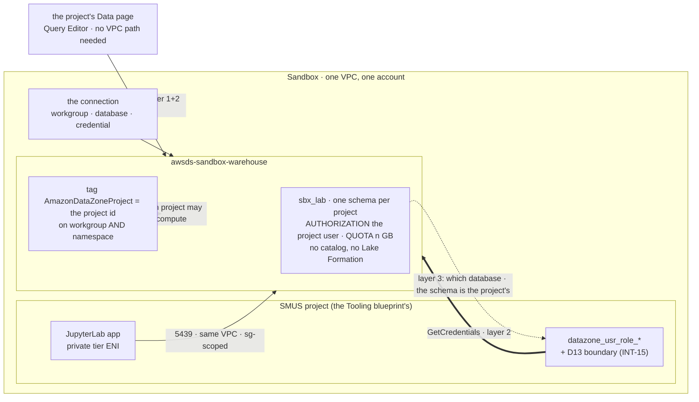

# Stage 6h — The Redshift connection in SageMaker Unified Studio

| | |
|---|---|
| **Status** | not started. Written 2026-09-19 from the vendor documentation, in the same sitting as [Stage 5b](stage-05b-redshift-serverless.md) and [D40](../decisions/D40-redshift-warehouse.md). **The first sandbox database and the first connection**: one `sbx_*` database in the Sandbox warehouse, one SageMaker project given **write** on it, and every layer between the project and the table measured once. **No governed database exists yet, anywhere** — that class arrives at [Stage 9](stage-09-deployment-targets.md), so everything below is about the sandbox class and says so where the difference matters |
| **Prerequisites** | **[Stage 5b](stage-05b-redshift-serverless.md), applied** — the warehouse, its usage limit and its audit groups; without the usage limit this stage's first query is an uncapped one. **[6a](stage-06a-unified-studio.md)/[6d](stage-06d-unified-studio-remainder.md)** — a live project in Sandbox whose id and project role exist, and whose apps start (the `Tooling` blueprint's per-project SageMaker AI domain). **[6c](stage-06c-networking-hub.md) pass 5** — the project's app ENIs land in Sandbox's private tier, the same VPC as the workgroup, which is what makes the JupyterLab path possible at all |
| **Consumes** | [D13](../decisions/D13-lake-formation-enforcement.md), [D17](../decisions/D17-interactive-vs-runtime.md), [D18](../decisions/D18-data-scientist-access.md), [D26](../decisions/D26-unified-studio.md), [D31](../decisions/D31-approver-read.md), [D35](../decisions/D35-sandbox-cardinality.md), [D40](../decisions/D40-redshift-warehouse.md) |
| **Proves** | — (no `INT-nn` row: the project, the workgroup and the database are all in `Sandbox`). What it proves that nothing before it has: the portal's **compute-connection** surface, the third way into data this estate has opened after the governed catalog path (D13) and Stage 16's S3 connection |

*Read with [`docs/SMUS.md`](../../SMUS.md) (the object model, and the `RedshiftServerless` blueprint row this
stage does **not** enable), [`docs/GOVERNANCE.md`](../../GOVERNANCE.md) and
[`docs/plan/conventions.md`](../conventions.md). The documentation rows are the 2026-09-19 entries in
[`docs/REFERENCES.md`](../../REFERENCES.md).*

---

**Objective:** one sandbox database in the warehouse, reachable and **writable** from one SageMaker project
and from no other — and the three layers that make that true, each read back separately so a future failure
is attributable to one of them.

**Everything here is a sandbox-class mechanism.** `objectives.md` (2026-09-20) makes the per database ×
project grant *"the sandbox databases' rule… the only new rule here"*, and says the controls over governed
data do not change. So the connection, its tag, its database user and its `GRANT` **never apply to a `gov_*`
database**: that class is read through the federated catalog Lake Formation governs
([Stage 9](stage-09-deployment-targets.md) 9.5) and written by a pipeline, and reusing this stage's wiring
there would put a Redshift `GRANT` beside a Lake Formation grant over governed data — the fork the brief
forbids.

## The layers a grant passes through, and why no one of them is sufficient

The requirement is *access granted per database × project*. No single AWS mechanism expresses it. What
expresses it is three layers, in three different systems, and the first thing this stage has to establish is
which one a refusal came from — because a missing grant in any of them presents as *the project cannot see
the database*, which is the same symptom three times over (Lesson 28's intersection, and the reason
[Stage 5a](stage-05a-data-foundation.md)'s resource-link pair cost a pass to get right).

| # | Layer | Written where | Grain | What its absence looks like |
|---|---|---|---|---|
| 1 | **The tag on workgroup *and* namespace** — `AmazonDataZoneProject=<projectId>` | `sandbox/warehouse/` (Terraform), from the authored map [5b](stage-05b-redshift-serverless.md) 2.2 built | per **workgroup** | the compute does not appear in the project's dropdown at all |
| 2 | **The IAM reach of the project role** — `redshift-serverless:GetCredentials`, `GetWorkgroup`, `ListTagsForResource`, plus `redshift-data:` if the Data API is the path | `sandbox/warehouse/` beside the tag, attached to the project role the blueprint minted | per **workgroup**, per **project role** | the connection is created and every query fails at authentication |
| 3 | **The project's own schema**, created `AUTHORIZATION <its database user>` with a `QUOTA` — plus whatever the project needs to reach the database it sits in | SQL, run once from the admin credential, per database × project | per **database**, and the freedom is per **schema** | the project connects, sees the cluster, and the database is invisible or read-only |

**Layer 3 is the requirement's grain.** Layers 1 and 2 are gates in front of it, and they are per-warehouse:
admitting a second project to the warehouse does not give it anything in any database. That asymmetry is the
design, and 5.2 is where it is proved rather than asserted.

**And layer 3 is ownership, not a list of verbs** (`objectives.md`, 2026-09-20: *"a data scientist who is a
member of the project creates tables freely inside that project's own schema"*). A schema created
`AUTHORIZATION <the project's database user>` makes that user its **owner**, so it creates, alters and drops
its own tables with no further grant and nothing to keep in step as the project works — which is the *"simplest
to configure"* the requirement asks for, and it removes the `ALTER DEFAULT PRIVILEGES` bookkeeping a
grant-list shape would have needed. **What bounds "freely" is the schema's `QUOTA`**, which a superuser sets
and the project cannot raise (1.3). **A datashare is not the mechanism here**: the project, the workgroup and
the database are in one account and one namespace, so a datashare would add a producer/consumer chain to reach
something already local. It enters only if a sandbox database ever has to be read from another namespace, which
nothing asks for.

## What this stage builds, and in which accounts

| Where | What | Layer |
|---|---|---|
| the warehouse, by SQL | the database **`sbx_lab`**, its schema, the project's database user and the `GRANT`s | data, not a resource |
| `sandbox/warehouse/` (amended) | the project tag on workgroup **and** namespace, and the project role's IAM policy for layer 2 | `[P]` |
| the domain, one connection | the project's Redshift compute connection — portal or `awscc_datazone_connection` (decision 1) | `[P]` |
| `identity/sso/` (possibly amended) | only if decision 4 gives a persona a direct query path; **the default is that it does not** | `[P]` |
| `aws/warehouse.py` (extended) | `WH-9`..`WH-12` — the tag pair, the project role's reach, the connection, and the database inventory with its grants | — |
| `runbooks/redshift-connection.md` (new) | the recurring procedure: adding a database, wiring a project, unwiring one | — |

**Contracts this stage fixes:** the database **`sbx_lab`** (the naming rule is `sbx_<purpose>`, 5b 2.1), **one
schema per project** inside it, owned by the project and carrying a `QUOTA` (never `public` — 1.3), and the
database user's identifier, whose exact spelling is **1.4's reading and not this file's claim**.

## Step numbers are identifiers, not an order

**Step 3** is cited from [Stage 9](stage-09-deployment-targets.md) (the same wiring, applied to a `gov_`
database with a different writer) and **step 1** from
`runbooks/redshift-connection.md`. The sequence is the passes below:

| Pass | # | What | Applied as |
|---|---|---|---|
| **0** | 0 | the readings: the project's identifiers, what the blueprint already granted, the credential options | `awsds-infra-sandbox-1`; a portal session |
| **1** | 1, 2 | the database and its `GRANT`s, then the gate layers | the admin credential; `awsds-infra-sandbox-1` |
| **2** | 3, 4 | the connection, and the first write from inside the project | the user, in the portal and in a space |
| **3** | 5, 6 | the negatives, then the paperwork and the runbook | the user; Claude |

Pass 1 precedes pass 2 because a connection to a database the project cannot see is a connection whose
failure has three candidate causes instead of one. **Layer 3 before layers 1 and 2** inside pass 1, for the
same reason: a `GRANT` made to a database user that does not exist yet fails loudly, and that ordering is
1.4's whole subject.

---

## To execute

### 0. Preflight — the project's identifiers, and what was already granted

**Action:** collect the four values every later step interpolates, and read what the blueprint already gave
the project role. **Why:** an identifier read out of prose is a claim (Lesson 38), and this stage writes four
of them into a tag, a policy, a `GRANT` and a connection — four places, one of which will be wrong if any is
retyped. **Explanation:** all read-only.

- **0.1 — [Claude] Read the project id, the project role ARN and the domain id** from the API, not from the
  portal's overview page: `datazone list-projects`, then the project's own `get-project`, and the role from
  `iam list-roles` filtered on `datazone_usr_role_`. Record all three in the log with the account resolved by
  **name** (the standing rule: never an account id in a tracked file).
- **0.2 — [Claude] Read what the project role already holds**, with `get-role` per role (never `list-roles`,
  which omits `PermissionsBoundary` by documented contract — `US-8`'s trap): the D13 boundary
  `awsds-sandbox-project-boundary` must be attached (INT-15), and **whether the boundary admits
  `redshift-serverless:` and `redshift-data:` at all**. This is the step that can turn a one-line policy
  attachment into a boundary amendment: a permissions boundary is a ceiling, so a grant the boundary does not
  admit reaches nothing and the failure names neither (Lesson 28). If it has to be amended,
  `terraform-modules/sagemaker-prereqs/boundary.tf` is the single source and the amendment is a module
  version bump under Recipe B, never an edit in one caller.
- **0.3 — [Claude] Read the three credential options the portal offers, and decide before the portal asks.**
  AWS: *"The credential type must be one of the following options: Username and password, IAM credentials,
  AWS Secrets Manager."* Each has a consequence this estate cares about:

  | Option | What it means here | Cost |
  |---|---|---|
  | **IAM credentials** | the project role calls `redshift-serverless:GetCredentials` and Redshift issues a short-lived database session — **no password anywhere** | the portal shows less on the Compute page: *"Using a username and password enables Amazon SageMaker Unified Studio to display more information for a resource"* |
  | **Secrets Manager** | the connection reads [5b](stage-05b-redshift-serverless.md) 1.1's Redshift-managed admin secret, or a purpose-made one | a secret per connection, and whoever holds the connection holds **that user's** rights — the admin's, if it is the admin secret |
  | Username and password | a password typed into a form | refused: principle 2's spirit, and nothing rotates it |

  **Recommended: IAM credentials** (decision 2). It is the only one of the three that carries no standing
  credential, and the price is a portal display rather than a control.

  > **One thing the documentation does not say, and it is the thing this step turns on.** The portal's
  > *Authentication* list offers all three types. But AWS's **same-account** procedure names only one:
  > *"The admin then must send you a username and password for a database user that has access to the compute
  > resources."* The IAM-credentials path — and the `RedshiftDbUser={{Username}}` tag that *"determines the
  > federated database user"* — is documented under the **cross-account** heading, on an **access role** that
  > a same-account connection does not have. So whether IAM credentials work same-account, and if so what
  > identity they resolve to, is **unread**: a documented capability is offered by the form, the procedure
  > around it describes a different shape, and neither page says the two compose (Lesson 41 — a vendor
  > "required" travels without its premise, and the same source can carry the table that contradicts it).
  > **This is not a reason to take the password.** It is the reason 1.4 creates the database user explicitly
  > and reads its identifier back, and the reason decision 2's fallback is a **purpose-made** Secrets Manager
  > secret rather than a typed password — a secret is at least one object, rotatable, revocable and nameable
  > in a policy. If IAM credentials turn out not to work same-account, that is verification (iii)'s answer and
  > a finding worth its own line in `lessons.md`'s platform list, with its date.
- **0.4 — [Claude] Read whether the domain restricts connection creation at all.** [6f](stage-06f-data-governance.md)
  step 1 found that nothing at the domain level restricts a direct Share and that
  `ADD_TO_PROJECT_MEMBER_POOL` is open to every user. The same question applies to
  `datazone:CreateConnection`: if any project member may add a compute connection, then layer 1's tag is the
  only thing standing between a member and this warehouse — which is an argument for the tag being per
  project rather than the wide form, and it is the reading that says so.

### 1. The database, its schema, and the project's `GRANT`s

**Action:** create `sbx_lab` with a named schema and grant the project's database user exactly what it needs
to write. **Why:** this is layer 3, the requirement's own grain. **Explanation:** it is SQL, run once, from
the admin credential — there is no Terraform resource for a Redshift `GRANT`, and inventing one out of a
`local-exec` would put a credential in a plan.

- **1.1 — [Claude⚡] Create the database** `sbx_lab`, from the admin credential
  ([5b](stage-05b-redshift-serverless.md) 1.1's Secrets Manager secret), through the Query Editor or
  `redshift-data`. The prefix is the class (5b 2.1) and **nothing enforces it** — `CREATE DATABASE gov_x`
  here would succeed and `WH-6` would fail afterwards, which is the designed order: checked, not prevented.
- **1.2 — [Claude⚡] Revoke `PUBLIC` on the new database**, the same statement 5b 1.6 wrote for `warehouse`.
  Redshift creates a `public` schema with `USAGE` and `CREATE` granted to the group `PUBLIC`, so **every**
  database user in the namespace can create objects in it until that is revoked. A database created and not
  revoked is a database where layer 3 has a hole nobody granted.
- **1.3 — [Claude⚡] Create the project's own schema, owned by it and bounded by a quota.** One schema per
  project inside the sandbox database — not one shared schema, and never `public`:
  `CREATE SCHEMA <name> AUTHORIZATION "<the project's database user>" QUOTA <n> GB`. Three things this one
  statement buys, and each replaces something the earlier draft did by hand:
  - **`AUTHORIZATION` makes the project the owner**, so *"creates tables freely"* needs no grant list and no
    `ALTER DEFAULT PRIVILEGES` — the requirement's *"simplest to configure"*.
  - **`QUOTA` is what makes "freely" bounded.** *"The maximum amount of disk space that the specified schema
    can use… You must be a database superuser to set and change a schema quota"*, and Redshift *"checks each
    transaction for quota violations before committing"*. So the project cannot raise its own ceiling, and the
    refusal happens at commit rather than at some later audit.
  - **One schema per project is what makes the freedom safe**: a project owns its schema and holds nothing in
    another's, so *"freely"* and *"per database × project"* stop pulling against each other.
  > **The default is `UNLIMITED`, and that is the failure mode to name.** *"When you create a schema without
  > defining a quota, the schema has an unlimited quota."* A schema created in a hurry is an unbounded one, on
  > a store nothing expires — the same shape as an empty deny-list permitting everything. `WH-13` fails on any
  > `sbx_*` schema whose quota reads unlimited.
  > **Freeing the space is not automatic either:** *"A DELETE statement deletes data from a table and disk space
  > is freed up only when `VACUUM` runs"* — and at 4 base RPUs vacuum boost is unavailable, so it is the plain
  > `VACUUM` command ([Stage 5b](stage-05b-redshift-serverless.md)'s capacity reading, which is where that fact
  > was recorded before anything needed it).
  **The schema's name is decision 6**: readable (the project's name, which a user can change) or stable (the
  project id, which is opaque). Recommended: **the project's name, slugged**, with the project id in a comment
  on the schema — `docs/plan/conventions.md`'s ordinal argument in reverse, because here the human reading a
  connection string is the one who needs it.
- **1.4 — [Claude⚡] Create the project's database user, and read its identifier rather than assuming it.**
  With IAM credentials (0.3), Redshift derives the database user from the calling IAM identity, and the
  documented spellings in this family are **`IAM:<user>`** and **`IAMR:<role>`** — plus, on the cross-account
  path, a `RedshiftDbUser=<Username>` **tag on the access role** that *"determines the federated database
  user"*. Which of those applies to a same-account serverless `GetCredentials` call by a project role is
  **not settled by any page read on 2026-09-19**, and guessing it puts the wrong identifier into three later
  statements (Lesson 38).

  > **The chicken-and-egg, named so it is not discovered.** A `GRANT` needs a user that exists; an
  > IAM-derived user may only come into existence at the first connection. Two orders are possible and only
  > one works:
  > **(a)** `CREATE USER "<identifier>" PASSWORD DISABLE;` first, then `GRANT`, then connect — the order
  > this step takes, because it makes the grant a deliberate act with a readable subject; or
  > **(b)** connect first, let the user be auto-created, then `GRANT` — which means the project's very first
  > connection succeeds with no grants, and *"the project can connect but sees nothing"* is the expected
  > state for a while, which is exactly the ambiguity this stage exists to remove.
  > **Take (a).** If the identifier turns out to be wrong, the symptom is a second, auto-created user
  > appearing beside the hand-made one at the first connection — a clean, readable diff in
  > `SVV_USER_GRANTS`/`pg_user`, and the correction is one `DROP USER`.
- **1.5 — [Claude⚡] Grant only what ownership does not already give**, and read what that is rather than
  assuming it. 1.3's `AUTHORIZATION` covers everything inside the schema, so what is left is **reaching the
  database the schema sits in** — and the exact statement for that is a reading, not a claim: Redshift has
  grown `GRANT … ON DATABASE` alongside the older model where connecting was enough, and which applies to a
  serverless namespace at this version is settled by trying the connection, not by this file (Lesson 38).
  **What must stay absent, whatever that answer is:** no `GRANT ALL ON DATABASE`, nothing on any other
  database, nothing on another project's schema, and no `CREATE` on `public` (1.2 revoked it). Record the exact
  statements in the log — they are the register for this layer, and there is no `list-permissions` equivalent
  that shows them from outside (`WH-12` reads `SVV_*`, which means the instrument needs a database session,
  itself a finding worth stating).
- **1.6 — [Claude] Write the grant register row.** [Stage 5a](stage-05a-data-foundation.md)'s grants are
  registered in `docs/AWS_STATE.md`; Redshift grants are a second system with no LF-Tag and no
  `GetDataAccess`, so they need their own table rather than a row in the LF register. One line per
  (database, schema, principal, privileges, date).

### 2. The gate layers — the tag pair and the project role's reach

**Action:** admit this one project to this one warehouse, in Terraform, and attach the IAM reach the
connection needs. **Why:** both are per-project values that must appear in more than one place, which is
where Lesson 14 bites. **Explanation:** both go in `sandbox/warehouse/`, from one map keyed by project id, so
the two cannot drift by an edit that still plans clean.

- **2.1 — [Claude] Amend `sandbox/warehouse/` with the project map**: one entry, `<projectId>`, expanding to
  the tag `AmazonDataZoneProject=<projectId>` on **both** the workgroup and the namespace (the documented
  requirement names both objects) and to one IAM policy attached to that project's role.
  **The wide form stays refused**: `for-use-with-all-datazone-projects=true` appears nowhere, and `WH-7`
  fails if it does.
- **2.2 — [Claude] Write the project role's policy**, narrow and resource-scoped to this workgroup's ARN:
  `redshift-serverless:GetCredentials`, `GetWorkgroup`, `ListWorkgroups`, `ListTagsForResource`, and — only
  if 0.3's answer needs it — the `redshift-data:ExecuteStatement`/`GetStatementResult`/`DescribeStatement`
  family. **Nothing on the namespace's own management APIs**, no `UpdateWorkgroup`, and **no
  `secretsmanager:GetSecretValue`** on the admin secret: a project role that can read the admin credential
  has the admin's rights and layer 3 stops meaning anything.
- **2.3 — [Claude⚡] Apply as `awsds-infra-sandbox-1`**, re-plan `No changes`, then read back: both tags
  present on both objects (`WH-10`), the policy attached to the project role and **still inside the D13
  boundary** (`get-role`, per role — `WH-11`). If 0.2 required a boundary amendment, it landed first, as its
  own module version.

### 3. The connection, and the first write from inside the project

**Action:** create the connection and write one table from a space. **Why:** everything above is code and
SQL; this is the first time the three layers are exercised by one call, which is the only way any of them is
proven (Lesson 20). **Explanation:** the portal path and the Terraform path are both available and decision 1
picks one.

- **3.1 — [Claude reads, user decides] Portal or Terraform** (decision 1). `awscc_datazone_connection` exists
  and takes `redshift_properties` — `storage.workgroup_name`, `database_name`, `host`, `port`,
  `credentials` (`secret_arn` **or** `username_password`) and `lineage_sync` — plus `aws_location`,
  `environment_identifier` and **`enable_trusted_identity_propagation`**, which is new information against
  open question 13's premise that TIP is a project-profile setting only. The portal path is
  *Compute → Data warehouse → Add compute → Connect to existing compute resources*, and in the same account
  it offers the compute **from a dropdown** rather than asking for a JDBC URL.
  **Recommended: the portal for this first one, Terraform for the second** — the portal is what a data
  scientist will use, so measuring it once is the point; and what it writes is then readable by
  `WH-9`, which is how the Terraform shape gets written against a known-good object rather than against the
  API reference.
- **3.2 — [user] Create the connection** in the project, with the credential type 0.3 chose, and record
  every field the portal asked for and every default it filled — the `lineageSync` toggle above all, since a
  lineage sync on a schedule is a **recurring query**, and a recurring query on this warehouse is a recurring
  **USD 1.44/hour** meter. Leave it **off** unless somebody asks for it (decision 3).
- **3.3 — [user] From JupyterLab in a space, write a table into `lab`** and read it back. The path is
  `5439/tcp` inside one VPC, through [5b](stage-05b-redshift-serverless.md) 1.4's security group, and it
  exists only because the workgroup and the project share a VPC — AWS: *"If you want to query the Amazon
  Redshift resources using JupyterLab … the Amazon Redshift resource must use the same VPC as the … project."*
- **3.4 — [user] Then the same query from the project's Data page**, which does **not** need the VPC path:
  *"You can still query using the Data page of your project if you are using different VPCs."* Two doors, and
  reading them apart is what makes a later failure diagnosable — the same discipline `docs/NETWORK.md` §5
  applies to the three internet paths.
- **3.5 — [Claude] Attribute the write in CloudTrail**, from the account's own trail: which principal called
  `GetCredentials`, and whether the session that wrote the table is the **project role** or something else.
  The remote-IDE finding at [6d](stage-06d-unified-studio-remainder.md) step 7 is the reason this is a step
  and not an assumption: `StartSession` turned out to be called **as the project role**, so 6a's tag pair
  never evaluated. The same question here is *whose identity reaches the database*, and the answer decides
  whether layer 3's user is per project or per person.
- **3.6 — [Claude] Read the three audit log groups** for this session: `connectionlog` has the connection,
  `useractivitylog` has the SQL. This is the first content those groups have ever had
  ([5b](stage-05b-redshift-serverless.md) 6.1 created them empty), and it is where the DLP feed stops being a
  claim.

### 4. What a persona may do, and the default is nothing

**Action:** decide, and write down, whether `DataScientistAccess` ever reaches the warehouse outside a
project. **Why:** the persona has Athena on two workgroups (Stage 5a pass 4c) and it would be natural to give
it the same on Redshift. It is not the same: Athena's cost is per TB scanned with a workgroup scan limit, and
Redshift's is **per hour of query time on a shared meter** — a persona's ad-hoc query and a project's job
consume the same RPUs. **Explanation:** 5b 2.3 already withheld `GetCredentials` from the persona; this step
is where that either stands or is revisited with a reason.

- **4.1 — [Claude] Recommendation: it stands** (decision 4). The persona keeps the `Get*`/`List*` read side
  and no credential path, so every query on this warehouse arrives through a project — which is also what
  makes layer 3's register complete, because there is no second kind of grantee.
- **4.2 — [Claude] If it is revisited**, the shape is a **separate database** with read-only grants and its
  own `GRANT` register row, never a wider grant on `sbx_lab`: the project writes there and a persona reading
  a project's working database is a cross-project read nobody approved.

### 5. The negatives — what must not work

**Action:** four refusals, each read by its wording. **Why:** the design's whole content is in what it
refuses, and none of these has ever been measured on this surface. **Explanation:** the standing rule since
1c — read the denial, never the exit code.

- **5.1 — [user] A second project cannot use the compute.** From a project **not** in 2.1's map, the compute
  does not appear and a hand-made connection to the same workgroup fails. This is layer 1 alone, and it is the
  reading that says the tag is a control rather than a label.
  *(If no second project exists, this is deferred with a named owner rather than skipped — Stage 16 §T
  deferred exactly this and said so.)*
- **5.2 — [user] The admitted project cannot reach another database, nor another project's schema.** From the
  project that *is* admitted: its own schema works; the namespace's first database `warehouse` does not; and a
  second project's schema in the *same* database does not either, once one exists. This is layer 3 alone, with
  layers 1 and 2 satisfied — the asymmetry the three-layer design exists to produce, and the proof that
  admitting a project to the warehouse grants it nothing in any database, and that *"creates freely"* stops at
  its own schema.
- **5.2a — [user] The quota refuses, and the project cannot raise it.** Write into the project's schema past
  its `QUOTA` from inside the project — the refusal arrives **at commit**, as documented — then attempt
  `ALTER SCHEMA … QUOTA` as the project's own database user, which needs a superuser and must fail. Read
  `SVV_SCHEMA_QUOTA_STATE` and `STL_SCHEMA_QUOTA_VIOLATIONS` afterwards. **This is the one control that bounds
  a free hand**, and it has never been exercised anywhere in this estate.
  > **Read this one carefully.** The cross-database page says an unconnected database gives *"read access
  > only"* in one bullet and *"you can write … from any other database that you have permissions to"* in the
  > next. So the expected answer is **nothing at all** (no grant, no access), and a *read* succeeding would
  > mean a default grant exists that 1.2's `REVOKE` did not reach. Either outcome is a finding; only one is
  > the design.
- **5.3 — [user] The project cannot administer the warehouse**: `UpdateWorkgroup` denied (the policy does not
  grant it), `DeleteUsageLimit` denied (5b 3.2's SCP, if applied), and the admin secret unreadable.
- **5.4 — [user] The persona cannot mint a database session**: `redshift-serverless:GetCredentials` as
  `DataScientistAccess` is denied — an **implicit** deny, absence of grant, which is a different wording from
  an SCP's and worth recording as such (the distinction 6g 1.4 turned on).

### 6. Close

- **6.1 — [Claude] Write `runbooks/redshift-connection.md`**: the
  recurring procedure, in the shape [`sandbox-lake.md`](../runbooks/sandbox-lake.md) takes for the S3
  connection — add a database, wire a project (the three layers, in order), unwire one, and what a failure at
  each layer looks like. **Unwiring is the half that gets forgotten**: a project removed from the map loses
  layer 1 and layer 2 at the next apply, and keeps its layer-3 `GRANT` forever, because Terraform never wrote
  it. `WH-12` is what finds that; the runbook is what prevents it.
- **6.2 — [Claude] Extend `./aws/warehouse.py`** with `WH-9`..`WH-12` (the connection, the tag pair, the
  project role's reach and boundary, the database/grant inventory).
- **6.3 — [Claude] Bring the documents up**: `docs/SMUS.md` (the connection surface, beside §S3's S3
  connection), `docs/GOVERNANCE.md` (the warehouse's row in §Accounts, and the fact that a Redshift grant is a
  fourth permission system with no LF-Tag), `docs/AWS_STATE.md` (the grant register's new table, and the
  residuals), `docs/NETWORK.md` §6 if the security group changed, and `CLAUDE.md`.
- **6.4 — [user] Keep or drop `sbx_lab`.** It has no hourly meter; its storage is cents. The connection has no
  meter either. **The thing with a meter is `lineageSync`**, if 3.2 turned it on.
- **6.5 — [Claude] The log**, at the user's request.

---

## Deliverables

- **The three layers, separated** (5.1, 5.2): a project not in the map cannot use the compute; a project in
  the map cannot reach a database it was not admitted to, nor another project's schema.
- **Freedom inside the schema, bounded by the quota** (3.3, 5.2a): the project creates tables with no further
  grant, and the quota refuses at commit while the project cannot raise it.
- **A write from a space** (3.3) and the same query from the Data page (3.4) — two doors, both recorded.
- **The identity that reaches the database** (3.5), read from CloudTrail rather than inferred from the
  connection's configuration.
- **The database user's real identifier** (1.4), and whether a second one appeared at the first connection.
- **The audit groups carrying content** (3.6) — the first time, and the SQL text with it.
- **The connection's own configuration**, field by field, including every default the portal filled (3.2).

## Validation

1. `./aws/warehouse.py` — `WH-1`..`WH-12` pass; diff two runs across the stage.
2. `./aws/studio.py` — `US-8` still green: the project role carries the D13 boundary after 2.3's attachment.
3. `./aws/datalake.py` — `DL-5`/`DL-6` unchanged; this stage touches no Lake Formation object, and the
   reading proves it.
4. `make check` clean.
5. Read every denial by its wording, never its exit code.

## Cost

| Item | Cost |
|---|---|
| `sbx_lab`, its schema and one small table | RMS at 0.024 USD/GB-month — cents |
| The connection | free; it is a domain metadata object |
| Every query in pass 2 and pass 3 | **1.44 USD/hour of query time**, 60-second minimum per query — so a dozen interactive queries are well under a dollar, and a **left-open transaction is 8.64 USD** before `SESSION TIMEOUT` ends it |
| `lineageSync`, if enabled | a **recurring** query on a 1.44 USD/hour meter — the one line item that turns this stage into a standing cost (decision 3) |
| JupyterLab app hours | `ml.t3.medium` at 0.050 USD/h, unchanged by this stage |

## Decisions due while executing

**Blocking questions for the user: none.** Each is decided during the stage and written into
`docs/log/log-stage-06h-redshift-connection.md` with a recommendation stated (Lesson 16).

1. **Portal or Terraform for the connection** (3.1). Recommended: **the portal for the first one**, then the
   Terraform shape written against the object it produced. `awscc_datazone_connection` exists, so this is a
   sequencing choice and not a capability one — and the portal is the path a data scientist will take, which
   makes measuring it the point rather than a shortcut.
2. **The credential type** (0.3). Recommended: **IAM credentials**. No standing credential, and the cost is
   that the portal's Compute page shows less (*"Using a username and password enables … more information"*).
   **It may not be available same-account** — the form offers it, AWS's same-account procedure names only a
   username and password, and the two pages do not meet (0.3's callout). Fallback: Secrets Manager **with a
   purpose-made secret**, never the namespace admin's. A typed password is refused either way.
3. **`lineageSync`** (3.2). Recommended: **off**. It is a scheduled query on the estate's most expensive
   meter, bought for lineage nodes that [6f](stage-06f-data-governance.md) has not yet decided it wants.
   Revisit when 6f's lineage step has an owner.
4. **Whether a persona ever queries the warehouse directly** (step 4). Recommended: **no** — every query
   arrives through a project, which keeps the `GRANT` register complete and the shared RPU meter attributable.
5. **One database per project, or shared databases with a schema per project.** Recommended: **shared
   databases, one schema per project** — which is what the requirement's two halves together imply: *per
   database × project* is the admission, and *"creates freely inside that project's own schema"* is the
   freedom. A database per project would make layer 3 redundant with layer 1 and would hide the case the
   register exists for, two projects on one database.
6. **The schema's name** (1.3): readable — the project's name, slugged, which a user can rename — or stable,
   the project id, which is opaque. Recommended: **readable, with the project id in a `COMMENT ON SCHEMA`**.
   `docs/plan/conventions.md` argued the opposite for account tokens, where nothing human reads them; here the
   name lands in a connection string and in a query, so the reader is a person. The comment is what keeps the
   stable id available when a rename happens.
7. **The quota value** (1.3). Recommended: **10 GB per project schema** to start, revised against real usage at
   Stage 12 rather than set high and forgotten — the same shape as the Athena scan limit's decision. At
   0.024 USD/GB-month, ten projects at their ceiling is USD 2.40 a month, so the quota is about bounding
   surprise rather than about the bill.

## Verifications to answer while executing

| # | Question | Step |
|---|---|---|
| i | Does the D13 boundary admit `redshift-serverless:`/`redshift-data:` at all, or does it have to be amended first? | 0.2 |
| ii | Does the portal offer the compute from a dropdown in the same account, and which fields does it ask for? | 3.1, 3.2 |
| iii | What is the database user's real identifier for a same-account serverless `GetCredentials` by a project role — and did a second user appear at the first connection? | 1.4, 3.3 |
| iv | Does the JupyterLab path work over `5439` inside the VPC, and does the Data page work as well? | 3.3, 3.4 |
| v | **Whose** identity reaches the database — the project role, or a per-person identity? | 3.5 |
| vi | Does a project outside the map fail, and at which layer does it fail? | 5.1 |
| vii | Does the admitted project reach `warehouse` — and if it reads it, which default grant did 1.2's `REVOKE` miss? | 5.2 |
| xiii | Does `AUTHORIZATION` alone let the project create, alter and drop tables in its schema — with no `GRANT` and no `ALTER DEFAULT PRIVILEGES` — and what, if anything, it still needs to reach the enclosing database? | 1.5, 3.3 |
| xiv | Does the `QUOTA` refuse at commit, does `ALTER SCHEMA … QUOTA` fail for the project's own user, and do `SVV_SCHEMA_QUOTA_STATE` and `STL_SCHEMA_QUOTA_VIOLATIONS` show it? | 5.2a |
| viii | Is `GetCredentials` an **implicit** deny for the persona, or does something name a policy? | 5.4 |
| ix | Do `connectionlog` and `useractivitylog` carry this session, and does the SQL text appear? | 3.6 |
| x | Does removing a project from the map remove layers 1 and 2 — and does its layer-3 `GRANT` survive, as predicted? | 6.1 |
| xi | Does anything at the domain level stop a project member creating a connection of their own? | 0.4 |
| xii | What did the stage's queries cost, read from the bill rather than predicted? | 6.4 |

## Risks

- **A `GRANT` is state no Terraform plan can see.** Layers 1 and 2 are code and diff; layer 3 is SQL run once,
  and removing a project from the map does not revoke it. Every unwiring is therefore a two-system operation
  and one of the systems has no plan — Lesson 4's shape (state living only inside something no plan reads),
  with `WH-12` and the runbook as the whole defence.
- **Three layers, one symptom.** *The project cannot see the database* is what a missing tag, a missing IAM
  action and a missing `GRANT` all look like. The mitigation is the order of pass 1 and 2 and the separated
  negatives of step 5; the hazard is a future operator who wires all three at once and then cannot say which
  one mattered.
- **The tag is a selector written over an attribute** (Lesson 29): `AmazonDataZoneProject` is a tag AWS reads
  as an authorization input, so anything else that ever wears it — a copy, a restored namespace, a snapshot
  clone — inherits the admission. `WH-7`/`WH-10` compare the live tags against the authored map for that
  reason, rather than merely asserting the map.
- **`lineageSync` is a scheduled query on an hourly meter**, and it is a checkbox on the connection form.
  Nothing in AWS's UI says what it costs on Redshift Serverless; this file is the only place that does.
- **The portal writes an object this repository did not author.** A connection created by hand is a
  `ManagedBy=console` object outside the seven Stage 2 names, so either it is adopted into Terraform (decision
  1's second half) or `docs/AWS_STATE.md` carries it as a named exception. It must not simply exist.
- **A second project's grant is a governance question, not a mechanical one.** Two projects writing one
  sandbox database is exactly the case the register exists for, and nothing in this stage decides *who
  approves* it. That belongs with the Governance Manager, the same way `INT-11`'s "should every business unit
  get the same data" does — and it arrives with the second project, not with the second database.
- **Nothing here is governed data, and nothing here may become the path to it.** A `sbx_*` database carries no
  LF-Tag, no classification and no Lake Formation grant, and a project can write anything into it — including a
  copy of something governed, read through the lake share and written here. That is
  [D19](../decisions/D19-derived-zone.md)'s shape in a fourth store, and the compensation is the same: the
  destination is inside the perimeter, the CMK is the account's, and the copy is not prevented. Say it in
  `docs/GOVERNANCE.md` rather than leaving it for Stage 11 to find (Lesson 1 — a copy somewhere less governed
  is not a hole to be closed). **The pressure this stage creates is the other direction**: a connection that
  works is the obvious thing to point at a governed database next, and the brief forbids exactly that. `WH-7`
  reading *no project tag* on the Production namespace is the mechanical half; the sentence above is the
  reason.

---

*Stage index: [stages/INDEX.md](INDEX.md) · Plan core: [GENERAL_PLAN.md](../../GENERAL_PLAN.md)*
