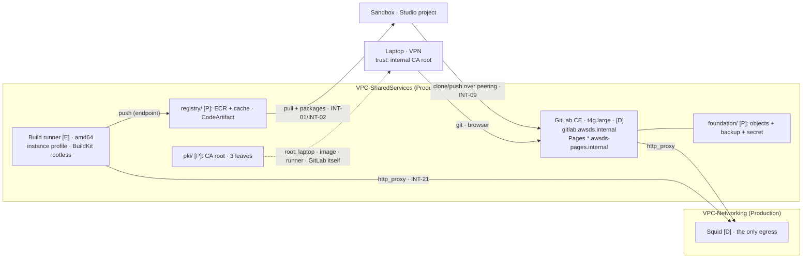

# Stage 7 — GitLab, Runners and ECR

| | |
|---|---|
| **Status** | not started — **re-scoped and re-reviewed 2026-09-05** against [6b](stage-06b-development-becomes-staging.md)/[6c](stage-06c-networking-hub.md)/[D38](../decisions/D38-single-egress-hub.md), rewritten in the action-checklist format, and corrected against the vendor documentation (the list is "What the documentation changed in this plan"). The structural changes: everything lands in **`VPC-SharedServices`** (Production's 10.30.0.0/16 under its new name); the names move to the **`awsds.internal` family**; **there is no NAT anywhere**, so every outbound call is an explicit-proxy call; the **buildbox is retired into the build runner**; one GitLab group `awsds/` is the shared namespace; and INT-09's clone is exercised from **Sandbox**, the only Interactive account left. **Pass 0 is already applied** — step 5.a ran inside 6a on 2026-08-21 (`14 added`) |
| **Prerequisites** | **[6c](stage-06c-networking-hub.md) passes 1-4**: `VPC-SharedServices` exists under its new name, `awsds.internal` resolves in it, the Sandbox↔SharedServices peering carries routes both ways, and the proxy answers on `proxy.awsds.internal:3128`. **[6d](stage-06d-unified-studio-remainder.md)** for one deliverable only — the INT-09 clone needs a live Sandbox project. **`production/registry/` exists**: step 5.a was applied at 6a, so this stage starts with the two ECR repositories and CodeArtifact already there and **`production/pki/` not yet written** |
| **Consumes** | [D8](../decisions/D08-gitlab-hosting.md), [D11](../decisions/D11-lab-lifecycle.md), [D12](../decisions/D12-budget-ceiling.md), [D14](../decisions/D14-supply-chain-account.md), [D15](../decisions/D15-tls-internal.md), [D20](../decisions/D20-staging-account.md), [D35](../decisions/D35-sandbox-cardinality.md), [D36](../decisions/D36-internal-pki.md), **[D38](../decisions/D38-single-egress-hub.md)** |
| **Proves** | [INT-09](../integrations.md) (the `git clone` from a **Sandbox** project over the SharedServices peering), [INT-13](../integrations.md) (CodeConnections against a private GitLab — expected to fail; the manual `git remote add` is the accepted path), [INT-19](../integrations.md) (the CA root on **four** client surfaces — the fourth is GitLab itself), **[INT-21](../integrations.md)** first exercised by something that is not a Studio app. **Supplies** [INT-02](../integrations.md)'s provider half — already applied at 6a. INT-08 is **not** here: the deploy roles are Stage 8's |

*Read with [`docs/plan/conventions.md`](../conventions.md) §6 (naming, layout, `[P]`/`[D]`/`[E]`, the slice
tree) and [`docs/NETWORK.md`](../../NETWORK.md) (which VPC each thing lands in, and what `NO_PROXY` holds).*

---

**Objective:** source control, CI, docs hosting and the artifact registries — private, in
`VPC-SharedServices`, with TLS from the internal CA, no local accounts, and no path to the internet except
the proxy.

## What this stage builds, and where

Everything below is in the **Production** account, **`VPC-SharedServices`** (10.30.0.0/16) unless stated.

| Slice | What | Layer |
|---|---|---|
| `production/pki/` (new) | the CA root, its own KMS key, the publication of the root, and the **three** leaves | `[P]` |
| `production/foundation/` (amended) | GitLab's `[P]` anchors: the object-storage bucket, the backup bucket, the `gitlab-secrets.json` container | `[P]` |
| `production/registry/` (amended — **5.b only**) | the pull-through cache and the per-application repositories. **5.a is applied** | `[P]` |
| `production/tooling/` (new) | the GitLab instance, EBS, the DLM snapshot policy, the instance role, the rendered `gitlab.rb`, the two DNS records | `[D]` — stopped, never destroyed |
| `production/runners/` (new) | the build runner and its role — **and the retired buildbox's job** | `[E]` |
| `production/egress/` (amended) | the endpoints this VPC needs for a build: `ecr.api`, `ecr.dkr`, `codeartifact.api`, `codeartifact.repositories`, `sts`, `logs`, `ssm`/`ssmmessages`/`ec2messages`, `secretsmanager` | `[E]` |
| Identity Center console, by hand | the custom SAML 2.0 application | — |
| GitLab itself, by hand | the `awsds/` group, the four persona groups, the repositories, the protected release tags | — |
| `scripts/` | `layers.py`: `tooling` `[D]`, `runners` `[E]` | — |

## What the documentation changed in this plan

Read before executing. Each row is a correction to what the pre-2026-09-05 draft assumed.

| Was assumed | What the documentation says | Where it lands |
|---|---|---|
| `external_url "https://…"` just serves the leaf | **Let's Encrypt is on by default** whenever `external_url` is HTTPS and no certificate is configured, and GitLab **retries the renewal on every `reconfigure`**. On a `.internal` name with no route to the ACME server that is a failing reconfigure, every time | 1.3 |
| The CA root goes on three client surfaces | There is a **fourth**, and it is GitLab: roots are dropped in **`/etc/gitlab/trusted-certs/`** and picked up by `reconfigure`. The leaf pair is **hostname-named** — `/etc/gitlab/ssl/gitlab.awsds.internal.{crt,key}`, 644/600 | 1.3, 2.5 |
| GitLab inherits the proxy from the instance | Omnibus takes it **per component**: `gitlab_rails['env']`, `gitaly['env']`, `gitlab_workhorse['env']`, `gitlab_pages['env']`. `no_proxy` accepts wildcards and **must carry no port** — a port there breaks DNS resolution for repository mirroring | 1.3, 7.1 |
| The runner inherits it too | GitLab Runner needs its own **systemd drop-in** (`/etc/systemd/system/gitlab-runner.service.d/http-proxy.conf`), the docker daemon needs a second one, and the build container is handed the values through `config.toml`'s `environment` — **in both cases**, `HTTP_PROXY` and `http_proxy`, because tools disagree. `NO_PROXY` wildcards work only as **suffixes**: no prefixes, **no CIDR** | 6.2, and 6c 5.6 |
| The pull-through cache is primed "while the NAT is up" | ECR documents that the **first** pull *"may require a route to the internet"* and its own remedy is a public subnet with an internet gateway — **a route, which design B removes; a proxy is not one.** Unauthenticated upstream pulls are *"initiated by AWS IP addresses"*, so the requirement is conditional, not universal: it is **measured**, and a failure makes this the **first named candidate** for D38's NAT contingency | 5.2, decision 3, verification vii |
| "No repository creation template forces immutability" | **Repository creation templates exist** and can set tag immutability, encryption, policies and lifecycle on repositories ECR creates for the cache. The rule is therefore *do not write a template that turns immutability on for the cache prefix* — and the caution that *"tag immutability … will prevent Amazon ECR from updating images using the same tag"* stands | 5.2 |
| CodeArtifact needs client egress for `public:pypi` | The **service** fetches from the external connection; a client with no internet still resolves a package that has never been cached. **One external connection per repository**, which is why `pypi` and `crates` are two repositories rather than one | 5.3 |
| Pages needs its own address | For a **wildcard** Pages domain behind the Omnibus nginx proxy, **no secondary IP is required** — a second address is only for custom domains. Pages **access control is a Free-tier feature** | 4.1 |

## Who executes each action

| Marker | Meaning |
|---|---|
| **[Claude]** | repository edits and read-only AWS calls — done without asking |
| **[Claude⚡]** | `terraform apply`/`destroy` or any AWS write — run **only after the user authorizes that specific action in chat**, with the SSO user / account / permission set stated first |
| **[user]** | the Identity Center console, everything inside GitLab's own UI, browser flows, SSM sessions on the host, git tags, and every log entry |
| **[Claude reads, user decides]** | a measurement Claude takes and a choice only the user can make, in the same sitting |

Every apply runs as the **infrastructure user** through **`awsds-infra-prod`** (Production,
`InfrastructureAccess`), except step 3's SAML application — **`awsds-infra-identity`**'s console (Identity,
the IdC delegated administrator, D10).

## Step numbers are identifiers, not an order

Numbers are **stable addresses cited from other files** and do not change. The sequence is four passes;
pass 0 is behind us.

| Pass | Steps | What | Slice · layer | Applied as |
|---|---|---|---|---|
| **0** | 5.a | the `base`/`dev-env` repositories, CodeArtifact, the key and the consumer policies | `registry/` `[P]` | **DONE at 6a, 2026-08-21 (`14 added`)** |
| **1** | 1, 2, 5.b | the `[P]` anchors, the whole CA, `tooling/`, the cache and the app repositories | `foundation/` (amended), `pki/`, `tooling/` `[D]`, `registry/` (amended), `egress/` (amended) | `awsds-infra-prod` |
| **2** | 3, 4 | SAML, the edition check, the groups and repositories, Pages | IdC console, GitLab UI, `tooling/` | user + Claude drafts |
| **3** | 6, 7 | the build runner (the buildbox's successor); the mirroring decision and the INT-13 reading | `runners/` `[E]` | `awsds-infra-prod`; INT-13: user, console |
| **4** | 8 | the lifecycle, the rehearsed restore, the deliverables | `make down`/`up`, readings | user + Claude |

**The internal order inside pass 1**: the leaves are issued from the root (2.4 after 2.1); `tooling/` reads
the backup bucket, so the `foundation/` amendment precedes it; 2.6 needs 2.3's publication. **Pass 2 needs
pass 1** — the SAML round-trip is a browser flow through `gitlab.awsds.internal`, and an untrusted
certificate turns it into an unexplained loop. **Pass 3 needs pass 2** (a runner registers against a
project). **Pass 4 proves everything before it.**

---

## To execute

### 1. Stand up GitLab CE — `production/tooling/` `[D]`, its `[P]` anchors in `foundation/`

**Action:** put GitLab CE Omnibus on a `t4g.large` in `VPC-SharedServices`' private tier, its bulky state
in S3, its secrets in Secrets Manager, reached by name over the VPN. **Why:** the objectives require source
control reachable only through the intranet, and D8/D14 fix the how and the where. **Explanation:** the
instance is `[D]` — stopped between sessions, ~USD 4/month of EBS, because rebuilding real state from backup
every session is the fragile path (conventions §5.1 rule 2). Everything that must survive a rebuild lives
in `[P]` slices, which is Stage 4's Elastic IP pattern applied to GitLab.

- **1.1 — [Claude] Create GitLab's `[P]` anchors in `production/foundation/`**, exported for `tooling/`:
  the object-storage bucket `awsds-prod-gitlab-objects` (one bucket, virtual buckets by prefix — the
  documented consolidated form: artifacts, LFS, uploads), the backup bucket `awsds-prod-gitlab-backup`
  (versioned, lifecycle-expiring), and the secret container `awsds-prod-gitlab-secrets` — an
  `aws_secretsmanager_secret` with **no value resource**, so the value never enters Terraform state. They
  sit in `foundation/` because 8.2's rehearsal destroys `tooling/`: a backup must survive the destruction of
  the slice it restores.
- **1.2 — [Claude] Write `production/tooling/`**: a `t4g.large` on **Amazon Linux 2023 arm64** (Omnibus has
  supported it since 16.3.0), from the SSM public AMI parameter; EBS gp3 50 GB with
  `delete_on_termination = false` on the data volume; one **Data Lifecycle Manager** daily snapshot policy
  (DLM is free, snapshot storage is billed). Instance `Name` tag **`awsds-prod-gitlab`** — a contract with
  `./aws/supplychain.py`. No port 22, SSM Session Manager only. The security group admits HTTPS from the
  **WireGuard host's security group** (a cross-account reference over the peering) and from **Sandbox's
  private-subnet CIDR** (INT-09) — never `10.90.0.0/24`, which under 6c reaches this VPC as the WireGuard
  host's address, not as itself.
- **1.3 — [Claude] Render `gitlab.rb` from a Terraform template** delivered by user data — configuration is
  code, not console. Six blocks, and the first two are the ones the documentation changed:
  1. `external_url "https://gitlab.awsds.internal"` **with `letsencrypt['enable'] = false`** — Let's Encrypt
     is on by default whenever `external_url` is HTTPS, and it retries on *every* reconfigure. The leaf pair
     is hostname-named: `/etc/gitlab/ssl/gitlab.awsds.internal.crt` (644) and `.key` (600).
  2. **The proxy, per component**: `gitlab_rails['env']`, `gitaly['env']`, `gitlab_workhorse['env']` and
     `gitlab_pages['env']` each carry `http_proxy`/`https_proxy` = `http://proxy.awsds.internal:3128` and a
     `no_proxy` generated from this VPC's endpoint list (6c step 5.6) — **suffixes and literal addresses
     only, and never a port**, which GitLab documents as breaking DNS resolution for repository mirroring.
  3. The **consolidated object storage** block on 1.1's bucket with **`use_iam_profile = true`** — no keys
     anywhere (principle 2) — and `backup_upload_connection` to the backup bucket, which the consolidated
     form deliberately excludes.
  4. `registry['enable'] = false` (ECR is the registry, by objective) and the packages feature off
     (CodeArtifact is the package proxy).
  5. Pages, per step 4.
  6. SAML, per step 3.

  The instance role gets S3 on the two buckets, `PutSecretValue`/`GetSecretValue` on 1.1's secret ARN, and
  nothing else.
- **1.4 — [Claude] Create the two DNS records in `tooling/`**: `gitlab.awsds.internal` and
  `*.awsds-pages.internal` → the instance's **primary private IPv4**, which is documented to survive
  stop/start (verification i). Both zones are `[P]` and were created at 6c pass 2.
- **1.5 — [Claude] Write the restore-or-generate flow into user data**: on boot, if 1.1's secret holds a
  value, install it as `/etc/gitlab/gitlab-secrets.json` **before** `gitlab-ctl reconfigure`; if not (first
  boot only), reconfigure and push the generated file with `put-secret-value`. GitLab excludes this file
  from its own backups by design and a backup restored without it cannot decrypt the database — this flow is
  what makes 8.2 honest. `gitlab.rb` needs no such treatment: it is a rendered template in this repository.
- **1.6 — [Claude] Add the machinery rows in the same commit**: `("production", "tooling")` `[D]` and
  `("production", "runners")` `[E]` in `scripts/tfhygiene/layers.py`, with `runners` ranked **above**
  `tooling` so `make down ENV=prod` destroys the runner before stopping GitLab. A slice with no row fails
  `make check`.
- **1.7 — [Claude⚡] Apply `foundation/` (amended), then `egress/` (amended), then `tooling/`** as
  `awsds-infra-prod`, `fmt`/`validate`/`plan` clean first. `egress/` comes before `tooling/`: without
  `ssm`/`ssmmessages`/`ec2messages` in this VPC there is no shell on the host, and Session Manager does not
  work through an HTTPS proxy listener (6c step 5.5).
- **1.8 — [user] Take first sign-in**: read `/etc/gitlab/initial_root_password` through an SSM session (it
  self-deletes after 24 h), set the root password, and record in the log that **the local `root` account is
  kept** — it is GitLab's own break-glass when SAML breaks, and step 3 creates no other local account.

### 2. Issue TLS from the internal CA — `production/pki/` (D36, D15, INT-19)

**Action:** generate the root, issue three leaves, and put the root on every client surface. **Why:** ACM
cannot issue for `.internal` names and Private CA is over budget (D15), so the trust chain is ours; a missed
surface fails as an opaque TLS error at `git clone` time rather than as an access denial. **Explanation:**
the whole CA is one pass, and the surface count is **four**, not three — the documentation added GitLab
itself, which needs the root in `/etc/gitlab/trusted-certs/` to trust its own Pages and webhook targets.

- **2.1 — [Claude] Write `production/pki/`**: the root CA through the `tls` provider — its own slice, its
  own state file, its own KMS key, and **the private key never an output** (D36 states the state-file
  custody trade). Outputs: the CA certificate, and from 2.4 the leaves.
- **2.2 — [Claude⚡] Apply it** as `awsds-infra-prod`. Its state key has existed since 2026-08-15
  (`alias/awsds-prod-tfstate-pki`, created by `production/bootstrap/` at Stage 2 step 3.4) and encrypts
  nothing until this apply. **[user]** Record the CA certificate's **fingerprint** in the stage log in the
  same sitting (D36 §5) — without it a substituted root is indistinguishable from the real one.
- **2.3 — [Claude] Publish the root from one source** (INT-19, Lesson 14): a `[P]` S3 object in an existing
  Production bucket **and** the SSM parameter `/datascience/prod/pki/ca-root-pem` (the `/datascience/` path
  because Parameter Store reserves `aws*`). 2.6's image rebuild, step 6's runner user data and 1.3's
  `trusted-certs` drop all read these; nothing pastes a PEM.
- **2.4 — [Claude] Issue three leaves** (same pass, amending `pki/`): `gitlab.awsds.internal`,
  `*.awsds-pages.internal` and — new under D38 — **`proxy.awsds.internal`**, so a client that is told to
  trust the proxy's own listener has something to validate. **≤ 398 days** each (D15 note 5). `tooling/`
  reads the first two through `terraform_remote_state`; the re-issue date goes into the log, and
  `./aws/supplychain.py` `SC-8` watches the expiry.
- **2.5 — [user] Trust the root on all four surfaces**: the laptop (macOS keychain, plus `git`, `curl` and
  Python, which each have their own CA-bundle opinion — Claude drafts the exact commands); the `dev-env`
  image (2.6); the runner (step 6's user data); and **GitLab itself** — `/etc/gitlab/trusted-certs/*.crt`
  followed by `gitlab-ctl reconfigure`, which rehashes them into the embedded bundle. The four-surface
  proof is this stage's INT-19 deliverable.
- **2.6 — [user] Rebuild and repush the images with the root**: the images 6a step 5.0 built carry an
  **empty CA-install layer** (the copy plus `update-ca-certificates` with no source), and this is where it
  gets filled from 2.3's one source. **It is both images, because the layer lives in `base`** — `dev-env`
  is `FROM base`, and duplicating it in the descendant is one intent enforced in two places (Lesson 33).
  Drop the PEM into `images/base/ca-certificates/` with a `.crt` extension and build with
  **`--build-arg CA_ROOTS_EXPECTED=1`**, so a forgotten file fails the build instead of shipping a
  trusting-nothing image. Use BuildKit's registry cache or the unchanged Julia/R/Rust layers re-upload.
  **The tag is `default-v0.2.0`** in both repositories ([`docs/SMUS.md`](../../SMUS.md) owns the convention;
  a hand build carries no `-<short-sha>` suffix, a pipeline build does). **Record the new digest beside the
  old one** — SMUS spaces select an image by version, so 6a step 5.1's registration is repointed at it.
  **Where this now runs: the build runner of step 6, not the laptop and not the buildbox** — which is why
  2.6 sits in pass 1 as a *write-up* and executes in pass 3. If Stage 8 has already landed, it is that
  pipeline's first run and this becomes a reading. **It gates the INT-09 clone**: a notebook that does not
  trust the root fails `git clone` with the opaque error INT-19 exists to prevent.
  **What the OS layer does not cover, and this step must close:** Python does not read the OS trust store —
  `certifi` ships its own bundle, and `git`, `curl` and conda each have their own.

### 3. Make Identity Center the only sign-in, and read the edition answer (D20, Lesson 12)

**Action:** wire SAML, mirror the personas as GitLab groups, create the shared namespace, and verify which
approval-gate features this CE instance actually has. **Why:** no local accounts is the identity model
(principle 2's human half), and **two Stage 8 gates hang on the edition answer**, so it is read now rather
than assumed while Stage 8 is written. **Explanation:** SAML *login* is Free; **Group Sync, protected
environments and deployment approvals are Premium** — memberships are maintained by hand and the CE gate
shape is `when: manual` under `rules:` on a protected tag.

- **3.1 — [user] Create the custom SAML 2.0 application in the Identity Center console** (Identity account,
  the delegated administrator), with every field named (Lesson 16): display name `GitLab`; **ACS URL**
  `https://gitlab.awsds.internal/users/auth/saml/callback`; **SAML audience**
  `https://gitlab.awsds.internal`; attribute mappings **Subject →** `${user:email}` (format `emailAddress`)
  and **`email` →** `${user:email}` (format `basic`); assign the four `sso-group-*` groups. Download the IdC
  metadata (SSO URL + certificate) for 3.2.
- **3.2 — [Claude] Add the SAML block to the `gitlab.rb` template**: `idp_sso_target_url` and
  `idp_cert_fingerprint` from 3.1 as variables, not literals; `issuer "https://gitlab.awsds.internal"`;
  `name_identifier_format "urn:oasis:names:tc:SAML:1.1:nameid-format:emailAddress"`;
  `attribute_statements email: ['email']`; `block_auto_created_users = false`;
  `omniauth_auto_link_saml_user = true`. **[Claude⚡]** Apply and reconfigure. **[user]** Prove the
  round-trip as a data-scientist user and record which NameID/attribute shape worked (verification iii).
  The IdC portal is reachable off-VPN (INT-16's recorded reading); the *GitLab* half is VPN-only, so
  sign-in works only with the tunnel up.
- **3.3 — [user] Read the edition answer off the running instance** (verification iv): in a test project's
  settings, are **Protected environments** and **deployment approval rules** present at all? Expected:
  absent in CE. The answer decides whether Stage 8's two gates are D20's approval as designed (Premium) or
  the CE fallback — **protected tags plus hand-maintained membership**, where the control becomes *who can
  push the tag* and CloudTrail on the deploy roles (INT-08) becomes the record of what happened.
- **3.4 — [user] Create the shared namespace `awsds/`** — one group holding `base`, `dev-env` and `app-etl`.
  It is what D21's larger branch requires: with one Interactive account, the repositories are shared by
  every persona rather than owned per environment.
- **3.5 — [user] Create the four persona groups inside it**, mirroring the Identity Center groups 1:1 in
  *membership* and deliberately not in name — `data-scientists`, `deployment-managers`,
  `governance-managers`, `dev-env-stewards`, **without** the `sso-group-` prefix (the identity seam's first
  rule: a bare name is a GitLab object that grants nothing in AWS). Nothing enforces the pairing until a
  Premium upgrade automates it — re-check it by hand when people change.
- **3.6 — [user] Create the repositories**: `app-etl` (conventions §6's template) and `dev-env`, the latter
  writable by `data-scientists` with its **release tag protected** so only `dev-env-stewards` can push it —
  the CE shape of Stage 8 step 1's gate.

### 4. Publish docs on GitLab Pages — the second apex, the wildcard, the leaf (D36)

**Action:** enable Pages on `*.awsds-pages.internal`, VPN-only. **Why:** the objectives require docs over
the intranet, and Pages serves **user-supplied content** — it must live on a domain distinct from the GitLab
host, or a published page could read the GitLab session cookie. **Explanation:** the zone and its
associations already exist (6c pass 2); this step adds the configuration on top of 1.4's record and 2.4's
leaf. The documentation settles two things that were open: a **wildcard** domain behind the Omnibus nginx
proxy needs **no secondary IP**, and access control is a **Free-tier** feature.

- **4.1 — [Claude] Add the Pages block to `gitlab.rb`**: `pages_external_url
  "https://awsds-pages.internal"`, `pages_nginx['enable'] = true`, the wildcard leaf and key as
  `pages_nginx['ssl_certificate']`/`ssl_certificate_key`, and `gitlab_pages['access_control'] = true` — a
  page visit then requires a GitLab session on top of the VPN, and the docs stop being readable by anything
  that merely reaches the network.
- **4.2 — [user] Prove it end to end**: a docs build published by a pipeline (pass 3) serves at
  `https://<project>.awsds-pages.internal` from the laptop, and again from a `dev-env` notebook — two of
  INT-19's four surfaces exercised by one URL.

### 5. Finish the registries — `production/registry/` `[P]`, **5.b only** (D14, INT-02)

**Action:** add the pull-through cache and the per-application repositories to the applied slice. **Why:**
under design B this is how public images reach a private build at all, and no application image exists until
Stage 8. **Explanation:** 5.a is already applied (6a, `14 added`) — this is a second apply of one folder, not
a second folder. Everything is `[P]` and free at rest except stored bytes.

- **5.1 — [Claude] Record what 5.a already built, and do not re-author it**: `awsds-prod-ecr-base` and
  `awsds-prod-ecr-dev-env` (tag immutability on, basic scan-on-push, an untagged-expiry lifecycle policy),
  CodeArtifact `awsds-prod-packages` with `pypi` and `crates`, `alias/awsds-prod-registry`, and the four
  consumer-facing policies. **Add only `awsds-prod-ecr-app-etl`** — one repository per application, same
  three settings.
- **5.2 — [Claude reads, user decides] Create the pull-through cache rules — and measure the first pull
  before believing it works.** Rules for the credential-free upstreams (ECR Public, `registry.k8s.io`, Quay;
  Docker Hub would need an `ecr-pullthroughcache/…` Secrets Manager secret — its documented prefix, an
  exception to the `awsds-` convention — and is added only when a build needs it). **Three documented traps,
  written here so nobody rediscovers them:**
  - **Immutability must not reach the cache repositories.** An immutable tag blocks the cache update.
    Repository creation templates *can* set immutability, so the rule is *do not write one that does* for
    the cache prefix; our own repositories set it per-repository, which does not collide.
  - **The first pull may need a route to the internet, and this estate has none.** AWS's own remedy is a
    public subnet with an internet gateway and a route from the private tier — exactly what D38 removed. The
    upstreams above need no authentication and their pulls are *"initiated by AWS IP addresses"*, so the
    requirement may not bite; **the reading is the deliverable** (verification vii). If it does bite, the
    fallbacks in order are: (a) run the first pull from `VPC-Networking`'s public tier, which has the route,
    then let SharedServices pull the cached copy; (b) a NAT gateway in `VPC-SharedServices` — **the first
    named candidate for D38's contingency**, with a cost row and a removal trigger; (c) drop the cache and
    mirror the two or three public images by hand into `base`.
  - **Cached repositories are created by ECR**, so a consumer grant rides on the **registry-level**
    permission policy, never on per-repository ones.
- **5.3 — [Claude] Record why CodeArtifact needs no such treatment**: the **service** fetches from the
  external connection, so a client with no internet still resolves a package that has never been cached.
  Each repository carries **one** external connection, which is why `pypi` (`public:pypi`) and `crates`
  (`public:crates-io`) are two repositories. Julia and R stay uncovered and arrive baked into the image.
- **5.4 — [Claude] Re-cut the consumer map to what the estate now is**: the D35 map in
  `scripts/tfhygiene/backend.py` enumerated *"every unit's Sandbox plus Development"*. Development is gone,
  so the Interactive consumer set is **N Sandboxes, N = 1**. Staging and Production consume the
  **application** repositories through Stage 8's own grant, never through this map — keeping the two lists
  apart is what stops a deployment target acquiring a pull on the dev-env image.
- **5.5 — [Claude⚡] Apply `registry/` (5.b) and the amended `egress/`** as `awsds-infra-prod`. The
  cross-account pull proof is 6d's (INT-01); `./aws/supplychain.py` §§5-7 keep the mechanical half readable.

### 6. Stand up the build runner — `production/runners/` `[E]`, and retire the buildbox

**Action:** put one runner on EC2 in `VPC-SharedServices`, authenticating to AWS through its **instance
profile** and to the internet through the **proxy**. **Why:** a VPN-only GitLab cannot serve a JWKS that IAM
can fetch, so OIDC federation is structurally unavailable and the instance profile *is* the machine
credential (principle 2); the runner is `[E]` because it holds nothing worth keeping. **Explanation:** this
host is also the **buildbox's successor** — the same `amd64` shape, in a VPC that has a proxy instead of a
route through the VPN host, pushing with its instance profile rather than a hand-carried ECR token. The
`sandbox/buildbox/` slice and its runbook die at 6c step 5.8; this step is where its job lands.

- **6.1 — [Claude] Write `production/runners/`**: instance `Name` tag **`awsds-prod-runner`** (the script's
  contract), **`amd64`** — the images are `amd64` and the laptop is not, which was the buildbox's whole
  reason to exist; a root volume large enough for two images that share layers (the buildbox's 64 GiB is the
  measured floor). User data installs `gitlab-runner`, **trusts the CA root from 2.3's one source**, and
  registers with an **authentication token** (`glrt-…`) read from a git-ignored tfvars — the runner is
  created first in GitLab's UI/API, which hands the token back (registration tokens are deprecated, removal
  at 20.0). Instance role: push to the three image repositories, read CodeArtifact — **no deploy
  permissions**; the deploy runner and its roles are Stage 8's, kept apart so this role never accumulates
  them.
- **6.2 — [Claude] Make every layer of the runner a proxy client**, because none of them inherits it:
  1. **The runner service** — `/etc/systemd/system/gitlab-runner.service.d/http-proxy.conf` with
     `HTTP_PROXY`/`HTTPS_PROXY`/`NO_PROXY`.
  2. **The docker daemon** — its own systemd drop-in, same values.
  3. **The build container** — `config.toml`'s `[[runners]] environment`, carrying **both cases**
     (`HTTP_PROXY` and `http_proxy`), since tools disagree on which they read.
  4. **The build itself** — BuildKit `--build-arg http_proxy=…` for `FROM` and package steps.

  `NO_PROXY` is 6c step 5.6's per-VPC list and is **suffixes and literals only**: GitLab documents that
  wildcards work as suffixes, never prefixes, and that **CIDR notation does not work** — so `10.0.0.0/8`
  in that variable is silently ignored, and the intranet names are listed as suffixes instead
  (`.awsds.internal`, `.awsds-pages.internal`, `169.254.169.254`, `169.254.170.2`, `localhost`,
  `127.0.0.1`, plus this VPC's endpoint DNS suffixes).
- **6.3 — [Claude] Build containers with BuildKit rootless** (or Buildah) — **not Kaniko**, archived in
  2025-06 with its GitLab tutorial removed — and **no privileged Docker-in-Docker**. Public dependencies
  (Julia, R, Rust) come through the proxy; anything the proxy's SharedServices list does not allow fails as
  a **403 naming the host**, which is a finding to add to the list, not a hang.
- **6.4 — [Claude⚡] Apply through `make up ENV=prod`**, and **[user]** run the first pipeline: a
  `.gitlab-ci.yml` on `app-etl` that builds and pushes an image. Then run **2.6** here — the image rebuild
  now has a host that can do it.
- **6.5 — [Claude] Delete the buildbox's leftovers in the same commit**: `scripts/buildbox.py`'s
  coexistence refusal, the `buildbox` rank if 6c did not take it, and
  [`docs/plan/runbooks/buildbox.md`](../runbooks/buildbox.md) — replaced by a §R "the build runner" section
  pointing at this step. A runbook for a host that no longer exists is the stale path that still succeeds
  (Lesson 35).

### 7. Settle mirroring, and read INT-13

**Action:** decide what mirrors between this GitHub repository and GitLab, and record whether CodeConnections
can reach a VPN-only GitLab at all. **Why:** Stage 8 step 6 needs the mirroring answer to place the
infrastructure pipeline, and INT-13 is answered at the first moment GitLab exists. **Explanation:** both are
recordings, not builds.

- **7.1 — [user] Decide the mirror** (decision 4; recommended: none standing — GitLab hosts the application
  repositories, this infrastructure repository stays on GitHub, and a per-repository **push mirror** — a
  Free-tier feature; pull mirroring is Premium — is added only if INT-09's fallback needs it). **If a mirror
  is ever enabled, re-read 1.3's `no_proxy`:** GitLab documents a port in that list as breaking DNS
  resolution for exactly this feature.
- **7.2 — [user] Read INT-13**: from Data Governance (the domain's account, which has **no VPC** by
  D22/D26), attempt a CodeConnections **host** for `https://gitlab.awsds.internal` in the console — a host
  for a private instance requires VPC connectivity the account does not have, so the expected answer is that
  it cannot reach it. Record the wording, delete anything half-created, and record the **manual
  `git remote add` + push from inside the project** as the accepted path. **6d names `codeconnections.api`
  as this stage's input** (open question 26's `gitConnectionArn`): if the endpoint was added there, the
  reading is taken with it in place, and the finding is then about *reach*, not about *resolution*.

### 8. Prove the lifecycle and rehearse the restore (D11, conventions §5.1 rule 6)

**Action:** run `make down`/`make up` against the new slices, measure the boot, and walk the
backup→destroy→restore path once. **Why:** a `[D]` choice is a cost judgement that rule 7 re-opens if the
boot is slow, and a recovery path that has never been walked is a claim, not a path. **Explanation:** the
rehearsal happens now, while the instance holds throwaway content.

- **8.1 — [user] Run the cycle**: `make down ENV=prod` destroys the runner and Production's `[E]` endpoints
  and **stops** GitLab; `make up` restores it. Measure the boot to first HTTPS answer (verification vi) —
  D8 assumed 3-5 minutes; much worse re-opens the layer choice.
- **8.2 — [user] Rehearse the restore, once**: `gitlab-backup create` to the backup bucket, destroy
  `tooling/`, re-apply, let 1.5's flow restore `gitlab-secrets.json`, `gitlab-backup restore`, and prove a
  pre-backup repository clones cleanly. Record the measured time, and set the backup schedule (a cron entry
  in user data, daily while the instance runs) in the same sitting.
- **8.3 — [Claude] Diff `./aws/supplychain.py` across the cycle** — only timestamps and instance state may
  change; anything else is state that leaked into the wrong layer.
- **8.4 — [Claude] Extend the two instruments in the same sitting**: `./aws/supplychain.py` gains
  **`SC-9`** (the GitLab host, the runner and every build container carry a proxy configuration whose target
  is the address `production/networking/` exports — a host with no proxy is a host with no internet, and it
  fails at build time rather than at boot) and **`SC-10`** (each pull-through cache rule has at least one
  cached repository, which is 5.2's first-pull reading made durable). `./aws/proxy.py` `PX-3` already diffs
  the running allow-list against the committed one; this stage adds the SharedServices source block to it.

---

## Deliverables

Each is written so its output differs between working and broken (Lesson 13). **The mechanical half is
`./aws/supplychain.py`** — the host and its `[D]` state, the anchors, the leaf expiry, the repositories with
immutability and scan-on-push, the cache rules, the CodeArtifact domain, the consumer policies, the runner,
and 8.4's two new checks. The behavioural proofs are the stage's own (Lesson 20):

- **The clone pair:** `git clone https://gitlab.awsds.internal/awsds/app-etl` succeeds from the laptop with
  the tunnel up and fails with it down — and succeeds **from a notebook in a Sandbox project**, which is
  INT-09 re-homed onto the Sandbox↔SharedServices peering.
- **The pipeline:** a commit to `app-etl` runs on the private runner and pushes to
  `awsds-prod-ecr-app-etl`; a second push of the **same tag is rejected** (immutability doing its job).
- **The proxy pair (INT-21):** the same build fails with the proxy variables removed and succeeds with them
  present, and an unlisted host returns a **403 naming the host** rather than a timeout.
- **The TLS quadruple (INT-19):** Pages and GitLab answer over HTTPS with certificates that validate against
  the internal CA on **all four surfaces** — laptop browser/git, a `dev-env` notebook, the runner's job log,
  and GitLab's own `reconfigure` output. "It works in my browser" tests only the surface where somebody
  clicked through a warning.
- **The identity pair:** an Identity Center user signs in through SAML with no local account created by
  hand; the kept `root` account still signs in locally.
- **The lifecycle and the restore:** 8.1's cycle with the boot time recorded; 8.2's restore proving a
  repository survives the death of the instance.
- **Three recordings:** the edition answer (3.3), the pull-through cache's first-pull behaviour (5.2), and
  INT-13's reading (7.2).

## Validation

1. Run `./aws/supplychain.py` — all `SC-*` pass, including 8.4's `SC-9`/`SC-10`; diff two runs across 8.1's
   cycle.
2. Run `./aws/proxy.py` — `PX-1`..`PX-5` pass with the SharedServices source block present.
3. Run `./aws/egress.py` §6 at the session's end — zero burn; a forgotten runner is this stage's likeliest
   leak.
4. Read every denial by its wording, never its exit code (standing rule since 1c).

## Cost

Measured (`docs/PRICING.md`), `us-west-2`:

| Item | Cost | Layer |
|---|---|---|
| GitLab `t4g.large` while up | 0.0672/h | `[D]` |
| GitLab EBS 50 GB gp3 | ~USD 4.00/month | `[D]` idle — the largest idle item |
| EBS snapshots (DLM daily) | snapshot storage, measured at the first backup | `[P]` |
| Object-storage + backup buckets | ~USD 0.023/GB-month — cents at lab scale | `[P]` |
| `gitlab-secrets.json` secret | USD 0.40/month + 0.05/10k calls | `[P]` |
| ECR storage (~10 GB) | ~USD 1.00/month — an existing floor row | `[P]` |
| CodeArtifact | 0.05/GB-month + 0.05/10k requests | `[P]` |
| Build runner (`amd64`, while up) | measured at 6.1's shape — it replaces the buildbox's line, not adds to it | `[E]` |
| SharedServices interface endpoints | 0.010/h each while `egress/` is up | `[E]` |
| **A NAT gateway in this VPC, only if 5.2 forces it** | 0.045/h + 0.005/h for the address | contingency |
| Enhanced scanning (deferred, decision 2) | 0.09/image + 0.01/re-scan | Stage 11's |

**The internal ALB is gone from this table.** Decision 1 was settled by D15's revision: with no public
certificate there is nothing for an ALB to terminate, Omnibus's nginx serves the internal leaves including
the Pages wildcard, and the primary private IP survives stop/start so the records hold. It stays the
documented alternative if instance-side TLS proves awkward, and it would land in `production/egress/`.

## Decisions due while executing

**Blocking questions for the user: none.** Each is decided during the stage and written into
`docs/log/log-stage-07-gitlab-runners-ecr.md` (Lesson 16). Recommendations stated so the keyboard is not the
decision-maker.

1. **TLS termination: nginx on the instance, or an internal ALB** (steps 1-2) — recommended and effectively
   settled: **nginx on the instance**, for the reasons in the Cost note above.
2. **ECR scanning: basic or enhanced** (5.1) — recommended: **basic scan-on-push** (free), which feeds
   `DescribeImageScanFindings`, the API Stage 8's gate reads. Enhanced (Inspector) is measured at USD
   0.09/image + 0.01/re-scan and is decided at **Stage 11 step 4** against a real bill.
   **The deferral must not be read as eventual full coverage.** Inspector's supported languages for ECR
   images are C#, Go, Java, JavaScript, PHP, Python, Ruby and Rust — **Julia and R are on no AWS service's
   list**. What Stage 11 can buy is Rust, Python beyond the OS packages and continuous re-scanning; what it
   cannot buy at any price is the two ecosystems the `dev-env` image exists to deliver. 6a step 5.0's two
   images scanned to **identical** severity counts, so everything `dev-env` adds over `base` produced zero
   findings. The Julia/R residual is **accepted rather than deferred**, with the Dev Env Steward's review of
   a pinned text manifest as its named control — the `institutional-delta.md` row is where that acceptance
   lives, and this decision must not be closed in a way that contradicts it.
3. **The pull-through cache, after 5.2's reading** — recommended: keep the credential-free three if the
   first pull succeeds through the proxy or from the hub's public tier; if it needs a route, prefer fallback
   (a) or (c) over standing up this estate's first NAT gateway.
4. **The mirroring policy** (7.1) — recommended: no standing mirror.
5. **Runner shape** (6.1) — recommended: **one `[E]` `amd64` instance, docker executor**, rebuilt per
   session. The docker-autoscaler/fleeting path is adopted when a measured queue wait justifies it.

## Verifications to answer while executing

Record every answer, including the ones that come out fine.

| # | Question | Step |
|---|---|---|
| i | Does the primary private IPv4 survive stop/start, so the two records never need repointing? | 1.4 |
| ii | Does the restore-or-generate flow round-trip `gitlab-secrets.json` through Secrets Manager on a fresh boot? | 1.5 |
| iii | Does the SAML round-trip complete — and which NameID format + attribute mapping worked? | 3.2 |
| iv | The edition check: are protected environments / deployment approval rules absent on this CE instance? | 3.3 |
| v | Does backup → destroy → restore reproduce a working instance, and in how long? | 8.2 |
| vi | Is the boot inside D8's assumed 3-5 minutes? | 8.1 |
| vii | **Does the first pull through a cache rule succeed with no route to the internet?** If not, which fallback was taken, and does the cached copy then pull cleanly? | 5.2 |
| viii | Does the runner register through the authentication-token flow, and does BuildKit rootless build and push without privileged mode? | 6.1, 6.3 |
| ix | Can a CodeConnections host be created toward `gitlab.awsds.internal` from the no-VPC domain account (INT-13 — expected: no)? | 7.2 |
| x | Does `https://<project>.awsds-pages.internal` validate against the CA on all four surfaces (INT-19)? | 2.5, 4.2 |
| xi | Does a Sandbox project clone and push over the SharedServices peering (INT-09)? | deliverables |
| xii | **Does `gitlab-ctl reconfigure` complete without reaching the ACME server** once `letsencrypt['enable'] = false` is set? | 1.3 |

## Risks

- **A default-on Let's Encrypt makes every reconfigure fail.** The control is 1.3's explicit disable, and
  verification xii is the reading that proves it.
- **Losing `gitlab-secrets.json` loses every backup at once** — the file is excluded from backups by
  design, and a restore without it cannot decrypt the database. The control is 1.5's flow plus 8.2's
  rehearsal, run before the instance holds anything real.
- **The pull-through cache may need a route this estate does not have** (5.2). Named, with three fallbacks
  ranked, so the discovery is a step rather than a surprise — and so that standing up a NAT gateway stays a
  decision with a cost row, not a reflex.
- **A proxy variable missing from one of four layers** (6.2) fails a build in a way that looks like a
  network fault. `SC-9` is the instrument; the 403-naming-the-host behaviour is what makes the failure
  readable.
- **The edition limit reaches a load-bearing control, not a convenience** (Lesson 12): in CE the gate is
  *who can push a protected tag*, not *who approves this release*. Read in 3.3, recorded — not discovered
  while writing Stage 8.
- **A missed CA surface fails as an opaque TLS error**, and there are now four (INT-19). The one-source rule
  (2.3) and the four-surface deliverable are the controls.
- **The supply chain shares Production's blast radius** (D14, accepted) — and since 6c it shares the account
  with the estate's two internet-facing hosts. The compensations are Stage 8's scoped deploy roles and
  CloudTrail alarms; this stage's contribution is a runner role that deliberately holds no deploy
  permissions (6.1).
- **A forgotten runner burns unwatched** — D12 skipped the alerts; `./aws/egress.py` §6 at session end is
  the instrument.
- **SAML lockout**: a broken IdP mapping with local sign-ups disabled would lock everyone out — the kept
  `root` account (1.8) is the way back in.

---

*Stage index: [stages/INDEX.md](INDEX.md) · Plan core: [GENERAL_PLAN.md](../../GENERAL_PLAN.md)*
