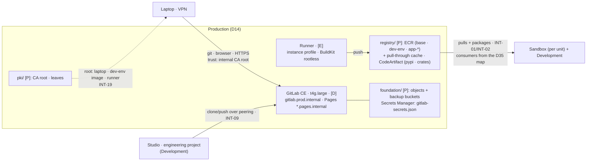

# Stage 7 — GitLab, Runners and ECR

| | |
|---|---|
| **Status** | not started — **pass 0 re-cut 2026-08-21**: it carried `pki/` and `registry/` on D36 §3's pull-forward, and the audit of that clause (Stage 6's Status row: one docs-only commit of 2026-08-16, and `git log --diff-filter=ADR` empty for both paths across every ref) found nothing had ever been built. **`production/pki/` returns to pass 1 here — the whole CA in one sitting**, root through leaves through the three client surfaces, plus a new **2.6** rebuilding the `dev-env` image with the root Stage 6 no longer bakes in; **`production/registry/` splits at step 5 into 5.a** (the `base`/`dev-env` pair, CodeArtifact, key and consumer policies — authored here, applied at Stage 6's pass 0, which is the only genuine pre-Stage-7 need) **and 5.b** (the pull-through cache and the per-application repositories, which stay here). Nothing else in the stage moved. **Earlier: revised 2026-08-16 into the pass/verification format, against the official GitLab and AWS documentation read the same day**; pre-instrumented by `./aws/supplychain.py`. Corrections folded in: the **Proves** row loses INT-08 (Stage 8's, per the integrations table); **ECR tag immutability is now written down** (Stage 8 cites "tags are immutable — Stage 7 step 5" against a step that never said it) and the **`base` repository is added** (Stage 8 builds `base` *and* `dev-env`; app images are `FROM base`); Kaniko is replaced by **BuildKit rootless** (archived 2025-06, its GitLab tutorial removed); runner registration is written against **authentication tokens** (registration tokens deprecated, removal at 20.0); **enhanced scanning is demoted to a decision** — basic scanning (free) carries the Stage 8 gate, Inspector measured (USD 0.09/0.01) and deferred to Stage 11 (principle 9); `gitlab-secrets.json` is **excluded from GitLab backups by design**, so the restore-or-generate flow through Secrets Manager is designed in and the value never crosses Terraform state; object storage uses the **consolidated form with `use_iam_profile`** (no keys — principle 2) and the built-in container registry is **disabled** (ECR is the registry); the GitLab `[P]` anchors move to `production/foundation/` (Stage 4's EIP pattern — the restore path must survive the destruction of the slice it restores); and the pull-through cache gained its three documented traps (credential secrets, immutability, the first pull) |
| **Prerequisites** | Stages 3 (the Production VPC, `prod.internal`/`pages.internal` and their associations, the two peerings) and 4 (the tunnel; **GitLab's SG admits the WireGuard instance's SG, never the client CIDR** — Stage 4 step 1.2). **Pass 0 is `production/registry/`'s 5.a half, and it runs inside Stage 6's own pass 0** — re-cut 2026-08-21, when the pull-forward clause was audited and found never to have been executed (Stage 6's Status row carries the audit). It is one step, not two: `pki/` came back to pass 1 here, D36 §3 amended, because nothing before this stage serves a `.internal` name for the root to authenticate. So when the rest of this stage starts, **`registry/` exists and `pki/` does not**, and Stage 6 has proven the cross-account image pull (INT-01) and package read (INT-02's consumer half) against a `dev-env` image built **without** the CA root — **step 2.6 is what closes that gap**, and it is a prerequisite of the INT-09 clone rather than a tidy-up. One deliverable (that clone) needs Stage 6's `engineering` project |
| **Consumes** | [D8](../decisions/D08-gitlab-hosting.md), [D11](../decisions/D11-lab-lifecycle.md), [D12](../decisions/D12-budget-ceiling.md), [D14](../decisions/D14-supply-chain-account.md), [D15](../decisions/D15-tls-internal.md), [D20](../decisions/D20-staging-account.md), [D26](../decisions/D26-unified-studio.md), [D35](../decisions/D35-sandbox-cardinality.md), [D36](../decisions/D36-internal-pki.md) |
| **Proves** | [INT-09](../integrations.md) (the `git clone` from the `engineering` project — deferred here by Stage 6 with the surface that needs it), [INT-13](../integrations.md) (CodeConnections — answered here because this is when GitLab first exists; expected to fail, the manual `git remote add` is the accepted path), [INT-19](../integrations.md) (the CA root on all three client surfaces). **Supplies** [INT-02](../integrations.md)'s provider half at pass 0 — the CodeArtifact domain policy and KMS key policy Stage 6 consumes. INT-08 is **not** here: the deploy roles are Stage 8's |

*Read with [`docs/plan/conventions.md`](../conventions.md) (naming, layout, `[P]`/`[D]`/`[E]`, IAM rules).*

**Forward constraint from D35:** the registries' consumers are **N + 1 accounts** (every unit's Sandbox plus
Development). The ECR and CodeArtifact resource policies and the registry KMS key policy all enumerate their
consumers **from one authored map, keyed by account folder, in `scripts/tfhygiene/backend.py`** — the ids
are resolved at tfvars generation through the sanctioned name-resolution path and reach the slice in the
**untracked** `terraform.auto.tfvars`, so no account id ever lands in a tracked file (`CLAUDE.md`'s rule). A
vend adds one map entry, and Lesson 14 never gets a chance. Nothing else in this stage multiplies: GitLab,
the runners and the CA are singular.

**Option preservation (D14):** the supply chain sits in Production for two cost reasons, and the revision
trigger can fire, so the move to a Shared Services account must stay a **re-target, not a rewrite**. Folders
are not boundaries (Lesson 5) — what makes the move cheap is the absence of same-account coupling: **(1)**
the registries in their own slice (`registry/`, never `data/` — they move, the buckets stay); **(2)** every
consumer enumerated in the account-id map above, even while the accounts share nothing but an id; **(3)**
`tooling/`, `runners/` and `registry/` read `foundation/` only through `terraform_remote_state` outputs that
would survive a move (VPC id, subnet ids), and `registry/` has **its own KMS key**, never `data/`'s; **(4)**
the CIDR is reserved — when Stage 3's step 1.3 writes the allocation table, it carries a
`10.60.0.0/16  shared (reserved, D14)` comment row. What stays sticky is GitLab's own state — repositories,
EBS, the private name, the certificate — and that is a restore-and-repoint, which is why step 8 rehearses
the restore for real.

---

**Objective:** source control, CI, docs hosting and the artifact registries — all private, all in
**Production** (D14), with TLS from the internal CA (D15) and no local accounts.

## What this stage builds, and in which accounts

| Where | What | Layer |
|---|---|---|
| `production/pki/` (new, **pass 1** — it was pass 0 until 2026-08-21) | the CA root and its own KMS key (D36), the publication of the root, and the two leaves: **the whole CA in one pass**, at the moment the first name to certify exists | `[P]` |
| `production/registry/` (new, **5.a at Stage 6's pass 0; 5.b here**) + `terraform-modules/ecr-repo/` | **5.a** — the `base`/`dev-env` repositories, CodeArtifact, the slice's own KMS key and the consumer-map policies, written here and applied one stage earlier because Stage 6 step 5.0 pushes into them. **5.b** — the pull-through cache and the per-application repositories, which nothing before this stage pulls from | `[P]` |
| `production/foundation/` (amended) | GitLab's `[P]` anchors: the object-storage and backup buckets, the `gitlab-secrets.json` secret container | `[P]` |
| `production/tooling/` (new) | the GitLab EC2 instance, EBS, snapshot policy, instance role, the rendered `gitlab.rb`, the `gitlab.prod.internal` and `*.pages.internal` records | `[D]` — stopped, never destroyed |
| `production/runners/` (new) | the runner instance and its role — the deploy credential shape of principle 2 | `[E]` |
| `production/egress/` (amended **only if** decision 1 picks the ALB) | the internal ALB and the ACM-imported leaves | `[E]` |
| Identity Center console, by hand | the custom SAML 2.0 application (step 3) | — |
| GitLab itself, by hand | the four groups, the repositories, the protected release tags | — |
| `scripts/` | `layers.py` rows: `tooling` `[D]`, `runners` `[E]` | — |

## Who executes each action

| Marker | Meaning |
|---|---|
| **[Claude]** | repository edits and read-only AWS calls — done without asking |
| **[Claude⚡]** | `terraform apply` or any AWS write — only after the user authorizes that specific action in chat, with the SSO user/account/permission set stated first |
| **[user]** | console acts (the SAML application in Identity Center), everything inside GitLab's own UI, browser flows, SSM sessions on the host, git tags, and every log entry |

Every apply in this stage runs as the **infrastructure user** through **`awsds-infra-prod`** (Production,
`InfrastructureAccess`), except step 3's SAML application — **`awsds-infra-identity`**'s console (Identity,
the IdC delegated administrator, D10).

## Step numbers are identifiers, not an order

These numbers are **stable addresses cited from other files** — step 1 (nginx option, the secret) from D15,
Stage 3 step 8.7 and `docs/plan/cost-model.md`; step 2 from Stage 6's prerequisites row and D36; step 3 (the
edition check) from Stage 8 steps 1.5/3.5 and `docs/plan/institutional-delta.md`; step 4 from Stage 3 step 4.4 and
D36; step 5 from Stage 3 step 8.4, Stage 6, Stage 8 and D36 §3; step 6 from `docs/GENERAL_PLAN.md` principle 2
and Stage 8 step 4; step 7 from Stage 8 step 6 and INT-09's fallback. They do not change. The sequence to
work in is **five passes**:

| Pass | # | What | Slice · layer | When / applied as |
|---|---|---|---|---|
| **0** | 5.a | the registries this stage's successor consumes: the `base`/`dev-env` ECR pair, CodeArtifact, the key and the consumer policies | `registry/` `[P]` | **at Stage 6's pass 0** — `awsds-infra-prod` |
| **1** | 1, 2.1-2.6, 5.b | the `[P]` anchors and the `tooling/` slice; **the whole CA — root, publication, leaves, the three client surfaces**; the pull-through cache and the app repositories | `foundation/` (amended), `tooling/` `[D]`, `pki/` (new), `registry/` (amended) | Stage 7 proper — `awsds-infra-prod` |
| **2** | 3, 4 | SAML + the edition check + groups and repositories; Pages | IdC console, GitLab UI, `tooling/` | user + Claude drafts |
| **3** | 6, 7 | the runner; the mirroring decision and the INT-13 reading | `runners/` `[E]` | `awsds-infra-prod`; INT-13: user, console |
| **4** | 8 | the lifecycle, the backup→destroy→restore rehearsal, the deliverables | `make down`/`up`, readings | user + Claude |

**Pass 0 shrank to one step on 2026-08-21, and the CA came home.** It used to carry `pki/` as well, on
D36 §3's argument that the `dev-env` image is built at Stage 6 and must already carry the root. The audit
of that pull-forward (Stage 6's Status row) settled it the other way: **the root's only pre-Stage-7
consumer was that image, and the only names the image can trust with it — `gitlab.prod.internal`,
`*.pages.internal` — are served by nothing until this stage's pass 1**, which is why step 2.4 defers the
leaves in the first place. So the whole CA is pass 1 now: root, publication, leaves, and the three client
surfaces in one sitting, with **2.6** rebuilding the `dev-env` image that was built without it. What stays
in pass 0 is the half Stage 6 genuinely cannot proceed without — **5.a**, and only because step 5.0 there
pushes into those repositories.

Pass 1's internal order carries the two edges that used to cross the pass boundary and one new one: the
leaves are issued from the root (2.4 after 2.1), the instance role reads the backup bucket (`tooling/`
after the `foundation/` amendment), and **2.6 needs 2.3's publication**. Pass 2
needs pass 1 — the SAML round-trip is a browser flow through `gitlab.prod.internal`, and an untrusted
certificate turns it into an unexplained loop, so the root lands on the laptop first (2.5). Pass 3 needs
pass 2 (a runner registers against a project). Pass 4 is the proof of everything before it.

---

## To execute

### 1. GitLab CE on EC2 — `production/tooling/` `[D]`, its `[P]` anchors in `foundation/`

**Action:** stand up GitLab CE Omnibus on a `t4g.large` in a Production private subnet, its bulky state in
S3, its secrets in Secrets Manager, reached by name over the VPN. **Why:** required by the objectives —
source control reachable only through the intranet — and D8/D14 fix the how and the where. **Explanation:**
the instance is `[D]` (stopped between sessions, ~USD 4/month of EBS — rebuilding real state from backup
every session is the fragile path, conventions §5.1 rule 2); everything that must survive a rebuild of the
instance lives in `[P]` slices, which is Stage 4's EIP pattern applied to GitLab.

- **1.1 — [Claude] Amend `production/foundation/` with the `[P]` anchors**, exported for `tooling/` to read:
  the **object-storage bucket** `awsds-prod-gitlab-objects` (one bucket, virtual buckets by prefix —
  documented single-bucket form; artifacts, LFS, uploads), the **backup bucket** `awsds-prod-gitlab-backup`
  (versioned, lifecycle-expiring old backups), and the **secret container** `awsds-prod-gitlab-secrets`
  (an `aws_secretsmanager_secret` with **no value resource** — the value is written only from the instance,
  1.5, so it never enters Terraform state). They sit in `foundation/`, not `tooling/`, because the restore
  rehearsal (8.2) destroys `tooling/` — the backup must survive the destruction of the slice it restores.
- **1.2 — [Claude] Write `production/tooling/`**: a `t4g.large` on **Amazon Linux 2023 arm64** —
  supported by Omnibus since 16.3.0 (read 2026-08-16), which keeps the project's AMI pattern (the SSM
  public parameter, `docs/plan/architecture.md` §4.1), the preinstalled SSM agent and the
  dnf-through-gateway-endpoint path; the GitLab package itself comes from `packages.gitlab.com`, which
  needs the NAT (`egress/` up during install and upgrades). EBS gp3 50 GB, `delete_on_termination =
  false` on the data volume, one **Data Lifecycle Manager** daily snapshot policy (DLM is free; snapshot
  storage is billed). Instance Name tag: **`awsds-prod-gitlab`** — a contract with `./aws/supplychain.py`.
  No port 22; SSM Session Manager only (the `amazon-ssm-*` families are in the 9.3 allow-list for exactly
  this host). The SG admits HTTPS from the **WireGuard instance's SG** (cross-account SG reference over the
  peering) and from **Development's private-subnet CIDR** (INT-09) — never `10.90.0.0/24`, which never
  crosses the peering (Stage 4 step 1.2).
- **1.3 — [Claude] Render `gitlab.rb` from a Terraform template** delivered by user data — configuration is
  code, not console: `external_url "https://gitlab.prod.internal"`; the **consolidated object storage**
  block pointed at 1.1's bucket with **`use_iam_profile = true`** (no keys anywhere — principle 2);
  `backup_upload_connection` to the backup bucket (backups are excluded from the consolidated form by
  GitLab's design); **container registry disabled** (`registry['enable'] = false` — ECR is the registry, by
  objective) and the packages feature off (CodeArtifact is the package proxy); Pages per step 4; SAML per
  step 3. The instance role gets S3 on the two buckets, `PutSecretValue`/`GetSecretValue` on 1.1's secret
  ARN, and nothing else.
- **1.4 — [Claude] Create the two DNS records in `tooling/`**: `gitlab.prod.internal` and
  `*.pages.internal` → the instance's **primary private IPv4** (documented to survive stop/start —
  verification (i); under decision 1's ALB alternative these become alias records in `egress/`).
- **1.5 — [Claude] Write the restore-or-generate flow into user data**: on boot, if 1.1's secret has a
  value, install it as `/etc/gitlab/gitlab-secrets.json` **before** `gitlab-ctl reconfigure`; if not (first
  boot only), reconfigure and push the generated file with `put-secret-value`. GitLab excludes this file
  from its own backups by design, and a backup restored without it cannot decrypt its database — this flow
  is what makes 8.2's rehearsal honest. `gitlab.rb` needs no such treatment: it is a rendered template in
  this repository.
- **1.6 — [Claude] Add the machinery rows in the same sitting**: `("production", "tooling")` `[D]` and
  `("production", "runners")` `[E]` in `scripts/tfhygiene/layers.py` — rank the `[E]` slices before
  `tooling`, so `make down ENV=prod` destroys runners (and the ALB, if chosen) before stopping GitLab. A
  slice with no row fails `make check`.
- **1.7 — [Claude⚡] Apply `foundation/` (amended) and `tooling/`** as `awsds-infra-prod`;
  `fmt`/`validate`/`plan` clean first. **[user]** First sign-in: read `/etc/gitlab/initial_root_password`
  through an SSM session (it self-deletes after 24 h), set the root password, and record in the log that
  **the local `root` account is kept** — it is GitLab's own break-glass when SAML breaks (step 3 creates no
  other local account).

### 2. TLS from the internal CA — `production/pki/` (D36, D15, INT-19)

**Action:** generate the root, issue the two leaves, and put the root on every client
surface. **Why:** ACM cannot issue for `.internal` names and Private CA is over budget (D15); the audience
is three clients this project builds, so the trust chain is ours — and a missed surface fails as an opaque
TLS error at `git clone` time, not as an access denial (INT-19). **Explanation:** the whole step is
**pass 1**, and that is a change of 2026-08-21 (D36 §3 amended) — it used to straddle two passes, the root
created early for Stage 6's image and the leaves waiting *"for pass 1, when something exists to serve
them"*. **That clause was the argument against its own schedule:** a root whose leaves have nothing to
serve is a trust anchor for names nobody answers to, and the image that carried it could not have used it.
The cost of the correction is one image rebuild — **2.6** — paid in the same sitting that first has
something to clone.

- **2.1 — [Claude] Write `production/pki/`** (pass 1): the root CA via the `tls` provider — **its own
  slice, its own state file, its own KMS key, and the private key never an output** (D36; the state-file
  custody trade is stated there). Outputs: the CA certificate and, from 2.4 on, the leaves.
- **2.2 — [Claude⚡] Apply it** as `awsds-infra-prod` (pass 1). **Its state key already exists and has since
  2026-08-15**: `alias/awsds-prod-tfstate-pki`, created by `production/bootstrap/` at Stage 2 step 3.4 —
  a ~USD 1/month key that encrypts nothing until this apply, and whose own file said "Stage 7" a day
  before the Stage 6 clause said otherwise. **[user]** Record the CA
  certificate's **fingerprint** in the stage log in the same sitting (D36 §5 — without it a substituted
  root is indistinguishable from the real one).
- **2.3 — [Claude] Publish the root from one source** (INT-19, Lesson 14): a `[P]` S3 object in an existing
  Production bucket **and** the SSM parameter **`/datascience/prod/pki/ca-root-pem`** (the `/datascience/`
  path because Parameter Store reserves `aws*` — conventions §6). **2.6's image rebuild** and step 6's
  runner user data both read these; nothing pastes the PEM. *(Until 2026-08-21 the first reader was named
  as Stage 6's image build — it no longer is: that build happens a stage before this parameter exists.)*
- **2.4 — [Claude] Issue the two leaves** (same pass, amending `pki/`): `gitlab.prod.internal` and
  `*.pages.internal`, **≤ 398 days** (D15 note 5 — trust stores are not assumed to exempt local roots).
  `tooling/` reads them through `terraform_remote_state` and lands them on the instance for nginx
  (decision 1); under the ALB alternative they are **imported into ACM** instead — imports are free, but
  **ACM does not renew them**: the re-import date goes into the log either way, and
  `./aws/supplychain.py` `SC-8` watches the expiry.
- **2.5 — [user] Trust the root on the laptop** before step 3 (macOS keychain; `git`, `curl` and Python
  each have their own CA-bundle opinion — Claude drafts the exact commands). The other two surfaces:
  the `dev-env` image takes it at **2.6**; the runner takes it in step 6's user data. The
  three-surface proof is this stage's INT-19 deliverable.
- **2.6 — [user] Rebuild and repush the `dev-env` image with the root** (new 2026-08-21, the price of
  moving `pki/` back into this stage): the image Stage 6 step 5.0 built by hand carries an **empty
  CA-install layer** — the `Dockerfile`'s copy + `update-ca-certificates` with no source — and this is
  where it gets filled, from 2.3's one source, never a pasted PEM. Same laptop, same tunnel, same
  immutable-tag discipline; **record the new digest in the log** beside the old one, because the SMUS
  spaces select an image by version and Stage 6 step 5.1's registration has to be pointed at the new one
  (INT-17's mechanism, already recorded there). **This is the second and last hand-built image**, and it
  is the *same* bootstrap exception rather than a new one — Stage 8 step 1's pipeline replaces both.
  **It gates the INT-09 clone**: a notebook that does not trust the root fails `git clone` with an opaque
  TLS error, which is INT-19's whole failure mode. If Stage 8 has already landed when this stage runs,
  the rebuild is that pipeline's first run and this sub-step becomes a reading rather than a build.

### 3. SAML against Identity Center, the groups, and the edition check (D20, Lesson 12)

**Action:** make Identity Center GitLab's only sign-in, mirror the personas as GitLab groups, and verify
which approval-gate features this CE instance actually has. **Why:** no local accounts is the identity
model (principle 2's human half), and **two Stage 8 gates hang on the edition answer** — the deployment
approval (D20) and the dev-env release — so the check happens now, before Stage 8 is written, not during
it. **Explanation:** SAML *login* is a Free-tier feature; **SAML Group Sync, protected environments and
deployment approvals are Premium** (read 2026-08-16) — memberships are therefore maintained by hand, and
the CE gate shape is `when: manual` on a protected tag/branch.

- **3.1 — [user] Create the custom SAML 2.0 application in the Identity Center console** (Identity
  account — the IdC delegated administrator, D10), with every field named (Lesson 16): display name
  `GitLab`; **Application ACS URL** `https://gitlab.prod.internal/users/auth/saml/callback`; **Application
  SAML audience** `https://gitlab.prod.internal`; attribute mappings **Subject →** `${user:email}`
  (format `emailAddress`) and **`email` →** `${user:email}` (format `basic`); assign the four
  `sso-group-*` groups to the application. Download the IdC metadata (SSO URL + certificate) for 3.2.
  Note the IdC portal itself is reachable off-VPN (INT-16's recorded reading) — the *GitLab* half of the
  round-trip is VPN-only, so sign-in works only with the tunnel up.
- **3.2 — [Claude] Add the SAML block to the `gitlab.rb` template**: `idp_sso_target_url` and
  `idp_cert_fingerprint` from 3.1's metadata (as variables, not literals), `issuer
  "https://gitlab.prod.internal"`, `name_identifier_format
  "urn:oasis:names:tc:SAML:1.1:nameid-format:emailAddress"`, `attribute_statements email: ['email']`,
  `block_auto_created_users = false`, and `omniauth_auto_link_saml_user = true` so the root account can
  also link. **[Claude⚡]** Apply + reconfigure. **[user]** Prove the round-trip: sign in as a
  data-scientist user, record which NameID/attribute shape worked (verification (iii)).
- **3.3 — [user] Read the edition answer off the running instance** (verification (iv)): in a test
  project's settings, are **Protected environments** and **deployment approval rules** present at all?
  Expected: absent in CE. Record it — the answer decides whether Stage 8's two gates are D20's approval
  as designed (Premium) or the CE fallback: **protected tags plus hand-maintained group membership**,
  where the control becomes *who can push the tag* and CloudTrail on the two deploy roles (INT-08,
  Stage 8) becomes the record of what happened. `docs/plan/institutional-delta.md` already carries the row.
- **3.4 — [user] Create the four GitLab groups**, mirroring the Identity Center groups 1:1 in
  *membership* and deliberately not in name — `data-scientists`, `deployment-managers`,
  `governance-managers`, `dev-env-stewards`, **without** the `sso-group-` prefix (the identity seam's
  first rule, conventions §6: a bare name is a GitLab object granting nothing in AWS). Nothing enforces
  the membership pairing until a Premium upgrade automates it — re-check it by hand when people change.
- **3.5 — [user] Create the repositories**: the application repositories (`app-etl` first, conventions
  §6's template) and **`dev-env/`** — writable by `data-scientists`, its **release tag protected** so only
  `dev-env-stewards` can push it (the CE shape of Stage 8 step 1's gate).

### 4. GitLab Pages — the second domain, the wildcard, the leaf (D36)

**Action:** enable Pages on `*.pages.internal`, VPN-only. **Why:** the objectives require docs over the
intranet, and Pages serves **user-supplied content** — it must live on a domain distinct from the GitLab
host, or every published page could read the GitLab session cookie (the documented XSS rationale;
`pages.internal` as a separate *domain*, not a separate host, is D36's naming note). **Explanation:** the
zone and its cross-account associations already exist — Stage 3 step 4 built `pages.internal` and
associated it with the Sandbox and Development VPCs. This step adds the record (1.4), the leaf (2.4) and
the configuration.

- **4.1 — [Claude] Add the Pages block to `gitlab.rb`**: `pages_external_url "https://pages.internal"`,
  the wildcard leaf and key as `pages_nginx['ssl_certificate']`/`ssl_certificate_key`, and **access
  control on** (a Free-tier feature: a page visit requires a GitLab session on top of the VPN — one click
  per browser session, and the docs stop being readable by anything that merely reaches the network).
- **4.2 — [user] Prove it end to end**: a docs build published by a pipeline (pass 3) serves at
  `https://<project>.pages.internal` from the laptop — and later from a `dev-env` notebook, which is two
  of INT-19's three surfaces exercised by one URL.

### 5. The registries — `production/registry/` `[P]`, split **5.a (pass 0, at Stage 6) / 5.b (pass 1, here)** (D14, D36 §3, INT-02)

**Action:** create the ECR repositories, the pull-through cache and the CodeArtifact domain, with
resource and key policies enumerating the Interactive consumers. **Why:** under egress design B this is
how packages and images reach SageMaker at all, and the `dev-env` image build (Stage 6 step 5.0) pushes
here — so *that part* of the slice cannot wait for this stage's natural position. **Explanation:** everything `[P]` and
free at rest except stored bytes; consumers come from the D35 map, the key is this slice's own
(option-preservation measures 2-3).

> **The split, cut 2026-08-21 by consumer rather than by convenience.** The whole slice used to be pass 0
> on the strength of one sentence in Stage 6's Prerequisites row, which turned out never to have been
> executed. Re-derived from what Stage 6 actually consumes:
>
> - **5.a — pass 0, applied inside Stage 6's own pass 0** (`awsds-infra-prod`): the `base` and `dev-env`
>   repositories (5.1 minus the per-application ones), CodeArtifact and its two repositories (5.3), the
>   slice's KMS key and the consumer-facing policies (5.4). Stage 6 step 5.0 pushes into the first;
>   design B at its pass 4 reads packages from the second (INT-02's consumer half).
> - **5.b — pass 1, here**: the **pull-through cache** (5.2 entire) and the **per-application
>   repositories** (`awsds-prod-ecr-app-etl`). Nothing before this stage pulls a public image — the
>   `dev-env` build at Stage 6 runs on the laptop against public registries directly — and no application
>   image exists until Stage 8. The cache also wants Production's NAT up to prime it (5.2's second trap),
>   which is this stage's operational context, not Stage 6's.
>
> **The slice is one slice**: 5.b amends what 5.a applied, the way Stage 6's egress steps amend Stage 3's
> `egress/`. Two applies of one folder, not two folders.

- **5.1 — [Claude] Write `terraform-modules/ecr-repo/` and the repositories** — the module's first caller
  is this slice (the Stage 3 step 1.1a rule): **`awsds-prod-ecr-base`**, **`awsds-prod-ecr-dev-env`**
  (the two images of Stage 8 step 1 — every app image is `FROM base`, so `base` gets a repository too),
  both **5.a**; and `awsds-prod-ecr-app-etl` (one per application), **5.b** — no application image is
  built before Stage 8, so it is a repository nothing would push to for two stages. On each: **tag immutability on** (the property
  Stage 8's "tags are immutable" and the whole approved-digest chain stand on), **basic scan-on-push**
  (free; findings via `DescribeImageScanFindings` — decision 2 records why not enhanced), and a lifecycle
  policy expiring untagged images.
- **5.2 — [Claude] Create the pull-through cache rules (5.b)** for the credential-free upstreams — Amazon ECR
  Public, `registry.k8s.io`, Quay (decision 3; Docker Hub needs a `ecr-pullthroughcache/…` Secrets
  Manager secret — its documented name prefix, an exception to the `awsds-` convention — and is added
  only when a build actually needs it). Three documented traps, written here so nobody rediscovers them:
  **immutability must not reach the cache repositories** (an immutable tag blocks the cache update — no
  repository creation template forcing it; our own repositories set it per-repository, which does not
  collide); **the first pull of any image needs a route to the internet** — prime the cache from
  Production while its NAT is up, after which Interactive consumers under design B read the cached copy;
  and cached repositories are created by ECR, so the consumer grant rides on the **registry-level**
  permission policy, not per-repository ones.
- **5.3 — [Claude] Create the CodeArtifact domain `awsds-prod-packages` (5.a)** with two repositories:
  `pypi` (external connection `public:pypi`) and `crates` (`public:crates-io` — Cargo is supported, GA
  2024-06, confirming open question 5's note; Julia and R stay uncovered and arrive baked into the
  dev-env image, `docs/plan/architecture.md` §4.3).
- **5.4 — [Claude] Write the three consumer-facing policies from the D35 map (5.a)** (the `backend.py` map of
  the forward-constraint note — ids arrive in the generated tfvars, never committed): the ECR
  registry/repository policies and the CodeArtifact domain policy grant **pull/read only** to the map's
  accounts; the slice's **own KMS key** policy grants the same set `Decrypt`. A vend adds one map entry
  and nothing else changes (Lesson 14; option preservation).
- **5.5 — [Claude⚡] Apply `registry/` twice, as `awsds-infra-prod`**: the **5.a** apply happens in
  **Stage 6's pass 0**, before its step 5.0 has anywhere to push — that is the whole reason this step
  exists ahead of its stage, and it now has a row in Stage 6's pass table instead of a sentence in its
  Prerequisites row; the **5.b** apply happens here, at pass 1. **The `layers.py` machinery lands with
  5.a** — the `registry` RANK went in on 2026-08-21, ahead of the slice, because an unranked slice name
  raises at import and would fail `make check` before the apply could run; the `SLICES` row goes in with
  the folder. The cross-account **proof** is
  Stage 6's (INT-01, INT-02's consumer half); `./aws/supplychain.py` sections 5-7 keep the mechanical
  half — the policies, and a real consumer-side read — readable afterwards. **One caveat on that script,
  measured 2026-08-21:** it flips notes into failures only once the GitLab host exists
  (`built = bool(host_rows)`, this stage's pass 1), so it will report a missing 5.a as a **note** and
  never as a regression — it is not the instrument that guards Stage 6's pass 0.

### 6. GitLab Runners — `production/runners/` `[E]` (principle 2, Stage 8 step 4)

**Action:** stand up one runner on EC2 in the Production private subnet, authenticating to AWS through
its **instance profile**. **Why:** a VPN-only GitLab cannot serve a JWKS that IAM can fetch, so OIDC
federation is structurally unavailable — the instance profile *is* the machine credential (principle 2);
the runner is `[E]` because it holds nothing worth keeping. **Explanation:** one `t4g.large` while up
(builds of the dev-env image are memory-hungry; it exists only during sessions), docker executor; the
autoscaling question is decision 5.

- **6.1 — [Claude] Write `production/runners/`**: instance Name tag **`awsds-prod-runner`** (the script's
  contract), user data that installs `gitlab-runner` (arm64), **trusts the CA root from 2.3's one
  source**, and registers against GitLab with an **authentication token** (`glrt-…`) read from a
  git-ignored tfvars — the runner is created first in GitLab's UI/API and hands back the token
  (registration tokens are deprecated, removal at 20.0; verification (viii)). Instance role: push to the
  two image repositories, read CodeArtifact — **no deploy permissions**; the deploy runner and its roles
  are Stage 8's (INT-08), kept apart so this role never accumulates them.
- **6.2 — [Claude] Configure container builds with BuildKit rootless** (or Buildah) — **not Kaniko**,
  which was archived in 2025-06 and whose GitLab tutorial was removed, and **no privileged
  Docker-in-Docker**. The build needs egress for public dependencies (the dev-env image build is where
  Julia, R and Rust arrive): that is Production's NAT, up while `egress/` is up — the one legitimate
  internet path under both egress designs, and it belongs to the build account, not the notebook.
- **6.3 — [Claude⚡] Apply through `make up ENV=prod`**, and **[user]** run the first pipeline: a
  `.gitlab-ci.yml` on `app-etl` that builds and pushes an image — the pipeline deliverable.

### 7. The mirroring policy, and the INT-13 reading

**Action:** decide what mirrors between this GitHub repository and GitLab, and record whether
CodeConnections can reach a VPN-only GitLab at all. **Why:** Stage 8 step 6 needs the mirroring answer to
place the infrastructure pipeline, and INT-13 is answered at the first moment GitLab exists.
**Explanation:** both are recordings, not builds.

- **7.1 — [user] Decide the mirror** (decision 4; recommended: none standing — GitLab hosts the
  application repositories, this infrastructure repository stays on GitHub, and a per-repository **push
  mirror** (a Free-tier feature; pull mirroring is Premium) is added only if INT-09's fallback ever
  needs it). Record it in the log; Stage 8 step 6 consumes the answer.
- **7.2 — [user] Read INT-13**: from Data Governance (the domain's account, which has **no VPC** by
  D22/D26), attempt the CodeConnections **host** for `https://gitlab.prod.internal` in the console — a
  host for a private instance requires VPC connectivity the account does not have, so the expected
  answer is that it cannot reach it. Record the wording, delete anything half-created, and record the
  **manual `git remote add` + push from inside the project** as the accepted path (INT-13's fallback is
  the normal path, not a degradation — D26 already accepts it).

### 8. The lifecycle, and the rehearsed restore (D11, conventions §5.1 rule 6)

**Action:** prove `make down`/`make up` against the new slices, measure the boot, and walk the
backup→destroy→restore path once. **Why:** a `[D]` choice is a cost judgement that rule 7 re-opens if the
boot is slow, and a recovery path that has never been walked is a claim, not a path (Lesson 5; D36 §6
applies the same discipline to the CA). **Explanation:** the rehearsal happens now, while the instance
holds throwaway content.

- **8.1 — [user] Run the cycle**: `make down ENV=prod` destroys the runner (and ALB, if chosen) and
  **stops** GitLab; `make up` restores it. Measure the boot to first HTTPS answer (verification (vi)) —
  D8 assumed 3-5 minutes; much worse re-opens the layer choice (§5.1 rule 7).
- **8.2 — [user] Rehearse the restore, once**: `gitlab-backup create` (to the backup bucket), destroy
  `tooling/`, re-apply, let 1.5's flow restore `gitlab-secrets.json`, `gitlab-backup restore`, and prove
  a pre-backup repository clones cleanly. Record the measured time — this is the DR path D8 accepted in
  exchange for `[D]`, and the backup schedule (a cron entry in user data, daily while the instance runs)
  is set in the same sitting.
- **8.3 — [Claude] Diff `./aws/supplychain.py` across the cycle** — only timestamps and instance state
  may change; anything else is state that leaked into the wrong layer.

---

## Deliverables

Each is written so its output differs between working and broken (Lesson 13). **The mechanical half is
`./aws/supplychain.py`** ([`aws/INDEX.md`](../../../aws/INDEX.md)): the host and its `[D]` state, the
anchors, the leaf expiry, the repositories with immutability and scan-on-push, the cache rules, the
CodeArtifact domain, the consumer policies, the runner. The behavioural proofs are the stage's own
(Lesson 20):

- **The clone pair:** `git clone https://gitlab.prod.internal/...` succeeds from the laptop with the
  tunnel up and fails with it down — and succeeds **from a notebook in the `engineering` project**, which
  is INT-09's network path over the Development↔Production peering.
- **The pipeline:** a commit to `app-etl` runs on the private runner and pushes an image to
  `awsds-prod-ecr-app-etl`; a second push of the **same tag is rejected** (immutability doing its job).
- **The TLS triple (INT-19):** the Pages site and GitLab answer over HTTPS with certificates that
  validate against the internal CA on **all three surfaces** — laptop browser/git, a `dev-env` notebook,
  and the runner's own job log. "It works in my browser" tests only the surface where somebody clicked
  through a warning.
- **The identity pair:** an Identity Center user signs in through SAML with no local account created by
  hand; the kept `root` account still signs in locally (GitLab's own break-glass).
- **The lifecycle and the restore:** 8.1's cycle with the boot time recorded; 8.2's restore proving a
  repository survives the death of the instance.
- **Two recordings:** the edition answer (3.3 — it decides Stage 8's two gates), and INT-13's reading
  (7.2 — the manual `git remote add` recorded as the accepted path).

## Validation

1. Run `./aws/supplychain.py` — all `SC-*` pass; diff two runs across 8.1's cycle (8.3).
2. Run `./aws/egress.py` §6 at the session's end — zero burn; a forgotten runner or ALB is this stage's
   likeliest leak.
3. Read every denial by its wording, never its exit code (standing rule since 1c).

## Cost

Measured (`docs/PRICING.md`), us-west-2:

| Item | Cost | Layer |
|---|---|---|
| GitLab `t4g.large` while up | 0.0672/h | `[D]` |
| GitLab EBS 50 GB gp3 | ~USD 4.00/month | `[D]` idle — the largest idle item |
| EBS snapshots (DLM daily) | snapshot storage, measured at the first backup | `[P]` |
| Object-storage + backup buckets | ~USD 0.023/GB-month — cents at lab scale | `[P]` |
| `gitlab-secrets.json` secret | USD 0.40/month + 0.05/10k calls (measured 2026-08-16) | `[P]` |
| ECR storage (~10 GB) | ~USD 1.00/month — already a floor row | `[P]` |
| CodeArtifact | 0.05/GB-month + 0.05/10k requests | `[P]` |
| Runner `t4g.large` while up | 0.0672/h | `[E]` |
| Internal ALB (only if decision 1 picks it) | 0.0225/h + LCU | `[E]` |
| Enhanced scanning (deferred, decision 2) | 0.09/image + 0.01/re-scan (measured 2026-08-16) | Stage 11's |

## Decisions due while executing

**Blocking questions for the user: none.** Each is decided during the stage and written into
`docs/log/log-stage-07-gitlab-runners-ecr.md` (Lesson 16). Recommendations stated so the keyboard is not
the decision-maker.

1. **TLS termination: nginx on the instance, or the internal ALB** (steps 1-2) — recommended: **nginx on
   the instance**. The ALB was in the design to terminate a public ACM certificate; with D15 revised
   there is none, Omnibus's own nginx serves the internal leaves (Pages wildcard included), the primary
   private IP survives stop/start so the records hold, and an `[E]` resource, its 0.0225/h and its
   rebuild path all disappear. The ALB stays the documented alternative if instance-side TLS proves
   awkward; the CA and the leaves are identical either way (D36 §6).
2. **ECR scanning: basic or enhanced** (5.1) — recommended: **basic scan-on-push** (free) now; it feeds
   `DescribeImageScanFindings`, which is what Stage 8's gate reads. Enhanced (Inspector — OS *and*
   language packages, continuous) is measured at USD 0.09/image + 0.01/re-scan and is decided at
   **Stage 11 step 4** with the rest of the paid detection, against a real bill (principle 9, Lesson 6).
3. **The pull-through cache upstream set** (5.2) — recommended: the credential-free three (ECR Public,
   `registry.k8s.io`, Quay). Docker Hub adds a credential secret (their account, their rate limits,
   +USD 0.40/month) — added when a build actually pulls from it, not before.
4. **The mirroring policy** (7.1) — recommended: no standing mirror; per-repository push mirroring
   (Free) only if a need appears. Stage 8 step 6 places the infrastructure pipeline against this answer.
5. **Runner shape** (6.1) — recommended: **one `[E]` instance, docker executor**, rebuilt per session.
   The docker-autoscaler/fleeting path is adopted when a measured queue wait justifies it, not before.

## Verifications to answer while executing

Record every answer, including the ones that come out fine.

| # | Question | Step |
|---|---|---|
| i | Does the primary private IPv4 survive stop/start, so the two records never need repointing? | 1.4 |
| ii | Does the restore-or-generate flow round-trip `gitlab-secrets.json` through Secrets Manager on a fresh boot? | 1.5 |
| iii | Does the SAML round-trip complete against the IdC custom application — and which NameID format + attribute mapping worked? | 3.2 |
| iv | The edition check: are protected environments / deployment approval rules absent on this CE instance (decides Stage 8's two gates — Lesson 12)? | 3.3 |
| v | Does backup → destroy → restore reproduce a working instance, and in how long? | 8.2 |
| vi | Is the boot inside D8's assumed 3-5 minutes (§5.1 rule 7 re-opens the layer choice if not)? | 8.1 |
| vii | Does a first pull populate the cache through Production's NAT, and does the cached copy then pull with no internet route (the design-B premise)? | 5.2 |
| viii | Does the runner register through the authentication-token flow, and does BuildKit rootless build and push without privileged mode? | 6.1, 6.2 |
| ix | Can a CodeConnections host be created toward `gitlab.prod.internal` from the no-VPC domain account at all (INT-13 — expected: no)? | 7.2 |
| x | Does `https://<project>.pages.internal` validate against the CA on all three client surfaces (INT-19)? | 2.5, 4.2 |
| xi | Does the `engineering` project clone and push over the peering (INT-09)? | deliverables |

## Risks

- **Losing `gitlab-secrets.json` loses every backup at once** — the file is excluded from backups by
  GitLab's design, and a restore without it cannot decrypt the database. The control is 1.5's flow plus
  the rehearsal (8.2), run before the instance holds anything real.
- **The edition limit reaches a load-bearing control, not a convenience** (Lesson 12): in CE the gate is
  *who can push a protected tag*, not *who approves this release*. It is read in 3.3 and recorded — not
  discovered while writing Stage 8.
- **A missed CA surface fails as an opaque TLS error** at the worst moment (INT-19); the one-source rule
  (2.3) and the three-surface deliverable are the controls.
- **The supply chain shares Production's blast radius** (D14, accepted): no boundary between the thing
  that builds and the thing that runs. The compensations are Stage 8's (scoped deploy roles, CloudTrail
  alarms); this stage's contribution is the runner role that deliberately holds no deploy permissions
  (6.1).
- **A forgotten runner (or ALB) burns unwatched** — D12 skipped the alerts; `./aws/egress.py` §6 at
  session end is the instrument.
- **SAML lockout**: a broken IdP mapping with local sign-ups disabled would lock everyone out — the kept
  `root` account (1.7) is the way back in.

---

*Stage index: [stages/INDEX.md](INDEX.md) · Plan core: [GENERAL_PLAN.md](../../GENERAL_PLAN.md)*
