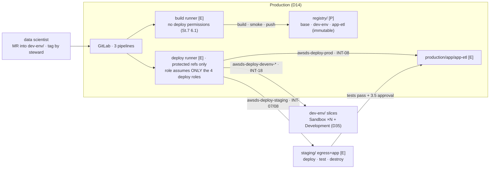

# Stage 8 — CI/CD pipelines

| | |
|---|---|
| **Status** | **RE-SCOPED 2026-09-05.** (1) **The chain is `Sandbox → Staging → Production`** — every "Development → Staging" sentence here is stale, and the *engineering* apply of step 2.4 (`app-etl` against real data, by hand) loses its home: it moves to a new `sandbox/app/app-etl/` slice applied **by hand** as `awsds-infra-sandbox-1`, and CI never applies into Sandbox — which is the answer to D21's surviving objection. (2) **`awsds-deploy-devenv-dev` and the Development image-parity half die** with the second Interactive account; `CI-6` prints `note` ("N=1, parity trivially true") rather than `pass` until Stage 14 vends a second unit. (3) **The runners have no NAT** — see Stage 7's note (3): every build step is an explicit-proxy client, and the promotion lint runs on the runner in `VPC-SharedServices`. (4) **The workflow lint grows four rules** (from [6d](stage-06d-unified-studio-remainder.md) step 4): reject project-scoped references, rewrite `start_date` at deploy time, enforce MWAA Serverless's operator allow-list and the 3600 s task cap, and pin `DefinitionS3Location.VersionId`; artifact class **(2b) operator code package** is added to D28. (5) **The SageMaker Unified Studio CI/CD CLI is an exporter, never a deployer**: it deploys only into existing SMUS *projects*, which a Workload account will not have — so `bundle` may produce the artifact on the Sandbox side and this stage's pipeline remains what applies into Staging and Production. — *earlier:* not started — **revised 2026-08-16 into the pass/verification format, against the official GitLab and AWS documentation read the same day**; pre-instrumented by `./aws/cicd.py`. Corrections folded in: the dev-env chain is reordered **push before scan** (ECR scan-on-push fires on arrival — the old order gated on findings that could not exist yet, and an image is re-scannable only once per 24 h, so the gate *reads* the push's scan and never triggers another); **GitLab Dependency Scanning is Ultimate** (Lesson 12 again), so the dependency gate is `pip-audit` in an ordinary job, with the Free Secret Detection template beside it; a CE manual job **blocks only when `when: manual` sits under `rules:`** (outside it, `allow_failure` defaults true and the "gate" waves through); the deploy-role scope was wrong — the promotion pipeline applies Staging's **`egress/`** too, so "app slices only" now reads "`egress/` + `app/*`"; the dev-env registration fan-out is **N + 1 targets from the D35 map**, not "Sandbox and Development"; INT-17's attachment point is now documented and the pipeline is written against **Stage 6 step 5.1's recorded mechanism**; job containers reach the instance profile because the declarative policy already defaults **IMDSv2 hop limit 2** org-wide; and the RCP was read before step 6 — `sts:AssumeRoleWithWebIdentity` is outside its deny, so GitHub OIDC is *possible* and still declined (decision 3) |
| **Prerequisites** | Stage 7 — the build runner, the registries with immutable tags, the protected-tag shapes (3.5), **the recorded edition answer (3.3)** that fixes both gates' CE form, and the mirror answer (7.1). Stage 6 — **step 5.1's recorded INT-17 mechanism** and the hand-built image digest step 1.6 replaces. **The `Staging` vend gates pass 4 alone** (quota ticket open): passes 0-3 and 5 run without it |
| **Consumes** | [D5](../decisions/D05-sagemaker-egress.md), [D8](../decisions/D08-gitlab-hosting.md), [D14](../decisions/D14-supply-chain-account.md), [D17](../decisions/D17-interactive-vs-runtime.md), [D20](../decisions/D20-staging-account.md), [D21](../decisions/D21-development-account.md), [D35](../decisions/D35-sandbox-cardinality.md) |
| **Proves** | [INT-07](../integrations.md) (Staging pulling the application image under the pipeline's role), [INT-08](../integrations.md) (the two deploy roles, distinguishable in CloudTrail), [INT-18](../integrations.md) (the dev-env deploy roles reaching from Production into the Interactive accounts). **Exercises INT-17's automated half** — the mechanism itself is recorded at Stage 6 step 5.1; what this stage adds is the pipeline making the same registration |

*Read with [`docs/plan/conventions.md`](../conventions.md) (naming, layout, `[P]`/`[D]`/`[E]`, IAM rules).*

**Forward constraint from D35:** step 1's registration writes into **N + 1 accounts** (every unit's
Sandbox plus Development). The target list, the per-target roles and the trust-policy ARNs are all
enumerated **from the authored map in `scripts/tfhygiene/backend.py`** (Stage 7's forward-constraint
pattern) — a vend adds one map entry and Lesson 14 never gets a chance. **The promotion chain is untouched
by N** (D21/D35): whatever the Sandbox count, there is one Development, one tag, one Staging leg, one gate.

---

**Objective:** the three pipeline types the objectives name — dev-env, application build, deployment —
plus the promotion gate, on the Stage 7 supply chain. **The promotion boundary is D17's four artifacts**:
the container image (ECR), the model version (Model Registry, from Stage 9), the workflow/application code
(a git tag), and the Terraform that instantiates them.

## What this stage builds, and in which accounts

| Where | What | Layer |
|---|---|---|
| `production/foundation/` (amended) | `awsds-deploy-prod` (INT-08) + the deploy-role misuse alarm | `[P]` |
| `staging/foundation/` (amended, **after 6b**) | `awsds-deploy-staging` (INT-08) + the same alarm | `[P]` |
| `sandbox/foundation/`, `development/foundation/` (amended) | the dev-env deploy roles (INT-18), one per target | `[P]` |
| `production/registry/` (amended) | the **app-repository** pull grant for Staging (INT-07) — deliberately not the D35 Interactive map | `[P]` |
| `production/runners/` (amended) | the **deploy runner** — protected, project-locked, its role only assumes the four deploy roles | `[E]` |
| `development/app/app-etl/` (new), `staging/`, `production/` idem | the application slices — Development applied by hand (step 2), the other two by the pipeline (step 3) | `[E]` |
| GitLab, by hand | the three `.gitlab-ci.yml`s, repository roles, protected release tags, the deploy runner's registration, CI variables | — |
| GitHub | the infrastructure repository's offline-gates workflow (step 6) | — |
| `scripts/` | `layers.py`: `app/app-etl` rank, the `[E]` rows, **refusal 5**; `backend.py`: the dev-env target map, the app-consumer entry; the `make` `PROFILE` override | — |

## Who executes each action

| Marker | Meaning |
|---|---|
| **[Claude]** | repository edits (Terraform, `.gitlab-ci.yml`, workflow files, scripts) and read-only AWS calls — done without asking |
| **[Claude⚡]** | `terraform apply` or any AWS write — only after the user authorizes that specific action in chat, with the SSO user/account/permission set stated first |
| **[user]** | everything inside GitLab's UI (roles, protected tags, runner registration, CI variables, running manual jobs), git pushes and tags, GitHub settings, and every log entry |
| **[pipeline]** | a job that runs by itself once its trigger fires — written by Claude, triggered by the user's push or tag, credentialed by step 4 |

Hand applies in this stage run as the **infrastructure user**: `awsds-infra-prod` (Production),
`awsds-infra-sandbox-1` and `awsds-infra-dev` (the Interactive foundations), `awsds-infra-staging`
(Staging, once vended). The pipelines themselves run under the **deploy runner's instance profile** and
the step 4 roles — never an SSO profile, never a stored key.

## Step numbers are identifiers, not an order

These numbers are **stable addresses cited from other files** — step 1 from Stage 6 steps 5.0-5.1,
Stage 7 steps 3.5/5.1, `docs/plan/conventions.md` §6 (the `dev-env/` slices) and INT-17/INT-18; **steps 1.5 and
3.5** (the two approvals) from Stage 7 step 3 and `docs/plan/institutional-delta.md`; step 2 from conventions §6
and D21; step 4 from `docs/GENERAL_PLAN.md` principle 2 and Stage 7 step 6; step 6 from Stage 7 step 7. They do
not change. The sequence to work in is **six passes**:

| Pass | # | What | Needs |
|---|---|---|---|
| **0** | — | consume the three recorded answers: the edition (St.7 3.3 → both gates' shape), the INT-17 mechanism (St.6 5.1), the mirror policy (St.7 7.1) | readings, no build |
| **1** | 4 | the deploy credential layer: roles, the deploy runner, the misuse alarm | Stage 7 pass 3 |
| **2** | 2, 5 | the application build pipeline, with the gates written once | pass 1 (runner) |
| **3** | 1 | the dev-env chain, ending in the INT-18 registration | passes 1-2; St.6 5.1 |
| **4** | 3 | the promotion chain Development → Staging → Production | **the `Staging` vend**; passes 1-2 |
| **5** | 6 | the infrastructure repository's own pipeline; validation | pass 0 (7.1's answer) |

**On ordering:** this stage builds the promotion *machinery* — the chain, the gates, the deploy roles. The
Staging and Production *data platforms* are Stage 9's, so until then the chain is exercised with an
application that touches no data: a pipeline proven only against real data is a pipeline whose failures
are ambiguous.

---

## To execute

### 1. Development-environment pipeline — the runtime release chain (D17, INT-17, INT-18)

**Action:** build the release process for the images every notebook and Studio app runs on — `base` and
`dev-env` — from a data-scientist-writable repository to a steward-gated registration in every Interactive
account. **Why:** D17's "promote only the code" is only true if the runtime the code lands on is identical
to the one it was written against, and the only way to make that true *by construction* is a **common
ancestor image**: application images are `FROM base:<pinned tag>`, never `FROM dev-env` and never a base of
their own — two independently built images with the same package list diverge quietly at the first rebuild.
The repository stays **writable by the data scientist** (which Julia version, which CRAN snapshot is their
expertise; routing it through a ticket is what makes an environment stale): **the control is not who may
propose but who may release** — the `dev-env-stewards` gate. **Explanation:** the chain runs on the
protected release tag (Stage 7 step 3.5's shape); registration is a *new registered version* the projects
resolve to, the Model Registry shape — "which runtime is everyone on" stays a queryable fact with an
approval attached, not the result of whoever pushed last. Under **D5(B)** this pipeline is also the
delivery mechanism for every ecosystem CodeArtifact does not cover (Julia, R, Rust —
`docs/plan/architecture.md` §4.3), so the gate sits inside the "I need package X" loop: its measured time
re-prices the D5 comparison (1.7).

- **1.0 — [user] Set the repository's roles and protection** (with Stage 7 steps 3.4-3.5, restated with
  the fields named): on `dev-env/` — `data-scientists` **Developer**, `dev-env-stewards` **Maintainer**;
  the release tag pattern **protected, creation Maintainers-only** — in CE that role mapping *is*
  the gate's authorization, per 3.3's recorded answer.
  **THE PATTERN IS `*-v*` AND NOT `v*`, AND THE CORRECTION IS SECURITY-RELEVANT RATHER THAN COSMETIC**
  (2026-08-22, when Stage 6 step 5.0 settled the image tag convention — `<flavour>-v<semver>`, one copy in
  [`docs/SMUS.md`](../../SMUS.md) §*Custom images*): a release of this repository is now tagged
  `default-v0.2.0`, which **`v*` does not match**. Left as it was, the protection would silently apply to
  nothing this repository ever tags, and since 3.3's answer makes *who can push the protected tag* the
  whole of the CE authorization, the gate would be open to every **Developer** — i.e. to
  `data-scientists` — while still reading as protected in the settings page. The failure is invisible
  from inside GitLab: an unprotected tag is created successfully. **Verify by attempting a tag creation
  as a Developer after setting it**, rather than by reading the pattern back.
- **1.1 — [Claude] Write the build jobs**: both images with **BuildKit rootless** on the build runner
  (Stage 7 step 6.2), tagged **`<flavour>-v<semver>-<short-sha>`** — the release tag this pipeline runs
  on, plus the commit — pushed nowhere yet. **This is the hand convention carried forward rather than a
  second one** (2026-08-22): `<flavour>-v<semver>` is Stage 6 step 5.0's, whose one copy is
  [`docs/SMUS.md`](../../SMUS.md) §*Custom images*, and the `-<short-sha>` suffix is what this step
  always wanted — it keeps two builds of the same release tag from colliding in a repository where
  **a tag is spent on first landing**, and it makes a pipeline-built image distinguishable from the two
  hand-built ones (5.0 and Stage 7 step 2.6), which carry no suffix. **The flavour stays in front**, so
  the registry's lifecycle rule can be split per flavour with a plain `tagPrefixList` when a second one
  exists — see that same section for why rule 2 has to be split at all. The
  `Dockerfile`s keep the requirements of the two hand builds unchanged: the SMUS BYOI specification and
  the activity-monitor extension from Stage 6 step 5.0, **plus the CA root from the one source (INT-19),
  which joins at Stage 7 step 2.6 and not at 5.0** — D36 §3 was amended 2026-08-21 and the root does not
  exist while Stage 6 runs. By the time this pipeline builds, the layer is filled and this job inherits it
  rather than introducing it.
- **1.2 — [Claude] Write the smoke-test job**: the `dev-env` image starts, every language runtime resolves
  the **pinned** versions the manifest asked for, the key libraries import. Cheap, and it catches the class
  of failure that otherwise reaches every workstation at once — the analogue of step 3.3's integration
  tests.
- **1.3 — [Claude] Write the push job**: both images to the Production ECR under the immutable tag.
  Scan-on-push fires on arrival; **nothing consumes the digest yet** — selectability is created only in
  1.6, which is what the approval gates.
- **1.4 — [Claude] Write the scan gate**: `aws ecr wait image-scan-complete`, then
  `describe-image-scan-findings`; **blocks on decision 1's severity set**. It **reads the push's own scan
  and never triggers another** — basic scanning allows one scan per image per 24 h — and it covers **OS
  packages only**; the language-package half is step 5's `pip-audit`. **The two compose to OS + Python
  and no further, which is less than "the two compose" used to imply** (corrected 2026-08-22 from a
  measurement, not a re-reading): Stage 6 step 5.0's `base` and `dev-env` scanned to **identical**
  severity counts, so **Julia, R and the baked Rust toolchain passed this gate contributing nothing,
  because nothing looked at them**. That residual is **accepted with a named control** — the Dev Env
  Steward's review of a version-pinned manifest — and both the acceptance and its price live in
  [`institutional-delta.md`](../institutional-delta.md)'s row *"Vulnerability scanning of what the
  notebook image actually contains"*. **Do not close it by enabling enhanced scanning**: Inspector's
  ECR language list has no Julia and no R (Stage 7 decision 2, re-framed the same day).
- **1.5 — [user] Run the release gate**: a **blocking manual job** — `when: manual` under `rules:`, so
  `allow_failure` defaults false and the pipeline stops — with the image diff, the scan report and the
  smoke output in its artifacts. Premium form: a deployment approval assigned to `dev-env-stewards`. CE
  reality, per 3.3's answer: the manual job is a deliberate pause and the *authorization* is 1.0's
  protected tag — who could start this pipeline at all.
- **1.6 — [pipeline] Register the approved version in every target (INT-17, INT-18)**: the job assumes
  each target's `awsds-deploy-devenv-*` role (4.2) and applies that account's `dev-env/` slice —
  `sandbox/dev-env/`, `development/dev-env/` — **with the approved digest as its only input**, targets
  enumerated from the D35 map. The registration calls are **whatever Stage 6 step 5.1 recorded** (the
  documented shape: image + image version + app image config, then the SageMaker AI domain's
  `CustomImages`; the pull path is INT-01's — direct cross-account or the replication fallback, as
  recorded). **If 5.1 recorded that no automated path survives blueprint reconciliation, the pipeline
  stops at 1.5 and the steward applies the slices by hand** — the approval, which is the control, is
  unaffected; what is lost is automation. **The first pipeline run replaces Stage 6 5.0's hand-built
  digest** — record the changeover in the log.
- **1.7 — [user] Re-measure the D5(B) loop**: time one "I need package X" round — MR → tag → chain → gate
  → registered — and write the number into `docs/plan/architecture.md` §4.3, replacing Stage 6 6.2's
  provisional figure.

### 2. Application build pipeline — the `app-etl` template (conventions §6, D21)

**Action:** the second pipeline type — test, lint, docs, image — on the application repository.
**Why:** it is the objectives' build pipeline, and it exercises the runner, the registry and the step 5
gates before any deploy credential exists — failures here are cheap and unambiguous. **Explanation:** the
repository follows conventions §6's `app-etl` template; its `terraform/` is the *source* of a slice, and
what is applied is `terraform-live/<env>/app/app-etl/`. The Development apply is engineering, not
promotion — the chain starts at the tag (D21) and its first target is Staging.

- **2.1 — [user] Create `app-etl` from the template** (Stage 7 step 3.5 named it; this step fixes the
  fields): `data-scientists` **Developer**, `deployment-managers` **Maintainer**, release tag pattern
  (`v*`) **protected, creation Maintainers-only** — the CE anchor of step 3.5's gate.
  **`v*` is correct HERE and the difference from 1.0 is deliberate** (2026-08-22): the flavour segment
  exists because `base`/`dev-env` branch by *runtime* — GPU, Spark, plain — and an application does not.
  Its repository already names it, its ECR repository is `awsds-prod-ecr-app-etl`, and a mandatory
  `default-` on every application tag would be a word that never varies. **Application images are
  `v<semver>-<short-sha>`.** If an application ever does gain a runtime variant, it gets the flavour
  segment and this pattern moves with it.
- **2.2 — [Claude] Write `.gitlab-ci.yml`**: on every branch — `uv sync`, `ruff`, `pytest`, plus step 5's
  gates; on the default branch — docs built and published to **Pages** (Stage 7 step 4); on the protected
  tag — the image built with BuildKit **`FROM base:<pinned tag>`** (never `FROM dev-env` — the runtime has
  no business carrying Jupyter; a build that floats the base tag defeats step 1) and pushed to
  `awsds-prod-ecr-app-etl` under the immutable tag, then 1.4's scan gate. **The data-quality job class
  hangs here when it arrives** (Stage 5 step 3.8's hook, 2026-08-17): quality rules run beside the ETL in
  the pipeline, because the governed account cannot run them (`DenyUserCompute`) — a named placeholder,
  not a job this stage builds.
- **2.3 — [user] Run it**: a branch push runs tests only; the tag lands the image and the docs serve at
  `https://app-etl.pages.internal` — two pipeline deliverables in one push.
- **2.4 — [Claude] Write `development/app/app-etl/` and the machinery rows**, then **[Claude⚡] apply as
  `awsds-infra-dev`**: the application running against Development's own data, applied **by hand** while
  it is being engineered. Machinery, same sitting: `RANKS["app/app-etl"]` (after `egress`, so `down`
  destroys the app before its NAT), the three `[E]` rows (`development` now, `staging`/`production` at
  3.0), and **refusal 5 in `layers.py`: `make up` never applies an `app/` slice** — the pipeline (or this
  hand apply) is the applier, since the slice needs a pinned tag `make up` does not have; `make down`
  destroys them normally.

### 3. Promotion pipeline — Development → Staging → Production (D20, D21, INT-07, INT-08)

**Action:** the chain from a tag on a Development repository to a running artifact in Production, with the
integration-tested Staging leg and one human gate in between. **Why:** D20 — there is a real account
between the tag and Production, so the pipeline is a chain with a gate in the middle, not a deploy with an
approval bolted on; a stand-in sharing Production's account could catch a schema error and never a
permission error (Lesson 2). Sandbox work enters only by graduating into the repository through git (D21) —
nothing promotes out of Sandbox. **Explanation:** the chain runs on the deploy runner under **two roles,
not one** — `awsds-deploy-staging` for 3.1-3.4, `awsds-deploy-prod` for 3.6 — separate names on purpose,
so a CloudTrail audit can tell which one ran (INT-08). A failure at 3.3 stops the chain and Production is
never touched.

- **3.0 — [Claude⚡ + user] Close the vend preconditions, once `Staging` exists**: the deferred Stage 2/3
  pickups (bootstrap, `foundation/`, `egress/`, assignments — their own stages' steps), the
  `backend.py` `PROFILES`/`layers.py` rows, and two amendments of this stage's own: **the app-repository
  pull grant for Staging in `production/registry/`** (INT-07's enabling half — `app-*` repositories only,
  a separate authored entry, deliberately **not** the D35 Interactive consumer map, whose `SC-7` note
  stays true) and `staging/foundation/` gaining `awsds-deploy-staging` (4.1's module). Apply as
  `awsds-infra-prod` and `awsds-infra-staging`.
- **3.1 — [pipeline] Bring Staging up**: `make up ENV=staging PROFILE=awsds-deploy-staging` — the `[E]`
  `egress/` slice (NAT, endpoints), which exists only for the duration of this run. `ENV=staging` is the
  one environment whose expected caller is the pipeline (conventions §6) — 3.8 proves the by-hand path
  still works.
- **3.2 — [pipeline] Deploy to Staging**: `terraform apply` of `staging/app/app-etl/` pinned to the
  application tag, the image pulled from the Production ECR **under the Staging role — INT-07 proven
  here**.
- **3.3 — [pipeline] Run the integration tests against Staging** — the step that justifies the account:
  not step 2's unit tests, but the deployed artifact against a real catalog, real IAM and a real network.
- **3.4 — [pipeline] Tear Staging down**: `make down ENV=staging PROFILE=awsds-deploy-staging`, in
  `after_script`/always so a failed run cannot leave the NAT burning. Metered cost: minutes.
- **3.5 — [user] Run the production gate**: a **blocking manual job** (`when: manual` under `rules:`) with
  the Staging test results and the Production `terraform plan` in its artifacts, `resource_group:
  production` serializing deployments. Premium form: a deployment approval assigned to
  `deployment-managers` on a protected environment. CE reality, per 3.3's recorded answer: the
  authorization is 2.1's protected tag — *who can start a release* — and the manual job is the pause where
  the evidence is read; `docs/plan/institutional-delta.md` carries the delta.
- **3.6 — [pipeline] Promote**: `terraform apply` of `production/app/app-etl/` under **`awsds-deploy-prod`**
  — the same immutable image by digest, nothing rebuilt, nothing copied.
- **3.7 — [user] Record the promoted tag in this repository** (one line in the slice's pinned-version
  file, committed) — the approved version must not live only inside an `[E]` resource's state (Lesson 4);
  this pin is what makes a by-hand re-apply after `make down ENV=prod` reproducible.
- **3.8 — [user] Prove the by-hand path once**: the same `make up`/`apply`/`make down` sequence from the
  laptop as `awsds-infra-staging` — a rebuild that only works from CI is the same bug as one that only
  works by hand (conventions §6).

### 4. The deploy credential layer — roles, the deploy runner, the alarm (principle 2, INT-08, INT-18)

**Action:** create the four deploy roles, the dedicated deploy runner whose instance profile is the only
path to them, and the misuse alarm above both. **Why:** no static keys — and **no GitLab OIDC either**: to
validate a job's ID token, STS fetches the issuer's discovery document and JWKS over the public internet,
and a VPN-only GitLab (D8/D14) serves neither; the **instance profile is the machine credential**
(principle 2), and OIDC remains the target design if a minimal public issuer surface ever exists (plausible
at Stage 13 — `docs/plan/institutional-delta.md` records it). **Explanation:** the build runner deliberately
holds no deploy permissions (Stage 7 step 6.1); this step adds a **second, protected runner** so an
ordinary CI job can never schedule onto the deploy credential. D14's consequence, softened by D20: the
deploy runner and its *Production* target share an account, so no account boundary protects Production from
a compromised runner — the Staging leg does cross one, so a compromise now has to survive the integration
tests and the gate; the rest is compensated inside the account by the scoped roles, the plan attached to
the approval, and 4.6's alarm.

- **4.1 — [Claude] Write the two promotion deploy roles** (INT-08): `awsds-deploy-staging` (in
  `staging/foundation/`, lands at 3.0) and `awsds-deploy-prod` (in `production/foundation/`). Trust policy:
  **exactly the deploy runner's role ARN** — an enumerated principal, never a wildcard account
  (conventions §6). Permissions: the environment's `egress/` and `app/*` slices (the pipeline applies
  both — "app only" was the old, wrong scope), its state-bucket prefix, `iam:CreateRole`/`AttachRolePolicy`
  **only with the project permissions boundary attached** (`iam:PermissionsBoundary` condition),
  `iam:PassRole` scoped by `iam:PassedToService`. Each role **carries a boundary itself** — INT-14 later
  has to apply `awscc` resources under it (Stage 10), which is where the boundary's shape gets its real
  test.
- **4.2 — [Claude] Write the dev-env deploy roles** (INT-18): `awsds-deploy-devenv-sandbox` (each unit's
  `foundation/` — one per map entry) and `awsds-deploy-devenv-dev`. Scope: the `dev-env/` slice's state
  prefix and the SageMaker image-registration calls on the named resources, per 5.1's recorded mechanism —
  **never a general deploy role reused**: this is the one flow where the supply chain writes *into* the
  accounts where people work, and its narrowness is the design.
- **4.3 — [Claude] Amend `production/runners/` with the deploy runner**: Name tag
  **`awsds-prod-runner-deploy`** (a contract with `./aws/cicd.py`; Stage 7's `awsds-prod-runner*` glob
  still matches), `[E]`, registered **Protected** (runs only jobs on protected branches/tags — a Free-tier
  runner attribute) and **locked to the `dev-env/` and application projects**. Instance role:
  `sts:AssumeRole` on **exactly the four deploy-role ARNs** (from the map), ECR auth/pull for job images
  (through the pull-through cache — `public.ecr.aws/hashicorp/terraform` is the job image), the CA root
  parameter — and nothing else; no push, no direct deploy permissions. Jobs inside containers reach the
  instance profile because the **declarative policy already defaults IMDSv2 hop limit 2** org-wide
  (verification (ii)).
- **4.4 — [Claude] Write the runner's AWS config and the `make` override**: profiles `awsds-deploy-*`
  declared as `role_arn` + `credential_source = Ec2InstanceMetadata` in the runner's `~/.aws/config`
  (rendered from the same map) — the named-profile discipline holds and **nothing is ever exported into a
  shell** (Lesson 25); `make up`/`down` gain an explicit `PROFILE=` override for the pipeline path, the
  laptop default staying `backend.py`'s.
- **4.5 — [Claude⚡] Apply** `production/runners/` (and the Interactive `foundation/` amendments of 4.2) as
  `awsds-infra-prod`, `awsds-infra-sandbox-1`, `awsds-infra-dev`. **[user]** Create the runner in GitLab
  (UI → authentication token `glrt-…`, Stage 7's flow), mark it **Protected**, lock it to the projects,
  and put the token in the git-ignored tfvars.
- **4.6 — [Claude] Write the misuse alarm — the D14 compensation**: in Staging and Production, an
  EventBridge rule on the CloudTrail `AssumeRole` event for that account's deploy role where the caller is
  **not** the deploy runner's role, targeting the Stage 1b SNS pattern. Rule names
  **`awsds-staging-deploy-misuse`** and **`awsds-prod-deploy-misuse`** — a contract with `./aws/cicd.py`
  (`CI-7`). The builder itself is out of scope
  by construction (Lesson 18): `awsds-infra-*` can always apply directly, and what watches *that* is
  CloudTrail plus this stage's rule that production changes arrive by pipeline.

### 5. Security gates — written once, included by every pipeline (Lesson 12)

**Action:** the blocking gates, one file included by the three pipelines. **Why:** a gate that only warns
is documentation, not a gate — each finding class gets a named tool and a named blocking severity, and the
tier of every tool was checked (Lesson 12) rather than assumed. **Explanation, from the 2026-08-16
documentation pass:** GitLab **Dependency Scanning is Ultimate** and its analyzer is not available to this
CE instance — the dependency gate is **`pip-audit`** (PyPA) in an ordinary job; **Secret Detection is
Free** (a template include); the ECR gate (1.4) covers **OS packages only** — `pip-audit` covers the
Python dependencies, and the two compose rather than substitute.

- **5.1 — [Claude] Write the `checkov` job** for every Terraform directory a pipeline touches (the
  repository's own tool since Stage 0), blocking on its failures.
- **5.2 — [Claude] Write the `pip-audit` job**: `uv export --format requirements-txt | pip-audit -r -` —
  blocking per decision 1's severity set; it reaches OSV over the session NAT (the runner's one legitimate
  internet path, Stage 7 step 6.2).
- **5.3 — [Claude] Include the Secret Detection template** (`Jobs/Secret-Detection.gitlab-ci.yml`, Free) —
  findings as artifacts; the richer dashboards are Ultimate and are not pretended.
- **5.4 — [Claude] Extract 1.4's ECR scan gate as the shared job** both image pipelines include.
- **5.5 — [user] Decide and record the blocking severity set** — decision 1, written into the gate file
  and the log, not left to each pipeline's author.

### 6. The infrastructure repository's own pipeline (conventions §6, Stage 7 step 7)

**Action:** CI for *this* repository, and the mirror that lets the deploy jobs read it. **Why:**
conventions §6 sends the wildcard-ARN check "into the pipeline at Stage 8", and this repository lives on
**GitHub** — GitLab hosts the application repositories, not this one. **Explanation:** the offline gates
need **no AWS credentials at all**, which is the recommendation: `plan`/`apply` stay by hand under
[`docs/plan/runbooks/terraform-changes.md`](../runbooks/terraform-changes.md). The RCP was read first —
`sts:AssumeRoleWithWebIdentity` is **excluded** from `EnforceOrgIdentitiesOnRoleAssumption` (AWS's
`CT.STS.PV.1` exclusion, `POLICIES.md`), so GitHub OIDC *would* work; a standing cloud credential for a
convenience is still declined (decision 3), and `docs/plan/institutional-delta.md` records OIDC as the
institutional answer.

- **6.1 — [user] Mirror this repository into GitLab for the deploy jobs** — decision 2, consuming Stage 7
  step 7.1's answer (its "only if a need appears" trigger fires here): the promotion and registration jobs
  check out `terraform-live/` and the `Makefile`, and a VPN-only GitLab can be reached by neither GitHub
  nor its Actions runners, while **pull mirroring is Premium**. The CE path is a **dual-push from the
  laptop** (a second push URL on `origin` — the same manual-path shape as INT-13), refreshed in the same
  sitting as any change the pipelines consume; each deploy job **prints the mirror's commit SHA** into its
  log so a stale mirror is visible in the evidence, not discovered by drift.
- **6.2 — [Claude] Write the GitHub Actions workflow**: on pull requests — `make check` (the offline
  gates: layers, the 9.2 wildcard check, `fmt`, `validate -backend=false`), `checkov`, `ruff`,
  `check-index.py`, `make check-docs`. **No AWS credentials, no `plan`** — nothing to steal and nothing to
  misfire.
- **6.3 — [user] Enable it and prove it**: a pull request shows the gates; a deliberate `fmt` violation
  fails.

---

## Deliverables

Each is written so its output differs between working and broken (Lesson 13). **The mechanical half is
`./aws/cicd.py`** ([`aws/INDEX.md`](../../../aws/INDEX.md)): the deploy runner and its narrow role, the
four deploy roles with boundaries and single-principal trust, the misuse alarms, the Staging app-pull
grant, the registered dev-env versions side by side, the recent `AssumeRole` events per deploy role. The
behavioural proofs are the stage's own (Lesson 20):

- **The promotion:** a version tag on `app-etl` flows through Staging to a running artifact in Production
  with one human approval — and **a deliberately broken version fails at 3.3 and never reaches
  Production**, which is the whole point of D20 and the one test that proves the account earns its keep.
- **The gate pair:** a build with a known-vulnerable dependency is stopped by 5.2; an image with a
  blocking-severity OS finding is stopped by 1.4.
- **The dev-env release:** a steward-approved tag ends as the **same digest registered in every Interactive
  account** (D17 by construction — verification (viii)); the first pipeline digest replaces Stage 6 5.0's
  hand-built one, recorded.
- **The credential negatives:** a job on a non-protected branch never schedules onto the deploy runner;
  CloudTrail names which deploy role ran each leg (INT-08).
- **The D5 number:** 1.7's re-measured loop, written into `docs/plan/architecture.md` §4.3.

## Validation

1. Run `./aws/cicd.py` — all `CI-*` pass; diff two runs across a promotion (only scan timestamps and
   event rows may change).
2. Run `./aws/egress.py` §6 after every pipeline session — zero burn everywhere; a Staging NAT left up by
   a half-failed promotion is this stage's likeliest leak (3.4's `after_script` is the control, this the
   instrument).
3. Prove 3.8's by-hand parity once.
4. Read every denial by its wording, never its exit code (standing rule since 1c).

## Cost

Measured (`docs/PRICING.md`), us-west-2:

| Item | Cost | Layer |
|---|---|---|
| Deploy runner `t4g.small` while up | 0.0168/h | `[E]` |
| Staging `egress/` during a promotion | ~0.150/h × minutes | `[E]`, pipeline-scoped |
| EventBridge rules + SNS notifications (4.6) | free tier at this volume | `[P]` |
| GitHub Actions (public runners, this volume) | free tier | — |
| Everything else | existing floors (ECR storage, GitLab `[D]`) | — |

## Decisions due while executing

**Blocking questions for the user: none.** Each is decided during the stage and written into
`docs/log/log-stage-08-cicd-pipelines.md` (Lesson 16). Recommendations stated so the keyboard is not the
decision-maker.

1. **The blocking severity set for the two scanners** (1.4, 5.2, 5.5) — recommended: **CRITICAL blocks,
   HIGH warns** at first, tightened against real findings rather than set maximally strict and then
   overridden ad hoc — an override habit is worse than a looser written rule.
2. **The infrastructure-repository mirror for the deploy jobs** (6.1) — recommended: **dual-push from the
   laptop**, no standing mirror machinery; revisit only if staleness actually bites (the printed SHA is
   the instrument).
3. **The infrastructure pipeline's credentials** (6.2) — recommended: **none** — offline gates only;
   GitHub OIDC is possible (the RCP excludes `AssumeRoleWithWebIdentity`) and declined while `plan`/`apply`
   are deliberate by-hand acts under the runbook.
4. **Deploy runner size** (4.3) — recommended: **`t4g.small`** (0.0168/h measured) — its jobs are
   `terraform` and tests, not image builds, which stay on the build runner.

## Verifications to answer while executing

Record every answer, including the ones that come out fine.

| # | Question | Step |
|---|---|---|
| i | Which gate shape did Stage 7 3.3's edition answer fix — and are both gates (1.5, 3.5) written in that shape? | pass 0 |
| ii | Does a job container on the deploy runner obtain instance-profile credentials — the declarative hop-limit-2 default reaching a real launch? | 4.3 |
| iii | Does a job on a non-protected ref fail to schedule onto the protected runner? | 4.5 |
| iv | Does the scan gate read the push's scan (wait → findings), and is a re-scan inside 24 h refused rather than silently absorbed? | 1.4 |
| v | Does Staging pull the application image from the Production ECR under `awsds-deploy-staging` (INT-07)? | 3.2 |
| vi | Do CloudTrail's `AssumeRole` events name the two roles distinguishably across one full promotion (INT-08)? | 3.6 |
| vii | Does 1.6's registration land from the pipeline, and does it survive the next blueprint reconciliation (INT-17's open half — diff of two `./aws/cicd.py`/`./aws/studio.py` runs)? | 1.6 |
| viii | Is the registered dev-env digest identical across all N+1 targets (D17 by construction)? | 1.6 |
| ix | Does a deliberately broken version stop at 3.3 with Production untouched? | 3.3 |
| x | Does 5.2 stop a known-vulnerable dependency (pin one deliberately, once)? | 5.2 |
| xi | Does the by-hand `make up ENV=staging` path produce the same result as the pipeline's (3.8)? | 3.8 |
| xii | Is the Staging burn zero after a failed promotion — does 3.4's `after_script` hold? | 3.4 |

## Risks

- **The supply chain shares Production's blast radius** (D14, accepted): no boundary between the runner
  and its Production target. Compensations, all built here: the four narrow roles, the boundary condition
  on role creation, the plan attached to 3.5, the 4.6 alarms — and the Staging leg's real account
  boundary. `docs/plan/institutional-delta.md` records the build/deploy account split.
- **In CE the gate constrains who can push the tag, not who approves the release** (Lesson 12) — read at
  Stage 7 3.3 and consumed here as fact, with hand-maintained role/membership pairing as the standing
  duty.
- **The registration path writes from the supply chain into the accounts where people work** (INT-18) —
  the reversal of every other flow; the control is the per-target narrow roles, and the fallback (steward
  applies by hand) keeps the boundary at the cost of automation.
- **A blueprint reconciliation may undo 1.6's registration** (INT-17's open half) — verification (vii)'s
  diff is the instrument; the fallback chain is INT-17's row.
- **A stale infrastructure mirror deploys yesterday's slice** — the printed SHA (6.1) makes it visible in
  the pipeline evidence; the dual-push sits in the same sitting as the change.
- **A half-failed promotion leaves Staging burning** — 3.4 runs in `after_script`; `./aws/egress.py` §6 at
  session end is the instrument (D12 skipped the alerts).
- **Nothing prevents an infrastructure-profile bypass of the whole chain** (Lesson 18: the builder is not
  constrained by what it authors) — stated, not solved: the record is CloudTrail, and the rule that
  production changes arrive by pipeline is a convention this lab accepts.

---

*Stage index: [stages/INDEX.md](INDEX.md) · Plan core: [GENERAL_PLAN.md](../../GENERAL_PLAN.md)*
