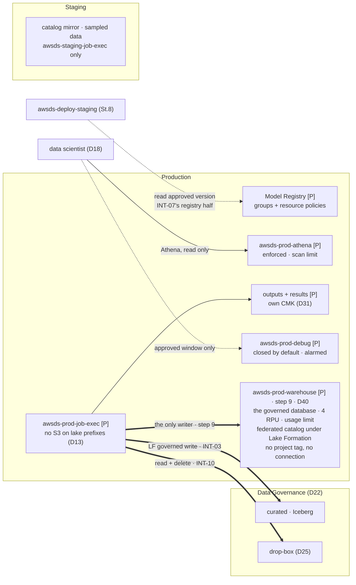

# Stage 9 — Deployment target platforms, producer path

| | |
|---|---|
| **Status** | not started. **Staging is the renamed `Development`** ([6b](stage-06b-development-becomes-staging.md)), so every "after 6b" gate in this file is unblocked: the account arrives on **10.50.0.0/16** with its `[P]` S3 gateway endpoint intact, peered with `VPC-Networking` only (D20 amended), no default route, and an `[E]` endpoint set still to build. It arrives carrying what D20 forbids — a lake share, resource links, a read-write persona — which 6b removes and `DT-8` proves gone. **The Staging data CMK is created here**, under its own name `alias/awsds-staging-data`. **The off-VPC job deny moves from the persona sets to the job-execution roles**, as a permissions boundary (3.5), and serverless inference is settled at 3.7. **The SageMaker runtime is the whole of both targets' compute** — job execution roles, Pipelines, batch transform, the Model Registry consumer and, from Stage 10, a `staging/orchestration/` slice; no domain, no space, no interactive surface, and none of those APIs needs a domain object. **Amended 2026-09-19 by [D40](../decisions/D40-redshift-warehouse.md)**: this stage gains the **governed half of the Redshift warehouse** — `production/warehouse/` and the estate's first governed schema, written only by `awsds-prod-job-exec` and registered to the Glue Data Catalog as a federated catalog. Until then the warehouse has one class of database and one account: [Stage 5b](stage-05b-redshift-serverless.md) built the Sandbox namespace and [Stage 6h](stage-06h-redshift-connection.md) the first sandbox schema. The specification `production/warehouse/` is built from is 5b §7's table; step 9 is where it applies |
| **Prerequisites** | Stage 3 — `production/foundation/` (VPC, the `[P]` gateway endpoint, KMS). Stage 5a — the lake, the LF settings under `DL-5`'s guard, the drop-box statements written against this stage's role name. **Stage 8 pass 1** — step 3's resource policies name `awsds-deploy-prod` and `awsds-deploy-staging`, and a resource policy naming a principal that does not exist fails at put time; the full chain only for pass 5's promotion. **6b** — the account is `Staging`, in `Workloads`, on 10.50.0.0/16, its tree at `terraform-live/staging/`. **6c** — Staging peers with `VPC-Networking` only, has no default route, and reaches AWS through its own endpoints; `VPC-Workloads` carries the **two private subnets in two AZs** step 9's workgroup needs, the estate's one D9 exception, already built. **[Stage 5b](stage-05b-redshift-serverless.md)** — for step 9 alone: the warehouse's shape, its cost guards and its verification (i) answer (two subnets or three), so the Production namespace copies a measured configuration rather than repeating its unknowns. Nothing here waits on a quota, save 5b 0.4's namespace-per-account reading; **passes 4-5 are gated by 6b, which runs long before this stage** |
| **Consumes** | [D13](../decisions/D13-lake-formation-enforcement.md), [D14](../decisions/D14-supply-chain-account.md), [D17](../decisions/D17-interactive-vs-runtime.md), [D18](../decisions/D18-data-scientist-access.md), [D20](../decisions/D20-staging-account.md), [D22](../decisions/D22-data-governance-account.md), [D25](../decisions/D25-drop-box-consumer.md), [D28](../decisions/D28-workflow-contract.md), [D31](../decisions/D31-approver-read.md), [D40](../decisions/D40-redshift-warehouse.md) |
| **Proves** | [INT-03](../integrations.md) **the write share** — the two read shares are Stage 5a's; [INT-05](../integrations.md) (the Production and laptop branches); [INT-06](../integrations.md); [INT-07](../integrations.md) **in part** — the model-registry read half, **which absorbed INT-04 at 6b** (the image half is Stage 8 step 3.2's); [INT-10](../integrations.md) **the pickup half** — the writer and maintenance halves are Stage 5a's; **[INT-24](../integrations.md)** — a Sandbox project reading a governed Redshift table that lives in Production, the warehouse's only cross-account leg (D40) |

*Read with [`docs/plan/conventions.md`](../conventions.md) (naming, layout, `[P]`/`[D]`/`[E]`, IAM rules).*

---

**Objective:** what Staging and Production need in order to run promoted artifacts, and the governed write
path through which Production becomes the lake's **only** producer (D22). Stage 8 built the promotion
*machinery* against an application that touches no data; this stage gives it something real to deploy
against, and its end is the first fully meaningful promotion. **Scope (D14):** Production's networking went
to Stage 3 and the registries to Stage 7; the deploy credential layer is Stage 8's. What remains here is
the data platform, the SageMaker runtime and the sharing model.

## What this stage builds, and in which accounts

| Where | What | Layer |
|---|---|---|
| `production/sagemaker/` (new) | Model Registry: package groups + **resource policies** (D28 item 6); `awsds-prod-job-exec`; the `awsds-prod-debug` escape hatch + its alarm | `[P]` |
| `data-governance/data/` (amended) | the Production share: LF read **+ governed write**, granted *with grant option* to the Production account (INT-03's last third) | `[P]` |
| `production/data/` (new) | the `consumer-data` call — LF resource links + local regrants, the account's LF settings, the account data CMK — plus the outputs bucket written beside it. **`consumer-data-v0.6.0` provides no derived zone and no workgroup** (D19 revised re-homed the Interactive zone onto the SMUS project path; Production has no SMUS, D28), so where this account's query results land — a stage-authored results bucket and workgroup beside the call, or nothing — is **this stage's to decide**; `aws/deploytargets.py` carries the same note | `[P]` |
| `staging/data/`, `staging/sagemaker/` (new) | the catalog mirror with sampled/synthetic content; job execution roles and nothing else. Staging has no SMUS either (D17/D28 — the runtime without the domain), so the re-homed zone does not exist here and step 4.2's enforced workgroup has **no supplier and no named result location**. One re-decision covers both deployment targets | `[P]` |
| `production/workloads-egress/` (amended), `staging/egress/` (amended) | the endpoints a job needs where there is no default route: `sagemaker.api`, `sagemaker.runtime`, `sts`, `logs`, `glue`, `athena`, `ecr.api`, `ecr.dkr`, `kms`, `secretsmanager` — **with the job subnets pinned to the endpoints' AZ** (6c step 5.4's `sagemaker.runtime` affinity) | `[E]` |
| `production/warehouse/` (new, rank 53 — step 9) | the governed half of [D40](../decisions/D40-redshift-warehouse.md)'s warehouse: the namespace `awsds-prod-warehouse` at `base_capacity = 4` in `VPC-Workloads`' private tier, its usage limit, its three audit log groups, the namespace role, **the first governed schema written by `awsds-prod-job-exec`**, and the namespace **registered to the Glue Data Catalog as a federated catalog** so Lake Formation governs its schemas as it governs the lake's. Copies [Stage 5b](stage-05b-redshift-serverless.md) §7's specification — nothing here re-decides it | `[P]` |
| `identity/sso/` (amended) | `DataScientistProdAccess`'s owed allows: the workgroup, the named prefixes, the debug-role assumption — **and, for the warehouse, the read side only**: no `redshift-serverless:GetCredentials` anywhere (5b 2.3's absence, repeated in the account where it matters more) | `[P]` |
| `scripts/` | `backend.py`/`layers.py` rows for the five new slices (all `[P]` — `make up`/`down` never touch them) | — |

**Contracts this stage fixes, each read by `./aws/deploytargets.py` so a rename fails in a check rather
than in a later stage:** the job role **`awsds-prod-job-exec`** (the exact name Stage 5a step 1.4's
reader-deleter statement and drop-box KMS grant carry), the workgroup **`awsds-prod-athena`**, the buckets
**`awsds-prod-outputs`**/**`awsds-prod-derived`** (`results/` is a prefix family in the derived zone, never
a bucket of its own), the package groups **`awsds-prod-model-<app>`**,
the debug role **`awsds-prod-debug`** with rule **`awsds-prod-debug-assume`**, Staging's
**`awsds-staging-job-exec`**/**`awsds-staging-athena`**, and — from step 9 — the namespace and workgroup
**`awsds-prod-warehouse`** with its role **`awsds-prod-warehouse-exec`** and the `gov_` database prefix
([Stage 5b](stage-05b-redshift-serverless.md) 2.1's class convention, whose whole enforcement in this account
is `WH-6` plus the fact that no project role can reach here).

## Who executes each action

| Marker | Meaning |
|---|---|
| **[Claude]** | repository edits (Terraform, scripts) and read-only AWS calls — done without asking |
| **[Claude⚡]** | `terraform apply` or any AWS write — only after the user authorizes that specific action in chat, with the SSO user/account/permission set stated first |
| **[user]** | behavioural proofs run from a laptop session, approvals, and every log entry |
| **[pipeline]** | Stage 8's chain re-run in pass 5 — triggered by the user's tag, credentialed by Stage 8 step 4 |

Hand applies run as the **infrastructure user**: `awsds-infra-data` (the grantor half),
`awsds-infra-prod` (both Production slices), `awsds-infra-staging`, `awsds-infra-identity`
(the `identity/sso/` amendment). The persona proofs of step 8 sign in as the **data-science user** through
the set under test — the one stage so far whose evidence is mostly *another* persona's sessions.

## Step numbers are identifiers, not an order

These numbers are **stable addresses cited from other files** — step 3 from Stage 10 step 5 and D28
item 6 (the registry Stage 10 consumes rather than invents); step 2 from Stage 5a step 1.4 and INT-10
(the pickup half); step 5 from `identity/sso/README.md`'s owed table; step 6 from D17 and
`docs/ORGANIZATION.md` (the deployment manager's approval). They do not change. The sequence to work in is
**the passes below**:

| Pass | # | What | Slice · layer | Applied as |
|---|---|---|---|---|
| **0** | 7 | consume Stage 8's credential layer; the three preflight readings | readings, no build | — |
| **1** | 3, 6 | the runtime: registry + resource policies, the job role, the escape hatch | `production/sagemaker/` `[P]` | `awsds-infra-prod` |
| **2** | 2 | the share, grantor side — read + governed write to Production | `data-governance/data/` `[P]` | `awsds-infra-data` |
| **3** | 1, 2 | the consumer slice, then the producer proofs (the write pair, the pickup) | `production/data/` `[P]` | `awsds-infra-prod` |
| **4** | 5, 6, 8 | the persona layer and the boundary sweep | `identity/sso/` `[P]` + sessions | `awsds-infra-identity`; persona sessions |
| **5** | 4, 8 | the Staging platform, then the end-to-end promotion | `staging/data/`, `staging/sagemaker/` `[P]` | `awsds-infra-staging`; the pipeline |
| **6** | 9 | the governed warehouse: the namespace and its guards, the first governed schema written by the job role, the federated-catalog registration, and INT-24's cross-account read | `production/warehouse/` `[P]` | `awsds-infra-prod`; then the pipeline for 9.4 |

Pass 1 precedes pass 2 because the grantor's regrant target and Stage 5a's drop-box statements both name
the job role; pass 3 cannot precede pass 2 (a resource link to a share that does not exist resolves
nothing — Stage 5a's rule, repeated for the third consumer). **Pass 5 waits on nothing but pass 4 and
Stage 8's chain**: 6b delivered the account several stages earlier. **Pass 6 is last and separable**: the
warehouse needs the job role (pass 1), the account data CMK (pass 3) and the pipeline (pass 5), and nothing
needs it — so it can be deferred past the stage's closing proof without holding anything up, which is the
honest place for the estate's most expensive object per unit of time.

**One consequence of that order:** Production becomes a Lake Formation account only at **pass 3** (1.3
names its first data lake administrator), so **pass 2's post-grant reading is a RAM reading, not a catalog
one** — the share is *held* before it is *visible*, a pass apart. 2.2's callout carries the discriminator.
Moving 1.3's settings into pass 1 would close the gap and is deliberately not done: it would split one
slice across two applies to buy an earlier confirmation.

---

## To execute

### 1. `production/data/` — the consumer slice, layer `[P]`

**Action:** give Production the data platform D18 and the producer path stand on — output buckets, the
enforced Athena workgroup, and the lake reached through resource links. **Why:** applications produce
locally (logs, intermediates, outputs pending curation) and humans read locally (D18); the lake itself is
never here (D22), so everything in this slice is either *local output* or a *pointer* to the share.
**Explanation:** same module family as Stage 5a's consumer side, third instantiation — which is what makes
the sharing shape a pattern rather than an event. The LF settings in *this* account are written under the
same discipline `DL-5` imposes in Data Governance: a `DataLakeSettings` apply replaces the whole
structure, in every account that has one.

- **1.1 — [Claude] Write the outputs bucket beside the `consumer-data` call**: `awsds-prod-outputs`
  (application outputs; model artifacts under `models/<app>/` — step 3 points the registry here) from the
  `s3-bucket` module — versioning, `prevent_destroy`, BPA, SSE-KMS with **`alias/awsds-prod-data`**, the
  account data CMK the `consumer-data` call creates
  (decision 1, D31), **and its key policy written in the D31 shape pass 4 applied**
  — the account root keeps administration and holds no cryptographic action, so delegation to IAM is
  impossible and an enumerated statement has to name all three principals, conditioned
  `kms:ViaService = s3.<region>.amazonaws.com` — and **two of the three write**, so the statement is not
  `Decrypt` alone: `awsds-prod-job-exec` writes model artifacts (3.1) and `DataScientistProdAccess` stages
  Athena results as the caller (5.1), both needing `kms:GenerateDataKey` to write and `kms:Decrypt` to read
  back or to finish a multipart upload; only `awsds-prod-debug` is read-only.
  Without that statement the `kms:Decrypt` granted at 5.1 and 6.1 reaches nothing — Lesson 28's
  intersection, and the failure Stage 5a pass 4c paid for on the drop-box. **The module's single
  `data_scientist_role_arn` cannot express three readers**: the key statement above is a module change
  under Recipe B, applied to every consumer.
  **The results zone is deliberately not a bucket of its own**: it is the `results/` prefix family of
  `awsds-prod-derived`, which arrives with the `consumer-data` call — the shape passes 4a/4b applied
  twice, 30-day expiry included ([`docs/GOVERNANCE.md`](../../GOVERNANCE.md) §Derived zone owns it).
  Bucket policy on `awsds-prod-outputs`: the perimeter branches from Stage 5a step 1.3 as Stage 6g leaves
  them (`aws:SourceVpce` = the `[P]` gateway endpoint from `production/foundation/` outputs, the
  `aws:ViaAWSService` carve-out — Athena writes results as the caller) and, in place of an `aws:SourceIp`
  branch, a principal branch admitting `DataScientistProdAccess`'s read of the named prefixes from any
  network ([D39](../decisions/D39-access-by-identity.md), `./aws/deploytargets.py` `DT-1`).
- **1.2 — [Claude] The workgroup `awsds-prod-athena` arrives with the `consumer-data` call**:
  `enforce_workgroup_configuration = true` (the console's "override client-side settings" — documented
  to replace the client's result location, encryption and expected-bucket-owner with the workgroup's),
  result location `s3://awsds-prod-derived/results/`, SSE-KMS with the account data CMK,
  `bytes_scanned_cutoff_per_query` set by the module
  (decision 2). **One enforced location, not one per principal**: within-persona visibility of query
  results is a stated limit (risk 6).
- **1.3 — [Claude] Write the LF plumbing**: the account's `aws_lakeformation_data_lake_settings`
  (admins = this account's `InfrastructureAccess` role, create-default permissions emptied — Stage 5a
  step 5.2's kill, repeated here — and **`parameters` carried explicitly from a read**, 1.5); **resource
  links** to the shared `raw` and `curated` databases; a local Glue database `app_outputs` for what
  applications write to 1.1. The **regrants** are 2.3's — they need the share first.

  > **This slice applies in two steps, and the plan cannot say why** — measured in Data Governance on
  > 2026-08-18 (Stage 5a pass 1). Both `create_*_default_permissions`
  > blocks are **Computed**: omitting them plans as `after_unknown` and an explicitly empty list is not
  > expressible, so whether omission *clears* them or merely *leaves them alone* is a provider property
  > no plan states — while the difference is permanent, because those defaults act **at creation time**.
  > A resource link and `app_outputs` are both catalog objects created *in this apply*; if the defaults
  > still stand when they are created, they are born deferring to IAM and clearing the settings
  > afterwards does not reach them. **So: apply the settings alone under `-target`, read the account
  > back (`DT-5`, and `DL-6`'s reading applied to this account), revoke `IAMAllowedPrincipals` if it is
  > still there, and only then apply the rest.** Lesson 27; the procedure is **Recipe D** in
  > [`docs/plan/runbooks/terraform-changes.md`](../runbooks/terraform-changes.md), which exists because
  > of this exact case. **The same applies to `staging/data/` (4.1)** — to every account that gains this
  > resource, never just the one in front of you.
- **1.4 — [Claude] Write the machinery rows**: `backend.py`/`layers.py` gain `production/data/` and
  `production/sagemaker/` (both `[P]`, outside every `make up`/`down` path), and the slice reads the
  gateway-endpoint ID through `terraform_remote_state` from `production/foundation/` — never a pasted ID
  (Lesson 3). **`production` also joins `DATA_CONSUMERS`** so the slice receives its `lake` map — but
  **read what else that list feeds first (Stage 5a pass 4c)**: it is emitted a third time as
  `data_consumers` to `identity/sso/`, whose `locals.tf` folds every consumer's workgroup and
  derived-bucket ARN into **`DataScientistAccess`** — the Interactive persona. Production must not land in
  that policy, and step 5.1 grants those ARNs to `DataScientistProdAccess` separately. So **split the
  list** — a lake-consumer list for the `lake`/share emission, a narrower persona list for
  `identity/sso/` — before adding the row, and re-plan `identity/sso/` to confirm `No changes`.
- **1.5 — [Claude⚡] Apply as `awsds-infra-prod`, bracketing the LF settings with two readings**:
  `aws lakeformation get-data-lake-settings --profile awsds-infra-prod` before the first apply and again
  after — Production's `Parameters` map is defended nowhere until this slice exists, and this apply is
  exactly the operation that can silently reset it (INT-11's failure mode, third account).
  **The before-reading is not a formality** (pass 4, 2026-08-19): both Interactive accounts
  turned out to be carrying `CROSS_ACCOUNT_VERSION=4` / `SET_CONTEXT=TRUE` *already*, set by nobody in
  this repository and defended by nothing until the settings resource landed. The values that go into
  `parameters` are copied **from that account's own reading**, never from Data Governance's and never
  from this file. `DL-5` now reports per account, so the regression has somewhere to show up.
  `./aws/deploytargets.py` `DT-5` mechanises the reading from here on.

### 2. The producer path (D22, D25, INT-03, INT-10)

**Action:** grant Production the lake's read **and governed write**, then prove both directions — a
curated table written cross-account through Lake Formation, a direct `PutObject` to the same bucket
denied, and the drop-box pickup that empties the letterbox. **Why:** this is the only path by which
governed data is ever written (D22), and the write grant is INT-03's least-travelled variant — proven
with a job, never assumed. The pickup is the same producer path applied to a file a human dropped
(D25): Data Governance cannot host the job — its OU SCP denies compute — so if it does not run in
Production it runs nowhere. **Explanation:** the grant is the documented two-step. The grantor grants to
the **account** (with grant option); Production's LF admin then **regrants** to the job role locally.
The two-step is what lets Stage 10's per-workflow roles (D28 item 3) receive their own regrants later
without ever touching Data Governance again.

**The local regrant is itself a pair** — measured at pass 4, in two accounts, 2026-08-19. A shared
database reaches a local principal through two permissions that are not interchangeable: `DESCRIBE` on
the **resource link**, which is an ordinary local database object, *and* the permission on the **target**,
addressed through the owner's `catalog_id`. The first is the one that gets forgotten, and its symptom is
the worst kind: the principal sees **no database at all**, holding every permission on the target. Write
both, and read `list-permissions` afterwards rather than the code (pass 4's four rows per account are the
shape).

> **A prerequisite this section owed was delivered early, 2026-08-20** (Stage 5a's log entry of that
> date). The registration role `awsds-data-lf-registration` — the session every
> LF-vended access to the registered locations runs as, 2.4's job included — shipped **read-only**,
> its `.tf` comment deferring the write half to "Stage 9, which amends this policy (its step 2)".
> **This file never carried that amendment**: the promise existed only at the promising end
> (Lesson 34), and 2.4's write proof would have failed inside the cross-account job with the share,
> the job role and the key all on the suspect list. Stage 5a's sample-row load hit the wall first, in
> the one-account configuration, and the ceiling now exists: `registered-locations-write`
> (`s3:PutObject`+`s3:DeleteObject` on the two registered prefixes, `kms:GenerateDataKey`). **Nothing
> here needs to touch it** — 2.1's grants and 2.3's regrants are the per-principal gate under a
> ceiling that is already wide enough, and a 2.4 denial naming `kms:GenerateDataKey` or `s3:PutObject`
> for an `AWSLF-…` session would now mean the ceiling *regressed*, not that it was never built.

- **2.1 — [Claude] Amend `data-governance/data/` with the Production grant**: LF permissions
  `DESCRIBE, SELECT, INSERT, DELETE, ALTER` on the `curated` database and its tables (**`ALTER` is not
  optional** — an Iceberg commit rewrites table metadata, so a write without it fails at the commit, not
  at the first row), granted to the **Production account** with grant option, from the same authored
  share map Stage 5a built. Read side unchanged: `DESCRIBE`/`SELECT` on `raw` too, if the pickup curates
  from it. **Two shapes inherited from Stage 5a pass 3:**
  - **every cross-account grant carries the grant option** — the receiving account's own administrator
    can only pass on what it received with the option — so 2.3's regrant is the ordinary second half of
    *any* share here, and what stays particular to Production is the governed **write** in the permission
    list (`docs/GOVERNANCE.md` §Grants);
  - **if these are written as TBAC expressions rather than named resources, the `layer` gate is
    mandatory** (Lesson 29). Stage 5a's decided form was `classification ∈ {public, internal}` alone and
    it matched the **drop-box**, whose entire contract is write-never-read-back. The write grant is more
    dangerous in the same direction — a `layer`-less write expression would reach whatever else ever
    carries a matching classification. **Recommended here: named-resource on `curated`**, which is what
    the text above already describes and what decision 5 reserves for enumerated exceptions — a
    single-database, single-account write is exactly that, and it is recorded in the register as one.
- **2.2 — [Claude⚡] Apply as `awsds-infra-data`, inside `DL-5`'s bracket**: read
  `DataLakeSettings.Parameters` before and after (Stage 5a step 5.4's three-reading discipline — this is
  the first `data-governance/data/` apply since the lake was built, and the reset it can cause is
  silent). Then, from Production with a **fresh** session (Lesson 24 — the four-hour CLI cache serves
  stale successes): **Production's RAM holds the new shares**, and **no pending invitation** (`DL-7`'s
  shape; a pending row is INT-11's fallback tax).

  > **The shared databases will not be visible here, and that is the correct state rather than a failed
  > share** — measured at Stage 5a pass 3, 2026-08-19.
  > A receiving account needs **at least one data lake administrator** before a shared resource
  > appears in its catalog at all — and Production has none until **1.3**, which is pass 3, one pass
  > *after* this one. Both Sandbox and Development read exactly this way on 2026-08-19: RAM holding two
  > `ACTIVE` shares each, `glue:GetDatabases` and `list-lf-tags` returning nothing. **The discriminator
  > is therefore the RAM side, not the catalog side** — a share the consumer's RAM does not hold is the
  > real INT-11 failure, an empty catalog before 1.3 is not. `DL-7` was rebuilt on 2026-08-19 to report
  > the two branches separately (it used to return one verdict for both — Lesson 13's family), and
  > `DT-5`'s twin reading inherits the distinction. The catalog-side confirmation belongs at **2.3**,
  > after 1.3 has made `awsds-infra-prod` an admin.
- **2.3 — [Claude⚡] Regrant locally and finish `production/data/`**: as `awsds-infra-prod` (an LF admin
  since 1.3), `aws_lakeformation_permissions` granting the job role `DESCRIBE` on the resource links and
  `SELECT, INSERT, DELETE, ALTER, DESCRIBE` on the shared tables through them.
- **2.4 — [user] Prove the write pair (INT-03)**: run a job under `awsds-prod-job-exec` (a Glue job —
  the engine the pickup and Stage 10's workflows use) that writes a curated Iceberg table through the LF
  share; then, from the same role, a direct `put-object` to the lake bucket — **denied**, because the
  role holds no S3 allow on lake prefixes (D13; the bucket's network branches admit the VPC, so the
  denial is the *identity* side, which is the point). Read both wordings; record both.
- **2.5 — [user] Prove the pickup (INT-10)**: drop a file into the dated prefix from a Sandbox session
  (Stage 5a's writer half), run the pickup job under the job role — it reads the prefix, curates into a
  governed table through 2.4's write path, and **deletes what it consumed**. Verify the KMS half
  explicitly: an `AccessDenied` on the drop-box key surfaces as an S3 error naming the object, not the
  key (D25's forgotten half — the grant was written in Stage 5a against this stage's role name; this is
  where a typo in that contract fails).
- **2.6 — [user] Confirm the letterbox asymmetry now closes**: the same Sandbox session that wrote the
  file still cannot `GetObject` it back (Stage 5a's deliverable, re-read with the consumer finally
  existing).

### 3. `production/sagemaker/` — the runtime half of D17, layer `[P]`

**Action:** the Model Registry and the execution role pipeline-submitted jobs assume — no domain, no user
profiles, no interactive anything. **Why:** the registry is the promotion boundary: a model version is
*approved*, and the approval must sit on the far side of the gate from the person who trained it — which
is why it lives here and not in an Interactive account, and why each package group carries a resource
policy **written now, not improvised in Stage 10** (D28 item 6). A model package group costs nothing at
rest, so this is `[P]`. **Explanation:** cross-account deployment is documented as three resource
policies — the model package group, the ECR repository of the inference image (Stage 8 step 3.0's grant
covers the repositories), and the S3/KMS of the model artifacts (1.1's bucket and CMK). The group policy
is `aws_sagemaker_model_package_group_policy` (`PutModelPackageGroupPolicy`, ≤ 20 480 bytes).

- **3.1 — [Claude] Write the job role `awsds-prod-job-exec`**: trust policy `sagemaker.amazonaws.com`
  and `glue.amazonaws.com` only — never assumable interactively (D27's shape). Permissions: Glue catalog
  read, `lakeformation:GetDataAccess` (the credential-vending call every LF-aware engine makes), CloudWatch
  Logs, read+write on 1.1's buckets, the drop-box read/delete and its KMS decrypt (the identity half of
  Stage 5a's statements — the drop-box is its own bucket, Stage 5a decision 3, so it is the named
  exception), and **no `s3:*` on the four lake buckets** (D13 — 2.4 proves it).
  `iam:PassRole` to it is granted only in Stage 8's deploy roles, scoped by `iam:PassedToService`.
- **3.2 — [Claude] Write the package groups and their resource policies**: one group per application or
  model family — `awsds-prod-model-app-etl` first (D28 item 6). Policy, three statements: **register and
  approve** (`sagemaker:CreateModelPackage`, `UpdateModelPackage`) for `awsds-deploy-prod` alone;
  **read approved** (`DescribeModelPackage`, `ListModelPackages`) for `awsds-deploy-staging`; and
  **read status** for the human readers — principal the **Sandbox** account (INT-04 was merged into INT-07
  at 6b, and the account it named is now Staging, which reads through the deploy role above), conditioned
  on `aws:PrincipalArn` matching the data-science set's reserved-SSO pattern (decision 7's idiom: account
  enumerated, per-account suffix wildcarded; whitelist it in `make check` 9.2 rather than loosening the
  rule).
- **3.3 — [Claude] Write the escape hatch** (step 6's resources — same slice, same apply).
- **3.3a — [Claude] Complete `production/workloads-egress/`** with the same endpoint list 4.3a gives
  Staging — **`VPC-Workloads` is where Production's jobs run**, and 6c created that slice empty for this
  stage to fill. A job in a VPC with no default route and a missing endpoint fails as a proxy
  403 naming the host, which is readable; a job with **no** proxy either, which is the runtime case, simply
  cannot reach the service at all.
- **3.5 — [Claude] Move the off-VPC job deny from the personas to the ROLES, as a permissions boundary.**
  `DenySageMakerJobsOffVpc` and its instance-type ceiling are attached to the **six persona permission
  sets** — human sessions — and a pipeline-submitted job runs as a **job-execution role**, which carries
  neither. That was survivable while every account had a NAT and a route; under
  [D38](../decisions/D38-single-egress-hub.md) an unconstrained job role is the one compute in the estate
  that could still reach the internet unproxied, in the two accounts that hold deploy credentials. Write the
  same two statements as a managed policy **`awsds-job-exec-boundary`**, attach it as the
  `PermissionsBoundary` of `awsds-prod-job-exec` (3.1) and `awsds-staging-job-exec` (4.3), and add
  `iam:PermissionsBoundary` as a condition on the deploy roles' `iam:CreateRole`/`PassRole` so a pipeline
  cannot mint a job role without it. **`terraform-modules/sagemaker-denies/` already holds both statement
  bodies** — this is a second consumer of one source, not a second copy (Lesson 33).
- **3.6 — [Claude] Read the boundary back with `get-role`, never `list-roles`** — the API omits
  `PermissionsBoundary` from the list form by documented contract, which is the same trap `US-8` exists for
  on the D13 boundary. `./aws/deploytargets.py` gains **`DT-9`**: every role whose name ends `-job-exec`
  carries the boundary, read per role.
- **3.7 — [Claude reads, user decides] Settle serverless inference, which has no VPC configuration at
  all.** An endpoint configuration in serverless mode takes no `VpcConfig`, so the deny above cannot bind
  it and the boundary cannot save it. Two honest shapes, and the recommendation is the second: **(a)** a
  named exception with its own row in `docs/AWS_STATE.md` and a trigger to revisit; **(b)** deny
  `sagemaker:CreateEndpointConfig` **without** a `VpcConfig` in the `Workloads` OU SCP, so serverless
  inference simply does not exist in this estate until somebody argues for it. **Recommended: (b)** — a
  capability nobody has asked for is cheaper to refuse than to fence.
- **3.4 — [Claude⚡] Apply as `awsds-infra-prod`** (after 3.5-3.7 are written, so the boundary lands with
  the role rather than being added to a role that already ran without it), then **[user] prove the registry
  gate**: from a
  **Sandbox** session, `DescribeModelPackageGroup` answers while `CreateModelPackage` and
  `UpdateModelPackage` are denied; an approval succeeds under `awsds-deploy-prod` and under nothing else.
  Read the wordings — the denial must name the resource policy's absence of a grant, not a network
  condition.

### 4. The Staging data platform (D20) — layer `[P]`

**Action:** the environment the promotion chain actually deploys against — a catalog that mirrors the
lake's schema, holding sampled or synthetic content, and job execution roles. **Why:** a staging run that
fails on a schema difference tests the staging environment rather than the application; and **Staging is
not on the Data Governance share** (D20/D22) — it is the least-defended account with unattended tests and
data-scientist read access, so a share or a copy would make it the cheapest route to governed data. An
earlier stand-in (a `staging` database inside Production) is gone: it shared an IAM surface with what it
de-risked and could never catch a permission error (Lesson 2). **Explanation:** if a test genuinely needs
production-shaped volume, generate it; if it needs production *values*, the test belongs in Production
behind the approval gate.

- **4.0 — [Claude] Read what 6b and Stage 8 already delivered, and build only the gap**: 6b brought the
  bootstrap, `foundation/`, `egress/`, the tree and the SSO assignment; Stage 8 step 3.0 brought
  `awsds-deploy-staging` and the INT-07 image grant. **This stage owns two things nobody else does** — the
  account data CMK `alias/awsds-staging-data` (created here, under its own name; 6b destroyed the old
  `dev`-named key rather than renaming it) and the `staging/{data,sagemaker}/` slices below. Run
  `./aws/AZs.py` and `./aws/account-bpa.py` once as the standing post-conversion readings.
- **4.1 — [Claude] Write `staging/data/`**: local Glue databases mirroring the lake's — same database
  and table names, same Iceberg definitions, same LF-Tag keys and values (LF-Tags are account-local, so
  the mirror recreates the ontology) — **instantiated from the same versioned schema source as the
  lake's tables** (decision 3 — two hand-typed copies drift, and the drift is a false test failure);
  content buckets `awsds-staging-data` under a Staging CMK; the LF settings
  under 1.3's discipline (parameters carried, defaults killed) — **including its two-step apply**, and
  this is the account where getting it wrong is least visible: the mirror's whole point is that its
  databases look like the lake's, so a mirror database born deferring to IAM would pass every shape
  comparison `DT-8` makes while enforcing nothing. **No resource link to Data Governance
  anywhere** — its absence is a control, and `DT-8` fails if one appears.
- **4.2 — [Claude] Write the workgroup `awsds-staging-athena`**: enforced, results local, scan limit —
  **for the integration tests and the deployed application, not for people**:
  `DataScientistStagingAccess` carries no Athena at all (Stage 2 wrote it that way — a query writes its
  result somewhere, and this set writes nothing). **"results local" names no bucket, and since
  2026-08-26 nothing supplies one** (`consumer-data-v0.6.0` removed the derived zone and the workgroup
  from the module — [D19 revised](../decisions/D19-derived-zone.md)). An enforced workgroup cannot exist
  without an output location, so **this step's destination is part of the same re-decision as the
  `production/data/` row's**, and it is the half that was never written down even before the removal.
- **4.3 — [Claude] Write `staging/sagemaker/`**: `awsds-staging-job-exec`, same trust shape as 3.1, **3.5's
  permissions boundary attached**, no registry, no domain — the approved model version is read from
  Production's registry. **`VpcConfig` is mandatory on every job this role can run**, which is what the
  boundary enforces; the subnets are Staging's private tier and the security group its own.
- **4.3a — [Claude] Complete Staging's `[E]` endpoint set in `staging/egress/`**, because with no default
  route a missing endpoint is the whole failure: `sagemaker.api`, `sagemaker.runtime`, `ecr.api`,
  `ecr.dkr`, `sts`, `logs`, `monitoring`, `kms`, `glue`, `athena` and `secretsmanager`, over the `[P]` S3
  and DynamoDB gateway endpoints 6b preserved. **Pin the job subnets to the endpoints' AZ** — 6c step 5.4
  settled that `sagemaker.runtime` *"must be activated in the Availability Zone of your client"* or the
  failure is a DNS error rather than a cross-AZ charge, and D9 keeps this estate single-AZ. The `NO_PROXY`
  the job containers carry is generated from **this list**, per 6c step 5.6, so a service with no endpoint
  fails as a proxy 403 naming the host rather than as a hang.
- **4.4 — [Claude] Write the sample-data seed**: a job in the `app-etl` repository generating the
  sampled/synthetic content into `awsds-staging-data` — owned by the repository so the pipeline can
  refresh it, never copied from the lake (D20's line to hold).
- **4.5 — [Claude⚡] Apply both slices as `awsds-infra-staging`**, machinery rows included.
- **4.6 — [Claude⚡] Amend step 3's resource policies with the Staging principals** (as
  `awsds-infra-prod`), and the artifact-bucket/CMK read for `awsds-deploy-staging` and
  `awsds-staging-job-exec` — the documented third leg of cross-account deployment (1.1's bucket, not
  ECR: ECR needs no KMS grant for pulls). **[user]** Prove INT-07's registry half: a
  `DescribeModelPackage` of an approved version from the Staging role answers.

### 5. The persona layer (D18) — `identity/sso/` amended

**Action:** deliver the allows `identity/sso/` records as owed by this stage, and read back what was
already built. **Why:** the sets were written narrow in Stage 2 with every object-scoped allow deferred
to the stage that creates the object (guessing an interface is what the slice refuses to do); this stage
creates the objects. **Explanation:** resource ARNs interpolate the account id from the organization
data source the slice already uses — never a literal id (`CLAUDE.md`), never a wildcard account
(conventions §6).

- **5.1 — [Claude] Amend `DataScientistProdAccess`**: `athena:StartQueryExecution`,
  `GetQueryExecution`, `GetQueryResults`, `StopQueryExecution` on the `awsds-prod-athena` workgroup ARN
  alone; `s3:GetObject` on the **enumerated** application-output prefixes; the derived-zone
  read/write Athena performs as the caller (`GetBucketLocation`, `ListBucket`, `PutObject`, `GetObject`
  on `awsds-prod-derived` — pass 4c's statement family, extended to the third consumer); `kms:Decrypt`
  on the account data CMK (1.1); `sts:AssumeRole` on exactly the
  `awsds-prod-debug` ARN (step 6). The `DenyProductionControlPlane` families are untouched — they
  deliberately do not name `athena:StartQueryExecution`.
- **5.2 — [Claude] Verify `DataScientistStagingAccess` by reading, not by trusting the intention**
  (Lesson 22): `DenyEveryWrite` present, no Athena statement anywhere, nothing this stage adds. **Its
  assignment already exists** — 6b assigned it in the same sitting that removed `DataScientistAccess` from
  the account.
- **5.3 — [Claude⚡] Apply as `awsds-infra-identity`**; `terraform output inline_policy_bytes` still
  under the ceiling.
- **5.4 — [user] Prove the workgroup boundary and the negatives**, signed in as the data-science user
  through `DataScientistProdAccess`: a query that asks for a different `OutputLocation` runs and its
  result lands under the enforced location anyway (the documented override — verification (vi)); a query
  over the scan limit is cancelled; `sagemaker:CreateTrainingJob` and `glue:StartJobRun` are denied
  naming the set's own deny; and nothing outside the enumerated prefixes answers.

### 6. The production debugging escape hatch (D17)

**Action:** a time-boxed elevated role in Production — `awsds-prod-debug` — that grants read access to
job inputs and outputs for a bounded window, assumable only while a window the **deployment manager**
approved is open, with an alarm on every assumption. **Why:** "nobody ever needs to look at production
interactively" is not true, and an undesigned need becomes a permanent permission. **Explanation:** its
shape is imposed rather than chosen — `DenyInteractiveSageMakerSurface` (`awsds-org-scp-ou-workloads`)
denies `CreateSpace`, `CreateApp`, `StartSession` and `CreatePresignedDomainUrl` with no principal
carve-out, so this role can only ever be read-by-API; the pressure toward "a notebook in Production,
just this once" has nowhere to go, and the correct response to that failure is to keep the shape, not to
amend the OU document. The builder is outside every claim here (Lesson 18): what watches the role is
detective — the alarm, and CloudTrail.

- **6.1 — [Claude] Write the role**: permissions — `s3:GetObject`/`ListBucket` on 1.1's buckets, logs
  read, `sagemaker:Describe*`/`List*`, `kms:Decrypt` on the 1.1 CMK; **no lake reach of any kind** (no
  `GetDataAccess`, no grant through 2.3). Trust — the `DataScientistProdAccess` reserved-SSO role
  (resolved in-account via `data.aws_iam_roles`, never a pasted suffix) **and**
  `Condition: DateLessThan aws:CurrentTime = var.debug_window_end`, whose default sits in the past: the
  role exists and is unassumable at rest. `max_session_duration` 1 hour.
- **6.2 — [Claude] Write the alarm**: an EventBridge rule `awsds-prod-debug-assume` on the CloudTrail
  `AssumeRole` event for this role — **every** assumption, not just misuse — to the Stage 1b SNS
  pattern.
- **6.3 — [user] Operate it as designed, once, to prove it**: the deployment manager approves in
  writing (the log), the window variable is set and applied (`[Claude⚡]` as `awsds-infra-prod`), the
  assumption succeeds and the alarm fires; after the window, the same assumption is denied; a
  `CreateSpace` under the role is denied naming the Workloads OU policy. Reverting the variable closes
  the window in the same sitting.

### 7. Consumed from Stage 8 — readings, not builds

**Action:** read what the credential layer already provides before building anything that overlaps it.
**Why:** the deploy roles are Stage 8 pass 1's, and "the KMS grants for Staging's ECR pulls" do not
exist — ECR decrypts pulls through the grants it holds on the repository key, and the puller needs no
`kms:Decrypt` (Lesson 7). **Explanation:** what Stage 9 *names* from Stage 8: `awsds-deploy-prod` and
`awsds-deploy-staging` in step 3's policies, the misuse alarms as the pattern step 6 copies, and the
INT-07 image grant as the model 4.6 follows.

- **7.1 — [Claude] Run `./aws/cicd.py`**: CI-2/CI-3 green (the two roles exist with boundary and
  single-principal trust) before pass 1 writes policies that name them.
- **7.2 — [Claude] Run `./aws/datalake.py`**: `DL-5` green (the INT-11 parameters intact) before pass 2
  touches the grantor account; the drop-box statement and key grant read back with the 3.1 role name.
- **7.3 — [Claude] Record the ECR non-grant**: one line in the log — cross-account pulls need the
  repository policy only, no key grant — so nobody "fixes" the absence later (Lesson 5's inverse: an
  absence that is correct, written down).

### 8. Verify the boundary rather than declare it

**Action:** the session matrix — each cell a test with its result recorded, including the ones that
fail. **Why:** the promotion crosses account boundaries this stage just finished wiring, and every cell
is a place where a resource policy can be missing (INT-05/06 are the two most likely to surface as an
`AccessDenied` nobody can diagnose from the error). **Explanation:** run each from the stated session;
read every denial by its wording, never its exit code.

- **8.1 — [user] From a Sandbox session**: no deployment target's infrastructure can be
  changed; a lake table reads through the share but will not write (the governed write is the job
  role's alone); a `PutObject` to an out-of-organization bucket is denied naming the perimeter
  (`docs/plan/architecture.md` §4.2 — exercised, not amended; an amendment would go through battery
  phase 4b); the drop-box accepts `PutObject` and refuses the matching `GetObject`.
- **8.2 — [user] From a Production session as the data scientist**: 5.4's proofs, plus INT-06 — how
  much of the S3 **console** works for the persona under 1.1's principal branch, recorded as a fraction
  and written into `README.md` if part of it does not.
- **8.3 — [user] From the laptop, off the VPN**: a read of the named output prefixes succeeds through
  1.1's principal branch, and the same persona's read outside them fails, its wording naming the policy
  that refuses it (INT-05's laptop half, as D39 shapes it).
- **8.4 — [user] From a Staging session as the data scientist** (`DataScientistStagingAccess`, which 6b assigned): everything readable,
  nothing writable — including the buckets the pipeline writes to; the wording names
  `DenyEveryWrite`.
- **8.5 — [pipeline] The end-to-end**: re-run Stage 8's promotion against the real
  catalogs — the integration tests now query `staging/data/`'s mirror, the artifact lands in
  Production, and the pandas test still fails everywhere it should. It is the stage's closing proof and
  the first fully meaningful promotion.

### 9. `production/warehouse/` — the governed class of database (D40)

**Action:** the second half of the warehouse: a Redshift Serverless namespace in `VPC-Workloads`, the
estate's first governed schema, written by `awsds-prod-job-exec` and by nothing else, registered to the Glue
Data Catalog so Lake Formation governs it — and the pipeline's path for deploying a database a Production
workload produced. **Why:** [Stage 5b](stage-05b-redshift-serverless.md) built the sandbox class and
[6h](stage-06h-redshift-connection.md) filled it, and a warehouse with one class is not the requirement. The
governed class waits for this stage because *this* is where its writer, its CMK and its deploy credential
already exist — putting the namespace in Sandbox would have put governed data in the least-governed account
(D22, D17), and building it earlier in Production would have built a store nothing wrote to for four stages
(Lesson 5). **Explanation:** the specification is [Stage 5b](stage-05b-redshift-serverless.md) §7's table and
nothing here re-decides it. What is new in this account is the **Lake Formation half**, which the Sandbox
namespace deliberately does not have.

> **This is the first governed store outside Data Governance, and D22 is the line it crosses.** D40 argues
> the trade and names the compensation: the namespace is a **federated catalog**, so its schemas and tables
> carry the same permission layer as the lake's. The consequence is that the **grant register gains a second
> grantor account** — Production grants on the `governed` database, Data Governance grants on `raw`/`curated` — and 9.5 is
> where the register is told, in the same sitting, or the estate has two registers and one of them is nobody's.

- **9.1 — [Claude] Write the namespace and workgroup**, copying 5b §7's table: `awsds-prod-warehouse` under
  **`alias/awsds-prod-data`** (1.1's CMK, read from this slice's own state), `manage_admin_password = true`,
  `log_exports` all three with their **log groups pre-created and given a retention period** (5b 1.2 — the
  documented way not to acquire a second never-expiring group, `EXC-10`), `base_capacity = 4`, `max_capacity`
  and the price-performance target as 5b decision 2 settled them, the `serverless-compute` **usage limit with
  `breach_action = deactivate`** in the same apply, the `ComputeCapacity` alarm, and the two **private**
  subnets of `production/workloads/` — the two-AZ pair 6c built as the estate's one D9 exception, which is why
  this account needs no new network work. `publicly_accessible = false`, `enhanced_vpc_routing = false`.
  **The security group admits `5439/tcp` from the job subnets alone** — there is no interactive client in this
  account and no project ENI, so the group is narrower than Sandbox's by construction.
- **9.2 — [Claude] Write the namespace role `awsds-prod-warehouse-exec`**, and read D13 against it exactly as
  5b 2.4 does in Sandbox — **with one difference that has to be deliberate.** In Sandbox the role holds
  nothing. Here it is the principal a federated catalog reads through, so it needs
  `lakeformation:GetDataAccess` and the Glue catalog read, and **still no `s3:*` on any lake prefix**: the
  whole of D13 is that the engine asks Lake Formation instead of reading the files. A direct `PutObject` from
  this role to a lake bucket is denied for the same reason 2.4 proves it is denied for the job role, and 9.6
  measures it rather than assuming the symmetry.
- **9.3 — [Claude⚡] Create the first governed schema and grant only the job role.** As 6h 1.1-1.5 did for
  `sbx_lab`, and with the same two pieces of hygiene: **`REVOKE` on `public`** in the new database *and* in
  the namespace's own first database, and a **named schema** rather than `public`. The grantee is
  `awsds-prod-job-exec`'s database identity — 6h verification (iii) settled the identifier's spelling, so this
  step consumes a measurement instead of repeating the guess. **No project, no connection, no
  `AmazonDataZoneProject` tag**: D26 keeps deployment targets out of the domain (`DenyDataZoneEntirely` on the
  `Workloads` OU), so 6h's three-layer model collapses here to layer 3 alone, and the absence of layers 1 and
  2 **is** the control. `WH-7` must therefore read **no project tag at all** on this namespace and workgroup.
  **That absence is now a requirement rather than a consequence** (`objectives.md`, 2026-09-20): the SMUS
  connection is a *sandbox-class* mechanism, and reusing 6h's wiring here "because it already works" would put
  a Redshift `GRANT` in the path of governed data beside a Lake Formation grant. A governed database is read
  through 9.5's federated catalog and written by 9.4's pipeline; it is never connected to a project.
- **9.4 — [Claude] Write the deploy path, and make it the pipeline's rather than a person's.** A database a
  Production workload produces is an artifact class, so the question is which of D28's six it is and what
  carries it. The shape: the repository holds the **DDL and the load job**, the promotion pipeline runs them
  under `awsds-deploy-prod`, and the job that writes rows is `awsds-prod-job-exec` — the same principal
  2.4 proved the governed S3 write with. Three things to write down rather than discover:
  - **`iam:PassRole` scoped by `iam:PassedToService`** already gates the job role (3.1); the deploy role
    additionally needs `redshift-data:ExecuteStatement` on this workgroup, or the DDL has no runner;
  - **a `GRANT` is state no plan can see** (6h's first risk), so the pipeline's SQL is idempotent or the
    second run of the promotion fails on an object that exists — the `CREATE … IF NOT EXISTS` discipline, and
    `WH-12` as the check;
  - **the deploy must not use the admin credential.** A pipeline holding the namespace admin secret can grant
    itself anything, which is the register's whole content. It runs as its own database user with `CREATE` on
    the named schema and nothing else.
- **9.5 — [Claude⚡] Register the namespace as a federated catalog**, `aws_glue_catalog` with its
  `federated_catalog` block, and read the result rather than the plan. **This is what puts the warehouse's
  schemas under Lake Formation**, which `objectives.md` requires (*"the governance model does not fork"*), so
  the registration is not optional here.
  > **Enabling the Iceberg-engine path creates a resource this project did not choose, and it has to be decided
  > rather than clicked** (read 2026-09-20). The catalog carries a switch — *"Access this catalog from Iceberg
  > compatible engines"* — and it is what makes Athena and EMR able to read the namespace at all. AWS: *"To
  > enable these query engines to read and write to Amazon Redshift namespaces, AWS Glue creates a **managed
  > Amazon Redshift cluster** with the compute and storage resources required to perform read and write
  > operations without impacting Amazon Redshift data warehouse workloads."* Four consequences, none of them
  > in this stage's cost table before 2026-09-20:
  > **a cluster, not a serverless workgroup** — the always-on shape D12 rules out and
  > [Stage 5b](stage-05b-redshift-serverless.md) step 3.1 proposes to *deny*, so the two collide and 9.5a
  > settles it; **unpriced**, and nothing says what size it is; **read *and* write**, so it is not a read-only
  > door; and *"By default, the data in the Amazon Redshift cluster is encrypted using an AWS managed key"*
  > unless a customer managed key with *"additional custom managed key policy"* is supplied — against
  > `docs/GOVERNANCE.md` §Encryption's per-account CMK rule, and the same shape as the `S3Bucket` blueprint's
  > *"encryption key and bucket policy nobody in this project chose"*. **Lesson 17 in full.**
  > **And it is only needed for the Iceberg engines**: *"You don't need to enable data lake access to access
  > the federated catalogs using Amazon Redshift."*
- **9.5a — [Claude reads, user decides] Settle the collision between the Iceberg-engine switch and
  `DenyRedshiftProvisionedClusters`.** [Stage 5b](stage-05b-redshift-serverless.md) 3.1 denies
  `redshift:CreateCluster` at the organization root because a provisioned cluster is the always-on shape D12
  rules out. If AWS Glue creates its managed cluster **in this account**, that deny is either the thing that
  breaks the Athena path or the thing the path breaks — the same collision Stage 15 decision 1 has between
  `DenyGuardDutyTampering` and Audit's own detector. **Read before choosing:** whether the cluster is created in
  the customer account at all, under which principal, and whether CloudTrail shows `CreateCluster`. Then one of:
  **(a)** carve the Glue service principal out of 3.1, which reopens the deny this estate wanted;
  **(b)** take INT-24's shape (ii) — the Lake Formation-managed **datashare** — which needs no Iceberg-engine
  switch and therefore no managed cluster; **(c)** leave the switch off, which makes the federated catalog
  readable **from Redshift only** and leaves a Sandbox project nothing to read. **Recommended: (b)**, and
  9.7 is where it is chosen with a reading behind it rather than here.
  > **Two hazards on this one resource, both of which this plan has already paid for once.** First,
  > `aws_glue_catalog` carries `create_database_default_permissions` — the same `IAMAllowedPrincipals` default
  > that cost Stage 5a pass 1 a two-step apply and that acts **at creation time** (1.3's callout, Recipe D).
  > A federated catalog born deferring to IAM is a governed schema governed by nothing, permanently.
  > **So: apply the catalog alone, read it back, revoke `IAMAllowedPrincipals` if it is there, and only then
  > create anything inside it** — Recipe D, third instance. Second, the mapping is documented as
  > *namespace → multi-level catalog, database → catalog, schema → database, table → table*, so **a Redshift
  > "database" is a Glue *catalog* and a Redshift "schema" is a Glue *database*** — a naming inversion that
  > will make one of the grants in this step address the wrong level if it is written from intuition
  > (Lesson 53: two systems expressing one intent in the same-looking syntax are not translatable by
  > transcription, and they agree on the easy cases).
- **9.6 — [user] Prove the governed pair, the way 2.4 proved the lake's.** Under `awsds-prod-job-exec`: a
  write into the governed schema succeeds; the same role's direct `PutObject` to a lake bucket is still denied;
  and the namespace role reaches no lake prefix. Read every wording.
- **9.7 — [user] Prove INT-24 — a Sandbox project reading a governed table, by whichever of the two
  Lake-Formation-governed shapes 9.5a chose.** **There is no network path and there does not need to be**:
  Sandbox does not peer with `VPC-Workloads`, and its absence is a control (`docs/NETWORK.md` §3); neither
  shape opens a Redshift connection from the project.
  - **The federated catalog read by Athena** — INT-03's shape with one more grantor, and it drags in 9.5's
    managed cluster.
  - **The Lake Formation-managed datashare** — the producer grants `USAGE ON DATASHARE … VIA DATA CATALOG`,
    the data lake administrator registers it (`lakeformation register-resource`) and maps it to a **federated
    database**, and LF permissions decide the rest. No Iceberg-engine switch, so **no managed cluster**.
  **What is excluded, and by the requirement rather than by preference** (`objectives.md`, 2026-09-20): the
  project's **Data page against a cross-account connection**, which makes a Redshift `GRANT` the control over
  governed data — the fork the brief forbids — and whose documented access role carries `sqlworkbench:*` on
  `*`, a wildcard this repository's own check refuses. Taking it means revising `objectives.md` *and*
  whitelisting a wildcard.
  **If neither shape works**, the fallback is the row's: a governed table reaches Sandbox as it does today —
  through the lake, not through the warehouse — and the warehouse stays a Production-internal engine.
  What 9.7 additionally settles, and nobody has measured: whether a Lake Formation share of a **federated**
  resource preserves the **TBAC expressions** this estate grants by. Both AWS pages say tags may be used on
  these resources, which is more than DataZone's Glue path offers (it refuses LF-TBAC outright, Stage 6f 3.2),
  so the premise looks better here and is still unread. A share that only takes named resources is a finding,
  not a failure, and it goes in the register as one. **On the datashare path, read the revoke too**: when the
  producer revokes, *"the associated permissions and objects in Lake Formation are not automatically
  deleted"*, so a revoke on one side leaves rows on the other and the register has to be told.
- **9.8 — [Claude] Close the paperwork in the same sitting**: `docs/AWS_STATE.md` (the Redshift grant
  register's second grantor, and Production's own residuals), `docs/GOVERNANCE.md` (§Accounts' Production row,
  and the federated catalog as the fourth thing Lake Formation governs), `terraform-live/README.md`,
  `docs/NETWORK.md` §2/§2.1/§9 for the security group, `./aws/warehouse.py` extended to this account, and
  `INT-24`'s row brought to what 9.7 measured.

---

## Deliverables

Each is written so its output differs between working and broken (Lesson 13). **The mechanical half is
`./aws/deploytargets.py`** ([`aws/INDEX.md`](../../../aws/INDEX.md)): the buckets, CMK and workgroup
enforcement; the package groups with their policies; the job and debug roles with their trust shapes;
the LF settings in every account that has any (`DT-5` — `DL-5`'s twin); the share, links and regrants with no
pending invitation; the Staging mirror side by side with the lake's catalog, and the **absence** of any
Staging link to Data Governance; the alarm rule; the persona sets' owed allows read back. The
behavioural proofs are the stage's own (Lesson 20):

- **The producer pair (INT-03):** a curated Iceberg table written cross-account under
  `awsds-prod-job-exec` — and the same role's direct `PutObject` to the same bucket denied.
- **The pickup (INT-10):** the drop-box read, curated, and emptied by the job; the writer still cannot
  read back what it wrote.
- **The registry gate (INT-07):** approval only under `awsds-deploy-prod`; a Sandbox session reads status
  and nothing else; the Staging deploy role reads an approved version.
- **The workgroup boundary:** a client-requested result location is overridden into the enforced one;
  the scan limit cancels.
- **The escape hatch:** closed at rest, open only inside an approved window, alarmed on every
  assumption, and unable to become a notebook (the OU SCP names the denial).
- **The promotion (8.5):** Stage 8's chain against real catalogs, end to end.
- **The governed warehouse (step 9):** a governed schema written by the job role and by nothing else, its
  namespace a federated catalog whose databases do **not** carry `IAMAllowedPrincipals`, no project tag
  anywhere on it, and INT-24 answered by measurement rather than by intention.

## Validation

1. Run `./aws/deploytargets.py` — all `DT-*` pass; diff two runs across the stage (only timestamps may
   change).
2. Run `./aws/datalake.py` after every `data-governance/data/` apply — `DL-5` green (the three-account
   parameters discipline).
3. Run `./aws/egress.py` §6 at session end — **passes 0-5 add nothing metered, and the reading proves it.
   Pass 6 does**: a Redshift Serverless workgroup bills nothing at rest and **1.44 USD/hour while a query
   runs**, so after step 9 the session-end reading is no longer the whole bill and `./aws/warehouse.py`'s burn
   line is read beside it.
4. Run `./aws/warehouse.py` after pass 6 — `WH-1`..`WH-8` green in **both** accounts, and `WH-7` reading *no
   project tag* on the Production namespace.
5. Read every denial by its wording, never its exit code (standing rule since 1c).

## Cost

Measured (`docs/PRICING.md`, `docs/plan/cost-model.md`), us-west-2:

| Item | Cost | Layer |
|---|---|---|
| `alias/awsds-prod-data` + the Staging CMK | ~USD 1/key-month | `[P]` |
| Package groups, workgroups, LF grants, links, resource policies | free at rest | `[P]` |
| Outputs/results/mirror storage | cents at lab scale | `[P]` |
| Producer/pickup Glue runs | 0.44 USD/DPU-h, 10-min minimum, on-demand | metered per run |
| Athena queries | 5 USD/TB scanned — the workgroup limit is the guard | metered |
| Staging's own account overhead (Config recorder etc.) | ~USD 0.5-1/month, already being paid — the account exists | — |
| **`production/warehouse/` compute** (step 9) | **0.00/h at rest · 1.44 USD/h while a query runs** at `base_capacity = 4` (0.36/RPU-h, 60-second minimum) — **the most expensive item in this stage by an order of magnitude**, and the reason the usage limit lands in the same apply | `[P]` |
| Redshift Managed Storage for the governed schema | 0.024 USD/GB-month | `[P]` |
| Its admin secret + three log groups | ~0.40 USD/secret-month + cents | `[P]` |
| **The managed Redshift cluster AWS Glue creates** if 9.5's Iceberg-engine switch is enabled | **unpriced and unsized** — a *cluster*, always-on in shape, which is the item that could break this stage's cost profile on its own. Priced before the switch is enabled, never after (Lesson 6); 9.5a's recommendation is the shape that avoids it | — |

## Decisions due while executing

**Blocking questions for the user: none.** Each is decided during the stage and written into
`docs/log/log-stage-09-deployment-targets.md` (Lesson 16), with a recommendation stated.

1. **The Production data CMK** (1.1) — **the alias is not open**: `docs/GOVERNANCE.md` §Encryption
   settles it (one data CMK per account), which gives `alias/awsds-prod-data`. What remains to decide
   here is only **dedicated versus reusing `foundation/`'s key**. Recommended: **dedicated** (D31): the
   deny that matters — Staging and the approvers cannot read outputs — is only expressible on a key
   nothing else uses.
2. **The scan limit** (1.2) — recommended: **10 GB per query** to start, revised against real queries at
   Stage 12 rather than set high and forgotten.
3. **The mirror mechanism** (4.1) — recommended: **both catalogs instantiated from one versioned schema
   source** in the repository (a module input, not a sync script); a hand-maintained second copy is
   Lesson 14 as a catalog.
4. **The debug window mechanics** (6.1) — recommended: the **`DateLessThan` trust condition from a
   tfvars value defaulting to the past** — approval is a recorded apply, closure is a revert, and no
   standing machinery exists to rot.
5. **How a Sandbox project reads a governed Redshift table** (9.5a, 9.7, INT-24). The brief narrowed the field
   on 2026-09-20 — the controls do not change, so the mechanism is one Lake Formation governs — and **two shapes
   qualify rather than one**: a federated catalog read by Athena, or a Lake Formation-managed **datashare**.
   The cross-account connection is excluded outright. **Recommended: the datashare.** The federated catalog's
   Iceberg-engine switch makes AWS Glue create a **managed Amazon Redshift cluster** — unpriced, always-on in
   shape, encrypted by an AWS managed key by default, and a direct collision with
   [Stage 5b](stage-05b-redshift-serverless.md) 3.1's `DenyRedshiftProvisionedClusters` — while the datashare
   path needs no such switch. **Take the reading first** (9.5a): the recommendation rests on a documentation
   sentence, not on a measurement, and whether that cluster is created in this account at all is exactly what
   decides it.
6. **Which of D28's six artifact classes a governed database is** (9.4) — recommended: the **DDL and load job
   in the repository**, carried as ordinary application code, with the pipeline as the only runner. A database
   schema that is not in the repository is a schema whose Staging mirror (4.1) has no source, which is
   decision 3's argument arriving one store later.

## Verifications to answer while executing

Record every answer, including the ones that come out fine.

| # | Question | Step |
|---|---|---|
| i | Do the parameter readings bracket every LF-settings apply unchanged — Data Governance (again), Production, Staging (`DT-5`, `DL-5`'s discipline)? | 1.5, 2.2, 4.5 |
| ii | Does the write share arrive with a **fresh** session and no pending RAM invitation — INT-11's org path holding for the third consumer? **Answered on the RAM side at 2.2 and on the catalog side at 2.3**, because Production has no data lake administrator in between (2.2's callout) | 2.2, 2.3 |
| iii | Does the write pair hold — the LF write succeeds **and** the direct `PutObject` is denied on the identity side (D13)? | 2.4 |
| iv | Does the pickup read, curate and delete — and does the drop-box KMS grant reach the exact 3.1 role name (the Stage 5a contract)? | 2.5 |
| v | Is the registry gate real — a Sandbox session reads status only, and an approval lands only under `awsds-deploy-prod` (INT-07)? | 3.4 |
| vi | Does the enforced workgroup override a client-requested result location, and does the scan limit cancel (the documented behaviour, observed)? | 5.4 |
| vii | Are the Production negatives denied naming the **set's** deny — `CreateTrainingJob`, `StartJobRun` (D18)? | 5.4 |
| viii | Does `DataScientistStagingAccess` read back with `DenyEveryWrite` and no Athena, and is its assignment the one 6b made (Lesson 22)? | 5.2 |
| ix | Does INT-05 hold from both directions — the VPC branch for workloads and the principal branch for the persona from any network, with every other principal refused off the endpoint? | 8.3 |
| x | What fraction of the S3 console works for the persona under 1.1's principal branch (INT-06, open question 8) — and is `README.md` told? | 8.2 |
| xi | Is the escape hatch closed at rest, open only in the window, alarmed on every assumption — and does a `CreateSpace` under it die on the OU policy? | 6.3 |
| xii | Does the Staging role read an approved model version (INT-07's registry half)? | 4.6 |
| xiii | Does the end-to-end promotion pass against the real catalogs — and does a schema drift planted in the mirror fail the integration tests, not the deploy? | 8.5 |
| xv | Does every `-job-exec` role read back with `awsds-job-exec-boundary` attached, using `get-role` (3.6) — and does a job submitted without a `VpcConfig` fail? | 3.5, 3.6 |
| xvi | Which shape did serverless inference take (3.7) — a named exception, or the SCP deny — and is the choice written into `AWS_STATE.md` either way? | 3.7 |
| xvii | Does a Staging job resolve `sagemaker.runtime` from the subnet it actually landed in (the AZ affinity D9 collides with)? | 4.3a |
| xviii | Does the governed namespace read back at `base_capacity = 4` with its usage limit, its capped `max_capacity` and **no project tag** — and do its three log groups carry a retention period, so `EXC-10` stays at one? | 9.1 |
| xix | Does the federated catalog's database carry `IAMAllowedPrincipals` after registration — the Recipe D reading, third instance — and did the two-step apply prevent it? | 9.5 |
| xx | Does the governed pair hold: a a governed schema write under the job role succeeds, and its direct `PutObject` to a lake bucket is still denied? | 9.6 |
| xxi | Which of the two Lake-Formation-governed mechanisms carries INT-24, and does a Lake Formation share of a **federated** resource preserve the TBAC expressions this estate grants by — given that both AWS pages say tags may be used, where DataZone's Glue path refuses them? | 9.5a, 9.7 |
| xxiii | Does enabling the Iceberg-engine switch create a **managed Redshift cluster in this account** — under which principal, visible as which CloudTrail call, at what size and under which key — and does `DenyRedshiftProvisionedClusters` refuse it? | 9.5, 9.5a |
| xxiv | On the datashare path, does a producer-side revoke leave Lake Formation permissions behind, as documented — and does the register notice? | 9.7 |
| xxii | Does the promotion pipeline's second run survive an existing schema — the idempotence a `GRANT` outside every plan forces? | 9.4 |
| xiv | In **each** of the two accounts this stage gives a `DataLakeSettings` (Production, then Staging): do `CreateDatabaseDefaultPermissions` and `CreateTableDefaultPermissions` read `[]` **before** the slice's first catalog object exists, and does no database in that account carry an `IAMAllowedPrincipals` grant afterwards? — the reading the two-step exists to produce, and the only moment it can be taken | 1.3, 1.5, 4.1 |

## Risks

- **The silent LF-settings reset now has three instances, not one** — every account with a
  `DataLakeSettings` resource can zero its own `Parameters` on any apply. `DT-5` extends `DL-5`'s
  reading to all three; run it after every apply, not at stage end. **And that resource carries a
  second, unrelated hazard on the same apply** (measured 2026-08-18, Stage 5a pass 1): the two
  `Create*DefaultPermissions` act at **creation time** and cannot be expressed empty in a plan, so a
  catalog object created in the same apply as the settings can be born deferring to IAM — permanently,
  and invisibly afterwards. One hazard is *overwritten later*, the other *not applied early enough*, and
  both are answered by the same two-step (1.3's callout, Recipe D).
- **"The share did not arrive" and "the account cannot see it yet" look identical from the consumer
  side** — and this stage reads the consumer side twice (2.2, 2.3) across the pass where the difference
  exists. A receiving account with no data lake administrator shows an empty catalog while its RAM holds
  the share, which is exactly what both Stage 5a consumers showed on 2026-08-19. Read RAM first, catalog
  second, and never treat an empty catalog before 1.3 as evidence about the grant.
- **The write share is INT-03's least-travelled variant** — an LF-aware cross-account Iceberg write can
  fail in engine-specific ways the read shares never exercised. The fallback is INT-03's row; the proof
  is 2.4, before anything depends on it.
- **Two contracts are spelled, not enforced**: `awsds-prod-job-exec` (Stage 5a's statements name it) and
  the mirror's schema source (4.1). A typo fails closed later, with an error naming a policy rather
  than the typo (Lesson 14); `deploytargets.py` reads both sides.
- **The registry policy's Sandbox principal uses the reserved-SSO wildcard-suffix idiom** (decision
  7's shape) — `make check` 9.2 must whitelist that `Sid` by name; a second occurrence is a decision,
  not a precedent.
- **Staging's value rests on sampled data catching real failures** (open question 9) — record, for
  every production incident this environment ever has, whether the Staging run could have caught it;
  until then it is a belief, not a finding.
- **Query results are visible within the persona** — one enforced result location means any
  `DataScientistProdAccess` holder can read another's query output. Stated limit at lab scale (D31
  keeps it from the approvers and Staging); per-user isolation would need per-user workgroups, which
  the identity seam forbids as a resource-per-person.
- **The escape hatch is authored by the identity it cannot constrain** (Lesson 18) — the controls above
  it are detective: the alarm on every assumption, and a trail its user cannot edit.
- **Step 9 makes this stage's bill unbounded for the first time.** Every other object here is free at rest or
  metered per scan; a Redshift Serverless workgroup is metered **per hour of query time on a shared meter**,
  and the three documented ways an idle one bills anyway ([D40](../decisions/D40-redshift-warehouse.md): an
  open transaction, a connection pool's keep-alive, a cancelled query) all apply to a pipeline as readily as
  to a person — more readily, since a pipeline's connection is not watched by anybody. The usage limit with
  `breach_action = deactivate` is the only hard guard, and it lands in the same apply as the workgroup.
- **`IAMAllowedPrincipals` gets a third place to appear.** The `Create*DefaultPermissions` hazard was a
  `DataLakeSettings` property in Stage 5a and in 1.3/4.1 here; `aws_glue_catalog` carries it too, and a
  federated catalog born deferring to IAM is a **governed warehouse governed by nothing** — the same failure,
  one storey up, in the resource least likely to be read for it (9.5).
- **A Redshift "database" is a Glue "catalog" and a Redshift "schema" is a Glue "database".** The federated
  mapping inverts two levels, and a grant written from intuition lands one level off — where it will
  frequently *work* on the easy case and be wrong on the one that matters (Lesson 53).
- **The grant register gains a second grantor account** and Redshift grants have no `list-permissions`: they
  are read from `SVV_*` inside a database session, which means the instrument needs a credential the other
  instruments do not. An unreadable register is an unmaintained one, and `WH-12` is the whole answer.

---

*Stage index: [stages/INDEX.md](INDEX.md) · Plan core: [GENERAL_PLAN.md](../../GENERAL_PLAN.md)*
