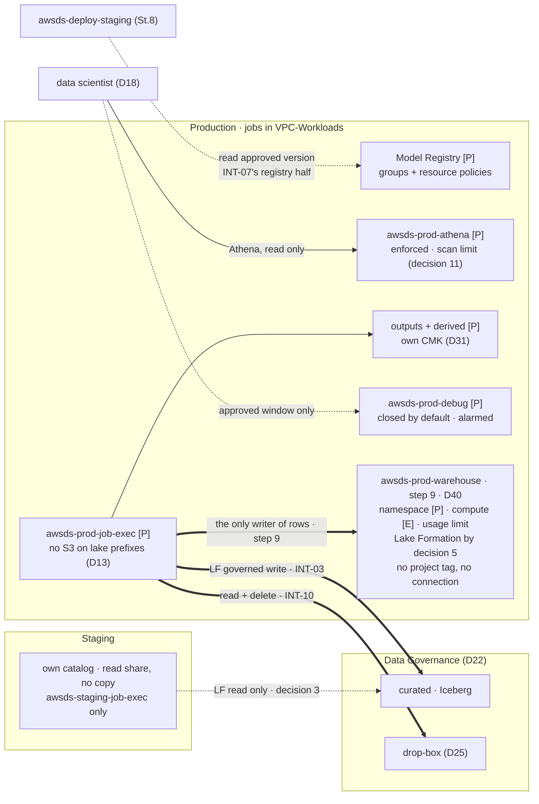

# Stage 9 — Deployment target platforms, producer path

| | |
|---|---|
| **Status** | **pass 0 read and pass 1 applied on 2026-10-18** ([the log](../../log/log-stage-09-deployment-targets.md)), from a laptop session as the infrastructure user: the `Workloads` OU document's job settings and serverless deny (9 statements, the battery's `ou` phase after the apply 39 as expected, 0 unexpected, 7 not measured, `DT-11` passing) and `production/sagemaker/` (16 resources, re-plan `No changes`); `production/workloads-egress/`'s six endpoints and DNS Firewall planned (15 to add) and raised by the next Production `make up`. Decisions 4, 9 (a), 10 and 3.7 (b) taken as recommended. Verification viii is answered, its assignment half by `./aws/list-identities.py` and the Identity account's CloudTrail (2026-10-18). Owed in pass 1: 3.4's registry proof and 6.3's window, the user's; 3.5's instance-preference rows ran on 2026-10-22 in Stage 18's 8.7 battery, each as expected. **The processing-job quotas of `ml.m5.large`, `ml.m5.xlarge` and `ml.m5.2xlarge` read 0 in Production and Staging** (2026-10-18, Production's again on 2026-10-20); `ml.t3.medium`, the type `app-etl`'s `process` task names, reads 4 in both, AWS's default (Production's re-read 2026-10-20, no increase requested), and Staging's first SageMaker job ran on it on 2026-10-19, `app-etl-20261019T205205` ([Stage 18](stage-18-staging-deployment-project.md) 4.4), refused by no statement of the `Workloads` document. Production's training quotas read 0 for every type inside the ceiling that has one (2026-10-20, 3.5). Pass 2 waited on decision 3. **Prepared 2026-10-22 with the environment down** (the log): Stage 8's decision of that day makes this stage's `awsds-<env>-job-exec` the job role in Staging and Production, so 4.3's `staging/sagemaker/` is written and planned (8 to add: the role and the six job log groups) before Stage 8's pass 4; 4.3a re-cuts `staging/egress/` to `VPC-Workloads`' six endpoints (planned, 15 to add); `production/sagemaker/`'s job role gains `glue:GetConnection` (planned, 1 to change); and `./aws/deploytargets.py` reads each pass from its own objects, 0 failed and 8 notes where the same state read 7 failed, with Staging's job role and the job log groups (`DT-12`) added. Staging's training quotas read 0 like Production's, and no type inside the ceiling has a transform quota above 0 in either account. Every open decision was taken by the user the same day, as recommended, 1 and 3 among them: Staging keeps no mirror and reads the governed lake through a read-only share, and reads nothing of Production's outputs; no decision holds a pass now. **Staging is the renamed `Development`** ([6b](stage-06b-development-becomes-staging.md)): 10.50.0.0/16 with its `[P]` gateway endpoint, peered with `VPC-Networking` only, no default route, and an `egress/` slice still cut for an Interactive account, which 4.3a re-cuts. **Production's jobs run in `VPC-Workloads`** ([6c](stage-06c-networking-hub.md)), whose endpoint slice holds the jobs' six endpoints once pass 1 is applied (3.3a) and whose gateway endpoint, not `production/foundation/`'s, is their INT-05 anchor (1.4). Three measurements from [6d](stage-06d-unified-studio-remainder.md) and [6i](stage-06i-sandbox-orchestration.md) reshape the runtime: a SageMaker job's settings are enforced on whoever calls `Create*Job`, never on the role the job runs as (3.5, decision 9); a job under network isolation reads no governed data, so the producer and the pickup stay Glue (3.1); and `consumer-data-v0.6.0` supplies neither a workgroup nor a results bucket, so this stage authors both (decision 11, [D19](../decisions/D19-derived-zone.md)'s re-decision). **The Staging data CMK is created here**, as `alias/awsds-staging-data`. Step 9 adds the governed half of the Redshift warehouse ([D40](../decisions/D40-redshift-warehouse.md)), copied from the Sandbox slices [Stage 5b](stage-05b-redshift-serverless.md) built and [6h](stage-06h-redshift-connection.md) measured |
| **Prerequisites** | Stage 3: `production/foundation/` and `production/workloads/` with their `[P]` gateway endpoints. Stage 5a: the lake, the LF settings under `DL-5`'s guard, the drop-box statements written against this stage's role name. **Stage 8 pass 1**: step 3's resource policies name `awsds-deploy-prod` and `awsds-deploy-staging`, and a resource policy naming a principal that does not exist fails at put time; the full chain only for pass 5. 6b and 6c: Staging and the three Production VPCs as built. For step 9 alone: [5b](stage-05b-redshift-serverless.md) (the warehouse slices and their readings, its verification (i) answered with two subnets) and [6h](stage-06h-redshift-connection.md) (the database users and grants measured through both doors). Redshift waits on no quota (5b 0.4 read 25 namespaces and 25 workgroups per account); SageMaker does: the processing-job quotas of `ml.m5.large`, `ml.m5.xlarge` and `ml.m5.2xlarge` read 0 in Production and Staging (2026-10-18). [Stage 18](stage-18-staging-deployment-project.md) ran on pass 1's `Workloads` document and its battery (its 0.3 and 0.5) and is done (2026-10-22): D41 item 2 kept, and pass 5 finds Staging at Stage 18's 0.3 reading, with no association, no project, no `staging/studio/` and `SMUS_DEPLOYMENT_MEMBERS` empty (`backend.py`), except `AWSServiceRoleForAmazonMWAAServerless`, Stage 10's, and the project key, `PendingDeletion` until 2026-11-21 |
| **Consumes** | [D13](../decisions/D13-lake-formation-enforcement.md), [D14](../decisions/D14-supply-chain-account.md), [D17](../decisions/D17-interactive-vs-runtime.md), [D18](../decisions/D18-data-scientist-access.md), [D19](../decisions/D19-derived-zone.md), [D20](../decisions/D20-staging-account.md), [D22](../decisions/D22-data-governance-account.md), [D25](../decisions/D25-drop-box-consumer.md), [D28](../decisions/D28-workflow-contract.md), [D31](../decisions/D31-approver-read.md), [D38](../decisions/D38-single-egress-hub.md), [D39](../decisions/D39-access-by-identity.md), [D40](../decisions/D40-redshift-warehouse.md) |
| **Proves** | [INT-03](../integrations.md) **the write share** (the two read shares are Stage 5a's); [INT-05](../integrations.md) (the Production branch, anchored on `VPC-Workloads`, and the persona's principal branch); [INT-06](../integrations.md); [INT-07](../integrations.md) **in part**, the model-registry read half, which absorbed INT-04 at 6b (the image half is Stage 8 step 3.2's); [INT-10](../integrations.md) **the pickup half** (the writer and maintenance halves are Stage 5a's); [INT-24](../integrations.md), a Sandbox project reading a governed Redshift table that lives in Production |

*Read with [`docs/plan/conventions.md`](../conventions.md) (naming, layout, `[P]`/`[D]`/`[E]`, IAM rules).*

---

**Objective:** what Staging and Production need in order to run promoted artifacts, and the governed write
path through which Production becomes the lake's **only** producer (D22). Stage 8 built the promotion
*machinery* (its passes 1-3) against an application that touches no data, and runs the promotion itself,
its pass 4, once this stage's platforms exist (its decision 23); this stage gives it something real to
deploy against, and its end is the first fully meaningful promotion. **Scope (D14):** Production's networking went
to Stage 3 and 6c, the registries to Stage 7, and the deploy credential layer is Stage 8's. What remains here
is the data platform, the SageMaker runtime and the sharing model.

## What this stage builds, and in which accounts

| Where | What | Layer |
|---|---|---|
| `production/sagemaker/` (new) | Model Registry: package groups + **resource policies** (D28 item 6); `awsds-prod-job-exec`; the `awsds-prod-debug` escape hatch + its alarm; the SageMaker job log groups, pre-created with a retention (3.1) | `[P]` |
| `data-governance/data/` (amended) | the Production share: LF read **+ governed write**, granted *with grant option* to the Production account (INT-03's last third), and Staging's read share, `DESCRIBE` and `SELECT` by Sandbox's expression (decision 3); the trusted-network list's Production entry read from `production/workloads/` (1.4); the first curated table and its LF-Tags, declared before its first write (2.1) | `[P]` |
| `production/data/` (new) | the `consumer-data` call (account data CMK, LF settings, resource links, re-grants) and, beside it, what `consumer-data-v0.6.0` does not supply: the outputs bucket, the results bucket `awsds-prod-derived` and the enforced workgroup `awsds-prod-athena` (decision 11) | `[P]` |
| `staging/data/`, `staging/sagemaker/` (new) | 1.1-1.3's shape without the write: the `consumer-data` call with the read share's links and read regrants, `awsds-staging-outputs` (Stage 10 decision 17), its results location and workgroup (decision 11), no mirror and no copy (decision 3); the job role `awsds-staging-job-exec` and its six job log groups (4.3), and nothing else. Staging has no SMUS (D17/D28) | `[P]` |
| `production/workloads-egress/` (amended), `staging/egress/` (amended) | the endpoints a job needs where there is no default route (3.3a, 4.3a): the same six in both VPCs, on `vpc-egress` v0.17.0, with the DNS Firewall in both | `[E]` |
| `production/warehouse/` (new, rank 53, step 9) | **the data half** of D40's governed warehouse: the namespace `awsds-prod-warehouse` under `alias/awsds-prod-data`, its admin secret, its three audit log groups, the namespace role, the security group, the alarms, and the first governed schema, written by `awsds-prod-job-exec` and put under Lake Formation by decision 5's shape | `[P]` |
| `production/warehouse-compute/` (new, rank 54, step 9) | **the compute half**: the workgroup at `base_capacity = 4` in `VPC-Workloads`' private tier and its usage limit, in one apply. `[E]` for Sandbox's reason: Redshift Serverless has no pause, so *powered off* means *does not exist*. RMS storage bills while it is down | `[E]` |
| `production/workloads-egress/` (amended again) | the `redshift` endpoint group (`redshift-serverless`, in the module since `vpc-egress-v0.15.0`) where a job inside the VPC calls the Redshift API. `redshift-data` is not in the group; it is added only if a job inside the VPC uses the Data API | `[E]` |
| `identity/sso/` (amended) | `DataScientistProdAccess`'s owed allows (the workgroup, the named prefixes, the debug-role assumption), the two Redshift denies `DataScientistAccess` carries and this set lacks. Decision 10 adds no registry read here: both Sandbox readers' own-side allows already exist | `[P]` |
| `identity/org-policies/` (amended) | the job settings in the `Workloads` OU document if decision 9 takes (a), and the serverless-inference deny (3.7), each with its battery rows | `[P]` |
| `scripts/` | `backend.py`/`layers.py` rows: `production/data/`, `production/sagemaker/`, `staging/data/`, `staging/sagemaker/` and `production/warehouse/` are `[P]`, refused by `make up`/`down`; `production/warehouse-compute/` is `[E]`, with `usd_per_hour = 1.44` as its ceiling | — |

**Contracts this stage fixes, each read by `./aws/deploytargets.py` so a rename fails in a check rather
than in a later stage:** the job role **`awsds-prod-job-exec`** (the exact name Stage 5a step 1.4's
reader-deleter statement and drop-box KMS grant carry), the workgroup **`awsds-prod-athena`**, the buckets
**`awsds-prod-outputs`**/**`awsds-prod-derived`** (`results/` is a prefix family in the derived bucket, never
a bucket of its own), the package groups **`awsds-prod-model-<app>`**, the debug role **`awsds-prod-debug`**
with rule **`awsds-prod-debug-assume`** (`DT-9`), Staging's **`awsds-staging-job-exec`**/**`awsds-staging-athena`**,
**`awsds-staging-outputs`** (Stage 10 decision 17) and, if decision 11 takes the recommendation,
**`awsds-staging-derived`**,
and, from step 9, the namespace and workgroup **`awsds-prod-warehouse`**, its role **`awsds-prod-warehouse-exec`**,
the first database `warehouse` (`db_name`) and the class container **`governed`**, with no prefix on anything
([Stage 5b](stage-05b-redshift-serverless.md) 2.1's class convention; `WH-6` reads it, and no project role can
reach this account).

**The outputs other slices read, by state key** (`<account>/<slice>/terraform.tfstate` in
`awsds-<env>-tfstate`, the names Stage 8's application slices list in `state_read_keys` and Stage 10's
render reads): `*/sagemaker/` gives `job_role_arn`, `job_role_name` and `job_log_group_names`, and
Production's also `model_package_group_arns` and `debug_role_arn`; `production/data/` gives the
`consumer-data` module's `data_key_arn`, `data_key_alias` and `resource_link_names`, and
`outputs_bucket_name`/`_arn`, `derived_bucket_name`/`_arn`, `workgroup_name` and
`app_outputs_database`; `staging/data/` gives the same names, Staging having the same shape without the governed write. Decision 12's
`job_security_group_id` and `glue_connection_name` join `*/sagemaker/` if it takes the recommendation.

```mermaid
flowchart LR
    subgraph DG["Data Governance (D22)"]
        LAKE["curated · Iceberg"]
        BOX["drop-box (D25)"]
    end
    subgraph PRD["Production · jobs in VPC-Workloads"]
        JOB["awsds-prod-job-exec [P]<br/>no S3 on lake prefixes (D13)"]
        REG["Model Registry [P]<br/>groups + resource policies"]
        WG["awsds-prod-athena [P]<br/>enforced · scan limit (decision 11)"]
        OUT["outputs + derived [P]<br/>own CMK (D31)"]
        DBG["awsds-prod-debug [P]<br/>closed by default · alarmed"]
        WH["awsds-prod-warehouse · step 9 · D40<br/>namespace [P] · compute [E] · usage limit<br/>Lake Formation by decision 5<br/>no project tag, no connection"]
    end
    subgraph STG["Staging"]
        MIR["own catalog · read share, no copy<br/>awsds-staging-job-exec only"]
    end
    MIR -.->|"LF read only · decision 3"| LAKE
    JOB ==>|"LF governed write · INT-03"| LAKE
    JOB ==>|"read + delete · INT-10"| BOX
    JOB --> OUT
    JOB ==>|"the only writer of rows · step 9"| WH
    DS["data scientist (D18)"] -->|"Athena, read only"| WG
    DS -.->|"approved window only"| DBG
    SDR["awsds-deploy-staging (St.8)"] -.->|"read approved version<br/>INT-07's registry half"| REG
```

## Who executes each action

| Marker | Meaning |
|---|---|
| **[Claude]** | repository edits (Terraform, scripts) and read-only AWS calls — done without asking |
| **[Claude⚡]** | `terraform apply` or any AWS write — only after the user authorizes that specific action in chat, with the SSO user/account/permission set stated first |
| **[user]** | behavioural proofs run from a laptop session, approvals, and the log entries the user writes |
| **[Claude reads, user decides]** | a measurement Claude takes and a choice only the user can make, in the same sitting |
| **[pipeline]** | Stage 8's chain run in pass 5, which is Stage 8's own pass 4 (its decision 23) — triggered by the user's tag, credentialed by Stage 8 step 4 |

Hand applies run as the **infrastructure user**: `awsds-infra-data` (the grantor half),
`awsds-infra-prod` (the Production slices), `awsds-infra-staging`, `awsds-infra-identity`
(`identity/sso/` and `identity/org-policies/`). The persona proofs of step 8 sign in as the **data-science
user** through the set under test, and from Sandbox also as the project role inside a space where decision
10 makes that the reader: the one stage so far whose evidence is mostly *another* identity's sessions.

## Step numbers are identifiers, not an order

These numbers are **stable addresses cited from other files** — step 3 from Stage 10 step 5 and D28
item 6 (the registry Stage 10 consumes rather than invents); step 2 from Stage 5a step 1.4 and INT-10
(the pickup half); step 5 from `identity/sso/README.md`'s owed table; step 6 from D17 and
`docs/ORGANIZATION.md` (the deployment manager's approval). They do not change. The sequence to work in is
**the passes below**:

| Pass | # | What | Slice · layer | Applied as |
|---|---|---|---|---|
| **0** | 7 | consume Stage 8's credential layer; the preflight readings | readings, no build | — |
| **1** | 3, 6 | the runtime: registry + resource policies, the job role, the escape hatch, the job log groups; the job settings where decision 9 puts them | `production/sagemaker/` `[P]`; `identity/org-policies/` `[P]` | `awsds-infra-prod`; `awsds-infra-identity`, battery first |
| **2** | 2 | the share, grantor side — read + governed write to Production, the trusted list, the first table declared | `data-governance/data/` `[P]` | `awsds-infra-data` |
| **3** | 1, 2 | the consumer slice, then the producer proofs (the write pair, the pickup) | `production/data/` `[P]` | `awsds-infra-prod` |
| **4** | 5, 6, 8 | the persona layer and the boundary sweep | `identity/sso/` `[P]` + sessions | `awsds-infra-identity`; persona sessions |
| **5** | 4, 8 | the Staging platform, then the end-to-end promotion | `staging/data/`, `staging/sagemaker/` `[P]` | `awsds-infra-staging`; the pipeline |
| **6** | 9 | the governed warehouse: the namespace and its guards, the compute, the first governed schema, the Lake Formation shape, and INT-24's cross-account read | `production/warehouse/` `[P]`, `production/warehouse-compute/` `[E]` | `awsds-infra-prod`; then the pipeline for 9.4 |

Pass 1 precedes pass 2 because the grantor's regrant target and Stage 5a's drop-box statements both name
the job role; pass 3 cannot precede pass 2 (a resource link to a share that does not exist resolves
nothing — Stage 5a's rule, repeated for this consumer). **Pass 5 waits on nothing but pass 4 and Stage 8's
chain**; Stage 8 decision 23 (taken 2026-10-16) runs Stage 8's pass 4 once this stage's platforms
exist, together with Stage 10's passes 1 and 2, which makes 8.5 the promotion's first run rather than a
re-run. **Pass 6 is last and
separable**: the warehouse needs the job role (pass 1), the account data CMK with its Redshift statement
(pass 3) and the pipeline (pass 5), and nothing needs it, so it can be deferred past the stage's closing
proof without holding anything up, which is the honest place for the estate's most expensive object per
unit of time.

**One consequence of that order:** Production becomes a Lake Formation account only at **pass 3** (1.3
names its first data lake administrator), so **pass 2's post-grant reading is a RAM reading, not a catalog
one** — the share is *held* before it is *visible*, a pass apart. 2.2's callout carries the discriminator.
Moving 1.3's settings into pass 1 would close the gap and is deliberately not done: it would split one
slice across two applies to buy an earlier confirmation.

---

## To execute

### 1. `production/data/` — the consumer slice, layer `[P]`

**Action:** give Production the data platform D18 and the producer path stand on — output buckets, the
enforced Athena workgroup and its results bucket, and the lake reached through resource links. **Why:**
applications produce locally (logs, intermediates, outputs pending curation) and humans read locally (D18);
the lake itself is never here (D22), so everything in this slice is either *local output* or a *pointer* to
the share. **Explanation:** the `consumer-data` module's second caller, beside `sandbox/data/` (the third,
`development/data/`, was destroyed at 6b). Since `consumer-data-v0.6.0` the module supplies the account data
CMK, the LF settings, the resource links and the re-grants, and nothing else: the derived zone and the
workgroup left it with [D19](../decisions/D19-derived-zone.md)'s revision, which hands their re-decision to
this stage (decision 11). The LF settings in *this* account are written under the discipline `DL-5` imposes
in Data Governance: a `DataLakeSettings` apply replaces the whole structure.

- **1.1 — [Claude] Write the outputs bucket beside the `consumer-data` call, and the key policy it needs**:
  `awsds-prod-outputs` (application outputs; model artifacts under `models/<app>/`, which step 3 points the
  registry at) from the `s3-bucket` module — versioning, `prevent_destroy`, BPA, SSE-KMS with
  **`alias/awsds-prod-data`**, the account data CMK the call creates (decision 1, D31).
  - **The key policy is enumerated.** The account root keeps administration and holds no cryptographic
    action, so delegation to IAM is impossible and every user of the key is named, through the module's
    `additional_data_key_policy_statements` input, with no module release. The people and roles:
    `awsds-prod-job-exec` writes model artifacts (3.1), `DataScientistProdAccess` writes Athena results as
    the caller (5.1), both needing `kms:GenerateDataKey` and `kms:Decrypt`, conditioned
    `kms:ViaService = s3.<region>.amazonaws.com`; `awsds-prod-debug` reads only. The services, each read
    from the Sandbox apply that needed it: Redshift Serverless
    (`AllowRedshiftServerlessViaServiceInThisAccount`, before pass 6, 9.1); SageMaker's grant on a job's
    volume key, created in the submitting session and invoked by `sagemaker.amazonaws.com` (6i); MWAA
    Serverless, which calls `GenerateDataKey` with the encryption context
    `aws:airflow-serverless:workflow-arn` at a workflow's creation and `Decrypt` at each run (6i), if Stage 10
    decision 2 puts workflows on this key; and CloudWatch Logs (`logs.<region>.amazonaws.com`) for every log
    group encrypted under it. MWAA Serverless calls the key in its caller's session: `CreateGrant`,
    `GenerateDataKey` and `Decrypt` in the one creating a workflow, `GenerateDataKey` and `Decrypt` in the
    one starting a run, and `Decrypt` at each `GetWorkflowRun` (Stage 18 4.2 and 0.4, 2026-10-19), so under
    Stage 10 decision 2 the key names the deploy role and Stage 10's chain role. Which principal makes the
    other services' calls in an account whose key does not delegate to IAM is unread: Sandbox's project key
    delegates, so 6i could not tell. Without the statement,
    the `kms:Decrypt` granted at 5.1 and 6.1 reaches nothing (Lesson 28's intersection, the failure Stage 5a
    pass 4c paid for on the drop-box).
  - **The bucket policy.** The perimeter branches from Stage 5a step 1.3 as Stage 6g leaves them:
    `aws:SourceVpce` = **`production/workloads/`'s** `[P]` gateway endpoint, the VPC the jobs run in, never
    `production/foundation/`'s, which is `VPC-SharedServices` (GitLab, the runners, an `open` proxy plane);
    the `aws:ViaAWSService` carve-out (Athena writes results as the caller); and a principal branch admitting
    `DataScientistProdAccess`'s read of the named prefixes from any network
    ([D39](../decisions/D39-access-by-identity.md), `./aws/deploytargets.py` `DT-1`).
  - **What Stage 10 adds on these objects**, its exact list in [Stage 10](stage-10-orchestration-promotion.md)'s
    file (2026-10-22), the same in `staging/data/`: on `awsds-<env>-outputs`, its decision 12's deny of
    `s3:PutObject` and `s3:DeleteObject` on `workflows/*` to every principal but the release job's deploy
    role and the account's `InfrastructureAccess` role, a principal branch admitting that pair to
    `workflows/*` from outside `VPC-Workloads`' endpoint, and the EventBridge notification its decision 16
    reads; on the data key, the deploy role, `awsds-<env>-chain-exec`, the `awsds-<env>-wf-*` roles and
    CloudWatch Logs for `/awsds/<env>/wf/*` and `/aws/vendedlogs/states/awsds-<env>-chains`.
- **1.2 — [Claude] Write the results bucket and the workgroup beside the call** (decision 11): the bucket
  `awsds-prod-derived`, `results/` its prefix family with a 30-day expiry, under the account data CMK, and
  the workgroup `awsds-prod-athena` with `enforce_workgroup_configuration = true` (the console's "override
  client-side settings", documented to replace the client's result location, encryption and
  expected-bucket-owner with the workgroup's), result location `s3://awsds-prod-derived/results/`, SSE-KMS
  with the account data CMK, `bytes_scanned_cutoff_per_query` per decision 2. These are the objects the
  module built for two consumers before 2026-08-26, written here because in a deployment target nothing else
  supplies them: `./aws/deploytargets.py` (`DT-2`), `identity/sso/README.md`'s owed table and Stage 11 all
  still name `awsds-prod-derived`. **One enforced location, not one per principal**: within-persona
  visibility of query results is a stated limit (risk 6).
- **1.3 — [Claude] Write the LF plumbing**: the account's `aws_lakeformation_data_lake_settings`
  (admins = this account's `InfrastructureAccess` role, create-default permissions emptied — Stage 5a
  step 5.2's kill, repeated here — and **`parameters` carried explicitly from a read**, 1.5); **resource
  links** to the shared `raw` and `curated` databases; a local Glue database `app_outputs` for what
  applications write to 1.1. The **regrants** are 2.3's — they need the share first.
  - **The admin seat.** Since `consumer-data-v0.5.0` the module declares the admin list once, at creation,
    with `ignore_changes` on it, and `DL-13` is the only defence. Production has no SMUS, so any second admin
    is a finding: `./aws/datalake.py` gains Production (`awsds-infra-prod` in its consumer profiles) for
    `DL-5` and `DL-13`, which read Sandbox alone today. Its `DL-8` and `DL-9` hold every consumer to no
    `awsds-*` workgroup and no `*-derived` bucket, the removed derived zone staying removed (D19), so the
    same change scopes them to the Interactive consumers, or 1.2's two objects fail them (read 2026-10-22).
  - **The module's re-grant principal.** `data_scientist_role_arn` is required, and Production passes
    `DataScientistProdAccess`'s reserved role: the persona reads through Athena as itself (D18), so its
    `SELECT` re-grants stay, which takes the re-read D19 left to this stage.

  > **This slice applies in two steps, and the plan cannot say why** — measured in Data Governance on
  > 2026-08-18 (Stage 5a pass 1). Both `create_*_default_permissions` blocks are **Computed**: omitting them
  > plans as `after_unknown` and an explicitly empty list is not expressible, so whether omission *clears*
  > them or merely *leaves them alone* is a provider property no plan states — while the difference is
  > permanent, because those defaults act **at creation time**. A resource link and `app_outputs` are both
  > catalog objects created *in this apply*; if the defaults still stand when they are created, they are born
  > deferring to IAM and clearing the settings afterwards does not reach them. **So: apply the settings alone
  > under `-target`, read the account back (`DT-5`, and `DL-6`'s reading applied to this account), revoke
  > `IAMAllowedPrincipals` if it is still there, and only then apply the rest.** Lesson 27; the procedure is
  > **Recipe D** in [`docs/plan/runbooks/terraform-changes.md`](../runbooks/terraform-changes.md). **The same
  > applies to `staging/data/` (4.1)** — to every account that gains this resource, never just the one in
  > front of you.
- **1.4 — [Claude] Write the machinery rows and point the lake at the right VPC**: `backend.py`/`layers.py`
  gain `production/data/` and `production/sagemaker/` (both `[P]`, outside every `make up`/`down` path), and
  `production` joins `DATA_CONSUMERS` so the slice receives its `lake` map; `staging` joins it at 4.1 for
  its read share (decision 3). The list needs no split: it has
  emitted nothing to `identity/sso/` since D19's revision. What the row does change is the lake's
  trusted networks: `data-governance/data/` reads each consumer's `foundation/` for its gateway-endpoint id,
  and Production's `foundation/` is `VPC-SharedServices`. Its entry is read from `production/workloads/`'s
  output instead, the anchor 6c built for exactly this, so the job VPC is admitted and the build plane is
  not; a row read from the wrong slice fails INT-05 with the bucket's own deny and no word about which VPC
  it expected (Lesson 3). The slice reads the endpoint id through `terraform_remote_state`, never a pasted
  id. Re-plan `identity/sso/` and expect `No changes`.
- **1.5 — [Claude⚡] Apply as `awsds-infra-prod`, bracketing the LF settings with two readings**:
  `aws lakeformation get-data-lake-settings --profile awsds-infra-prod` before the first apply and again
  after — Production's `Parameters` map is defended nowhere until this slice exists, and this apply is
  exactly the operation that can silently reset it (INT-11's failure mode). **The before-reading is not a
  formality**: on 2026-08-19 both Interactive accounts were found carrying `CROSS_ACCOUNT_VERSION=4` /
  `SET_CONTEXT=TRUE`, set by nobody in this repository, while Staging, after 6b's destroy, read
  `CROSS_ACCOUNT_VERSION=1` with an empty admin list. The values that go into `parameters` are copied **from
  that account's own reading**, never from Data Governance's and never from this file. `DT-5` reads
  every account's parameters since 2026-10-22: `SET_CONTEXT` in all three, `CROSS_ACCOUNT_VERSION` 4 at
  the share's two ends. **Read 2026-10-22 at 04:55Z**: Production holds no administrator, both default
  lists `IAM_ALLOWED_PRINCIPALS` with `ALL` (AWS's defaults, so the two-step is load-bearing here),
  `CROSS_ACCOUNT_VERSION=4` and `SET_CONTEXT=TRUE`.

### 2. The producer path (D22, D25, INT-03, INT-10)

**Action:** grant Production the lake's read **and governed write**, then prove both directions — a
curated table written cross-account through Lake Formation, a direct `PutObject` to the same bucket
denied, and the drop-box pickup that empties the letterbox. **Why:** this is the only path by which
governed data is ever written (D22), and the write grant is INT-03's least-travelled variant — proven
with a job, never assumed. The pickup is the same producer path applied to a file a human dropped
(D25): Data Governance cannot host the job — its OU SCP denies compute — so if it does not run in
Production it runs nowhere. **Explanation:** the grant is the documented two-step. The grantor grants to
the **account** (with grant option); Production's LF admin then **regrants** to the job role locally.
The two-step is what lets Stage 10's per-workflow roles (D28 item 3) receive their own regrants later
without ever touching Data Governance again.

**The local regrant is itself a pair** — measured at pass 4, in two accounts, 2026-08-19. A shared
database reaches a local principal through two permissions that are not interchangeable: `DESCRIBE` on
the **resource link**, which is an ordinary local database object, *and* the permission on the **target**,
addressed through the owner's `catalog_id`. The first is the one that gets forgotten, and its symptom is
the worst kind: the principal sees **no database at all**, holding every permission on the target. Write
both, and read `list-permissions` afterwards rather than the code (pass 4's four rows per account are the
shape).

> **The write ceiling exists since 2026-08-20** (Stage 5a's log entry of that date). The registration role
> `awsds-data-lf-registration` — the session every LF-vended access to the registered locations runs as,
> 2.4's job included — carries `registered-locations-write` (`s3:PutObject`+`s3:DeleteObject` on the two
> registered prefixes, `kms:GenerateDataKey`). **Nothing here needs to touch it**: 2.1's grants and 2.3's
> regrants are the per-principal gate under a ceiling that is already wide enough, and a 2.4 denial naming
> `kms:GenerateDataKey` or `s3:PutObject` for an `AWSLF-…` session would mean the ceiling *regressed*.

- **2.1 — [Claude] Amend `data-governance/data/` with the Production grant and the first table**: LF
  permissions `DESCRIBE, SELECT, INSERT, DELETE, ALTER` on the `curated` database and its tables (**`ALTER`
  is not optional** — an Iceberg commit rewrites table metadata, so a write without it fails at the commit,
  not at the first row), granted to the **Production account** with grant option, from the same authored
  share map Stage 5a built. Read side unchanged: `DESCRIBE`/`SELECT` on `raw` too, if the pickup curates
  from it. Two shapes inherited from Stage 5a pass 3:
  - **every cross-account grant carries the grant option** — the receiving account's own administrator
    can only pass on what it received with the option — so 2.3's regrant is the ordinary second half of
    *any* share here, and what stays particular to Production is the governed **write** in the permission
    list (`docs/GOVERNANCE.md` §Grants);
  - **if these are written as TBAC expressions rather than named resources, the `layer` gate is
    mandatory** (Lesson 29). Stage 5a's decided form was `classification ∈ {public, internal}` alone and
    it matched the **drop-box**, whose entire contract is write-never-read-back. The write grant is more
    dangerous in the same direction. **Recommended here: named-resource on `curated`**, which Stage 5a
    decision 5 reserves for recorded exceptions — a single-database, single-account write is exactly that,
    and it is recorded in the register as one.

  **The table 2.4 writes is declared here, before its first write.** The grant carries no `CREATE_TABLE`, so
  the table and its LF-Tags are declared in `data-governance/data/` (`aws_glue_catalog_table`,
  `aws_lakeformation_resource_lf_tags`) from the versioned schema source (decision 3), with the Governance
  Manager approving the classification ([`docs/GOVERNANCE.md`](../../GOVERNANCE.md), the development cycle
  of a data product). A table without `classification` matches no expression and is invisible to every
  consumer, so the tag is part of the delivery; Staging reads it through its share (decision 3, 4.1). The
  share map gains Staging's read, `DESCRIBE` and `SELECT` with the grant option by the expression
  Sandbox's share uses, and no write.
- **2.2 — [Claude⚡] Apply as `awsds-infra-data`, inside `DL-5`'s bracket**: read
  `DataLakeSettings.Parameters` before and after (Stage 5a step 5.4's three-reading discipline — the reset
  it can cause is silent). Then, from Production with a **fresh** session (Lesson 24 — the four-hour CLI
  cache serves stale successes): **Production's RAM holds the new shares**, and **no pending invitation**
  (`DL-7`'s shape; a pending row is INT-11's fallback tax).

  > **The shared databases will not be visible here, and that is the correct state rather than a failed
  > share** — measured at Stage 5a pass 3, 2026-08-19. A receiving account needs **at least one data lake
  > administrator** before a shared resource appears in its catalog at all — and Production has none until
  > **1.3**, which is pass 3, one pass *after* this one. **The discriminator is therefore the RAM side, not
  > the catalog side** — a share the consumer's RAM does not hold is the real INT-11 failure, an empty
  > catalog before 1.3 is not. `DL-7` reports the two branches separately, and `DT-5`'s twin reading
  > inherits the distinction. The catalog-side confirmation belongs at **2.3**, after 1.3 has made
  > `awsds-infra-prod` an admin.
- **2.3 — [Claude⚡] Regrant locally and finish `production/data/`**: as `awsds-infra-prod` (an LF admin
  since 1.3), `aws_lakeformation_permissions` granting the job role `DESCRIBE` on the resource links and
  `SELECT, INSERT, DELETE, ALTER, DESCRIBE` on the shared tables through them.
- **2.4 — [user] Prove the write pair (INT-03)**: run a job under `awsds-prod-job-exec` (a Glue job — the
  engine the pickup and Stage 10's workflows use) that writes 2.1's curated Iceberg table through the LF
  share; then, from the same role, a direct `put-object` to the lake bucket — **denied**, because the role
  holds no S3 allow on lake prefixes (D13). Read both wordings; record both. **Decide the job's network
  first**: a Glue job with a network connection runs in `VPC-Workloads` and reaches Glue, Lake Formation,
  STS and S3 through that VPC's endpoints (3.3a) and its gateway endpoint (1.4); one without runs in Glue's
  own network, where neither the endpoints nor the bucket's `aws:SourceVpce` branch are on its path. Either
  way, read the job's Lake Formation events for `vpcEndpointId`: this is the first engine in the estate that
  vends its own Lake Formation credentials, which is the reading Stage 10 step 0.5 waits for (whether the
  `lakeformation` endpoint earns its place). Decision 12 carries the choice, with the job security group's
  owner. The pickup settles part of it: its direct `GetObject` and `DeleteObject` reach the drop-box
  only through `VPC-Workloads`' gateway endpoint (1.4), while the vended reads and writes arrive as the
  registration role, a Data Governance principal the lake's perimeter admits from any network
  (`aws:PrincipalAccount`, read 2026-10-22 in `data-governance/data/buckets.tf`).
- **2.5 — [user] Prove the pickup (INT-10)**: drop a file into the dated prefix from a Sandbox session
  (Stage 5a's writer half), run the pickup job under the job role — it reads the prefix, curates into a
  governed table through 2.4's write path, and **deletes what it consumed**. Verify the KMS half
  explicitly: an `AccessDenied` on the drop-box key surfaces as an S3 error naming the object, not the
  key (D25's forgotten half — the grant was written in Stage 5a against this stage's role name; this is
  where a typo in that contract fails). The three objects `EXC-02` declares (Stage 5a's and Stage 6g's
  proofs) are collected by this run, which retires the row; open question 19's third part, whether this
  writer makes `awsds-data-raw` redundant, is answered here.
- **2.6 — [user] Confirm the letterbox asymmetry now closes**: the same Sandbox session that wrote the
  file still cannot `GetObject` it back (Stage 5a's deliverable, re-read with the consumer finally
  existing).

### 3. `production/sagemaker/` — the runtime half of D17, layer `[P]`

**Action:** the Model Registry and the execution role pipeline-submitted jobs run as — no domain, no user
profiles, no interactive anything. **Why:** the registry is the promotion boundary: a model version is
*approved*, and the approval must sit on the far side of the gate from the person who trained it — which
is why it lives here and not in an Interactive account, and why each package group carries a resource
policy **written now, not improvised in Stage 10** (D28 item 6). A model package group costs nothing at
rest, so this is `[P]`. **Explanation:** cross-account deployment is documented as three resource
policies — the model package group, the ECR repository of the inference image (Stage 8 step 3.0's grant
covers the repositories), and the S3/KMS of the model artifacts (1.1's bucket and CMK). The group policy
is `aws_sagemaker_model_package_group_policy` (`PutModelPackageGroupPolicy`, ≤ 20 480 bytes).

- **3.1 — [Claude] Write the job role `awsds-prod-job-exec`**: trust policy `sagemaker.amazonaws.com`
  and `glue.amazonaws.com` only — never assumable interactively (D27's shape); `ecs-tasks.amazonaws.com`
  joins only if Stage 10 decision 8 keeps an ECS step. Permissions:
  - the Glue catalog read, `lakeformation:GetDataAccess` (the credential-vending call every LF-aware
    engine makes), CloudWatch Logs, read+write on 1.1's and 1.2's buckets, the drop-box read/delete and its
    KMS decrypt (the identity half of Stage 5a's statements — the drop-box is its own bucket, Stage 5a
    decision 3, so it is the named exception), and **no `s3:*` on the four lake buckets** (D13 — 2.4
    proves it);
  - what a SageMaker job in a VPC calls as its own role, read from 6i's processing job:
    `ec2:CreateNetworkInterface`, `CreateNetworkInterfacePermission`, `DeleteNetworkInterface` and the
    `Describe*` reads on VPCs, subnets, security groups, network interfaces and DHCP options;
    `ecr:GetAuthorizationToken`, `BatchGetImage` and `GetDownloadUrlForLayer` on the application
    repository, since the job pulls its image as this role through the service and never through the VPC's
    `ecr.*` endpoints; `kms:Decrypt`/`GenerateDataKey` through S3, and no `kms:CreateGrant`. Two errors in
    the job's `SageMaker` session are benign, read on Staging's `app-etl-20261021T235652` (Stage 18,
    2026-10-21): `kms:CreateGrant` on the volume key refused, as in 6i's run of 2026-10-11, and one
    `ecr:BatchGetImage` `InvalidParameterException` beside three that passed; the job completed.
  - a Glue job with a network connection reads the connection as this role before it starts: Glue's
    `GlueJobRunnerSession` called `glue:GetConnection` four times in Staging on 2026-10-19, as the role
    of [Stage 18](stage-18-staging-deployment-project.md) 4.4's job. `ReadTheJobsConnection` grants it on this account's
    connections (written 2026-10-22, planned 1 to change, an apply as `awsds-infra-prod` owed).

  **A SageMaker job reads no governed data.** Under the settings 3.5 enforces, the container has no
  network and no AWS credentials, and the platform stages its inputs and outputs with this role, which
  holds no S3 on a lake prefix; Lake Formation vends to Glue, never to a SageMaker input. So the producer
  and the pickup are Glue jobs, and a SageMaker step (training, processing, batch transform) reads what a
  Glue step staged into `awsds-prod-outputs`, which is Stage 10 step 5.1's shape. **The job log groups are
  pre-created**: the first SageMaker job creates `/aws/sagemaker/ProcessingJobs` (and `TrainingJobs`,
  `TransformJobs`) with no retention and no CMK (`EXC-10`, measured at 6i), so this slice declares the ones
  the account will use, with a retention, and Staging's slice does the same (4.3); Glue's job groups the
  same way. In Staging the first job came before the slice: Stage 18 4.4's created
  `/aws/sagemaker/ProcessingJobs` on 2026-10-19 and its pass 8 deleted it on 2026-10-22; 4.3 says what
  the slice owes such a group. `iam:PassRole` to
  the role is granted only to Stage 8's deploy roles and Stage 10's execution roles, scoped by
  `iam:PassedToService`.
- **3.2 — [Claude] Write the package groups and their resource policies**: one group per application or
  model family — `awsds-prod-model-app-etl` first (D28 item 6). Policy, three statements: **register and
  approve** (`sagemaker:CreateModelPackage`, `UpdateModelPackage`) for `awsds-deploy-prod` alone, among
  the principals outside this account (inside it a resource policy constrains nobody an identity policy
  admits, so the infrastructure user can approve too, `registry.tf`); **read
  approved** (`DescribeModelPackage`, `ListModelPackages`) for `awsds-deploy-staging`; and **read status**
  for the Sandbox readers decision 10 names. A data scientist reaches AWS from Sandbox as two principals:
  the persona's reserved SSO role (`AWSReservedSSO_DataScientistAccess_*`) from a laptop or the console,
  and the project role (`datazone_usr_role_<project>_<env>`) from inside a space or a workflow, the role
  that already pulls the house image from this account (INT-01). A condition on the reserved-SSO pattern
  alone refuses a notebook's call. The account comes from the D35 map in `backend.py` and the role is
  matched by `aws:PrincipalArn`; the statement carries no `arn:aws:iam::*:`, so
  `./scripts/check-iam-wildcards.py` has nothing to whitelist. When the registry first holds a version,
  re-read nothing for `EXC-11`: its trigger is the Sandbox registry's first version (Stage 17 3.2), and
  this registry is Production's, in an account the domain does not know. Each cross-account reader needs
  its own allow as well (Lesson 28): `awsds-deploy-staging`'s is Stage 8's to write in
  `staging/foundation/`: `sagemaker:DescribeModelPackage` on the packages of Production's
  `awsds-prod-model-*` groups, the two actions the group policy grants it, and `ListModelPackages`, which
  takes no resource.
- **3.3 — [Claude] Write the escape hatch** (step 6's resources — same slice, same apply).
- **3.3a — [Claude] Complete `production/workloads-egress/`.** `VPC-Workloads` is where Production's jobs
  and Stage 10's workers run, and 6c created the slice empty, with `core_services = []`. Bump it from
  `vpc-egress-v0.11.1` to v0.17.0, the tag that carries the optional groups (`redshift`, and the reserved
  `mwaa` Stage 10 fills) and `no_proxy_all_groups`, and name the job-facing set: `sts`, `logs`, `kms`,
  `glue`, `sagemaker.api` and `secretsmanager`, plus `lakeformation` if 2.4's reading shows a job vending
  through it (Stage 3 called it load-bearing in Production), plus Stage 10 step 1.2's worker set. Turn the
  DNS Firewall on, which the module leaves off by default, with a list of AWS namespaces only: the resolver
  channel exists wherever code runs (6c 5.7). **A missing endpoint here never fails as a proxy 403.** This
  plane's proxy list refuses everything by decision, an application image built `FROM base` carries no proxy
  variable, and an isolated job container has no network at all. A worker reaching for a name the firewall
  blocks fails at resolution in about 2 s (`errno 16`, 6i); without the firewall the same reach resolves and
  hangs. **Planned 2026-10-18, read-only, the slice's first plan**: 15 to add, the six endpoints and the
  firewall's nine pieces; the next Production `make up` applies it.
- **3.5 — [Claude reads, user decides] Enforce the job settings where `Create*Job` is called (decision
  9).** `terraform-modules/sagemaker-denies/` holds five statements: `DenySageMakerJobsOffVpc` (`VpcConfig`
  present, `CreateModel` included, which is how batch transform is bound), `DenySageMakerInstanceCeiling`
  (seven CPU types), `DenySageMakerJobsWithoutNetworkIsolation`, the inter-container-encryption deny (sent
  even for one instance: the deny is `BoolIfExists`, and 6i had to set it) and the volume-key deny. **They
  bind the caller, never the role the job runs as** (Lesson 66): 6d's refusal named the calling session's
  boundary, and
  6i's accepted job was the caller's. In Sandbox the caller and the job's role are one role, the project
  role, so the D13 boundary covers both. In Staging and Production the callers are Stage 10's workflow
  execution roles, the deploy roles (integration tests, batch transform) and any role a pipeline creates; a
  boundary on `awsds-prod-job-exec` binds none of them. Two shapes:
  - **(a) the `Workloads` OU SCP** carries the five statements, composed from the module's document so there
    is one source (Lesson 33), and binds every principal in Staging and Production whatever creates it. The
    document is 640 bytes minified of the 5,120 an SCP allows. Battery rows first
    ([`scp-battery.md`](../runbooks/scp-battery.md)).
  - **(b) the module as the permissions boundary of every role that submits jobs**, with an `Allow *`
    ceiling beside the denies (a boundary holding only denies allows nothing, `sagemaker-prereqs/boundary.tf`),
    and `iam:PermissionsBoundary` on the deploy roles' `CreateRole`, so a pipeline cannot mint a submitter
    without it.

  **Recommended: (a)**: a condition attached to every submitter by hand will be missing from one
  (Lesson 14). **Applied 2026-10-18** with 3.7's deny, at 19:54Z, as `awsds-infra-identity`; the battery's
  `ou` phase after the apply read each Stage 9 row as expected (the log). **The instance-preference rows
  are written, and ran on 2026-10-22 in Stage 18's 8.7 battery, each as expected** (the upstream readings of 2026-10-18, PR #189): since 2026-09-15 a job may
  name up to five instance types as a list instead of `InstanceType`,
  `ProcessingResources.ClusterConfig.InstancePreferences` for processing and
  `ResourceConfig.InstancePreferences` for training, and whether the service fills
  `sagemaker:InstanceTypes`, the key `DenySageMakerInstanceCeiling` reads, from that list was unread until
  the rows ran: the lists naming an off-ceiling type answered `DENY-SCP` and the list inside the ceiling
  was authorized, so the service fills the key from the list; the
  policy generator's catalogue lists no new key. `probes.py`'s `ou` phase carries the rows in Production:
  for each action a list naming `ml.m5.2xlarge` and a list naming `ml.m5.large` then `ml.m5.2xlarge`, each
  expected `DENY-SCP`, beside a list naming `ml.m5.large`, expected authorized, and for training the same
  request with `ml.m5.2xlarge` as `InstanceType`, the control that attributes the action's replies
  ([`scp-battery.md`](../runbooks/scp-battery.md) phase 4b). An authorized deny row is a hole in the
  ceiling. The key's population is a property of the request, so the answer carries to the D13 boundary
  for [Stage 17](stage-17-sandbox-machine-learning.md) pass 2. **The first job in `Workloads` came before
  the rows**: Stage 18 4.4 ran Staging's first, `app-etl-20261019T205205` on `ml.t3.medium` (2026-10-19),
  naming its type as `InstanceType`, so it did not exercise a list. The rows ran after it, on 2026-10-22,
  before Stage 10's processing step and Stage 17 pass 2's training job. Production's three `ml.m5`
  processing quotas read 0 again on 2026-10-20, so an authorized processing row still answers
  `ResourceLimitExceeded` (the log). Its training quotas read 0 the same day, AWS's defaults with no
  request, for those three types and for every other type inside the ceiling with a training quota
  (`ml.t3.large`, `ml.t3.xlarge`, `ml.c5.xlarge`; `ml.t3.medium` and `ml.c5.large` have none), so
  Stage 10 5.1's training job waits on an increase (the log).
- **3.6 — [Claude] Read the enforcement back.** `./aws/deploytargets.py` gains **`DT-11`** (`DT-9` is the
  escape hatch): under (a), the five statements present in the `Workloads` OU document and the document
  attached; under (b), every role that can call `Create*Job` in the two accounts carries the boundary, read
  with `get-role`, never `list-roles`, which omits `PermissionsBoundary` by documented contract (the trap
  `US-8` exists for). **Read 2026-10-18**: `DT-11` passes, the document attached and its six job Sids
  present.
- **3.7 — [Claude reads, user decides] Settle serverless inference, which has no VPC configuration at
  all.** An endpoint configuration in serverless mode takes no `VpcConfig`. Two honest shapes: **(a)** a
  named exception with its own row in `docs/AWS_STATE.md` and a trigger to revisit; **(b)** deny
  `sagemaker:CreateEndpointConfig` **without** a `VpcConfig` in the `Workloads` OU SCP, so serverless
  inference does not exist in this estate until somebody argues for it. **Recommended: (b)** — a capability
  nobody has asked for is cheaper to refuse than to fence. Read first whether 3.5's (a) already refuses it:
  `DenySageMakerJobsOffVpc` covers `CreateModel`, so every model in these accounts carries a `VpcConfig`,
  and a serverless endpoint over such a model may be refused by the service itself. If it is, (b) is a
  reading rather than a second statement. **The reading is
  [Stage 17](stage-17-sandbox-machine-learning.md) 4.4's**: a serverless endpoint configuration over a model
  that carries the project's `VpcConfig`, and one over a model created without it, under the Sandbox copy of
  the same boundary; Stage 17 decision 8 records the outcome in this step and leaves the decision here.
  **Taken 2026-10-16: (b), before Stage 17's reading**, as `DenySageMakerServerlessInference`. "Without a
  `VpcConfig`" cannot be written, since `CreateEndpointConfig` carries no VPC field and no VPC condition
  key, so the deny keys on `sagemaker:ServerlessMemorySize` being present (the log).
- **3.4 — [Claude⚡] Apply as `awsds-infra-prod`** (after 3.5-3.7, so the enforcement is in place before any
  role can submit a job). **Applied 2026-10-18 at 19:59Z**: 16 added, re-plan `No changes`, `DT-3`, `DT-4`
  and `DT-9` passing. Then **[user] prove the registry gate**, in two halves. From Sandbox, as the readers decision
  10 picked, the persona from a laptop and the project role from a space: `DescribeModelPackageGroup`
  answers while `CreateModelPackage` and `UpdateModelPackage` are denied, the wording naming the resource
  policy's absence of a grant, not a network condition. The approval under `awsds-deploy-prod` runs where
  that role can be assumed, on the deploy runner, its trust's only principal: a manual job of the
  promotion pipeline that registers and approves a version, at Stage 10's first registration, never a
  trust widened to a person for one sitting (`DenyChangingTheDeployIdentities` exists to keep it fixed).

### 4. The Staging data platform (D20) — layer `[P]`

**Action:** the environment the promotion chain actually deploys against — its own catalog, which each
deploy fills with the application's schemas from the repository, a read-only share of the governed lake,
and the job role. **Why:** code and artifacts are promoted and data is not, and the governed lake is the
one source of truth (decision 3): Staging reads the governed tables through the LF-Tag share Sandbox
holds, scoped by `classification`, writes only to its own catalog, buckets and key, and copies nothing,
so a staging run meets the real schemas under a real permission layer. Decision 3 amends D20, which kept
Staging off the share as the least-defended account with unattended tests and data-scientist read
access; that residual is accepted in `threat-model.md` beside Sandbox's. An earlier stand-in (a `staging`
database inside Production) is gone: it shared an IAM surface with what it de-risked and could never
catch a permission error (Lesson 2). **Explanation:** a reproducible test pins an Iceberg snapshot or
reads by time travel; a test that needs Production's own outputs belongs in Production behind the
approval gate (decision 1).

- **4.0 — [Claude] Read what 6b and Stage 8 already delivered, and build only the gap**: 6b brought the
  bootstrap, `foundation/`, `egress/`, the tree and the SSO assignment; Stage 8 step 4.1 brought
  `awsds-deploy-staging`. The INT-07 image grant, Stage 8 step 3.0's pull grant, was applied by the user
  on 2026-10-19 in [Stage 18](stage-18-staging-deployment-project.md)'s window: `APP_REGISTRY_CONSUMERS`
  reads `sandbox` and `staging` (`backend.py`), and `production/registry/`'s `app-etl` repository policy
  admits Staging's account (that stage's log). 3.0's ceiling half, `awsds-<env>-app-boundary`, is not
  written. Read 2026-10-18: the AZ mapping is identical in the six profiled accounts, and account-level
  Block Public Access has all four flags in each, Staging's included. **This stage owns two things nobody
  else does** — the account data CMK `alias/awsds-staging-data` (created here, under its own name; 6b
  destroyed the old `dev`-named key rather than renaming it) and the `staging/{data,sagemaker}/` slices
  below. Run
  `./aws/AZs.py` and `./aws/account-bpa.py` once as the standing post-conversion readings.
- **4.1 — [Claude] Write `staging/data/`**, 1.1-1.3's shape without the governed write (decision 3): the
  `consumer-data` call (the account data CMK `alias/awsds-staging-data`, the LF settings, the resource
  links to the read share and the read regrants to the job role, `DESCRIBE` and `SELECT` alone),
  `awsds-staging-outputs`, Stage 10 decision 17's (taken 2026-10-15), 1.1's `s3-bucket` call with
  Production's statements, and a local Glue database for what the application writes, whose tables each
  deploy creates from the repository's schemas; no mirror and no copy of a governed table. Staging joins
  `DATA_CONSUMERS`, so the lake's perimeter admits its `[P]` gateway endpoint, read from
  `staging/foundation/` as Sandbox's is, and 2.1 grants its read. The LF settings follow 1.3's discipline
  (parameters carried, defaults killed), **its two-step apply included**: a resource link born deferring
  to IAM restricts nothing. The before-reading is not Production's: Staging reads no administrator,
  `CROSS_ACCOUNT_VERSION=1`, `SET_CONTEXT=TRUE`, both default lists empty and
  `AllowFullTableExternalDataAccess` false, as Stage 18's pass 8 put them back on 2026-10-22 after its SMUS
  provisioning had seated two administrators and turned that flag on (2026-10-19), re-read at 04:55Z the
  same day with no administrator, both lists empty and the same parameters, and the parameters are copied
  from that reading. With no SMUS in Staging, a second administrator is a finding there as in Production,
  and `./aws/datalake.py` gains Staging for `DL-5` and `DL-13` with 1.3's Production: Stage 18 8.6 read the
  seats by hand. **A resource link to Data Governance is now the design**, and every Staging grant on the
  lake is `DESCRIBE` or `SELECT`: `DT-8`'s isolation check, which fails on a link, is rewritten to read
  that before 4.5 applies.
- **4.2 — [Claude] Write the workgroup `awsds-staging-athena` and its results location** (decision 11):
  enforced, scan limit, **for the integration tests and the deployed application, not for people** —
  `DataScientistStagingAccess` carries no Athena at all (Stage 2 wrote it that way: a query writes its result
  somewhere, and this set writes nothing). An enforced workgroup cannot exist without an output location,
  which nothing supplies since `consumer-data-v0.6.0`.
- **4.3 — [Claude] Write `staging/sagemaker/`** with a `backend.py` row of its own: today
  `elif slice_name == "sagemaker"` hands any `sagemaker` slice the blueprint prerequisites' inputs, and
  Staging is not in `DATA_PRODUCERS` (read 2026-10-18 by the Stage 18 session). The slice holds
  `awsds-staging-job-exec`, 3.1's shape and permissions,
  no registry, no domain — the approved model version is read from Production's registry — and the
  SageMaker job log groups pre-created with a retention, as 3.1 does. The job settings bind whoever submits
  the job (3.5), so this role carries nothing of them; under decision 9's (a) the `Workloads` OU SCP covers
  this account with Production's. A job's subnets are Staging's private tier and its security group its
  own. **Written 2026-10-22** (`terraform-live/staging/sagemaker/`, `READ_ONLY_TARGETS` in `backend.py`, rank
  46): 3.1's trust and permissions without Production's drop-box pickup and with `glue:GetConnection`,
  S3 on `awsds-staging-outputs` and `awsds-staging-derived` and none on a lake bucket, and the
  image pulled from Production's `awsds-prod-ecr-app-etl` cross-account, the repository's grant to this
  account being Stage 8 step 3.0's. Planned as `awsds-infra-staging`: *"Plan: 8 to add, 0 to change, 0 to
  destroy."* `iam:PassRole` to the role is the passers' to hold: `awsds-deploy-staging` for the Glue job
  the application slice declares and Stage 10's execution role for the processing job, each scoped by
  `iam:PassedToService`.
  - **A job can create Staging's `/aws/sagemaker/ProcessingJobs` before the slice**: Stage 18 4.4's job
    created it on 2026-10-19 at 20:57:40Z, with no retention and no CMK, and Stage 18's pass 8 deleted it on
    2026-10-22 (that stage's log). A declaration over an existing group fails its apply on
    `ResourceAlreadyExistsException`, so the slice reads `/aws/sagemaker/` and `/aws-glue/` before its
    first plan, as 3.4 did in Production, and imports each group that exists; the apply then sets its
    retention. Read 2026-10-22 at 04:55Z: neither prefix holds a group in Staging, and `DT-12` names any
    group a job creates before the apply.
- **4.3a — [Claude] Re-cut Staging's `[E]` endpoint set in `staging/egress/`.** It was built for an
  Interactive account and migrated whole at 6b: the core eight (`sts`, `logs`, `kms`, `ecr.api`,
  `ecr.dkr`, `athena`, `glue`, `lakeformation`) plus `sagemaker.api`, `sagemaker.runtime` and
  `sagemaker.studio`, with the DNS Firewall on, on `vpc-egress-v0.11.1`. **Written 2026-10-22 as
  `VPC-Workloads`' set** (3.3a), so the Staging leg runs on the network the Production leg runs on (D20):
  `sts`, `logs`, `kms`, `glue`, `sagemaker.api` and `secretsmanager`, `core_services` overridden, on
  v0.17.0, the firewall's list AWS's namespaces alone. This account's own run is the reading: on
  2026-10-19 the worker called `glue`, `sagemaker.api`, `kms` and `logs` through these endpoints, and the
  job's image pull and Glue's job runner called from AWS's own addresses, through none ([Stage 18](stage-18-staging-deployment-project.md)'s
  log, 4.4), so `ecr.*`, `athena`, `lakeformation`, `sagemaker.runtime` and `sagemaker.studio` left. Dropping
  `ecr.*` in both VPCs also lets the Staging leg answer what no run has measured, every worker so far
  having had them present: whether a MWAA Serverless worker needs them, where AWS's private-routing
  minimum names `logs`, `monitoring` and `kms` (Stage 10 1.2). A change joins both slices or carries its
  reason: `lakeformation` on 2.4's reading (decision 12), `athena` when a job inside the VPC queries
  through it, and `monitoring` when Stage 10's verification xvi reads the workers' metrics refused, its
  1.2 keeping the `mwaa` group empty, so the leg's `make up` needs no `GROUPS=`. Planned as `awsds-infra-staging`: *"Plan: 15 to add, 0 to change, 0 to destroy."*, the six
  endpoints and the firewall's nine pieces, the coverage precondition passing; the next `make up
  ENV=staging` applies it, at 0.060/h where the old set cost 0.110. `staging.awsds.internal` holds no
  record (read 2026-10-22), so its names answering NXDOMAIN in the VPC cost nothing. **No AZ pin**: 6i
  measured MWAA Serverless workers placed in both AZs reaching Sandbox's single-AZ endpoints, and a
  SageMaker job's `VpcConfig` names both subnets. As in 3.3a, this plane has no proxy, so a missing
  endpoint fails at the firewall or as a timeout, never as a 403.
- **4.4 — Withdrawn by decision 3**: Staging holds no seeded or synthetic content. A test reads the
  governed tables through the share, pinned to an Iceberg snapshot, and the application's own tables,
  which each deploy creates; Stage 8's seed job in `examples/app-etl/` is not written.
- **4.5 — [Claude⚡] Apply both slices as `awsds-infra-staging`**, machinery rows included.
- **4.6 — [Claude⚡] Amend step 3's resource policies with the Staging principals** (as
  `awsds-infra-prod`) where the promotion reads Production's registry: 3.2's policy carries
  `awsds-deploy-staging`'s read since pass 1, and the role's own allow is Stage 8's to write in
  `staging/foundation/`. Staging reads nothing of `awsds-prod-outputs` or its key (decision 1): a model
  reaches Staging as a release artifact, through the registry or the release bucket, or is retrained there
  from the governed data the share gives, its archive carrying its data's classification. The application
  image reaches a Staging job through the job's own role (6i: the pull is made as the job's role, session
  `SageMaker`, through the service), so the repository policy admits the account, which Stage 8 step
  3.0's pull grant does on `app-etl`'s repository since 2026-10-19, and `awsds-staging-job-exec` holds the
  pull actions. Stage 18 4.4's job took that path on 2026-10-19: `awsds-prod-ecr-app-etl` by digest,
  pulled as the project role in the session `SageMaker` (that stage's log). **[user]** Prove INT-07's
  registry half: a `DescribeModelPackage` of an approved version from the Staging role answers.

### 5. The persona layer (D18) — `identity/sso/` amended

**Action:** deliver the allows `identity/sso/` records as owed by this stage, and read back what was
already built. **Why:** the sets were written narrow in Stage 2 with every object-scoped allow deferred
to the stage that creates the object (guessing an interface is what the slice refuses to do); this stage
creates the objects. **Explanation:** resource ARNs interpolate the account id from the organization
data source the slice already uses — never a literal id (`CLAUDE.md`), never a wildcard account
(conventions §6).

- **5.1 — [Claude] Amend `DataScientistProdAccess`**: `athena:StartQueryExecution`,
  `GetQueryExecution`, `GetQueryResults`, `StopQueryExecution` on the `awsds-prod-athena` workgroup ARN
  alone; `s3:GetObject` on the **enumerated** application-output prefixes; the results-bucket
  read/write Athena performs as the caller (`GetBucketLocation`, `ListBucket`, `PutObject`, `GetObject` on
  `awsds-prod-derived`), written here because the statement family Stage 5a pass 4c wrote for it left with
  the derived zone (D19 revised); `kms:Decrypt` and `kms:GenerateDataKey` on the account data CMK (1.1);
  `sts:AssumeRole` on exactly the `awsds-prod-debug` ARN (step 6). The warehouse's read side carries the two
  denies `DataScientistAccess` has and this set lacks: `DenyMintingARedshiftDatabaseSession` (the
  `redshift-data:` family, `GetClusterCredentials*`, `GetCredentials`) and `DenyRedshiftCostGuardAndCompute`.
  The Data API reaches a private workgroup from outside every VPC, so a deny rather than an omission is the
  control. The `DenyProductionControlPlane` families are untouched — they deliberately do not name
  `athena:StartQueryExecution`. **Read the size first**: `DataScientistAccess` stood at 10,217 of 10,240
  rendered bytes before 5b's three Redshift statements, `DataScientistProdAccess` was last read at 4,369,
  and a change to a shared fragment (`sagemaker-denies` among them) lands in every set.
- **5.2 — [Claude] Verify `DataScientistStagingAccess` by reading, not by trusting the intention**
  (Lesson 22): `DenyEveryWrite` present, no Athena statement anywhere, nothing this stage adds. **Its
  assignment already exists** — 6b assigned it in the same sitting that removed `DataScientistAccess` from
  the account. **Read 2026-10-18**: the policy by `DT-10`, the assignment by `./aws/list-identities.py`
  and CloudTrail (verification viii).
- **5.3 — [Claude⚡] Apply as `awsds-infra-identity`**; `terraform output inline_policy_bytes` still
  under the ceiling.
- **5.4 — [user] Prove the workgroup boundary and the negatives**, signed in as the data-science user
  through `DataScientistProdAccess`: a query that asks for a different `OutputLocation` runs and its
  result lands under the enforced location anyway (the documented override — verification (vi)); a query
  over the scan limit is cancelled; `sagemaker:CreateTrainingJob` and `glue:StartJobRun` are denied
  naming the set's own deny; `redshift-data:ExecuteStatement` is denied naming
  `DenyMintingARedshiftDatabaseSession`; and nothing outside the enumerated prefixes answers.

### 6. The production debugging escape hatch (D17)

**Action:** a time-boxed elevated role in Production — `awsds-prod-debug` — that grants read access to
job inputs and outputs for a bounded window, assumable only while a window the **deployment manager**
approved is open, with an alarm on every assumption. **Why:** "nobody ever needs to look at production
interactively" is not true, and an undesigned need becomes a permanent permission. **Explanation:** its
shape is imposed rather than chosen — `DenyInteractiveSageMakerSurface` (`awsds-org-scp-ou-workloads`)
denies `CreateSpace`, `CreateApp`, `StartSession` and `CreatePresignedDomainUrl` with no principal
carve-out, so this role can only ever be read-by-API; the pressure toward "a notebook in Production,
just this once" has nowhere to go, and the correct response to that failure is to keep the shape, not to
amend the OU document. The builder is outside every claim here (Lesson 18): what watches the role is
detective — the alarm, and CloudTrail.

- **6.1 — [Claude] Write the role**: permissions — `s3:GetObject`/`ListBucket` on 1.1's buckets, logs
  read, `sagemaker:Describe*`/`List*`, `kms:Decrypt` on the 1.1 CMK; **no lake reach of any kind** (no
  `GetDataAccess`, no grant through 2.3). Trust — the `DataScientistProdAccess` reserved-SSO role
  (resolved in-account via `data.aws_iam_roles`, never a pasted suffix) **and**
  `Condition: DateLessThan aws:CurrentTime = var.debug_window_end`, whose default sits in the past: the
  role exists and is unassumable at rest. `max_session_duration` 1 hour.
- **6.2 — [Claude] Write the alarm**: an EventBridge rule `awsds-prod-debug-assume` on the CloudTrail
  `AssumeRole` event for this role — **every** assumption, not just misuse — to the target Stage 8
  decision 5 settled: `awsds-prod-alerts`, one topic per member account (the Stage 1b topic lives in the
  Management account).
  A refused `AssumeRole` records no `roleArn` in CloudTrail, so the rule sees the successful assumptions
  only; a refused attempt is read from the trail by its `errorCode`.
- **6.3 — [user] Operate it as designed, once, to prove it**: the deployment manager approves in
  writing (the log), the window variable is set and applied (`[Claude⚡]` as `awsds-infra-prod`), the
  assumption succeeds and the alarm fires; after the window, the same assumption is denied, and the denial
  is read in CloudTrail rather than expected from the rule; a `CreateSpace` under the role is denied naming
  the Workloads OU policy. Reverting the variable closes the window in the same sitting.
  The persona holds no `sts:AssumeRole` allow until 5.1, and no persona set denies an `sts:` action
  (read 2026-10-22). The role's trust names the reserved role's ARN in the same account, which by AWS's
  evaluation logic admits the session with no identity-side allow [inferred, unmeasured], so 6.3 may run
  before pass 4; a refusal naming an implicit deny in an identity-based policy means 5.1's debug half
  comes first.

### 7. Consumed from Stage 8 — readings, not builds

**Action:** read what the credential layer already provides before building anything that overlaps it.
**Why:** the deploy roles are Stage 8 pass 1's, and "the KMS grants for Staging's ECR pulls" do not
exist — ECR decrypts pulls through the grants it holds on the repository key, and the puller needs no
`kms:Decrypt` (Lesson 7). **Explanation:** what Stage 9 *names* from Stage 8: `awsds-deploy-prod` and
`awsds-deploy-staging` in step 3's policies, the misuse alarms as the pattern step 6 copies, the alarm
target its decision 5 settled, and the INT-07 image grant as the model 4.6 follows.

- **7.1 — [Claude] Run `./aws/cicd.py`**: CI-2/CI-3 green (the two roles exist with boundary and
  single-principal trust) before pass 1 writes policies that name them. **Read 2026-10-18: green**, for
  the four deploy roles.
- **7.2 — [Claude] Run `./aws/datalake.py`**: `DL-5` green (the INT-11 parameters intact) before pass 2
  touches the grantor account; the drop-box statement and key grant read back with the 3.1 role name.
  **Read 2026-10-18**: `DL-5` green, and the drop-box policy names `awsds-prod-job-exec` in
  `AllowProductionPickupReadDelete` and `AllowProductionPickupList`.
- **7.3 — [Claude] Record the ECR non-grant**: one line in the log — cross-account pulls need the
  repository policy only, no key grant — so nobody "fixes" the absence later (Lesson 5's inverse: an
  absence that is correct, written down). **Recorded 2026-10-16** (the log).

### 8. Verify the boundary rather than declare it

**Action:** the session matrix — each cell a test with its result recorded, including the ones that
fail. **Why:** the promotion crosses account boundaries this stage just finished wiring, and every cell
is a place where a resource policy can be missing (INT-05/06 are the two most likely to surface as an
`AccessDenied` nobody can diagnose from the error). **Explanation:** run each from the stated session;
read every denial by its wording, never its exit code.

- **8.1 — [user] From Sandbox**, as the persona from a laptop and as the project role from a space wherever
  the two differ: no deployment target's infrastructure can be changed; a lake table reads through the share
  but will not write (the governed write is the job role's alone); a `PutObject` to an out-of-organization
  bucket is denied naming the perimeter (`docs/plan/architecture.md` §4.2 — exercised, not amended; an
  amendment would go through battery phase 4b); the drop-box accepts `PutObject` and refuses the matching
  `GetObject`; the registry answers the reader decision 10 named and nobody else.
- **8.2 — [user] From a Production session as the data scientist**: 5.4's proofs, plus INT-06 — how
  much of the S3 **console** works for the persona under 1.1's principal branch, recorded as a fraction
  and written into `README.md` if part of it does not.
- **8.3 — [user] From the laptop, off the VPN**: a read of the named output prefixes succeeds through
  1.1's principal branch, and the same persona's read outside them fails, its wording naming the policy
  that refuses it (INT-05's laptop half, as D39 shapes it).
- **8.4 — [user] From a Staging session as the data scientist** (`DataScientistStagingAccess`, which 6b
  assigned): everything readable, nothing writable — including the buckets the pipeline writes to; the
  wording names `DenyEveryWrite`.
- **8.5 — [pipeline] The end-to-end**: run Stage 8's promotion against the real catalogs, its first run (Stage 8 pass 4, decision 23) — the
  integration tests now query the governed tables through Staging's share and the application's own
  tables, the artifact lands in Production, and the pandas
  test still fails everywhere it should. It is the stage's closing proof and the first fully meaningful
  promotion.

### 9. `production/warehouse/` — the governed class of database (D40)

**Action:** the second half of the warehouse: a Redshift Serverless namespace in `VPC-Workloads`, the
estate's first governed schema, written by `awsds-prod-job-exec`, put under Lake Formation, and the
pipeline's path for deploying what a Production workload writes. **Why:** [Stage 5b](stage-05b-redshift-serverless.md)
built the sandbox class and [6h](stage-06h-redshift-connection.md) connected a project to it. The governed
class waits for this stage because its writer, its CMK and its deploy credential exist here; a namespace in
Sandbox would put governed data in the least-governed account (D22, D17). **Explanation:** the specification
is the Sandbox code as built, `terraform-live/sandbox/warehouse/` and `warehouse-compute/`, whose comments
carry 5b's readings, with the differences 9.1 lists. What is new in this account is the Lake Formation half.

> **This is the first governed store outside Data Governance, and D22 is the line it crosses.** D40 argues
> the trade and names the compensation: the warehouse's schemas reach readers only through Lake Formation
> (9.5), with the same permission layer as the lake's. The grant register gains a second grantor account,
> Production granting on `governed` beside Data Governance on `raw`/`curated`, and 9.8 tells the register in
> the same sitting.

- **9.1 — [Claude] Write `production/warehouse/` and `production/warehouse-compute/` from the Sandbox
  slices**, with the same `[P]`/`[E]` split: the namespace holds the data, the users and the `GRANT`s and is
  never destroyed, and the workgroup is `[E]` because Redshift Serverless has no pause. What changes in the
  copy:
  - **Network and key.** The subnets and the VPC come from `production/workloads/`, its two private subnets
    in two AZs (6c), never from `production/foundation/`, which is `VPC-SharedServices` in this account. The
    namespace encrypts under `alias/awsds-prod-data`, read from `production/data/`'s state.
  - **What stays behind.** Everything that exists for SageMaker projects: `projects`, `datazone_domain_id`,
    the project and access-role policies, the per-project `5439` rules and the `AmazonDataZoneProject` tags.
    Their absence is 9.3's control.
  - **The key statement.** The data CMK needs `AllowRedshiftServerlessViaServiceInThisAccount`
    (`kms:ViaService = redshift-serverless.<region>.amazonaws.com`), the statement Sandbox's first apply
    lacked (`sandbox/data/main.tf`). It lands in `production/data/` at pass 3. Without it `CreateNamespace`
    fails with *"the key … is inaccessible"* and leaves an orphan admin secret behind (`EXC-12`), so the retry
    needs a new admin username.
  - **The admin secret.** `manage_admin_password = true`, with no `admin_password_secret_kms_key_id`: the
    data key refuses it. Sandbox's first rotation succeeded on 2026-10-20 with no workgroup, against AWS's
    page, and whether the database took the password is unread
    ([the 5b log](../../log/log-stage-05b-redshift-serverless.md)); the Production secret rotates on the
    same schedule, so `EXC-13` gains a Production row.
  - **The databases.** `db_name = "warehouse"`, as in Sandbox; `governed` is created in SQL at 9.3. `db_name`
    adds a database beside `dev` rather than replacing it, so the namespace holds three, and `WH-6` expects
    exactly `governed`, `warehouse` and `dev`.
  - **The cost guards.** `base_capacity = 4`, `max_capacity = 8`, `price_performance_target` with
    `enabled = false` (the service turns it on, at Balanced, by default), and the `serverless-compute` usage
    limit with `breach_action = deactivate` in the same apply, its amount decision 7. Three readings bound
    what the limit guards: its counter belongs to the usage-limit object, so each `make up` starts it near
    zero and "monthly" bounds one workgroup's life; `UsageLimitConsumed` rounds up, so a limit of N bites
    between N−1 and N RPU-hours; and a second `deactivate` limit is refused while a looser `log` limit is
    accepted. `max_query_execution_time` is set and not relied on: in Sandbox a query ran 23,601 s against a
    1,800 s ceiling, for a reason still open (`sandbox/warehouse-compute/main.tf`). `auto_mv` is on by
    default, which is compute nobody asked for; decision 7 settles it with the amount.
  - **The provider.** `hashicorp/aws` 6.66.0 or later (Sandbox locks 6.68.0). An earlier provider plans the
    service's undeclared `config_parameter` keys away on every plan, and `enable_large_strings_opt_in`, which
    the service returns from 2026-10-13, stays undeclared.
  - **Logs.** The three groups are pre-created with a retention period, so `EXC-10` stays at one.
    Production's `useractivitylog` carries governed values in its SQL text; its retention, and whether it is
    encrypted under the data key where Sandbox's groups are not, are decision 8.
  - **Alarms.** `ComputeCapacity` and `DataStorage`; `WH-4b` fails without the second. Sandbox's two
    publish to `awsds-sandbox-alerts` since 2026-10-18 (PR #181), so the copies publish to
    `awsds-prod-alerts`, whose policy admits CloudWatch since PR #179 (`CloudWatchAlarmsOfThisAccount`).
    D12's budget still notifies nobody.
  - **Ingress.** `5439/tcp` from the job's security group, group-to-group, never a CIDR: the two subnets also
    hold the MWAA Serverless workers (Stage 10). The deploy runner has no path to `5439`, since
    `VPC-SharedServices` and `VPC-Workloads` do not peer, so its door is the Data API (9.4).
  - **Machinery.** `layers.py` rows for `warehouse` (`[P]`, 53) and `warehouse-compute` (`[E]`, 54), the
    compute row carrying `usd_per_hour = 1.44` as its ceiling, as Sandbox's does.
- **9.2 — [Claude] Leave the namespace role `awsds-prod-warehouse-exec` with no policy until 9.5's shape
  names one.** In Sandbox the role holds nothing, which is why the auto-mounted `awsdatacatalog` database
  fails there by design. A Glue or Lake Formation grant here turns `awsdatacatalog` on over Production's
  resource links to the lake, with the engine reading as this role rather than as the caller: a second reader
  of the lake, bounded only by the role's own grants. If the chosen shape needs the role, its Lake Formation
  grants are enumerated in the register, and `WH-1b`, which fails on any attached policy, gets a Production
  rule. In every case the role holds no `s3:*` on a lake prefix (D13), and 9.6 measures it.
- **9.3 — [Claude⚡] Create `governed`, the first governed schema and its grants**, as 6h 1.1-1.5 did for
  `lab`:
  - **Ownership.** `AUTHORIZATION` takes a user, not a role. The owner is a non-login user
    (`PASSWORD DISABLE`), never the deployer's database user, which would give the pipeline owner rights on
    the schema.
  - **Quota.** Set one: a schema defaults to `UNLIMITED`. The range is 2,048–524,288,000 MB, a breach is
    refused at commit after the transaction has overshot, and the value cannot be read back (`WH-13` is a
    permanent note).
  - **`PUBLIC`.** Read each database's ACL (`governed`, `warehouse`, `dev`) and revoke `CREATE` where it
    appears. Sandbox's readings disagree on a fresh database (`=UC/rdsdb` in 6h's log, "not owed" in
    `AWS_STATE.md`), so the reading decides.
  - **Database users.** A role's database user is `IAMR:` plus the session's `RedshiftDbUser` tag, or
    `IAMR:<role name>` for a role without one (6h verification iii). The job role's and the deploy role's
    sessions were never measured, and a user that `GetCredentials` creates holds nothing, so 6h's order
    applies: create both users first, grant through a role, and read `pg_user` after the first real
    connection.
  - **Two creators.** Under 9.4 the deployer's user creates the tables and owns them, and the job role's
    user writes rows into them. Redshift sets default privileges per creating user, with no `FOR ROLE`, no
    wildcard and no tag (6h), so the schema needs `ALTER DEFAULT PRIVILEGES FOR USER "<deployer user>" IN
    SCHEMA <schema> GRANT SELECT, INSERT, DELETE ON TABLES TO ROLE <rw role>`, plus a `GRANT` for each table
    that predates it, and every further creator (a load job's staging tables, Stage 10's per-workflow roles)
    owes its own statement. `svv_default_privileges` is the only reader: `pg_default_acl` is empty on this
    platform and `relacl` cannot see a grant to a role. `WH-14` fails on a table no role can read. Decision 6
    chooses between this and DDL run as the job role, which keeps one creator and gives up 9.4's separation.
  - **Role tags.** These roles are this repository's, so their `tags` can pin `RedshiftDbUser` and
    `RedshiftDbRoles`, the mechanism 6h could not use on a role SMUS owns. Whether a Glue or SageMaker session
    overrides a role tag is unmeasured, and a `RedshiftDbRoles` value naming a missing role is ignored without
    an error.
  - **No project.** No connection and no `AmazonDataZoneProject` tag: D26 keeps deployment targets out of
    the domain (`DenyDataZoneEntirely` on `Workloads`), so 6h's three layers collapse to the `GRANT`, and
    `WH-7` reads no project tag on this namespace and workgroup. `objectives.md` makes the absence a
    requirement: a governed database is read through 9.5's shape and written by 9.4's pipeline, never
    connected to a project.
- **9.4 — [Claude] Write the deploy path: the repository holds the DDL and the load job, the pipeline runs
  the DDL, and `awsds-prod-job-exec` writes the rows**, the principal 2.4 proved the governed S3 write with.
  Which of D28's classes that is: decision 6.
  - **The door.** The Data API, the deploy runner's only path to the workgroup, with IAM authentication
    rather than the admin secret. A pipeline holding the admin secret can grant itself anything, which is the
    register's whole content, and IAM leaves no standing credential (6h decision 2).
  - **The grant.** `redshift-data:ExecuteStatement`, `DescribeStatement`, `GetStatementResult` and
    `CancelStatement`, and `redshift-serverless:GetCredentials`, on `workgroup/*`: the workgroup id changes on
    every re-create. Stage 8 step 4.1 writes them into `awsds-deploy-prod`'s identity policy in
    `production/foundation/`; its ceiling, `Allow *` less the module's denies, needs none of them (read
    2026-10-22), and `iam:PassRole` to the job role stays scoped by `iam:PassedToService` (3.1).
  - **The loop.** Poll `DescribeStatement` with a delay between polls (the API has no waiter, and an unpaced
    poll reads empty), and cancel on timeout or failure. The Data API does not cancel a statement when its
    client stops polling: in Sandbox one abandoned statement ran 6 h 33 min and billed 9.44 USD.
  - **Idempotence.** A `GRANT` is state no plan sees, so every statement is `IF NOT EXISTS` or guarded, and
    verification xxii runs the promotion twice.
  - **The compute is raised by hand.** `DenyRedshiftCostGuardTamperingExceptInfrastructure` exempts only
    `InfrastructureAccess`, so `awsds-deploy-prod` cannot call `UpdateWorkgroup`, `UpdateUsageLimit` or
    `DeleteUsageLimit`: it can neither destroy `production/warehouse-compute/` nor lift a breached limit. The
    operator raises the compute before the DDL job and takes it down after. A breached limit leaves the
    workgroup `AVAILABLE` with leader-node queries answering, so the job reads a refused query, never the
    workgroup's status.
- **9.5 — [Claude⚡] Put the namespace under Lake Formation by decision 5's shape, and read the result
  rather than the plan.** This is what `objectives.md` requires (*"the governance model does not fork"*).
  The two shapes:
  - **(i) A federated catalog**: the namespace registered with the Glue Data Catalog (`aws_glue_catalog` with
    its `federated_catalog` block) and shared by Lake Formation, read by Athena through the Iceberg-engine
    switch below.
  - **(ii) A Lake Formation-managed datashare**: the producer grants `USAGE ON DATASHARE … VIA DATA CATALOG`,
    the data lake administrator registers it (`lakeformation register-resource`) and maps it to a
    **federated database**, and Lake Formation permissions decide the rest. No Iceberg-engine switch.

  > **The Iceberg-engine switch creates a resource this project did not choose** (read 2026-09-20). The
  > federated catalog's *"Access this catalog from Iceberg compatible engines"* is what lets Athena and EMR
  > read the namespace at all, and AWS: *"To enable these query engines to read and write to Amazon Redshift
  > namespaces, AWS Glue creates a **managed Amazon Redshift cluster** with the compute and storage resources
  > required to perform read and write operations without impacting Amazon Redshift data warehouse
  > workloads."* That is a cluster, the always-on shape D12 rules out and `DenyRedshiftProvisionedClusters`
  > refuses at the root; unpriced and unsized; read and write; and encrypted under *"an AWS managed key"*
  > unless a customer managed key is supplied, against `docs/GOVERNANCE.md` §Encryption's per-account CMK
  > rule. It is needed only for the Iceberg engines: *"You don't need to enable data lake access to access the
  > federated catalogs using Amazon Redshift."* Lesson 17 in full.

  > **Two hazards on whichever object is created, both already paid for once.** It carries
  > `create_database_default_permissions`, the `IAMAllowedPrincipals` default that acts at creation time
  > (1.3's callout), and a catalog or federated database born deferring to IAM is a governed schema governed
  > by nothing. So: create it alone, read it back, revoke `IAMAllowedPrincipals` if it is there, and only
  > then create anything inside it (Recipe D, third instance). And the mapping is *namespace → multi-level
  > catalog, database → catalog, schema → database, table → table*: a Redshift "database" is a Glue
  > *catalog* and a Redshift "schema" is a Glue *database*, so a grant written from intuition addresses the
  > wrong level (Lesson 53).
- **9.5a — [Claude reads, user decides] Settle the collision between the Iceberg-engine switch and
  `DenyRedshiftProvisionedClusters`**, which is live at the root since 5b. If AWS Glue creates its managed
  cluster in this account, the deny is either what breaks the Athena path or what the path breaks, the same
  collision Stage 15 decision 1 has between `DenyGuardDutyTampering` and Audit's own detector. **Read before
  choosing:** whether the cluster is created in the customer account at all, under which principal (a
  service principal is not bound by an organization policy), and whether CloudTrail shows `CreateCluster`.
  The deny's `CreateCluster` half is attached and unprobed (`POLICIES.md`), so verification xxiii is its
  first exercise, and `WH-8` lists only serverless objects, so it cannot see a Glue-managed cluster. Then
  one of: **(a)** carve the Glue service principal out of the deny, which reopens what the estate wanted
  closed; **(b)** take shape (ii), which needs no switch and therefore no cluster; **(c)** leave the switch
  off, which makes the federated catalog readable from Redshift only and leaves a Sandbox project nothing to
  read. **Recommended: (b)**, decision 5.
- **9.6 — [user] Prove the governed pair, the way 2.4 proved the lake's.** Under `awsds-prod-job-exec`: a
  write into the governed schema succeeds; the same role's direct `PutObject` to a lake bucket is still denied;
  and the namespace role reaches no lake prefix. Read every wording.
- **9.7 — [user] Prove INT-24: a Sandbox project reads a governed table through the shape 9.5 built.** There
  is no network path and there does not need to be: Sandbox does not peer with `VPC-Workloads`, and the
  absence is a control (`docs/NETWORK.md` §3). Neither shape opens a Redshift connection from the project.
  **The project's Data page against a cross-account connection is excluded by the requirement**
  (`objectives.md`, 2026-09-20): it makes a Redshift `GRANT` the control over governed data, the fork the
  brief forbids, and taking it means revising `objectives.md`. If neither shape works, a governed table
  reaches Sandbox as it does today, through the lake, and the warehouse stays a Production-internal engine.
  What 9.7 also settles: whether a Lake Formation share of a **federated** resource preserves the TBAC
  expressions this estate grants by. Both AWS pages say tags may be used, more than DataZone's Glue path
  offers (it refuses LF-TBAC, Stage 6f 3.2); a share that takes only named resources is a finding, recorded
  in the register as one. On the datashare path, read the revoke too: *"the associated permissions and
  objects in Lake Formation are not automatically deleted"*, so a revoke on one side leaves rows on the other.
  A refusal on this path reads as Lake Formation's (*"Required Describe on <database>"*, 6h's `raw`
  refusal) or as Glue's *"An unknown error occurred"*; attribute it from CloudTrail's `errorMessage`, never
  from `eventName`. A table's *"Required Describe"* says nothing of its existence: `glue get-table` gives it
  for a missing table and an existing one alike to a principal with no grant, where `get-database` answers
  a missing database `EntityNotFoundException` (Stage 18 7.2, 2026-10-22).
- **9.8 — [Claude] Close the paperwork in the same sitting**: `docs/AWS_STATE.md` (the Redshift grant
  register's second grantor, `EXC-13`'s Production row, and the database users nobody created:
  `IAMR:AWSReservedSSO_InfrastructureAccess_<suffix>`, a superuser session whenever `InfrastructureAccess`
  reaches the database by IAM, and the service's `rdsdb`), `docs/GOVERNANCE.md` (§Accounts' Production row,
  and the warehouse as a thing Lake Formation governs), `terraform-live/README.md`, `docs/NETWORK.md`
  §2/§2.1/§9 for the security group, and `INT-24`'s row brought to what 9.7 measured. `./aws/warehouse.py`
  already reads Production; it gains `WH-1b`'s Production rule if 9.2 grants the role, a cluster reading if
  9.5a takes (a), and a `WH-15` that names `make down ENV=production` instead of Sandbox's. **The audit
  export is not assumed**: Sandbox's carries nothing while a workgroup exists (`EXC-16`), so before the
  Production groups are called an audit trail, read one user connection and one user statement in them,
  logged while the workgroup was up (Lesson 62).

---

## Deliverables

Each is written so its output differs between working and broken (Lesson 13). **The mechanical half is
`./aws/deploytargets.py`** ([`aws/INDEX.md`](../../../aws/INDEX.md)): the buckets, CMK and workgroup
enforcement; the package groups with their policies; the job and debug roles with their trust shapes;
the LF settings in every account that has any (`DT-5` — `DL-5`'s twin); the share, links and regrants with no
pending invitation; Staging's share read-only, every grant `DESCRIBE` or `SELECT`, and no Staging copy of a
governed table; the alarm rule; the persona sets' owed allows read back; the job settings
where decision 9 put them (`DT-11`); the job log groups in both accounts (`DT-12`). The behavioural proofs are the stage's own (Lesson 20):

- **The producer pair (INT-03):** a curated Iceberg table, declared before its first write, written
  cross-account under `awsds-prod-job-exec` — and the same role's direct `PutObject` to the same bucket
  denied.
- **The pickup (INT-10):** the drop-box read, curated, and emptied by the job, `EXC-02`'s objects with it;
  the writer still cannot read back what it wrote.
- **The registry gate (INT-07):** approval only under `awsds-deploy-prod` among the principals outside this
  account; the Sandbox reader decision 10 named reads status and nothing else; the Staging deploy role reads an approved version.
- **The workgroup boundary:** a client-requested result location is overridden into the enforced one;
  the scan limit cancels.
- **The job settings:** a `Create*Job` without them is refused from a role that is not the job's own, naming
  the policy decision 9 chose.
- **The escape hatch:** closed at rest, open only inside an approved window, alarmed on every successful
  assumption, and unable to become a notebook (the OU SCP names the denial).
- **The promotion (8.5):** Stage 8's chain against real catalogs, end to end.
- **The governed warehouse (step 9):** a governed schema whose tables the deployer's user creates and the
  job role's user writes, under a default privilege `svv_default_privileges` reads back; the Lake Formation
  object 9.5 created carrying no `IAMAllowedPrincipals`; no project tag anywhere on it; and INT-24 answered
  by measurement rather than by intention.

## Validation

1. Run `./aws/deploytargets.py` — all `DT-*` pass; diff two runs across the stage (only timestamps may
   change).
2. Run `./aws/datalake.py` after every `data-governance/data/` apply — `DL-5` green, and `DL-5`/`DL-13`
   reading Production once 1.3 adds it.
3. Run `./aws/egress.py` §6 at session end — **passes 0-5 add nothing metered, and the reading proves it.
   Pass 6 does**: a Redshift Serverless workgroup bills nothing at rest and **1.44 USD/hour while a query
   runs**, so after step 9 `./aws/warehouse.py`'s burn line is read beside it. `ComputeSeconds` lands per
   half-hour interval, so a reading taken at the session's end under-reports; read it again after the next
   interval.
4. Run `./aws/warehouse.py` after pass 6, with `--sql` for the database half. In Production `WH-1`, `WH-2`,
   `WH-3` and `WH-15` read `note` unless the `[E]` compute is up; `WH-6`, `WH-12` and `WH-14` need the
   database session; `WH-1b` needs its Production rule if 9.2 grants the namespace role a policy; `WH-4b`
   needs the `DataStorage` alarm; `WH-7` reads no project tag; `WH-13` is a permanent note. `WH-15` names
   `make down ENV=sandbox` and assumes interactive use, so a batch load can trip it legitimately until 9.8
   adapts it.
5. Read every denial by its wording, never its exit code (standing rule since 1c).

## Cost

Measured (`docs/PRICING.md`, `docs/plan/cost-model.md`), us-west-2:

| Item | Cost | Layer |
|---|---|---|
| `alias/awsds-prod-data` + the Staging CMK | ~USD 1/key-month | `[P]` |
| Package groups, workgroups, LF grants, links, resource policies | free at rest | `[P]` |
| Outputs/derived storage | cents at lab scale | `[P]` |
| Producer/pickup Glue runs | 0.44 USD/DPU-h, 10-min minimum, on-demand | metered per run |
| Athena queries | 5 USD/TB scanned — the workgroup limit is the guard | metered |
| The endpoints of `production/workloads-egress/` and `staging/egress/` while a session needs them | 0.010/h each, single-AZ: six per VPC, 0.060/h per slice | `[E]` |
| Staging's own account overhead (Config recorder etc.) | ~USD 0.5-1/month at rest, already being paid — the account exists; a build's creates and deletes add Config items: 0.71 of Staging's 1.52 over Stage 18's window (2026-10-17 to 2026-10-21, estimated, Cost Explorer) | — |
| **`production/warehouse-compute/`** (step 9) | **0.00/h at rest · 1.44 USD/h while a query runs** at `base_capacity = 4`, 2.88 at `max_capacity = 8` (0.36/RPU-h, 60-second minimum). The most expensive item in this stage by an order of magnitude: one Sandbox statement nobody cancelled billed 9.4767 USD, 26.32 RPU-hours, 19% of the D12 ceiling in one sitting, absorbed by Sandbox's free trial (USD 300 for 90 days from first use, 287.90 left on 2026-10-17; `docs/PRICING.md`). Production's window is its own and opens at its first use: step 9 reads its balance in the console before and after (5b decision 9) | `[E]` |
| Redshift Managed Storage for the governed schema | 0.024 USD/GB-month, billed with the workgroup down | `[P]` |
| Its admin secret + three log groups | ~0.40 USD/secret-month + cents | `[P]` |
| **The managed Redshift cluster AWS Glue creates** if 9.5's Iceberg-engine switch is enabled | **unpriced and unsized** — a *cluster*, always-on in shape, which is the item that could break this stage's cost profile on its own. Priced before the switch is enabled, never after (Lesson 6); decision 5's recommendation is the shape that avoids it | — |

## Decisions due while executing

Each is decided during the stage and written into `docs/log/log-stage-09-deployment-targets.md`
(Lesson 16), with a recommendation stated. Decisions 4, 9 and 10 and step 3.7 were taken on 2026-10-16,
and the rest by the user on 2026-10-22, each as recommended.

1. **The Production data CMK, and what of Production's outputs Staging reads** (1.1, 4.6) — **the alias
   is not open**: `docs/GOVERNANCE.md` §Encryption settles it (one data CMK per account), which gives
   `alias/awsds-prod-data`. What remains is **dedicated versus reusing `foundation/`'s key**, and the
   contradiction between 4.6, which grants Staging read on `awsds-prod-outputs` and its key for the model
   archives Stage 10 steps 5.1 and 5.4 move, and Stage 10 decision 6, taken by the user on 2026-10-15,
   under which Staging reads nothing of Production's outputs.
   - **Recommended: a dedicated key, and Staging reads nothing of Production's outputs, model archives
     included.** The argument is the user's: in data science code and artifacts are promoted and data is
     not, and the governed lake is the one source of truth. Each environment writes only to its own
     catalog, buckets and key, and only the promoted pipeline in Production writes to the governed lake,
     through the producer path (step 2). A model crosses environments as a release artifact, through the
     registry or the release bucket, or is retrained in Staging from the governed data Staging reads
     through the share (decision 3), and its archive carries its data's classification. Stage 10
     decision 6 then holds as written, and 1.1's bucket and key policies carry no Staging statement; the
     key still names every principal that decrypts, the approvers none (D31).
   - **The options weighed**: (a) Staging reads `awsds-prod-outputs/models/*/model.tar.gz` as
     `awsds-staging-job-exec` and `awsds-deploy-staging`, `s3:GetObject` with no `s3:ListBucket`, the
     pattern rather than `models/*` because a training job copies `/opt/ml/output/data` beside
     `/opt/ml/model` under its `S3OutputPath` (AWS's guide); written in three policies across two
     accounts (1.1's bucket branch and perimeter exemption, the key's `kms:Decrypt` with `kms:ViaService`
     and the bucket's encryption context, each role's own allow, Lesson 28), and rewording Stage 10
     decision 6 for the archives. (b) The archives in a bucket of their own, `awsds-prod-models`, whose
     ARN the key's Staging statement names as its encryption context. (c) The pipeline copies the
     approved archive into Staging's own bucket, so Staging tests a copy and a Production principal
     writes into Staging.
   - **What the key cannot say**: the `s3-bucket` module turns S3 Bucket Keys on unconditionally, and
     with them the encryption context is the bucket's ARN, not the object's (AWS's S3 guide, read
     2026-10-20). No key condition reaches a prefix, so under option (a) the key admits the two roles to the bucket
     through S3 and the bucket policy alone holds them to the archives. D31's recorded zero-cost variant,
     a key condition on the object's ARN, is unavailable on every bucket the module creates, for the same
     reason. Every module tag, `v0.1.0` to `v0.4.0`, sets `bucket_key_enabled = true` with no variable,
     and Production's three module buckets, `awsds-prod-releases` (`v0.4.0`), `awsds-prod-gitlab-objects`
     and `awsds-prod-gitlab-backup` (`v0.3.0`), read `BucketKeyEnabled: true` on 2026-10-20;
     `awsds-prod-outputs` answered `NoSuchBucket`, since 1.1 creates it in pass 3 (the log).
   - **What it changes**: 4.6 keeps the registry read and loses the archive read; Stage 10 5.4's
     batch transform in Staging runs a model built from a release artifact or retrained there, which
     Stage 10's file says; Stage 8's ask for an archive read on `awsds-deploy-staging` drops.

   **Taken by the user 2026-10-22, as recommended**: a dedicated key, and Staging reads nothing of
   Production's outputs, model archives included (the log).
2. **The scan limit** (1.2) — recommended: **10 GB per query** to start, revised against real queries at
   Stage 12 rather than set high and forgotten. **Taken by the user 2026-10-22, as recommended**: 10 GB per query (the log).
3. **Whether Staging keeps a mirror of the lake** (4.1, 4.4). The plan as written gives Staging local
   databases mirroring the lake's, from one versioned schema source with sampled or synthetic content,
   and keeps Staging off the share (D20, the share revoked at 6b 2.3).
   - **Recommended: no mirror.** Staging reads the governed lake read-only through Lake Formation, by the
     LF-Tag share Sandbox already holds, and writes only to its own catalog, buckets and key. The schemas
     the application produces live in its repository, and each deploy creates them in its own
     environment; a reproducible test pins an Iceberg snapshot or reads by time travel. The controls: no
     write grant outside Production on the governed catalog; the read scoped by the `classification`
     LF-Tag, `restricted` excluded or filtered (Stage 11 decision 12); Stage 11's data events audit every
     read from outside Production. The residual, a governed table readable in the account where unattended
     tests run, is accepted in `threat-model.md` beside Sandbox's.
   - **The alternative**: the mirror as written, both catalogs from one versioned schema source in the
     repository (a module input, not a sync script), since a hand-maintained second copy is Lesson 14 as a
     catalog. Who may open a merge request on that source is not decided anywhere (`docs/GOVERNANCE.md`),
     and the Governance Manager approves classification through it.
   - **What it changes**: D20's sentences that keep Staging off the share and its data sampled or
     synthetic are amended, and 6b 2.3's revocation reverses; `DATA_CONSUMERS` gains Staging; 2.1's grant gains Staging's read, `DESCRIBE` and `SELECT` with
     the grant option, by the expression Sandbox's share uses; 4.1 becomes 1.1-1.3's shape without the
     write: the `consumer-data` call (the account CMK, the LF settings by the two-step, the resource
     links, the read regrants to the job role), `awsds-staging-outputs`, the results bucket and workgroup
     (decision 11), and no `awsds-staging-data`; 4.4's seed is withdrawn; `DT-8`'s isolation check
     inverts into one that Staging's grants read and never write. `staging/sagemaker/`'s role is unchanged
     (it reads through `lakeformation:GetDataAccess` and holds S3 on no lake bucket); its comments change.

   **Taken by the user 2026-10-22, as recommended**: no mirror, the read-only share (the log).
4. **The debug window mechanics** (6.1) — recommended: the **`DateLessThan` trust condition from a
   tfvars value defaulting to the past** — approval is a recorded apply, closure is a revert, and no
   standing machinery exists to rot. **Taken 2026-10-16, as recommended**: the default the user's card of
   that day named (the log).
5. **How a Sandbox project reads a governed Redshift table** (9.5, 9.5a, 9.7, INT-24). The brief narrowed
   the field on 2026-09-20 — the controls do not change, so the mechanism is one Lake Formation governs — and
   **two shapes qualify**: a federated catalog read by Athena, or a Lake Formation-managed **datashare**.
   The cross-account connection is excluded by the requirement. **Recommended: the datashare.** The
   federated catalog's Iceberg-engine switch makes AWS Glue create a **managed Amazon Redshift cluster** —
   unpriced, always-on in shape, encrypted by an AWS managed key by default, and a direct collision with
   `DenyRedshiftProvisionedClusters` — while the datashare path needs no such switch. **Take the reading
   first** (9.5a): the recommendation rests on a documentation sentence, and whether that cluster is created
   in this account at all is what decides it. **Taken by the user 2026-10-22, as recommended**: the Lake Formation-managed
   datashare, after 9.5a's reading (the log).
6. **What a governed database is in D28's terms, and who creates its tables** (9.3, 9.4) — recommended: the
   **DDL and the load job in the repository**, carried as ordinary application code (a load job Glue runs
   is D28's class 2c, its script under the release's prefix by Stage 10 decision 12), the pipeline the only
   runner of the DDL, and the deployer's database user the only creator, with `ALTER DEFAULT PRIVILEGES FOR
   USER` granting the job role's rights through a role. A schema outside the repository leaves Staging's
   deploy with nothing to create it from (decision 3). The alternative, DDL run as the job role,
   keeps one creator and gives up the separation. **Taken by the user 2026-10-22, as recommended**: the DDL and the load job in
   the repository, the deployer's database user the only creator (the log).
7. **The governed warehouse's cost guards** (9.1) — the usage limit's amount and `auto_mv`. Recommended:
   **Sandbox's 10 RPU-hours** (the user's figure after the runaway), knowing the counter restarts with each
   workgroup, and **`auto_mv` off**: a governed schema written by one load job gains nothing from views the
   service decides to build and refresh on a 1.44 USD/hour meter. **Taken by the user 2026-10-22, as recommended**: 10 RPU-hours and
   `auto_mv` off (the log).
8. **The governed warehouse's audit logs** (9.1) — retention and encryption. `useractivitylog` carries SQL
   text, so in Production it carries governed values. Recommended: **the Sandbox retention of 30 days and
   the account data CMK** on all three groups, with the CloudWatch Logs statement 1.1 lists, since a log of
   governed values is a store of them. **Taken by the user 2026-10-22, as recommended**: 30 days and the account data CMK (the
   log).
9. **Where the job settings are enforced** (3.5) — recommended: **(a), the `Workloads` OU SCP**, composed
   from `sagemaker-denies`. The alternative is the module as the boundary of every submitting role.
   **Taken 2026-10-16, as recommended**: the default the user's card of that day named (the log).
10. **Who reads model status from Sandbox** (3.2) — the persona from a laptop, the project role from a
    space, or both. Recommended: **both, by `aws:PrincipalArn`**: the person reads status where they work,
    and a notebook comparing its model with the approved one is the project role. Each half also needs an
    allow on its own side: the persona's in `identity/sso/`, the project role's as a policy attached the way
    `sandbox/bedrock/` and `sandbox/workflows/` attach theirs. The project role already reaches this account
    for the house image (INT-01). **Taken 2026-10-16, as recommended**: the default the user's card of
    that day named (the log). Both own-side allows exist already: the persona's `ReadSageMakerStatus` and
    the project role's `SageMakerCrossAccountPermissions` in AWS's managed policy, so 3.4 measures them.
11. **Where each deployment target's query results land** ([D19](../decisions/D19-derived-zone.md)'s
    re-decision, 1.2, 4.2). `consumer-data-v0.6.0` supplies neither the bucket nor the workgroup, and in a
    deployment target no service supplies them either, so ours is the only destination. Recommended: **each
    account's data slice authors both** — `awsds-prod-derived` with `results/` at a 30-day expiry and
    `awsds-prod-athena` in Production; `awsds-staging-derived` and `awsds-staging-athena` in Staging — which
    keeps every name `./aws/deploytargets.py`, `identity/sso/README.md` and Stage 11 already read.
    **Taken by the user 2026-10-22, as recommended** (the log).
12. **The Glue job's network, and who owns the job security group** (2.4, 2.5, 4.3, 9.1; Stage 8's
    application slice, Stage 10 decision 6's render). A Glue job runs in Glue's own network unless it
    names a network connection; a SageMaker job carries a `VpcConfig` because `DenySageMakerJobsOffVpc`
    demands one, so its subnets and security group are set either way. The shapes:
    - **(a)** a Glue network connection in each target's private tier and one job security group per
      account, both `[P]` in `*/sagemaker/` beside the job role, read by the application slice and by
      Stage 10's render;
    - **(b)** the same two objects in the application slice, `[E]`, re-created at each deploy;
    - **(c)** no connection: the Glue job runs in Glue's network, and only the SageMaker job's group exists.

    The readings of 2026-10-22: the pickup's direct `GetObject` and `DeleteObject` reach the drop-box only
    through `VPC-Workloads`' gateway endpoint, which only a job inside the VPC presents (1.4,
    `DenyOutsideTrustedNetworks`), so (c) refuses 2.5; the producer's vended reads and writes are admitted
    from any network, the vended session being the registration role's in Data Governance; and 9.1 admits
    `5439` from the job's security group, group to group, a reference an `[E]` group breaks at every
    teardown, so (b) fails step 9. Under (a), `lakeformation` joins both egress slices before the first
    job (3.3a, 4.3a), Glue's workers reach each other through a self-referencing rule, and
    `job_security_group_id` and `glue_connection_name` join `*/sagemaker/`'s outputs. Whether a job's
    metrics need `monitoring` stays 2.4's reading. **Recommended: (a).** **Taken by the user 2026-10-22, as recommended**: (a) (the log).
    The application slice references the connection and the group from `*/sagemaker/`'s outputs rather
    than declaring them (Stage 10 decision 20 (b)).

## Verifications to answer while executing

Record every answer, including the ones that come out fine.

| # | Question | Step |
|---|---|---|
| i | Do the parameter readings bracket every LF-settings apply unchanged — Data Governance (again), Production, Staging (`DT-5`, `DL-5`'s discipline)? | 1.5, 2.2, 4.5 |
| ii | Does the write share arrive with a **fresh** session and no pending RAM invitation — INT-11's org path holding for the third consumer? **Answered on the RAM side at 2.2 and on the catalog side at 2.3**, because Production has no data lake administrator in between (2.2's callout) | 2.2, 2.3 |
| iii | Does the write pair hold — the LF write succeeds **and** the direct `PutObject` is denied on the identity side (D13)? | 2.4 |
| iv | Does the pickup read, curate and delete — and does the drop-box KMS grant reach the exact 3.1 role name (the Stage 5a contract)? | 2.5 |
| v | Is the registry gate real — the Sandbox reader decision 10 named reads status only, and an approval lands only under `awsds-deploy-prod` (INT-07)? | 3.4 |
| vi | Does the enforced workgroup override a client-requested result location, and does the scan limit cancel (the documented behaviour, observed)? | 5.4 |
| vii | Are the Production negatives denied naming the **set's** deny — `CreateTrainingJob`, `StartJobRun`, `redshift-data:ExecuteStatement` (D18)? | 5.4 |
| viii | Does `DataScientistStagingAccess` read back with `DenyEveryWrite` and no Athena, and is its assignment the one 6b made (Lesson 22)? **Answered 2026-10-18, yes to both**: `DT-10` reads `DenyEveryWrite` and no Athena allow; `./aws/list-identities.py` (22:20:57Z) reads the set assigned in `Staging Account` to `sso-group-data-scientists` alone, among the seven assignments 6b's last reading counted, and the Identity account's CloudTrail since 2026-08-20 holds one `CreateAccountAssignment` for the set, at 2026-09-06T04:35:35Z, ten seconds after 6b step 2.1 deleted `DataScientistAccess` and `DevEnvStewardAccess` there, and no delete since | 5.2 |
| ix | Does INT-05 hold from both directions — the `VPC-Workloads` branch for workloads and the principal branch for the persona from any network, with every other principal refused off the endpoint, `VPC-SharedServices` included? | 1.4, 8.3 |
| x | What fraction of the S3 console works for the persona under 1.1's principal branch (INT-06, open question 8) — and is `README.md` told? | 8.2 |
| xi | Is the escape hatch closed at rest, open only in the window, alarmed on every successful assumption — and does a `CreateSpace` under it die on the OU policy? | 6.3 |
| xii | Does the Staging role read an approved model version (INT-07's registry half)? | 4.6 |
| xiii | Does the end-to-end promotion pass against the real catalogs — and does a schema drift planted in the application's schema source fail the integration tests, not the deploy? | 8.5 |
| xiv | In **each** of the two accounts this stage gives a `DataLakeSettings` (Production, then Staging): do `CreateDatabaseDefaultPermissions` and `CreateTableDefaultPermissions` read `[]` **before** the slice's first catalog object exists, and does no database in that account carry an `IAMAllowedPrincipals` grant afterwards? — the reading the two-step exists to produce, and the only moment it can be taken | 1.3, 1.5, 4.1 |
| xv | Does a `Create*Job` without the five settings fail when submitted by a role other than the job's own (a deploy role, a workflow execution role), naming the policy decision 9 chose — and does `DT-11` read the enforcement back? **Answered 2026-10-18 for the infrastructure user**: each `Create*Job` row read `DENY-SCP` naming the `Workloads` document, and `DT-11` passes. A deploy role and a workflow execution role are unread until a pipeline submits a job | 3.5, 3.6 |
| xvi | Which shape did serverless inference take (3.7) — a named exception, the SCP deny, or a refusal 3.5's `CreateModel` deny already produces — and is the choice written into `AWS_STATE.md` either way? **Answered 2026-10-18**: the SCP deny, applied and probed (`DENY-SCP` after, `ALLOWED` before), and `AWS_STATE.md` section C records it | 3.7 |
| xvii | Does a Staging or Production job reach `sagemaker.runtime` from a subnet in the AZ its single-AZ endpoint is not in — the vendor's affinity sentence, measured? **No subject since 4.3a** (2026-10-22): `sagemaker.runtime` is in neither VPC's set and no planned job calls it; the question returns with the first job that invokes an endpoint | 4.3a |
| xviii | Does the governed namespace read back at `base_capacity = 4` with its usage limit, `max_capacity = 8`, `price_performance_target` disabled, the `DataStorage` alarm and **no project tag** — and do its three log groups carry a retention period, so `EXC-10` stays at one? | 9.1 |
| xix | Does the Lake Formation object 9.5 created (a federated catalog or a federated database) carry `IAMAllowedPrincipals` after creation — the Recipe D reading, third instance — and did the two-step prevent it? | 9.5 |
| xx | Does the governed pair hold: a governed schema write under the job role succeeds, and its direct `PutObject` to a lake bucket is still denied? | 9.6 |
| xxi | Which of the two Lake-Formation-governed mechanisms carries INT-24, and does a Lake Formation share of a **federated** resource preserve the TBAC expressions this estate grants by — given that both AWS pages say tags may be used, where DataZone's Glue path refuses them? | 9.5a, 9.7 |
| xxii | Does the promotion pipeline's second run survive an existing schema — the idempotence a `GRANT` outside every plan forces? | 9.4 |
| xxiii | Does enabling the Iceberg-engine switch create a **managed Redshift cluster in this account** — under which principal, visible as which CloudTrail call, at what size and under which key — and does `DenyRedshiftProvisionedClusters` refuse it (its `CreateCluster` half's first exercise)? | 9.5, 9.5a |
| xxiv | On the datashare path, does a producer-side revoke leave Lake Formation permissions behind, as documented — and does the register notice? | 9.7 |
| xxv | Which database users do the job role's and the deploy role's sessions land on, read from `pg_user` after the first connection, and does the job role write a row into a table the deployer's user created? | 9.3, 9.4 |
| xxvi | Do the Production audit groups hold a user connection and a user statement, logged while the workgroup was up — the presence `EXC-16`'s export makes necessary before the groups are called an audit trail? | 9.8 |
| xxvii | Does the Data API job cancel its statement on a timeout, and does `DescribeStatement` read the cancellation? | 9.4 |

## Risks

- **An instance preference list is held to the instance ceiling** (3.5): `InstancePreferences` names
  up to five types in place of `InstanceType`, and the battery's seven rows read each list as expected on
  2026-10-22 (Stage 18 8.7). The quotas do not keep jobs out of `Workloads`: the
  `ml.t3.medium` processing quota is 4 in Staging and in Production (AWS's default, Production's read
  2026-10-20), and `app-etl-20261019T205205` ran on it in Staging on 2026-10-19 (Stage 18 4.4).
  SageMaker checks the quota of every listed type, so a list naming `ml.m5.2xlarge`, at 0 for processing
  in both accounts and for training in Production, is refused either way; the quotas of the other
  off-ceiling types are unread. Staging's training quotas read 0 like Production's, and no type inside
  the ceiling has a transform quota above 0 in either account, `ml.t3.*` and `ml.c5.large` having none
  (read 2026-10-22, no request in either account's history), so Stage 10 5.4's batch transform waits on
  an increase in both.
- **The silent LF-settings reset now has three instances, not one** — every account with a
  `DataLakeSettings` resource can zero its own `Parameters` on any apply. `DT-5` extends `DL-5`'s
  reading to all three; run it after every apply, not at stage end. **And that resource carries a
  second, unrelated hazard on the same apply** (measured 2026-08-18, Stage 5a pass 1): the two
  `Create*DefaultPermissions` act at **creation time** and cannot be expressed empty in a plan, so a
  catalog object created in the same apply as the settings can be born deferring to IAM — permanently,
  and invisibly afterwards. One hazard is *overwritten later*, the other *not applied early enough*, and
  both are answered by the same two-step (1.3's callout, Recipe D).
- **"The share did not arrive" and "the account cannot see it yet" look identical from the consumer
  side** — and this stage reads the consumer side twice (2.2, 2.3) across the pass where the difference
  exists. Read RAM first, catalog second, and never treat an empty catalog before 1.3 as evidence about the
  grant.
- **The lake trusts a VPC by its gateway endpoint, and Production has three.** A trusted-network entry read
  from `production/foundation/` admits the build plane and refuses the jobs, and the bucket's deny names
  neither (1.4).
- **The write share is INT-03's least-travelled variant** — an LF-aware cross-account Iceberg write can
  fail in engine-specific ways the read shares never exercised. The fallback is INT-03's row; the proof
  is 2.4, before anything depends on it.
- **A job's settings bind whoever submits it.** Written as a boundary on the job's own role they bind
  nothing, and the failure is silent: the job runs, off the VPC, with a network (3.5).
- **Two contracts are spelled, not enforced**: `awsds-prod-job-exec` (Stage 5a's statements name it) and
  the read share's expression for Staging (2.1). A typo fails closed later, with an error naming a policy rather
  than the typo (Lesson 14); `deploytargets.py` reads both sides.
- **Staging reads governed data** (decision 3): a governed table is readable in the account where
  unattended tests and the data scientists' Staging reads run, the residual `threat-model.md` accepts
  beside Sandbox's. The read is scoped by `classification`, `restricted` excluded or filtered (Stage 11
  decision 12), no grant outside Production writes, and Stage 11's data events audit every read from
  outside Production.
- **Query results are visible within the persona** — one enforced result location means any
  `DataScientistProdAccess` holder can read another's query output. Stated limit at lab scale (D31
  keeps it from the approvers and Staging); per-user isolation would need per-user workgroups, which
  the identity seam forbids as a resource-per-person.
- **The escape hatch is authored by the identity it cannot constrain** (Lesson 18) — the controls above
  it are detective: the alarm on every successful assumption, and a trail its user cannot edit.
- **Step 9 makes this stage's bill unbounded for the first time.** A Redshift Serverless workgroup is
  metered **per hour of query time on a shared meter**, and the ways an idle one bills anyway — an open
  transaction, a connection pool's keep-alive, a cancelled query, and a Data API statement whose client
  stopped polling, which ran 6 h 33 min in Sandbox — apply to a pipeline more readily than to a person,
  since a pipeline's connection is watched by nobody. The usage limit with `breach_action = deactivate` and
  `make down` are the guards; `max_query_execution_time` is not one until its Sandbox failure is explained,
  and the pipeline cannot run `make down` on the compute at all (9.4).
- **`IAMAllowedPrincipals` gets a third place to appear.** The `Create*DefaultPermissions` hazard was a
  `DataLakeSettings` property in Stage 5a and in 1.3/4.1 here; the Lake Formation object 9.5 creates
  carries it too, and one born deferring to IAM is a **governed warehouse governed by nothing** — the same
  failure, one storey up, in the resource least likely to be read for it (9.5).
- **A Redshift "database" is a Glue "catalog" and a Redshift "schema" is a Glue "database".** The federated
  mapping inverts two levels, and a grant written from intuition lands one level off — where it will
  frequently *work* on the easy case and be wrong on the one that matters (Lesson 53).
- **The grant register gains a second grantor account** and Redshift grants have no `list-permissions`: they
  are read from `SVV_*` inside a database session, which means the instrument needs a credential the other
  instruments do not. `WH-12` reports the grants and always passes; `WH-14` is the check that fails, on a
  table no role can read.

---

*Stage index: [stages/INDEX.md](INDEX.md) · Plan core: [GENERAL_PLAN.md](../../GENERAL_PLAN.md)*
