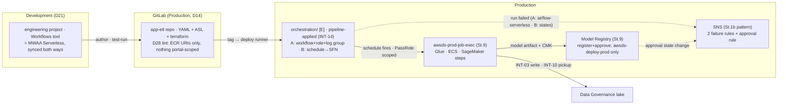

# Stage 10 — Workflow orchestration and promotion

| | |
|---|---|
| **Status** | not started — **revised 2026-08-16 into the pass/verification format, against the official AWS documentation and the local service model read the same day**; pre-instrumented by `./aws/orchestration.py`. Corrections folded in: the Studio's Workflows tool and alternative A are **one product with two-way sync** (a workflow created in either platform is accessible from both), so pass 1 authors in the Studio rather than hand-writing a DAG; **"logs only" was an overstatement** — Serverless has run/task APIs, a console page and (since 2026-06) **EventBridge events** (`aws.airflow-serverless`), so A's failure alarm is an EventBridge rule, symmetric with B's; A runs **Amazon-provider operators only** (no `PythonOperator`) — arbitrary code enters through ECS/Glue/Lambda/SageMaker, which is D28's container contract anyway; the **schedule lives inside the YAML** (cron; EventBridge Scheduler underneath; `TriggerMode` pauses it); the hard limits are written down (50 KB YAML, **60-min task timeout**, retries ≤ 3, 50 versions/workflow); the IAM prefix is **`airflow-serverless`** and a **service-linked role appears at the first `CreateWorkflow`** (Lesson 17); `NetworkConfiguration` is optional and its absence silently runs tasks **outside** the VPC (the Athena-Spark shape) — the slice always sets it; B is Step Functions **Standard** by documented elimination (Express: no `.sync`, 5-min cap), its log group takes the documented `/aws/vendedlogs/states` prefix and its role the documented ten `logs:*` actions on `*`; the model half gained the documented cross-account requirement (**training `OutputDataConfig` must name a KMS key**) and a serving recommendation (batch transform — idle 0; a standing endpoint is priced out by D12); registration stays the **pipeline's** act, so Stage 9 3.2's resource policy is consumed unchanged |
| **Prerequisites** | Stage 8 (the deploy runner and `awsds-deploy-prod` — the orchestration slice is applied by the pipeline, which is INT-14's proof; the shared gates file the lint joins). Stage 9 (`awsds-prod-job-exec` and the LF regrants the workflow's jobs run under; the registry with its resource policies; `awsds-prod-outputs` — the definitions home). Stage 6 (the `engineering` project — pass 1 authors there; its decision 5 deferred the Workflows surface to this stage). **The `Staging` vend gates pass 5's Staging leg and pass 6's full promotion alone** — passes 0-4 and the Production half of pass 5 run without it |
| **Consumes** | [D7](../decisions/D07-orchestration.md), [D11](../decisions/D11-lab-lifecycle.md), [D13](../decisions/D13-lake-formation-enforcement.md), [D17](../decisions/D17-interactive-vs-runtime.md), [D20](../decisions/D20-staging-account.md), [D21](../decisions/D21-development-account.md), [D26](../decisions/D26-unified-studio.md), [D28](../decisions/D28-workflow-contract.md) |
| **Proves** | [INT-14](../integrations.md). **Exercises, without re-proving:** INT-03 (the workflow's jobs write through Stage 9's share), INT-04 and INT-07's registry half (the model chain consumes Stage 9 step 3's policies as built) |

*Read with [`docs/plan/conventions.md`](../conventions.md) (naming, layout, `[P]`/`[D]`/`[E]`, IAM rules).*

---

**Objective:** take a workflow developed in SageMaker and run it in production on a schedule — and close
the notebook-to-production gap for **models**, not just for ETL. **D7 is settled, not decided, here: both
orchestrators are built against the same application** — (A) MWAA Serverless, (B) EventBridge Scheduler +
Step Functions — and compared on cost, portability and how a failure is observed, which is the only way
the trade stops being abstract. The Studio's *Workflows* tool **is** MWAA (open question 15), so the
workflow a data scientist authors in Stage 6's `engineering` project and the alternative A deployed here
are one artifact, not two that meet at D28's contract.

## What this stage builds, and in which accounts

| Where | What | Layer |
|---|---|---|
| `production/orchestration/` (new) | both designs behind an `orchestrator` switch (D5's shape): A — `awscc_mwaaserverless_workflow` + per-workflow role + log group; B — `aws_scheduler_schedule` + `aws_sfn_state_machine` (Standard) + per-workflow roles + log group; the two failure rules. **Applied by the pipeline** (INT-14) | `[E]` |
| `production/sagemaker/` (amended) | the model-approval notification rule (`awsds-prod-model-approval`) on the documented `SageMaker Model Package State Change` event | `[P]` |
| `app-etl` repository (GitLab) | the workflow definition (dag-factory YAML), its ASL port, the terraform that instantiates them; **the D28 promotion lint** in Stage 8's shared gates file | — |
| Domain portal (console, recorded) | the serverless-Workflows surface for the `engineering` project — Stage 6 decision 5's deferred half; the **OnDemand Workflows blueprint stays off** (it provisions a fee-bearing MWAA environment) | — |
| `scripts/` | `layers.py`: `RANKS["orchestration"]` + the `[E]` row; `backend.py`: the slice row | — |

**Contracts this stage fixes, each read by `./aws/orchestration.py` so a rename fails in a check rather
than in a later stage:** the workflow pair **`awsds-prod-wf-app-etl-a`** / **`awsds-prod-wf-app-etl-b`**
(the workflow resource, its execution role and its failure rule all carry the name); the log groups
**`/awsds/prod/wf/app-etl-a`** and **`/aws/vendedlogs/states/awsds-prod-wf-app-etl-b`** (B's prefix is the
documented one); the definitions home **`s3://awsds-prod-outputs/workflows/<app>/<tag>/`**; the
model-approval rule **`awsds-prod-model-approval`**; and, consumed from earlier stages: the job role
`awsds-prod-job-exec` (Stage 9), the task-definition family `awsds-prod-app-etl` (Stage 8's app slice).

## Who executes each action

| Marker | Meaning |
|---|---|
| **[Claude]** | repository edits (Terraform, YAML/ASL, `.gitlab-ci.yml`, scripts) and read-only AWS calls — done without asking |
| **[Claude⚡]** | `terraform apply` or any AWS write — only after the user authorizes that specific action in chat, with the SSO user/account/permission set stated first |
| **[user]** | the Studio/portal work, git pushes and tags, gate approvals, behavioural proofs from persona sessions, and every log entry |
| **[pipeline]** | the deploy runner under `awsds-deploy-prod` (Stage 8 step 4) — the orchestration applies run here **because that is INT-14's proof** |

Hand applies run as the **infrastructure user**: `awsds-infra-prod` (the `production/sagemaker/`
amendment, and the by-hand parity check of the orchestration slice — Stage 8 3.8's discipline).
Authoring sessions sign in as the **data-science user** into the `engineering` project.

## Step numbers are identifiers, not an order

These numbers are **stable addresses cited from other files** — step 4 from `docs/REFERENCES.md` (the
private-web-server DNS technique), step 5 from Stage 9 step 3 and D28 item 6 (the registry this stage
consumes rather than invents). They do not change. The sequence to work in is **seven passes**:

| Pass | # | What | Slice · layer | Applied as / by |
|---|---|---|---|---|
| **0** | 0 | preflights: instruments green, INT-14's surface, the SLR baseline, the Studio surface | readings + console | Claude; console: user |
| **1** | 2 | the artifact set: author in the Studio, graduate into the repo, the lint, the definitions home | repo + gates | user (author, tag); Claude (lint) |
| **2** | 1A, 3 | design A + its failure rule, applied by the pipeline — **INT-14 proven or its fallback recorded** | `production/orchestration/` `[E]` | **pipeline** |
| **3** | 1B, 3 | design B + its failure rule, same slice, same applier | idem | **pipeline** |
| **4** | 1, 4 | the comparison on the same runs; the verdict into D7; step 4 only if the provisioned fallback was used | sessions + readings | user provokes, Claude reads |
| **5** | 5 | the model chain: retrain → register → approve → serve; **the Staging leg at the vend** | `production/sagemaker/` `[P]` amendment + pipeline | `awsds-infra-prod`; pipeline |
| **6** | 6 | the end-to-end scheduled promotion and the negative sweep | sessions + pipeline | user; pipeline |

Pass 1 precedes 2-3 because `CreateWorkflow` **snapshots the definition at creation** — the YAML must sit
in S3 first. Passes 2 and 3 share one slice and one switch; run 2 first so INT-14's answer (and any
fallback) is known before B lands beside it. Pass 4 needs both. Pass 5's Production half runs any time
after pass 0; its Staging leg and pass 6's full chain wait on the vend.

---

## To execute

### 0. Preflight — read what this stage consumes before building on it

**Action:** confirm the substrate (Stage 8's credential layer, Stage 9's runtime), enumerate what the new
service will create, and record what the Studio's Workflows surface actually is today. **Why:** INT-14
was verified to *exist* on 2026-08-08, never to *apply*; the first `CreateWorkflow` creates a
service-linked role nobody chose (Lesson 17); and open question 15 says the Studio surface and this
stage's alternative A are one product — check what exists before building either. **Explanation:** all
readings; the only console half is the user's.

- **0.1 — [Claude] Run the instruments**: `./aws/cicd.py` (CI-2/CI-3 — `awsds-deploy-prod` exists, with
  boundary and single-principal trust) and `./aws/deploytargets.py` (DT-3/DT-4/DT-5 — the registry
  policies, the job role's D13 absence, the LF parameters intact). Red here is an unfinished Stage 8/9,
  not a Stage 10 problem.
- **0.2 — [Claude] Verify INT-14's surface, still read-only**: `awscc_mwaaserverless_workflow` present in
  the pinned `awscc` provider (re-verified 2026-08-16 — the classic provider merged only scaffolding,
  PR #45256, issue #45254 still open); `aws mwaa-serverless` present in the installed CLI. The *apply*
  under the boundary is pass 2's.
- **0.3 — [Claude] Record the service-linked-role baseline**: `AWSServiceRoleForAmazonMWAAServerless`
  absent today (`aws iam get-role`, as `awsds-infra-prod`). It auto-creates at the first
  `CreateWorkflow`, manages the service's networking, and carries
  `AmazonMWAAServerlessServiceRolePolicy` — enumerate it **when it appears** (verification (iii)), so it
  is a recorded principal rather than a discovered one (Lesson 17).
- **0.4 — [user] Read the Workflows surface in the `engineering` project** (open question 15; Lesson 16 —
  record every field): what the portal offers today for **serverless** workflows, and which toggle
  (blueprint, profile parameter, or nothing) enables it. Two facts fix the boundaries: the **OnDemand
  Workflows blueprint provisions a fee-bearing MWAA environment** (the D7 shape this stage rejects —
  refuse it), and workflows **sync both ways** between the Studio and `airflow-serverless`, so whatever
  is authored in 2.1 is a real workflow the CLI can read. If enabling the surface asks for anything
  fee-bearing, stop and price it first (Lesson 6).

### 1. Both orchestrators, one slice, one switch (D7, D28, INT-14)

**Action:** implement A and B in `production/orchestration/` behind an `orchestrator` variable
(`a` | `b` | `both` — D5's switch shape), each producing the D28 artifact set, **applied by the
pipeline**. **Why:** the pipeline apply *is* INT-14 — `awscc` resources under `awsds-deploy-prod`'s
permissions boundary, the test Stage 8 4.1 said this stage would run; and one asymmetry must not be
hidden: **A is the YAML the Studio already speaks** (dag-factory; AWS ships a Python→YAML converter),
**B must be ported to ASL** — that difference is a large part of what is being compared.
**Explanation:** both designs drive the **same steps**: Glue jobs and ECS/Fargate tasks running the
`awsds-prod-app-etl` container, every data-touching step under `awsds-prod-job-exec` (Stage 9) — the
per-workflow roles are *orchestrator* credentials that start and observe jobs, hold **no data
permissions and no lake S3** (D13 one level up), and receive an LF regrant through Stage 9 2.3's local
two-step only if a task ever queries governed data directly. Both implementations are **free at rest**;
what meters is the run (and `production/egress/` while tasks run in the VPC).

- **1A.1 — [Claude] Write design A**: one `awscc_mwaaserverless_workflow` per application —
  `awsds-prod-wf-app-etl-a` — with `definition_s3_location` pinned to 2.4's object **and `version_id`**;
  `role_arn` = the per-workflow role; `logging_configuration.log_group_name` =
  `/awsds/prod/wf/app-etl-a`, an explicit `aws_cloudwatch_log_group`, retention 90 days (D28 item 5 —
  never the auto-created `/aws/mwaa-serverless/<id>/` group, which nobody expires);
  `encryption_configuration` per decision 2; **`network_configuration` always set** — the two Production
  private subnets (different AZs — the documented minimum) and a dedicated SG (self-referencing
  all-inbound + all-egress, the documented shape). Omitting it runs tasks in the *service's* VPC,
  outside every endpoint policy and flow log — the Athena-Spark bypass again (open question 12's
  pattern), which is why `OR-3` reads it.
- **1A.2 — [Claude] Write A's execution role**: trust `airflow-serverless.amazonaws.com`
  (`sts:AssumeRole`; add `aws:SourceAccount` — the docs sample omits it, so if creation fails naming
  trust, drop the condition and record it). Permissions, enumerated: `glue:StartJobRun`/`GetJobRun`/
  `GetJobRuns`/`BatchStopJobRun` on the named jobs; `ecs:RunTask`/`DescribeTasks`/`StopTask` on the
  `awsds-prod-app-etl` task definition + `iam:PassRole` on the task/execution roles **conditioned on
  `iam:PassedToService`** (conventions §6); `sagemaker:CreateTrainingJob`/`Describe*`/`Stop*` +
  `iam:PassRole` on `awsds-prod-job-exec` conditioned `sagemaker.amazonaws.com` (step 5);
  `logs:CreateLogStream`/`PutLogEvents` on its own group; `s3:GetObject` + `kms:Decrypt` on the
  definitions prefix and its key. **No `s3:*` on any lake bucket, no `lakeformation:GetDataAccess`** —
  the role orchestrates, the job role touches data.
- **1B.1 — [Claude] Write design B**: `aws_scheduler_schedule` `awsds-prod-wf-app-etl-b` —
  `flexible_time_window { mode = "OFF" }`, explicit UTC timezone, `state` from a variable (`DISABLED` at
  rest outside comparison windows), retry policy trimmed (attempts ≤ 2 — the 185-attempt default re-runs
  a batch for a day; no DLQ: one more queue nobody reads, the alarm is the instrument), templated target
  `states:StartExecution`; its scheduler role trusts `scheduler.amazonaws.com` with the documented
  confused-deputy conditions and holds `states:StartExecution` on exactly the one state machine.
  `aws_sfn_state_machine` `awsds-prod-wf-app-etl-b`, **type `STANDARD`** — documented elimination:
  Express supports no `.sync` pattern and caps at 5 minutes — definition in ASL mirroring the YAML's
  DAG: `glue:startJobRun.sync` for Glue steps, `ecs:runTask.sync` for container steps, Lambda for glue
  code, `Retry`/`Catch` mirroring A's `retries`/`retry_delay` so the comparison measures the
  orchestrator, not the retry budget.
- **1B.2 — [Claude] Write B's machine role**: the documented `.sync` sets — Glue (the four actions, on
  `*` — Glue has no resource-based scoping), ECS (`RunTask` on the task definition; `events:PutTargets`/
  `PutRule`/`DescribeRule` on **`StepFunctionsGetEventsForECSTaskRule`** — the managed rule the `.sync`
  pattern requires), SageMaker transform/training with their managed rules and the conditioned
  `PassRole`; and the documented **ten `logs:*` delivery actions on `Resource: "*"`** (CloudWatch vended
  logs support no resource scoping — record the exception rather than "fixing" it). Logging
  configuration: `log_destination` = `/aws/vendedlogs/states/awsds-prod-wf-app-etl-b:*` — the documented
  prefix, which keeps every state machine inside **one** CloudWatch Logs resource policy (5 120-char
  limit, ten policies per Region; a group named outside it burns one policy each) — level per
  decision 3.
- **1.3 — [Claude] Write the machinery rows in the same sitting**: `RANKS["orchestration"]` above
  `app/app-etl` (so `make down` removes the trigger before the thing it triggers), the `[E]` `SLICES`
  row (`usd_per_hour` 0.0 — nothing in the slice meters by the hour; the runs meter), the `backend.py`
  row. A slice with no row fails `make check`.
- **1.4 — [pipeline] Apply as `awsds-deploy-prod` — INT-14's proof**: a deploy job applies the slice
  with `orchestrator=a` first. Success **is** INT-14 (the `awscc`/Cloud Control path under a permissions
  boundary — the deploy role needs the `cloudcontrol:*Resource*` reads/writes plus
  `airflow-serverless:*` workflow actions inside its boundary; a denial names which). On failure, the
  fallback chain **in order, wording read each time**: `aws_cloudformation_stack` wrapping
  `AWS::MWAAServerless::Workflow`; then provisioned MWAA (`aws_mwaa_environment`, `mw1.micro`, `[E]` —
  step 4 comes into force). Then `orchestrator=both` lands B the same way. **[Claude⚡]** Prove the
  by-hand parity once as `awsds-infra-prod` (Stage 8 3.8's rule: a slice that only applies from CI is as
  broken as one that only applies by hand).
- **1.5 — [Claude] Record what the first `CreateWorkflow` created**: the service-linked role now exists
  (0.3's pair reading — verification (iii)); the workflow ARN and version; **the version counter starts
  spending the 50-version quota** — each redeploy is a new version, and no prune API is documented
  (risk 4).

### 2. The workflow artifact — authored in the Studio, promoted through git (D21, D26, D28)

**Action:** produce the deployable workflow definition from the `engineering` project and put the D28
lint in front of it. **Why:** the comparison must run against a workflow **authored in the Studio**, not
a hand-written DAG, or it measures the wrong thing; and D28's whole point is that what crosses the gate
is repository content — a workflow that references portal-scoped anything only runs where the portal
exists. **Explanation:** the container is **identical for both orchestrators** (the `awsds-prod-app-etl`
image by ECR URI and tag); if it is not, the comparison measures the packaging.

- **2.1 — [user] Author the workflow in the `engineering` project** (the surface 0.4 recorded): the
  app-etl DAG — the Stage 9 producer/pickup Glue jobs plus the container step — test-run it there
  (Development task-hours, metered per run; this is D21's "authored and test-run in Development").
- **2.2 — [user] Graduate the definition into the repository** (D21 — the rewrite is the gate): the
  YAML lands in `app-etl/workflow/` beside a converted copy if authoring produced Python
  (`python-to-yaml-dag-converter-mwaa-serverless`, the AWS tool — AWS-provider operators only, no
  dynamic task mapping; record what the conversion warned about, verification (viii)). Adjust to the
  validated parameter set: `schedule` (cron — the schedule **is** this line), `retries` ≤ 3,
  `retry_delay` ≤ 300 s, `execution_timeout` ≤ 3 600 s; `catchup`, callbacks and `trigger_rule` are
  documented as **ignored** — a DAG that leans on them behaves differently under A (comparison input,
  not a defect).
- **2.3 — [Claude] Write the D28 promotion lint into Stage 8's shared gates file**: reject any workflow
  definition that references a domain resource (project connections, portal-scoped IDs), names a
  container by anything other than **ECR URI and tag**, exceeds **50 KB**, or carries parameters outside
  the validated set. Cheap YAML checks in an ordinary job; blocking. **[user]** Prove it once with a
  deliberately portal-scoped definition (verification (xi)).
- **2.4 — [pipeline] Deploy the definition to the versioned home**: the release job copies
  `workflow/workflow.yaml` to **`s3://awsds-prod-outputs/workflows/app-etl/<tag>/workflow.yaml`**
  (decision 1 — the bucket is versioned, CMK-protected, perimeter-branched since Stage 9 1.1) and
  records the returned S3 `VersionId` — the value 1A.1 pins, so a definition edit without a deploy
  cannot reach the workflow (`CreateWorkflow` snapshots anyway; the pin makes the intent explicit).

### 3. Schedule, retry, alerting — both implementations, same SNS (D28 item 5)

**Action:** make both workflows fire unattended and page on failure. **Why:** "runs on schedule without
manual steps" is the stage's deliverable, and a failed nightly run nobody hears about is worse than no
schedule. **Explanation:** the schedule mechanics differ by design — A's cron lives **in the YAML**
(EventBridge Scheduler underneath; `TriggerMode` pauses it; only one workflow version holds the active
schedule), B's in the `aws_scheduler_schedule` (`state` toggles it) — but both failure paths are
EventBridge rules to the Stage 1b SNS pattern.

- **3.1 — [Claude] Write A's failure rule** (in the slice): `awsds-prod-wf-app-etl-a-failed` on source
  **`aws.airflow-serverless`**, detail-types `Workflow Run Failed` and `Workflow Run Timeout`, target
  the Stage 1b SNS topic. Delivery is documented durable; duplicates tolerated.
- **3.2 — [Claude] Write B's failure rule**: `awsds-prod-wf-app-etl-b-failed` on source **`aws.states`**,
  detail-type `Step Functions Execution Status Change`, `status` ∈ `FAILED`, `TIMED_OUT`, `ABORTED`,
  filtered to the one state machine ARN. (Only Standard machines emit these — one more reason 1B.1 is
  Standard.)
- **3.3 — [user] Prove the pair**: break a step deliberately (a wrong job argument), run both designs
  once — both rules fire, and the failure is *diagnosable* from what each surface offers: A —
  `list-workflow-runs`/`list-task-instances`/`get-task-instance` (the `LogStream` field), the log group,
  the console page; B — the execution history, the vended log group. **This diagnosis session is
  comparison evidence** (4.1's observability row), not just a test.

### 4. Only if the provisioned fallback is in use — the environment's own questions

**Action:** everything the `aws_mwaa_environment` fallback drags in, and nothing else. **Why:** under
Serverless these questions are empty by construction — no environment, no metadata database, no web UI —
which is itself a step 1 comparison entry; they return only if 1.4 fell through to the last resort.
**Explanation:** kept short because conditional; the mechanics are documented in the references this step
already cites.

- **4.1 — [Claude] Solve the UI reachability before creating the environment**: a *private* web server
  is served by interface endpoints whose AWS-managed private DNS answers only inside the owning VPC —
  the laptop resolves through the Sandbox VPC, so the fix is a private hosted zone of our own with ALIAS
  records to the endpoint names (the documented technique), or a hosts-file entry. Public web-server
  mode is not an alternative (`CLAUDE.md` rules it out).
- **4.2 — [Claude] State the teardown contract** (conventions §5.1 rule 2): DAG code in S3 survives;
  run history and UI-defined connections/variables live in the metadata database and die with the `[E]`
  environment — export them before teardown or declare them expendable **in writing, in the log**.
- **4.3 — [user] Run it as `[E]`**: created for the comparison window, destroyed in the same sitting
  (`mw1.micro`, 0.29 USD/h — ~2.32 USD per 8-hour run; the always-on figure this stage exists to avoid
  is 211.70 USD/month).

### 5. The model chain — registry consumed, approval gated, served through Staging (D17, D20, D28 item 6)

**Action:** define and exercise how a trained model reaches production: who registers, who approves, how
an approved version is served, and what is recorded alongside it. **Why:** Stage 8 promotes containers;
the other thing this environment produces is a model, and without this half "data science environment"
means "notebooks with a nice network". The registry and its resource policies exist (Stage 9 step 3) —
this stage **consumes them unchanged**: the workflow ends at the artifact, the pipeline registers, so
3.2's "register and approve for `awsds-deploy-prod` alone" stays true. **Explanation:** the production
retraining job runs where D17 puts it — in Production, under `awsds-prod-job-exec`, submitted by the
orchestrator built above; Interactive-account training never produces a registered version (D21 —
registration is the pipeline's act, after graduation through git).

- **5.1 — [Claude] Add the training step to the workflow** (both designs): a SageMaker training job
  under `awsds-prod-job-exec` (the `PassRole` grants of 1A.2/1B.2), artifact to
  `awsds-prod-outputs/models/app-etl/` — **`OutputDataConfig` names the Stage 9 CMK**: documented as
  *required* for cross-account deployment, and the Staging read of 5.4 fails without it.
- **5.2 — [Claude] Write the registration/approval jobs in the promotion pipeline** (under
  `awsds-deploy-prod`): `CreateModelPackage` into `awsds-prod-model-app-etl` with
  `PendingManualApproval`, carrying what D28 item 6 asks recorded — `ModelMetrics` from the evaluation,
  the git tag and training-data version in `CustomerMetadataProperties`; then the approval as a
  **blocking manual job** (`when: manual` under `rules:` — Stage 8 3.5's CE shape, the deployment
  manager's pause) whose script runs `UpdateModelPackage` → `Approved`. Rejection is the same job
  answering `Rejected`.
- **5.3 — [Claude] Write the approval-notification rule and amend `production/sagemaker/`**:
  `awsds-prod-model-approval` on source `aws.sagemaker`, detail-type **`SageMaker Model Package State
  Change`**, to the Stage 1b SNS pattern — every approval flip is heard, duplicates tolerated (the
  documented caveat). **[Claude⚡]** Apply as `awsds-infra-prod`.
- **5.4 — [pipeline] Serve the approved version through the chain (D20), at the vend**: in Staging,
  `CreateModel` with `Containers = [{ModelPackageName: <approved version ARN>}]` (the documented
  reference shape) and a **batch transform** against Staging's sampled data — the promotion asserts the
  model loads and returns predictions of the expected shape **before** the Production deploy step runs
  (INT-07's registry half, proven at Stage 9 4.6, exercised here). Then the same serve in Production
  under `awsds-prod-job-exec`. Serving mechanism per decision 4: **batch transform** (idle cost zero,
  VPC-capable); serverless inference is the endpoint-shaped alternative — pay-per-use, **but documented
  as supporting no VPC configuration**, so it sits outside the network perimeter and is named, not
  built; a standing real-time endpoint is idle-billed and priced out (D12).
- **5.5 — [user] Prove the gate still holds from the far side** (INT-04 consumed): from a Development
  session, `DescribeModelPackage` answers and `UpdateModelPackage` is denied by the group policy's
  wording — Stage 9 3.4's proof re-read now that a real version exists.

### 6. The end-to-end, and the boundary sweep

**Action:** the closing proofs — the scheduled promotion with no manual steps between tag and scheduled
production runs, and the negatives that show the new surface added no new reach. **Why:** every earlier
pass proved a piece; the deliverable is the chain. **Explanation:** run each proof from the stated
session; read every denial by its wording (standing rule since 1c).

- **6.1 — [user + pipeline] The scheduled end-to-end (at the vend)**: tag → Stage 8's chain (Staging leg,
  gate) → the orchestration slice applies → the schedule fires **unattended** in the comparison window —
  at least one `SCHEDULED`-type run per design with nobody at the keyboard — the run writes a curated
  table through the LF share (INT-03 exercised under the job role), and the failure rules stay quiet.
  Then the pause lever works: A `TriggerMode` → paused, B `state = DISABLED`, no further runs.
- **6.2 — [user] The negatives, from a data-science Production session**: `airflow-serverless:ListWorkflows`,
  `states:StartExecution` and `scheduler:CreateSchedule` all denied — the persona sets grant none of it
  (implicit deny; the wording names no allow, not an SCP). From the same session, the SNS topic and log
  groups read but do not write. **[Claude]** the role-side negative is a reading, not an attempt
  (Lesson 22): `OR-3` shows both per-workflow roles hold no lake S3, no `GetDataAccess`, no
  `NetworkConfiguration` gap.
- **6.3 — [user] Record the run-history disposition before the first `make down`** (Lesson 4): A's run
  history lives in the service against the workflow resource, B's in the state machine — both die with
  the `[E]` slice. The comparison table (4.1) and the log carry the evidence first; the log groups'
  retention bounds what CloudWatch keeps; write the sentence in the log rather than leaving it implicit
  (conventions §5.1 rule 2).

### The comparison itself — what pass 4 measures and writes down

One table, filled from the same application run under both designs, into
`docs/log/log-stage-10-orchestration-promotion.md` and the verdict into **D7's file** (edited in place,
one line in `docs/plan/history.md`):

| Dimension | A — MWAA Serverless | B — Scheduler + Step Functions |
|---|---|---|
| Authoring | the Studio's own YAML (synced) | ported to ASL by hand |
| Cost per run / month | task-hours, 0.088/h, 1-min minimum | transitions 0.000025 + task compute (PRICING §1.4-1.5) |
| Deploy a change | new version (50-version quota) | `terraform apply` of the definition |
| Failure observed | run/task APIs, log stream, EventBridge event, console | execution history, vended logs, EventBridge event |
| Hard limits | 60-min task cap, 50 KB YAML, retries ≤ 3, AWS operators only | 25 k-event history, 1-year max, arbitrary ASL |
| Terraform surface | one `awscc` resource + role + group | schedule + machine + 2 roles + group |
| Operational surface | no environment, service-side state | no environment, state = the definition |

---

## Deliverables

Each is written so its output differs between working and broken (Lesson 13). **The mechanical half is
`./aws/orchestration.py`** ([`aws/INDEX.md`](../../../aws/INDEX.md)): the two implementations side by
side with their roles' shapes (boundary, trust, the D13 absences, `NetworkConfiguration` present), the
named log groups with retention, the three EventBridge rules ENABLED, the definitions home, recent run
outcomes, the no-environment reading, and the registry's recent register/approve callers. The
behavioural proofs are the stage's own (Lesson 20):

- **INT-14 answered in writing** (1.4): the `awscc` apply under the deploy role's boundary — or which
  fallback, and the wording that forced it.
- **The scheduled pair (6.1):** one unattended `SCHEDULED` run per design, then the pause lever holding.
- **The failure pair (3.3):** both rules fire on a broken step; the diagnosis session recorded as
  comparison evidence.
- **The lint (2.3):** a portal-scoped definition rejected in CI.
- **The model chain (5.x):** a version registered `PendingManualApproval` by the pipeline, approved at
  the manual gate, served in Staging first (at the vend), then Production — and Development still reads
  status only.
- **The comparison table and the D7 verdict**, written where D7's revision trigger can find them.

## Validation

1. Run `./aws/orchestration.py` — all `OR-*` pass; diff two runs across a deploy (only versions,
   run rows and timestamps may change).
2. Run `./aws/egress.py` §6 at session end — the slice itself burns nothing; a leftover provisioned
   MWAA environment (step 4 only) is this stage's likeliest leak, and `OR-6` fails on it.
3. Run `./aws/deploytargets.py` after the 5.3 apply — `DT-5` (the LF parameters) and `DT-3` (the group
   policies unchanged — this stage added no principal).
4. Read every denial by its wording, never its exit code (standing rule since 1c).

## Cost

Measured (`docs/PRICING.md` §1.3-1.5, §5, §8), us-west-2:

| Item | Cost | Layer |
|---|---|---|
| Both designs at rest | **0** — no environment fee, no standing resource that meters | `[E]` |
| A: managed task-hours | 0.088/task-h, 1-min minimum (~4.40/month for the §1.5 nightly) | per run |
| B: transitions + Scheduler | 0.000025/transition; Scheduler inside the 14 M free tier (~1.99/month idem, Fargate included) | per run |
| Task compute either way | Glue 0.44/DPU-h; Fargate ARM ~0.036/vCPU-h + memory; SageMaker training/transform per instance-h (§8) | per run |
| `production/egress/` while runs execute | ~0.150/h (the cost-model row) | `[E]` |
| Provisioned fallback, if step 4 fires | `mw1.micro` 0.29/h — `[E]`, per comparison window only | `[E]` |
| Log storage, 3 EventBridge rules, SNS | cents; free tier at this volume | `[P]`/`[E]` |

## Decisions due while executing

**Blocking questions for the user: none.** Each is decided during the stage and written into
`docs/log/log-stage-10-orchestration-promotion.md` (Lesson 16). Recommendations stated so the keyboard
is not the decision-maker.

1. **The definitions home** (2.4) — recommended: **`awsds-prod-outputs/workflows/<app>/<tag>/` with the
   S3 `VersionId` pinned** — the bucket is already versioned, CMK-protected and perimeter-branched; a
   dedicated bucket buys nothing at N=1. Revisit only if verification (iv) shows the service's
   definition read failing the perimeter.
2. **A's encryption configuration** (1A.1) — recommended: **`CUSTOMER_MANAGED_KEY` with the Stage 9 CMK**
   (`alias/awsds-prod-zn-lab`) — D31's argument: what Staging and the approvers cannot decrypt stays
   expressible; fall back to `AWS_MANAGED_KEY` only if the service's grant path fails, recorded.
3. **B's log level** (1B.2) — recommended: **`ALL` with execution data during the comparison window,
   `ERROR` without it afterwards** — the comparison wants rich evidence, the steady state wants cheap
   vended logs.
4. **The serving mechanism** (5.4) — recommended: **batch transform** — idle cost zero and VPC-capable;
   serverless inference recorded as the alternative with its documented no-VPC limit named; a standing
   real-time endpoint declined on D12 arithmetic (idle instance-hours).
5. **The post-comparison disposition** (6.3) — recommended: **the winner stays in the slice, the loser's
   variant is switched off; the slice stays `[E]`** as conventions §6 has it — the schedule exists only
   while the slice is applied, which under D11 is a session property, not a defect. The revisit trigger
   (§5.1 rule 7): the day a workload needs the schedule to survive sessions, both designs are free at
   rest and promotion to `[P]` costs nothing — record it then, with the bill in hand.

## Verifications to answer while executing

Record every answer, including the ones that come out fine.

| # | Question | Step |
|---|---|---|
| i | What is the Studio's serverless-Workflows surface today, which toggle enables it, and does the OnDemand (provisioned) blueprint stay off (open question 15)? | 0.4 |
| ii | Does `awscc_mwaaserverless_workflow` apply under `awsds-deploy-prod`'s boundary (INT-14) — and if not, which fallback, on which wording? | 1.4 |
| iii | Does `AWSServiceRoleForAmazonMWAAServerless` appear at the first `CreateWorkflow` — absent in 0.3, present and enumerated in 1.5 (Lesson 17)? | 0.3, 1.5 |
| iv | Does the service's definition read pass the outputs bucket's perimeter branches (the `ViaAWSService` carve-out doing its job)? | 1.4, 2.4 |
| v | Does a `SCHEDULED` run fire unattended in both designs — and does the pause lever (A `TriggerMode`, B `state`) stop the next one? | 6.1 |
| vi | Does a broken step fire both failure rules, and is the failure diagnosable from each design's surface (the observability row filled from a real session)? | 3.3 |
| vii | Which app-etl steps fit inside A's 60-minute task cap — and what does the comparison record for the long-Glue-job case (B's `.sync` polls for up to a year)? | 2.2, 4 |
| viii | What did the Python→YAML converter warn about or drop (unsupported operators, ignored parameters), and did the round-trip stay faithful? | 2.2 |
| ix | Do both per-workflow roles read back with no lake S3, no `GetDataAccess`, boundary attached, `NetworkConfiguration` set (`OR-3`)? | 1A.2, 1B.2, 6.2 |
| x | Does the model chain hold end to end — registration only under `awsds-deploy-prod`, training `OutputDataConfig` carrying the CMK, the approved version served in **Staging before Production** (at the vend)? | 5.1-5.4 |
| xi | Does the lint reject a portal-scoped / non-ECR-URI / oversized definition (a deliberate bad artifact)? | 2.3 |
| xii | After the comparison's redeploys, how many workflow versions exist against the 50-version quota — and is the run-history disposition written before the first `make down` (Lesson 4)? | 1.5, 6.3 |

## Risks

- **INT-14 remains the load-bearing unknown** — the resource exists (re-verified 2026-08-16), the apply
  under a boundary does not; the fallback chain is ordered and each rung is recorded, not improvised.
- **A workflow without `NetworkConfiguration` runs outside the VPC silently** — the same shape as
  Athena Spark's non-VPC default (open question 12); the slice always sets it and `OR-3` fails on its
  absence.
- **A's hard caps can decide the comparison by accident**: a Glue step longer than 60 minutes, a YAML
  over 50 KB, a fourth retry — each fails under A and works under B; record them as *facts about A*, not
  as workflow defects (verification (vii)).
- **Version churn against the 50-version quota** — every redeploy is a new version, no prune API is
  documented, and deleting the workflow deletes its run history; watched at 1.5/(xii), escalated to a
  support ticket only if a real cadence approaches it.
- **Run history and logs are state inside `[E]` resources** (Lesson 4) — the evidence lives in the log
  and the comparison table before any teardown; retention bounds the rest; 6.3 writes the sentence.
- **The scheduler's default retry budget re-runs a failed batch for a day** — 1B.1 trims it; the alarm,
  not the retry, is the failure path.
- **`TriggerMode`'s literal values are undocumented** (a plain string in every schema) — read the
  accepted values at 1.4 rather than hard-coding; a wrong literal fails at apply, loudly.
- **The B log-group prefix is load-bearing, not cosmetic** — outside `/aws/vendedlogs/`, each machine
  burns one of ten per-Region CloudWatch Logs resource policies; the eleventh state machine then fails
  to create.

---

*Stage index: [stages/INDEX.md](INDEX.md) · Plan core: [GENERAL_PLAN.md](../../GENERAL_PLAN.md)*
