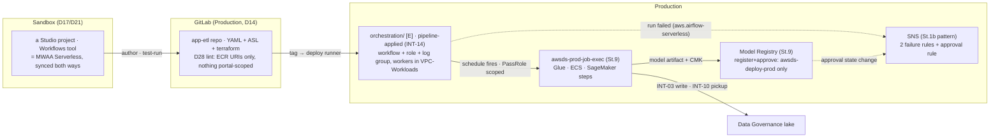

# Stage 10 — Workflow orchestration and promotion

| | |
|---|---|
| **Status** | not started — **re-scoped 2026-09-05 (user) and re-reviewed the same day, when the body was brought into line with this row: it still built design B, still carried an `orchestrator=both` switch and still had a comparison pass, none of which survive the decision below.** (1) **MWAA Serverless only** (D7 amended): the provisioned rung leaves the plan and **step 4 becomes the fallback ladder that records why** — the price is kept in `PRICING.md` as the record of why — `OR-6` flips to an **absence** check (`airflow list-environments` empty everywhere), the `Workflows` blueprint moves to category 3, and a `DenyProvisionedMwaa` (`airflow:CreateEnvironment`) statement joins the root SCP with a battery probe, because the SMUS provisioning role's AWS-managed policy grants that action today. Design **B** (EventBridge Scheduler + Step Functions) is **not built** and becomes INT-14's terminal fallback. (2) **`NetworkConfiguration` is always set, on private routing**: workers are ECS ENIs in `VPC-Workloads`' two private subnets, with `logs`, `monitoring`, `kms`, `sts`, `sagemaker.api`, `sagemaker.runtime`, `glue`, `ecr.api` and `ecr.dkr` endpoints plus an S3 gateway policy admitting `prod-<region>-starport-layer-bucket`. The service exposes **no proxy setting**, which makes it the first named exception to D38's single egress — an exception with *no* internet path, so a `PythonOperator` that needs PyPI is rejected by the lint, not routed. **Corrected 2026-09-05 in the 6b-6d review, against the MWAA Serverless networking guide:** that shape is AWS's own documented *private routing* option, whose subnets *"must not have a route table to a NAT device (gateway or instance), nor an internet gateway"* — so MWAA Serverless is **not** D38's NAT contingency candidate (D38 §1 amended), and the requirements list that demands two NAT gateways is the **public-routing** shape on the same page (Lesson 41). Three build constraints come with it: **two private subnets in two AZs** (a named D9 exception with a price, since every other metered endpoint here is single-AZ), a security group with a **self-referencing inbound rule** plus an all-traffic outbound rule, and every endpoint with **private DNS enabled** and associated to both subnets and that group. The guide's private-shape NACL line (inbound allow-all, **outbound deny-all**) is verified at build time, never copied: a stateless ACL denying all egress would break the endpoints it fronts. (3) **Authoring happens in Sandbox** and the definition's portability is measured at [6d](stage-06d-unified-studio-remainder.md) step 4 — this stage's verification (i), pulled forward because the design now rests on it. (4) **Staging gets its own orchestration slice**: a serverless workflow bills nothing at rest, so the financial argument for orchestration-only-in-Production is gone. — *earlier:* not started — **revised 2026-08-16 into the pass/verification format, against the official AWS documentation and the local service model read the same day**; pre-instrumented by `./aws/orchestration.py`. Corrections folded in: the Studio's Workflows tool and alternative A are **one product with two-way sync** (a workflow created in either platform is accessible from both), so pass 1 authors in the Studio rather than hand-writing a DAG; **"logs only" was an overstatement** — Serverless has run/task APIs, a console page and (since 2026-06) **EventBridge events** (`aws.airflow-serverless`), so A's failure alarm is an EventBridge rule, symmetric with B's; A runs **Amazon-provider operators only** (no `PythonOperator`) — arbitrary code enters through ECS/Glue/Lambda/SageMaker, which is D28's container contract anyway; the **schedule lives inside the YAML** (cron; EventBridge Scheduler underneath; `TriggerMode` pauses it); the hard limits are written down (50 KB YAML, **60-min task timeout**, retries ≤ 3, 50 versions/workflow); the IAM prefix is **`airflow-serverless`** and a **service-linked role appears at the first `CreateWorkflow`** (Lesson 17); `NetworkConfiguration` is optional and its absence silently runs tasks **outside** the VPC (the Athena-Spark shape) — the slice always sets it; B is Step Functions **Standard** by documented elimination (Express: no `.sync`, 5-min cap), its log group takes the documented `/aws/vendedlogs/states` prefix and its role the documented ten `logs:*` actions on `*`; the model half gained the documented cross-account requirement (**training `OutputDataConfig` must name a KMS key**) and a serving recommendation (batch transform — idle 0; a standing endpoint is priced out by D12); registration stays the **pipeline's** act, so Stage 9 3.2's resource policy is consumed unchanged |
| **Prerequisites** | Stage 8 (the deploy runner and `awsds-deploy-prod` — the orchestration slice is applied by the pipeline, which is INT-14's proof; the shared gates file the lint joins). Stage 9 (`awsds-prod-job-exec` and the LF regrants the workflow's jobs run under; the registry with its resource policies; `awsds-prod-outputs` — the definitions home). **[6d](stage-06d-unified-studio-remainder.md)** (a live Sandbox project — pass 1 authors there; 6a's decision 5 deferred the Workflows surface to this stage, and 6d step 4 measures the definition's portability). **6b** — Staging exists, so nothing here waits on a vend. **6c** — `VPC-Workloads` is where the workers land, and `production/workloads-egress/` is the `[E]` slice that gives them their endpoints. **6d step 4** — the definition's portability is measured there and consumed here as verification (i) |
| **Consumes** | [D7](../decisions/D07-orchestration.md), [D11](../decisions/D11-lab-lifecycle.md), [D13](../decisions/D13-lake-formation-enforcement.md), [D17](../decisions/D17-interactive-vs-runtime.md), [D20](../decisions/D20-staging-account.md), [D26](../decisions/D26-unified-studio.md), [D28](../decisions/D28-workflow-contract.md), **[D38](../decisions/D38-single-egress-hub.md)** (the workers are its first named exception — see 1.2) |
| **Proves** | [INT-14](../integrations.md). **Exercises, without re-proving:** INT-03 (the workflow's jobs write through Stage 9's share) and INT-07's registry half, which absorbed INT-04 at 6b (the model chain consumes Stage 9 step 3's policies as built) |

*Read with [`docs/plan/conventions.md`](../conventions.md) (naming, layout, `[P]`/`[D]`/`[E]`, IAM rules).*

---

**Objective:** take a workflow developed in SageMaker and run it in production on a schedule — and close
the notebook-to-production gap for **models**, not just for ETL. **D7 was settled by measurement on
2026-09-05, before this stage runs: MWAA Serverless only**, at USD 0.088 per task-hour with no standing
fee, against USD 0.29/h for the smallest provisioned environment. Design B (EventBridge Scheduler + Step
Functions) is **not built** — it is INT-14's terminal fallback, kept as a described ladder in step 4 — and
there is **no comparison pass**: a comparison is what produces a decision, and the decision exists. The
Studio's *Workflows* tool **is** MWAA (open question 15), so the workflow a data scientist authors in a
**Sandbox** project and what this stage deploys are one artifact, not two that meet at D28's contract.

## What this stage builds, and in which accounts

| Where | What | Layer |
|---|---|---|
| `production/orchestration/` (new) | `awscc_mwaaserverless_workflow` + its execution role + its log group + its failure rule. **Applied by the pipeline** (INT-14) | `[E]` |
| `staging/orchestration/` (new) | the same slice, same module, Staging's account — **a serverless workflow bills nothing at rest, so the financial argument for orchestration-only-in-Production is gone** and the promotion chain gains a rehearsal that is not Production | `[E]` |
| `production/workloads-egress/` (amended) + `staging/egress/` (amended) | the worker endpoints MWAA Serverless's **private routing** shape documents: `logs`, `monitoring`, `kms`, plus `sts`, `sagemaker.api`, `sagemaker.runtime`, `glue`, `ecr.api`, `ecr.dkr` and an S3 gateway policy admitting `prod-<region>-starport-layer-bucket` | `[E]` |
| `production/sagemaker/` (amended) | the model-approval notification rule (`awsds-prod-model-approval`) on the documented `SageMaker Model Package State Change` event | `[P]` |
| `app-etl` repository (GitLab) | the workflow definition (dag-factory YAML), its ASL port, the terraform that instantiates them; **the D28 promotion lint** in Stage 8's shared gates file | — |
| Domain portal (console, recorded) | the serverless-Workflows surface for the `engineering` project — Stage 6 decision 5's deferred half; the **OnDemand Workflows blueprint stays off** (it provisions a fee-bearing MWAA environment) | — |
| `scripts/` | `layers.py`: `RANKS["orchestration"]` + the `[E]` row; `backend.py`: the slice row | — |

**Contracts this stage fixes, each read by `./aws/orchestration.py` so a rename fails in a check rather
than in a later stage:** the workflow **`awsds-<env>-wf-app-etl`** (the resource, its execution role and
its failure rule all carry the name — **the `-a`/`-b` suffixes are gone with design B**); the log group
**`/awsds/<env>/wf/app-etl`**; the definitions home **`s3://awsds-prod-outputs/workflows/<app>/<tag>/`**;
the model-approval rule **`awsds-prod-model-approval`**; and, consumed from earlier stages: the job role
`awsds-prod-job-exec` (Stage 9), the task-definition family `awsds-prod-app-etl` (Stage 8's app slice).

## Who executes each action

| Marker | Meaning |
|---|---|
| **[Claude]** | repository edits (Terraform, YAML/ASL, `.gitlab-ci.yml`, scripts) and read-only AWS calls — done without asking |
| **[Claude⚡]** | `terraform apply` or any AWS write — only after the user authorizes that specific action in chat, with the SSO user/account/permission set stated first |
| **[user]** | the Studio/portal work, git pushes and tags, gate approvals, behavioural proofs from persona sessions, and every log entry |
| **[pipeline]** | the deploy runner under `awsds-deploy-prod` (Stage 8 step 4) — the orchestration applies run here **because that is INT-14's proof** |

Hand applies run as the **infrastructure user**: `awsds-infra-prod` (the `production/sagemaker/`
amendment, and the by-hand parity check of the orchestration slice — Stage 8 3.8's discipline).
Authoring sessions sign in as the **data-science user** into the `engineering` project.

## Step numbers are identifiers, not an order

These numbers are **stable addresses cited from other files** — step 4 from `docs/REFERENCES.md`, step 5
from Stage 9 step 3 and D28 item 6 (the registry this stage consumes rather than invents). They do not
change; what changed on 2026-09-05 is what step 4 *contains*, since the provisioned rung it described left
the plan. The sequence is **five passes**:

| Pass | # | What | Slice · layer | Applied as / by |
|---|---|---|---|---|
| **0** | 0 | preflights: instruments green, INT-14's surface, the SLR baseline, the Studio surface | readings + console | Claude; console: user |
| **1** | 2 | the artifact set: author in a Sandbox project, graduate into the repo, the lint, the definitions home | repo + gates | user (author, tag); Claude (lint) |
| **2** | 1, 3 | the workflow, its network shape, its failure rule — applied by the pipeline in **Staging first, then Production**; **INT-14 proven or its fallback recorded** | `staging/orchestration/`, then `production/orchestration/` `[E]` | **pipeline** |
| **3** | 5 | the model chain: retrain → register → approve → serve | `production/sagemaker/` `[P]` amendment + pipeline | `awsds-infra-prod`; pipeline |
| **4** | 6 | the end-to-end scheduled promotion and the negative sweep | sessions + pipeline | user; pipeline |

Pass 1 precedes pass 2 because `CreateWorkflow` **snapshots the definition at creation** — the YAML must
sit in S3 first. **Pass 2 lands in Staging before Production** for the same reason Stage 8's chain does: the
first `CreateWorkflow` in the estate creates a service-linked role and spends a version, and it is better
that it does so in the account whose failure costs nothing. Step 4 is not a pass — it is the fallback
ladder, read only if pass 2's apply is refused.

---

## To execute

### 0. Preflight — read what this stage consumes before building on it

**Action:** confirm the substrate (Stage 8's credential layer, Stage 9's runtime), enumerate what the new
service will create, and record what the Studio's Workflows surface actually is today. **Why:** INT-14
was verified to *exist* on 2026-08-08, never to *apply*; the first `CreateWorkflow` creates a
service-linked role nobody chose (Lesson 17); and open question 15 says the Studio surface and this
stage's alternative A are one product — check what exists before building either. **Explanation:** all
readings; the only console half is the user's.

- **0.1 — [Claude] Run the instruments**: `./aws/cicd.py` (CI-2/CI-3 — `awsds-deploy-prod` exists, with
  boundary and single-principal trust) and `./aws/deploytargets.py` (DT-3/DT-4/DT-5 — the registry
  policies, the job role's D13 absence, the LF parameters intact). Red here is an unfinished Stage 8/9,
  not a Stage 10 problem.
- **0.2 — [Claude] Verify INT-14's surface, still read-only**: `awscc_mwaaserverless_workflow` present in
  the pinned `awscc` provider (re-verified 2026-08-16 — the classic provider merged only scaffolding,
  PR #45256, issue #45254 still open); `aws mwaa-serverless` present in the installed CLI. The *apply*
  under the boundary is pass 2's.
- **0.3 — [Claude] Record the service-linked-role baseline**: `AWSServiceRoleForAmazonMWAAServerless`
  absent today (`aws iam get-role`, as `awsds-infra-prod`). It auto-creates at the first
  `CreateWorkflow`, manages the service's networking, and carries
  `AmazonMWAAServerlessServiceRolePolicy` — enumerate it **when it appears** (verification (iii)), so it
  is a recorded principal rather than a discovered one (Lesson 17).
- **0.4 — [user] Read the Workflows surface in the `engineering` project** (open question 15; Lesson 16 —
  record every field): what the portal offers today for **serverless** workflows, and which toggle
  (blueprint, profile parameter, or nothing) enables it. Two facts fix the boundaries: the **OnDemand
  Workflows blueprint provisions a fee-bearing MWAA environment** (the D7 shape this stage rejects —
  refuse it), and workflows **sync both ways** between the Studio and `airflow-serverless`, so whatever
  is authored in 2.1 is a real workflow the CLI can read. If enabling the surface asks for anything
  fee-bearing, stop and price it first (Lesson 6).

### 1. The workflow slice — one design, two accounts (D7, D28, INT-14)

**Action:** write `orchestration/` once as a module and call it from Staging and Production, **applied by
the pipeline**. **Why:** the pipeline apply *is* INT-14 — `awscc` resources under a deploy role's
permissions boundary, the test Stage 8 step 4.1 said this stage would run. **Explanation:** the workflow
drives Glue jobs and ECS/Fargate tasks running the `awsds-<env>-app-etl` container, and every data-touching
step runs under `awsds-<env>-job-exec` (Stage 9). The **execution role is an orchestrator credential**: it
starts and observes jobs, holds **no data permissions and no lake S3** (D13 one level up), and receives an
LF regrant through Stage 9 2.3's local two-step only if a task ever queries governed data directly. It is
**free at rest**; what meters is the run, plus the `[E]` endpoint set while tasks are in the VPC.

- **1.1 — [Claude] Write the workflow resource**: one `awscc_mwaaserverless_workflow` per application —
  `awsds-<env>-wf-app-etl` — with `definition_s3_location` pinned to 2.4's object **and `version_id`**;
  `role_arn` = the execution role; `logging_configuration.log_group_name` = `/awsds/<env>/wf/app-etl`, an
  explicit `aws_cloudwatch_log_group`, retention 90 days (D28 item 5 — never the auto-created
  `/aws/mwaa-serverless/<id>/` group, which nobody expires); `encryption_configuration` per decision 2.
- **1.2 — [Claude] Set `network_configuration`, always, on AWS's documented PRIVATE-routing shape.**
  Omitting it runs tasks in the *service's* VPC, outside every endpoint policy and flow log — the
  Athena-Spark bypass again, which is why `OR-3` reads it. The private shape and its four constraints,
  none of them optional:
  1. **Two private subnets in two AZs** — the documented minimum, and **a named D9 exception with a
     price**, since every other metered endpoint in this estate is single-AZ. Say so in the cost table
     rather than letting it arrive as a surprise line.
  2. **No route to a NAT device or an internet gateway** — AWS's own words. This is why **MWAA Serverless
     is not D38's NAT contingency candidate** (D38 §1 amended): the requirements list that demands two NAT
     gateways belongs to the *public*-routing shape on the same page (Lesson 41).
  3. **Interface endpoints for `logs`, `monitoring` and `kms`**, private DNS on, associated to both
     subnets and to the workers' security group — plus the job-facing set (`sts`, `sagemaker.api`,
     `sagemaker.runtime`, `glue`, `ecr.api`, `ecr.dkr`) and an S3 gateway policy admitting
     `prod-<region>-starport-layer-bucket`.
  4. **A security group with a self-referencing inbound rule** and an all-traffic outbound rule.

  **The service exposes no proxy setting**, which makes it **the first named exception to D38's single
  egress — an exception with *no* internet path at all** rather than a second one. A `PythonOperator` that
  wants PyPI is therefore **rejected by the lint** (2.3), never routed. Verify the guide's private-shape
  NACL line (inbound allow-all, **outbound deny-all**) at build time rather than copying it: a stateless
  ACL denying all egress would break the endpoints it fronts.
- **1.3 — [Claude] Write the execution role**: trust `airflow-serverless.amazonaws.com`
  (`sts:AssumeRole`; add `aws:SourceAccount` — the docs sample omits it, so if creation fails naming
  trust, drop the condition and record it). Permissions, enumerated: `glue:StartJobRun`/`GetJobRun`/
  `GetJobRuns`/`BatchStopJobRun` on the named jobs; `ecs:RunTask`/`DescribeTasks`/`StopTask` on the
  `awsds-prod-app-etl` task definition + `iam:PassRole` on the task/execution roles **conditioned on
  `iam:PassedToService`** (conventions §6); `sagemaker:CreateTrainingJob`/`Describe*`/`Stop*` +
  `iam:PassRole` on `awsds-prod-job-exec` conditioned `sagemaker.amazonaws.com` (step 5);
  `logs:CreateLogStream`/`PutLogEvents` on its own group; `s3:GetObject` + `kms:Decrypt` on the
  definitions prefix and its key. **No `s3:*` on any lake bucket, no `lakeformation:GetDataAccess`** —
  the role orchestrates, the job role touches data.
- **1.4 — [Claude] Write the machinery rows in the same sitting**: `RANKS["orchestration"]` above
  `app/app-etl` (so `make down` removes the trigger before the thing it triggers), **two** `[E]` `SLICES`
  rows — `staging` and `production` (`usd_per_hour` 0.0: nothing in the slice meters by the hour; the runs
  meter) — and the `backend.py` rows. A slice with no row fails `make check`.
- **1.5 — [pipeline] Apply in Staging first, then Production — INT-14's proof**: a deploy job applies
  `staging/orchestration/` as `awsds-deploy-staging`, then `production/orchestration/` as
  `awsds-deploy-prod`. Success **is** INT-14 (the `awscc`/Cloud Control path under a permissions
  boundary — the deploy role needs the `cloudcontrol:*Resource*` reads/writes plus `airflow-serverless:*`
  workflow actions inside its boundary; a denial names which). On refusal, read step 4's ladder rather than
  improvising. **[Claude⚡]** Prove the by-hand parity once as `awsds-infra-prod` (Stage 8 3.8's rule: a
  slice that only applies from CI is as broken as one that only applies by hand).
- **1.6 — [Claude] Record what the first `CreateWorkflow` created**: the service-linked role now exists
  (0.3's pair reading — verification (iii)); the workflow ARN and version; **the version counter starts
  spending the 50-version quota** — each redeploy is a new version, and no prune API is documented
  (risk 4).

### 2. The workflow artifact — authored in the Studio, promoted through git (D21, D26, D28)

**Action:** produce the deployable workflow definition from a **Sandbox** Studio project and put the D28
lint in front of it. **Why:** D28's whole point is that what crosses the gate is repository content — a
workflow that references portal-scoped anything only runs where the portal exists, and **only Sandbox has
a portal** (D17 sharpened at 6b). **Explanation:** [6d](stage-06d-unified-studio-remainder.md) step 4
measures that portability and hands the answer here as verification (i) — pulled forward deliberately,
because this stage's design rests on it.

- **2.1 — [user] Author the workflow in a Sandbox project** (the surface 0.4 recorded): the app-etl DAG —
  the Stage 9 producer/pickup Glue jobs plus the container step — test-run there (Sandbox task-hours,
  metered per run). **This is where D21's "authored and test-run" clause now points**, and Sandbox is the
  only account it can point at.
- **2.2 — [user] Graduate the definition into the repository** (D21 — the rewrite is the gate): the
  YAML lands in `app-etl/workflow/` beside a converted copy if authoring produced Python
  (`python-to-yaml-dag-converter-mwaa-serverless`, the AWS tool — AWS-provider operators only, no
  dynamic task mapping; record what the conversion warned about, verification (viii)). Adjust to the
  validated parameter set: `schedule` (cron — the schedule **is** this line), `retries` ≤ 3,
  `retry_delay` ≤ 300 s, `execution_timeout` ≤ 3 600 s; `catchup`, callbacks and `trigger_rule` are
  documented as **ignored** — a DAG that leans on them behaves differently here than it did in an ordinary
  Airflow, which is a fact to record about the service, not a defect to chase.
- **2.3 — [Claude] Consume the D28 promotion lint — it is authored once, at Stage 8 step 5.6**, so there
  is one copy. It rejects a definition that references a domain resource (project connections,
  portal-scoped ids), names a container by anything other than **ECR URI and tag**, exceeds **50 KB**,
  hard-codes a `start_date` (rewritten at deploy time), uses an operator outside MWAA Serverless's
  Amazon-provider allow-list, exceeds the **3600 s** task cap, or omits a pinned
  `DefinitionS3Location.VersionId`. **The operator rule is load-bearing here rather than stylistic**: with
  no internet path in the worker subnets (1.2), a `PythonOperator` reaching PyPI has no route at all, so
  the lint is what turns a runtime hang into a CI failure. **[user]** Prove it once with a deliberately
  portal-scoped definition (verification (xi)).
- **2.4 — [pipeline] Deploy the definition to the versioned home**: the release job copies
  `workflow/workflow.yaml` to **`s3://awsds-prod-outputs/workflows/app-etl/<tag>/workflow.yaml`**
  (decision 1 — the bucket is versioned, CMK-protected, perimeter-branched since Stage 9 1.1) and
  records the returned S3 `VersionId` — the value 1.1 pins, so a definition edit without a deploy
  cannot reach the workflow (`CreateWorkflow` snapshots anyway; the pin makes the intent explicit).

### 3. Schedule, retry, alerting (D28 item 5)

**Action:** make the workflow fire unattended and page on failure. **Why:** "runs on schedule without
manual steps" is the stage's deliverable, and a failed nightly run nobody hears about is worse than no
schedule. **Explanation:** the cron lives **in the YAML** (EventBridge Scheduler underneath; `TriggerMode`
pauses it; only one workflow version holds the active schedule), so the schedule is promoted with the
definition rather than configured beside it.

- **3.1 — [Claude] Write the failure rule** (in the slice): `awsds-<env>-wf-app-etl-failed` on source
  **`aws.airflow-serverless`**, detail-types `Workflow Run Failed` and `Workflow Run Timeout`, target the
  Stage 1b SNS topic. Delivery is documented durable; duplicates tolerated.
- **3.2 — [user] Prove it, and prove the diagnosis path with it**: break a step deliberately (a wrong job
  argument), run once — the rule fires, and the failure is *diagnosable* from what the service offers:
  `list-workflow-runs`, `list-task-instances`, `get-task-instance` (the `LogStream` field), the log group
  and the console page. **Record the diagnosis session**: under a serverless service with no environment
  to log into, what the APIs will tell you *is* the operational surface, and learning that during an
  incident is the expensive way.

### 4. The fallback ladder — documented, not built (INT-14)

**Action:** write down, in order, what is tried if 1.5's apply is refused — and what is *no longer* on the
ladder. **Why:** INT-14 is the one integration whose failure has no workaround inside the design, so the
alternatives are decided while nobody is under pressure. **Explanation:** nothing here is built. Reading
this step is what pass 2 does on a refusal; each rung's denial wording is recorded before the next is
tried.

- **4.1 — [Claude] Rung one, the CloudFormation wrapper**: `aws_cloudformation_stack` wrapping
  `AWS::MWAAServerless::Workflow`. Same service, same resource, a different provider path — so it answers
  whether the refusal was Cloud Control's or the boundary's.
- **4.2 — [Claude] Rung two, design B**: EventBridge Scheduler + Step Functions **Standard** (Express is
  eliminated by documentation: no `.sync` pattern, a 5-minute cap), the definition ported to ASL, its log
  group on the documented **`/aws/vendedlogs/states/`** prefix — which keeps every state machine inside one
  CloudWatch Logs resource policy — and its role holding the documented ten `logs:*` delivery actions on
  `Resource: "*"`. **This is the terminal fallback and it is not built**: it costs a hand port of the DAG
  to ASL, and D7 chose against paying that while a supported path exists.
- **4.3 — [Claude] The rung that left the ladder, and why the removal is a control**: **provisioned MWAA
  (`aws_mwaa_environment`, `mw1.micro`) is no longer an option.** It was measured at USD 0.29/h — about
  USD 212/month standing against a USD 50 ceiling (D12) — and an option that expensive left in a fallback
  chain is an option that gets taken at 2 a.m. It is replaced by a **preventive** control rather than a
  note: `DenyProvisionedMwaa` (`airflow:CreateEnvironment`) joins the root SCP with its own battery probe,
  because the SMUS provisioning role's AWS-managed policy grants that action today. `OR-6` flips from
  *"the environment is torn down"* to an **absence** check — `airflow list-environments` empty in every
  account — and the price stays in `PRICING.md` as the record of why.

### 5. The model chain — registry consumed, approval gated, served through Staging (D17, D20, D28 item 6)

**Action:** define and exercise how a trained model reaches production: who registers, who approves, how
an approved version is served, and what is recorded alongside it. **Why:** Stage 8 promotes containers;
the other thing this environment produces is a model, and without this half "data science environment"
means "notebooks with a nice network". The registry and its resource policies exist (Stage 9 step 3) —
this stage **consumes them unchanged**: the workflow ends at the artifact, the pipeline registers, so
3.2's "register and approve for `awsds-deploy-prod` alone" stays true. **Explanation:** the production
retraining job runs where D17 puts it — in Production, under `awsds-prod-job-exec`, submitted by the
orchestrator built above; Interactive-account training never produces a registered version (D21 —
registration is the pipeline's act, after graduation through git).

- **5.1 — [Claude] Add the training step to the workflow**: a SageMaker training job
  under `awsds-prod-job-exec` (the `PassRole` grants of 1.3), artifact to
  `awsds-prod-outputs/models/app-etl/` — **`OutputDataConfig` names the Stage 9 CMK**: documented as
  *required* for cross-account deployment, and the Staging read of 5.4 fails without it.
- **5.2 — [Claude] Write the registration/approval jobs in the promotion pipeline** (under
  `awsds-deploy-prod`): `CreateModelPackage` into `awsds-prod-model-app-etl` with
  `PendingManualApproval`, carrying what D28 item 6 asks recorded — `ModelMetrics` from the evaluation,
  the git tag and training-data version in `CustomerMetadataProperties`; then the approval as a
  **blocking manual job** (`when: manual` under `rules:` — Stage 8 3.5's CE shape, the deployment
  manager's pause) whose script runs `UpdateModelPackage` → `Approved`. Rejection is the same job
  answering `Rejected`.
- **5.3 — [Claude] Write the approval-notification rule and amend `production/sagemaker/`**:
  `awsds-prod-model-approval` on source `aws.sagemaker`, detail-type **`SageMaker Model Package State
  Change`**, to the Stage 1b SNS pattern — every approval flip is heard, duplicates tolerated (the
  documented caveat). **[Claude⚡]** Apply as `awsds-infra-prod`.
- **5.4 — [pipeline] Serve the approved version through the chain (D20)**: in Staging,
  `CreateModel` with `Containers = [{ModelPackageName: <approved version ARN>}]` (the documented
  reference shape) and a **batch transform** against Staging's sampled data — the promotion asserts the
  model loads and returns predictions of the expected shape **before** the Production deploy step runs
  (INT-07's registry half, proven at Stage 9 4.6, exercised here). Then the same serve in Production
  under `awsds-prod-job-exec`. Serving mechanism per decision 4: **batch transform** (idle cost zero,
  VPC-capable); serverless inference is the endpoint-shaped alternative — pay-per-use, **but documented
  as supporting no VPC configuration**, so it sits outside the network perimeter and is named, not
  built — **and Stage 9 step 3.7 decides whether "named" means an `AWS_STATE.md` exception row or an SCP
  deny; this stage consumes that answer rather than re-taking it.** A standing real-time endpoint is
  idle-billed and priced out (D12).
- **5.5 — [user] Prove the gate still holds from the far side**: from a **Sandbox** session,
  `DescribeModelPackage` answers and `UpdateModelPackage` is denied by the group policy's wording — Stage 9
  step 3.4's proof re-read now that a real version exists (INT-04 was merged into INT-07 at 6b).

### 6. The end-to-end, and the boundary sweep

**Action:** the closing proofs — the scheduled promotion with no manual steps between tag and scheduled
production runs, and the negatives that show the new surface added no new reach. **Why:** every earlier
pass proved a piece; the deliverable is the chain. **Explanation:** run each proof from the stated
session; read every denial by its wording (standing rule since 1c).

- **6.1 — [user + pipeline] The scheduled end-to-end**: tag → Stage 8's chain (Staging leg, gate) → the
  orchestration slice applies in both accounts → the schedule fires **unattended** — at least one
  `SCHEDULED`-type run with nobody at the keyboard — the run writes a curated table through the LF share
  (INT-03 exercised under the job role), and the failure rule stays quiet. Then the pause lever works:
  `TriggerMode` → paused, no further runs.
- **6.2 — [user] The negatives, from a data-science Production session**: `airflow-serverless:ListWorkflows`
  and `airflow-serverless:StartWorkflowRun` denied — the persona sets grant none of it (implicit deny; the
  wording names no allow, not an SCP) — and `airflow:CreateEnvironment` denied by **`DenyProvisionedMwaa`**
  from every account, which is the 4.3 control exercised rather than assumed. From the same session, the
  SNS topic and log groups read but do not write. **[Claude]** the role-side negative is a reading, not an
  attempt (Lesson 22): `OR-3` shows the execution roles hold no lake S3, no `GetDataAccess` and no
  `NetworkConfiguration` gap.
- **6.3 — [user] Record the run-history disposition before the first `make down`** (Lesson 4): the run
  history lives in the service against the workflow resource and **dies with the `[E]` slice**. The log
  group is `[P]`-adjacent and its retention bounds what CloudWatch keeps; write that sentence in the log
  rather than leaving it implicit (conventions §5.1 rule 2).

---

## Deliverables

Each is written so its output differs between working and broken (Lesson 13). **The mechanical half is
`./aws/orchestration.py`** ([`aws/INDEX.md`](../../../aws/INDEX.md)): both workflows with their roles'
shapes (boundary, trust, the D13 absences, `NetworkConfiguration` **present and private**), the named log
groups with retention, the two failure rules and the approval rule ENABLED, the definitions home, recent
run outcomes, `OR-6`'s absence reading, and the registry's recent register/approve callers. The behavioural
proofs are the stage's own (Lesson 20):

- **INT-14 answered in writing** (1.5): the `awscc` apply under the deploy role's boundary — or which rung
  of step 4's ladder, and the wording that forced it.
- **The scheduled run (6.1):** one unattended `SCHEDULED` run, then the pause lever holding.
- **The failure path (3.2):** the rule fires on a broken step, and the diagnosis is reachable from the
  service APIs alone — recorded, because there is no environment to log into.
- **The lint (2.3):** a portal-scoped definition rejected in CI, and a `PythonOperator` rejected with it.
- **The network negative (1.2):** a task started with `network_configuration` omitted lands **outside** the
  VPC — provoked once, in Staging, and read in the flow logs' silence rather than argued.
- **The model chain (5.x):** a version registered `PendingManualApproval` by the pipeline, approved at the
  manual gate, served in Staging first, then Production — and a Sandbox session still reads status only.
- **The provisioned deny (6.2):** `airflow:CreateEnvironment` refused from every account, which is what
  replaced a fallback rung with a control.

## Validation

1. Run `./aws/orchestration.py` — all `OR-*` pass; diff two runs across a deploy (only versions,
   run rows and timestamps may change).
2. Run `./aws/egress.py` §6 at session end — the slice itself burns nothing; a leftover `[E]` endpoint set
   in `VPC-Workloads` or Staging is this stage's likeliest leak. `OR-6` separately asserts **no MWAA
   environment exists anywhere**, which is now an absence check rather than a teardown check.
3. Run `./aws/deploytargets.py` after the 5.3 apply — `DT-5` (the LF parameters) and `DT-3` (the group
   policies unchanged — this stage added no principal).
4. Read every denial by its wording, never its exit code (standing rule since 1c).

## Cost

Measured (`docs/PRICING.md` §1.3-1.5, §5, §8), us-west-2:

| Item | Cost | Layer |
|---|---|---|
| The workflow at rest | **0** — no environment fee, no standing resource that meters | `[E]` |
| Managed task-hours | 0.088/task-h, 1-min minimum (~4.40/month for the §1.5 nightly) | per run |
| Task compute | Glue 0.44/DPU-h; Fargate ARM ~0.036/vCPU-h + memory; SageMaker training/transform per instance-h (§8) | per run |
| The worker endpoint set while runs execute | 0.010/h **per endpoint per AZ** — and 1.2's two-AZ requirement **doubles it for this VPC**, which is the D9 exception's price, stated here rather than discovered on the bill | `[E]` |
| Provisioned MWAA | **not a line** — 0.29/h, removed from the ladder and denied by SCP (4.3); kept in `PRICING.md` as the record of why | — |
| Log storage, 2 EventBridge rules, SNS | cents; free tier at this volume | `[P]`/`[E]` |

## Decisions due while executing

**Blocking questions for the user: none.** Each is decided during the stage and written into
`docs/log/log-stage-10-orchestration-promotion.md` (Lesson 16). Recommendations stated so the keyboard
is not the decision-maker.

1. **The definitions home** (2.4) — recommended: **`awsds-prod-outputs/workflows/<app>/<tag>/` with the
   S3 `VersionId` pinned** — the bucket is already versioned, CMK-protected and perimeter-branched; a
   dedicated bucket buys nothing at N=1. Revisit only if verification (iv) shows the service's
   definition read failing the perimeter.
2. **The encryption configuration** (1.1) — recommended: **`CUSTOMER_MANAGED_KEY` with each account's own
   data CMK** (`alias/awsds-prod-data`, `alias/awsds-staging-data`) — D31's argument: what the approvers
   cannot decrypt stays expressible; fall back to `AWS_MANAGED_KEY` only if the service's grant path fails,
   recorded.
3. **The two-AZ endpoint duplication** (1.2) — recommended: **duplicate only what the private shape
   requires** (`logs`, `monitoring`, `kms`) into the second AZ and keep the job-facing set single-AZ with
   the tasks pinned to that AZ, which is the same shape 6c step 5.4 chose for `sagemaker.runtime`. The
   alternative — every endpoint in both AZs — doubles a line D9 exists to halve.
4. **The serving mechanism** (5.4) — recommended: **batch transform** — idle cost zero and VPC-capable;
   serverless inference recorded as the alternative with its documented no-VPC limit named; a standing
   real-time endpoint declined on D12 arithmetic (idle instance-hours).
5. **The slice's layer** (6.3) — recommended: **`[E]`, as conventions §6 has it** — the schedule exists
   only while the slice is applied, which under D11 is a session property, not a defect. The revisit
   trigger (§5.1 rule 7): the day a workload needs the schedule to survive sessions, the workflow is free
   at rest and promotion to `[P]` costs nothing — record it then, with the bill in hand.

## Verifications to answer while executing

Record every answer, including the ones that come out fine.

| # | Question | Step |
|---|---|---|
| i | What is the Studio's serverless-Workflows surface today, which toggle enables it, and does the OnDemand (provisioned) blueprint stay off (open question 15)? | 0.4 |
| ii | Does `awscc_mwaaserverless_workflow` apply under a deploy role's boundary (INT-14) — in **Staging first** — and if not, which rung of step 4, on which wording? | 1.5 |
| iii | Does `AWSServiceRoleForAmazonMWAAServerless` appear at the first `CreateWorkflow` — absent in 0.3, present and enumerated afterwards (Lesson 17)? | 0.3, 1.6 |
| iv | Does the service's definition read pass the outputs bucket's perimeter branches (the `ViaAWSService` carve-out doing its job)? | 1.5, 2.4 |
| v | Does a `SCHEDULED` run fire unattended — and does `TriggerMode` stop the next one? | 6.1 |
| vi | Does a broken step fire the failure rule, and is the failure diagnosable from the service APIs alone? | 3.2 |
| vii | Which app-etl steps fit inside the **60-minute task cap** — and what is the plan for a Glue step that does not (it becomes a fire-and-poll pattern, or the step is split)? | 2.2 |
| viii | What did the Python→YAML converter warn about or drop (unsupported operators, ignored parameters), and did the round-trip stay faithful? | 2.2 |
| ix | Do both execution roles read back with no lake S3, no `GetDataAccess`, boundary attached, `NetworkConfiguration` set and **private** (`OR-3`)? | 1.3, 6.2 |
| xiii | Is `airflow list-environments` empty in **every** account, and does `airflow:CreateEnvironment` deny from a Production session (`OR-6`, `DenyProvisionedMwaa`)? | 4.3, 6.2 |
| xiv | Does the private-routing NACL the guide describes actually work with the endpoints in front of it, or does its outbound deny-all break them (verified, never copied)? | 1.2 |
| x | Does the model chain hold end to end — registration only under `awsds-deploy-prod`, training `OutputDataConfig` carrying the CMK, the approved version served in **Staging before Production**? | 5.1-5.4 |
| xi | Does the lint reject a portal-scoped / non-ECR-URI / oversized definition (a deliberate bad artifact)? | 2.3 |
| xii | After the stage's redeploys, how many workflow versions exist against the 50-version quota — and is the run-history disposition written before the first `make down` (Lesson 4)? | 1.6, 6.3 |

## Risks

- **INT-14 remains the load-bearing unknown** — the resource exists (re-verified 2026-08-16), the apply
  under a boundary does not; the fallback chain is ordered and each rung is recorded, not improvised.
- **A workflow without `NetworkConfiguration` runs outside the VPC silently** — the same shape as
  Athena Spark's non-VPC default (open question 12); the slice always sets it and `OR-3` fails on its
  absence.
- **The hard caps bound what can be orchestrated at all**: a Glue step longer than 60 minutes, a YAML over
  50 KB, a fourth retry. With design B not built there is no second orchestrator to fall to, so these are
  **constraints on the workflow**, not a comparison input — the lint enforces the two it can see, and
  verification (vii) settles the long-step case before a real batch meets it.
- **Version churn against the 50-version quota** — every redeploy is a new version, no prune API is
  documented, and deleting the workflow deletes its run history; watched at 1.5/(xii), escalated to a
  support ticket only if a real cadence approaches it.
- **Run history and logs are state inside `[E]` resources** (Lesson 4) — the evidence lives in the log
  before any teardown; retention bounds the rest; 6.3 writes the sentence.
- **The workers have no internet path at all** (1.2) — deliberately, since the service takes no proxy
  setting. Anything a task needs from the internet must arrive in the container image or through an
  endpoint, and the lint is the control that says so at CI time rather than at 3 a.m.
- **`TriggerMode`'s literal values are undocumented** (a plain string in every schema) — read the accepted
  values at 1.5 rather than hard-coding; a wrong literal fails at apply, loudly.
- **The two-AZ requirement is a standing D9 exception with a monthly price** — it is the one place in this
  estate where a metered endpoint is duplicated, and decision 3 bounds how far the duplication goes.

---

*Stage index: [stages/INDEX.md](INDEX.md) · Plan core: [GENERAL_PLAN.md](../../GENERAL_PLAN.md)*
