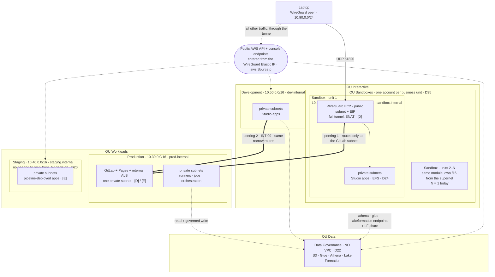
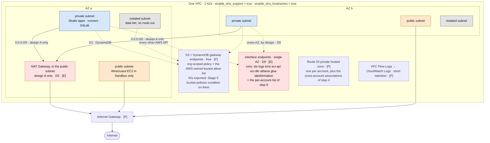
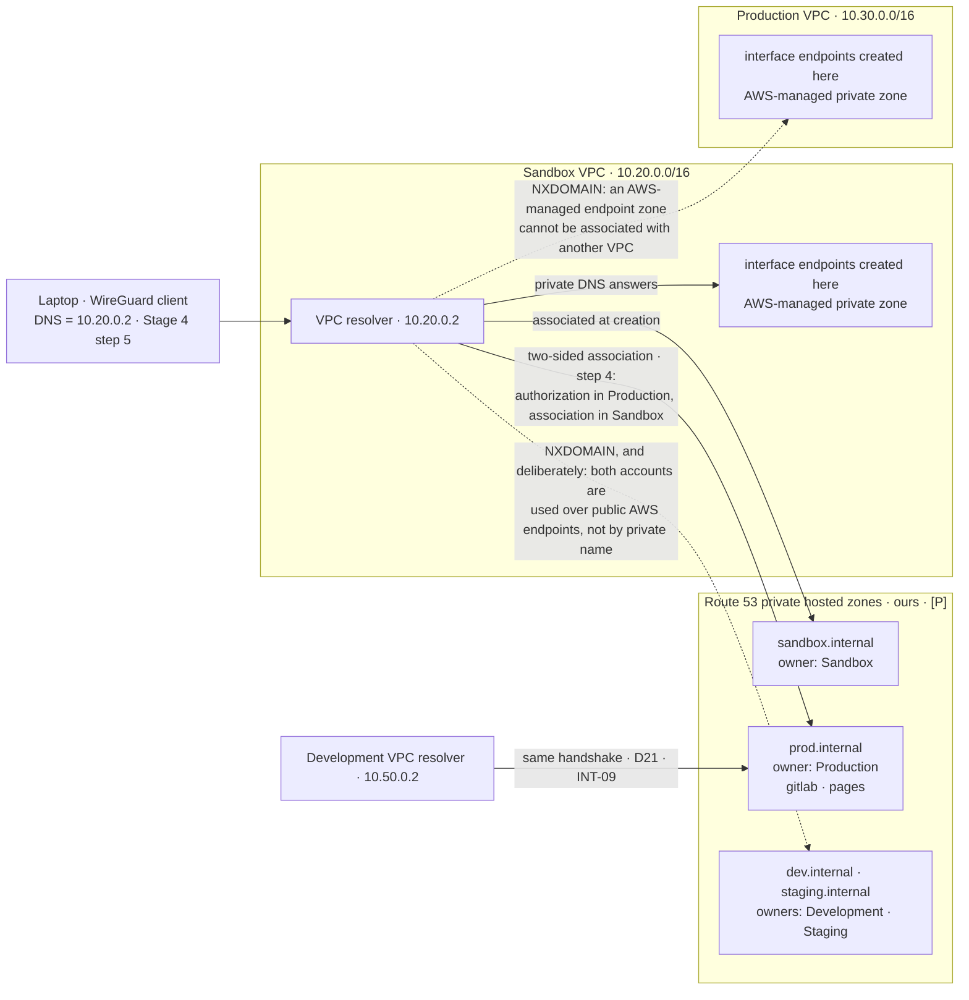

# Stage 3 — Networking

| | |
|---|---|
| **Status** | not started |
| **Prerequisites** | Stage 2. |
| **Consumes** | [D5](../decisions/D05-sagemaker-egress.md), [D9](../decisions/D09-az-count.md), [D14](../decisions/D14-supply-chain-account.md), [D15](../decisions/D15-tls-internal.md), [D18](../decisions/D18-data-scientist-access.md), [D20](../decisions/D20-staging-account.md), [D21](../decisions/D21-development-account.md), [D22](../decisions/D22-data-governance-account.md), [D35](../decisions/D35-sandbox-cardinality.md) |
| **Proves** | [INT-09](../integrations.md) |

*Read with [`plan/conventions.md`](../conventions.md) (naming, layout, `[P]`/`[D]`/`[E]`, IAM rules).*

---

**Objective:** the private networks that everything else sits in.

**Prerequisites:** Stage 2.

**Scope change (D14):** this stage builds the Production VPC as well, not just the Sandbox one. It has
to: GitLab lives in Production (Stage 7) and cannot be built before its network exists. The VPC layer is
free at rest, so there is no cost argument for deferring it, and using the same module for both accounts on
the same day is how the modules get proven.

**Scope change (D20, D21):** and the Staging and Development VPCs, for the same reason applied again.
Staging's `egress/` is applied by the promotion pipeline rather than by a person; Development's is part of
an ordinary working session. Four applications of one module on one day is a better proof of the module
than four applications spread across four stages. **The Data Governance account gets no VPC at all
(D22)** — its data plane is serverless (S3, Glue, Athena, Lake Formation), consumers reach it through
their own VPC endpoints, and an account whose SCP denies compute has nothing to put in a subnet.

---

**The proposed topology.** Two views of the same thing: what crosses an account boundary, and what one VPC
looks like inside. Both describe the *target* of this stage — none of it exists yet. Layers are
`plan/conventions.md` §5.1: `[P]` free at rest and never destroyed, `[D]` stopped between sessions,
`[E]` destroyed at the end of every session.

*View 1 — what crosses account boundaries.* The two solid peerings are the only VPC-level paths between
accounts; everything else is reached over public AWS endpoints, exited through the WireGuard Elastic IP
(`plan/architecture.md` §3, "How a human actually reaches each account").

*View 2 — inside one VPC.* The same `terraform-modules/vpc/` module produces this in all four
VPC-bearing accounts; only the CIDR and the interface-endpoint list differ.

Under **design B** the NAT node and both `0.0.0.0/0` routes simply do not exist, and the gateway endpoint
is the *only* path to the AWS-owned buckets of step 9 — which is why that allow-list is load-bearing rather
than tidy.

*View 3 — who resolves what.* Neither view above shows it, and it is where step 4 is lost: a name is
answered by the resolver of the VPC the query enters, so **the laptop's whole private namespace is whatever
the Sandbox VPC can resolve**. Solid edges are zones this project owns and can associate; dotted edges are
the two `NXDOMAIN`s — one to be fixed by step 4, one deliberate.

The consequence is the one sentence step 4 spends a paragraph on: **an AWS-service name that must resolve
privately for the laptop needs its endpoint in the Sandbox VPC** — a Production endpoint answers inside
Production only, and no association fixes it, because that zone is not ours to associate. GitLab escapes
this because it is reached through `prod.internal`, which *is* ours.

**To execute:**

The network is split across two slices per account, because the free half and the metered half have
different lifecycles (`plan/conventions.md` §5.1).

*`foundation/` — layer `[P]`, costs nothing at rest, never destroyed:*

1. `terraform-modules/vpc/`: VPC (`10.20.0.0/16` sandbox, `10.30.0.0/16` production, `10.40.0.0/16`
   staging, `10.50.0.0/16` development), 2 AZs, public + private + isolated (data) subnets. Applied to
   **every account that has a VPC** — Sandbox (one per business unit, D35), Development, Staging and
   Production. The ranges are non-overlapping even where no peering is planned — Staging is
   deliberately not peered (D20), but a CIDR chosen to overlap is a decision that cannot be revisited
   without rebuilding the VPC, and the address space costs nothing.
   **Forward constraint from D35, and this is the step where it is free.** `Sandbox` is one account **per
   business unit** — the other three stay singular — so the sandbox literal above is not an allocation
   scheme; it is a list somebody extends by hand, which is Lesson 14 in address space. Before writing the
   ranges, **reserve a supernet for the Sandbox class with room for the units that will exist, and allocate
   one `/16` per unit from a recorded table**. Production, Staging and Development keep their fixed ranges.
   The table is the artefact, not the literals. Doing this now costs a paragraph; doing it after the third
   business unit costs a VPC rebuild in an account somebody is working in.
2. Internet Gateway, route tables, NACLs, baseline security groups.
3. S3 and DynamoDB **gateway** endpoints — these are free, so they live here. Being `[P]` is not incidental:
   their IDs are what the Data Governance bucket policies condition on (Stage 5 step 1), so they must
   survive every `make down`. Export each account's gateway endpoint ID from this slice's outputs, so the
   consumer list is read through `terraform_remote_state` rather than pasted.
4. Route 53 private hosted zone per account (e.g. `sandbox.internal`, `prod.internal`). **These are the
   *only* zones this project owns before Stage 13** — D15 was revised on 2026-08-09 and there is no
   registered domain, no public zone and no split-horizon zone until the public web tier exists.
   **Two VPC attributes have to be on for any of this to work, and for private DNS on the interface
   endpoints in step 8 to work at all:** `enableDnsSupport` **and** `enableDnsHostnames`. They default to
   true only on the default VPC; a VPC built by Terraform gets `enable_dns_hostnames = false` unless it is
   set. Under egress design B — no NAT anywhere — an endpoint whose private DNS does not answer is not a
   slow path, it is no path.
   **A private hosted zone answers only for the VPCs it is associated with, and associating one across
   accounts is a two-sided handshake — this is the step that makes "reach GitLab by name over the VPN"
   work, and it was missing from earlier versions of this stage.** The laptop's DNS points at the *Sandbox*
   VPC resolver (Stage 4 step 5), so a query for `gitlab.prod.internal` is resolved by the Sandbox VPC and
   returns `NXDOMAIN` unless Production's zone is associated with the Sandbox VPC. Cross-account, that is
   `aws route53 create-vpc-association-authorization` **in the Production account** (the zone owner)
   followed by `associate-vpc-with-hosted-zone` **in the Sandbox account** (the VPC owner) — and Terraform
   splits it the same way, `aws_route53_vpc_association_authorization` plus
   `aws_route53_zone_association` behind a provider alias. **Two associations are needed** — it was three
   before D15's revision removed the split-horizon zone:
   - `prod.internal` ← Sandbox VPC (the VPN path to GitLab);
   - `prod.internal` ← Development VPC (D21: the `engineering` project clones from GitLab, INT-09).

   **What this mechanism does *not* extend to, and it is the trap one layer down.** The private DNS of an
   **interface VPC endpoint** is served by an AWS-*managed* hosted zone that is invisible in the account and
   cannot be associated with another VPC. So an endpoint created in Production answers only inside
   Production's VPC. The laptop's resolver is the *Sandbox* VPC (Stage 4 step 5), which means **any
   AWS-service name that must resolve privately for the laptop needs its endpoint in the Sandbox VPC**, or a
   private zone of our own holding ALIAS records to the endpoint's DNS name. It is not a problem today —
   every endpoint the laptop needs is already in Sandbox and GitLab is reached through `prod.internal`,
   which *is* ours — but it is the reason the provisioned-MWAA fallback carries a DNS step (Stage 10 step 4).

   Note the ordering trap: the authorization is deleted once the association exists, and re-creating the
   association after a VPC rebuild needs a fresh authorization. Both zones are `[P]`, so this is a
   once-per-account operation rather than a per-session one — which is the argument for putting the
   association in `foundation/` rather than anywhere `make down` can reach.
5. VPC Flow Logs to CloudWatch Logs with a short retention (a few days — retention is what costs).
   *(An earlier version of this stage carried a step 5b here: the `awsds-scp-recovery` role, in every
   SCP-governed account. **D30 was reverted, so nothing of the sort is built** — there is no standing SCP
   exemption anywhere in this design, and `foundation/` holds only the account's own `[P]` IAM.)*
6. **Sandbox ↔ Production VPC peering.** The requester lives in `sandbox/foundation/`, the accepter in
   `production/foundation/` (a provider alias, cross-account). Routes are added **per subnet, not per VPC**:
   the Sandbox private subnets reach only the Production subnet holding GitLab and the endpoints, and
   security groups reference the peer CIDR explicitly. Peering is a network path between an account where
   people experiment and the account that runs production — it earns a narrow route table, not a
   convenient one. This is also the path the VPN uses to reach GitLab (Stage 4).
   **Development ↔ Production peering as well (D21, INT-09), same shape:** Studio in Development must
   clone from and push to GitLab, so `development/foundation/` carries a second requester and
   `production/foundation/` a second accepter — the same narrow per-subnet routes, reaching only the
   GitLab subnet. Production now accepts two peerings and nothing else.
   **There is no peering to Staging from anywhere, and that is a decision rather than an omission (D20).**
   The two peerings into Production exist for one concrete reason — GitLab has to be reachable at the VPC
   level. Nothing in Staging needs that: the data scientists' read access there (D18) is data plane —
   S3, Athena, CloudWatch Logs — which reaches public AWS API endpoints through the tunnel, not through a
   peering. Building a third peering anyway would buy route-table complexity and one more hand-driven
   path into an account whose whole value is that nobody touches it by hand. Record it here so that the
   day something genuinely needs it, the question is reopened deliberately.

*`egress/` — layer `[E]`, destroyed at the end of every session:*

7. NAT Gateway — a single one, with a documented switch for one-per-AZ. **Built behind the D5 switch:**
   under egress design B (`plan/architecture.md` §4.3) the SageMaker subnets get no NAT route at all, so this resource is
   conditional, not assumed.
8. **Interface VPC endpoints — a per-account list, not one list** (revised 2026-08-08). Earlier versions
   of this plan carried a single working list applied to every VPC-bearing account. That was wrong in both
   directions: it paid for endpoints an account cannot use, and it left out the ones the data plane needs.
   The list is a variable of `terraform-modules/vpc/` with a documented default per **account role**.

   **The common core, in every account:** `sts`, `logs`, `kms`, `ecr.api`, `ecr.dkr`, plus the data-plane
   three — **`athena`**, **`glue`** and **`lakeformation`**.

   **Those three are the correction that matters, and they belong in *both* egress designs.** D13 routes
   every tabular read through an LF-aware engine, so `athena` and `glue` are how a notebook reaches its
   own data at all; under design B, with no NAT route anywhere, their absence means design B cannot execute
   a single query — it was not a cheaper design, it was an unbuildable one. `lakeformation` is the least
   certain of the three (in a plain Athena flow the credential vending happens service-side, not from your
   VPC; in a flow that resolves LF credentials client-side — `awswrangler`, Glue interactive sessions — it
   happens here). It is included at a cent an hour rather than discovered at Stage 6.

   **Then, per account role:**

   | Account | Adds | Notes |
   |---|---|---|
   | **Sandbox** | `sagemaker.api`, `sagemaker.runtime`, `sagemaker.studio`, `elasticfilesystem` | `sagemaker.studio` is required for JupyterLab/Code Editor apps in a VPC-only domain — they simply do not start without it |
   | **Development** | `sagemaker.api`, `sagemaker.runtime`, `sagemaker.studio` | **No `elasticfilesystem`** — D24 gives Development neither its own EFS nor a path to Sandbox's, so this endpoint would be a cent an hour resolving nothing |
   | **Staging** | `sagemaker.api`, `sagemaker.runtime` | No domain, so no `sagemaker.studio`. **No `lakeformation`** either — Staging is deliberately not on the Data Governance share (D20, D22), and an endpoint for a share that does not exist is a control smell, not just a cost |
   | **Production** | `sagemaker.api`, `sagemaker.runtime`, and under D7(B) `states` + `scheduler` | Holds the LF read **and governed write** share (D22), so `lakeformation` in the core list is load-bearing here rather than precautionary |

   **Under D5(B), the Interactive accounts add `codeartifact.api` and `codeartifact.repositories`** — the
   package path when there is no NAT.

   **Candidates deliberately not created yet, with the trigger for each**, so that "it must be a missing
   endpoint" is a checklist rather than a guess at 23:00:
   - **`datazone`** — if the VPC-only project apps call the domain for project context or connections.
     Unknown; **verify at Stage 6** and add it there if they do.
   - **`ssm` + `ssmmessages` + `ec2messages`** (Production) — Session Manager reaches GitLab in its private
     subnet through the NAT, but Production's NAT is `[E]` and only up during builds. The trigger is the
     first time you need to get into the GitLab host outside a build window. +0.030/h.
   - **`secretsmanager`** (Production) — for `gitlab-secrets.json` (Stage 7 step 1), same NAT caveat.
   - **`monitoring`** — if the CloudWatch agent on a private-subnet host cannot push metrics.

   Default to a **single AZ** during lab sessions (D9) — at ~USD 0.01/h per endpoint per AZ, two AZs
   doubles the largest hourly line item. A resource in the other AZ still resolves the endpoint DNS and
   reaches it; the cost is cross-AZ traffic and the loss of AZ redundancy, neither of which matters here.
9. **Endpoint policies — the trusted-networks axis of `plan/architecture.md` §4.2.** Every interface and gateway endpoint carries
   a policy restricting it to resources within the organization (`aws:PrincipalOrgID` / `aws:ResourceOrgID`).
   Without this, the S3 gateway endpoint is a private, unlogged, unmetered path to *any* bucket on the
   internet, including someone's personal one — which is the exact failure mode the whole DLP objective is
   about. Free. Take the policy shapes from the `data-perimeter-policy-examples` repository (`plan/architecture.md` §4.2) rather
   than writing them by hand — the service carve-outs are the part everyone forgets.
   **One carve-out that repository will not write for you, and that this project cannot do without.**
   `aws:ResourceOrgID` on the **S3 gateway** endpoint denies AWS's own service-owned buckets, because they
   are not in your organization — and several things this plan requires live in exactly those buckets:
   - the **Amazon Linux 2023 package repositories** (`al2023-repos-<region>-*`), so `dnf update` and every
     `yum`/`dnf install` on the WireGuard host, the GitLab host and any EC2-based runner stops working.
     `CLAUDE.md` asks in as many words to keep "the possibility of software updates" — this is the line
     that either honours that or quietly breaks it;
   - SageMaker's own regional buckets for built-in images, sample data and JumpStart artifacts;
   - the SSM agent and CloudWatch agent distribution buckets.

   `aws:ViaAWSService` does **not** rescue these: a `dnf` process on an instance is not an AWS service
   calling on your behalf, it is your own credential fetching an object. So the gateway endpoint policy
   needs a second, explicitly enumerated `Allow` statement listing the AWS-owned bucket ARNs the
   environment depends on, scoped to `s3:GetObject` (and `s3:ListBucket` where the client needs it). Write
   that list in the `vpc` module as a variable with a documented default, not inline — it is the statement
   most likely to be trimmed by someone tidying up, and its failure mode is a package manager that hangs
   rather than an `AccessDenied` anyone can read. Under egress design B this is not optional in any sense:
   with no NAT route at all, the endpoint is the *only* path to those buckets.
10. Keep this slice's route-table associations parameterised, so D5 (Stage 6) can insert a firewall or
    proxy into the egress path, or remove it entirely under design B, without reshaping the foundation.

**Deliverables:** every VPC applied by Terraform from the same module, with the Sandbox range taken from the
allocation table rather than from a literal (D35); flow logs visible; endpoints
resolving privately; both peerings reachable in the intended direction and *not* reachable outside the
permitted subnets; **Staging unreachable from any other VPC at the network level** — the proof that the
missing peering is missing on purpose; an attempt to reach an out-of-organization S3 bucket through the
gateway endpoint denied; and `make down` followed by `make up` restoring egress without touching any VPC.

**Cost note:** this is where the metered bill starts, and `egress/` is the single biggest hourly cost of
the lab. Per account, single AZ, at USD 0.010/h per endpoint and USD 0.050/h for a NAT gateway with its
public IPv4:

| Account | Design A (NAT) | Design B (no NAT) |
|---|---|---|
| Sandbox | 12 endpoints + NAT = **0.170/h** | 14 endpoints = **0.140/h** |
| Development | 11 + NAT = **0.160/h** | 13 = **0.130/h** |
| Staging | 9 + NAT = **0.140/h**, for the minutes a promotion runs | — (D5 governs the Interactive accounts) |
| Production | 10-12 + NAT = **0.150-0.170/h**, while runners or orchestration are up | — |

**Both designs got more expensive than the earlier figures (0.14 and 0.11), and the gap between them
survived**: design B is cheaper by exactly USD 0.030/h, which is the NAT and its address (0.050) minus the
two CodeArtifact endpoints (0.020). The plan's older claim that B trades the NAT for two endpoints and
comes out ahead turns out to be right — it was just right against a list that could not have run a query.
Keep the list minimal per account: every entry is a permanent hourly charge for the whole session, and the
per-account table above exists so that trimming one account does not silently trim another.
---

*Stage index: [stages/INDEX.md](INDEX.md) · Plan core: [GENERAL_PLAN.md](../../GENERAL_PLAN.md)*
